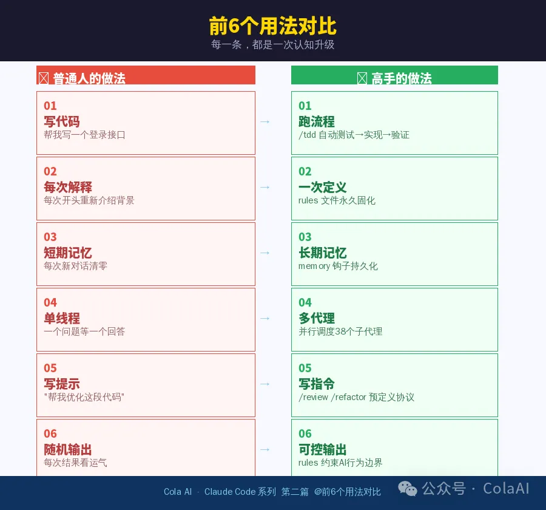

# 99%的人不会用，高手都在用的12个隐藏指令

**作者**：ColaAI  
**公众号**：ColaAI  
**发布时间**：2026年4月13日 08:31  
**原文链接**：[99%的人不会用，高手都在用的12个隐藏指令](https://mp.weixin.qq.com/s/d8fLthGOhLAfSZZEqYzn3g)

---
| 续上篇 · 深度实战版上篇回顾：你用的Claude Code可能只发挥了20%的能力99%的人不会用Claude Code高手都在用的12个隐藏指令从"跟AI聊天"到"调用系统"，差距在这里 |
| --- |
上一篇发完之后，后台收到留言：

| 「你说我只用了20%的能力，那剩下80%到底在哪？」 |
| --- |
这句话问得很好。

因为绝大多数人，根本没意识到一件事——

| 👉 你以为你在用AI👉 实际上，你只是"在跟它聊天" |
| --- |
而真正的高手，在做的是另一件事：

| 他们在"调用系统"而不是"写提示词" |
| --- |
今天这篇，我直接把差距讲透。

✦ ✦ ✦

## 一、真正的分水岭
你可以回想一下你平时怎么用：

▸ 打开Claude Code，输入需求

▸ 等它生成代码

▸ 不满意 → 再改一句

看起来没问题。但这种方式有一个致命缺陷：

| 每一次，你都在从零开始。 |
| --- |
你的项目背景、代码规范、历史决策——下一次对话全部清零。

而高手做的第一件事，是解决这个根本问题：

| 👉 让AI不再从零开始 |
| --- |
下面12个用法，不是"技巧"，而是**思维模式的分水岭**。

## 二、12个高手在用的隐藏用法

| 用法 01从「写代码」→「跑流程」 |
| --- |
| ❌ 普通人：帮我写一个登录接口✅ 高手：直接输入 /tddAI自动：写测试 → 写实现 → 跑验证 → 修复。你在要结果，他在启动流程。 |

| 用法 02从「每次解释」→「一次定义」 |
| --- |
| ❌ 普通人：每次开头都在介绍项目背景✅ 高手：用 rules文件把规则固化一次写进~/.claude/rules/，每次对话自动携带，永远不需要重复解释。把「提示词」变成「系统配置」。 |

| 用法 03从「短期记忆」→「长期记忆」 |
| --- |
| ❌ 普通人：每次新对话 = 清零✅ 高手：开启 memory持久化钩子会话结束自动把关键决策、踩过的坑、项目状态写进记忆文件。下次AI开口就知道你是谁、项目在哪个阶段。 |

| 用法 04从「单线程」→「多代理协作」 |
| --- |
| ❌ 普通人：一个问题，等一个回答✅ 高手：拆任务，多个子代理并行执行主代理负责规划，代码审查、安全扫描、测试验证各由专属代理处理。从「工具」升级成「团队」。 |

| 用法 05从「写提示」→「写指令」 |
| --- |
| ❌ 普通人：「帮我优化这段代码」✅ 高手：/review、/refactor、/analyze一个斜杠命令背后是完整执行协议——检查维度、输出格式、优先级全部预定义。你节省的不是打字时间，是思考框架的时间。 |

| 用法 06从「随机输出」→「可控输出」 |
| --- |
| ❌ 普通人：每次结果看运气✅ 高手：通过 rules约束AI的行为边界「不允许直接删文件」「修改前必须先写测试」——这些规则写进配置，AI就在你划定的轨道上运行，再也不会「越界」。 |

| 用法 07从「写完就算」→「自动验证」 |
| --- |
| ❌ 普通人：生成完直接拿去用✅ 高手：代码生成后必须经过测试链路post-tool hook在每次代码写入后自动触发：运行测试 → 检查覆盖率 → 不通过则打回重写。AI进入工程体系，不再游离在外。 |

| 用法 08从「一个工具」→「统一系统」 |
| --- |
| ❌ 普通人：Claude / Cursor / Codex各用各的配置✅ 高手：一套ECC规则跑遍4个平台不依赖某一个工具，而是掌控整个AI工作流——这才是真正的「抽象层升级」。 |

| 用法 09从「人工判断」→「自动安全」 |
| --- |
| ❌ 普通人：代码有没有漏洞靠肉眼✅ 高手：AgentShield自动拦截危险模式102条安全规则，覆盖SQL注入、命令注入、路径穿越等常见漏洞。pre-tool hook在执行前拦截，事故在发生前被消灭。 |

| 用法 10从「任务执行」→「任务编排」 |
| --- |
| ❌ 普通人：一步一步问，等一步一步答✅ 高手：定义 workflow，AI自主拆解执行「接收需求 → 拆解任务 → 分配子代理 → 汇总结果」，整条流水线一次触发。AI开始真正「自己干活」。 |

| 用法 11从「临时使用」→「长期积累」 |
| --- |
| ❌ 普通人：用完即忘，下次重头来✅ 高手：把经验沉淀成可复用 skill模块每解决一类问题，就抽象成一个技能文件。个人skill库越积越厚，AI越用越聪明。经验从「消耗品」变成「资产」。 |

| 用法 12 · 最关键从「工具思维」→「系统思维」 |
| --- |
| ❌ 普通人：AI= 更强的搜索引擎✅ 高手：AI= 可编程的执行系统前11条都是具体技法，这一条是底层认知。你在「用工具」，他在「搭系统」。思维模式不同，同样的工具，产出可以差10倍。 |
● ● ●

## 三、一个扎心的真相
很多人以为，AI编程的差距来自模型能力。但现实是：

| 普通人的工作流：一条一条写提示词，等一条一条结果高手的工作流：一次配置，让AI自动跑完整流程 |
| --- |

| 用GPT-4o搭了一套系统的人，产出可以远超用Claude Opus「聊天」的人。模型差距 ≠ 生产力差距。 |
| --- |

## 四、为什么你一直没用起来？
说一个很多人不愿意承认的点——

不是你不会写提示词，而是你一直在用**错误的姿势**用AI。

| 两种工作方式对比 |
| --- |
| 你在做的临时调用 · 即用即弃 · 不可复用 · 每次重新解释 |
| 高手在做的系统配置 · 持续复用 · 自动执行 · 越用越聪明 |
两种方式的差距，靠更努力是弥补不了的。它需要的，是一次**认知升级**——

从「用工具」到「搭系统」。

✦ ✦ ✦

## 五、下一步，让AI开始「自己干活」
如果你现在还在一句一句喂提示词、每次从头开始——你还停留在第一阶段。

而下一阶段，是这样的：

| 下篇预告如何把Claude Code变成你的「自动开发员工」自动接任务 · 自动拆解需求自动写代码+测试 · 自动检查安全 |
| --- |

📚 系列回顾

| 第一篇：你用的Claude Code可能只发挥了20%的能力everything-claude-code：10万Star开源框架完整介绍系列第一篇 |
| --- |

| 第二篇（本篇）：99%的人不会用，高手都在用的12个隐藏指令普通人 vs 高手的真正分水岭当前阅读 |
| --- |

| 第三篇（即将）：把Claude Code变成你的「自动开发员工」完整自动化工作流搭建实战，点赞过500即发布敬请期待 |
| --- |

| 💬 这12个用法，你现在用到了几个？留言告诉我哪个对你最陌生——我优先在下篇讲透 |
| --- |
👍 点赞、收藏支持

---

> ⚠️ 以下图片未能从正文 HTML 中定位，按下载顺序追加：

