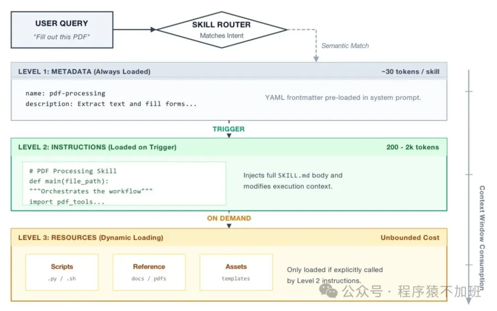

# AI入门——一文读懂什么是Skill以及如何开发Skill

**作者**：程序猿某人  
**公众号**：程序猿不加班  
**发布时间**：2026年3月30日 08:30  
**原文链接**：[AI入门——一文读懂什么是Skill以及如何开发Skill](https://mp.weixin.qq.com/s/lZh4iy_EI9hPX3FV6oWt5Q)

---
# Skills（技能）的基本概念

## Skills（技能）：Agent 的「能力模块」

- • 本质：Agent 能调用的「可复用、模块化的功能」—— 每个 Skill 对应一个具体的「做事能力」，通常是函数 / API / 脚本。
- • 常见类型：◦ 基础 Skill：文本总结、翻译、格式转换；
- ◦ 工具类 Skill：调用天气 API 查天气、调用数据库查订单、调用邮件服务发邮件；
- ◦ 复杂 Skill：写 Python 代码、执行 Shell 命令、生成 Excel 报表。
• **工作方式：**① Agent 通过 Prompt 识别「需要用到的 Skill」（比如用户问「查一下我的订单退货进度」→ 触发「查询订单 Skill」）；

② Agent 调用对应的 Skill 函数，传入参数（比如订单号）；

③ Skill 执行后返回结果，Agent 再根据 Prompt 规则整理结果反馈给用户。

举个 Skill 调用的简化代码逻辑（Python）：

```
# 定义「查询订单」Skilldef check_order_skill(order_id):    # 调用订单数据库API    result = db_api.get_order_status(order_id)    return result# Agent逻辑：识别需求→调用Skill→返回结果user_input = "查订单12345的退货进度"order_id = extract_order_id(user_input)  # 从用户输入提取订单号（Prompt定义的规则）skill_result = check_order_skill(order_id)  # 调用Skillfinal_answer = format_result(skill_result)  # 按Prompt格式整理print(final_answer)
```

## Skill和Prompt的区别与联系
在前面AI入门——什么是提示词（Prompt）以及如何写好提示词？一文中我们介绍了提示词Prompt，那么Skill相比于提示词Promot又能带来什么新的变化呢？

可以把两者先用一句话区分开：

- • `Prompt`是“给模型的一次性指令表达”
- • `Skill`是把一类可复用的 prompt + 工作流 + 资源约束打包成模块化能力
所以 Skill 不是 Prompt 的对立面，而更像是：**结构化、可复用、可发现、可按需加载**的 Prompt 工程产物。

### Skill和Prompt的相同点
从本质上看，Skill 仍然建立在 Prompt 之上。无论一个 Skill 多么工程化，最终都需要通过上下文注入的方式让模型理解，例如：

- • system prompt
- • developer prompt
- • tool description
- • tool result
- • hidden context
- • synthetic message
所以可以理解为：

> Skill = Prompt + 触发机制 + 资源组织 + 执行约定 + 权限/作用域管理
也就是说：

- • Prompt 更偏“内容”
- • Skill 更偏“机制 + 容器 + 生命周期”

##### 1. 都用于影响模型行为
无论是 Prompt 还是 Skill，目的都是引导模型如何理解任务、如何输出结果、如何遵守约束。

##### 2. 都依赖上下文注入
它们都不是修改模型参数，而是通过输入上下文来影响模型推理过程。

##### 3. 都可以包含相似的信息结构
一个高质量 Prompt 和一个高质量 Skill，通常都可能包含：

- • 角色
- • 背景
- • 任务目标
- • 约束条件
- • 输出格式
- • 示例
- • 注意事项

##### 4. 都会影响输出稳定性
写得好的 Prompt 能提高结果质量，设计得好的 Skill 也能显著提升稳定性和一致性。

##### 5. 都需要持续迭代优化
Prompt 和 Skill 都不是一次写完就永远正确，通常需要根据实际效果不断调整。

##### 6. 都属于 Prompt Engineering 的范畴
从广义上讲，Skill 仍然属于 Prompt Engineering，只是它更加工程化和结构化。

### Skill和Prompt的区别

##### 1. 粒度不同

- • Prompt 通常面向一次请求或单次任务。
- • Skill 通常面向一类重复出现的任务。

##### 2. 生命周期不同

- • Prompt 往往是临时的、一次性的。
- • Skill 往往是长期存在、可复用、可版本管理的。

##### 3. 复用方式不同

- • Prompt 往往通过复制、模板或人工复用。
- • Skill 往往由客户端自动发现、匹配、加载和注入。

##### 4. 触发方式不同

- • Prompt 通常由用户直接输入。
- • Skill 可以自动触发，也可以手动显式调用。

##### 5. 结构化程度不同

- • Prompt 可以是一段自由文本。
- • Skill 一般有固定结构，例如 `SKILL.md`、`scripts/`、`references/`、`assets/` 等。

##### 6. 工程集成程度不同

- • Prompt 更偏向“和模型对话”。
- • Skill 更偏向“作为 Agent Runtime 中的能力模块”。

##### 7. 可发现性不同

- • Prompt 不会被系统主动发现和管理。
- • Skill 通常会被客户端扫描、索引，并暴露给模型进行选择。

##### 8. 权限管理不同

- • Prompt 一般没有独立权限体系。
- • Skill 在很多 Agent 系统中可以单独控制访问权限，例如 allow、deny、ask。

##### 9. 资源承载能力不同

- • Prompt 主要承载文本。
- • Skill 除了文本，还可以挂载脚本、模板、参考文档和静态资源。

##### 10. 执行方式不同

- • Prompt 往往是模型读完后直接回答。
- • Skill 往往是模型读完后继续调用工具、脚本或参考资料来完成任务。

##### 11. 适用场景不同

- • Prompt 适合探索性、临时性、开放性任务。
- • Skill 适合重复性、流程化、专业化任务。

##### 12. 维护方式不同

- • Prompt 更偏个人使用、分散维护。
- • Skill 更适合团队共享、版本控制和协作演进。

## Skill和Prompt的对比总结
**相同点**

- • 都用于引导模型行为
- • 都依赖上下文注入
- • 都可以包含目标、约束、步骤和示例
- • 都会影响输出质量和稳定性
- • 都需要持续优化
- • 都属于广义 Prompt Engineering
**区别点**

- • Prompt 面向单次任务，Skill 面向重复任务
- • Prompt 偏临时输入，Skill 偏长期沉淀
- • Prompt 是自由文本，Skill 是结构化模块
- • Prompt 通常手动输入，Skill 可以自动匹配和调用
- • Prompt 通常无独立权限，Skill 通常可做权限控制
- • Prompt 主要是文本，Skill 可附带脚本和资源
- • Prompt 偏表达需求，Skill 偏封装工作流
- • Prompt 适合即时交互，Skill 适合工程化复用

## 什么时候使用 Prompt，什么时候使用 Skill

### 适合直接写 Prompt 的场景

- • 一次性任务
- • 探索性需求
- • 需求尚不稳定
- • 快速试验输出效果
- • 没有长期复用价值

### 适合沉淀为 Skill 的场景

- • 某类任务经常重复出现
- • 工作步骤比较固定
- • 对输出一致性要求高
- • 需要配套脚本、模板或参考资料
- • 希望团队共享和版本化维护
一句话总结：

> 重复、稳定、可流程化的 Prompt，值得进一步抽象成 Skill。

# 如何开发一个Skill

## Skill的官方规范
参考agentskills官方规范：https://agentskills.io/home

### skill的目录结构

```
skill-name/
├── SKILL.md          # Required: metadata + instructions
├── scripts/          # Optional: executable code
├── references/       # Optional: documentation
├── assets/           # Optional: templates, resources
└── ...               # Any additional files or directories
```

#### `skill-name/`
这是 skill 的根目录，也是一个技能包的边界。

它的作用是：

- • 作为一个独立 skill 的容器
- • 承载这个 skill 的所有文件
- • 让客户端按目录为单位发现和管理 skill
通常这个目录名要和 `SKILL.md` frontmatter 里的 `name` 一致，例如：

```
pdf-processing/
```
对应：

```
---
name: pdf-processing
description: ...
---
```
这样客户端才能正确建立索引和匹配关系。

#### `SKILL.md`
这是 **skill 最核心、也是必需的文件**。

它通常承担两层职责：

1. 1. 元数据 也就是让客户端和模型知道： - ◦ 这个 skill 叫什么 - ◦ 它做什么 - ◦ 什么时候应该使用
2. 2. 主说明书 也就是告诉模型： - ◦ 遇到这类任务怎么做 - ◦ 推荐的步骤是什么 - ◦ 有哪些约束 - ◦ 哪些边界需要注意
通常包括：

- • YAML frontmatter
- • Markdown 正文说明
例如：

```
---
name: deploy-app
description: Deploy an app to staging or production. Use when the user asks for deployment, release, or rollout tasks.
---

# Deploy App

## When to use
...

## Instructions
...
```
`SKILL.md` 之所以必须存在，是因为在 skill 的加载链路里：

- • 客户端先读 `name` 和 `description`
- • 建立 skill catalog
- • 模型根据 `description` 判断是否要激活 skill
- • 激活后再读完整正文
所以 `SKILL.md` 是 skill 的核心入口。

#### `scripts/`
这是 **可执行脚本目录**，是可选的。

当 skill 不只是“给建议”，还需要执行一些确定性动作时，就可以把这些动作写成脚本放在这里。

例如：

- • `scripts/deploy.sh`
- • `scripts/validate.py`
- • `scripts/generate_report.js`
这类脚本适合承载：

- • 稳定、可重复执行的程序化动作
- • 带明确输入输出的流程脚本
skill 里可能会写：

```
Run:
scripts/validate.py
```
然后 agent 看到后，会调用 shell、python 或其他工具执行它。

#### `references/`
这是 **参考文档目录**，也是可选的。

它用来存放不适合全塞进 `SKILL.md` 正文的补充资料，例如：

- • 详细流程说明
- • 领域知识
- • 输入输出规范
- • 术语定义
- • 常见问题
- • 边界条件说明
拆到 `references/` 的好处是支持**渐进式加载**：

- • 启动时只读 `name` 和 `description`
- • 激活时读 `SKILL.md`
- • 需要深入细节时，再按需读取 `references/` 里的内容
例如：

```
references/
├── REFERENCE.md
├── API-GUIDE.md
├── TROUBLESHOOTING.md
└── EDGE-CASES.md
```

#### `assets/`
这是 **静态资源目录**，也是可选的。

它用来存放 skill 运行或输出时需要引用的静态文件，例如：

- • 模板文件
- • 配置样例
- • 图片
- • JSON Schema
- • 样本文档
- • 映射表
- • 表单模板
可以简单理解为：

- • `references/` 偏“给模型看的说明文档”
- • `assets/` 偏“任务执行时要用到的材料”
例如：

```
assets/
├── config-template.json
├── report-template.md
├── architecture.png
└── schema.json
```

#### `...` 其他额外目录
这表示 skill 目录里除了标准推荐目录，还可以有自定义内容，例如：

- • `examples/`
- • `tests/`
- • `data/`
- • `docs/`
- • `agents/openai.yaml`
这些并不是 Agent Skills 最小标准必须识别的部分，但某些客户端或某些 skill 作者会用它们做扩展。

也就是说：

- • skill 目录可以扩展
- • 但真正“有通用标准语义”的通常还是 `SKILL.md`、`scripts/`、`references/`、`assets/`

## 从运行机制角度理解skill目录结构
如果把这个目录结构放进 skill 的实际生命周期里，会更容易理解：

1. 1. 启动时，客户端通常只关注： - ◦ skill 目录名 - ◦ `SKILL.md` frontmatter 里的 `name` - ◦ `description`
2. 2. 激活 skill 时，客户端会加载： - ◦ `SKILL.md` 正文
3. 3. 执行过程中，如果 skill 正文引用了： - ◦ `scripts/xxx` - ◦ `references/xxx` - ◦ `assets/xxx` agent 再按需读取这些内容
所以这个结构本质上是一个**分层加载结构**：

- • `SKILL.md` frontmatter：发现和匹配
- • `SKILL.md` body：主 instructions
- • `references/`、`scripts/`、`assets/`：按需细化和执行
- • `SKILL.md(Required)`：一个Skill必须包含一个名为`SKILL.md`的文件，且`SKILL.md`必须以yaml格式定义的元数据开头，元数据定义了这个skill的名字`name`和描述`description`字段。
- • `scripts(Optional)`：

## 从示例中角度理解工作过程
比如一个叫 `deploy-app` 的 skill：

```
deploy-app/
├── SKILL.md
├── scripts/
│   ├── validate.sh
│   └── deploy.sh
├── references/
│   ├── TROUBLESHOOTING.md
│   └── ROLLBACK.md
├── assets/
│   └── nginx.conf.template
```
它们的职责可以这样分：

- • `SKILL.md` 说明什么时候部署、部署步骤是什么、先做什么检查
- • `scripts/validate.sh` 实际做部署前校验
- • `scripts/deploy.sh` 实际执行部署
- • `references/TROUBLESHOOTING.md` 失败时查问题
- • `references/ROLLBACK.md` 回滚流程参考
- • `assets/nginx.conf.template` 部署时需要的配置模板
这说明 skill 已经不只是“提示词”，而更像一个小型工作流包。

## skill开发最终总结
这个目录结构的设计目标，是把一个 skill 拆成三层：

- • 发现层：通过 `SKILL.md` 的元数据知道它是什么
- • 指令层：通过 `SKILL.md` 正文知道该怎么做
- • 资源层：通过 `scripts/`、`references/`、`assets/` 支撑复杂任务执行
所以 skill 目录**不是简单的“一个 prompt 文件夹”，而是一个面向 agent 的、支持渐进式加载的能力包**。

# Skills（技能）渐进式披露架构
对于渐进式披露架构，建议阅读论文： Agent Skills for Large Language Models: Architecture, Acquisition, Security, and the Path Forward

> Xu, R., & Yan, Y. (2026). Agent skills for large language models: Architecture, acquisition, security, and the path forward. arXiv preprint arXiv:2602.12430.
****


****

**Skill 渐进式披露架构**的特点，就是把 `skill`分成“可发现的元数据（`LEVEL 1: METADATA`）、激活后的主说明(`LEVEL 2: INSTRUCTIONS`)、执行时的补充资源(`LEVEL 3: RESOURCES`)”三层，**按任务需要逐步加载，从而减少上下文浪费、提高匹配效率和执行稳定性。**

---

> ⚠️ 以下图片未能从正文 HTML 中定位，按下载顺序追加：

