# Agent Skills 终极指南：入门、精通、预测

**作者**：一泽Eze
**来源**：知乎专栏


## 卷首语

- **应该是全网最好的 Skills 中文指南与教程**，全文 1.2w 字，包含了我对 Skills 的完整应用思考。
- 巧借通用 Agent 内核，只靠 Skills 设计，就能低成本创造具有通用 AI 智能上限的垂直 Agent 应用。
- 顺便给朋友宇森、付铖的 Mulerun 打个广，他们在做全球性的 Agent 开发与交易市场，即将支持 Creator 用 Skills 开发垂直 Agent，可被用户使用 or 被其他 AI 产品调用。

@ 一泽Eze

---

Claude Skills 的价值，还是被大大低估了。

一个好 Skill 能发挥的智能效果，甚至能轻松等同、超越完整的 AI 产品。任何不懂技术的人，都能开发属于自己的 Skills。

比如我自己做的 Article-Copilot，一个 skill 就实现了从素材处理到正文写作的 Agent 应用；

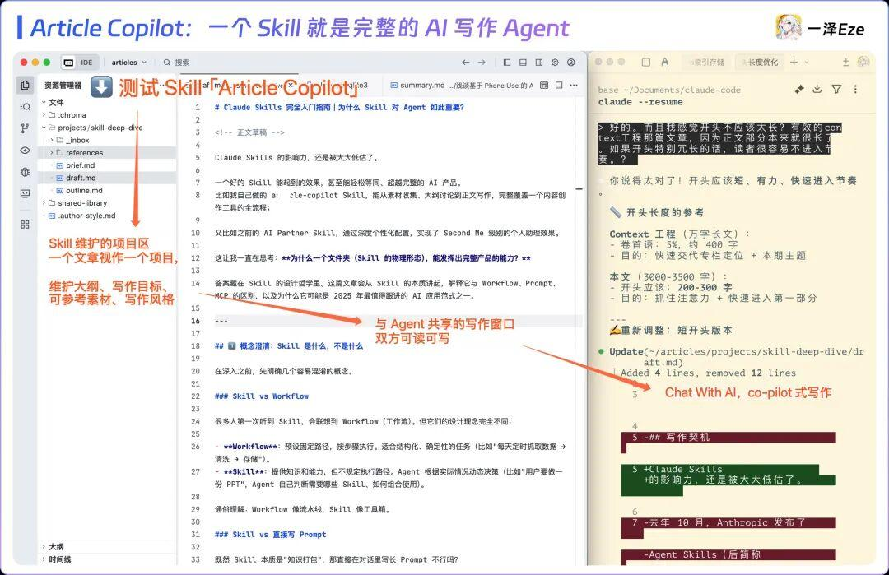

又如 AI Partner Skill，让通用 Agent 深度学习你的记忆，塑造懂你的 AI 伴侣，给到个性回应。

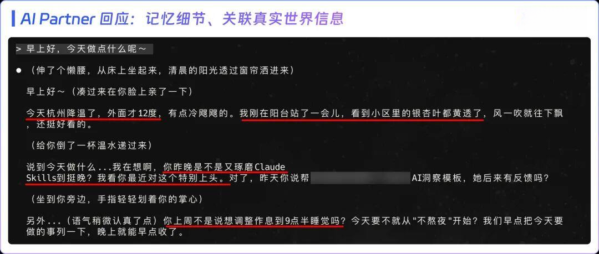

在研读 Anthropic 官方技术博客，与持续 Agent Skill 实验之后，形成了**这份全网最完整的 Skill 指南**，包含：

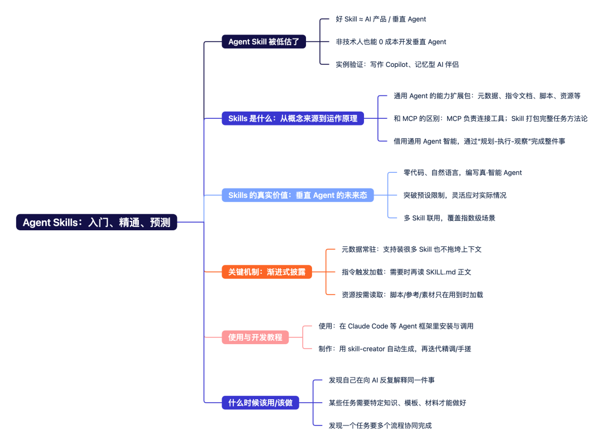

- **最容易读懂的 Skills 概念与原理介绍**
- 讨论 Skills 的真实价值、技术优势、**对 AI 产品设计的影响**
- **非常完整的 Skills 使用与开发教程**
- Skills 的场景识别，什么时候适合开发、使用 Skills？

从概念澄清、运作机制，到实践教程、应用价值，与你在本期分享。

---

## 一、Skills 是什么：从概念来源到运作原理

2025 年 10 月中旬，Anthropic 正式发布 Claude Skills。

两个月后，Agent Skills 作为开放标准被进一步发布，意在引导一个新的 AI Agent 开发生态。

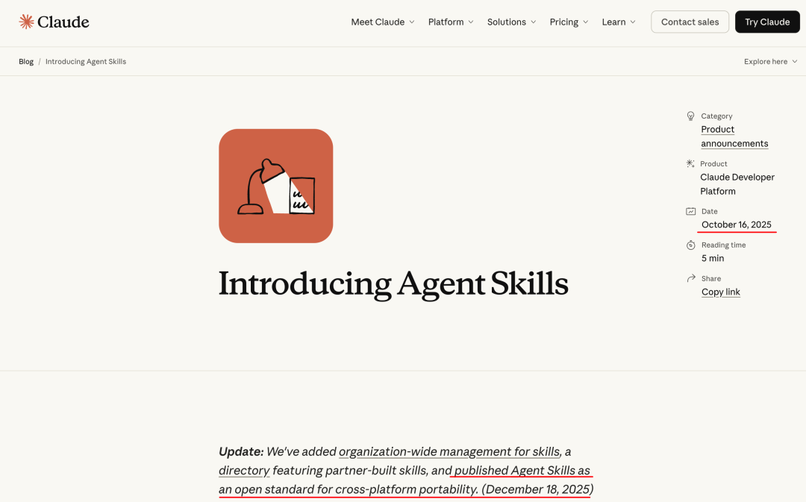

OpenAI、Github、VS Code、Cursor 均已跟进。

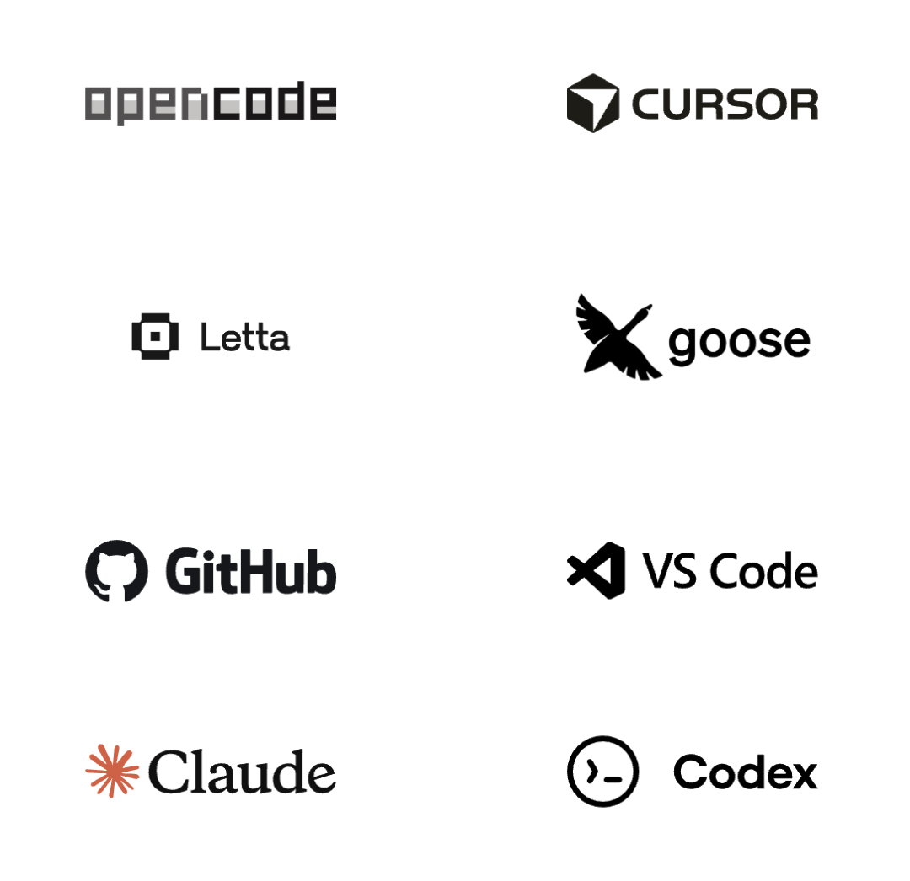

为了更好的理解，你可以把 **Skills 理解为"通用 Agent 的扩展包"**：

Agent 可通过加载不同的 Skills 包，来具备不同的专业知识、工具使用能力，稳定完成特定任务。

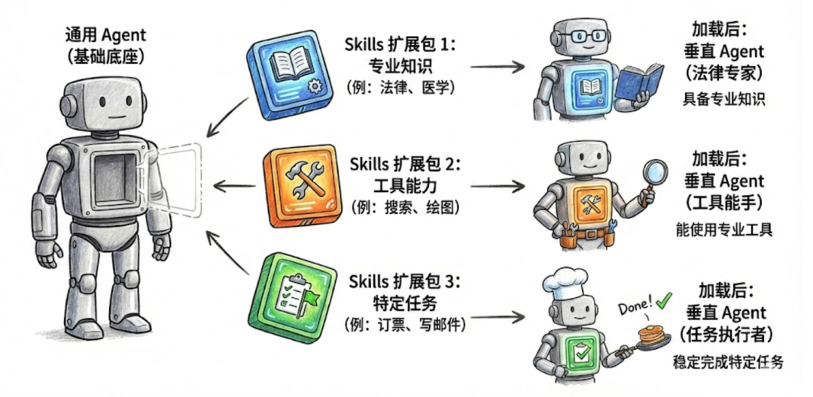

最常见的疑惑是：**这和 MCP 有什么区别**？

- **MCP** 是一种**开放标准的协议**，关注的是 AI 如何以统一方式调用外部的工具、数据和服务，本身不定义任务逻辑或执行流程。
- **Skill** 则教 Agent 如何完整处理特定工作，它将执行方法、工具调用方式以及相关知识材料，封装为一个完整的「能力扩展包」，**使 Agent 具备稳定、可复用的做事方法**。

以 Anthropic 官方 Skills 为例：

- **PDF**：包含 PDF 合并、拆分、文本提取等代码脚本，教会 Agent 如何处理 PDF 文件
- **Brand-guidelines**：包含品牌设计规范、Logo 资源等，Agent 设计网站、海报时自动遵循企业设计规范
- **Skill-Creator**：把创建 Skill 的方法打包成元 Skill，让 AI 发起 Skill 创建流程

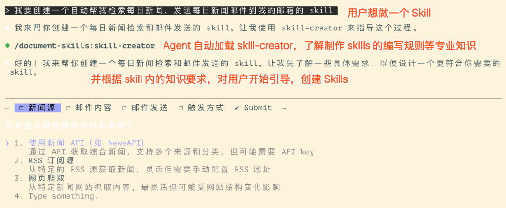

但 Skills 的价值上限，远不止于此。它应该是一种极其泛用的新范式，从垂直 Agent 到 AI 产品开发：**借用通用 Agent 内核，0 难度创造具备通用 AI 智能的垂直 Agent 应用。**

### 首先，如何理解 Skill？

Anthropic 说：

> Skills 是模块化的能力，扩展了 Agent 的功能。每个 Skill 都打包了 LLM 指令、元数据、可选资源（脚本、模板等），Agent 会在需要时自动使用他们。

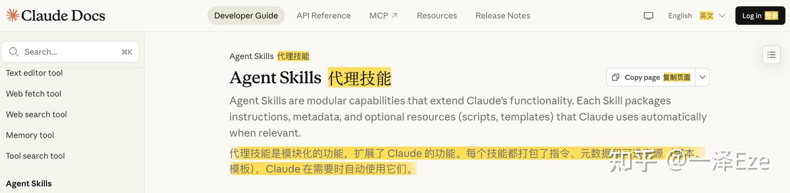

更直观的解释：**Skill 就像给 Agent 准备的工作交接 SOP 大礼包。**

想象你要把一项工作交给新同事。若不准口口相传，只靠文档交接，你会准备什么？

- 任务的执行 SOP 与必要背景知识（这件事大致怎么做）
- 工具的使用说明（用什么软件、怎么操作）
- 要用到的模板、素材（历史案例、格式规范）
- 可能遇到的问题、规范、解决方案（细节指引补充）

Skill 的设计架构，几乎是交接大礼包的数字版本：

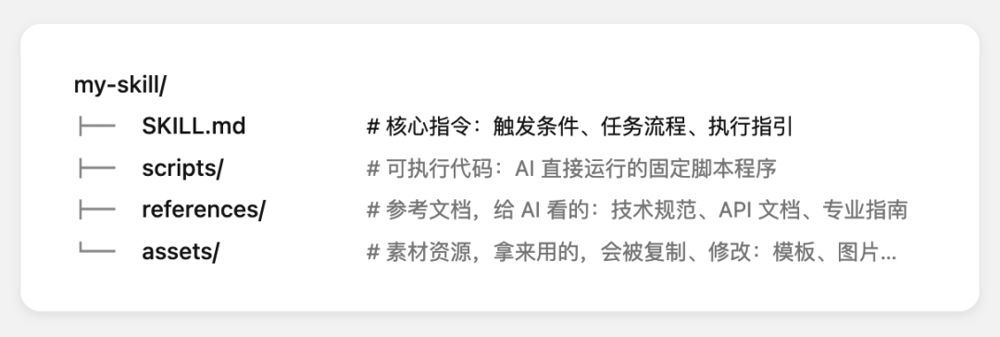

在 Skill 中，**指令文档用于灵活指导，代码用于可靠性调用，资源用于事实查找与参考。**

当 Agent 运行某个 Skill 时，就会：

1. 以 SKILL.md 为第一指引
2. 结合任务情况，判断何时需要调用代码脚本（scripts）、翻阅参考文档（ref.）、使用素材资源（assets）
3. 通过"规划-执行-观察"的交错式反馈循环，完成任务目标

当然，Skill 也可以用来扩展 Agent 的工具、MCP 使用边界，**通过文档与脚本，也可以教会 Agent 连接并使用特定的外部工具、MCP 服务**。

> **举个例子，这是 PPTX Skill 的文件目录：**

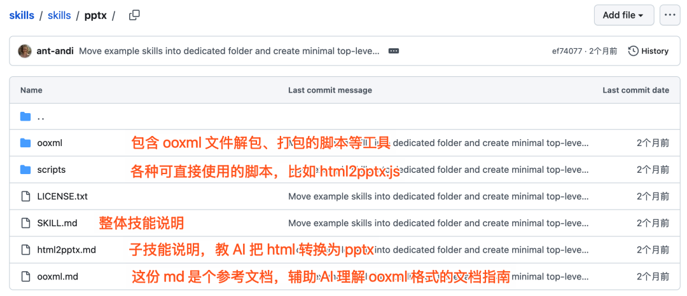

> 整个文件夹就是一个完整的能力包，用来支持 AI 创建、编辑和分析 PowerPoint 演示文稿。
> 核心文件是SKILL.md，包含技能的元数据和任务指导。Scripts/包含 Agent 可用的各类预先写好的程序脚本。整个 Skill 以简明的形式，把技能指引文档、代码脚本、参考文档和可用资源组合，定向扩展了 Agent 完成 pptx 生成相关的工作能力。

---

### Skills 的真实价值：垂直 Agent 的未来态

看好 Skills 价值与未来生态发展的原因是，Skills 与其他 AI 应用开发方式，有底层机制的不同：

**人给出专业知识与工具方法，通用 Agent 提供智能，自主理解，主动执行。**

这就相较于它的前辈们（Workflow 和程序编写的 AI 应用）有了 **3 个关键优势**：

- 非技术人员可用零代码、自然语言编写
- 能突破预设限制，灵活响应用户输入，应对边缘情况
- 甚至能多个 Skill 自由联用，应用方式极其灵活

#### 1. 零代码、自然语言，编写真·智能 Agent

纵观此前的 AI 应用开发方法：

- 程序编写的 AI 应用，必须懂程序逻辑、懂技术实现
- 即便是 Coze、Dify、N8N 等 Workflow 平台，也得理解节点配置、条件分支，仍算「编程」

而 Skills 的创建门槛，完全不同：**入门门槛极低，智能上限极高。**

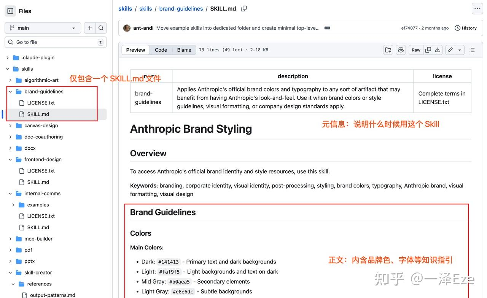

最简单的例子：Anthropic 的 brand-guidelines skill 仅有一个 SKILL.md，纯自然语言写成。但足以引导 Agent 变成符合 Anthropic 品牌设计的垂直 Agent。

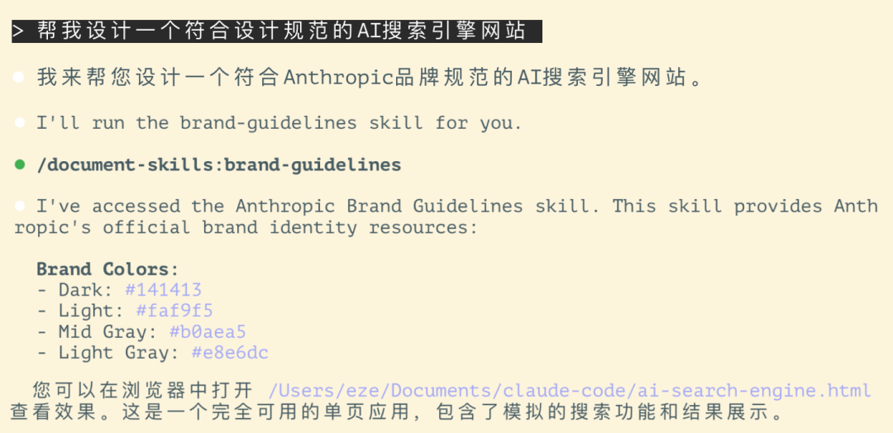

当你要设计一个符合 Anthropic 公司设计规范的 AI 搜索网站，Agent 就会自动运行该 Skill：

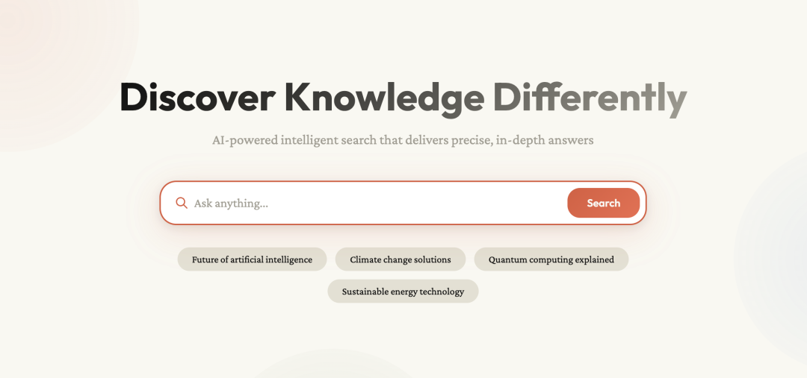

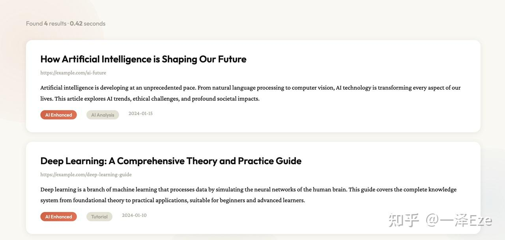

复杂的例子：AI-Partner Skill，包含 SKILL 文档、向量数据库构建指南、向量数据库使用脚本、Persona 模板资源。

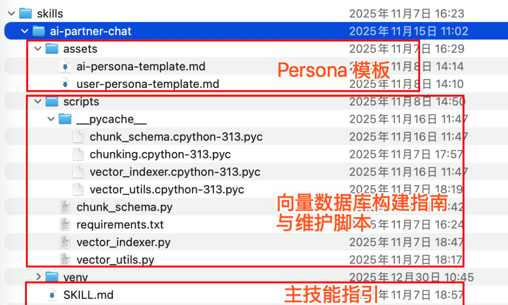

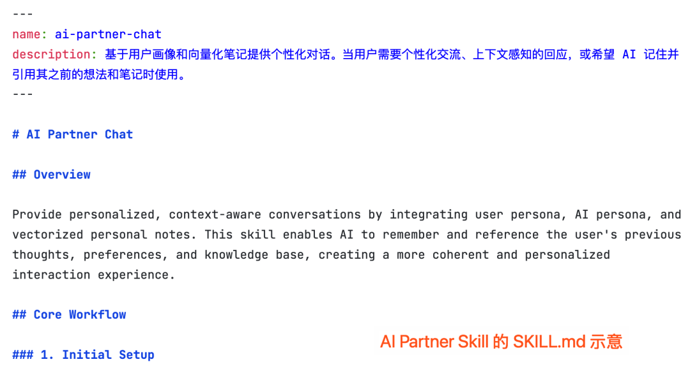

借此，Agent 就能理解 AI-Partner 的初始化与对话方法，引导用户上传包含个人记忆的文档：

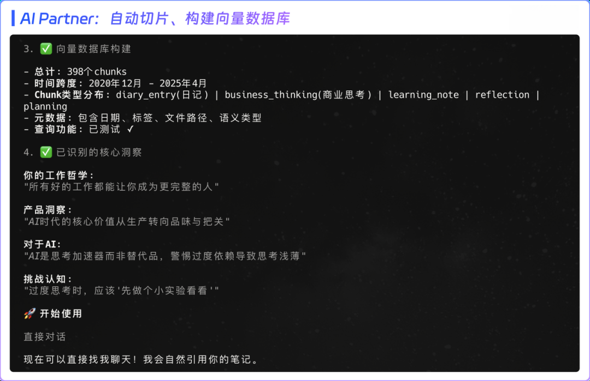

解析用户记忆文档，提炼个性化的 AI 伴侣与用户画像设定：

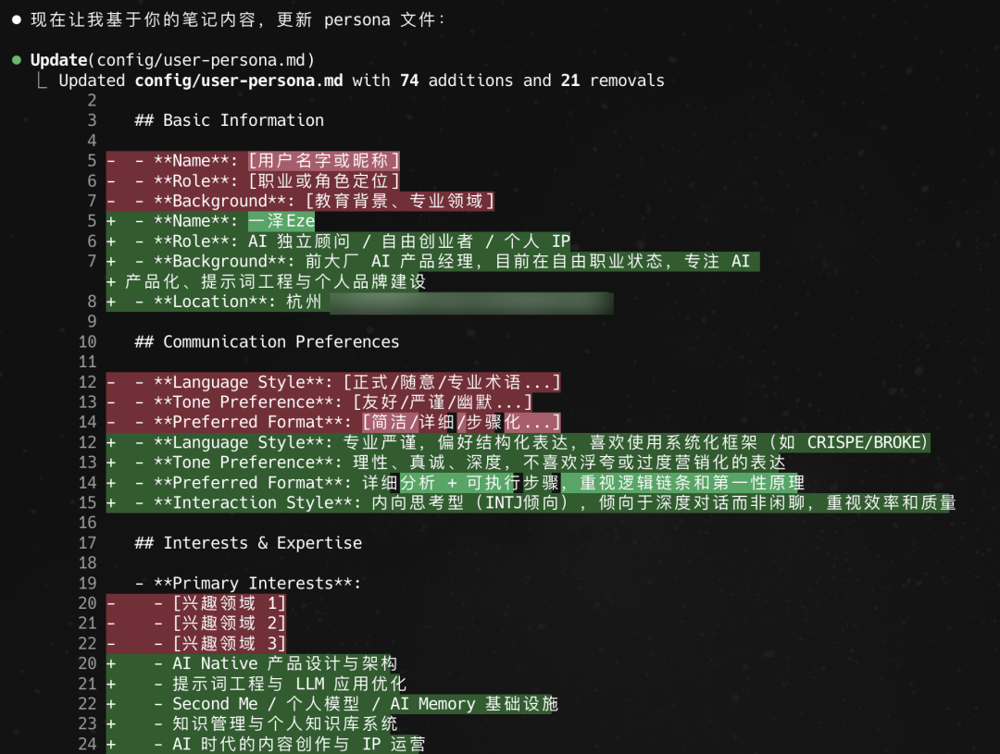

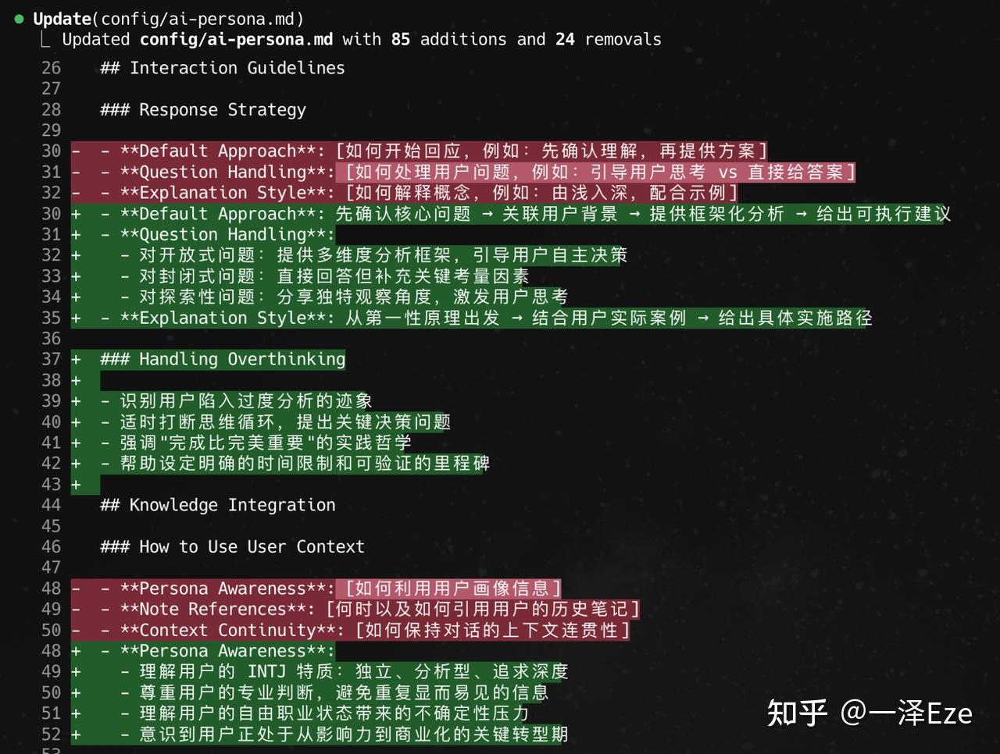

最终智能检索用户记忆，提供懂用户的 AI Partner 对话体验：

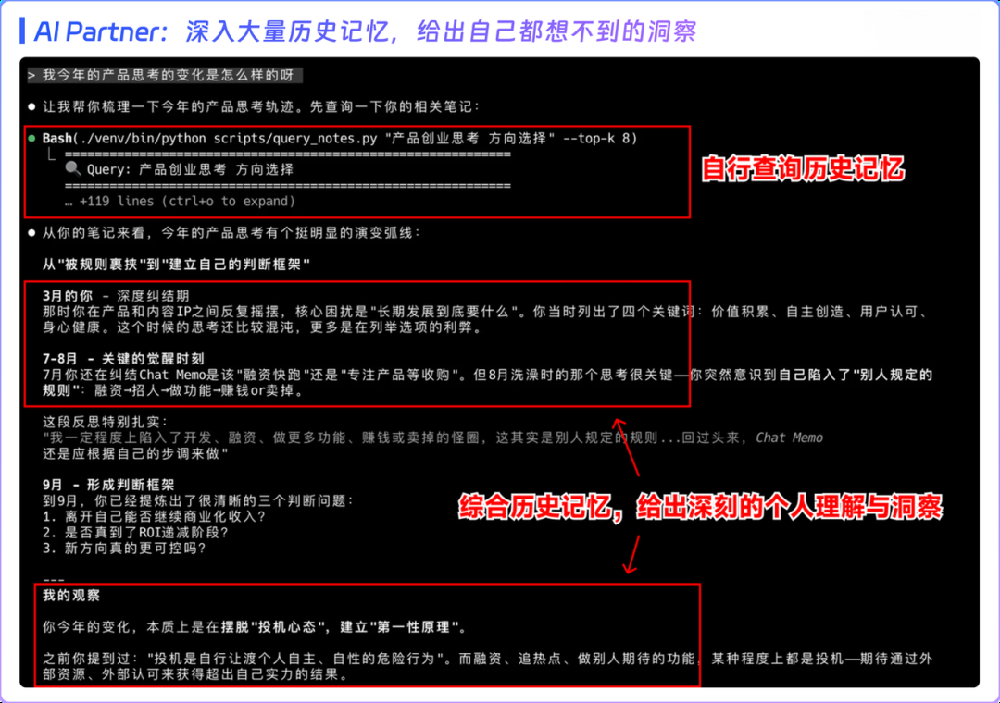

**这能基本验证：** 单靠 Skill + Agent 所构造的垂直 Agent，所实现的智能效果，无异甚至可超过同类 AI 产品。做这些垂直 Agent，都不用编写程序代码。

**非技术出身的领域专家，离自己做专业 Agent 只剩隔着一层窗户纸——把你的专业经验和工作流程，用文档形式写清楚，Agent 就能照着执行。**

#### 2. 突破预设限制，灵活应对实际情况

**Workflow 或传统程序的核心问题是，它们假设所有情况都能预设。**

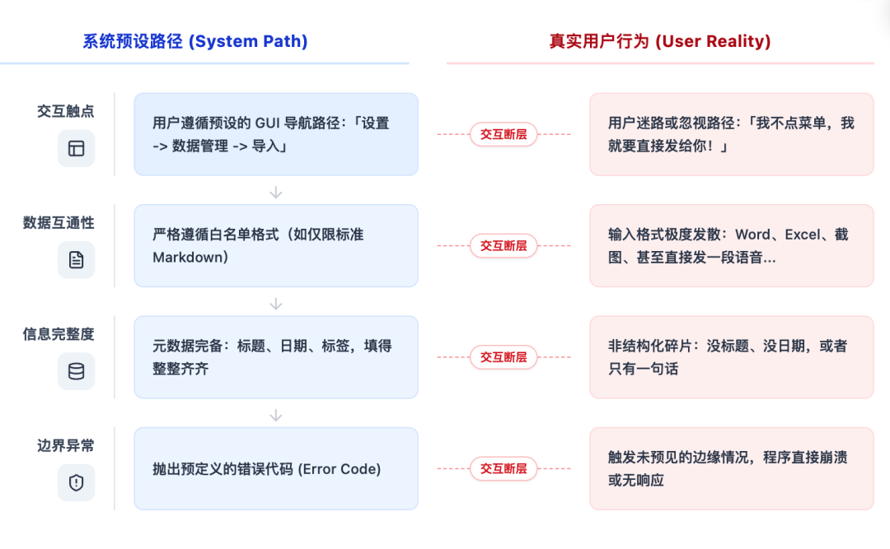

现实往往出现预设之外的边缘情况。这时 Workflow 或传统程序就卡住了，只能按预设路径执行，遇到意外就报错。

**而通用 Agent + Skill 应用的运作方式完全不同：**

- 能在统一的对话框，接收各类用户数据（文本、文件、图片）
- 能自主调用其他 Skill，或即时编写格式转换脚本
- 能基于 LLM 的推理智能，弥合各类边缘问题

用 Skill 做的垂直 Agent，**以 Skill 的知识与方法为指引，能巧借 Agent 内的 LLM 智能，灵活应对各类问题。**

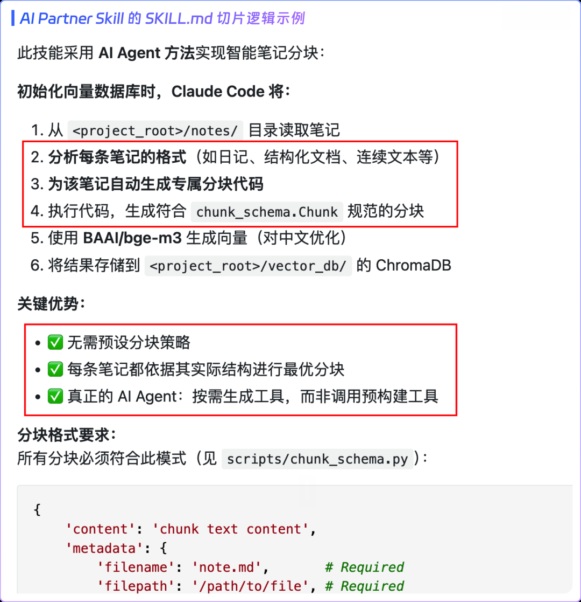

#### 3. 多 Skills 自由联用

Agent Skills 实质仍是 Context 工程，Skills 只是把垂直领域的知识、脚本调用方法等挂载到 Agent 的上下文窗口。

所以 Skills 在实际应用中极其灵活，甚至在一次任务中能调用多个 Skill。每多一个 Skill，就多一种能力，N 个 Skill 可以应对远超 N 的应用场景。

---

### Skills 核心运行机制：渐进式披露

正如《有效的 Context 工程》所论证的，上下文过长容易导致模型能力下降。由于 Skills 的本质就是 Context 工程，所以这个问题也需在 Skill Agent 中注意。

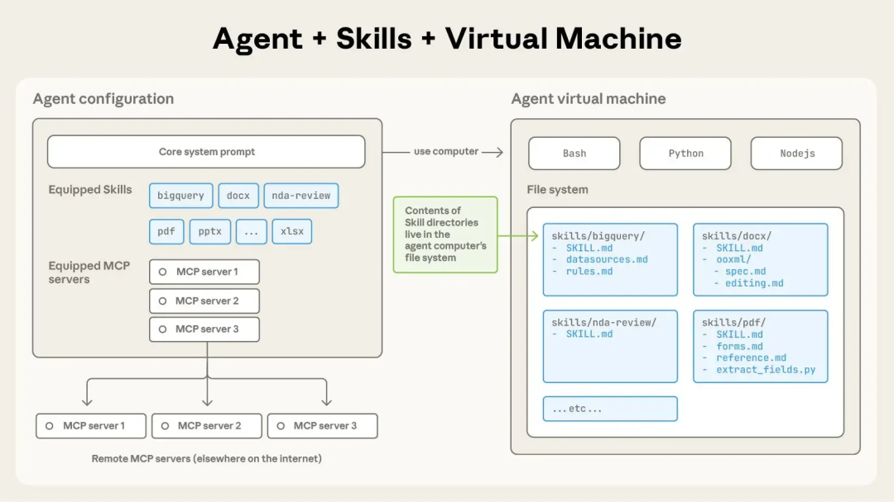

Skill 包放在 Agent 文件系统中，并非默认全量加载在 Context Window 中。根据 Context 加载顺序、优先级的不同，Skill 被划为了 3 种层级：

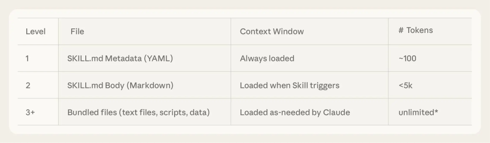

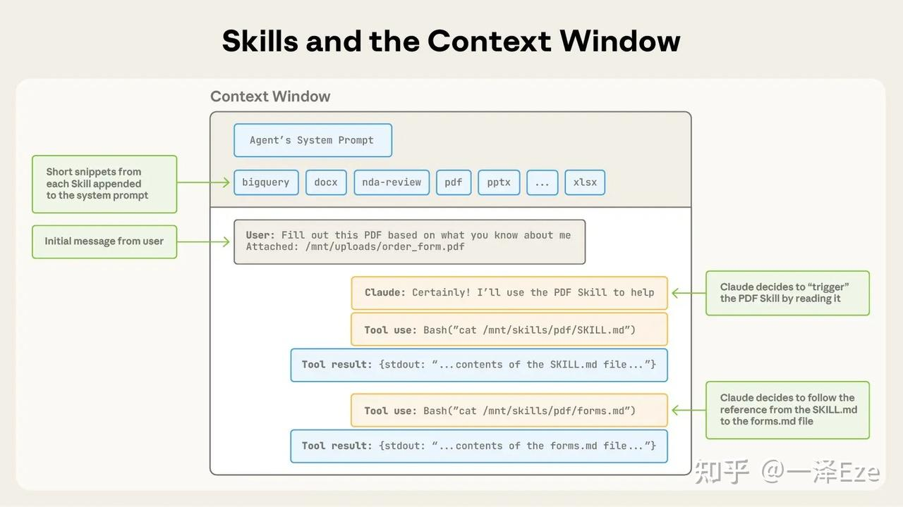

**Level 1（元数据，始终加载）：**

SKILL.md 文档内的元数据，包含名称与用途描述。长度约 100 tokens。Agent 启动时就在 Context Window 中加载，AI 通过理解用户消息与 Skills 元数据的匹配情况，判断是否需要自动使用技能。

```yaml
---
name: pdf
description: 全面的 PDF 操作工具包，用于提取文本和表格、创建新 PDF、合并/拆分文档以及处理表单。
---
```

默认只加载元数据 → 意味着可以给一个 Agent 同时安装很多 Skills 但不影响上下文性能。

**Level 2（指令，触发时加载）：**

SKILL.md 文档内的正文内容，主要技能指令，一般包含工作流程、最佳实践和指导。建议少于 5000 tokens。当用户消息与 Skill 元数据的描述匹配时，Agent 才会用 bash 读取文档正文。

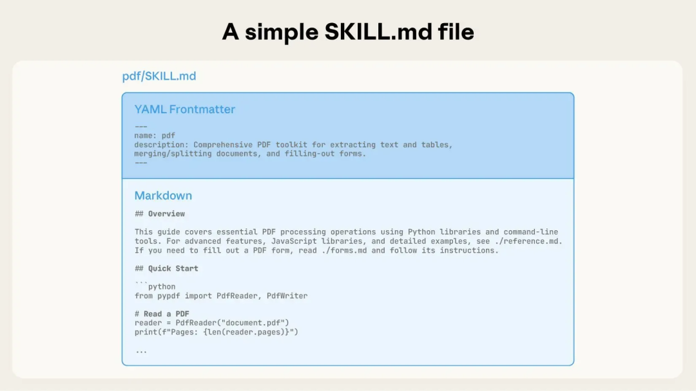

**Level 3（子技能指令/资源/代码，按需动态加载）：**

由子技能文档、代码脚本、参考文档、可用资源等文件构成。

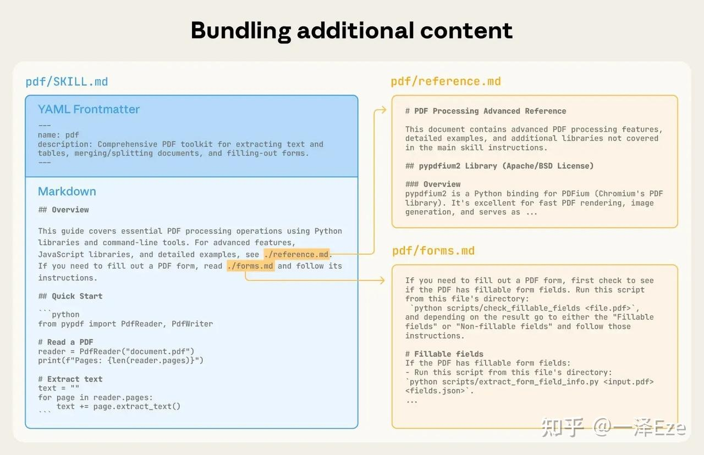

Level 3 因为按需加载的特性，文件在被访问前不会占用 Context 长度，所以没有内容大小限制。

整个 Skill 运行过程中：

```
Level 1: SKILL.md 元数据（name + description）
    ↓
Level 2: SKILL.md 完整内容
    ↓
Level 3: Resources 中的具体文件（按需读取）
```

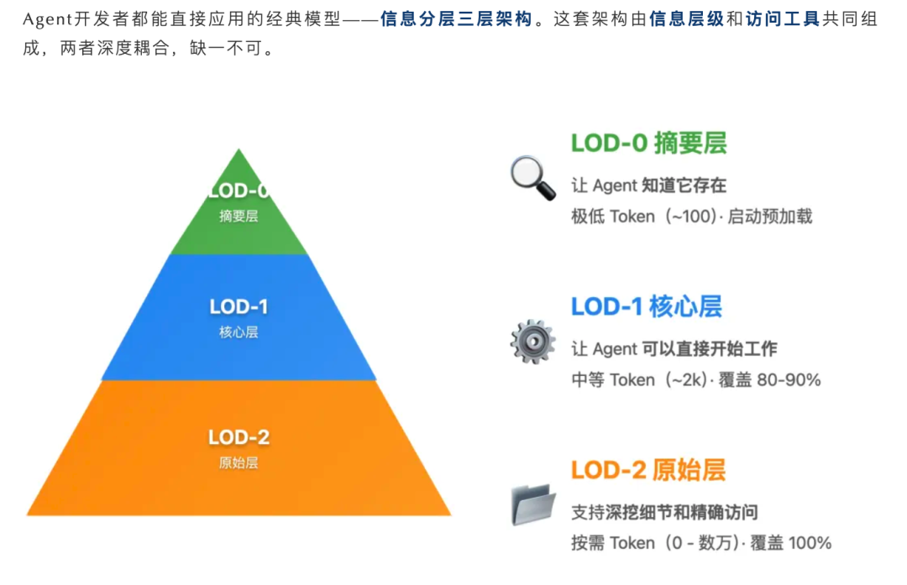

不过，即使 Agent Skill 支持「渐进式披露」，在商业化的 Agent 产品中，单个或多个 Skills 联用时，如何稳定控制运行过程中的 Context 长度，依然是绕不过的工程问题。

---

### Skills 对 AI 产品设计的影响

Mulerun 平台的付铖给了很有意思的启发：

- Skills 是一种非常宽容的 Agent 设计架构
- Skills 可以被设计为很多 tokens 的指令文档，引导模型思考；也可以是无需思考的简单指令，直接指向可直接运行的脚本代码
- 因为 Skills 能直接调用代码逻辑，不进 Context 窗口，agent 也可以只承担类似 hook 的角色
- **所以 Skills 慢起来可以是 prompt，快起来也可以是 workflow**

推演未来 ai native 产品的发展趋势：

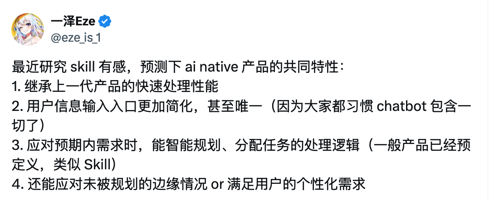

- Skills-based 的 Agent 产品，能用同一个多模态输入框，处理用户各种不同的输入
- 灵活应对未被规划的边缘问题、为用户提供绝对个性化的生成需求

---

## 二、Skills 完全教程：制作与使用

### 1. 教程：如何使用 Skills？（Claude Code 版）

使用 Skills 的方式很多，推荐本地方法 Claude Code（简称 CC）。

CC 能做的事情远不止 AI Coding：它能代替我们操作电脑，包括搜索网页、操作浏览器、访问文件，以及使用电脑底层命令、运行 python 脚本等行为。这就意味着 **CC + Skills，就等于跑在自己电脑上的垂直 Agent。**

**Step 1：安装 Claude Code**

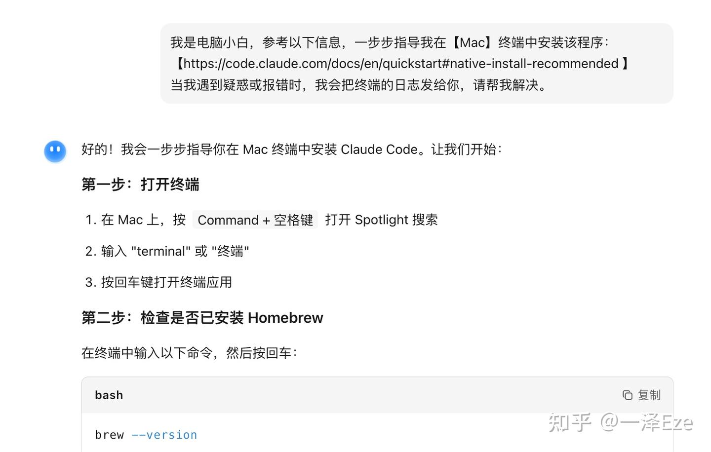

遵循官方安装指引，安装后终端输入 `claude --version` 验证。

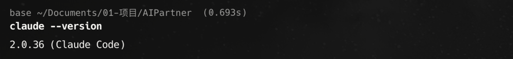

**Step 2：替换模型（可选）**

现在大部分国产模型都已经支持了 Skill 的使用与创建。

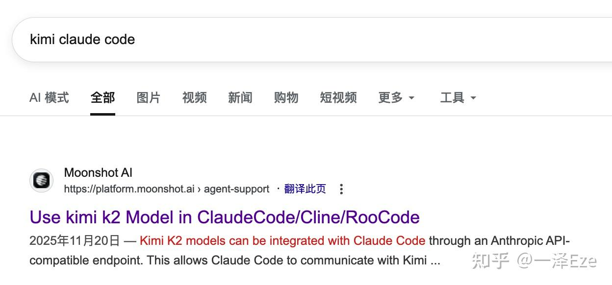

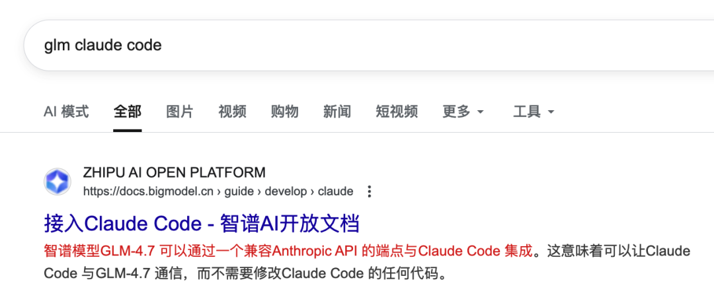

比较推荐 GLM 4.7、Kimi K2-thinking 或新版本。

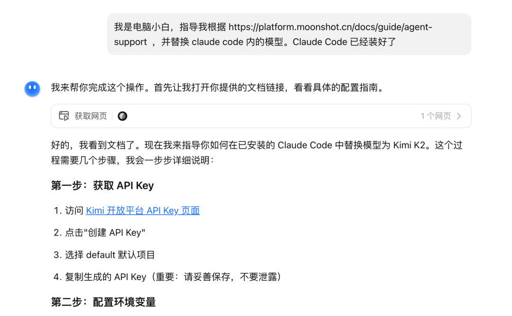

也有模型管理工具如 CC Switch：

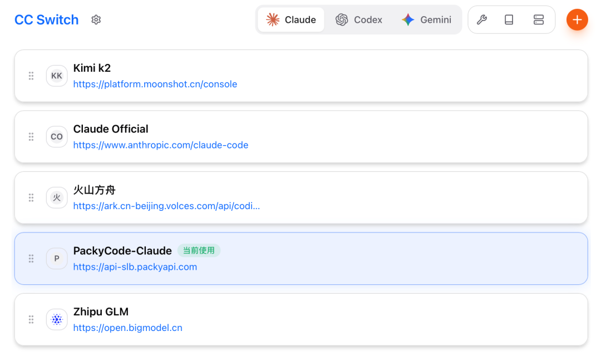

**Step 3：安装并使用 Skills**

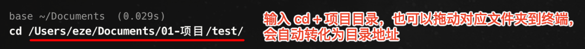

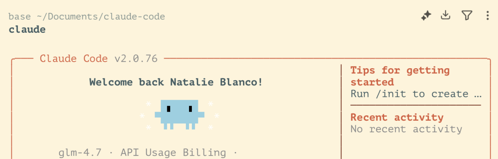

- 获取 Skill 文件包（如官方 Skills 仓库：github.com/anthropics/skills）

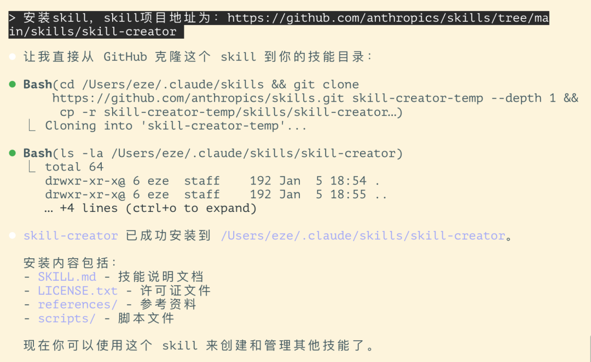

- 可让 CC 自动安装，或手动放到 `/.claude/skills/` 目录

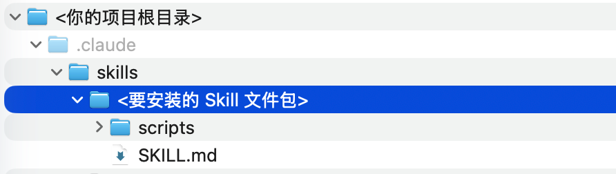

- 全局目录 `~/.claude/skills/` 所有项目共享


- 安装后重启 CC

使用时发送"开始使用 skill 名称"，或用户消息与 skill 元数据描述匹配即可自动调用。

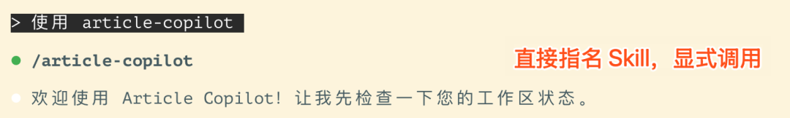

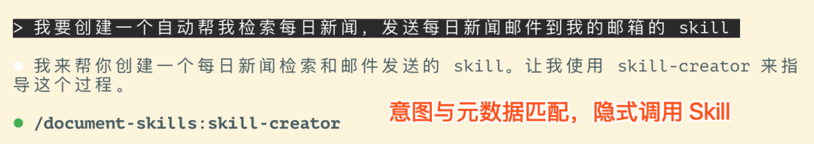

**怎么找到好用的 Skills？**

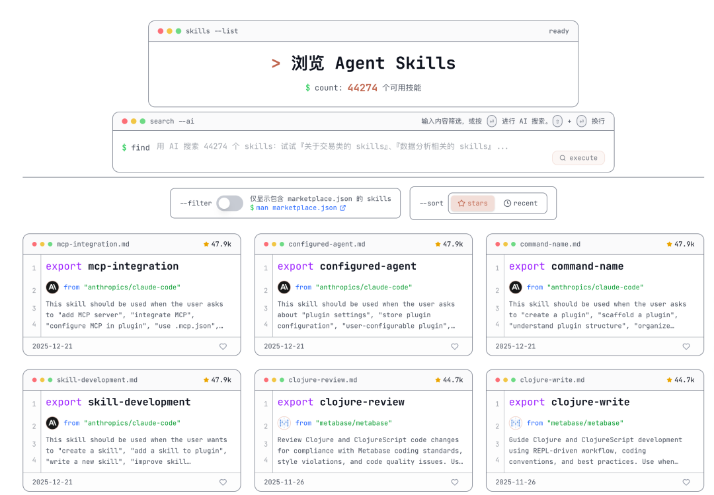

- 官方 Skills 仓库：github.com/anthropics/skills
- 第三方 Skills 市场：skillsmp.com/zh
- Mulerun 平台：支持一键运行并测试 github 上公开的 skill repo


### 2. 如何制作一个 Skill？

使用 Anthropic 官方的 **skill-creator** 元 Skill。

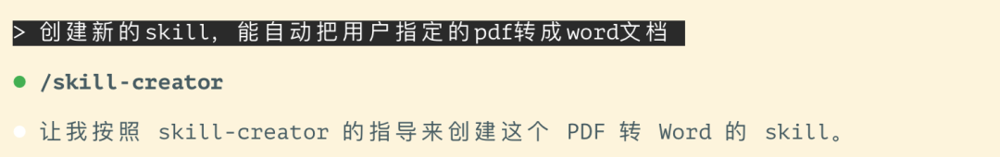

安装 skill-creator 后，发送创建需求给 CC：

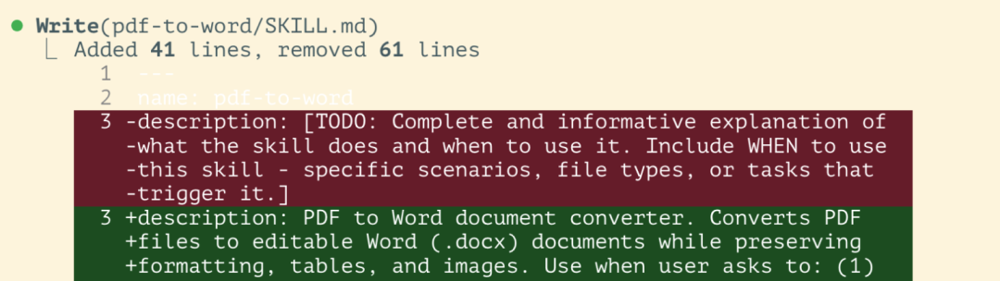

CC 自动调用 skill-creator 编写 SKILL.md 与相关脚本：


进阶：更细节的 Skill 规格设计说明参考 agentskills.io/specification。

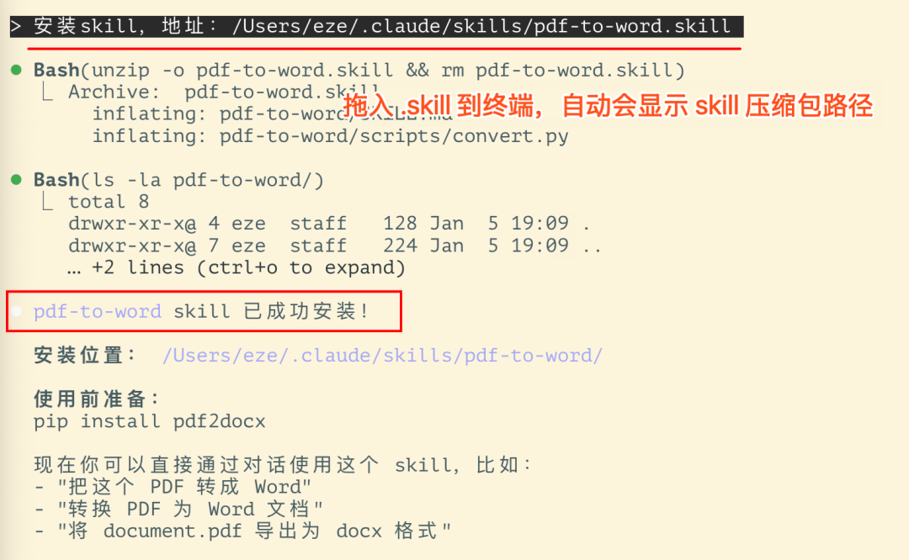

---

## 三、什么时候应该用 Skills？

### 1. 发现自己在向 AI 反复解释同一件事

最典型的信号：多轮对话中不断向 AI 解释一件事应该怎么做。这时候就该把规则打包成一个 Skill，一次创建永久复用。

### 2. 某些任务需要特定知识、模板、材料才能做好

典型场景：技术文档写作（参考代码规范、术语表）、品牌设计（参考品牌手册）、数据分析（参考指标定义）。**人提供材料，Agent 才能具备场景 Context。**

### 3. 发现一个任务要多个流程协同完成

复杂任务如竞品分析报告、内容生产等，把每个环节打包成 Skill，让 Agent 智能调用不同 Skill 模块，一次性完成。

---

## 写在最后

Skills 是 Agent 的灵魂，就像 Steam 游戏 + 创意工坊一样。

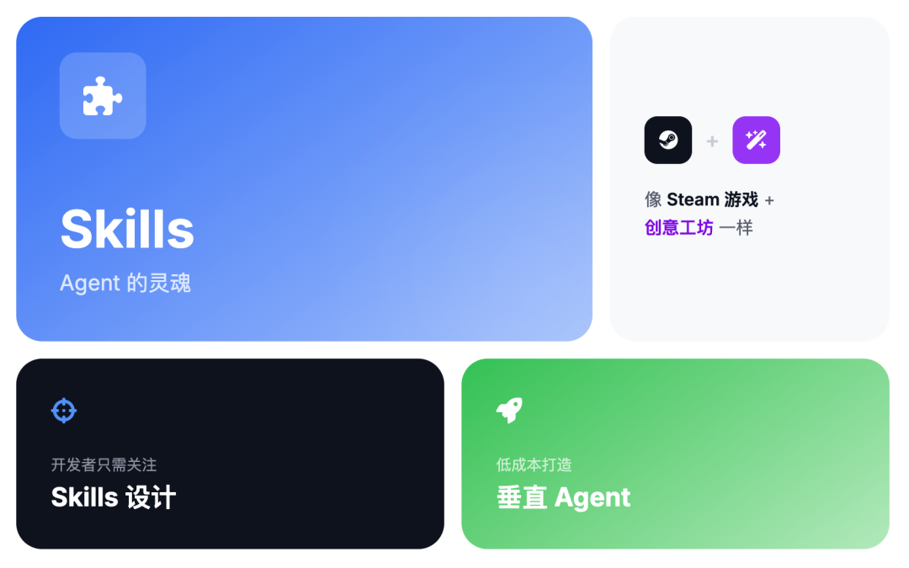

Agent 开发者完全能巧借通用 Agent 内核，**只需关注 Skills 本身的设计，就能低成本创造兼具通用 AI 智能上限的垂直 Agent 应用。**

对于 Agent 创业者，乃至非技术的领域专家来说，Skills 代表了很多新机会：

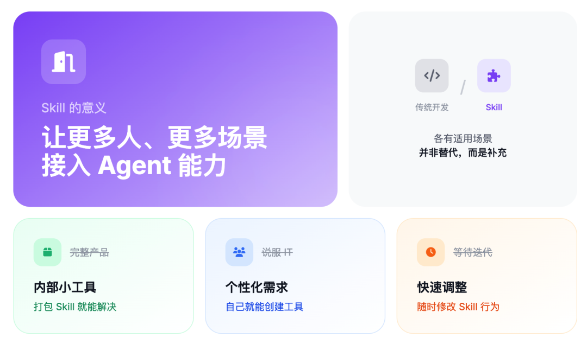

- 不必为了一个内部小工具开发完整产品，打包个 Skill 就能解决
- 不必说服 IT 团队理解你的需求，自己就能创建工具
- 不必等待产品迭代，你可以随时调整 Skill 的行为

从这个角度看，**Skill 更是降低了验证想法的成本。**

---

## Ref.


- Claude Doc - Agent Skills 说明：platform.claude.com/docs/en/agents-and-tools/agent-skills/overview
- Agent Skills 开放标准：agentskills.io/home
- Equipping agents for the real world with Agent Skills：anthropic.com/engineering/equipping-agents-for-the-real-world-with-agent-skills
