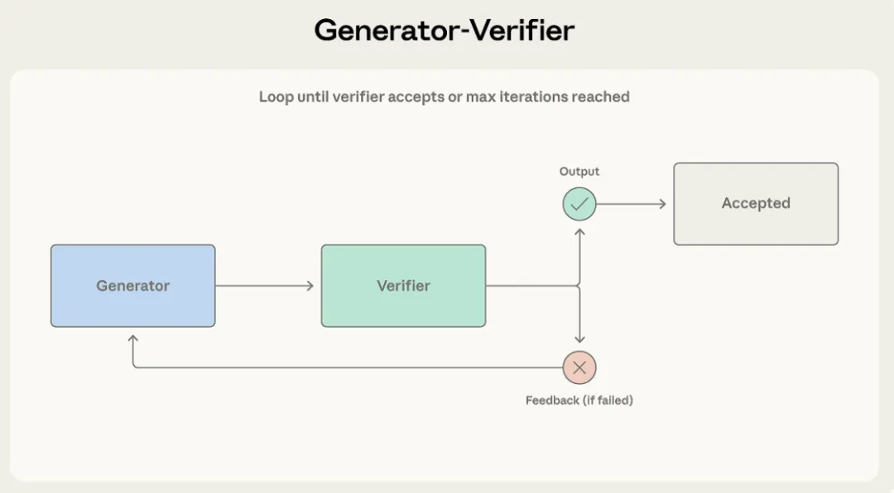
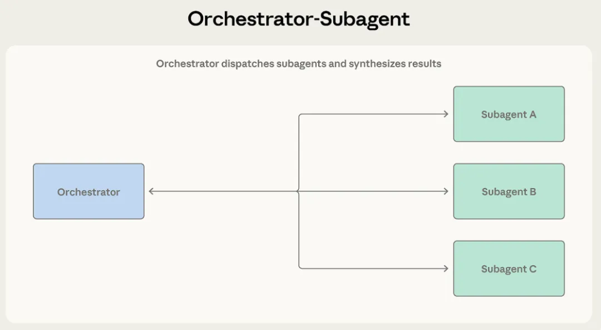
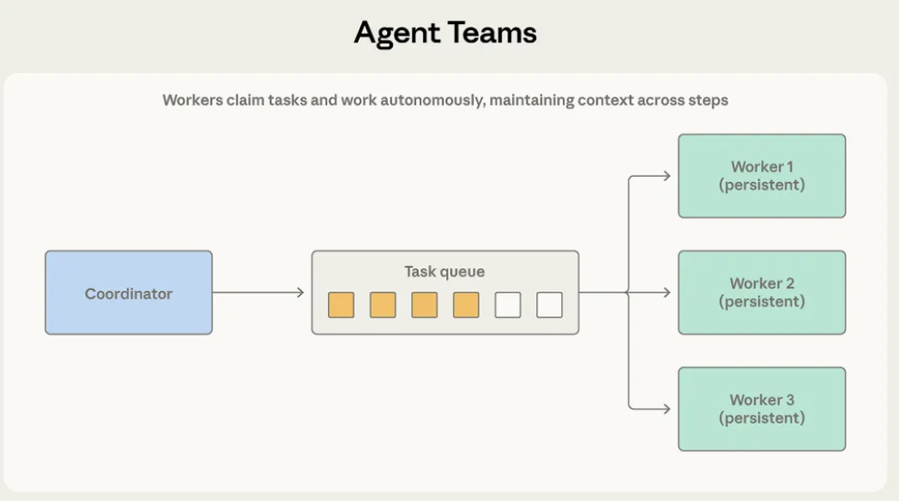
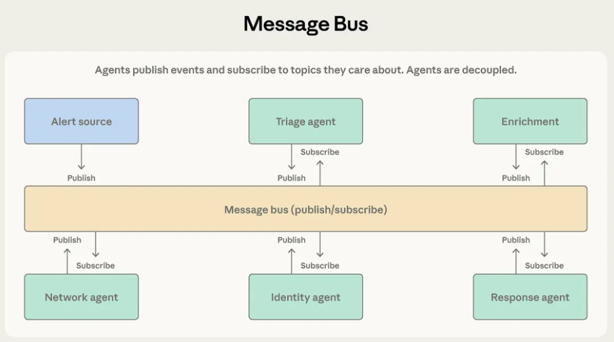
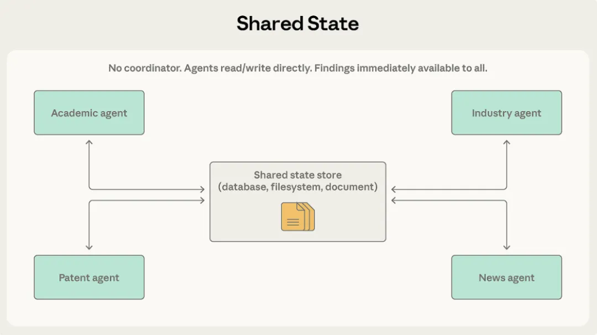
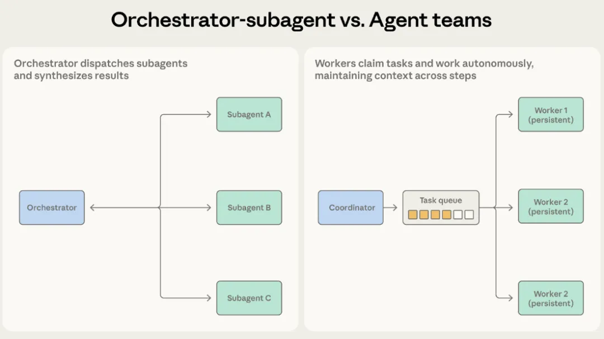
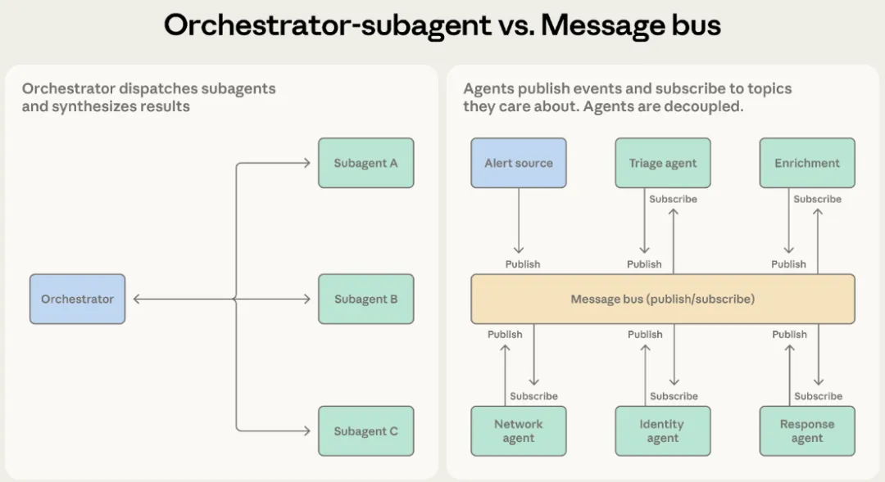
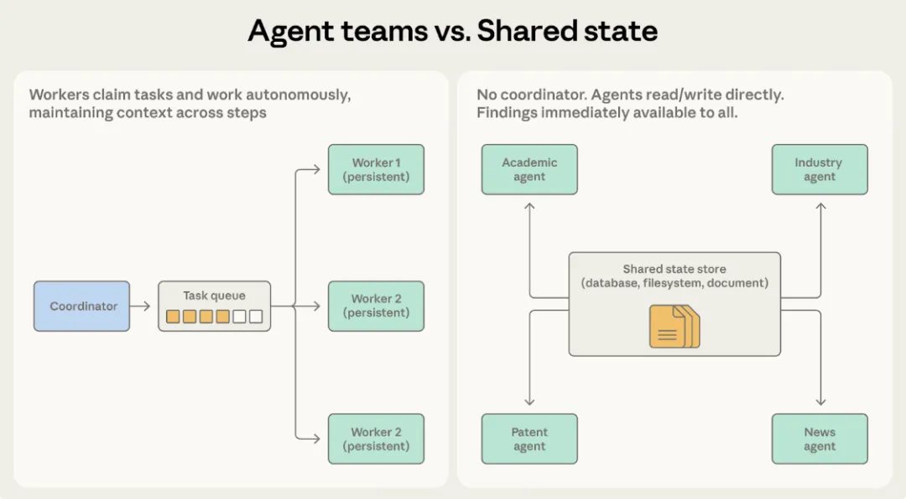
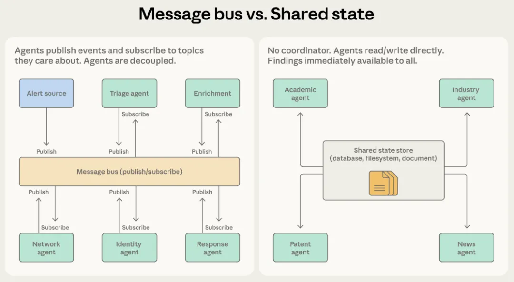

# Anthropic长文：多智能体协作模式，五种方法及其适用场景

**作者**：AI寒武纪  
**公众号**：AI寒武纪  
**发布时间**：2026年4月15日 23:38  
**原文链接**：[Anthropic长文：多智能体协作模式，五种方法及其适用场景](https://mp.weixin.qq.com/s/Ag2TMKhM8qRYhy3wIpzMHQ)

---

↑阅读之前记得关注+星标⭐️，😄，每天才能第一时间接收到更新

 

### Anthropic 官方长文 ：多Agent 协作模式指南，总结了 5 种架构和适用场景，何时该用多智能体系统，以及何时单智能体反而是更好的选择。如果你已经决定要上多智能体，那么今天这篇文章就是为你准备的
我们经常看到许多开发团队仅仅因为某个架构听起来很高大上就盲目选用，这其实大错特错。Antnropic强烈建议从最能跑通的最简模式开始，观察它在什么地方遇到瓶颈，然后再逐步进化。今天我们就来彻底拆解五种多智能体协作模式的底层机制和致命局限。

这五大模式分别是：

1.负责把控输出质量且标准明确的生成器与验证器模式

2.负责清晰拆解独立子任务的编排器与子智能体模式

3.负责处理并行且长期独立作业的智能体团队模式

4.负责事件驱动流水线和扩展生态的消息总线模式

5.负责协作研究与成果共享的共享状态模式

### 模式一：生成器与验证器
这是最简单的多智能体模式，也是目前落地应用最多的架构。

工作机制

生成器接到任务后先输出一个初稿，然后把它丢给验证器评估。验证器会根据设定好的标准进行检查，要么直接通过，要么打回并附上修改意见。如果被打回，生成器就会根据反馈重新生成。这个循环会一直持续，直到验证器点头通过，或者达到了设定的最大重试次数。

什么场景最好用

想象一个用来回复客服邮件的系统。生成器先根据产品文档写个回复。验证器立马接手，核对知识库查验准确性，评估语气是否符合品牌调性，并确认是否回答了用户的所有问题。如果查出毛病，验证器会精准指出问题所在，比如报错了价格或者漏答了某个细节，然后打回重写。

只要你的任务对输出质量要求极高，而且评估标准能够被清晰量化，用这个模式准没错。它非常适合写代码写测试、事实核查、标准化评分、合规性审查。在这些领域，输出错误的代价远远高于多跑几次生成的计算成本。

哪里容易翻车

验证器的能力天花板完全取决于你给的标准有多细。如果你只告诉验证器去检查内容好不好，它大概率只会走个过场直接放行。很多团队踩坑就踩在只搞了循环机制，却根本没定义清楚什么叫验证通过，这纯属制造了质量控制的幻觉。

另外这个模式默认生成和验证是两种截然不同的技能。如果评估一个创意方案的难度和想出一个好创意一样高，验证器大概率也抓不出什么毛病。

最后，这种循环很容易卡死。如果生成器怎么都改不到验证器想要的程度，系统就会原地打转。这就必须设置一个最大迭代次数，并配合备用方案，比如转交人工处理或者带着警告标识返回当前最佳版本，以此来防止系统陷入死循环。

### 模式二：编排器与子智能体
这种模式的核心就是层级制。一个智能体当组长负责统筹规划和汇总结果，其他子智能体各自领走特定任务去干活。

工作机制

带头大哥接到任务后，先决定该怎么做。它可以自己处理一部分，剩下的分发给手下。手下干完活把结果交上来，带头大哥再把这些碎片整合成最终成品。

Claude Code用的就是这套架构。主智能体自己写代码改文件敲命令，当需要搜索庞大代码库或调查具体问题时，就在后台唤起子智能体。各个子智能体在自己的上下文窗口里干活并返回精炼后的结论。这样主智能体的注意力就能一直集中在核心任务上，同时后台还在并行探索。

什么场景最好用

代码自动审查系统是绝佳的例子。当有新的代码提交时，系统需要查安全漏洞、看测试覆盖率、检查代码风格并评估架构一致性。每一个检查项都互不干扰，需要不同的上下文，而且输出明确。编排器就把这些活分发给专精的子智能体，收齐报告后再合并成一份完整的审查意见。

只要任务拆解非常清晰，且子任务之间几乎没有互相依赖，就选这个模式。组长能时刻盯着大目标，手下也能专心干好自己的分内事。

哪里容易翻车

这个组长很容易变成信息瓶颈。一旦某个子智能体发现了对其他子智能体极其重要的信息，这个情报必须先传回给组长。如果负责安全的发现了漏洞，而这个漏洞正好影响架构分析，组长就必须敏锐地察觉到这层关系并正确转发。倒手次数一多，关键细节往往就在总结提炼中丢失了。

另外，排队干活会拖慢速度。除非你写代码强制它们并行处理，否则子智能体就是一个接一个排队跑的，这意味着你花了多智能体的钱，却享受不到速度的提升。

### 模式三：智能体团队
当任务可以拆分成并行的子任务，而且这些任务需要独立运行很长时间时，上面那个带头大哥的模式就显得太死板了。

工作机制

协调员唤醒好几个工人智能体作为独立进程运行。这些队友从一个共享的任务池里接单，经过多个步骤自主完成工作，最后打个卡表示干完了。

它和编排器模式最大的区别在于工人的持久性。编排器唤醒的子任务做完就立刻销毁了。但团队模式里的队友会一直在线，接手无数个任务，不断积累上下文和领域专长，越干越顺手。协调员只负责派活和收作业，不会在任务间隙把工人的记忆清空。

什么场景最好用

比如要把一个巨型代码库从旧框架迁移到新框架。每个队友可以独立接管一个服务，顺带处理它的依赖项、测试用例和部署配置。协调员把服务分发下去，队友就自己去搞定更新依赖、改代码、修测试和验证。最后协调员收集所有迁移好的服务跑个系统总成测试。

当子任务完全独立，并且极其需要长期多步连贯操作时，这个模式简直完美。每个队友都在建立自己的领域知识体系，而不是每次被唤醒都从零开始。

哪里容易翻车

绝对的独立性是这个模式的死穴。编排器还能在中间居中调停传话，但团队里的队友都在低头干自己的活，根本不知道别人在干嘛。如果A的工作影响了B，双方都不知情，最后交上来的东西大概率会打架。

不仅如此，判断什么时候全干完也是个难题。因为大家耗时不一样，有人两分钟搞定，有人要磨蹭二十分钟，协调员必须懂得处理这种部分完成的尴尬状态。

如果大家还要抢公共资源，麻烦就更大了。多个队友同时修改同一个代码库或数据库，一不小心就会改同一个文件引发冲突。这就要求开发者必须做好极其精密的任务隔离和冲突预防机制。

### 模式四：消息总线
当智能体数量激增，交互变得像蜘蛛网一样复杂时，直接点对点沟通根本管不过来。这时候就需要引入消息总线，大家通过一个共享的通信层来发布和订阅事件。

工作机制

所有智能体只干两件事：发布消息和订阅消息。智能体订阅自己关心的业务，路由器负责把对应的消息精准投递过去。如果有具备新技能的智能体加入，不用改任何底层代码，直接让它接收相关工作就行。

什么场景最好用

安全运营自动化系统是这个模式的拿手好戏。各路警报蜂拥而至，分拣智能体先按严重程度分类，把高危网络警报丢给网络调查智能体，把账号异常丢给身份分析智能体。在调查过程中，它们可能还需要发布信息补充请求，由专门的情报搜集智能体来接单。最后所有调查结果全部汇集到响应协调智能体那里拍板做决策。

这种流水线作业极其适合消息总线，事件推动着流程往下走。随着威胁种类的增加，团队随时可以往里塞新的智能体，开发和部署互不干扰。

当工作流不是事先写死而是由事件驱动产生，且你的智能体生态系统注定会不断膨胀时，选它最合适。

哪里容易翻车

事件驱动的灵活性意味着查Bug简直是灾难。一个警报触发了五个智能体的连锁反应，想搞清楚中间到底发生了什么，需要极度硬核的日志记录能力。

路由派发的准确率更是命门所在。如果路由器分错了类或者漏发了消息，系统不会崩溃报警，只会默默罢工，什么都不处理但也绝对不报错。用大语言模型做路由虽然灵活，但也带来了大模型特有的抽风风险。

### 模式五：共享状态
前面提到的编排器、协调员和路由器，都在中央死死掐着信息的咽喉。共享状态模式直接干掉了这些中间商，所有智能体直接在一个持久化的存储空间里自由读写交流。

工作机制

智能体完全自主运作，盯着同一个数据库或文档库。没有包工头来分配任务。大家看到库里有自己能处理的信息就拿去分析，有新发现就直接写回库里。通常是在初始化时往库里扔个问题启动，直到满足终止条件才停机，比如超时了、好几轮都没新东西了，或者某个专门负责拍板的智能体觉得答案已经够用了。

什么场景最好用

假设你要搞一个极为复杂的科研文献综述系统。一个智能体翻学术论文，一个看行业研报，一个查专利库，还有一个盯新闻报道。它们任何一方的发现都可能直接影响另一方的调查方向。查论文的可能发现了一个大牛学者，查研报的立刻就能去深挖这个学者名下的商业公司。

在共享状态下，情报直接汇总到中央大库。查研报的不用等什么组长传话，马上就能看到查论文的最新发现。大家踩在彼此的肩膀上继续深挖，这个共享库就变成了一个不断进化的超级知识库。

这彻底消除了单点故障。任何一个智能体宕机了，其他人照样读写干活。要知道在编排器或消息总线模式里，老大一死，全盘瘫痪。

哪里容易翻车

因为没人管，智能体非常容易重复造轮子，或者干脆南辕北辙。两个智能体可能盯着同一条线索同时死磕。系统的最终产出完全是撞大运般的涌现行为，极度不可控。

最可怕的灾难是无限接话死循环。A写了个发现，B看了觉得有理补了一句，A看了觉得B说得对又补了一句。系统就这样疯狂烧掉大量Token，产出却毫无价值。防止重复劳动在工程上有很多办法可以锁死，但这种行为模式上的死循环，必须靠极其强硬的终止条件来斩断：要么设时间预算限制，要么连续几轮没新花样就拉闸，要么就找个专职智能体盯着，觉得差不多了就强行关机。如果把终止条件当儿戏，系统大概率会一直跑到某一个智能体上下文爆满死机为止。

### 架构怎么选怎么进化
对的架构完全取决于你系统的结构需求。在我们之前的文章中，我们提倡以上下文为中心的任务拆解原则，也就是说，不是按智能体能干什么活来分工，而是按它们需要什么上下文来分工。这个原则在这里同样适用。

编排器与子智能体 VS 智能体团队

这俩都是老大派活。核心区别在于工人需要保留记忆多久。

如果子任务短平快且输出明确，选编排器。代码审查就是这样，查完交差，单次完结，不用记昨天干了什么。

如果子任务需要长期连贯操作，选团队。代码迁移就需要队友彻底摸清手头这个服务的上下游依赖，这种经验积累是单次唤醒绝对做不到的。

一旦子智能体需要跨回合保持状态，团队模式就是唯一解。

编排器与子智能体 VS 消息总线

这俩都能干多步工作流。核心区别在于流程能不能猜透。

如果每一步都是固定套路，选编排器。收代码、跑检查、出报告，雷打不动。
如果工作流是顺藤摸瓜变数极大，选消息总线。安全运营根本不知道下一个来的是什么警报，会牵扯出什么调查路线。消息总线只管把警报扔给有能力处理的人，完全不需要死板的预设流程。

当编排器里为了应对各种边缘情况塞满了密密麻麻的判断语句时，就该换消息总线了。

智能体团队 VS 共享状态

这俩都是自主干活。核心区别在于它们需不需要抄彼此的作业。

如果大家各扫门前雪，选团队。代码迁移就是这样，各搞各的服务，最后组长拼起来就行。

如果大家需要高度协作实时互通有无，选共享状态。科研综述系统里，一个人的新发现就是另一个人的新线索。

当队友之间开始迫切需要私下沟通而不是只跟组长汇报时，直接上共享状态会顺畅得多。

消息总线 VS 共享状态

这俩都能玩转极度复杂的多智能体。核心区别在于业务是像水流一样过去就完事，还是像滚雪球一样越攒越大。

如果智能体是对流水线上的事件做出反应，选消息总线。警报一关过一关，处理完就结案。

如果智能体是要随着时间推移积累知识底座，选共享状态。大家反复回来看库里多了什么新东西，调整思路继续挖。

别忘了消息总线再牛也是有个中央路由器说了算的。如果你铁了心要绝对的分权去中心化，彻底消灭单点故障，那就只有共享状态能满足你。

如果在你的总线系统里，大家发布消息纯粹是为了分享八卦情报而不是触发下一步行动，那你其实早就该换成共享状态了。

### 给新手的操作建议
工业级上线的生产系统往往都是混合流派。比如主干流程用编排器，遇到需要深度协作的局部环节切成共享状态。或者用消息总线做总分发，下游的具体事件由类似智能体团队的工人接手打攻坚战。这些模式本质上是乐高积木，绝对不是非此即彼。

这里有一份速查对照表：

对输出质量极其严苛且评估标准明确的：生成器与验证器

任务拆解极其清晰且子任务边界分明的：编排器与子智能体

需要处理大规模并行且互不干扰的持久战：智能体团队

完全由事件驱动且未来还会不断加挂新智能体的流水线：消息总线

需要高度协作且需要实时互通重大发现的研究型任务：共享状态

系统设计要求绝对不允许存在单点故障的：共享状态

对于绝大多数刚刚起步的项目，我们强烈建议无脑首选编排器与子智能体模式。它以极低的协调成本扛住了最广泛的业务场景。先用它跑起来，仔细观察哪里卡脖子了，再去向其他模式进化。

Anthropic在接下来的内容中，会带入真实的生产级落地代码和商业案例，对每一种模式进行剥洋葱式的深度解析。

source：

https://claude.com/blog/multi-agent-coordination-patterns

--end--

最后记得⭐️我，每天都在更新：如果觉得文章还不错的话可以点赞转发推荐评论

/...@作者：你说的完全正确（YAR师）

---

> ⚠️ 以下图片未能从正文 HTML 中定位，按下载顺序追加：

