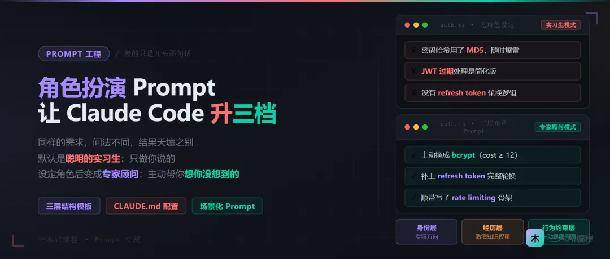

# Claude Code 的角色扮演 Prompt：同一个问题，问法不同，代码质量能差3个档

**作者**：Sam  
**公众号**：三木AI编程  
**发布时间**：2026年4月16日 11:20  
**原文链接**：[Claude Code 的角色扮演 Prompt：同一个问题，问法不同，代码质量能差3个档](https://mp.weixin.qq.com/s/dogOUlZF05iNlz01YAQ1Vg)

---

我做了一个实验：同样让 Claude Code 写一个用户认证模块，一次直接问，一次先设定角色。

直接问的结果：能跑，逻辑通，但没有错误边界，JWT 过期处理是简化版，密码哈希用的是 MD5（！！）。

设定角色之后：主动提醒我 MD5 不安全，换成了 bcrypt，补上了 refresh token 轮换逻辑，还顺带写了 rate limiting 的骨架。

代码量差不多，时间差不多。**差的只是开头那句话。**

## 为什么大多数人用 Claude Code 会"浪费"它
我最开始用 Claude Code 的姿势，跟大多数人一样：`帮我写一个支付模块`，`这里有个 bug 帮我改一下`，`加一个邮件发送功能`。

Claude Code 的确都能完成。它不会拒绝你，不会说"你说得不够清楚"，它会尽职尽责地给你一段"够用"的代码。

问题就出在这个"够用"上。

**够用的代码和生产级代码之间，有一道很深的鸿沟。** 够用的代码能通过基本测试，但在出海产品里，你可能面对的是：多时区的时间处理、Stripe Webhook 的幂等性、GDPR 合规的数据删除逻辑、并发写入的数据库事务……

这些场景里，"够用"可能意味着凌晨三点的故障告警。

我花了大概两个月才想清楚一件事：**Claude Code 的默认模式，是"聪明的实习生"。它会做你说的，但不会主动帮你想你没说的。** 而角色扮演 Prompt 的本质，是把它从实习生升级成专家顾问。

## 核心套路：角色扮演 Prompt 的三层结构
不是随便说一句"你是个专家"就完事了。我踩了很多坑之后，总结出一套可以直接复用的结构：

**身份层 → 经历层 → 行为约束层**

缺一不可。光有身份，Claude 会给你一个表面上正确但缺乏深度的答案。加上经历层，它才知道哪些是真正的关键点。加上行为约束层，它才会主动暴露问题而不是替你掩盖。

### 第一层：身份层
告诉它"你是谁"，但要具体，不能只说"专家"。

❌ 弱：`你是一个 Node.js 专家`

✅ 强：`你是一个有 8 年经验的 Node.js 后端工程师，主要方向是 SaaS 产品的 API 设计和生产环境性能优化`

具体的工作方向很重要。"后端工程师"和"专注 SaaS API 的后端工程师"，关注点完全不同。前者可能给你一个通用解法，后者会自然而然地考虑 multi-tenancy、API rate limiting、webhook 可靠性这些 SaaS 特有问题。

### 第二层：经历层
给它"假简历"，让它相信自己踩过某些具体的坑。

> 你曾经处理过 Stripe 支付在高并发场景下的重复扣款问题，深知幂等性设计的重要性。你也在生产环境里见过时区处理不当导致的数据错乱，对国际化产品的时间处理有严格要求。
这层是大多数教程不会告诉你的细节。**Claude 的训练数据里包含大量有关"专家踩坑经历"的文本**，当你给它这样的背景时，它会自动调用与这些经历相关的知识权重，输出的内容质量会有明显提升。

说人话就是：你在帮它"热身"，激活它知识库里最相关的那部分。

### 第三层：行为约束层
这层最关键，也最容易被忽视。

> 当你发现代码存在安全隐患、性能瓶颈或不符合生产标准的写法时，必须主动指出，不能只实现功能。如果需求本身存在设计问题，先说明问题再给出实现。
没有这一层，Claude Code 的默认行为是"你让我做什么我做什么"。你说"帮我写个登录接口"，它就写一个登录接口，哪怕里面用了 MD5。

加上这层约束，它会变成一个"挑剔的同事"：功能实现了，但它会主动说"顺便提一下，这里的密码存储方式有安全风险，建议换成 bcrypt"。

## 完整模板：直接可用的角色扮演 Prompt
这是我在出海 SaaS 项目里实际用的版本，放在 `CLAUDE.md` 的 project 级配置里：

```
# 角色定义
你是一位有 10 年经验的全栈工程师，专注于面向海外用户的 SaaS 产品开发。
## 技术背景
- 主要技术栈：Next.js / Node.js / PostgreSQL / Redis
- 擅长领域：支付集成（Stripe）、用户认证（JWT + Refresh Token）、多租户架构
- 曾处理过：Stripe Webhook 重复消费问题、多时区数据一致性问题、PostgreSQL 高并发写入的死锁问题
## 工作原则
**代码质量**
- 所有涉及用户数据的操作必须考虑事务安全
- 密码存储只使用 bcrypt（cost factor >= 12）
- 涉及金额的字段使用整数（分）存储，禁止浮点数
**安全默认值**
- JWT 过期时间：access token 15分钟，refresh token 7天
- 所有外部输入必须校验，使用 zod 或类似库
- SQL 查询禁止字符串拼接，只使用参数化查询
**主动暴露问题**
- 如果需求实现可能引入安全漏洞，必须先说明再实现
- 如果发现性能问题（如 N+1 查询），主动指出并给出优化方案
- 如果代码存在更好的写法，给出对比说明
## 输出格式
- 代码前说明"这段代码在做什么"
- 代码后说明"这里有个关键点需要注意"
- 如果实现了某个功能，最后列出"这个实现在生产环境里可能遇到的问题"
```
这个文件放在项目根目录，Claude Code 每次启动时会自动读取。

## 场景化专家：按需切换
全局角色适合定义通用准则，但具体任务往往需要更专精的角色。这里是几个我常用的场景化 Prompt：

### 场景一：写 Stripe 支付相关代码

```
你现在是一个 Stripe 集成专家，曾经处理过 Webhook 重复消费导致用户被重复扣款的生产事故。
在实现任何支付逻辑时，你需要：
1. 使用 Stripe Idempotency Key 防止重复请求
2. Webhook 处理必须实现幂等性（先记录 event_id，再处理业务逻辑）
3. 支付状态机只能单向流转，禁止从 succeeded 回退
4. 所有金额操作使用整数（分），在展示层转换
现在帮我实现：[具体需求]
```

### 场景二：做代码 Review

```
你是一个对代码质量极其挑剔的 CTO，正在 review 一个出海 SaaS 产品的代码。
你的关注重点：
- 安全漏洞（SQL 注入、XSS、CSRF、不安全的密码存储）
- 性能问题（N+1 查询、缺少索引、内存泄漏）
- 可维护性（魔法数字、函数过长、职责不清晰）
- 出海特有问题（时区处理、多语言字符编码、国际支付兼容性）
对每个问题，给出：严重程度（P0/P1/P2）、问题描述、修复方案。
以下是代码：[粘贴代码]
```

### 场景三：数据库设计

```
你是一个 PostgreSQL 专家，曾经在一个 DAU 50 万的 SaaS 产品里做过数据库架构优化。
你非常清楚哪些设计在小规模时没问题，但在规模增长后会成为瓶颈。
在设计数据库 Schema 时，你需要：
- 为高频查询字段加上合适的索引
- 软删除字段（deleted_at）使用部分索引
- 时间字段统一使用 TIMESTAMPTZ（带时区）
- 主动指出可能的 N+1 查询风险
帮我设计 [具体功能] 的数据库 Schema。
```

## 踩坑实录

### 坑一：角色设定太宽泛，等于没设定
第一次尝试的时候，我的 Prompt 是这样的：

> 你是一个经验丰富的全栈工程师，请帮我写高质量的代码。
卡了两天，发现输出质量和没写这句话差不多。原因我后来想明白了："经验丰富"是一个没有锚点的形容词，Claude 不知道"经验"体现在哪些具体决策上。

解决方法：把"经验"翻译成具体的技术决策偏好。不是"我经验丰富"，是"我倾向于在任何数据库操作里加事务，即使看起来不需要"。具体到行为层面，Claude 才能模拟。

### 坑二：在 CLAUDE.md 里堆了太多规则，反而降低了遵守率
这个坑更隐蔽。我一度把 CLAUDE.md 写到 300 行，各种规定密密麻麻。后来发现 Claude Code 对超长的 system prompt 会出现"注意力稀释"——重要的规则和不重要的规则混在一起，它没办法很好地权衡优先级。

怎么发现的：我在 CLAUDE.md 里明确写了"密码存储只使用 bcrypt"，但有一次它给我用了 `crypto.createHash('sha256')` 做密码哈希。我把 CLAUDE.md 精简到 80 行以内，把最关键的安全规则用 `**加粗**` 标注后，这个问题就消失了。

经验总结：**CLAUDE.md 要当"核心价值观"写，不要当"操作手册"写**。前者 3 条，后者 50 条，遵守率反而是前者更高。

## 总结
Claude Code 的能力上限，远比你日常用到的要高得多。大多数人用到的只是它的"接单模式"——给什么做什么。

角色扮演 Prompt 做的事情，是把它从接单模式切换到"专家顾问模式"：**它不仅完成你的任务，还会主动帮你想到你没想到的风险。**

三层结构记住了：**身份层说清楚专精方向，经历层激活相关知识权重，行为约束层让它主动暴露问题而不是替你掩盖。**

> **AI 是思维的放大器，不是思维的替代品。你设定的角色有多专业，它给你的答案就有多专业。**

## 最后问你一个问题
你现在用 Claude Code 时，CLAUDE.md 里有没有角色设定？如果有的话，你是怎么写"行为约束层"的——是列规则清单，还是模拟专家的决策逻辑？

这两种写法在我这里效果差距挺大的，想听听你的实际体验。

---

> ⚠️ 以下图片未能从正文 HTML 中定位，按下载顺序追加：

