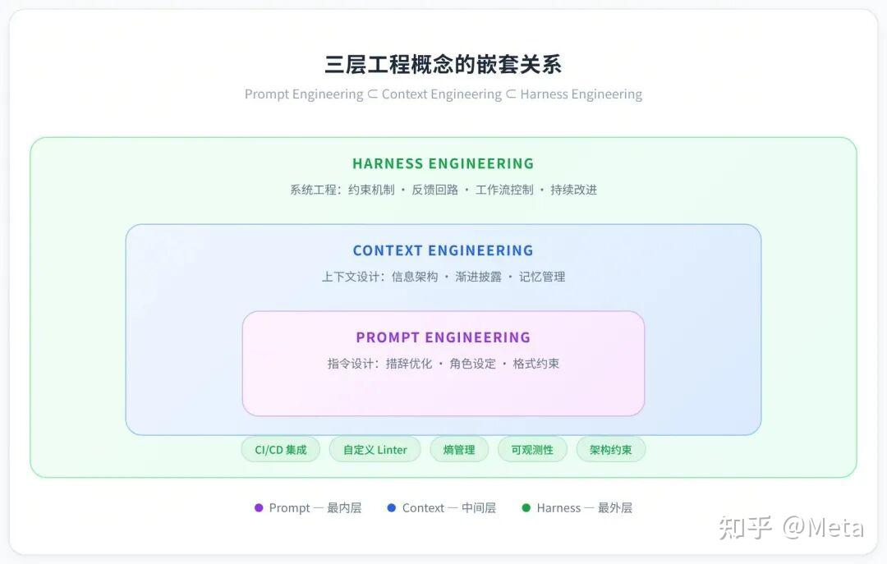
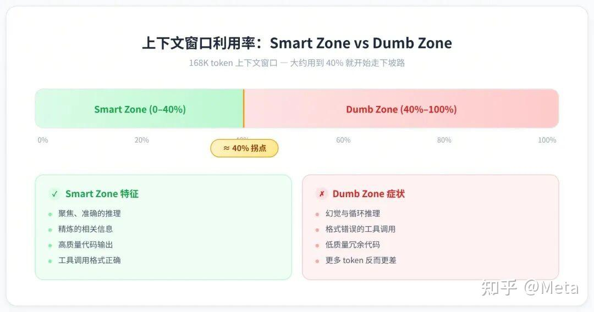
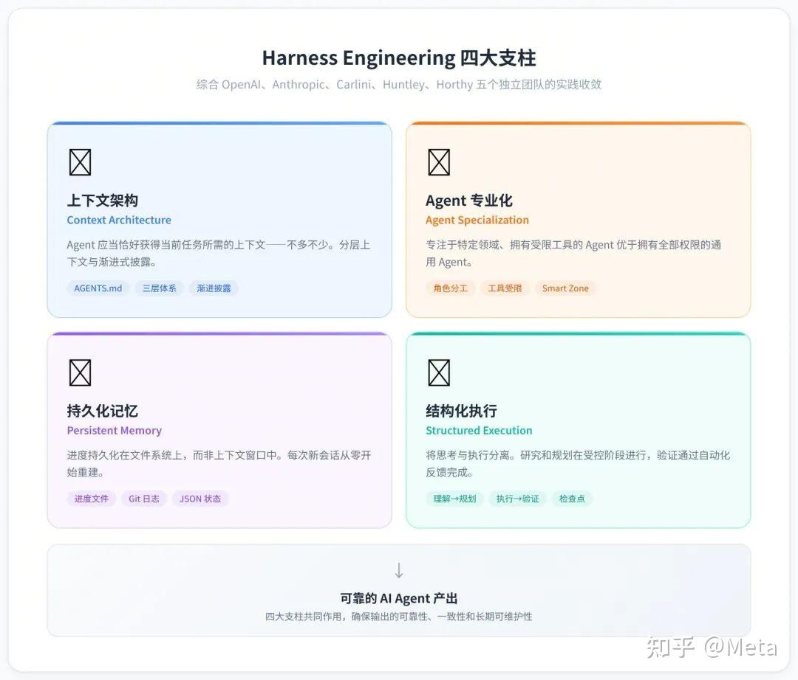
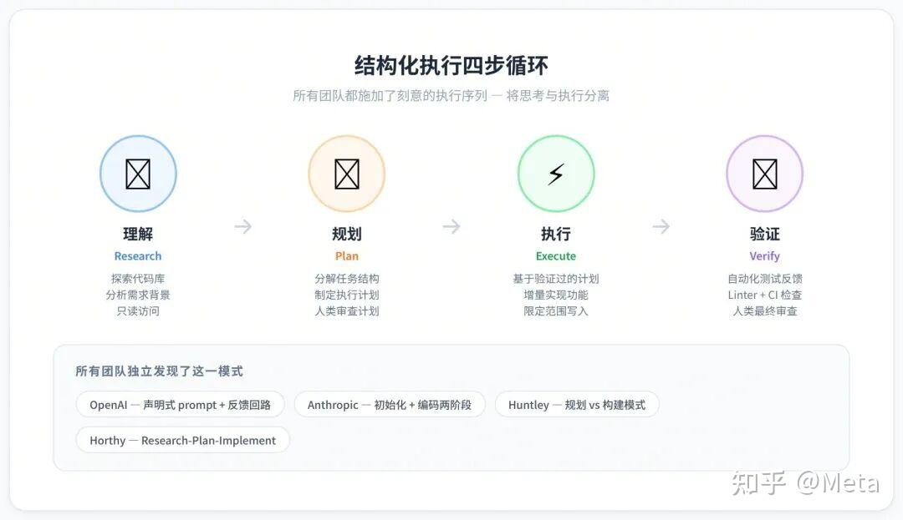
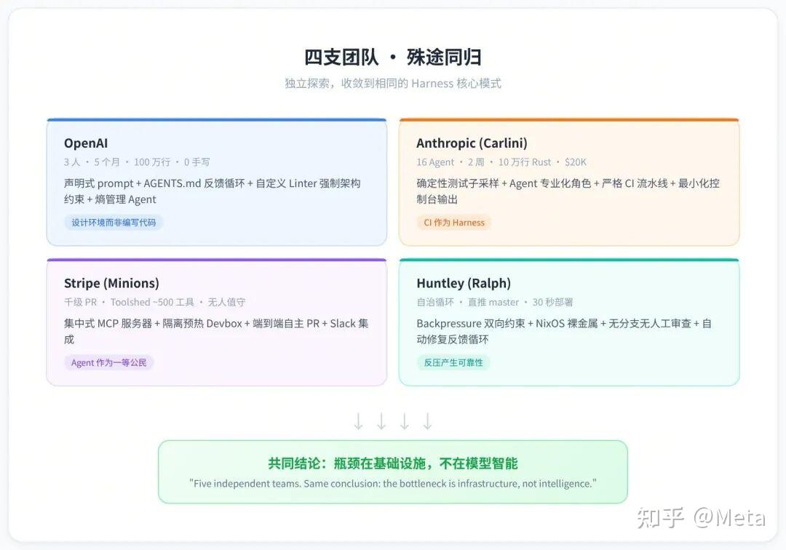
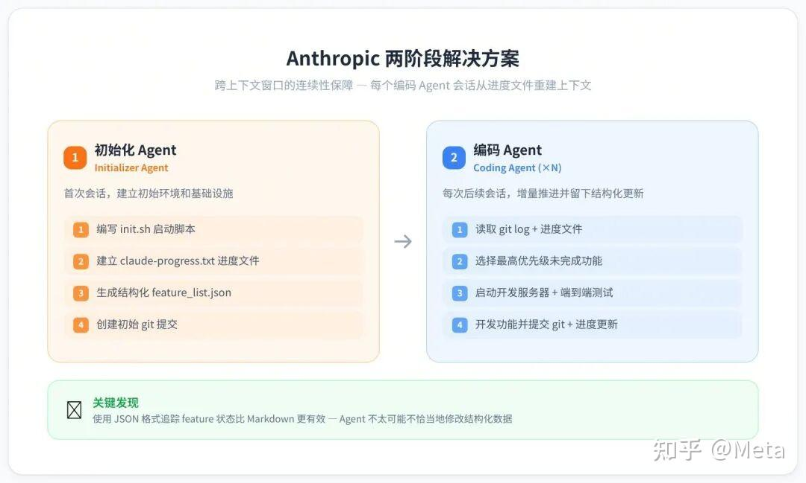
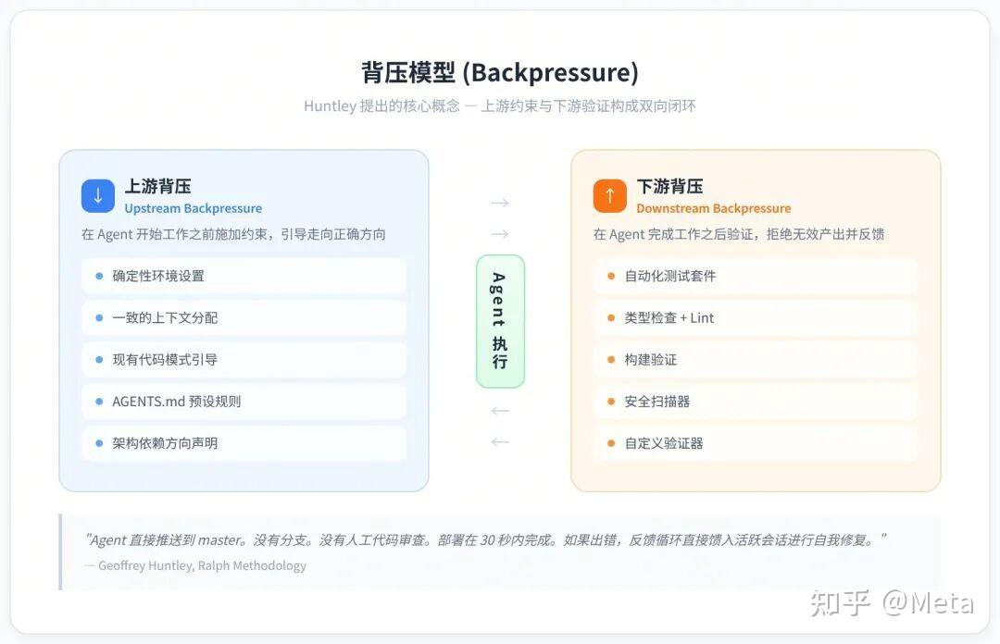
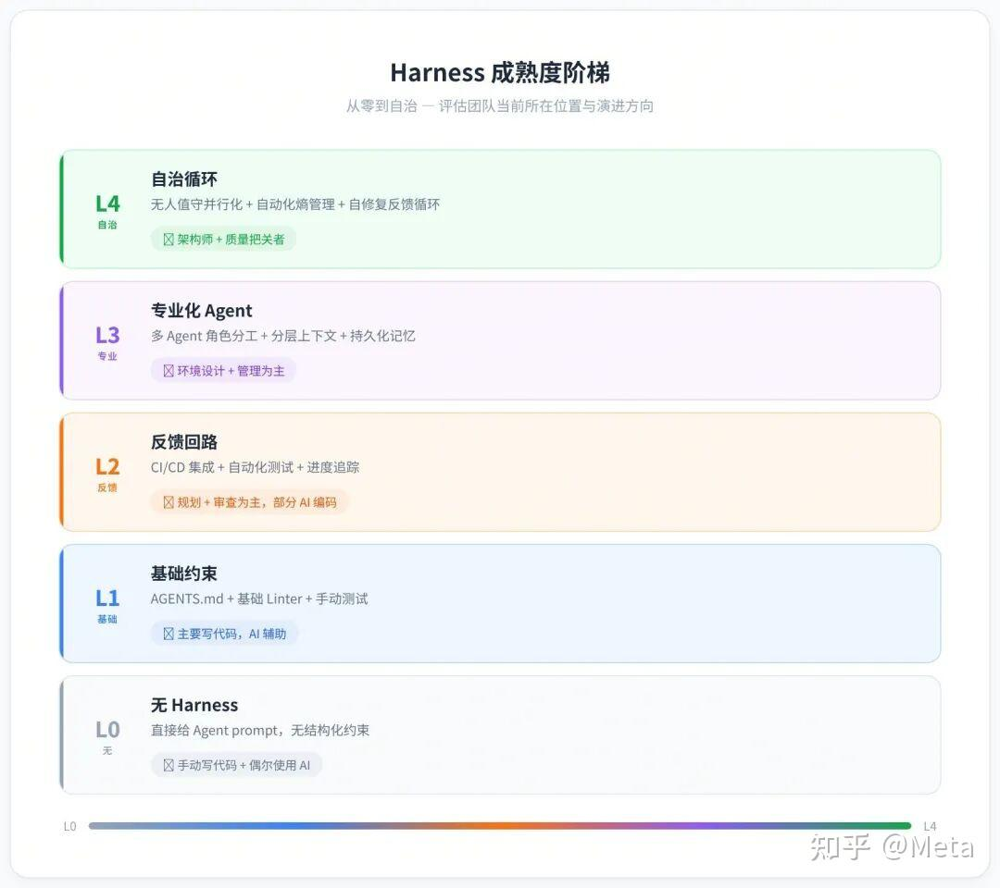
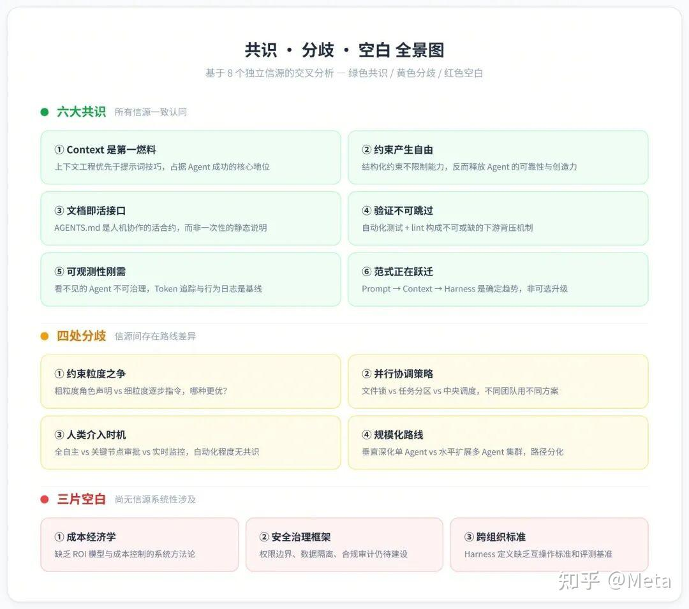

2026 年 2 月，"Harness Engineering"这个词突然在 AI 工程圈子里火了起来。Mitchell Hashimoto 在博客里提了这个说法，OpenAI 紧接着发了百万行代码的实验报告，Martin Fowler 也跟进写了深度分析——几周之内，这个术语就成了讨论 AI Agent 开发绕不开的话题。本文把 Harness Engineering 的来龙去脉、核心方法和实战经验做了一次系统整理，重点拆解 OpenAI、Anthropic、Stripe 等团队踩过的坑和沉淀下来的做法。最后，我们对 8 个独立信息源进行交叉对比，梳理出业界已形成共识的六大方面、仍存分歧的四个议题，以及三个最值得探索的空白区。

## 第一部分：什么是 Harness Engineering

**Harness Engineering**是指围绕 AI Agent（特别是 Coding Agent）设计和构建**约束机制、反馈回路、工作流控制和持续改进循环**的系统工程实践。它解决的核心问题是：当 AI Agent 拥有了强大的代码生成能力后，如何确保其输出的可靠性、一致性和长期可维护性。

"Harness"本意是马具——缰绳、鞍具那一套东西，把马的力气引到正确方向上。拿来类比 AI Agent 挺合适：LLM 就像一匹蛮力十足但方向感不太行的马，跑得快但容易跑偏。

### 1.1 三层工程概念的关系

Harness Engineering 并不是凭空出现的，它是 Prompt Engineering 和 Context Engineering 的自然延伸。三者构成嵌套关系：

Phil Schmid 打了个比方：**模型是 CPU，Harness 是操作系统**——CPU 再强，OS 拉胯也白搭。mtrajan 的区分更直接：Context Engineering 管的是"给 Agent 看什么"，Harness Engineering 管的是"系统怎么防崩、怎么量化、怎么修"。

### 1.2 这个词是怎么火起来的

2025 年底已经有人零星提到过这个说法，但真正结晶成术语是 2026 年 2 月的事：

**Mitchell Hashimoto**（HashiCorp 联合创始人、Terraform 创作者）在博客中首次明确命名了这一实践，提出核心理念："每当发现 Agent 犯错，就花时间设计一个解决方案，确保 Agent 永远不会再犯同样的错误"。

**OpenAI**数天后发布了"Harness engineering: leveraging Codex in an agent-first world"——一篇关于三名工程师用 5 个月构建百万行代码产品的详细报告。

**Ethan Mollick**围绕"Models, Apps, and Harnesses"三个概念重组了他的 AI 指南框架，迅速推动了术语的规范化。

**Martin Fowler**发表深度分析文章，将 OpenAI 的 Harness 分类为三个领域：Context Engineering、Architecture Constraints 和 Garbage Collection。

---

## 第二部分：为什么需要 Harness Engineering

### 2.1 模型能力不是瓶颈

这一判断得到了量化验证：

**Can.ac 实验**：仅改变 Harness 的工具格式（编辑接口），就在 16 个模型上显著提升了编码基准分数。效果最显著的 Grok Code Fast 1 从 6.7% 跃升至 68.3%——没有修改任何模型权重。

**LangChain实验**：仅通过 Harness 改进，在 Terminal Bench 2.0 上从第 30 名跃升至第 5 名，同一模型提升了 13.7 分。

这些结果表明：在纠结模型选择之前，先审视 Harness 设计能获得更高的投资回报率。

OpenAI 团队说得很直接：**真正卡你的不是 Agent 写代码的能力，而是围绕它的结构、工具和反馈机制跟不上**。五个独立团队得出了相同结论：基础设施才是瓶颈，而非智能水平。

### 2.2 Agent 的典型失败模式

Anthropic 在做长时间运行 Agent 的过程中，总结了 Agent 常见的翻车姿势：

**失败模式 1：试图一步到位（One-shotting）。** Agent 倾向于一次做完所有事情，结果在实现进行到一半时上下文窗口就耗尽了。下一个会话启动时看到的是半成品、没有文档的代码，只能花大量时间猜测之前发生了什么并试图恢复工作状态。

**失败模式 2：过早宣布胜利。** 在项目后期，当部分功能已经完成后，Agent 会环顾四周，看到已有进展就直接宣布任务完成——即使还有大量功能未实现。

**失败模式 3：过早标记功能完成。** 在没有明确提示的情况下，Agent 写完代码就标记为"完成"，却没有做端到端测试。单元测试或 curl 命令通过了不代表功能真正可用。

**失败模式 4：环境启动困难。** 每次新会话启动时，Agent 需要花费大量 token 弄清楚如何运行应用、如何启动开发服务器，而不是把时间花在实际开发上。

### 2.3 上下文窗口利用率的甜蜜区间

Dex Horthy 有个很实用的经验观察：**上下文填得越满，LLM输出质量越差**。以 168K token 的上下文窗口为例，大约用到 40% 就开始走下坡路了：

**Smart Zone（前约 40%）**：聚焦、准确的推理。Agent 拥有相关、精炼的信息。

**Dumb Zone（超过约 40%）**：幻觉、循环、格式错误的工具调用、低质量代码。更多 token 反而损害性能。

说白了，给 Agent 塞一堆 MCP 工具、冗长文档和累积的对话历史，不会让它更聪明——反而会让它变笨。

---

## 第三部分：Harness Engineering 的四大支柱

综合 OpenAI、Anthropic、Carlini（C 编译器项目）、Huntley、Horthy 等五个独立团队的实践，四种模式反复出现并形成收敛。这就是 Harness Engineering 的四大支柱。

### 3.1 支柱一：上下文架构（Context Architecture）

**核心原则**：Agent 应当恰好获得当前任务所需的上下文——不多不少。

每个团队都独立发现，将所有指令塞进一个文件无法扩展。解决方案是**分层上下文与渐进式披露**：

**OpenAI**使用 AGENTS.md 作为动态反馈循环文件，每当 Agent 遇到失败时更新。

**Anthropic**使用大量 README 和每次会话频繁更新的进度文件。

**Horthy**倡导"频繁有意识压缩"（Frequent Intentional Compaction）。

**Vasilopoulos（2026 论文）**将上下文形式化为三层：热记忆（Hot Memory）、领域专家（Domain Experts）、冷记忆知识库（Cold-Memory Knowledge）。

**实践建议——三层上下文体系**：

- Tier 1：会话常驻 — 每次会话自动加载 — AGENTS.md / CLAUDE.md，项目结构概览 — 最小上下文占用
- Tier 2：按需加载 — 特定子 Agent 或技能被调用时 — 专业化 Agent 的上下文、领域知识 — 中等占用
- Tier 3：持久化知识库 — Agent 主动查询时 — 研究文档、规格说明、历史会话 — 按需

### 3.2 支柱二：Agent 专业化（Agent Specialization）

**核心原则**：专注于特定领域、拥有受限工具的 Agent 优于拥有全部权限的通用 Agent。

**Carlini**（Anthropic C 编译器项目）将 Agent 专业化为编译器核心、去重、性能优化和文档四类角色。

**Vasilopoulos**部署了 19 个领域特定 Agent。

**Huntley**使用子 Agent 来保持主 Agent 上下文的清洁。

专业化不仅是组织性的——它本身就是上下文管理策略。每个专家因为携带更少的无关信息，所以运行在"Smart Zone"内。

**实践中的角色分工**：

- 研究 Agent：探索代码库、分析实现细节 — 只读（Read, Grep, Glob）
- 规划 Agent：将需求分解为结构化任务 — 只读，无写入权限
- 执行 Agent：实现单个具体任务 — 限定范围的读写权限
- 审查 Agent：审计完成的工作，标记问题 — 只读 + 标记权限
- 调试 Agent：修复审查发现的问题 — 限定范围的修复权限
- 清理 Agent：对抗熵积累，清理低质量代码 — 读写权限

### 3.3 支柱三：持久化记忆（Persistent Memory）

**核心原则**：进度持久化在文件系统上，而非上下文窗口中。每次新 Agent 会话从零开始，通过文件系统制品重建上下文。

Anthropic 解决这一问题的方案堪称经典：

**初始化 Agent**：首次会话使用专门的 prompt，要求模型建立初始环境——init.sh 脚本、claude-progress.txt 进度文件和初始 git 提交。

**编码 Agent**：后续每次会话要求模型在做出增量进展的同时，留下结构化更新。

每个编码 Agent 的典型会话启动流程如下：

1. 运行 pwd 查看工作目录
2. 读取 git log 和进度文件，了解最近的工作
3. 读取 feature list 文件，选择最高优先级的未完成功能
4. 启动开发服务器，运行基础端到端测试
5. 确认基本功能正常后，开始新功能开发

关键发现：**使用 JSON 格式追踪 feature 状态比 Markdown 更有效**，因为 Agent 不太可能不恰当地修改或覆盖结构化数据。

### 3.4 支柱四：结构化执行（Structured Execution）

**核心原则**：将思考与执行分离。研究和规划在受控阶段进行，执行基于验证过的计划，验证通过自动化反馈（测试、Linter、CI）和人类审查完成。

所有团队都施加了刻意的执行序列：**理解 → 规划 → 执行 → 验证**。

**OpenAI**使用声明式 prompt 和反馈回路。轻量的计划用于小变更，复杂工作通过带有进度和决策日志的执行计划完成，并检入仓库。

**Huntley**将规划模式与构建模式分离。

**Horthy**的 Research-Plan-Implement 工作流围绕上下文管理精心设计。

**人工检查点的价值**：审查计划远比审查代码快。当规格正确时，实现自然可靠。当规格有误时，可以在 500 行代码生成之前及时纠正。

---

## 第四部分：先进团队的实战案例

### 4.1 OpenAI：百万行代码的零手写实验

**实验概况**：

- 团队规模：3 名工程师
- 持续时间：5 个月（2025.8 起）
- 代码规模：约 100 万行
- 手写代码：0 行（设计约束）
- 合并 PR 数：约 1,500 个
- 日均 PR/人：3.5 个
- 效率提升：约 10 倍

**五大 Harness 原则**：

**原则 1：设计环境，而非编写代码。**工程师的工作转向为 Agent 准备高效运行的环境。当 Agent 卡住时，不是"更加努力"，而是诊断"缺少什么能力"并让 Agent 自己构建该能力。

**原则 2：机械化地执行架构约束。**他们为每个领域定义了依赖方向——Types → Config → Repo → Service → Runtime → UI——并用自定义 Linter 和结构测试自动检测违规。文档中记录是不够的；如果不能机械化地强制执行，Agent 就会偏离。

**原则 3：将代码仓库作为唯一事实源。**写在 Slack 讨论或 Google Docs 中的知识对 Agent 来说等于不存在。所有团队知识都作为版本控制的制品放置在仓库中。

**原则 4：将可观测性连接到 Agent。**他们将 Chrome DevTools 连接到运行时，使 Agent 能够捕获 DOM 快照和截图。通过赋予查询日志和指标的能力，"将启动时间降至 800ms 以下"变成了可度量的目标。

**原则 5：对抗熵。**最初团队每周五花 20% 的时间手动清理"AI Slop"（低质量生成物）。这后来被自动化为 Codex 运行的后台任务——清理吞吐量与代码生成吞吐量成正比扩展。

**自定义 Linter 的巧妙设计**：当 Agent 违反架构约束时，错误消息不仅标记违规——**还告诉 Agent 如何修复**。工具在 Agent 工作时同时"教会"它。

### 4.2 Anthropic：16 个 Agent 构建 C 编译器

Carlini 的 C 编译器项目可能是目前最硬核的 Agent 自主开发压力测试。

**项目数据**：

- 持续时间：约 2 周
- 并行 Agent 数：16 个 Claude Opus 4.6 实例
- Claude Code 会话数：约 2,000
- 产出 Rust 代码量：100,000 行
- GCC torture test 通过率：99%
- 可编译的真实项目：150+ (PostgreSQL, Redis, FFmpeg, CPython, Linux 6.9 Kernel 等)
- 总 API 成本：约 $20,000

**关键 Harness 设计**：

**上下文窗口污染缓解**：最小化控制台输出，日志写入文件，使用 grep 友好的错误格式（ERROR: [reason] 单行），预计算聚合统计而非输出原始数据。

**Agent 时间盲区**：Claude "无法感知时间，如果放任不管，会乐于花几个小时运行测试而不是推进工作。" 解决方案：确定性测试子采样。每个 Agent 运行随机 1-10% 的测试，但子采样对单个 Agent 是确定性的，跨 VM 是随机的——所以集体覆盖了完整的测试套件。

**专业化而非通用化**：随着项目成熟，Agent 承担了专门角色——核心编译器工作、去重（LLM 生成的代码经常重新实现已有功能）、性能优化、代码质量和文档。

**CI 作为 Harness**：接近尾声时，Claude 在实现新功能时频繁破坏现有功能。修复方案是一个更严格的 CI 流水线——**用 Harness 层面的解决方案应对模型层面的问题**。

Carlini 自己的总结很到位："我必须不断提醒自己，我是在为 Claude 写这个测试框架，不是为自己写。"

### 4.3 Anthropic：长时间运行 Agent 的有效 Harness

Anthropic 工程团队从另一个角度切入——**跨上下文窗口的连续性问题**——来研究 Harness 设计。

**核心痛点**：长时间跑的 Agent 必须在一个个独立会话里工作，每次新会话启动时对前一次做了什么一无所知。就像一个项目组全是轮班工程师，每个人上岗时对之前的进展一脸懵。

**两阶段解决方案**：

**初始化 Agent**：使用专门的 prompt 建立初始环境，包括 init.sh 脚本、claude-progress.txt 进度日志和初始 git 提交。

**编码 Agent**：每次后续会话要求模型做出增量进展，然后留下结构化更新。

**四大失败模式与对策**：

- 过早宣布项目完成 → 初始化 Agent 建立功能列表文件，编码 Agent 会话开始时读取功能列表选择单个功能
- 环境中遗留 bug → 初始化 Agent 编写初始 git 仓库和进度记录，编码 Agent 开始时读取进度文件和 git 日志
- 过早标记功能为完成 → 初始化 Agent 建立功能列表，编码 Agent 自我验证后才标记为 "passing"
- 需要花时间弄清如何运行应用 → 初始化 Agent 编写 init.sh 脚本，编码 Agent 会话开始时读取

**浏览器自动化测试**：为 Claude 提供 Puppeteer MCP 等测试工具后，Agent 能够识别和修复仅从代码层面无法看到的 bug，显著提升了端到端验证的效果。

### 4.4 Stripe：千级 PR 的 Minions 系统

Stripe 的 Minions 是目前看到的最成熟的**无人值守并行化**实践：开发者在 Slack 里发个任务，Agent 从写代码到跑通 CI 再到提 PR 全程包办，人只在最后审查环节介入。

**关键架构要素**：

**Toolshed MCP 服务器**：Minions 连接到 Stripe 的集中式 MCP 服务器，提供近 500 个工具，覆盖内部系统和 SaaS 平台。

**隔离的预热 Devbox**：与人类工程师使用相同的开发环境，但与生产和互联网隔离。

**重要的一点**：Agent 需要和人类工程师一样的上下文和工具——不是事后补上的集成，而是一开始就得是一等公民。

**Hashimoto 的 Ghostty 实践**：

Hashimoto 指出 Ghostty 项目中 AGENTS.md 文件的每一行都对应着一个过去的 Agent 失败案例——现在被永久预防。他的核心工作模式：

- 每天最后 30 分钟启动一个或多个 Agent
- Agent 在非工作时间做出一些正向进展，为第二天早上提供"暖启动"
- 约 10-20% 的正常工作日有后台 Agent 运行

**Huntley 的 Ralph Wiggum Loop**：

Huntley 的自治循环 `while :; do cat PROMPT.md | claude-code; done` 因其简洁而广为流传。但其核心不是循环——而是**反压（Backpressure）**：

**上游反压**：确定性设置、一致的上下文分配、现有代码模式引导模型走向首选实现。

**下游反压**：测试、类型检查、Lint、构建、安全扫描器和自定义验证器拒绝无效工作。

他的生产设置在 NixOS 上运行裸金属。Agent 直接推送到 master。没有分支。没有人工代码审查。部署在 30 秒内完成。如果出错，反馈循环直接馈入活跃会话进行自我修复。

---

## 第五部分：Harness 的核心组件详解

### 5.1 AGENTS.md——Agent 的活文档

AGENTS.md 是一个新兴的开放约定——本质上是给 AI Agent 的 README。它是代码仓库根目录下的 Markdown 文件，编码 Agent 在每次会话开始时自动读取。

**关键特性**：

- 不是一次性编写后遗忘的静态文档
- 每当 Agent 犯错时都要更新——**文档变成了反馈循环而非静态制品**
- 简单的错误（Agent 运行了错误命令、找到了错误 API）通过更新 AGENTS.md 解决
- 复杂的问题需要构建工具层面的解决方案

**OpenAI 的进阶实践**：不是维护一个巨大的指令文件，而是构建了一个小型 AGENTS.md，指向更深层的事实源——设计文档、架构图、执行计划、质量评级——全部版本控制并维护在仓库中。一个后台 Agent 定期扫描过期文档并提交清理 PR：**由 Agent 为 Agent 维护的文档**。

### 5.2 架构约束与自动化执行

**分层架构依赖方向强制执行（OpenAI 实践）**：

Types → Config → Repo → Service → Runtime → UI

任何违反这一方向的代码都被自定义 Linter 自动检测和阻止。在人类优先的工作流中，这些规则可能感觉过于严苛；对 Agent 来说，它们是乘数效应：一旦编码，便处处适用。

**Linter 错误消息即修复指令**：

传统 Linter 错误消息仅标记违规。OpenAI 的自定义 Linter 在错误消息中直接包含修复方法——Agent 在遇到违规时同时获得了"教学"。

**结构测试**：

Martin Fowler 提到了 ArchUnit 等结构测试框架的潜力——它们可以验证代码库的架构约束是否被遵守，这对于 AI Agent 生成的代码尤其重要。

### 5.3 可观测性集成

OpenAI 团队将可观测性连接到 Agent 工作流：

- **浏览器自动化**：通过 Puppeteer MCP 让 Agent 像人类用户一样进行端到端测试
- **Chrome DevTools 集成**：Agent 能捕获 DOM 快照和截图
- **日志和指标查询**：使性能目标（如"启动时间低于 800ms"）变得可度量
- **遥测驱动的 bug 修复**：Agent 利用日志、指标和 Span 来自主重现 bug 和验证修复

### 5.4 熵管理与"垃圾回收"

Agent 生成的代码以不同于人类编写的方式积累"技术债"。OpenAI 的 Harness Engineering 报告称之为"熵"。

**解决方案**：定期运行的"垃圾回收" Agent：

- 扫描文档不一致
- 检测架构约束违规
- 清理冗余或低质量代码
- 确保清理吞吐量与代码生成吞吐量成比例

---

## 第六部分：工程师角色的转变

### 6.1 从写代码到设计环境

OpenAI 和 Anthropic 的实践都指向同一个结论：工程师的工作正在分成两块很不一样的东西：

**第一部分：构建环境。**当 Codex 卡住时，团队将其视为环境设计问题——诊断 Agent 缺少什么才能可靠地继续工作。焦点从实现转向赋能。

**第二部分：管理工作。**Greg Brockman 建议每个团队指定一名"Agent 队长"——负责思考 Agent 如何融入团队工作流。Peter Steinberger（OpenClaw 创作者）在一个月内完成了 6,600+ 次提交，同时运行 5-10 个 Agent。

这两部分不是顺序关系。你同时做两件事，每件事都影响另一件：**Agent 的失败告诉你环境缺少什么；更好的环境让管理更顺畅。**

### 6.2 规划是新的编码

越来越多的开发者强调与 AI 合作时**前期规划的广度**——如此之深，以至于大多数 AI 编码工具现在都包含专用的"更多规划"功能。

Cloudflare 的 Boris Tane 将此原则总结为一句话："永远不要让 Agent 在你审查和批准书面计划之前写代码。这种规划与执行的分离是我做的最重要的一件事。"

Anthropic 的做法更进一步：初始化 Agent 从高级 prompt 生成综合 feature 列表——单个 Web 应用超过 200 个独立功能，每个都有明确的测试步骤，全部初始标记为"failing"。

### 6.3 并行编排与"两种管理风格"

两种并行工作模式正在浮现：

- **有人值守并行化**：主动管理多个 Agent 会话，检查每个、按需重定向 — 更多控制，更早发现问题 — 认知负担高
- **无人值守并行化**：开发者发布任务后离开，Agent 自主完成到 PR — 更好的可扩展性 — Harness 必须足够好以信任 Agent

Stripe 能做到无人值守并行化，是因为他们已经建立了 Toolshed、预热 Devbox 和紧密的 CI 集成。大多数团队还不具备这些条件。

团队在这个光谱上的位置取决于两个因素：**Harness 的成熟度**和**对 Agent 在代码库中的信任程度**。

---

## 第七部分：业界趋势与前瞻

### 7.1 Harness 将成为新的服务模板

Martin Fowler 提了一个比较有意思的判断：大多数组织只有两三个主要技术栈。未来，团队可能会从一组预制 Harness 中选择，就像今天的服务模板（Service Templates）帮助团队在"黄金路径"上实例化新服务。

**Harness 模板可能包含**：

- 自定义 Linter 规则
- 结构测试
- 基础上下文和知识文档
- 额外的上下文提供者
- 预配置的 CI/CD 管道

### 7.2 技术栈和代码拓扑的收敛

当编码不再是关于打字而是关于引导生成时，AI 可能推动我们走向**更少的技术栈选择**。开发者可能基于"AI 友好性"和"Harness 可用性"来选择技术栈，而不仅仅是开发者偏好。

### 7.3 Harness 应趋向简化而非复杂化

Phil Schmid 的分析揭示了一个反直觉的现象：Manus 团队半年内重写了五次 Harness，但每次的方向都是**简化而不是加复杂度**——用通用 Shell 执行替代复杂工具定义，用结构化交接替代管理 Agent，采用 Agent-as-a-Tool 模式。

**经验教训**：随着模型能力提升，Harness 应该越做越薄。如果发现 Harness 越做越复杂，大概率是过度工程化了。

### 7.4 更好的模型让 Harness 更重要而非更不重要

Carlini 的 C 编译器项目给了直接证据：Opus 4.5 能产出能用的编译器，Opus 4.6 能编译 Linux 内核——但每个能力级别都得重新设计 Harness。**模型越强，能给的自主权越大，护栏就得越好**。

### 7.5 棕地项目的改造挑战

所有公开的成功案例都涉及绿地项目或从零构建的 Harness。将这些技术应用到有十年历史、没有架构约束、测试不一致、文档残缺的代码库上，是一个更复杂的问题。Martin Fowler 将其比作"在从未使用过静态分析工具的代码库上运行静态分析——你会被警报淹没"。

---

## 第八部分：最佳实践总结

### 8.1 立即可行的行动清单

- **创建并维护 AGENTS.md**：不是一次性任务，而是每当 Agent 犯错时都更新的活文档。
- **在仓库中建立单一事实源**：所有团队知识作为版本控制的制品存放在代码仓库中，不放在 Slack、Wiki 或 Google Docs。
- **构建自定义 Linter 并在错误消息中嵌入修复指令**：工具在 Agent 工作时同时"教会"它。
- **为 Agent 提供端到端测试工具**：浏览器自动化（如 Puppeteer MCP）显著提升验证质量。
- **实施增量执行策略**：每次会话只处理一个功能，完成后提交 git 和进度更新。
- **分层管理上下文**：避免将所有信息堆叠在单个文件中，使用 Tier 1/2/3 渐进式披露。
- **上下文利用率保持在 40% 以下**：更多 token 不代表更好的结果。
- **建立定期"垃圾回收"机制**：自动化 Agent 定期清理技术债、检查文档一致性。

### 8.2 Harness 成熟度评估模型

- Level 0：无 Harness — 直接给 Agent prompt，无结构化约束 — 手动写代码+偶尔使用 AI
- Level 1：基础约束 — AGENTS.md + 基础 Linter + 手动测试 — 主要写代码，AI 辅助
- Level 2：反馈回路 — CI/CD 集成 + 自动化测试 + 进度追踪 — 规划+审查为主，部分 AI 编码
- Level 3：专业化 Agent — 多 Agent 角色分工 + 分层上下文 + 持久化记忆 — 环境设计+管理为主
- Level 4：自治循环 — 无人值守并行化 + 自动化熵管理 + 自修复 — 架构师+质量把关者

### 8.3 关键 Harness 组件检查清单

- P0：AGENTS.md / CLAUDE.md（会话常驻上下文）、自定义 Linter + 结构测试（机械化约束）、CI/CD 管道（自动化验证）
- P1：进度文件（跨会话记忆）、功能列表文件（结构化完成标准）、浏览器自动化（端到端测试）
- P2：可观测性集成（日志/指标查询）、熵管理 Agent（清理低质量代码）、专业化子 Agent（分工协作）、MCP 工具集成（外部工具连接）

---

## 第九部分：开放问题与挑战

### 9.1 代码可维护性的长期隐患

Greg Brockman 抛出了一个还没有答案的问题：**怎么防止"功能没问题但维护性很差"的代码渗透进代码库？**Agent 写的代码和人写的代码，积累技术债的方式不一样。定期跑"垃圾回收" Agent 是一种新兴做法，但效果还待验证。

### 9.2 规模化验证

Birgitta Böckeler 对 OpenAI 报告的批评直击要害：报告缺乏对功能和行为的验证。即使有浏览器自动化，视觉能力和工具限制意味着某些 bug 仍会遗漏（例如 Agent 无法看到浏览器原生 alert 弹窗）。

### 9.3 棕地项目改造

如何为已有十年历史的代码库引入 Harness Engineering——而不是被警报淹没——仍是一个开放问题。可能需要增量式引入，从最关键的架构约束开始。

### 9.4 文化采纳

所有成功案例都指向同一个事实：**这些东西不会自己出现，得有人去建。**好消息是这些投入有复利效应——每次 AGENTS.md 更新都预防了一类未来失败，每个自定义 Linter 让后续每个 Agent 会话都受益，每个通过 MCP 暴露的工具都加快后续任务。前期成本确实不低，但回报会加速。

---

## 第十部分：业界共识与分歧全景

综合 OpenAI、Anthropic、Stripe、Martin Fowler / Böckeler、Mitchell Hashimoto、Charlie Guo、Alex Lavaee、SmartScope 等 8 个独立信息源的交叉对比，以下梳理出 Harness Engineering 领域目前已形成共识的方面和仍存在分歧的方面。

### 10.1 六大共识

**共识 1：瓶颈在基础设施，不在模型智能。**这是整个领域最核心的共识。Can.ac 实验中仅改变 Harness 的工具格式就让 Grok Code Fast 1 从 6.7% 跳到 68.3%，LangChain 同一模型靠 Harness 改进从第 30 名跳到第 5 名。

**共识 2：文档必须是活的反馈循环，不是静态制品。**Hashimoto 的 Ghostty 项目 AGENTS.md 每一行都对应一个历史 Agent 失败案例。OpenAI 更进一步，让后台 Agent 定期扫描过期文档并提交清理 PR。

**共识 3：思考与执行必须分离。**所有团队独立发现了"先规划再执行"的模式。

**共识 4：上下文不是越多越好。**Horthy 给出量化经验——上下文填到约 40% 就开始走下坡路。

**共识 5：约束必须机械化执行，不能靠文档记录。**"if it cannot be enforced mechanically, agents will deviate."

**共识 6：工程师角色正在从"写代码"转向"设计环境 + 管理工作"。**

### 10.2 四大分歧

**分歧 1：Harness 应该越做越复杂还是越做越简单？**取决于通用产品 vs 定制项目。

**分歧 2：单 Agent 还是多 Agent 架构？**任务复杂度和代码库规模是决定因素。

**分歧 3：人类应该介入到什么程度？**取决于 Harness 成熟度和信任程度。

**分歧 4：术语边界怎么画？**嵌套关系 vs 互补关系，争的是怎么画框，不是框里有什么。

### 10.3 三大空白区

**空白 1：棕地项目的 Harness 改造。**所有成功案例全部是绿地项目，零成功案例、零方法论用于遗留代码库。

**空白 2：功能和行为验证的系统化方案。**"约束 Agent 不做错事"已有方法，"验证 Agent 做对了事"远未解决。

**空白 3：AI 生成代码的长期可维护性。**Agent 写的代码积累技术债的方式不同于人类，长期效果缺乏数据。

---

## 总结

Harness Engineering 标志着 AI 辅助开发从"让模型写代码"到"设计让模型可靠工作的系统"的范式转变。这不是等更强模型出来就能解决的事——模型越强，Harness 反而越重要。如果只记一句话：**瓶颈不在智能，而在基础设施。**正如 Addy Osmani 所言："AI 编码的兴起并没有取代软件工程的工艺——它抬高了工艺的门槛。"

## 参考文献与资料链接

### 核心文章与报告
- **OpenAI** — Harness engineering: leveraging Codex in an agent-first world
- **Anthropic** — Effective harnesses for long-running agents
- **Anthropic** — Demystifying evals for AI agents
- **Nicholas Carlini (Anthropic)** — Building a C Compiler with Claude
- **Martin Fowler** — Harness Engineering
- **Martin Fowler** — Context Engineering for Coding Agents

### 深度分析与综述
- **Charlie Guo (Artificial Ignorance)** — The Emerging "Harness Engineering" Playbook
- **SmartScope** — What Is Harness Engineering
- **Alex Lavaee** — How to Harness Coding Agents with the Right Infrastructure
- **Addy Osmani** — Agentic Engineering

### 实践者博客与案例
- **Mitchell Hashimoto** — My AI Adoption Journey
- **Geoffrey Huntley** — Ralph Methodology
- **Dex Horthy** — Advanced Context Engineering for Coding Agents
- **Stripe** — Minions: Stripe's one-shot, end-to-end coding agents
