# Skill 最佳实践：五种设计模式+六步打磨法（含完整实战过程和源码）

**作者**：熊猫Jay  
**公众号**：熊猫Jay字节之旅  
**发布时间**：2026年4月9日 21:51  
**原文链接**：[Skill 最佳实践：五种设计模式+六步打磨法（含完整实战过程和源码）](https://mp.weixin.qq.com/s/5s2CXjo_u_8FX76skHA5jA)

---
我用 AI 差点让公司亏了一个项目。

事情是这样的：**客户着急要一份软件需求的工时报价，销售一个小时催了我三遍。**

我人都被催麻了，差点想骂人。

于是，我让 AI 快速跑了两遍，一次 157 人天，一次 71 人天。

差了一倍。

后来我仔细看了下，如果拿着 71 人天的结果去报价，项目铁定亏。

真的，不禁后背发凉。

这次，我先安抚住客户和销售，决定做一套 Skill 出来，告别这种夺命连环催的状态。

最后，同样的需求，每次跑出来的结果稳定、资源真实、格式统一，而且只需要 10 分钟。

今天，我把这套方法论和完整源码开源出来（见文末）。

      
     
       
         
           
             
                                

                 
                   
已关注
                   **                 
             
             
               关注
           
           
                            **               重播                                         **               分享                                                      **               赞                                         **               随便看看              -->           
         
                   
         
                   
         
       
     
     

**关闭**观看更多**更多退出全屏切换到竖屏全屏退出全屏熊猫Jay字节之旅已关注分享视频，时长00:560/000:00/00:56 切换到横屏模式 继续播放进度条，百分之0播放00:00/00:5600:56倍速全屏 倍速播放中  0.5倍  0.75倍  1.0倍  1.5倍  2.0倍  超清  流畅 
🎬 [视频](https://mpvideo.qpic.cn/0bc3eueacaaizaabby67wvuvqjodaesqqaia.f10002.mp4?dis_k=3ebf678138473f8feee11c56ad988bcd&dis_t=1776412497&play_scene=10120&auth_info=IZOJ8z9tYAvhiru+GzZFU2tPQzwJejtqR1M2NRVxMWMZIjRPMVdrXjMEARF5dXxcfxk=&auth_key=d8c2dee056046082aa20bd0f18dc8182&vid=wxv_4464588949096595464&format_id=10002&support_redirect=0&mmversion=false)
继续观看 Skill 最佳实践：五种设计模式+六步打磨法（含完整实战过程和源码） 观看更多原创,Skill 最佳实践：五种设计模式+六步打磨法（含完整实战过程和源码）熊猫Jay字节之旅已关注分享点赞在看已同步到看一看写下你的评论
```

```
                                 视频详情                
## 一、五种常见的 Skill 设计模式
在讲方法论之前，我们先来了解下 Google 总结出的五种常见 Skill 设计模式。我在自己的实践中也验证了这几种模式的有效性，这里结合我的理解，做一个拆解。
### 模式一：知识注入型（Tool Wrapper）
解决什么问题：**AI 的通用知识不够精准，需要注入「只有你知道的」专业知识。**核心思路：把你的专业经验打包成 references 文件，AI 在需要时自动加载，按你的标准来做事。**举个例子：**你让 AI 帮你写小红书文案，但它写出来的风格总是不对：**要么太正式，要么太浮夸**。你可以把自己过去点赞量最高的 10 篇文案放进 `references/`，再在 SKILL.md 里写「模仿这些文案的风格」，AI 就会照着你的调性来写。**实际的 SKILL.md 长什么样？**●●●# skills/writing-xhs-copy/SKILL.md---name: writing-xhs-copydescription: 按团队风格写小红书文案。当用户要求写小红书文案、种草笔记时激活。--- 你是小红书文案助手。写文案前先加载 references/top-posts.md，学习这些爆款文案的风格和结构。 ## 我们团队的文案规范（AI 不知道的部分）- 人设是「闺蜜分享」，不是「专家推荐」，禁用「强烈推荐」「必入」等营销词- 第一句必须是反问句或场景描写，不能直接说产品名- 每篇控制在 300-500 字，超过 500 字阅读完成率会断崖下跌- 图片说明统一用「p1:xxx p2:xxx」格式，方便运营同事对图就是一个 Markdown 文件，没有任何编程门槛。这是最简单的模式，适合入门练手。
### 模式二：模板生成型（Generator）
解决什么问题：**AI 每次生成的输出格式不一致，结构飘忽不定。**核心思路：在 assets/ 里放一个输出模板，让 AI 按模板结构往里填内容，而不是自由发挥。**举个例子：**你每天要写日报，格式固定：**今日完成 / 明日计划 / 阻塞项**。每次让 AI 写，格式都不一样。那我们可以放一个日报模板进去，让 AI 做填空题，这样，输出会稳定得多。同样的思路，可以用在**技术报告、项目周报、产品需求文档**，以及任何有固定格式要求的重复性产出。●●●# skills/generating-daily-report/SKILL.md---name: generating-daily-reportdescription: 按团队格式生成每日工作日报。当用户说"写日报"、"今日总结"时激活。--- 你是日报生成助手。严格按以下步骤执行： 1. 加载 assets/report-template.md 获取日报模板2. 询问用户：今天做了什么？明天计划做什么？有没有阻塞项？3. 按模板格式填写，注意以下团队要求：   - 每条必须带数据（完成了"3 个页面"而不是"若干页面"）   - 阻塞项不超过 2 条，多了拆到明日计划里   - 语气用陈述句，不要用"我觉得""可能"等模糊表述4. 输出完整日报，不要遗漏模板中的任何章节注意，模板越具体越好。别写 “**请生成报告**”，而是给出每个章节的标题和填写要求。
### 模式三：审查打分型（Reviewer）
解决什么问题：**你需要 AI 按照一套固定标准去检查、评估某个东西。**核心思路：把检查清单放在 references/ 里，SKILL.md 定义审查流程：**加载清单 → 逐项检查 → 按严重程度分类 → 输出结构化报告**。**举个例子：**你写完一篇公众号文章，想让 AI 帮你检查：•标题是否有吸引力？•开头 3 秒能不能抓住人？•段落是不是太长？•有没有错别字？我们可以把这些检查项做成 checklist 放进去，AI 就变成了你的私人编辑。这个模式最灵活的地方在于：换一份 checklist，就变成完全不同的审查工具。**同样的骨架，放代码规范进去就是代码审查，放安全标准进去就是漏洞扫描。**●●●# skills/reviewing-articles/SKILL.md---name: reviewing-articlesdescription: 按团队标准审查公众号文章质量。当用户说"帮我检查文章"、"文章审核"时激活。--- 你是公众号文章质量审查员。这个 Skill 只做检查，不做改写。 1. 加载 references/review-checklist.md 获取检查清单2. 通读用户提交的文章，理解主题和受众3. 逐项对照检查清单，对每个问题：   - 标注严重程度：必须修 / 建议修 / 供参考   - 说明为什么是问题（不要只说"标题不好"，要说"标题没有制造信息差，用户没有点开的理由"）   - 给出具体修改建议4. 输出结构化报告：先列必须修的，再列建议修的，最后给总分（1-10）关键要求 AI 不只说 “这里有问题”，还要说 “为什么是问题” 和 “怎么改”。
### 模式四：反转采访型（Inversion）
解决什么问题：**AI 总是在信息不足的情况下急着动手，结果做出来的东西和你想要的偏差很大。**核心思路：翻转交互方向——不是你提需求 AI 马上执行，而是 AI 先当采访者，问清楚再动手。**举个例子：**你说**「帮我规划一个日本旅行」**，AI 二话不说就给你列了 7 天行程。但它不知道你只有 5 天假、预算有限、带着老人不能暴走、而且最想去的是温泉不是东京。如果 Skill 要求 AI 先问：**去几天？预算多少？同行人是谁？有没有必去的地方？**问完再规划，结果好几倍。●●●# skills/planning-travel/SKILL.md---name: planning-traveldescription: 通过结构化提问收集需求后规划旅行行程。当用户说"规划旅行"、"做攻略"时激活。--- 你是旅行规划师。在开始规划之前，必须先完成信息采集。不要跳过任何问题，不要在问题回答完之前给出行程方案。 ## 第一轮：基本信息（逐个问，等用户回答）- 去哪里？出发时间和天数？- 预算大概多少？- 同行人是谁？（老人/小孩/朋友/独行） ## 第二轮：偏好确认- 最想体验什么？（美食/文化/自然/购物）- 有没有必去的地方？- 有什么忌讳或限制？（不能爬山、怕冷、素食等） ## 第三轮：输出方案（所有问题回答完才执行）加载 references/travel-tips.md 获取目的地踩坑经验（旺季避坑、交通陷阱、本地人建议等）。根据收集到的信息，输出逐日行程，包含交通、住宿建议和预算估算。看起来多了一轮对话，实际上省了后面反复返工的时间。这个模式在实际使用中被严重低估了。大多数 Skill 失败的原因不是流程写得不好，而是 AI 在 **信息不全** 的情况下就直接开始执行了。
### 模式五：流水线型（Pipeline）
解决什么问题：**任务复杂、步骤多，AI 容易跳步或遗漏关键环节。**核心思路：把任务拆成严格的阶段，每个阶段有明确的输入、输出和检查点。上一步没通过验证，不允许进入下一步。**举个例子：**你用 AI 写公众号文章的完整流程：**先确定选题方向 → 列大纲让你确认 → 写初稿 → 自检（标题吸引力、开头钩子、排版规范）→ 生成终稿**。如果你没确认大纲，AI 不能开始写正文；如果自检没通过，不能输出终稿。每一步之间有明确的「关卡」。●●●# skills/writing-wechat-articles/SKILL.md---name: writing-wechat-articlesdescription: 按流水线流程创作公众号文章。当用户说"写一篇文章"、"帮我写公众号"时激活。--- 你是公众号写作流水线。严格按步骤执行，不要跳步。 ## 第一步：选题确认询问用户想写什么主题、目标读者是谁。输出 3 个选题方向供选择。→ 用户确认后才进入下一步。 ## 第二步：大纲根据选题列出文章大纲（标题 + 各段核心观点）。→ 用户确认后才进入下一步。 ## 第三步：写初稿按大纲写完整文章。加载 references/writing-style.md 遵循团队风格（我们的号走「专业但不端着」路线，禁用「赋能」「抓手」等黑话）。 ## 第四步：自检加载 references/quality-checklist.md，逐项检查。检查不通过的自动修改，通过后输出终稿。这是最重型的模式，只在任务确实复杂时使用，简单任务不要过度设计。**怎么选？一个简单的决策树：**
| 你的核心需求 | 选哪个模式 |
| --- | --- |
| AI 对某个工具/框架的用法不准 | 知识注入型 |
| 每次输出的格式不统一 | 模板生成型 |
| 需要按固定标准做检查 | 审查打分型 |
| AI 总在信息不足时急着动手 | 反转采访型 |
| 任务步骤多且不能跳步 | 流水线型 |
最后一个重要提醒：**这五种模式不是互斥的，它们完全可以组合。**一个流水线型的 Skill 可以在第一步用反转模式收集需求，在最后一步用审查模式做质量检查。记得设计 Skill 的时候，先确定主模式，再看是否需要在某个环节嵌入其他模式。
## 二、进阶：如何系统化地打磨一个 Skill
我想说：**“能用”和“好用” 的 Skill 之间，隔着一道巨大的鸿沟。**很多人写完 Skill 之后的做法是：跑一遍，效果不好，就凭直觉改几句描述、加几条约束，再跑一遍……如此反复，改了十几版，也说不清楚到底是变好了还是变差了。问题出在哪？**没有参照物，也没有衡量标准。**下面我介绍一套「**评测驱动**」的打磨方法论。核心思路是：**不要猜 Skill 该写什么，让失败告诉你该写什么。**
### 第一步：建立基线，发现问题
在写任何 Skill 之前，可以考虑先让  DeepSeek、Claude 直接做一遍你需要完成的任务。这一步的目的是为了发现问题：**就像医生开药之前先做体检，你得先知道"病"在哪。****重点观察三件事：**•AI 在哪些环节表现不稳定，同样的输入，结果时好时坏？•哪些输入会让 AI 理解歧义、走偏方向？•AI 有没有在不该主动的时候「自作聪明」？把这些问题一条条记下来，这就是你的 Skill 需要解决的真实缺口，也是后面所有测试用例的来源。这里有一个简单的判断标准，大家习惯叫它「五分钟测试」：**如果 DeepSeek 就能在 5 分钟内给出稳定的结果，你大概率不需要为这件事写 Skill；****如果 5 分钟内搞不定、或者结果时好时坏，那才是 Skill 真正的切入点。**
### 第二步：定义验收标准
这一步反直觉，但非常关键。大多数人的做法是：先写 Skill → 然后想怎么测试。但正确的顺序是反过来：**先定义「什么算做对了」，再写 Skill 去达标。**具体做法：•根据第一步识别的问题，设计 3-5 个具体的测试用例•每个用例有明确的「通过」和「失败」标准•优先覆盖 AI 最容易犯错的场景为什么要这么做？**因为没有测试约束的 Skill，本质上是在放大 AI 行为的不确定性。**你加的每一条规则，如果不知道它在解决什么问题，就可能会继续制造新的问题。
### 第三步：写最小版本的 Skill
现在才开始写 Skill。但注意，不要试图一次覆盖所有情况，写能通过测试标准的 MVP 版本。重点做三件事：1.**写”什么时候不要用“**：把最开始发现的误触发场景写进去，作为第一道防线。2.**定义最短成功路径**：用最少的步骤描述核心流程，确保最基本的输入能得到稳定的输出。3.**保持单一职责**：一个 Skill 只解决一个明确的问题。这个阶段的 Skill 会很简陋，但它是有针对性的。每一条规则都是在回应一个真实的失败案例，而不是凭经验预判。
### 第四步：通过测试后，再逐步扩展
最短路径跑通了，再一点点增加覆盖范围：•补充更多边界场景的处理规则•明确输入输出的格式定义•加入关键的示例，帮助 AI 对齐预期**核心纪律：每增加一条新规则，都必须对应一个测试用例。** 没有测试支撑就加规则，等于在 Skill 里埋盲区。同样重要的是知道什么时候该停。规则太多反而会让 AI 行为变得不可预测——它在多条指令之间纠结，结果哪条都执行不好。如果你的 Skill 已经稳定通过所有测试，就别再往里塞东西了。
### 第五步：给 Skill 加上记忆和验收标准
当 Skill 的核心逻辑稳定之后，补上两个让它从「能用」变成「好用」的东西：记忆：**在 Skill 目录下放一个日志文件，每次执行完追加记录，下次执行前先读。**这让 Skill 知道上次做了什么，避免重复产出。哪怕只是一个简单的文本文件，效果也天差地别。但注意不要把记忆文件写成流水账。**长期记忆是有 token 上限的，只记录反复出现的模式和真正重要的经验，不要什么都往里塞。**验收标准：明确写出什么算成功、什么算失败。这不只是给你看的，也是给 AI 看的。AI 可以用这些标准做自检，在提交最终结果前先自查一遍。
### 第六步：上线后持续校准
测试用例只能覆盖你已知的问题，但是，真实场景中一定会冒出新的情况。**Skill 上线后，重点观察这几个信号：**•AI 在你没预期的场景下误触发了这个 Skill？→ 说明 description 需要收窄•AI 执行时漏掉了关键的参考文件？→ 说明 SKILL.md 里的引用不够明确•AI 反复读同一段内容？→ 说明那段内容可能应该放到更醒目的位置每发现一个新问题，就回到第二步，补一个测试用例，再改 Skill。这是一个持续转动的闭环，不是一次性工程。如果要在龙虾里使用 Skill，一个建议：这六步的打磨过程，建议先在 Claude Code 里完成。**Claude Code 的执行过程是透明的，你能看见 AI 每一步读了什么文件、调了什么工具、在哪个环节卡住了。**因为 OpenClaw 封装更深，Skill 跑不好时，你分不清是 Skill 的问题还是环境的问题。在 Claude Code 里调到满意，再交给 OpenClaw 稳定运行。
## 三、实战案例：售前工时评估 Skill
前面讲了方法论，可能还是有点抽象。这里用我自己的一个真实案例，把六步串一遍。场景其实开头已经介绍过了。这里给大家再感受下那种紧迫感：PS：**1个小时内，夺命三连催。**这种场景不是第一次了。售前评估几乎永远是急活。客户催销售，销售催你，每次都是熬大夜，熬出来的。流程每次都一样：**拆需求 → 匹配人 → 算工时 → 套模板**。**流程固定、输入不同、反复发生，这就是 Skill 该干的事。**所以，这件事，已经到了让我非做不可的地步了。
### 第一步：建立基线，发现问题
我没有一上来就写 Skill。先让扔给 Claude 测试一下，把客户需求原文扔给它，说「帮我出一份工时评估报告」。结果能出来，但问题一堆：我发现 Claude 需求分析太泛，不了解我们的模块结构和技术栈，分析全是正确的废话。而且，它也不知道团队有谁、谁擅长什么，给了一堆角色，但是**有些角色我们甚至没有。**后来我尝试生成两次后，发现每次格式都不一样：无论是样式，还是内容框架。最可怕的是两次的人天相差巨大，几乎翻了一倍。第一次 157 人天，第二次 71 人天。后来我基于 Skill 生成的版本和裸跑版本做了对比，内部认真分析了一下。如果一不小心拿到第二次的人天，项目得亏麻了。总结下来就是 6 个字：**有框架，没质量。**
### 第二步：定义验收标准
把基线建立时暴露的四个问题，翻译成验收标准：1.**需求分析必须关联项目真实模块，不能出现通用废话**2.**人员配置必须输出真实姓名，技能等级和负责模块对得上**3.**工时评估必须有代码层面的依据**4.**报告结构固定七章，不多不少**后面每改一版，都用同一段需求跑一遍，对着这四条逐项检查。不用复杂的测试框架，手动过一遍就行，但有了「通过/不通过」标准，改起来就不是盲调了。当然这里也可以做一个自动检查报告的 Skill，把这些验证标准写进去，让 AI 自动运行。
### 第三步：MVP 版本 Skill
第一版就是一个 SKILL.md：●●●---name: req-to-hours-estimatedescription: 基于需求输出工时评估报告。按固定四步流程执行：需求分析 → 生成开发文档 → 匹配资源 → 输出报告。用于售前需求评估、项目报价等场景。---# 需求转工时评估报告## 工作流程### 第一步：需求分析基于用户提供的原始需求，进行分析：1. 识别核心痛点2. 挖掘潜在需求3. 风险评估4. 将需求拆分为用户故事（格式：作为[角色]，我希望[行为]，从而[目的]）### 第二步：生成开发文档基于需求分析结果，输出结构化开发文档：- 功能描述- 影响范围- 注意点/风险项- 待确认项- 验收标准### 第三步：匹配资源配置根据开发文档，给出资源配置建议：- 前端开发人员及职责- 后端开发人员及职责- 测试人员及职责### 第四步：工时评估与报告生成综合以上信息，按报告模板输出工时评估报告。## 工时评估报告模板必须严格按照以下七章结构输出，不多不少。```markdown# 售前工时评估报告## 一、需求概述### 1.1 需求背景### 1.2 核心痛点### 1.3 潜在需求### 1.4 风险提示## 二、功能范围### 2.1 用户故事拆解### 2.2 功能清单## 三、技术方案### 3.1 涉及模块### 3.2 技术栈### 3.3 影响范围## 四、资源配置### 4.1 前端开发### 4.2 后端开发### 4.3 测试人员## 五、工时评估### 5.1 工时明细### 5.2 工时说明## 六、待确认项## 七、报价建议```它只做了两件事：**1）锁死工作流程：**把评估拆成四步流水线：**需求分析 → 生成开发文档 → 匹配资源 → 输出报告**。每步的输入输出写清楚，严格按照预定的步骤执行。**2）定输出模板：**七章报告模板写死在 SKILL.md 里，按模板填内容，不允许 AI 自由发挥。验证标准第 4 条立刻通过。但前三条还是不行：AI 依然在造数据。**没关系，最小版本的目标不是满分，先完成再完美。**
### 第四步：补充 AI 不知道的上下文
骨架确定后，该解决 AI 造数据的问题了。这时候我发现：要补充的资料其实早就有了。**员工能力矩阵、模块结构文档、踩坑规则库**，都是过去管理中沉淀下来的，只是每次都想不起来要喂给 AI。PS：主要还是太繁琐，文件分散在各地，搜索成本太高。
#### 1、内部知识注入（解决「分析太泛」）
最开始测试时，AI 的需求分析为什么只是浮于表面？因为它只看到客户那段话，不知道在我们系统里会牵动哪些模块、踩到哪些坑。那么接下来，我给它灌输内部知识。但我没有把这些所有资料直接塞进主 Skill。“需求转开发文档”这个步骤，未来一定会单独使用。不是每次都可能出现「评估工时」这个场景，有时候，内部的简单需求也需要变成结构化的开发任务。所以我把它抽成了独立的子 Skill `req-to-dev-doc`，主 Skill 调用它，其他场景直接复用。**写 Skill 时多想一步：这个能力是只服务当前流程，还是本身就有独立价值？****如果是后者，拆出来，未来你会感谢自己的。****主 Skill：**●●●### 第二步：生成开发文档 调用 skill：`/req-to-dev-doc` 将需求转换成结构化开发文档，包含：- 用户故事- 功能描述- 影响范围- 注意点/风险项- 待确认项- 验收标准**需求转开发文档 Skill:**●●●---name: req-to-dev-docdescription: 将简单需求描述转换为结构化开发文档，适用于xxx平台的需求整理。当用户提供需求说明（一句话或详细描述）并希望生成开发文档、需求卡片、验收标准时使用此 skill。输出内容结合平台模块的业务规范和注意点，减少研发返工。--- # 需求转开发文档 ## 工作流程 1) 读取 `references/module-structure.md`：   - 判断最可能涉及的模块   - 提取该模块的【模块依赖/变更风险/注意点（长期边界）】作为约束与风险来源 2) 读取 `references/impact_rules.md`：   - 先扫描 L0 必跑规则，明确“命中哪些规则”（必须显式输出规则编号）   - 再按第 1 步的模块检索 L1 规则补全“必查落点、回归对象、风险与待确认项”   - 若模块不明确：先按“通用能力”生成卡片，并在【待确认项】列出需要确认的模块/入口；不要阻塞输出 3) 按模板输出任务卡片：   - 重点把命中规则转成【影响范围/风险项/验收标准】里的具体“落点”和“回归清单”   - 只写可执行内容，不写背景长文 若需求涉及模块不明确，先询问用户确认模块范围，再生成文档。 ## 输出模板 每个需求输出一张卡片，严格按以下结构：... ## 规则...我解读下，这次优化，我将两份关键文档放进 `req-to-dev-doc` 的 references 里：**1）系统模块地图**（`module-structure.md`）：这份文档就像一张宝藏地图，包含系统几十个**模块的基础介绍、相关对象实体、各个模块之间的依赖关系、变更风险和红线**。我挑了一个脱敏简化后，且大家熟知的“定时任务”模块给大家看下：●●●# 模块结构文档（模板） > **格式约定：** 每个模块按以下维度描述：> - **实体** — 涉及的核心数据对象> - **核心功能** — 该模块做什么> - **依赖** — 与其他模块的关系（★强依赖 / ○数据依赖 / △触发依赖）> - **变更风险** — 改这个模块时容易踩的坑> - **红线** — 绝对不能违反的规则 ## 示例：定时任务模块 **实体：** 定时任务 / Cron 表达式 **核心功能：**- 定时任务增删改查；任务类名唯一性校验（基于字典编码）；- Cron 表达式配置与校验；系统内置任务只读保护（readonly=0 不可修改） **依赖：** △系统日志 / 消息通知　○权限管理 **变更风险：**- 修改任务类名 → 反射创建 Job 实例失败（运行时才暴露）- 修改 Cron 解析逻辑 → 所有已有定时任务的调度时间全部异常 **红线：**- 删除数据库中的任务记录前，**必须**先停止调度器中对应的任务- 不得绕过 `QuartzJobService` 直接操作数据库任务表- Job 类中不得执行耗时过长的操作（会阻塞调度器线程池）这份文档，除了帮助 AI 快速建立业务认知之外，也能有效地防止 AI 犯一些基本的错误。比如你改了**A模块**，它会告诉你要同步检查 **B、C、D模块**。并且会禁止你做一些内部总结提到的危险操作。**这些事情，交给 AI 是猜不出来的。****2）影响范围规则库**（`impact_rules.md`）：前面的模块地图，解决了“**需求落在哪里？怎么避免犯错？**”而这份规则库，则解决了”**容易漏做什么？怎么按照有效路径排查问题？**”团队踩坑沉淀的规则，分三层：•L0 是必查规则，是内部过去提炼的所有模块都容易犯错的点。•L1 是模块级规则，细化到每个业务模块。•L2 是历史典型事故案例（可选），仅起到辅助人和 AI 理解的作用，保持精炼。●●●# 变更影响规则库 > 写法：**触发条件 → 必查落点**（短、直接、可执行） --- ## L0｜必跑规则（拿到需求都过一遍） | 编号 | 规则名称 | 触发条件 | 必查落点 ||------|---------|---------|---------|| L0-1 | 字段表现类 | 涉及精度/格式/校验/默认值/联动 | 编辑态 + 详情态 + 列表态 + 导入导出 || L0-2 | 通用接口类 | 改动落在通用CRUD/保存/校验链路 | 判定是否通用 → 列回归对象清单 || L0-3 | 状态流程类 | 涉及状态字段/审批/撤回驳回 | 业务状态↔流程状态同步 + 审计日志 || L0-4 | 历史兼容类 | 新增规则/旧数据可能不满足 | 代码兼容 + 迁移脚本 + 历史样本验证 || L0-5 | 配置项策略 | 出现阈值/开关/枚举等参数 | 不允许写死 → 明确谁维护、默认值 || ...  | （按团队经验持续补充） | | | ## L1｜模块规则（按模块细化补全） | 模块 | 触发条件 | 必查落点 ||------|---------|---------|| 通用能力 | 数字精度调整 | 列表/详情/编辑/筛选/导出 + 前后端一致 || 通用能力 | 枚举/字典调整 | 历史值兼容 + 筛选项 + 导入导出映射 || 工作流 | 审批规则调整 | 历史实例兼容 + 审批记录不可篡改 || 权限 | 按钮/字段权限调整 | 前端控制 + 后端兜底 + 导出权限一致 || ... | （按业务模块持续补充） | | ## L2｜案例库（事故沉淀反哺规则） | 事故描述 | 命中规则 | 补救措施 ||---------|---------|---------|| 价格精度只改了编辑页，列表未同步 | L0-1 | 补查所有展示入口 || 改了新增接口，导致关联模块创建异常 | L0-2 | 通用接口必列回归清单 || 新规则上线，历史数据无法编辑 | L0-4 | 补迁移脚本 + 历史样本回归 |有了这两份资料，AI 不再泛泛地写“可能影响其他模块”。而是相对精确命中规则：”**命中 L0-7（历史数据兼容）、L1-9（数据结构脚本）**“，逐条列出必查项和回归清单。**这样拆得越细，后面估工时越准。**备注：这个规则库也不是一成不变的，我还设计了一个 FAQ Skill 来反哺规则库，这样团队运转中高频发生的问题和总结，就会自动落到规则中，形成高效闭环。小结一下，这一步的本质就是：**用内部知识把模糊的客户需求，翻译成精确的开发任务。**
#### 2、补充「员工能力矩阵」（解决「资源虚构」）
这次，我把团队所有人的角色、技能等级整理成 `employee-data.md`。考虑到匹配资源在未来也可能被复用，所以单独封装了一个 Skill：`/dev-doc-match-resource`。并且在主 Skill 中调用它。**主 Skill：**●●●### 第三步：匹配资源配置 调用 Skill：`/dev-doc-match-resource` 基于开发文档和员工能力资源矩阵，分析匹配资源配置：- 前端开发人员及技能等级- 后端开发人员及技能等级- 测试人员及负责模块- 资源风险提示**资源匹配 Skill：**●●●---name: dev-doc-match-resourcedescription: 基于开发文档分析匹配当前开发方案的资源配置。结合能力资源矩阵文件（employee-data.md），根据开发文档中的模块、技术栈、复杂度等维度，匹配合适的开发人员、测试人员及其能力等级，输出资源配置建议。用于需求评估阶段的资源安排参考。---# 开发文档资源配置匹配## 工作流程1. 读取 `references/employee-data.md`：   - 解析每位员工的角色、技能等级、负责的模块信息   - 技能等级说明：1-了解 | 2-熟悉 | 3-精通2. 分析开发文档内容：   - 识别涉及的模块（xxx 功能等）   - 识别所需技术栈（Java、Python、Vue、MySQL、Redis、中间件等）   - 评估开发复杂度（新增/修改、前端/后端、是否涉及集成）3. 匹配资源配置：   - 根据"负责模块"字段匹配主要开发/对接人员   - 根据技术需求匹配技能等级合适的人员   - 根据测试责任匹配测试负责人4. 输出资源配置报告## 输出模板```markdown# 资源配置建议## 需求概述- 涉及模块：xxx- 技术栈：xxx- 复杂度评估：低/中/高## 人员配置### 产品设计| 姓名 | 技能等级 | 擅长模块 | 负责内容 | 说明 ||------|---------|---------|---------|------|| xxx  | 3       | xxx     | xxx     | xxx   |### 前端开发| 姓名 | 技能等级 | 擅长模块 | 负责内容 | 说明 ||------|---------|---------|---------|------|| xxx  | 3       | xxx     | xxx     | xxx   |### 后端开发| 姓名 | 技能等级 | 擅长模块 | 负责内容 | 说明 ||------|---------|---------|---------|------|| xxx  | 3       | xxx     | xxx     | xxx   |### 测试人员| 姓名 | 负责模块 | 测试类型 | 说明 ||------|---------|---------|------|| xxx  | xxx     | xxx     | xxx   |## 资源风险提示- xxx## 补充说明- xxx```## 配置规则- 优先匹配"负责模块"中明确的人员- 技能等级3为首选，2为备选，1需评估- 复杂度高、涉及核心模块需配置高技能等级人员- 涉及系统集成需确认相关经验## 参考资料 - `references/employee-data.md`：部门员工能力数据，包含角色、技能等级、负责模块等详细信息但第一版只写了角色和等级，AI 匹配还是不够精准：**不知道谁熟悉哪个具体模块**。于是迭代中，我又补了一列**「业务领域」**，精确到每个人熟悉的业务模块。补完后，AI 输出的不再是**「高级开发 1 名，QA 1 名」**。而是**「小明（精通系统底层/导入中心）负责核心引擎，小李（熟悉化工模块）负责业务适配」。**验证标准第 2 条通过。如下是我整理的一份模板，大家需要可以自取：●●●# 团队员工能力数据 > 最后更新：2026-04-01（建议每季度 review 一次）>> 技能等级：1-了解 | 2-熟悉 | 3-精通>> 等级校准：> - 1-了解：学过/用过，需要指导才能完成任务> - 2-熟悉：能独立完成常规任务，遇到复杂问题需要查资料> - 3-精通：能独立解决复杂问题，能指导他人，能做技术方案>> 业务领域等级：> - 1-接触过：了解基本功能，做过少量相关任务> - 2-能独立处理：能独立处理该领域常规需求> - 3-深度掌握：熟悉业务规则、历史坑点和跨模块影响>> 业务领域范围（请根据实际项目自定义）：> - 系统底层：基础设置/权限/系统管理> - 工作流：流程引擎/通知/定时任务> - 业务模块A：（填写你的核心业务模块，如：订单/商品/库存）> - 业务模块B：（填写你的次要业务模块，如：报表/审批/合规）> - 通用功能：导入导出/附件/搜索/工具类/组件库 ## 李明- 角色：高级后端开发（核心模块开发、带新人、技术攻坚）- 业务领域：系统底层(3), 业务模块A(3), 通用功能(3), 业务模块B(2)- 开发语言：Java(3), Python(2), Vue(2), JavaScript(2)- 数据库/缓存：PostgreSQL(3), MySQL(3), Redis(3)- 中间件：RocketMQ(3), Quartz(3), Elasticsearch(2), Minio(1)- 系统集成：OA(2)- 云原生/DevOps：Docker(3), Kubernetes(2), CI/CD(Jenkins/GitLab)(2)- 测试：功能单元测试(2), 自动化测试(2)- 软技能：需求分析(2), 技术调研(2), 方案评审(2), 培训(2)- 负责模块（主要对接人）：[系统] 对象管理、模型管理、定时任务；[业务模块A] 核心数据处理、数据导入平台；[通用功能] 全局搜索、文件下载、在线编辑补充能力矩阵，有两个重要的作用：1.专业的事情交给专业的人来做，降低项目风险。2.即使项目立刻开始，管理者也能够基于资源分配情况从容编写计划，为后期做好铺垫。
#### 3、基于项目代码扫描
我认为这是非常关键的一次优化。和普通 AI 聊天工具最大的区别在于：**它是基于我的项目代码本身进行评估的。**●●●结合当前项目相关代码进行工时评估： 1. **搜索相关代码**：   - 搜索涉及模块的代码文件   - 识别 Entity、Service、Controller、Mapper 等层次   - 分析现有代码复杂度和可复用性从而让 AI 搜索需求涉及的模块，思考：•**哪些代码已经存在？**•**哪些代码可以复用？**•**需要新增的代码量多大？**「能复用多少」和「要增加多少」都写进报告，这样工时终于有了更可靠的代码层面的依据。验证标准第 3 条通过。到这里，四条验证标准全部通过。
### 第五步：加验收标准和脚本
**1、验收标准写进 Skill**SKILL.md 末尾加了自检清单，AI 输出前先自查：**结构、数据的一致性、风险是否预留了**。如果自检不过就自动修改，不用我再次指挥 AI 进行返工。●●●### 第五步：输出自检 报告生成后，逐项检查以下内容，发现问题立即修正后再输出给用户： 1. 结构完整性：七个章节（需求概述、功能范围、技术方案、资源配置、工时评估、待确认项、报价建议）是否齐全2. 数据一致性：   - 工时明细表的合计行 = 各行之和   - 报价建议中的工时数 = 工时明细表的合计数   - 资源配置中的人员 = 工时明细表中涉及的角色   - 技能等级调整系数是否已正确应用3. 风险预留：是否按复杂度等级计入了对应比例的风险预留**2、加了 Word 生成脚本**●●●## 输出格式说明 前四步的分析流程始终执行，输出格式仅影响最终呈现方式： - **默认输出**：Markdown 格式报告，直接在对话中展示- **仅需 Word 文档**：用户明确要求时，跳过 Markdown 输出，直接将各字段组装为 `data` 字典，调用 `references/generate_word_report.py` 中的 `ReportGenerator().generate(data=data)` 生成文件，依赖安装：`pip install python-docx`基本上，客户要 Word，不是 Markdown。每次让 AI 转格式，排版都不一样，这种确定性任务不该让 AI 自由发挥。所以我让 AI 写了一个 `generate_word_report.py` 放 scripts/ 里，AI 填数据，脚本管排版，从此每次都一样。
### 第六步：上线后持续校准
后续又跑了几个需求，发现新问题：客户需求描述太简略时，AI 会「脑补」过度，生成客户没提的功能。补了一条约束：「如果原始需求信息不足，先列待确认项，不要自行补全」下一步，我打算把过去项目计划的信息收集一下。这样每个项目的预估工时和实际工时都有了，再让 AI 进行「类比估算」，基于历史项目计划数据推算结果将更加准确。
### 最终效果对比

| 维度 | 没有 Skill | 有 Skill |
| --- | --- | --- |
| 耗时 | 半天到一天，复杂的好几天 | 10-15 分钟 |
| 输出格式 | 每次不一样 | 七章固定，直接生成 Word |
| 人员配置 | 编造泛泛的岗位名 | 按真实团队能力精准匹配 |
| 工时评估 | 拍脑袋 | 代码扫描 + 技能系数 |
| 交付质量 | 大量人工返工 | AI 自检后输出，微调即可 |
回看整个过程，完美对应六步打磨法：●●●① 建立基线，发现四个问题② 把问题翻译成四条验证标准③ 最小版本解决流程和格式④ 逐步补 references、拆子 Skill，每次回应一个真实失败⑤ 加验收标准 + 脚本解决确定性输出⑥ 新场景暴露新问题，回到②补标准，继续循环没有一步到位，每一次改动都是在回应一次失败。这就是「评测驱动」的核心：**不要猜该写什么，先发现问题，让它告诉你该写什么。**整个过程中最值钱的，不是流程，不是模板。而是那些「只有我们团队知道」的经验和规则：**模块地图、踩坑规则库、员工能力矩阵**。这恰恰印证了前面的原则：**提供 AI 不知道的上下文。**对照五种设计模式，这个 Skill 不是单一模式，而是四种模式的组合：
| 体现在哪 | 对应模式 |
| --- | --- |
| 四步严格按顺序执行，上一步没完成不进下一步 | 流水线型（主模式） |
| 模块地图、规则库、能力矩阵作为 references 注入 | 知识注入型 |
| 七章报告模板写死，AI 按模板填内容 | 模板生成型 |
| AI 输出前按自检清单逐项检查，不过不交 | 审查打分型 |
五种模式不是互斥的，而是可以组合的。**先用流水线定骨架，在关键环节嵌入知识注入、模板生成和审查打分，各司其职。**这可能是我发现的最好用的 Skill 开发路径了。
## 四、Skill 开源
我将工时评估的完整 Skill 源码开源了。**如果觉得有用，记得帮我点个Star，感谢～**●●●地址： https://github.com/jaylpp/pandajay-skills
## 五、写在最后
还记得开头那组数字吗？157 vs 71。差距不是因为 AI 不行，而是没人告诉它该怎么做。模块地图、踩坑规则、团队能力矩阵。这些 AI 永远猜不到的东西，才是 Skill 真正值钱的部分。**Skill 填的不是技术的坑，是「理解」的坑。**你教给 AI 的每一条规则，都在缩小「它能做的」和「你想要的」之间的距离。总之，这件事，越早开始，复利越大。谢谢你看我的文章，如果觉得不错，帮忙点赞、转发、关注三连吧～**

**我是 🐼熊猫 Jay，我们下次再见～**

**往期精选：**

**最适合新手的 Claude Code、MCP、Skills 全套教程**

**从混乱到可控：我最受益的 10 个 AI 编程技巧（含提示词）**

****

---

> ⚠️ 以下图片未能从正文 HTML 中定位，按下载顺序追加：

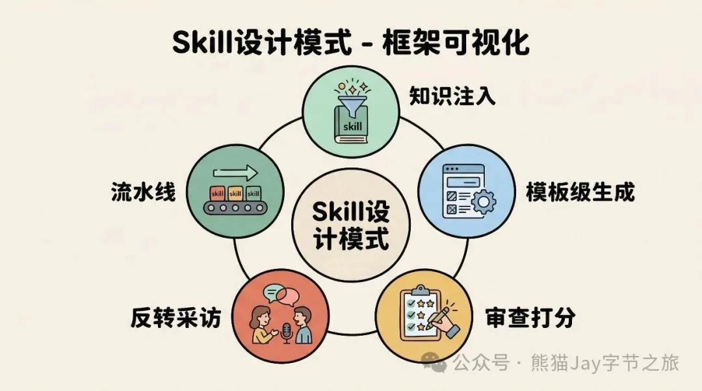


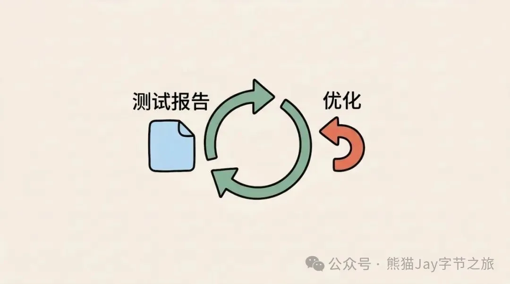


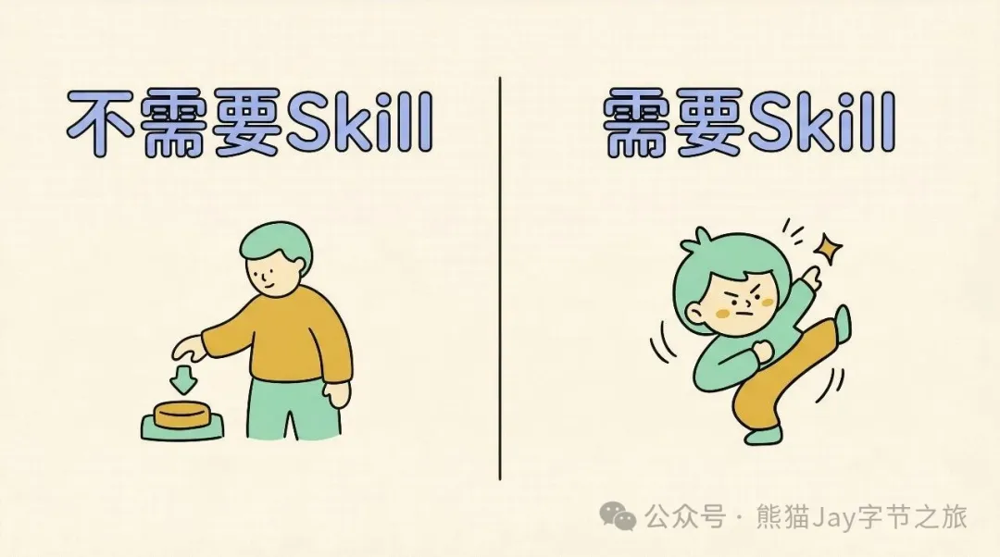


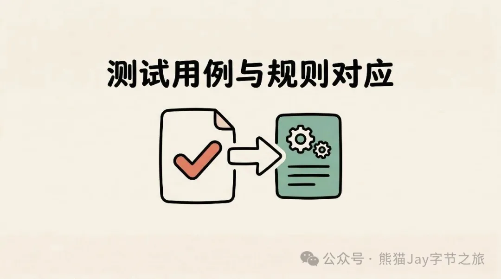

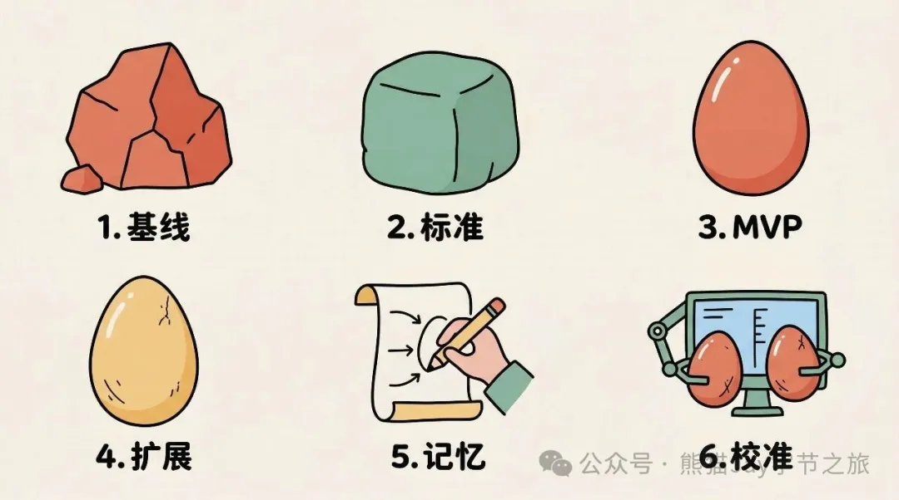

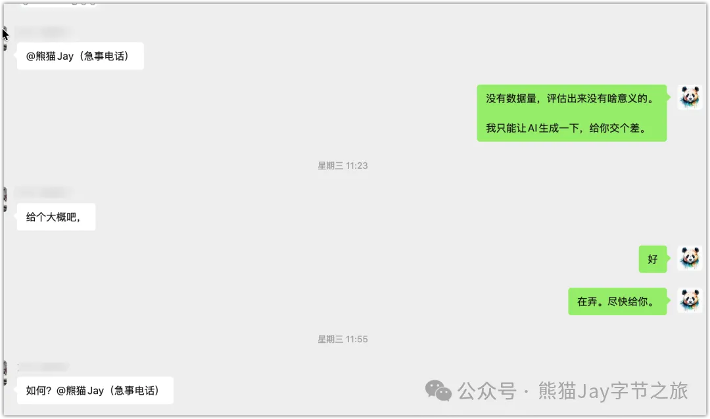


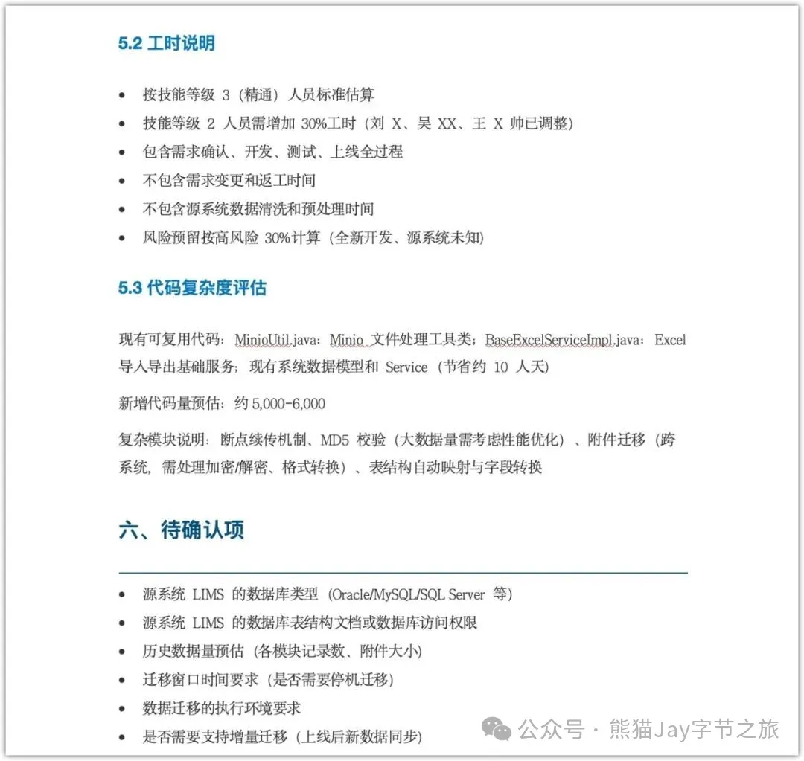

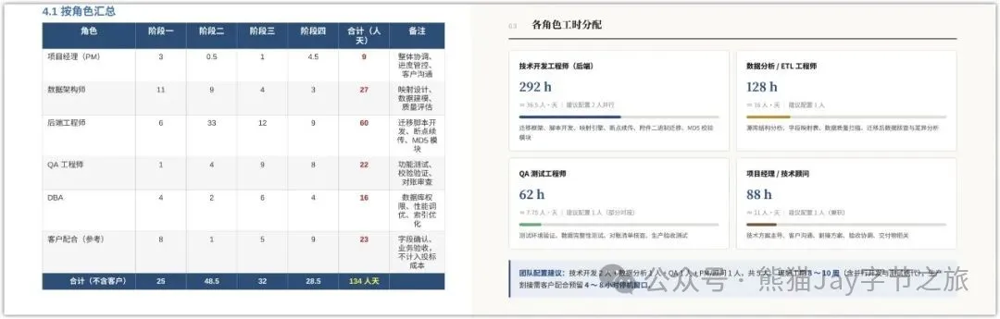

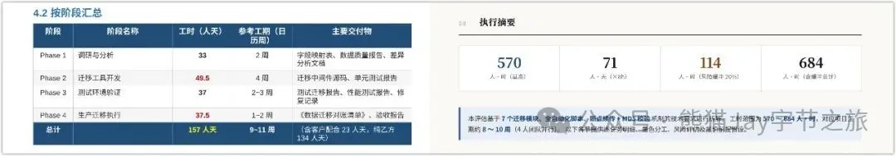


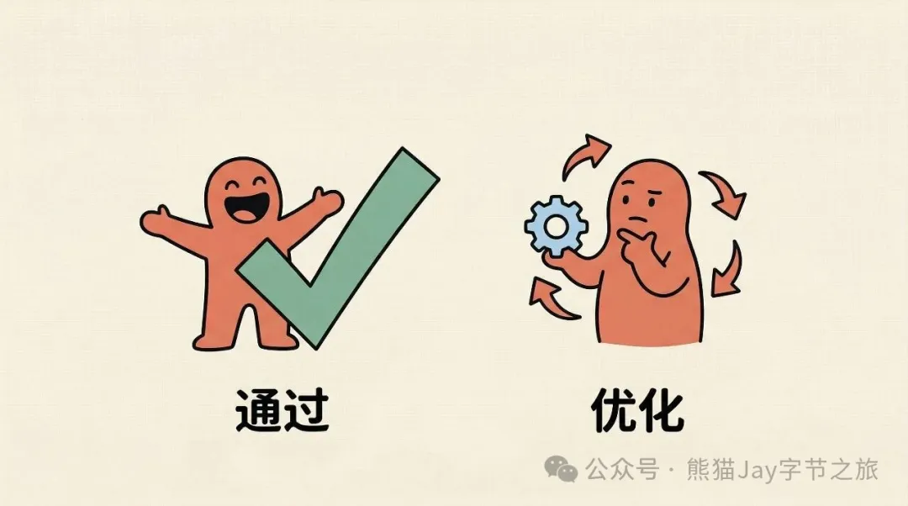


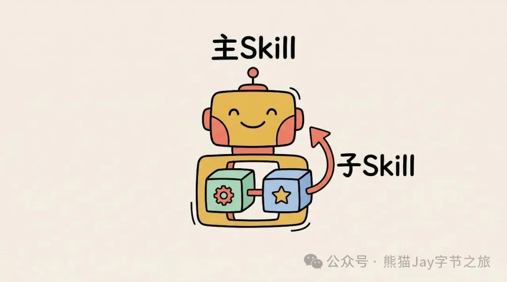

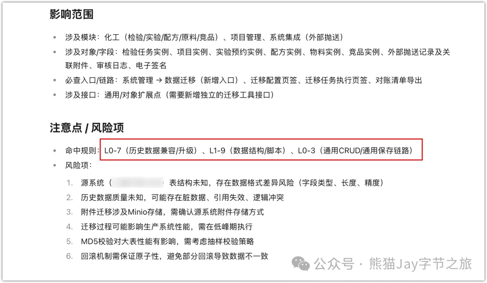

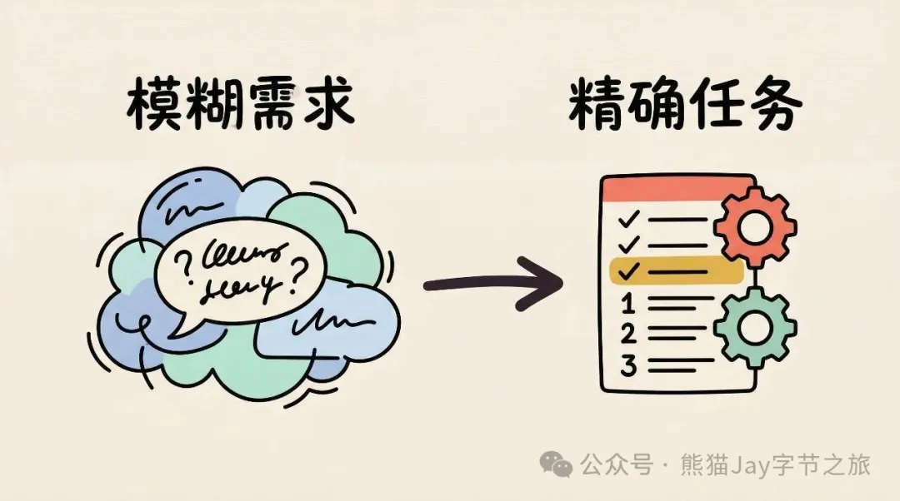

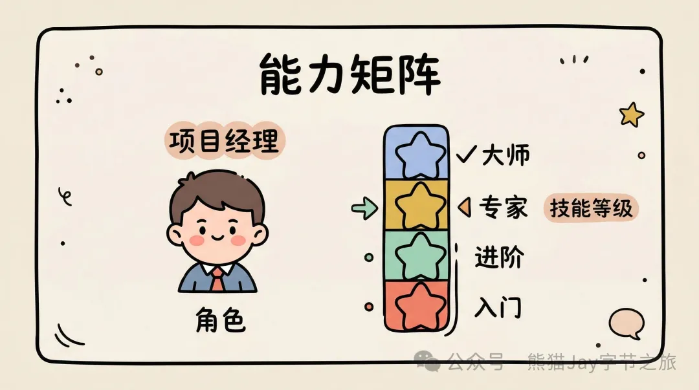

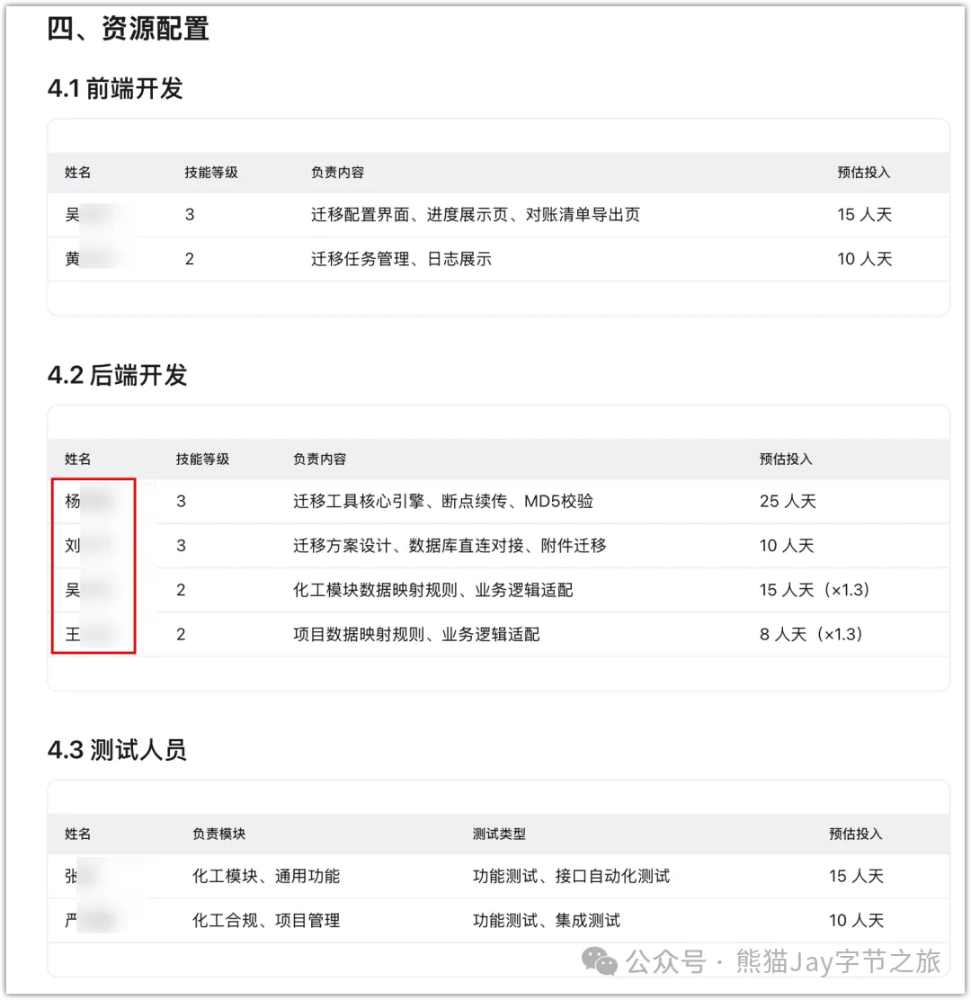

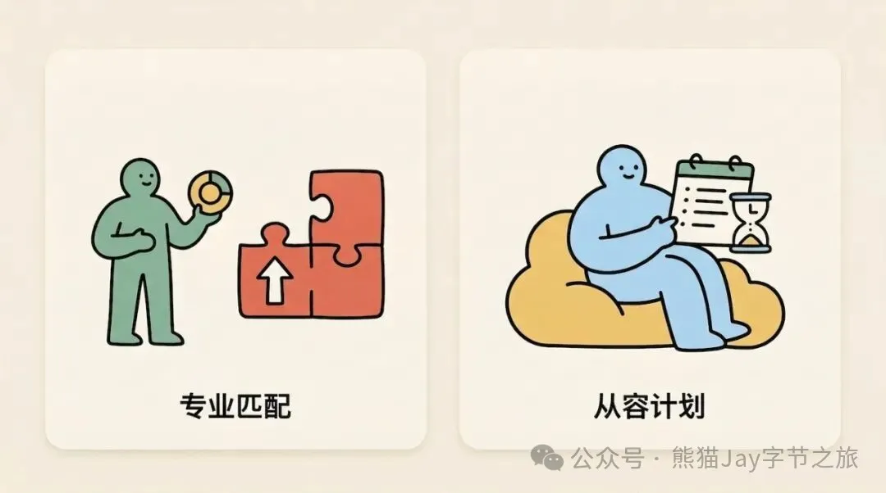

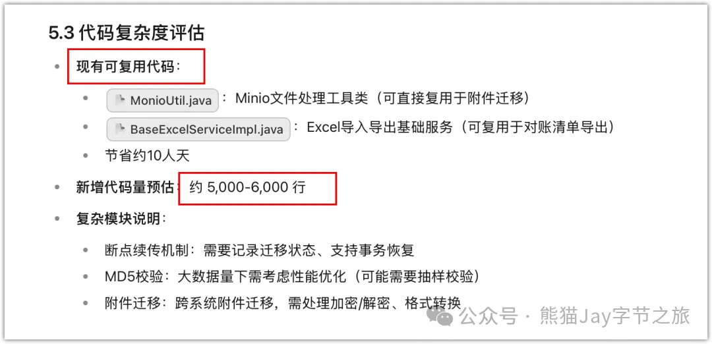

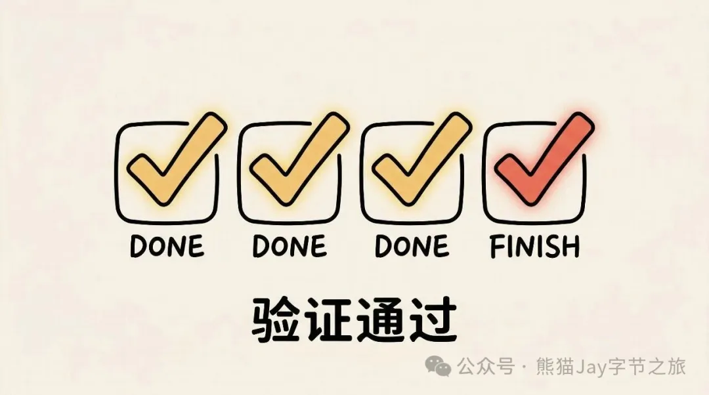


