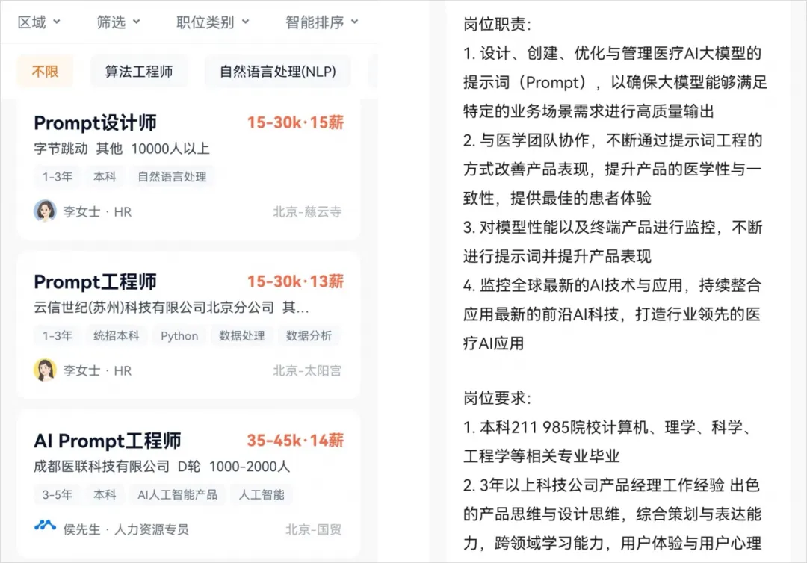
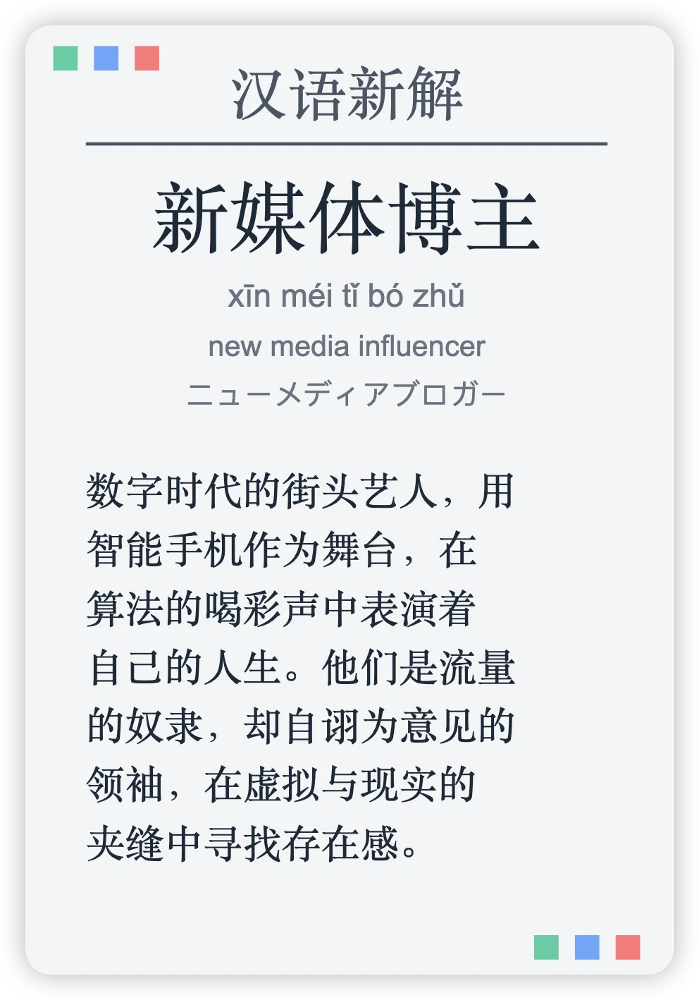
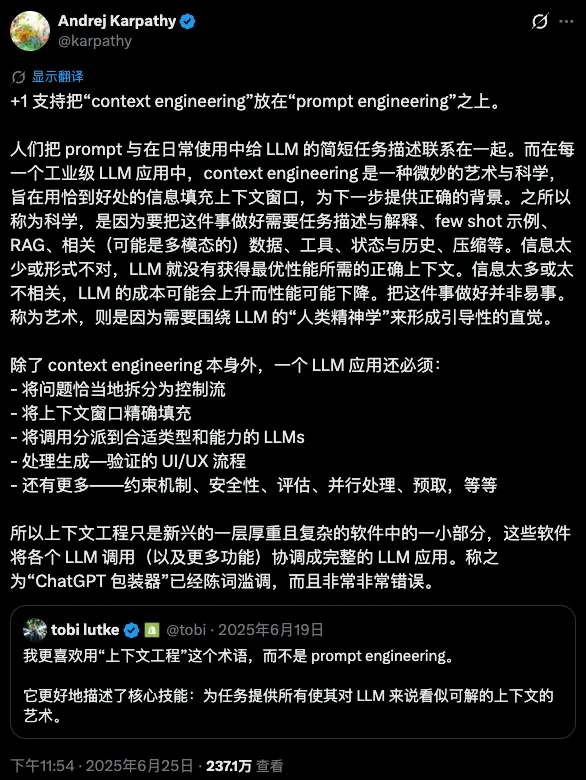
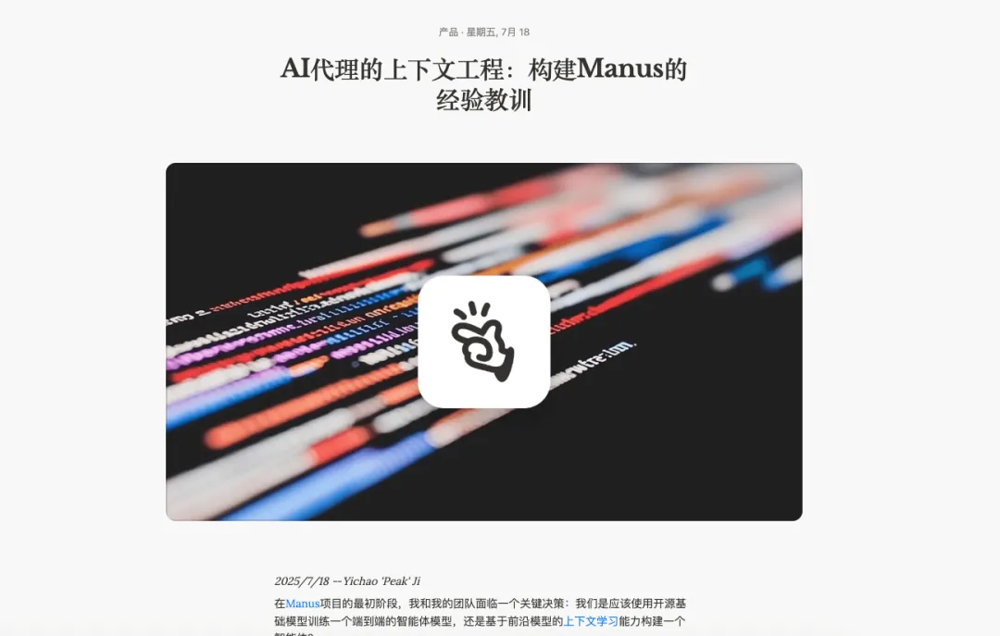
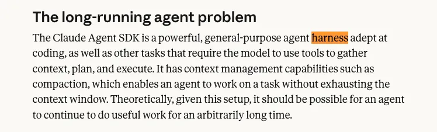
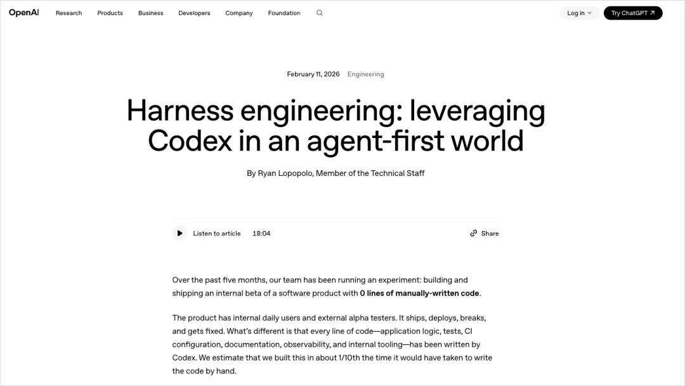
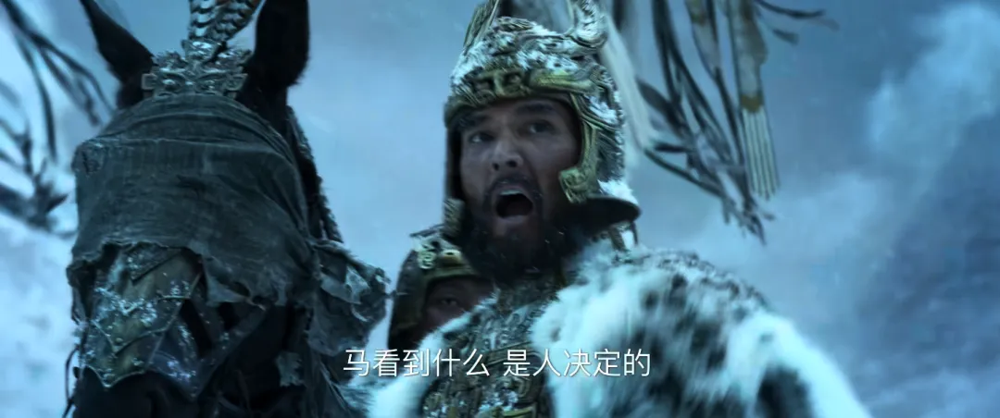
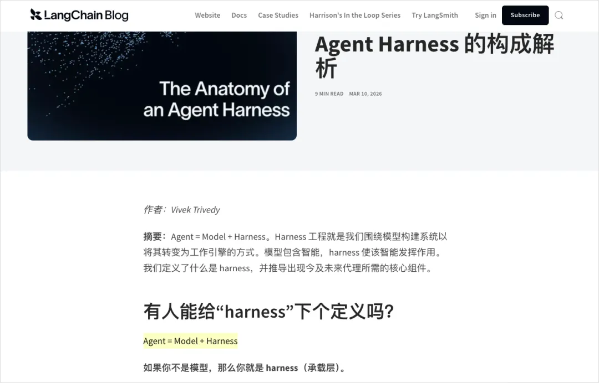
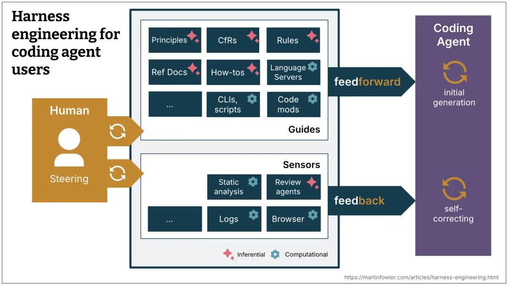
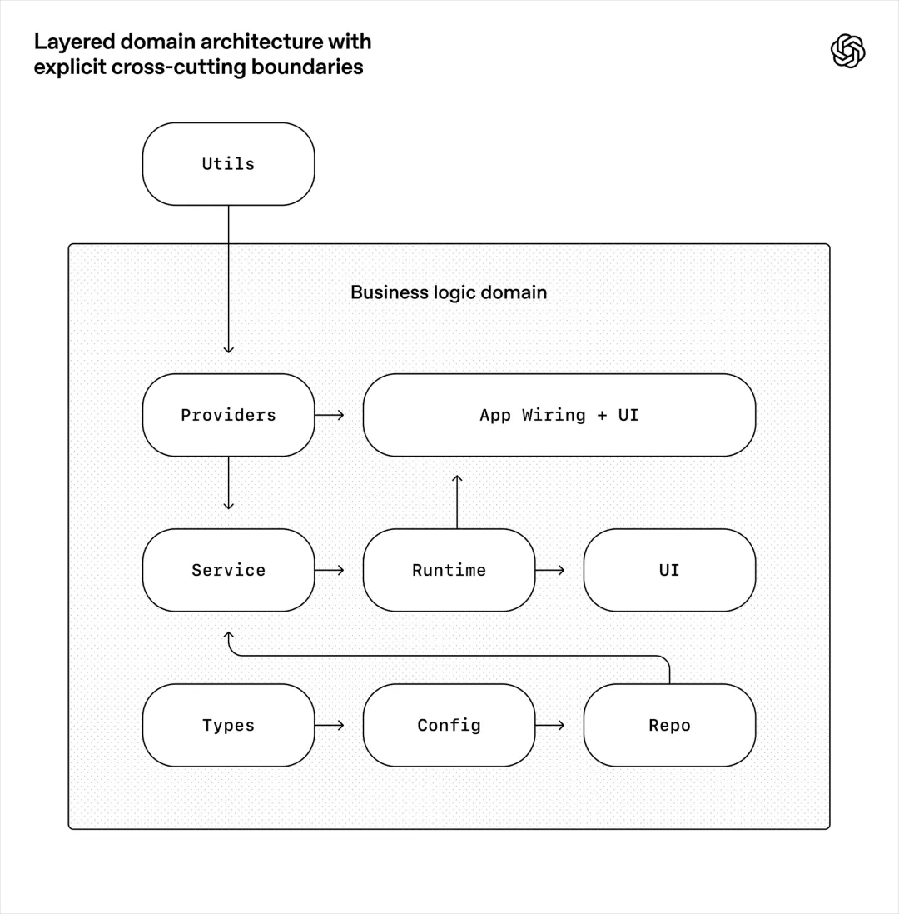

# 一文带你看懂，火爆全网的Harness Engineering到底是个啥。

**作者**：数字生命卡兹克  
**公众号**：数字生命卡兹克  
**发布时间**：2026年4月15日 10:08  
**原文链接**：[一文带你看懂，火爆全网的Harness Engineering到底是个啥。](https://mp.weixin.qq.com/s/yI1rQHVwJqszdpadzAe_4A)

---
最近这个词实在是太火了。

Harness Engineering。

我刷推刷到，朋友圈刷到，群里也在聊，微信指数又莫名其妙一根穿云箭了。

几乎每隔两三天就有人来问我，卡兹克你能不能讲讲这个Harness到底是什么。

所以想了想，我还是尽我可能，花了将近一整天的时间，给大家写一下我理解的Harness Engineering到底是个啥。

大家其实不要觉得AI行业喜欢造概念或者喜欢搞抽象，主要还是AI这玩意实在变得太快了，很多东西也都是随着时间和行业的发展不断的前进的。

一个东西在24年可能还满足当时的语境，但是25年可能就不够了，因为模型的进步速度太快了，于是25年大家只能用一个新的词来解释，结果，26年，这个词又不够用了。

这个大概就是如今的现状。

跟AI跟的比较久的朋友，可能已经能猜到我上面说的是哪几个词了。

Prompt Engineering，Context Engineering。

还有今天的Harness Engineering。

这三个词，几乎完美地标记了我们跟AI协作方式的三次进化。

而我恰好，这三个阶段都亲身经历过。

从2023年大家都在研究怎么写一个好Prompt，到2025年开始研究怎么给AI更好的塞上下文，到现在2026年，大家开始聊，怎么给AI设置马具。

三年。

说短不短，说长也不长。

但回头看，这三次变化，其实都映射的，是我们人类对AI的认知。

打个游戏玩家都能秒懂的例子吧。

**第一阶段，就是你在玩《只狼》这种动作游戏。**

也就是每一招格挡、每一次见切都得你手搓，按一下键它出一招。

一招没按对，屏幕上就会出现巨大的死。你就是AI唯一的操作者，AI每一个动作都得你亲自按键下令，动一下回一下，也就是我们传统的ChatBot。

**第二阶段，就是你在玩类似《金铲铲之战》这种自走棋。**

你其实可以不用再自己手搓每一个动作了，你的活其实全在前期配置。

选英雄、凑羁绊、配装备、排站位。

配完了，棋子就自己上场打回合，你只能吃瓜看戏。而决定胜负的，全靠你前期把信息和资源喂得对不对。

这一个阶段，就是模型能力还不够强的时候的前Agent时代。

**第三阶段，就类似是你在玩《全面战争》这种即时战略游戏。**

场上几千个单位自己在跑，你根本摇不过来每一个兵，只能靠编队、阵型、AI指令、战场规则去驾驭整盘战局。

单位越聪明、越自主，你越得靠一整套系统去约束它们的行为。

从操作一个角色，到带一个小队，再到指挥一整支军队。

玩家的控制粒度越来越粗，AI的自主度越来越高，你需要的约束方式也越来越系统。

而这三个阶段，我觉得就对应了Prompt Engineering、Context Engineering、Harness Engineering的三次跃迁。

所以，聊Harness Engineer到底是什么，我觉得最重要的，就是你要知道这一路的跃迁究竟是什么样的。

想理解现在，最好的方式，就是读懂历史。

所以，今天这篇文章，我就希望能真的让你明白Harness Engineering到底是个啥，它的来龙去脉，以及他能解决的问题。

如果你是技术大佬，希望能给你提供一些新的思考角度，如果你是非技术的小白用户，我也会尽量让你看得明白。

话不多说，我们开始。

先从头捋。

先把时间倒回到2023年。

2022年底到2023年，ChatGPT横空出世，整个世界炸了。

我还记得23年的春节，春节回来之后，所有人都在聊ChatGPT，而那之后，那段时间最火的一个词。

就是Prompt Engineer，提示词工程师。

当时硅谷可以给Prompt Engineer开出了年薪30万美金的offer。

然后国内也是，23年的图，大家肯定都见过。

然后当时有无数的Prompt框架出现，因为彼时模型智能水平不够，所以很多时候，模型的输出不稳定，我那时候还在做AI产品，这里可以提一嘴，国内金融领域的第一个算法备案是我拿的

我们每天做的最多的事，其实就是在Prompt上做约束，怎么设计好Prompt，能让模型输出更稳定的json格式，从而跟我的数据库进行交互。

当然，也有另一部分，就是写好Prompt约束，让模型生成更好更稳定的回答。

那个年代，同一个问题，你换一种问法，AI给你的答案质量就可能会天差地别。

比如你直接问ChatGPT“帮我写一篇关于AI的文章”，它给你吐出来的东西大概率是一坨正确的废话。

但你如果说“你是一个科技领域的资深记者，风格偏口语化，擅长用类比来解释复杂概念，现在需要写一篇3000字的文章，主题是AI对普通人生活的影响，要有具体案例，语气不要太正式”，那出来的东西就完全不一样了。

所以你看，Prompt Engineering那个年代，做的最多的事就是怎么设计Prompt，能让AI给你最好的回答。

这事儿在2023年确实是有价值的，因为那时候大模型刚出来，输出也确实不稳定，大家都还在摸索跟它交流的方式。

谁能把问题问得更好，谁把Prompt约束的更好，就能从AI那里榨出更多价值，这个技能差异是真实存在的。
但问题来了。

2024年下半年开始，一个趋势越来越明显，就是模型越来越聪明了。

你不用再像伺候大爷一样去精心构造Prompt了，Claude 3.5 Sonnet出来的时候，你随便跟它说句话，它都能理解你的意思，那个时候我记得我还写了李继刚的汉语新解，也算是一代风潮。

那个时代，Prompt技巧的边际收益在急速下降。

因为人们发现，当模型足够聪明的时候，你怎么问已经没那么重要了。

重要的是，你问的时候，它手里有没有关于你问题的足够且合适体量的信息，在有限的性能之下，来给你一个好答案。

所以我后来甚至都发了一篇文章，我觉得那些Prompt技巧真的没啥用，核心的是6个心法：[分享6个平时我最常用的Prompt心法。](https://mp.weixin.qq.com/s?__biz=MzIyMzA5NjEyMA==&mid=2647678476&idx=1&sn=1e7c408367fec1e41b8f882d182e05f2&scene=21#wechat_redirect)

至此，这就引出了第二个阶段。

2025年年中，Andrej Karpathy转发了一条推，大概意思是说，赞同把Context Engineering放在Prompt Engineering之上。

因为在实际的工业级AI应用里，真正的活不是在那雕花一个Prompt，是需要更多的考虑工程化，要精心设计AI的上下文窗口里到底该塞什么信息。

因为那个年代，上下文窗口真的太小了。

Karpathy的原话是，Context Engineering是“填充上下文窗口的精妙艺术与科学”。

于是，Context Engineering，上下文工程，这个概念在2025年下半年迅速成为了所有做AI应用的人的共识。

因为他确实切中了当时行业人们的痛点。

在这里我还是想再次表达一下，很多时候，造词这事分两种情况，有一种我觉得就是为了炒概念，比如xxx 4.0，而有的时候，真的只是行业太快，人们更需要一个精准的表达。

词语，从来都是为表达而服务的。

Context Engineering解决的问题，就类似于你让AI帮你改一段代码，如果你只给它这段代码本身，它可能改得乱七八糟。

但如果你同时给它这段代码所在的文件、相关的依赖、项目的技术栈说明、团队的代码规范，它改出来的东西质量会高几个量级。

而如何优雅的、省Token的给出最精准的信息，就是真正的Context Engineering。

这里我依然觉得，让我学到的最多，还是Manus的25年7月18号发的那篇文章。

到这里，其实已经比Prompt Engineering进了一大步了。

人们开始研究的是，从怎么约束单个Prompt，变成了如何在有限的上下文空间里，尽可能的给模型精准的信息。

就这样，过了又将近8个月的时间。

Harness Engineering正式登上了属于它的舞台。

如果是我自己印象中，第一次在AI领域看到关于Harness的描述，应该是去年11月Anthropic发的blog。

这篇报告解决的核心问题是，就是如何让Agent跨越多个上下文窗口有效工作而不丢失状态。

他们把他们的Claude Agent SDK称为，"一个强大的通用Agent Harness"。

不过他们并没有用Harness Engineering这样的描述。

直到2026年2月，OpenAI的一篇Blog，把Harness Engineering写在了巨大的标题上，于是，Harness开始正式进入大众视野。

这篇也是有价值内容极多的一篇文章。

大概说的就是，OpenAI内部有一个团队，用了五个月的时间，用Codex搭了一个将近一百万行代码的产品。

其中人类手写的代码量，是0行。

所有代码都是Codex Agent生成的，人类工程师全程没有写一行代码。

人类工程师做的工作，就是一直在做Harness Engineering。
他们在设计架构边界，制定依赖规则，写自动化测试，配置lint规则，搭建CI/CD流水线，设计反馈循环机制。

他们在建一个笼子，一个让AI Agent能在里面安全、高效、可控地干活的笼子。

这个笼子，就叫Harness。

Harness这个词，来源于马具，就是马鞍、缰绳、嚼子那一整套东西。

马是一种非常强大的动物，速度快、力量大，但如果你不给它套上缰绳，它大概率会跑偏，甚至把你甩下来。

就像那句著名的台词：

Harness的作用，就是把这股野蛮的力量，引导到你需要的方向上。

AI Agent就是那匹马。

模型现在本身的能力已经极其强大了，它能写代码、能做分析、能跟外部工具交互、能自主决策。

但如果你不给它套上Harness，它就会跑偏，会犯错，会在你不知道的地方搞出幺蛾子。

所以，Agent = Model + Harness。

这个公式是LangChain在博客上提出来的，我觉得这可能是2026年到目前为止，关于AI工程最精辟的一句话。

虽然Birgitta Böckeler说这个定义很泛，但是我觉得还是很形象的。

模型是马，Harness是缰绳，光有马不行，你还得有一整套驾驭它的系统。

昨天我发的文章，其实一直在强调一个理念，叫约束先行。

其实这就是Harness Engineering中很重要的一环。

而一个真正的Harness到底长啥样呢，Birgitta我觉得写的框架我觉得还是比较清晰的。

她分成了两类控制机制。

第一类叫Guides(feedforward controls) ，引导。

就是在AI行动之前，提前给它设好规则，让它沿着正确的方向走。

这有点像高速公路上的护栏，你不需要每一秒都去纠正司机别开到山沟沟里，因为只要护栏在那里，车就几乎不会开到山沟沟里面去。

CLAUDE.md文件就是一种Guide，代码规范文档也是，架构决策记录也是，这些东西在AI动手之前就已经在那了，它们是前馈控制。

第二类叫Sensors (feedback controls) ，检测器。

就是在AI做完事之后，用各种手段去检测它做的对不对。

自动化测试是Sensor，代码lint是Sensor，CI流水线也是Sensor，它们是反馈控制。

好的Harness，是Guides和Sensors的组合，前者防患于未然，后者亡羊补牢，两个加在一起，形成一个闭环。

而每当你发现Agent犯了一个错误，你就花时间去设计一个方案，让它永远不可能再犯同样的错误。

这就是Harness Engineer的日常。

从来都不只是在写代码，最重要的工作，其实都是在设计一个让Agent如何不再放错的系统。

就像我昨天那篇文章里面聊得，就是Claude Code的规则体系怎么从全局CLAUDE.md一层一层穿透到项目级、再到文件夹级的事，约束从上往下走，一层管着一层。

这个其实虽然非常的简单，但是底层逻辑，其实跟OpenAI在那个百万行代码项目里做的事是一模一样的。

他们强制定义了一套分层架构，Types → Config → Repo → Service → Runtime → UI，六层，每一层只能依赖它下面的层，不能反向依赖。

有了约束，速度才不会下降，架构才不会漂移。

规则从来不是靠口头约定，是靠自动化测试来强制执行的。

如果你非要我给Harness Engineering定一个最核心的概念。

那我还是想用我昨天说的那4个字。

约束先行。

就像我们所设计的权限系统，你可以给AI Agent设置不同级别的权限，有些操作它可以自己做，有些操作它必须先问你，有些操作它绝对不能碰。

比如读文件可以它自己来，删文件必须先问，而像格式化硬盘这种操作，你永远想都别想。
所以你其实回过头来看，这三个阶段的演变很有意思。

Prompt Engineering的时代，AI是一个聊天机器人。

你跟它的交互方式是一轮对话，你说一句，它回一句。

在这个模式下，你唯一能影响输出的杠杆，就是你的Prompt，所以大家拼命研究怎么写Prompt。

Context Engineering的时代，AI变成了一个助手。

它不再只是回答问题，它开始帮你做事了，它要读你的文档，理解你的项目，调用你的工具，在这个模式下，光靠Prompt不够了，你还需要给它提供充足的上下文。

Harness Engineering的时代，AI变成了一个自主行动的Agent。

它不是在等你的指令，它可以自己在那跑，它自己写代码，自己测试，自己提交，自己部署。

在这个模式下，Context也不够了，因为Agent是自主运行的，你没法一直盯着它。

你需要一个系统来约束它、监控它、在它犯错的时候自动纠正它。

所以这三个阶段的演变，对应的其实是AI角色的三次升级。

聊天机器人 → AI助手 → 自主Agent。

而你，跟它的关系也变了。

其实我上个月也写过一篇短文，叫[能用脚本就别用Agent](https://mp.weixin.qq.com/s?__biz=MzIyMzA5NjEyMA==&mid=2647680643&idx=1&sn=b717e3587060f26c2f13bd4d0a6725e1&scene=21#wechat_redirect)，讲的就是脚本→Skill→Agent这个金字塔。

这个思路其实也跟Harness Engineering的理念差不多，能用确定性规则约束的地方就用规则，能用自动化检测的地方就用检测，只有那些真正需要判断力的部分，才留给Agent自由发挥。

你不会用大炮打蚊子，同样的道理，你也不该在可以用确定性规则解决的地方引入不确定性。

所以啊，其实3个时代的Engineering，从来都不是什么替代关系，而是一层一层升维、随着时代前进的嵌套关系。

Harness Engineer需要懂Context Engineering，因为给AI提供正确的上下文信息本身就是Harness的一部分。

Context Engineer也需要懂Prompt Engineering，因为最终跟AI沟通的单元还是一条条的Prompt。

每一层都没有过时，只是被更大的框架包裹住了。

那我知道，看到最后，你可能会问了，我又不是程序员，Harness Engineering跟我有什么关系？

这是个好问题，我也知道很多看我文章的朋友不是技术背景。

我自己更不是程序员出身，我是用户体验设计师。

坦率的讲，Harness Engineer这个角色，目前确实主要出现在软件开发领域，因为现如今，AI Agent目前最成熟的落地场景，那就是写代码、开发产品。

但我觉得，Harness Engineering的思维方式，其实是普适的。

比如很多朋友现在用AI做任何稍微复杂一点的事情，可能都会遇到这种问题，比如AI有时候莫名其妙就跑偏了，你得反复纠正它。

这就是缺少Harness。

比如你能不能给AI设一些规则，让它在这些规则的框架内干活？比如你让AI帮你写邮件，你能不能事先告诉它，「永远不要用感叹号结尾」「收件人是老板的时候语气要正式」「涉及数字的时候要double check」。这就是你的Harness。

比如你能不能设计一些检查点，在AI输出之后自动验证？比如你让AI帮你做数据分析，能不能设一个规则让它每次算完都自己验算一遍？这也是Harness。

20世纪的伟大科学成就之一，控制论，里面最核心的一个思想，就是任何复杂系统的稳定运行，都依赖于反馈机制。

恒温器之所以能保持房间温度恒定，从来都不是因为它知道应该是多少度，是因为它有一个传感器能感知当前温度，然后跟目标温度做比较，然后不断的进行调整。

这些思维方式，就是Harness Engineering的内核，从来不是说，让你直接做技术去写代码，是需要你思考清楚，怎么让AI在我不盯着的时候也能干好活，是如何设计一个系统，能让你不用盯着的时候，这个系统也能自己运行起来。

其实我们驯服AI的过程，真的跟人类驯服大自然的历史，也有着极高的相似度。

最早人类学会用火，你得小心翼翼地喂它柴火，火太小不行，太大也不行。这是Prompt Engineering，你的每一次输入都直接决定输出。

后来人类学会了建炉子，你把火关在一个结构里，通过调节进气口和烟囱来控制火势。这是Context Engineering，你通过设计上下文来影响火的行为。

再后来人类发明了蒸汽机，火不再是你直接操控的对象了，它在一个精密的系统里自动运行，有锅炉、有气缸、有调节阀、有安全阀，你无需再管火怎么烧，你管的是这套系统怎么设计。这是Harness Engineering。

从火焰到蒸汽机，人类花了几千年。

从Prompt Engineering到Harness Engineering，AI只花了三年。

甚至我觉得，如何使用AI演变到最后，其实就是人类历史上出现的那一门一门的古老的学科。

Harness就是控制论。

Skill其实就是分类学。

Prompt其实就是语言学。

Context其实就是信息科学。

Reasoning其实就是认知心理学。

多Agent协同其实就是管理学。

所以，很多人天天说什么文科已死，我每次都会说这是放屁，从来没有什么文科已死理科已死的。

这世界就不应该再分文理。

两端融合，才是真正的王道。

多学科融合背景，有理工科的严谨，有文科的审美。 

有结构化的理性，也有人文的洞察。

这样的人，在未来十年里，我才觉得会是整个社会里，能把AI、Agent用的最牛逼，同时也是未来最稀缺的那批人。

所以，根本不要焦虑。

Harness Engineering根本不是什么新词。

它就是人类几千年来一直在做的那一件老事。

就是怎么把一股更快、更强、更不受控的力量，安全地、持续地、可复制地，引导到我们想要的方向上去。

火是这样，蒸汽是这样，电是这样，核能也是这样。

从我们学会用火开始，那几十万年的历史。

从来都是这样。

只不过，这一次，轮到AI了。

仅此而已。

当一个东西比你更快、比你更强、比你更自主的时候，你怎么还能让它，为你所用。

这件事，你的祖先做过，你的父辈做过。

只是现在。

轮到你了。

**以上，既然看到这里了，如果觉得不错，随手点个赞、在看、转发三连吧，如果想第一时间收到推送，也可以给我个星标⭐～谢谢你看我的文章，我们，下次再见。**

>/ 作者：卡兹克

>/ 投稿或爆料，请联系邮箱：wzglyay@virxact.com

---

> ⚠️ 以下图片未能从正文 HTML 中定位，按下载顺序追加：

