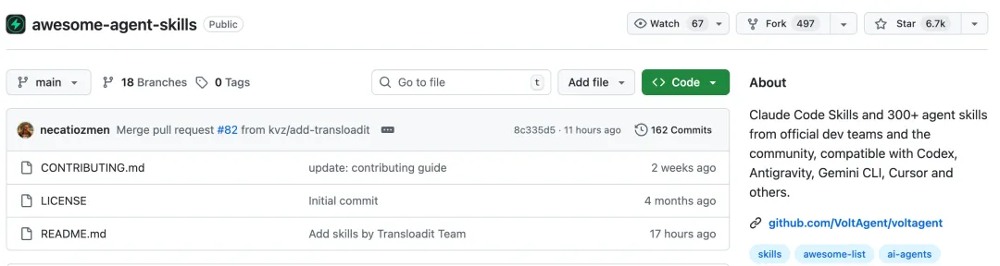
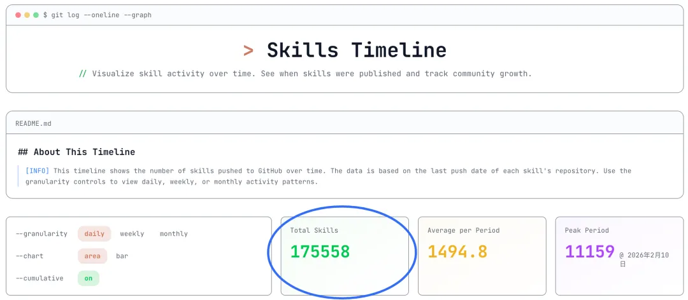
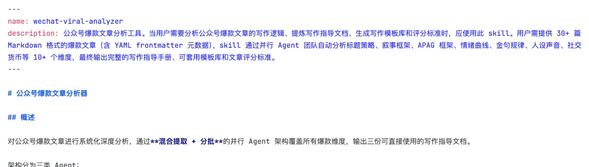
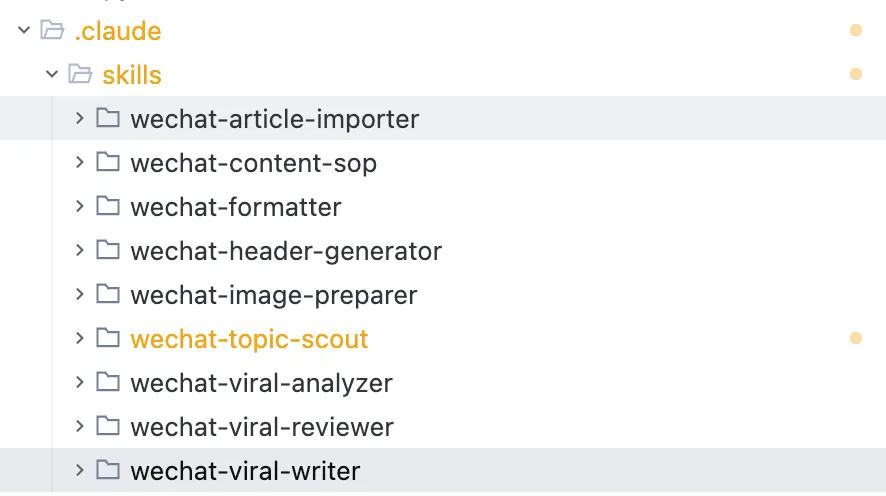
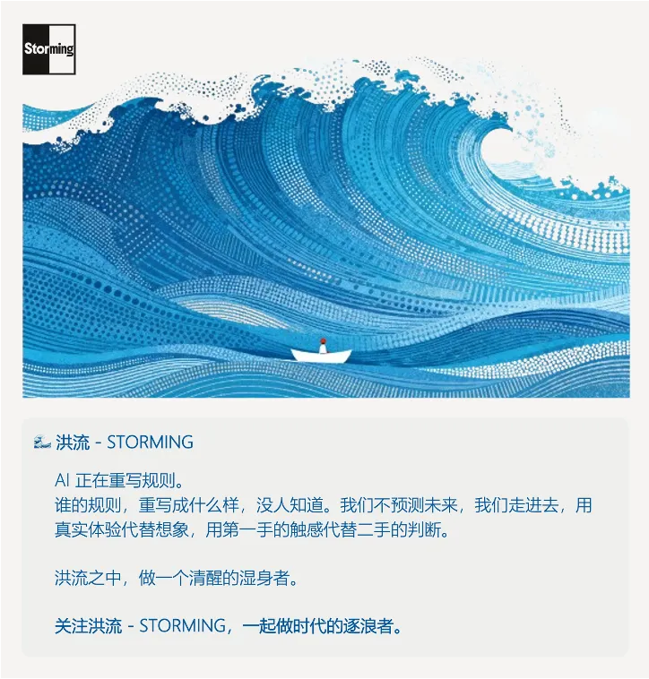

# 一文带你看懂，火爆全网的Skills到底是个啥

**作者**：Lumilous  
**公众号**：爱AI的大刘  
**发布时间**：2026年2月11日 18:00  
**原文链接**：[一文带你看懂，火爆全网的Skills到底是个啥](https://mp.weixin.qq.com/s/2IIPji15yflj1qCjze-f4A)

---

最近这段时间，你一定在各种地方，反反复复看到一个词。

推特在刷，GitHub在刷，朋友圈在刷，连我妈都转了一个"AI技能包大全"给我问这是什么。

这个词叫**Skills**。

有多火呢？

GitHub上一个收录Skills的仓库，star数直接飙到了几万。**SkillsMP**这个Skills市场，现在已经收了**16万个Skills**。三个月前，这个数字还是零。

但说实话，大部分人看完那些文章，还是不知道这玩意到底是个啥。

跟Prompt有啥区别？跟MCP又有啥区别？普通人能用吗？

话不多说，今天这篇，我争取用人话，一次给你讲明白。

🌊 Storming

先说结论。

Skills，你就把它理解成——**AI的APP**。

你手机买回来的时候，能打电话能发短信，但你不会说它好用。

它真正变好用，是你装了微信、装了美团、装了高德之后。

每个APP教会了你的手机一个新技能——聊天、点外卖、导航。

而手机本身，就是那个操作系统。

AI也一样。

**ChatGPT**也好、**Claude**也好、**Gemini**也好，它们就是那个操作系统——啥都能聊，但啥都不精。

而Skills，就是你给它装的APP。

**每个Skill教会AI一个新技能——写公众号、做PPT、分析数据、审代码。**

你以前怎么教AI？

说一遍。

每次都说一遍。

换个对话框，再说一遍。

而现在，你装一个Skill，它就永远会了。

**过去三年，我们都在教AI说话。从现在开始，我们在教AI做事。**

🌊 Storming

理解了APP这个比喻，接下来的区别就很好讲了。

我换一个更接地气的比方。

想象你开了一家公司，AI是你招来的新员工。

**Prompt**，就是你当面跟这个新员工说的话。

"帮我写个方案""语气正式一点""再改改"。

它是口头指令，说完就没了。你关了对话框，这个员工就失忆了，下次来还是一张白纸。

**Skills**，是你给这个员工写的岗位手册。

里面有你们公司的工作流程、输出模板、质量标准、甚至配了参考案例和辅助工具脚本。

他不用每次来问你"这个怎么做"，翻手册就行。

而且——这个手册是可以传给下一个新员工的。

那**MCP**呢？

MCP是门禁卡。

这个新员工再牛，他进不了你的数据库、打不开你的文件柜、连不上你的API，白搭。MCP就是给他开通各种系统权限的那张卡。

所以这三个东西的关系特别简单：

**Prompt是嘴巴，Skills是大脑里的知识，MCP是手和脚。**

嘴巴可以临场发挥，知识需要积累沉淀，手脚负责连接外部世界。

我知道这时候肯定有人要说了："这不就是Prompt模板吗？存个模板不就完了？"

确实，表面上看有点像。但差别大了去了。

Prompt模板是死的——你存了一段文字，下次粘贴进去，它执行完就忘了，**不会自动判断什么时候该用、不会调用外部工具、更不会跟别的模板配合**。

而Skills是活的。它有**上下文感知**——AI会根据你当前的任务自动判断该不该调用这个Skill。它有工具链——一个Skill可以调脚本、读文件、连API。它还能跟其他Skills协作——写作Skill写完初稿，排版Skill自动接手格式化。

这就像一个存在手机备忘录里的菜谱，和美团上一键下单的区别。都能让你吃上饭，但体验完全不是一个量级。

而且Skills有一个特别聪明的设计。

它不是一上来就把整本手册塞给AI——那会信息过载。它是分三步走的：**先让AI扫一眼目录，知道有这么个手册；然后AI判断这次任务用得上，才翻开正文；最后真需要附录里的脚本了，再去加载。**

跟你用手机APP一样——你不会同时打开100个APP，你只打开你当下需要的那个。

🌊 Storming

说了这么多概念，你可能最想知道的还是——

这玩意跟我有什么关系？我又不是程序员。

说实话，**Skills这波浪潮里，受益最大的恰恰不是程序员**。

是你。

是每一个有固定工作流程的普通人。

为什么这么说？

你想想，程序员本来就能写代码、能调API、能造工具。Skills对他们来说是锦上添花。

**但对普通人来说，Skills是从零到一。**

你第一次能把自己的工作经验，变成一个AI能执行的"标准化流程"。

先说一个跟你最近的例子。

**自媒体人**。

以前写一篇公众号，流程是这样的：找选题→想标题→写初稿→配图→排版→发布。每一步都得跟AI从头交代。"你是一个资深自媒体编辑......blabla......"

更要命的是，你好不容易调教出一个满意的AI回复，关了窗口就全没了。下次打开，又是从零开始。你在训练AI这件事上花的时间，可能比自己写还多。

现在呢？

一个**写作Skill**，把你的写作风格、排版偏好、标题公式、金句模板、甚至配图标准全打包进去。你只需要说一句"帮我写一篇关于XX的文章"，AI直接按你的标准输出成品。

而且这个Skill会越用越准。你觉得哪里不对，调一下手册里的参数，下次它就改了。这不是聊天，这是调教。

从"每次都教一遍"到"说一句话就出活"。

这个体感差距，用过的人都知道，回不去了。

**再说职场人。**

产品经理、项目经理、运营——谁没有几个反复重复的工作？

三个Skill就能覆盖大部分人80%的重复劳动：**周报整理Skill**、**竞品分析Skill**、**用户反馈提取Skill**。

我认识一个做SaaS产品的朋友，他把竞品分析做成了一个Skill。以前每周花半天爬竞品官网、截图、对比功能、写报告。现在他丢进去三个竞品的链接，十分钟出一份带表格、带截图标注、带结论的完整报告。他跟我说了一句话，我印象特别深——"我终于不用当人肉爬虫了。"

**还有学生。**

这个群体用Skills可能最有意思。

有人做了一个**费曼学习法Skill**——你把一篇论文丢给它，它不是翻译成中文，而是翻译成"你奶奶都能听懂的大白话"。如果它解释不清楚，它会反过来问你问题，逼你把模糊的地方想清楚。

如果你奶奶能听懂，说明你真的理解了。

还有人做了**苏格拉底式提问Skill**——你给它一个论点，它不帮你论证，反而拼命找你的漏洞。被它怼完一轮，你的论文基本��不出逻辑硬伤了。

你看，这些场景里没有一行代码。

全是"把人的经验变成AI的能力"。

**AI时代最大的红利，不是AI本身有多强，是你能让AI按你的方式强。Skills就是那个"你的方式"。**

🌊 Storming

让我拉一条时间线，你就知道这事有多猛。

2025年10月，**Anthropic**在**Claude Code**里上线了Skills。那时候，它只是一个功能，只有Claude用户能用。

大部分人没当回事。

包括我自己，当时看了一眼文档，想的是"这不就是system prompt的高级版吗"。

2025年12月18日，Anthropic做了一件改变游戏规则的事——**把Skills标准直接开放了**。

这一步的意义，很多人没看懂。

就像当年安卓开源一样。谷歌一个人做手机能做多大？把系统开源，三星、华为、小米全来了，安卓直接吃下了全球80%的市场。

从此Skills不再属于Claude，它属于所有AI。

接下来发生的事，速度快得离谱。

两个月内。

**OpenAI**跟了。

**Google**跟了。

**微软**跟了。

**Cursor**跟了。

几乎所有你听过名字的AI编程工具，都跟了。

到今天——2026年2月——**SkillsMP**这个Skills市场，已经收录了超过**16万个Skills**。

GitHub上光是"awesome-agent-skills"这类汇总仓库就有好几个，star数动辄上万。

**Gartner**的报告更是说，多智能体系统的咨询量一年暴涨了**1445%**。

你品品这个节奏。

三个月，从零到十六万。这个增速，比当年APP Store的头三个月还猛。

这不是一个功能火了。

这是一个生态起来了。

23年的热词是**Prompt**，24年的热词是**Agent**，25年的热词是**MCP**。

而2026年，毫无疑问，是**Skills**。

**三年前我们教AI说话，两年前我们教AI思考，一年前我们给AI开门，今年我们给AI装技能。这条路的终点，是每个人都有一支按自己想法运转的AI团队。**

🌊 Storming

好，说了这么多，你是不是已经跃跃欲试了。

别急，上手这事，真的比你想的简单。

三种方式，选一个适合你的。

**方法一：直接用别人做好的。**

还记得APP Store的类比吗？你用iPhone也不需要自己开发APP。

打开**SkillsMP**或者GitHub搜一下，十几万个现成的Skill。写作的、分析的、翻译的、画图的，应有尽有。找到一个看着顺眼的，一键安装。

**方法二：让AI帮你生成一个。**

Anthropic官方出了一个叫**skill-creator**的工具。你用自然语言告诉它"我想要一个能帮我整理会议纪要的Skill"，它直接帮你生成。

不需要写代码。

说人话就行。

**方法三：自己手搓一个。**

这个听起来唬人，实际上最简只需要一个文件——**SKILL.md**。

50行文字，5分钟搞定。

里面就三块内容：这个Skill是干什么的、它的工作流程是什么、输出标准是什么。

跟你写一份工作交接文档差不多。

安装也不复杂。

不同的AI工具安装路径略有不同——**Claude Code**放在`.claude/skills/`文件夹下，**Cursor**放在`.cursor/rules/`下，**Windsurf**放在`.windsurfrules`下。但本质都一样：把你的SKILL.md文件放到指定位置，AI就能读到了。

你看，从"找到一个Skill"到"自己做一个Skill"，门槛其实很低。

跟2008年的APP Store一样——一开始大家都是下载别人的APP，后来有人发现"我也能做一个"。

这个进化路径，正在Skills身上重演。

🌊 Storming

写到这儿，我自己突然有一个感受。

从Prompt到Skills，不只是工具的升级。

是人和AI关系的一次根本性变化。

用Prompt的时候，你是用户。你跟AI说话，AI给你回话。本质上是一问一答。

用Skills的时候，你是指挥官。你不再一句一句地教AI，而是一次性把你的能力体系交给它。它按照你的体系自主运转。

再往后呢？

当你的Skills越来越多，互相配合，自动协作——你就变成了架构师。你不是在用AI，你在设计一个由AI组成的系统。

从用户，到指挥官，到架构师。

这三步，是过去三年人和AI关系的全部进化。

**你第一次有能力，把自己的能力，变成一个可以复制、可以叠加、可以在你睡觉的时候继续运转的系统。**

有人说2026年是Skills元年。

我觉得这话没说全。

2026年，是普通人开始批量制造AI专家的元年。

你不需要会写代码。

你不需要懂什么机器学习。

你只需要知道，自己想让AI怎么做事。

然后把它写下来。

就这么简单。

你的经验，你的流程，你的判断标准——以前这些东西只存在你脑子里，换个人就没了。

现在它可以变成一个Skill，被执行，被复制，被传承。

说实话，这才是Skills真正让我兴奋的地方。

不是技术多牛。

是它把"个人能力"这个最不可规模化的东西，变得可规模化了。

🌊 Storming

最后。

今天你就可以去试。

打开SkillsMP，或者直接让AI帮你生成一个Skill。

把你最常做的那件事——不管是写周报、做分析、还是整理素材——固化成一个Skill。

做完这一个，当它运行起来的那一瞬间。

你就会懂。

Skills的价值，在于复用。

明天你会开始做第二个。

后天你会想把所有流程都搬进去。

然后你会发现——

你不再是一个人在战斗。

你身后，站着一支按你想法运转的AI团队。

**这就是Skills。你的AI，你定义。**

---

> ⚠️ 以下图片未能从正文 HTML 中定位，按下载顺序追加：

