# 一文搞懂爆火的SKills原理及实践案例

**作者**：吕昊俣  
**公众号**：腾讯云开发者  
**发布时间**：2026年3月13日 08:46  
**原文链接**：[一文搞懂爆火的SKills原理及实践案例](https://mp.weixin.qq.com/s/efGCTgegcE_Zp3G91uH06A)

---
关注腾讯云开发者，一手技术干货提前解锁👇

# 01

SKills的推导

首先，我将谈谈我所理解的Skills形成的推导过程，我们需要跳出“结果”视角，从零开始思考Skills的由来。有趣的是：我们需要从另外一个概念“中台”说起。

   1.1 借鉴“中台”思维：复用的力量

中台一词，常常出现在各种软件架构的设计中，其核心理念用两个字就可以概括：复用，即把相同功能抽离出来，减少重复建设，如下图：

好，如果架构可以这样玩，为什么Prompt不行？我们做一个大胆的抽象：软件开发的整个过程等于所有Prompt的总和，那么请诸位回想一下，在你的VibeCoding中，有没有属于你的高频口头蝉？我想答案是：Yes。

好，既然有，为什么要每次都打字！这也太慢了，细细想想，目前AI的产出的速度好像完全受限于我们打字的速度（PS：有的时候在工位就想用语音和AI沟通）所以能不能优化这个流程，学习中台理念，把你的“口头蝉”提前封装好，用的时候，直接一个快捷键！好，到这里我们就可以回答一个问题：什么是Skills？答：公共的Prompt就是Skills！

好，我们接着说，如果软件开发的过程就是Prompt的总和！那我们想想，其实软件开发的流程是非常固定的，从设计->开发->测试->运维，那我们就可以把SKIlls按流程进行分类！让它们归到这个框架内。这样我们就拥有了一个识别方法，即面对这成千上万个Skills，我们就可以分区，哦，它对于我们哪些工作环节是帮助的。通过这种方法，我们就可以把好的经验和方法覆盖到软件工程的整个全周期中，做到极致的提效！

   1.2 Skills设计哲学：恰好而非更多

但事情没有那么简单，随着“复用”的增多，当你给AI装上了一大堆的SKills，一个工程化的问题随之而来，我们知道AI在工作的时候，并不是一个无限的资源空间，而是运行在一个特定大小的桌子上（上下文窗口）。试想我们把所有东西都堆在桌面上，桌面就会很乱，结果就是AI开始胡言乱语，幻觉增多，因此，Skills的设计理念是：

不是让AI知道更多，而是让AI在恰当的时间知道恰当的事

具体如何做呢？也简单，搞个分级缓存，当输入Prompt的时候，不要带上全量的Skills信息，而是最基本的元信息，AI会按照语意进行匹配，匹配到了才会加载实际的内容，这就是渐进式加载，官方叫：渐进式披露，如下图所示：

   1.3 为什么经验可以沉淀了？

另外一个有趣的问题：为什么说经验能够复用了，而在过去几十年里却做不到呢？我想是因为：AI时代，人类的语言已经成为了一门全新的“编程语言”，所以只要能够被以文字形式沉淀的知识都会被AI理解，这是一件细思极恐的事，这意味着：任何以文字承载的领域，AI终将成为大师，超越大多数人类，最后它会成为最懂编程、最懂历史、最懂..的存在。

经验可以沉淀，这不仅对个人，对团队来说，作用也巨大，它实现了“经验”的低成本共享，个人经验将会以Skills的形式快速的在团队内传播，团队的整体战斗力也随之迈上了一个新的台阶。

最激动的是：当Skills的数量达到一定规模时，其实我们就相当搭建了一个专门给AI用的技能商店，当AI遇到新的复杂问题时，它可以自动匹配Skills库，让复杂的问题通过基础Skills的组合得到解决。

另一方面，Skills的成功，给我们了一个很好的启发：AI时代，系统设计将从面向于人设计转向面向AI设计。一份数据，我们需要有给人好理解的版本，也需要有给AI好理解的版本！

# 02

如何开发Skills：从归纳法到演绎法

那对于个人开发者，我们该如何打造属于自己的 Skills？要回答这个问题，我们不妨先回忆下上学时是如何解数学题的。绝大多数数学题，都是以既定公理为起点，通过严谨的逻辑推导得出答案。这种解题思路，正是典型的演绎法。这也折射出中国传统教育的核心特点：更侧重演绎法的应用，而忽视了对于归纳法的培养。但在真实的工作中，情况却截然相反，我们的 “经验”，本质上是一种 “人肉强化学习” 大脑在日复一日的实践中不断试错、迭代，将零散的实践感悟进行提炼，最终在潜移默化里，下意识形成了可复用的 “经验”，而这一过程，多数是归纳法的功劳。我们举个例子体会下：

有一天我睡前吃了100元的麦当劳，虽然当时很满足，但第二天起来却倍感不适。但是由于太好吃了，我还是连续三天睡前吃了夜宵，结果每天都出现了同样的不适。由此，我归纳出一个定律：吃夜宵会导致第二天早上身体不适。

后来，我爱吃夜宵的同事小明，早上起来也感觉常常不适。我便将“睡前不吃定理”分享给了他，他实践一周后，不适感果然明显改善这就是既定的规律再应用到特定场景、解决实际问题的过程，就是演绎法。

而我们要开发属于自己的Skills，也是这个路子：重复以上两个过程，我们需要先将工作中的案例总结提炼（归纳），固化为Skills，用以应对同类问题（演绎），或是再次反馈完善这个Skills，这便是Skills开发的核心思路！

   2.1 真正的难点，需要：向外洞察+向内觉察

但到这，还没有完，因为难点并不是：如何用归纳法和演绎法，为什么？因为创造一个Skill的难点，从来不在方法，而在于：你是否有能量去洞察问题。

Skill的本质是一种解决方案，它与问题本就是一体两面，若问题不存在，那Skills再强大也毫无意义。因此，要创造出一个有价值的Skill，前提是拥有敏锐的洞察力，这便 “向外洞察”：我们需要从日常工作中，精准地捕捉那些反复出现的问题，再从解决问题的过程中，总结出经验。我曾听过一句话：“如果你看见了，就请仔细观察”，在这个AI飞速发展的时代，解决问题的能力会被AI逐步取代，但精准发现一个有价值的问题，恰恰是最难被替代的核心能力，也是Skill的价值根源。

除了向外洞察，“向内觉察”同样不可或缺。回想下，大多数我们遇到的问题，早已有了成熟的解决方案，真正的新问题少之又少，只是我们常常对此“不自知”，我们习惯了下意识地解决问题，却从未认真复盘过自己的思考与操作过程。在这个时代，我们需要像禅修般向内观：面对具体问题时，自己是如何一步步分析、拆解、解决的？把这个隐性的、下意识的过程梳理清晰，再沉淀成AI能够理解的领域知识，正是开发Skill的核心要点。

举个例子，比如当你遇到Bug时，你是如何排查的？好好回想这个完整过程，把每一步操作、每一个判断逻辑梳理清楚，让AI照着这个逻辑去执行，这一点，我会在后续的实践分享中详细展开。除了自己的去总结，其实也可以利用AI工具，当你用AI解决完一个新问题的时候，别急着关闭对话框，让Agent自己观察你的Prompt过程，让他自己总结沉淀，这个过程只需要你在解决完问题后，加一句prompt即可。

# 03

一些Skills的案例

以上就是一些Skills原理的分析，下面我们来来分享一些Skills的实践。

   3.1 逆向建模

逆向建模，是我在开发过程中，使用的最高频的场景。它对应着我们最常见应用场景：需求迭代。针对一个需求迭代的过程，我们总是可以抽象成三个步骤，在AI时代，我们需要思考：如何利用SKills增强这三个流程！而逆向建模就是一个很好的方法！

建模一词源于建筑学，盖房子的核心逻辑是先设计图纸，再依据图纸施工。但软件开发的场景有所不同：由于需要持续迭代功能、不断完善产品，就像要不停“盖房子”，这就导致设计图始终处于动态变化中。实际情况往往是，面对一个新需求，我们不清楚原来的“图纸”是什么样子。因此，面对一个新需求，还原这份“图纸”是革命的首要任务，而通过现有工程代码反推出“图纸”的过程，就是逆向建模。

那模型里有什么呢？我们可以总结为三个部分：实体、规则和行为。剩下的工作，不管是要去理解需求或是开发需求，我们本质上都是围绕着以下三个问题展开：

1.  实体关系是什么？有什么变更？

2.  流程是什么？有什么变更？

3.  行为是什么？有什么变更？

当我们回答好了这三个问题，我们的代码也就写的差不多了，这种方法让VibeCoding更加精细化，让Vibecoing建立在图纸之上，而非抽象的语言之上。那我们具体要如何表达呢？我们详细讨论下。

1、 实体的显化表达，这里尝尝用的就是传统的UML建模，我们通过类对象及其关系去还原结构，通过不同的颜色来表示需求的改动！

2、流程的显化表达，流程则通过序列图的形式表达。我们可以通过不同抽象层次的图，去放大或者缩小实现的细节，这样我们的视角可以在不同的维度进行设计分析，既可以从总体把握，又可以下钻到细节。这里设计的多详细，AI完成的就有多准确！

3、规则的显化表达，规则是有点不同的点，实体和行为我们都可以用图去表达，但是规则比较难，这里我推荐的是伪代码+文字的形式，起初我也尝试用更加精准的语言去表达，但这比较难，因为我发现语言本身就很抽象，一个人一个理解，所以最好的方式就是用伪代码的形式，不仅对人友好，对AI也很友好，不得不说：最好的Prompt其实就是代码本身。

当我们回答完了三个问题，其实就完成需求的设计环节，下一步就是让AI分任务实现，而实现的过程，恰恰和我们的设计是一一对应的，即先完成实体的新增，然后再去完成流程函数（细节全部mock，这个时候直接就可以测试了），最后在补充规则细节！实践下来，这种方法大大减少了重复的开发，为什么？因为每一步都很确定，我们完成一步、review一步、验证一步，让整体的熵最小化！

   3.2 问题定位：当群里@你 定位问题？

另外从前比较耗时的事是：问题定位。相比诸位开发通知都深有同感，那我们能不能使用Skills帮我们快速搞定呢？那肯定是可以的。

首先我们使用内观的方法，回想一下：你是如何定位一个问题的？是不是往往从一个染色ID开始，一步一步，看日志，看代码。让AI仿照这个过程，Skills就完成了，如下图所示：

在这个Skills中，最需要考虑的是，如果打通AI-IDE与日志系统，比较简单的是通过MCP实现，然后AI会结合本地代码和日志进行分。这个Skills非常简单，但它真的为我节省了很多时间。下面是一个真实的案例，当上游同学在群里给我丢了一个染色ID让我看的时候，利用这个Skills就在30s内，定位到了异常点！

   3.3 AI辅助CR的工程落地

使用AI辅助代码CR已经成为了我们团队的高频实践（由sumueli老师主导），并探索出了一条工程化的思路，可以让AI-CR和Git闭环运行，整体流程如下：

除了自动化的CR，人工CR也是最常见的场景。如下图：

另外在CR的实践���，我们也结合了上面的建模思路，把设计图和代码DIff一起去MR，这大大较少了CR的理解成本，提供了团队的效能！

# 04

回答开头的问题

最后，回答一下开头提到的问题：我们如何面对成千上万个SKills，应该如何利用？我认为需要根据自己遇到的问题去索引比较好的Skills，然后再加以改造，为什么？因为从来都不存在两个一模一样的问题，只有相似的问题，我们可以借鉴，但是不能照搬！

-End-

原创作者｜吕昊俣

感谢你读到这里，不如关注一下？👇

📢📢来抢开发者限席名额！点击下方图片直达👇

你对本文内容有哪些看法？同意、反对、困惑的地方是？欢迎留言，我们将邀请作者针对性回复你的评论，欢迎评论留言补充。我们将选取1则优质的评论，送出腾讯云定制文件袋套装1个（见下图）。3月19日中午12点开奖。

扫码领取腾讯云开发者专属服务器代金券！

---

> ⚠️ 以下图片未能从正文 HTML 中定位，按下载顺序追加：

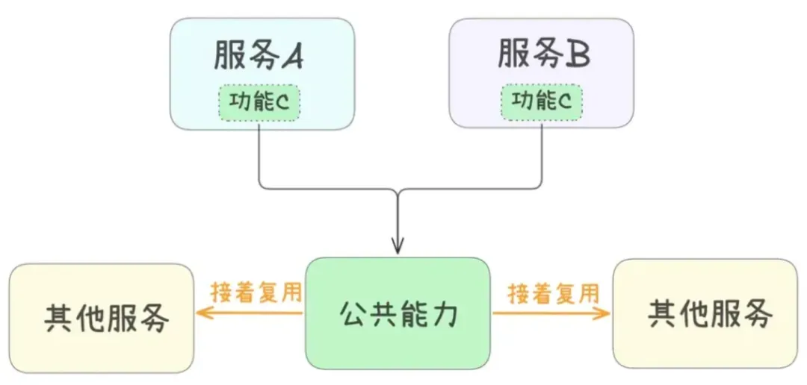

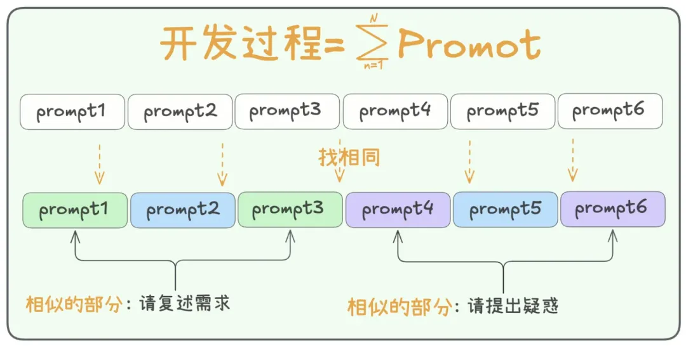

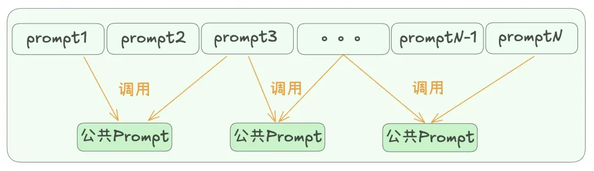

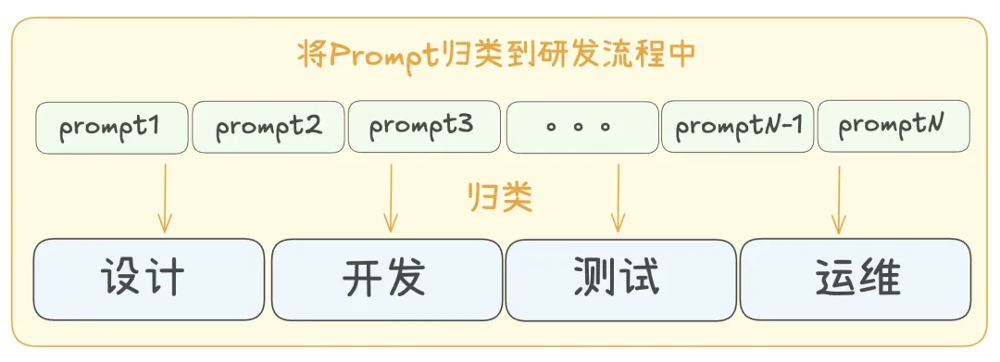

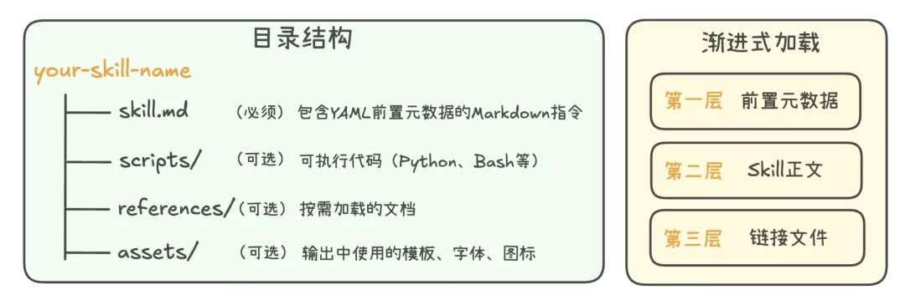

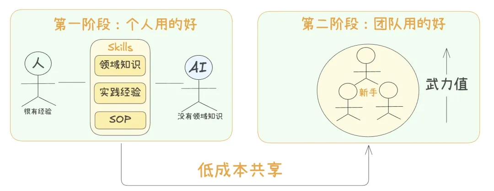

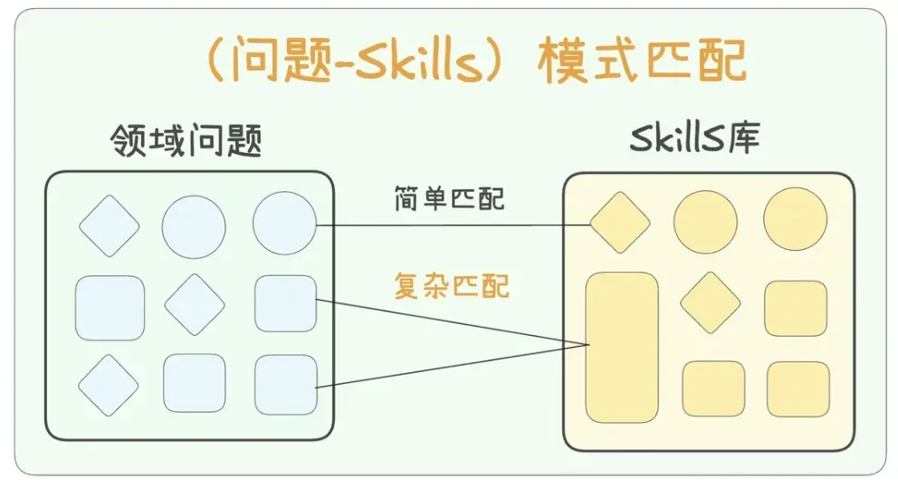

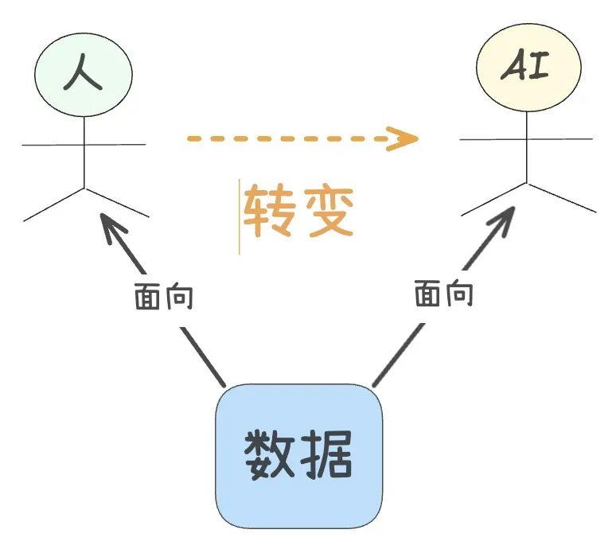

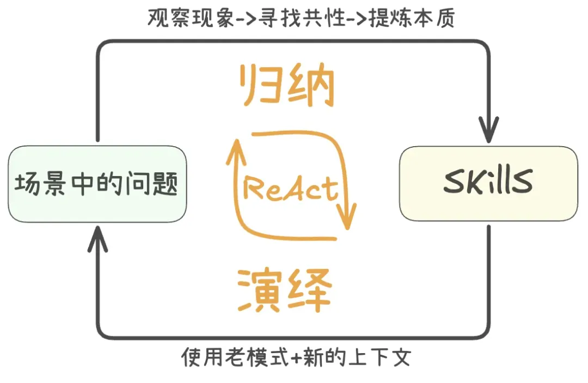

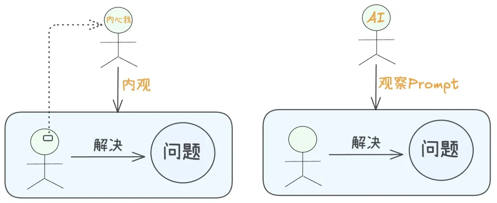

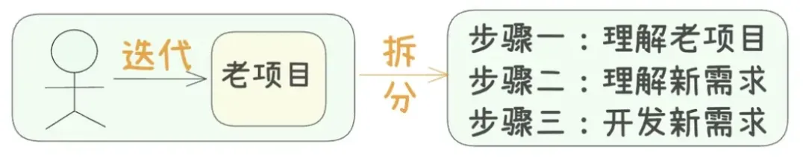

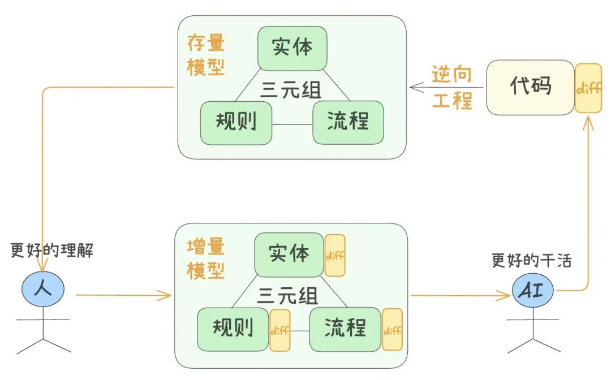

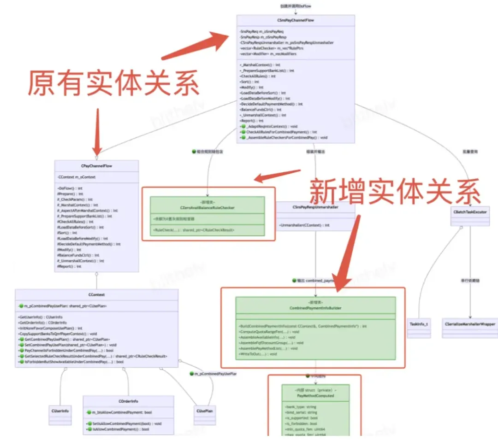

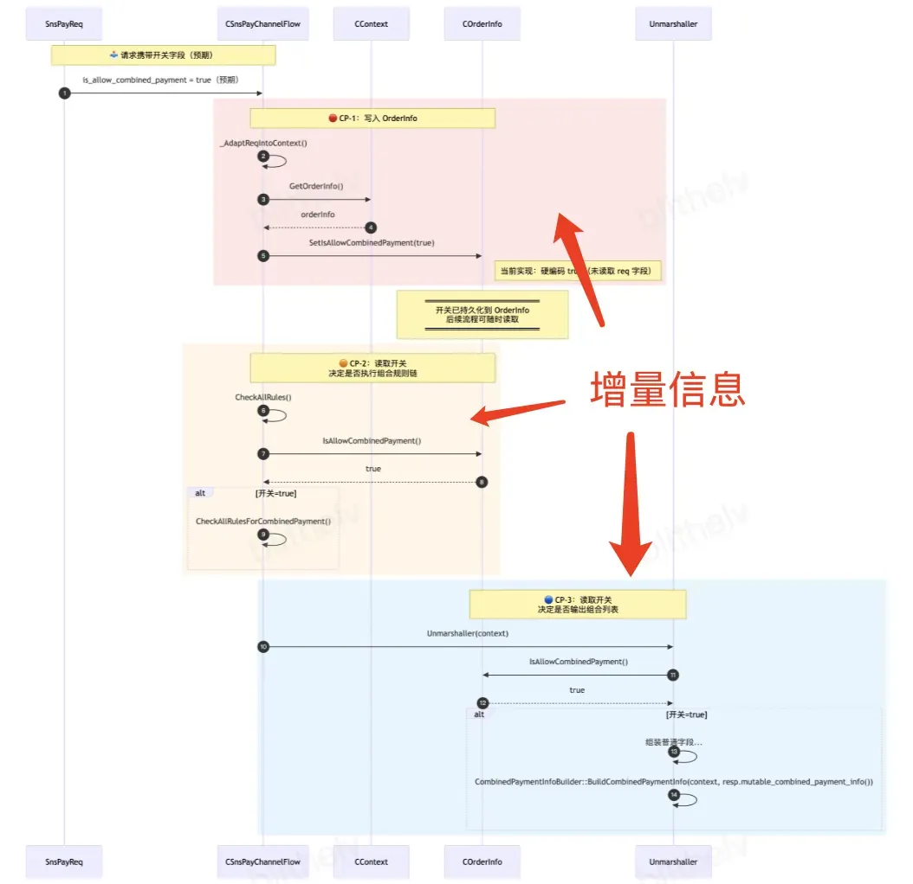

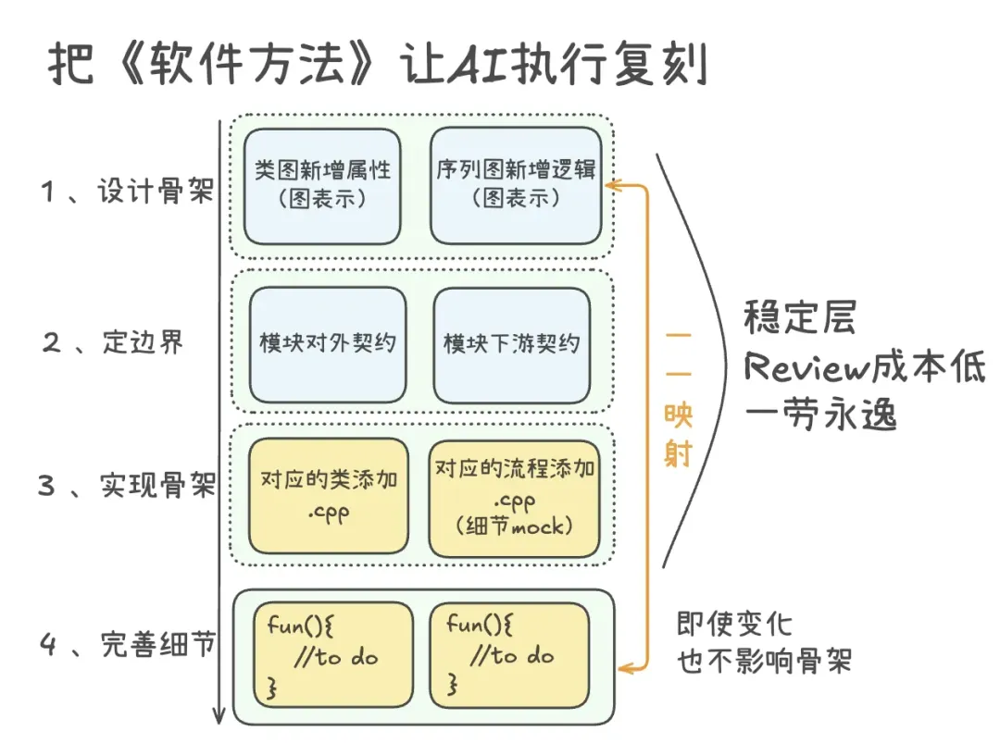

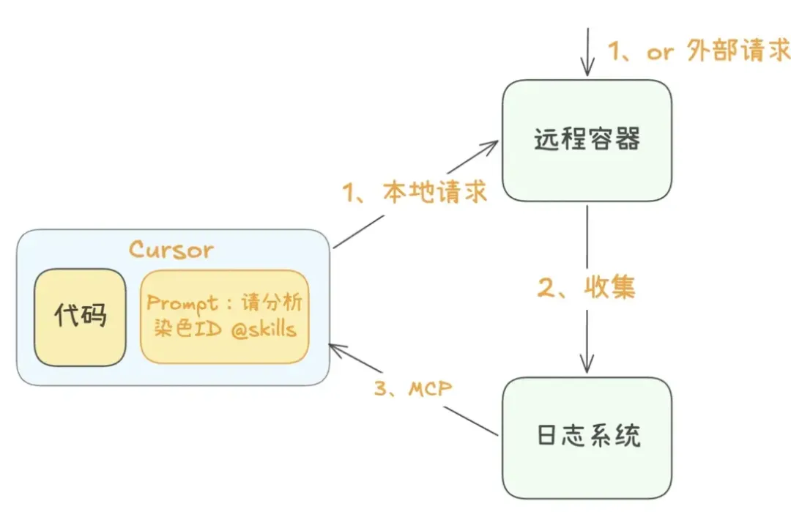

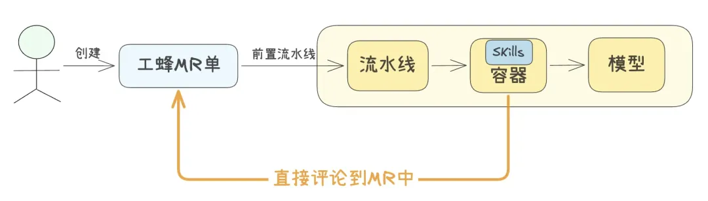

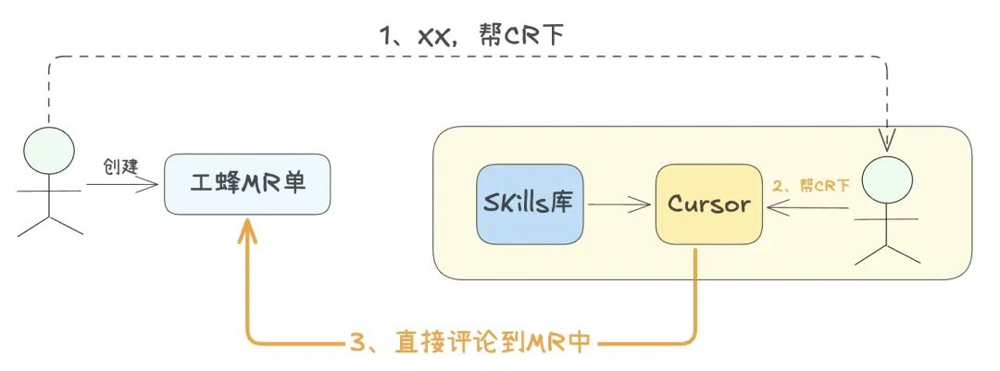

