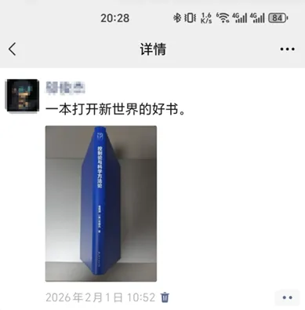
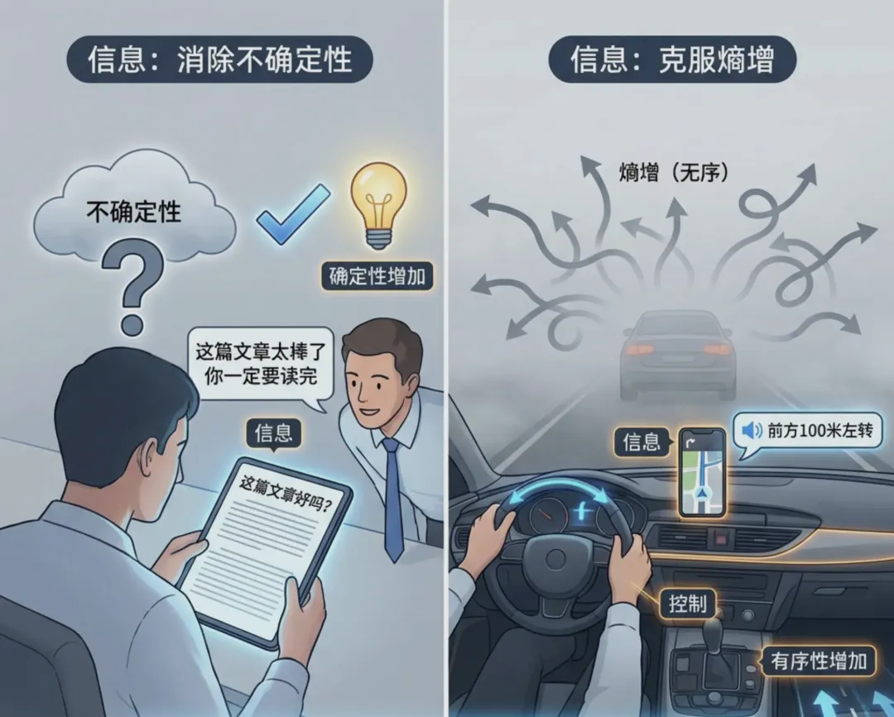
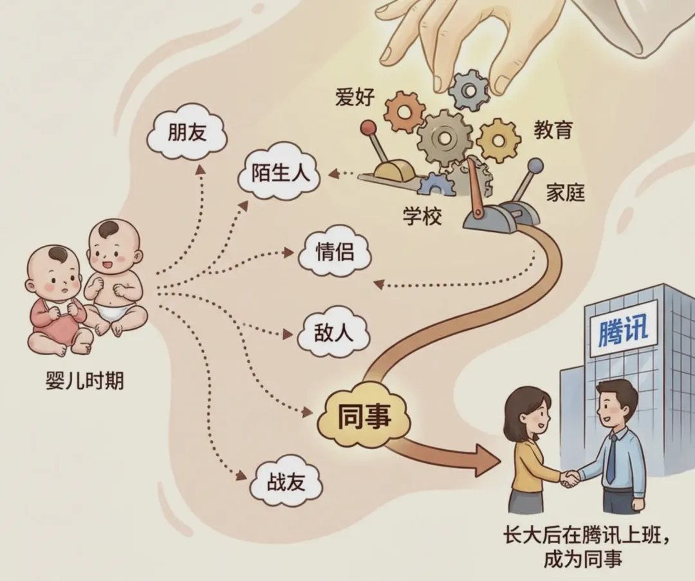
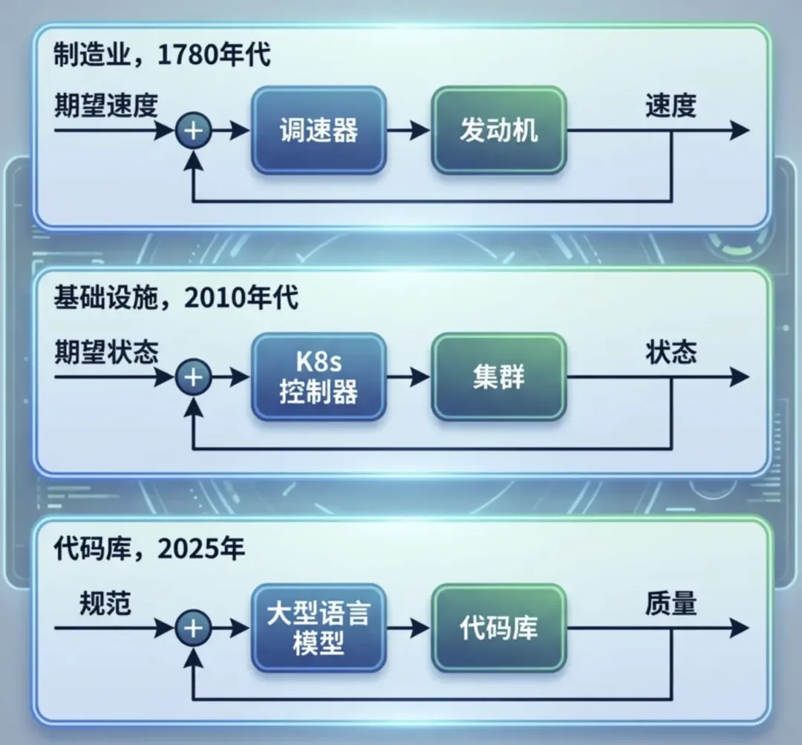
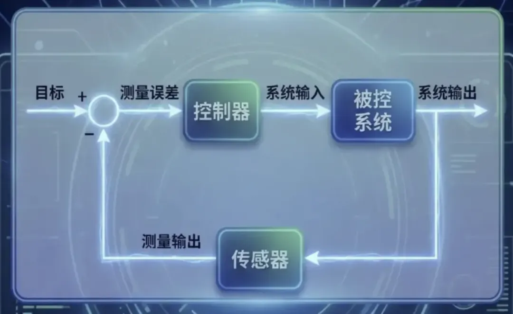
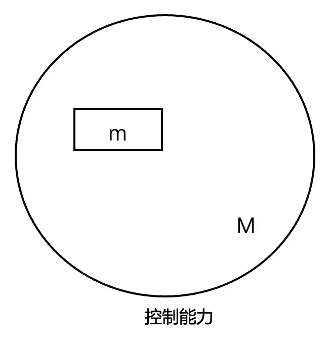
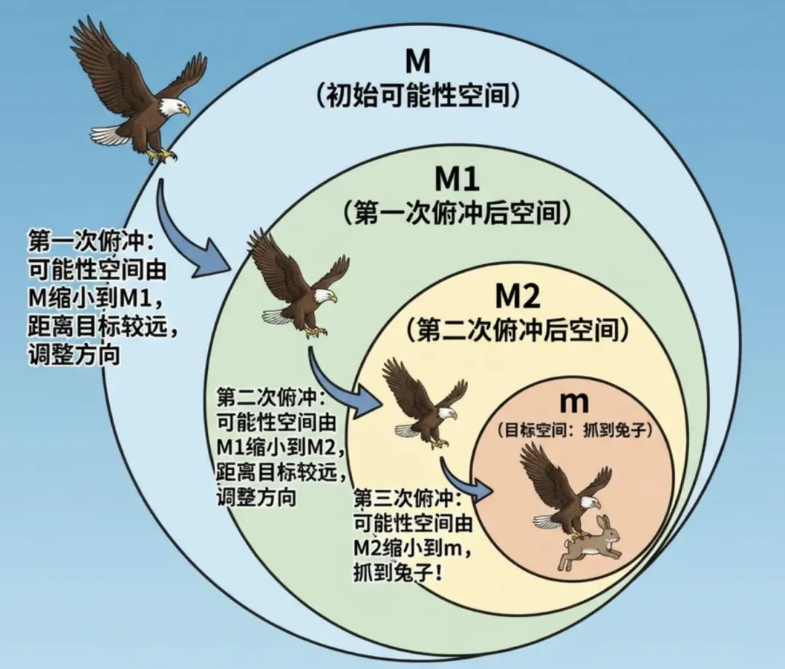
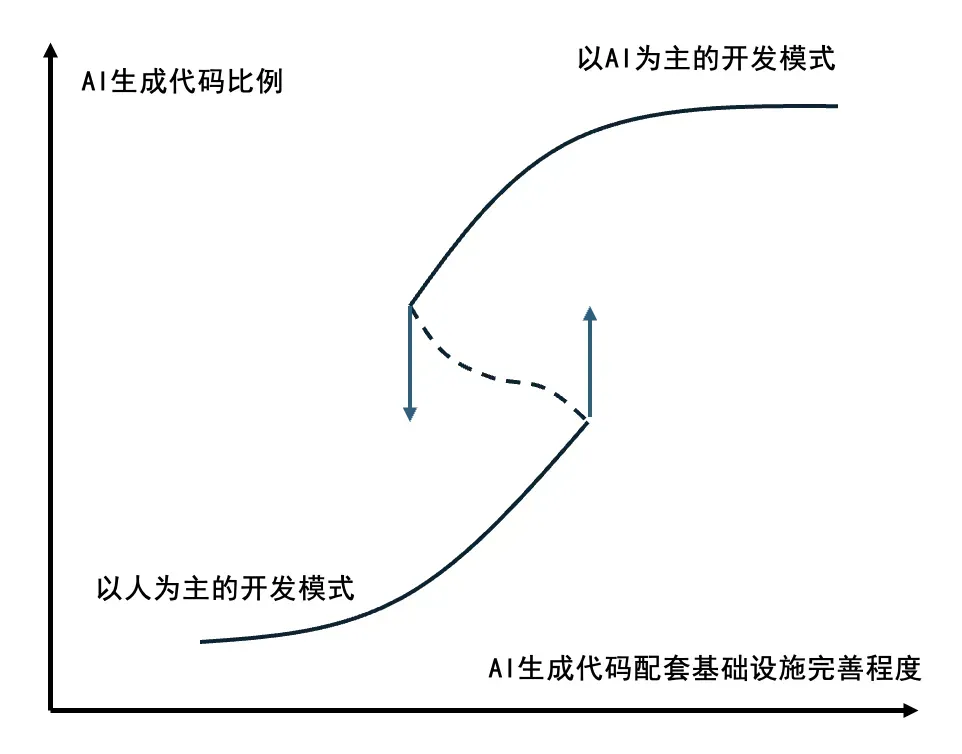

# 一文讲透：Harness Engineering即控制论！

**作者**：邬俊杰  
**公众号**：腾讯云开发者  
**发布时间**：2026年4月17日 08:46  
**原文链接**：[一文讲透：Harness Engineering即控制论！](https://mp.weixin.qq.com/s/_Yn-PRW2kmoOusUbTbi3vQ)

---
关注腾讯云开发者，一手技术干货提前解锁👇

# 01

前言

去年有幸获赠2本书，其中一本是《控制论和科学方法论》，读书过半我就发了条朋友圈，因为我当时觉得自己发现了一件不得了的事情。


不得了自然是有些夸张了，但是我的确因为这一想法而兴奋良久，当时我认为AI 编程就是控制论在编码世界的一个工程实现。奈何我在网络并没有搜到相关言论，以至于我对自己的这一想法产生了怀疑。直到3月份看到OpenAI发表的文章《Harness engineering: leveraging Codex in an agent-first world》以及硅谷工程师George的分析文章《Harness Engineering Is Cybernetics》，甚是惊喜。

1948 年维纳出版了《控制论：或关于在动物和机器中控制和通信的科学》一书，它是通过信息传递来实现目的性行为的理论，关注系统如何通过接收外界和内部的信息来调整自身状态，以达到预定目标。而今天AI“输入-输出-修正”的回路，与维纳笔下的逻辑何其相似，我们热谈的AI 编程到底是不是控制论的一个工程实现呢？

看清来路，或许能更清醒地面对潮头的喧嚣。

# 02

Harness Engineering

Harness Engineering这个词缘起于 2026 年 2 月 11 日 OpenAI 发布了一篇文章：《Harness engineering: leveraging Codex in an agent-first world》（https://openai.com/zh-Hans-CN/index/harness-engineering/），这篇文章有一些亮眼的数据：

3个工程师、5个月内、1500个PR、100%AI编写，完成了一个100万行代码、已投入使用的的系统。他们预估与手工编写相比他们节省90%的时间。

文章的核心理念是人类掌舵，智能体执行，人类绝不动手编写一行代码。当然这里和我们平时开玩笑“码奸”背叛了码农在革码农的命并不是相同含义，并不是不需要人类编码，而是工程师的工作中心发生了变化，负责为AI设计环境、明确意图、构建反馈回路。

文章还介绍他们实践Harness Engineering过程中踩的一些坑，我读后收益匪浅，这里概括的介绍一下。

   2.1 给目录而不是整本说明书

不要尝试用一个巨大的 AGENTS.md 文件来指导AI来完成代码生成，因为它会挤占上下文、不能体现规则的重要等级、导致规则难以维护……正确做法是将 AGENTS.md 控制在约 100 行，仅作为索引目录，AI需要时再根据目录找到深层知识，也就是我们所说的渐进式披露（PS：SKILL不就是这个样子吗，同样的道理不要写过长的SKILL.md）。

   2.2 规则要沉淀到仓库

代码仓库是 AI 唯一能看到的世界，AI没有办法看到人类大脑中的想法，也无法知道编码环境之外的任何内容。因此我们平时所有的设计决策、架构约定、团队共识都必须以版本化的 Markdown、代码或可执行计划的形式提交到仓库，否则AI会像一个迟到三个月入职的新员工，对这些信息一无所知。

   2.3 务必要有架构约束

仅靠一个文本或者Prompt没有办法约束AI生成完全符合要求的代码，AI只有在架构确定的环境中效率才是最高的。我们可以通过脚本、流水线等校验生成的代码是否满足架构约束，防止出现架构漂移。需要注意的是，在规则中应该明确哪些地方需要限制，哪些地方不需要限制，比如生成的代码必须分为gateway、domain、dao三层，至于某一层或者某一块的具体实现，允许AI自由发挥。

   2.4 构建AI可观测的系统

AI的代码生产效率远远高于人类，这时候人的评审反而成了效率的瓶颈，因此最好的方式是AI可以自己发现错误、修复错误、验证修复。例如将日志、监控等信息通过文件、MCP等方式暴漏给AI，让AI可以自己闭环掉开发——测试——修复。

   2.5 等待成本高于纠错成本

这里一条我是存疑的，因为在很多场景，比如金融支付业务，安全稳定比快更重要。文中提到PR 生命周期应尽量短，不要因为偶发性失败而阻塞，因为AI的代码产出速度远远超出人类的PR速度，纠错成本低，等待成本高。

   2.6 让AI自动清理垃圾代码

AI生成新代码时会参考已有代码，因此一次坏的实现会被多次复制，架构可能快速漂移。这个如果靠人来手动处理会耗费极大的时间和精力，因此需要将"黄金原则"编码到仓库中，并运行后台 Codex 任务定期扫描偏差、发起重构 PR——持续小步迭代还债远好过等到累积到一个大债务再去解决。

   2.7 人类的建议要沉淀到仓库中

代码审查中的评论、重构 PR 和用户反馈中体现出了人类对代码实现的要求，这些信息如果只停留在口头或聊天记录中就无法影响未来AI的输出，因此必须将这些信息提取为规则，写到文档中或者编码进工具，才能让人类的要求持续的约束AI，而不是随着时间流逝而消失。

# 03

控制论

题目中还有另外一个关键词——控制论，我去年才接触《控制论和科学方法论》这本书，它并不厚，正文只有215页，但是所描述的理论框架却无比强大，这里有一个很有说服力的例子：钱学森将维纳的控制论思想引入到工程系统中出版了《工程控制论》一书，而该书是“两弹一星”工程在控制与制导领域的重要理论工具书。当然，本文的重点并不是介绍控制论（Cybernetics），因此我以较短的篇幅将控制的核心介绍清楚，以便于进行后续的讨论。

控制的核心可以用一句话概括：通过信息的获取与反馈，对系统进行调节和控制，以实现特定目标的科学。这里提到了三个关键词，我们逐个讲解。

   3.1 关键词——信息

信息这个词我们无比熟悉，但是到底什么是信息却难以言明。在控制论和信息论的视野下，信息的本质可以作如下解释。

信息是“消除不确定性”的东西。举个例子：我写的这篇文章是不是好文章？读到这里你并不知道，它可能干货满满也可能是AI水文。但是旁边同事告诉你“这篇文章太棒了你一定要读完”，这时不确定性就减少了，你就获得了信息。

信息是我们在适应外部世界、并将这种适应反作用于外部世界的过程中，同外部世界进行交换的内容本身。宇宙倾向于从有序走向无序（熵增），而获得信息的过程就是减少系统无序性、克服熵的过程。在迷雾中开车随时可能走错方向（熵增），突然手机导航提醒前方100米左转（信息），你左打方向盘（控制）让车子保持在正确的路上。


信息这一概念明确了，那么这些概念也明确了：知道——人获得信息的过程；传递——信息源和接受者两个系统之间的联系，即一个事物对其他事物的影响……

   3.2 关键词——控制

在讲控制之前，我们需要先讲一下可能性空间，这也是控制论和系统论的研究开始的地方。依然用一个例子来讲可能性空间：我和你的关系。我们并不是从出生开始就注定成为同事，这里面有非常多可能性，但是由于条件或者纯粹机遇的关系，比如你从小受到良好的教育学习一直不错，而我可能恰好高考运气爆表蒙对了好几道选择题，于是我们都进入了不错的大学，工作时你因为“有鹅选鹅”、而我可能纯粹因为深圳离家近都选择腾讯，于是咱们成为同事。

你看，在我们刚出生时我们的关系有各种可能，陌人生、朋友、同事……由于各种条件或者纯粹的机遇，我们的关系才沿着某一个特定的方向发展下去。如果我们进一步思考：假如有上帝，上帝有没有办法通过一些手段干预，让我们成为同事的概率变大呢，这就是我们要讨论的控制。


控制的本质是为了达到既定目标，通过克服不确定性，对系统施加影响的过程。通过以上案例，我们也知道作为控制对象的两个共同点：1）被控制的对象必须存在多种发展的可能性；2）人可以在这些可能性之间，通过一定手段来选择。而AI生成的代码仓库完全具备这两个特点。

书中有一个例子来讲控制能力分析，这个本文没有太大关系，但当时读到这里我非常震撼，实在忍不住分享出来，不感兴趣可以跳过：

```
12个小球，能否用天平称3次，找出唯一的、轻重未知的那个小球？
这是一个数学问题，我记得某次数学竞赛中做过，当时费了好大劲来得到答案，那么我们如果用控制能力来分析，我们来看下多简单：
未称之前，每个小球都可能是废品，废品有轻重两个状态，可能性空间为12*2=24
天平每称一次控制能力为3（左边重、右边重、一样重），即可能性空间缩小为原来的1/3
称三次控制能力为3*3*3=27，27>24，因此可以解决问题。
```

   3.3 关键词——反馈

反馈是指将系统的输出信息返送到输入端，与期望目标进行比较，并根据其中的“偏差”来调节系统下一步行为的过程。反馈分为正反馈和负反馈，正反馈和负反馈之间的主要区别在于对变化的响应：正反馈会放大变化，负反馈会减少变化。正反馈比较罕见，有时候被称为恶性循环，例如体温过高导致代谢加快，产生更多热量，体温进一步升高，出现失控。

这里强调一下负反馈，因为负反馈扩大了系统的控制能力。我们的身体处处有着负反馈，为了达到我们身体健康这一目标，血糖升高则分泌胰岛素降低血糖，血液变热则血管扩张、汗腺排汗……

简单来说，反馈就是让系统具备“自省”和“自我修正”的能力，让系统从“死的东西”变成了“活的系统”，具备“自省”和“自我修正”的能力。

   3.4 小结

读到这里，相信你尽管还不能完全掌握控制论，但是已经等感受到控制遵循的逻辑循环：

[ 设定目标 ] → [ 感知偏差 ] → [ 施加干预 ] → [ 消除偏差 ]

这和我们使用AI何其相似：写Prompt给AI设定目标，AI执行我们验收，不满意（出现偏差）则修改Prompt或者SKILL/RULE文件施加干预，让AI消除偏差以完成我们设定的目标。

# 04

Harness Engineering 和控制论

   4.1 业界观点

George在 X 上发布的长文《Harness Engineering Is Cybernetics》，文中提到这种模式他见到三次，一次是离心调速器，带配重的飞球机构会感知转速，再自动调节阀门，工人没有消失，但工作内容变了，从亲手拧阀门，变成设计调速器；一次是Kubernetes，声明一个期望状态，控制器会检测容器的状态，一旦两者偏离，它就会根据声明做出调整，比如重启、扩容、缩容……，工程师的工作也从手动操作，转向编写容器的描述文件；一次是Harness Engineering，OpenAI 工程师不再手写代码，而是设计环境、搭建反馈回路、把架构约束编码进去，然后由 Agent 来写代码。而以上三种模式，就是今天所讲的控制。


博客中的一个观点令我印象深刻，代码库过去实际上一直是有反馈回路的，但只限于低层级（例如编译器校验语法……），而更上层，即架构层面的决策、质量判断等问题只有靠人判断、修正，而AI则可以让这个反馈回路闭合，识别问题并修复问题。然而真正的难题是把人类独有的知识变成AI可读的东西，大多数情况的失败并非 AI 能力不够，而是知识一直锁在人的大脑里。过去人们总是跳过编写规则直接写代码，因为他们要为此付出代价可能要在很久以后，但到了 AI 时代付出的代价会被成倍放大，因为AI代码生产效率实在是太高了。

所以人不需要在实现上（写代码）战胜机器，而要在评估上胜过它：定义什么是正确、看出哪里偏了、判断方向对不对。

   4.2 我的观点

我深信Harness Engineering就是控制论，控制论除了可以作为两弹一星的指导工具，同样也是AI编程的指导工具，下图是一个控制过程，那么在AI场景对应如下：

目标：即需求，需要Agent完成什么事，达到什么效果

控制器：即AI

被控系统：软件代码

传感器：各种QA校验工具


目标

AI发展实在是太快了，在不同阶段，为了用好AI流行过Prompt Engineering ，核心问题是”怎么把一句话说清楚问题”；后来的Context Engineering ，在Prompt Engineering 的基础上还需要告诉AI完成该任务需要知道哪些知识、可以这么做……但是这些阶段要解决的核心问题依然是怎么让模型在做决策时手里有足够的信息。那么从控制论角度，我们如何和AI描述目标呢，我认为要讲清楚三件事。

需要做什么

关于如何描述需求实际上业界早已经有方法学来解决这个问题，比如软件方法中推荐使用UML表示法来表示。在AI兴起之前，接到一个需求进行领域建模是一件自然而然的事：使用用例规约描述系统对外表现是什么样子的，即需要交付什么样的价值；使用类图、序列图、状态机等描述系统是内部结构是怎么样子的。但是随着AI的兴起，兴许是大模型的强大让人浮躁，很多人认为人无需再进行痛苦的思考，我可以向大模型许愿。

但我们要明白，大模型并非全知全能，它更像是一个执行力极强的员工。其所有知识终归源于人类，即便表现出创造力，也是在人类引导下的“再创造”。因此我认为过去的方法学并没有死去，相反它变得更加重要。因为大模型是基于已有的知识训练，对于流行的、被普遍接受的形式，恰恰是给AI讲清楚需求的最好手段。

因此我给出一个暴论：领域建模并不会消失，相反会扮演更重要的角色。

需要怎么做

我们需要告诉AI需要知道什么知识，为AI提供解决问题所必需的事实、数据、知识。我们说需求是目的地，但是到达目的地有无数条路，这些路有的直接，有的弯曲。如果弯曲的路多了，那么代码就难以维护。

a)用框架和规范降低可能性空间

因此我们需要告诉 AI 规范：使用什么框架、遵循什么代码规范、使用什么编码风格……来降低代码代码生成的可能性空间，将Agent生成代码的可能性为从M降低为m。举一个简单例子：我让AI写一个冒泡排序，AI 有一万种写法（不同语言、不同库、不同变量命名风格……），也就对应可能性空间为M，但是，如果我告诉它必须用C++写，AI 生成的代码的可能性空间就小了一些，我如果告诉 AI 必须使用C++、只能基于基础库实现、使用大驼峰命名、遵循为公司C++代码规范，那么生成代码可能性空间就更小了，也就是生成的代码更确定了。


毫无疑问，我们（Agent）能力范围之内 m 越小越好（即尽量优雅、规范的代码实现），有人会说：反正都是AI维护代码，代码的好坏有什么影响呢？

这就不得不提到另一个概念，核爆炸、癌细胞生长、传染病的流行现象，表面上看毫无影响，但是控制论给出了统一的名字：自繁殖系统。在一定条件下，某变量的值越大，变量的值增加越快，自繁殖系统一旦存在，无论一开始他对周围环境影响多小，最后都将产生巨大的、不可忽视的影响，比如核爆炸。假如AI首次写了一个烂代码，后面的实现大概率会参考该烂代码编写，当到一定程度后，AI也没有办法控制了。

过去我所在的部门建设了大量的规范和标准化框架、组件，一旦这些基建接入AI，无疑是让 AI “听话”的利器。

b)合理的流程规划实现控制力累积

将一个大任务拆分为一个个小任务会让代码生成效果更好这已经是共识。但是为什么呢，我们同样可以用控制论来解释。

首先我们知道，AI虽然强大但不是万能的，换句话说，AI作为控制器其控制能力有限，并不能100%满足我们的要求。那如何扩大Agent的控制能力，来达到预定目标呢，答案是通过负反馈调节。来看一下老鹰抓小鸡的例子，我们把老鹰额动作看作是一些里俯冲的连续，每一次向目标俯冲看作是对自己的控制。老鹰的控制力优先并不能一次就达到目标抓到兔子（兔子也会跑不是），只能逐步向目标接近。

第一次俯冲可能性空间由M缩小到M1，发现距离目标较远，调整方向发起第二次俯冲

第二次俯冲可能性空间由M1缩小到M2，发现距离目标较远，调整方向发起第三次俯冲

第三次俯冲可能性空间由M2缩小到m

通过三次俯冲，老鹰的总控制能力为：(M/M1)*(M1/M2)*(M2/m)=(M/m)，达到了抓到兔子的目标。


同样在AI生成代码时，由于AI控制能力有限，我们需要不断的通过反馈让AI进行调节，通过多次控制能力的积累，生成代码的可能性空间就由 M 缩小到 m 了，也就生成满足我们要求的代码了。

用什么工具

人之所以强大，因为人会使用工具。人靠自身做不到的事情但是使用工具就可以。同样我们也需要给带提供工具，并且告诉AI这些工具能做什么以及做了之后的结果，为模型提供与外部世界交互的能力。

我们再来聊一下控制论中的共轭控制。我们直接让AI生成满足我们要求的代码，可能就像老鹰俯冲一次就抓到兔子一样困难，除了流程规划来实现控制能力的累积，还有一种手段就是共轭控制。我们无时无刻都在使用共轭控制，只是我们不自知，我们通过一个经典的例子来解释：曹冲称象，使用船和石头称出大象的重量，假设：

L：把大象的体重变成石头的重量

A：称出石头的重量

L-1：把石头的重量变换成大象的体重

那么我们把L-1AL称作与A共轭的控制方法，把原来无法完成的事转变成了可以控制的A过程从而去完成。这个过程非常简单却应用非常广泛，而在现代化的自动控制设备中L和L-1分别称为感受器和效应器，人基于感受器采集的各项指标操作按钮控制机器生产。对应AI生成代码，L感受器则基于各种输入收集代码生成的各项参数给AI分析，AI通过参数或者调用不同工具控制选择，L-1效应器（各种MCP、SKILL脚本）则将各种参数转换为代码，让AI使用工具完成原来不能完成的事。

   4.3 传感器

控制循环中之所以能够自矫正，就是因为有传感器在持续的收集信息，然后不断的计算和目标之间的差距，那么AI生成代码代码的传感器是什么呢，我认为有如下两类：

业务无关的传感器

这是我自己造的词，换一种说法可能更好理解，就是这里有一段代码，你不用了解这段代码是做什么的，但是你知道这段代码不对，为什么呢，因为语法不对编译不过！这就是业务无关，而检测这种错误的组件、流水线等就称为业务无关的传感器。

在上文中已经提到，我们要保证仓库的代码整洁，因此这些和业务无关的检测组件一定要接入到整个 AI 生产代码的过程中，比如代码规范、安全规范、语法检测、部署失败日志等等。AI 在完成代码生成任务后需要运行这些检测组件，然后根据检测组件出具的报告修复代码。

业务相关的传感器

不知道你是否和我一样，曾经迷茫这样一个问题：我们给AI的输入，到底应该详细到什么程度。我还是以《代码千行不如架构图一张！程序员如何培养业务思维，做有价值的需求？》中的例子：要实现扣款用例，你可以这样告诉 AI：

```
基本路径：
    1. 服务商收银系统提交消费信息
    2. 系统提示学生刷脸
    3. 系统验证刷脸学生账号签约状态
    4. 系统请求XX支付扣款
    5. 系统保存扣款结果
    6. 系统返回扣款单信息
扩展路径：
    3a. 学生账号未签约：
        3a1. 系统通知家长签约
    4a. 扣款账户余额不足：
        4a1. 系统校验垫资条件
            4a1a. 不满足垫资条件
            4a1a1. 转到5
        4a2. 系统请求XX支付扣款
        4a3. 系统通知家长还款
```

你也可以这样告诉AI：

```
前置条件：
       存在已经完成签约的学生账户
后置条件：
       扣款凭证已经关联一笔扣款成功的支付订单
涉众利益：
       家长--担心由于忘记充值，账户内余额不足而导致孩子无法吃饭
       餐厅老板--担心卖出饭但是没有收到对应的款项
       系统提供商老板--担心出现大量垫资未还的欠款，产生坏账造成资金损失
基本路径：
        1. 服务商收银系统提交消费信息
        2. 系统提示学生刷脸
        3. 系统验证刷脸学生账号签约状态
        4. 系统请求XX支付扣款
        5. 系统保存扣款结果
        6. 系统返回扣款单信息
扩展路径：
        3a. 学生账号未签约：
            3a1. 系统通知家长签约
        4a. 扣款账户余额不足：
            4a1. 系统校验垫资条件
                4a1a. 不满足垫资条件
                4a1a1. 转到5
            4a2. 系统请求XX支付扣款
            4a3. 系统通知家长还款
字段列表：
        1. 消费信息=消费金额+商户订单号
        2. 扣款单信息=扣款金额+是否垫资+支付订单号
业务规则：
        1. 单学生账户最多同时存在3笔欠款
        2. 垫资只针对消费金额小于30元的订单
        3. 每个学校有垫资上限，垫资上限=学生数*3*30*10%
质量需求：
        1. 扣款从收到请求到结束在5秒内完成
设计约束：
        1. 收款系统使用XX支付
```

这里有一个非常有意思的点，我们写第二个规则所花费的时间一定是多于第一个，但是如果将这两个用例规约作为Prompt 提供给 AI 生成代码很可能效果是一样的，因为AI很“聪明”，尤其是迭代老项目时，它极有可能基于已有的代码实现推测出来这个用例应该是什么样子。

于是我们难免会想：既然详尽的 Prompt 未必比简单的效果更好（即便略好一点，却需耗费大量时间打磨），为何还要如此费劲？

我认为这是因为短视造成的，只着眼于代码生成，而忽略测试、维护。简单的Prompt也许也能生成正确代码，但是它缺少一个标准，一个可以让AI知道生成代码对不对的标准，这个对不对不是指语法，而是指是不是100%满足业务规则。回忆一下，人接到一个需求一定要和产品确认细节，为什么要确认下这些细节呢，因为我们开发完了要进行测试，确认自己实现的逻辑是对的，绝对不会基于一个糊涂的需求靠猜测实现上线。既然我们要求产品给出清晰明确的需求，为什么我们给AI提需求时就要模糊呢。

所以答案也就很明确了：我们给出的业务规则，一定要写到 AI 可检测、可验证为止。

我们可以预想一下，假如测试、规范检查、语法检测、UAT这些反馈回路全部嵌入到 AI 的执行循环内部，AI 每生成一段代码就自动验证并修复，这将和人工 Review 后手动修改有着天壤之别——错误的发现和修复从数小时缩短到了数分钟。

现在矫枉过正了吗

我们常常听到一些吐槽，例如吐槽强迫研发使用AI编写代码、吐槽所有的流程都在强行AI、吐槽引入AI后提效非常有限或者说比原来更慢了等等，短期来看也许吐槽的很有道理，但假如我们坚持“长期主义”呢？（扯个大旗）

在《毛选》中有关于“矫枉过正”和“矫枉必须过正，不过正不能矫枉”的讨论，而在控制论中，针对矫枉过正有一个专门的术语——滞后，书中有一个例子：一根铁丝我们施加一定力会变弯，松手后并不会完全变直，而是要适当的往相反的方向施加一个力，也就是要“矫枉过正”。

那什么时候矫枉过正呢？控制论中的突变理论介绍了矫枉过正和飞跃现象之间的矛盾，如果质变中经历的中间过渡态是不稳定的，那么他就是一个飞跃的过程，如果中间过渡态是稳定的，那么他就是一个渐变的过程。例如水的沸点是100摄氏度，但实际上由液态变为气态需要略高于100摄氏度，这就是因为它是一个飞跃的过程，水汽化时并不能停留在一个稳定的状态，要么液态、要么气态。当质变以飞跃方式进行时可能需要矫枉过正。

而研发模式的升级我认为将会是一个飞跃的过程，之所以现在我们仍然需要需要参与编码，一个非常大的原因就是缺乏传感器和基建，仍然需要人来串流程，比如需要人来验证UI是否正确、需要人来告诉AI代码不符合代码规范，因此在有些场景我们仍然感觉 AI 完成的很吃力，但这不是 AI 能力不行，而是我们并没有为 AI 提供友好的环境……未来的某一天当我们的传感器建设的完善到一个临界值，AI编程再也不需要人来串流程了，我相信所有人会立刻抛弃原有个开发模式，就像我们迅速抛弃传统 IDE 去拥抱Cursor一样。

当然这是我浅薄的理解，并没有经过精密的推导，供大家批判。


# 05

对我的影响

前面对控制论做了简介，讲了OpenAI的提出的Harness Engineering以及一篇比较火的对Harness Engineering分析的帖子，总结了我的一些思考，这些内容对我的影响是巨大的。

   5.1 它证明了一件事

在我看到openai的文章之前，我一直有一个怀疑：AI能否大规模地构建和维护复杂、可靠的软件，例如金融支付系统。之前我倾向于 AI 只能独立完成较小规模的软件，而大规模软件一定需要人的参与，其形式是 AI 和人共同来完成代码开发，AI只能生成一部分，无法100%生成代码。而这边文章用实际案例证明了这是可行的，尽管仍然面临一些挑战。

   5.2 它纠正了一个错误

我经常吐槽，每次让 AI 完成一件事，我要写详细的规则描述，更让我苦恼的不是写完就完事了，每次 Agent 犯了一个错，我就要回去调整、测试、出错、调整……这个循环反复了几十次之后，规则文件变成一个成百上千行的文档：里面有方法、规范、禁止……

曾经我一度认为，这完全就是在浪费时间，这属于买椟还珠，对于程序员来说写代码才是正事！

曾经我一度认为，先把Cursor的Tab提示用好了再说，程序员一定要接触代码。

然而，现在我意识到，这种想法完全是错误的，写规则文件并不是浪费时间，那就是 AI 时代程序的工作本身。

   5.3 它改变了一个观念

之前在我的观念中，程序员和AI要么是替代关系，要么是协作关系。

替代关系：有观点认为 AI 会完全替代程序员，程序员将会被大量裁员。我时常认为这种观点太极端了，或者太乐观了，他们过于乐观的认为 AI 可以完成程序员能做的所有事，但是我又时常认为他是正确的，因为大模型发展实在是太快了，也许有一天他真的能够替代程序员。

协作关系：还有一些人认为程序员和 AI 是协作关系，他们认为AI一定不能100%生成代码，或者说很长一段时间内不能100%生成代码，而不能生成的这一部分就需要人来编写，程序员既扮演者指挥者的角色，也扮演着协作者角色，和 AI 共同来完成一个软件的代码实现，我之前更倾向于这种观点。

但是这两篇文章改变我之前的观念，现在我认为他们是管理与执行的关系：AI 可以生成100%的代码，但并不意味着程序员一定会被替代。程序员掌舵（方向、意图、判断），智能体执行（写代码、重构、测试、合并），这种关系和协作关系相比有着微妙的区别，程序员需要站在更高的层级，或者说每个程序员都必须拥有架构师的水平，因为程序员的工作内容发生变化，已经从拧阀门的人变成了设计调速器的人——不再是代码的生产者，而是环境的架构师、反馈回路的设计者、质量标准的编码者。

程序员的核心价值不再是"实现"，而是"评估"。

| 古法编程 | Harness Engineering |
| --- | --- |
| 编写代码 | 设计环境 |
| 调试bug | 明确意图 |
| 代码审查 | 构建反馈回路 |
| 编写测试 | 将工程判断编码成机器可读的规则 |
| 重构代码 | 校准传感器与执行器 |

# 06

尾巴

软件方法、领域建模、架构……这些“最佳实践”我们喊了数十年但实践的并不好，因为即使代码写的很粗放，债务依然积累的很慢，直到很久很久之后的一个时间点爆发，也许这个时间点到我们离职都不一定爆发，惰性让我找各种借口拖延，可以“先上线、后优化”。然而AI时代债务的累积速度是远超想象，AI可以全天候的参考已有代码复制同样的错误，一次坏的实现会被无数次的重复，因为“你没写下来的规矩，AI永远不知道”。

因此我们一定要将业务规则写下来，AI的输出是不确定，但是代码可以被确定性的验证，我们不需要比机器写得更快，但是我们一定要高效评估它的产出。而这有一个前提，我们必须建设完善的基础设施：可以检验语法、可以安全扫描、可以单测、可以集成测试……也许你会吐槽，原来我可以上来就写代码，现在你要我建模、写规则、写工具，这不是浪费时间吗。不是，这本就是AI时代程序的本质工作，时代变了，我们做的事也变了。

面对AI浪潮，我是迷茫的，因为我并不知道最终它将会对我产生怎样的影响，我现在做的探索、尝试也许很快就过时失去价值，也许将来的某一天模型已经强到不需要那么多系统层面的约束呢？或许吧，但是也许真到了那一天，程序员也就不存了。但是我仍然乐此不疲的进行各种尝试，至少现在，我们仍然是离AI最近的群体。

回到导语中的那个问题：如果一个程序员为 AI 写规则文档所花费的时间比写代码还多，这对吗？

对！因为AI时代程序员的本职工作就是设计让 AI 正确写代码的环境，而不再是正确的写代码。蒸汽时代到来后船夫再也不需要去划桨了，不是因为他们不会，而是因为这件事已经没有任何意义了。

   参考资料

《Harness engineering: leveraging Codex in an agent-first world》（https://openai.com/zh-Hans-CN/index/harness-engineering/）

《Harness Engineering Is Cybernetics》（https://x.com/odysseus0z/status/2030416758138634583）

《控制论和科学方法论》- 金观涛 / 华国凡

-End-

原创作者｜邬俊杰

感谢你读到这里，不如关注一下？👇


📢📢来抢开发者限席名额！点击下方图片直达👇


你对本文内容有哪些看法？同意、反对、困惑的地方是？欢迎留言，我们将邀请作者针对性回复你的评论，欢迎评论留言补充。我们将选取1则优质的评论，送出腾讯云定制文件袋套装1个（见下图）。4月24日中午12点开奖。


扫码领取腾讯云开发者专属服务器代金券！


[](https://mp.weixin.qq.com/s?__biz=MzI2NDU4OTExOQ==&mid=2247694196&idx=1&sn=151b34f31e6a5cdfe4cc8600668b57cb&scene=21#wechat_redirect)

[](https://mp.weixin.qq.com/s?__biz=MzI2NDU4OTExOQ==&mid=2247694634&idx=1&sn=1cc86d5e6ac59df5b73303e1f1a4a8f6&scene=21#wechat_redirect)

[](https://mp.weixin.qq.com/s?__biz=MzI2NDU4OTExOQ==&mid=2247694641&idx=1&sn=dff67991264624bf2e7615bd637f4cf6&scene=21#wechat_redirect)


---

> ⚠️ 以下图片未能从正文 HTML 中定位，按下载顺序追加：


















