# 万字干货！Agent Skills从入门到精通

**作者**：冷逸  
**公众号**：沃垠AI  
**发布时间**：2026年4月13日 22:45  
**原文链接**：[万字干货！Agent Skills从入门到精通](https://mp.weixin.qq.com/s/inhBH4dgp5BPKu-4sVAaxA)

---

大家好，我是冷逸。

如果你要问我，2026年最值得学习的AI技能是什么？我会毫不犹豫地推荐Skills。

无论是Claude Code，还是龙虾、爱马仕，几乎所有的Agent，如果想把事情干得又快又好，都越来越依赖Skills。

没有Skills的Agent，就像一位刚入职的新同事，你得培训，反复教他。而有了Skills的Agent，则更像是一位老同事，开箱即用，配合默契，非常靠谱。

“同事.skill”可能只是个玩笑，但“work.skill”一定是刚需，是生产力。甚至在我看来，Skills很可能是今年Agent领域最重要的创新之一。

简单理解：模型是大脑，Agent是躯体，而Skills就是双手。

现在，只是学会怎么“问”AI，其实已经有点不够了。更重要的一件事是，学会怎么“教”AI。把你重复做的工作、团队里的隐性知识、那些“只有老员工才知道”的操作细节，封装成一个又一个的.skill文件。

它们会成为你最好的数字同事。不摸鱼，不抱怨，随叫随到，而且越用越顺手。

今天这篇文章，我会试着带大家从入门到精通，彻底搞懂Skills——理解skill，成为skill，超越skill。

如果你是新手，相信一定会大有收获；如果你是老司机，也会看到一些新的启发。

如果觉得有用，欢迎点赞、在看、分享三连。一起学习，一起成长。

1、Skills是什么？——给AI发一本“员工手册”

2025年10月16日，Anthropic首次发布Agent Skills。最初，Skills只能在Claude Code里使用，而且还必须是Claude的Pro付费用户。


Anthropic发布Agent Skills

12月18日，Anthropic把Agent Skills作为统一标准，对外开放，不论你是不是Claude的付费用户，都可以使用。

之后，很快像Codex、Cursor、Antigravity、OpenCode、Trae、Qoder、CodeBuddy等Coding Agent以及Claude Cowork、Skywork、MiniMax Agent、扣子等桌面Agent都陆续支持了Skills。

也包括，2026年春节后爆火的OpenClaw（中文名“龙虾”）和最近大热的Hermes Agent（中文名“爱马仕”），也都支持Skills。


Skills，简单翻译过来就是“技能包”的意思。就像我们人一样，有很多的技能，比如骑车、游泳、开车、烹饪、摄影等。Skills，就是我们人类专门给AI准备的技能包。

Anthropic官方定义：Skills是一套模块化能力，允许开发者通过结构化的文件夹来增强Claude Code的能力。每个Skill都包含一个核心的SKILL.md文件以及相关的辅助资源文件。当用户提出请求Claude Code时，它会根据请求内容和Skill的描述自动判断何时调用相应的Skill来处理这个请求。

用一句话大白话来解释：Skills就是我们专门给AI定制的“标准操作手册（SOP）”。

每个Skill都有一个专门的文件夹（核心文档 SKILL.md），用来放执行指令、资源文件和参考资料等。但千万别小看这个文件夹，它能让AI瞬间从“职场小白”变成“职场老司机”。

为了方便大家理解，我们不妨拿“开一家汉堡店”来打个比方：


- Prompt就像顾客的点单：“老板，给我做一个牛肉汉堡，不要洋葱！”（指令很明确，但怎么做全看厨师心情）。
- MCP就像厨房里的工具和食材：它给了AI铲子、平底锅、牛肉饼和面包（AI终于不用空手套白狼了）。
- Skills是这家店的秘制菜谱+员工守则：“第一步，肉饼必须煎 3分半钟；第二步，酱汁只能挤两圈半；做完后，必须清理灶台！”
Skills规定了动作的先后顺序、质量底线和执行标准。有了它，AI就不再瞎猜你的心思，而是按部就班地干活。

2、拆解Skills的核心架构

简单理解Skills后，我们从文件夹层面来对Skills的架构做一个剖析。

打开Claude Code的安装文件夹（默认是在C盘，文件名.Claude），找到Skills文件目录，通常你会看到这样的文件架构。


「skill-creator」skill的文件夹架构

- SKILL. md：这是skill的核心指令，包括skill名称、触发条件、任务流程、执行指引等。
- scripts：用于存放可执行代码（如Python、Bash脚本等）。
- references：用于存放按需加载的参考文档，比如技术规范、API文档、代码片段、设计指南等，主要是给AI看的。
- assets：用于存放素材资源，比如模板、字体、图片、logo、背景资料等。
通常，一份标准的Skill结构如下。

```
skill-name/
├── SKILL.md (必需)
│   ├── YAML frontmatter (必需)
│   │   ├── name: (必需)
│   │   └── description: (必需)
│   └── Markdown instructions (必需)
└── Bundled Resources (可选)
    ├── scripts/          - 可执行代码
    ├── references/       - 参考文档
    └── assets/           - 资源文件
```

这里面，除了SKILL.md是必选项以外，其他都是可选项，可根据自己的skill需要进行灵活配置。

当Claude Code、OpenClaw这些Agent运行skill时，它会：

1. 以SKILL.md为第一指引，了解该skill对大模型的要求。
2. 结合当前的任务情况，判断是否需要调用scripts（代码脚本）、references（参考文档）和assets（素材资源）。
3. 最后通过“规划-执行-观察”的交错式反馈循环，来完成用户制定的任务要求。
在整个架构中，SKILL.md最为关键，其内部架构如下：


SKILL.md内部剖析（图by苍何）

首先是skill的name，一般用英文和连字符“-”组成，比如一个前端设计skill，其name可以命名为「frontend-design」。

然后是description（描述），这是skill的YAML元数据非常重要的一环。其质量决定了该skill能否被Claude Code准确触发。

比如，Anthropic官方的frontend-design skill，它的description字段内容如下。


「frontend-design.skill」的description字段

翻译成中文，就是：

“创建具有高级设计感的独特的、专业的、可用于实际生产的前端界面。当用户需要开发网页组件、页面或应用程序时，可运用此skill。生成的代码富有创意且精致，避免出现千篇一律的AI风格。”

因此，写好SKILL.md中的description字段非常重要，因为它直接决定了Claude Code会在何种情况下自动触发并加载该skill。如果description写得不清晰或不准确，即使你的skill再强大，AI也可能在需要时“想不起来”使用它。

根据最新的Agent Skills最佳实践和官方指南，以下是写好description 的核心策略和模板：

1）核心原则：触发即正义

Description的首要任务不是给人看的，而是给AI的路由机制看的。它需要明确回答两个问题：

- 这个skill是做什么的？(功能定义)
- 用户在什么场景/说什么话时应该使用它？(触发条件)
2）“黄金结构”公式

一个高质量的description通常遵循这个结构：[一句话核心功能] + [具体执行动作] + [明确的触发关键词/场景]。

优秀写法示例：

案例A：代码审查技能

```
name: security-code-review
description: Reviews code for security vulnerabilities and best practices. Use when the user asks to "review code", "check for bugs", "analyze security", or mentions specific issues like SQL injection, XSS, or performance bottlenecks.
```

案例B：PDF 处理技能

```
name: pdf-processor
description: Extracts text, tables, and metadata from PDF files; merges or splits documents. Use when working with PDF files, converting PDFs to text, filling forms, or when the user uploads a PDF and asks for summary/extraction.
```

简单理解就是，写好description的秘诀在于模拟用户的提问方式。想象一下你会怎么向AI提出请求，然后就把这些请求中的关键词都塞进description里。

通常，一个标准的SKILL.md，其Markdown格式大致是这样：

```
---
name: 你的skill名称
description: 简要描述该技能的功能以及何时该使用它
---
# 你的技能名称
## 指令 (Instructions)
为 Claude Code 提供清晰、逐步的操作指南。
## 目标 (Goal)
## 示例 (Examples)
展示使用该技能的具体代码或操作案例。
```

比如，我们随手创建一个「PDF分析」skill，它的SKILL.md设计如下。

```
---
name: pdf
description: 从PDF文档中提取和分析文本。当用户要求处理或阅读PDF时使用。
---
# PDF 处理技能：
1.使用本文件夹中的extract_text.py脚本提取PDF中的文本：
python3 extract_text.py 
2.提取后，请以结构化格式总结要点。
```

3、Skills的三个“魔法机关”

Skills的核心架构，藏着3个“魔法机关”，彼此协同工作。

比如，这是专门制作视频的Remotion skill的SKILL.md设置：

```
---
name: remotion-best-practices
description: Best practices for Remotion - Video creation in React
metadata:tags: remotion, video, react, animation, composition
---
## When to use
Use this skills whenever you are dealing with Remotion code to obtain the domain-specific knowledge.
## Captions
When dealing with captions or subtitles, load the [./rules/subtitles.md](./rules/subtitles.md) file for more information.
## Using FFmpeg
For some video operations, such as trimming videos or detecting silence, FFmpeg should be used. Load the [./rules/ffmpeg.md](./rules/ffmpeg.md) file for more information.
## Audio visualization
When needing to visualize audio (spectrum bars, waveforms, bass-reactive effects), load the [./rules/audio-visualization.md](./rules/audio-visualization.md) file for more information.
## How to use
Read individual rule files for detailed explanations and code examples:
```

它主要靠三个聪明的“机关”来约束AI：

机关一：智能开关（YAML元数据）

每个Skill文件的开头（就是用---包裹的那块），都有一个小小的控制面板，这是Skills的元数据，会始终加载到Claude Code的系统提示中。这就好比技能的“开关”和“权限卡”。

机关二：随用随取的“小抄”（渐进式披露）

过去的AI有个毛病：记性不好。如果我们把公司的所有开发规范都塞给它，它的“短期记忆（上下文窗口）”瞬间就被撑爆了，导致它开始胡言乱语（AI幻觉）。

Skills的设计非常聪明：平时绝不占用脑容量，只在需要时占用。

你写好的几十个Skills，就像存放在书架上的工具书。Claude Code平时不去翻它们，只有当你触发了“测试代码”的技能时，Claude Code才会翻出小抄，只把关于“如何测试”的那张纸加载进大脑。内存省了，思路也无比清晰。

机关三：呼叫外援与影分身（行动导向与子代理）

Skills可不只是让AI读说明书，它还能让AI“动起手来”。

在Skill的指导下，Claude Code可以像人类一样敲击命令行、搜索文件、运行测试。更有趣的是，如果它碰到了一个极其复杂的巨无霸任务，它可以召唤一个“子代理”（Subagent）——就像是它召唤了一个自己的“影分身”，让分身专门去隔壁房间解决那个大难题，搞定后再把结果汇报给自己。

这里面，渐进式披露（Progressive Disclosure）是Skills最牛的的设计哲学。

它让Skills的所有信息不是一次性塞给Claude Code，而是分三层加载，根据需要逐步展示。

| 层级 | 内容 | 加载时机 | Token配额 | 作用 |
| --- | --- | --- | --- | --- |
| 第一层 | 元数据（name + description） | 始终在上下文中 | 约100词 | 决定skill何时触发 |
| 第二层 | SKILL.md主体 | 技能触发后 | ＜5000词 | 核心工作流程 |
| 第三层 | 配套资源（scripts/references/assets） | 按需加载 | 无限 | 详细参考和可执行代码 |

这种设计有什么好处？

想象一下，你有一个包含数百页技术文档的Skill。如果每次对话都把这些文档加载进去，对话上下文（Context）很快就会被撑爆。但通过渐进式披露，Claude Code只在需要时才加载相关文档——就像一本组织良好的指南书，你只看需要的章节，而不是从头读到尾。

4、Skills与Prompt、MCP、Agent、Projects的区别

简单认识Skills后，相信你心中一定会有一个疑问：Skills和Prompt、MCP以及Agent、Projects他们之间到底有什么区别？

这里，我简单做了张表，帮助大家理解。


简单来说就是，Skills你可以理解为是预制菜，Prompt是现炒菜，Project是食材，MCP则是物流和外卖系统。通过Skills，做法早就“预设”好了，你只需要点菜名，AI马上就能干活，又快又准，还省钱（Token成本）。

在Claude Code中，一个SKILL.md文件：

- 包含了超级精细的Prompt（告诉AI目标是什么，怎么做，做到什么效果）；
- 规定了AI可以且只能使用哪些工具、可执行代码（给AI发放特定的武器）；
- 指挥Agent按照1-2-3-4的严格顺序执行，绝不偏离轨道。
5、如何找到好用的Skills？

看到这里，你可能已经按捺不住激动的心情，想要立刻给自己的电脑装上几十个Skills。

这里有3个渠道，供大家获取优质Skills。

1）官方推荐

如果你不想折腾代码，只想开箱即用，这是最好的入口。

在Github上，Anthropic官方已经为你预置了一批极其强大的“基础Skills”。比如专门用来处理几百页复杂数据的xlsx skill，或是能自动排版输出商业演示文稿的pptx skill。你只需要输入一句话，AI就能瞬间掌握了这些高级手艺。

Anthropic Skills：

https://github.com/anthropics/skills


Anthropic官方Skills

这里面，特别是「Skill-creator」，强烈建议你一定要安装一下。这是一个安装skill的skill，在Github上已经超过80k star了。有了它后，今后自己创建任意skill都变得极其简单。

Skill-creator：

https://github.com/anthropics/skills/tree/main/skills/skill-creator


Skill-creator.skill

安装命令超级简单，打开你的Claude Code，在里面输入这句话就可以了。

> 帮我安装这个skill，仓库地址是：https://github.com/anthropics/skills/tree/main/skills/skill-creator


skill-creator安装命令

2）开源Skills市场

既然Agent Skills是开放标准，全世界最聪明的开发者自然都在为它添砖加瓦。

agentskills.io：它们就像是AI时代的“应用宝”或“npm软件源”。作为官方推荐的全球技能注册表（Registry），在这里你可以搜到各行各业专家的“心血之作”。

GitHub开源宝藏库：程序员对开源的热情永远最高。你可以直接去GitHub上搜索官方的anthropics/skills仓库，或者社区维护的awesome-agent-skills列表。看到大牛写的优质SKILL.md，直接下载到你的本地文件夹里就能用。

这里，特别推荐一下Github上的「OpenSkills」，这个开源仓库兼容了多个平台，可以自动创建项目规则Markdown文件，“教会”其他AI Agent使用Skills。

OpenSkills项目地址：

https://github.com/numman-ali/openskills


其他skills市场。随着生态的爆发，现在甚至出现了专门针对Skills的商业大卖场，比如skillsmp.com和skillsdirectory.com，也可以找到一些不错的skills。

另外，x上也有很多开发者分享自己的开源skills，可以通过关键词搜索查找。

3）终极来源：自己创建

不要光顾着去外面“淘宝”，全网最好用的Skill，往往是你自己写出来的。

外部下载的技能再好，也是通用的常识；而真正能为你建立商业护城河的，是你自己那些“不外传的业务秘密”：

- 你们公司特有的代码命名规范；
- 你们金牌销售应对客户退款的私域话术；
- 你们财务部处理复杂报销的发票合规底线。
6、手把手教你制作Skills：信息图生成器

日常工作中，我们想要把干巴巴的文字做成精美的可视化信息图，不妨参考这段提示词来生成。

```
提炼下面文字内容的核心关键点，创建一个HTML网页。
文字内容：
{这里是一段文字}
网页的设计要求如下：
1.视觉设计：采用{Magazine Layout}风格布局，{深色}主题色，营造现代高端氛围。
2.字体与排版：
·使用超大字体或数字突出核心要点，中文采用大号粗体，强调视觉冲击力。
·英文使用小号字体作为点缀，与中文形成比例反差，提升设计层次感。
3视觉元素：
·融入超大视觉元素（如标题、背景图或装饰）以突出重点，与小型元素形成强烈对比。
·使用简洁的勾线风格图形作为数据可视化或配图元素，保持现代感和清晰度。
4.色彩与效果：运用高亮色（单色透明度渐变）营造科技感，每种高亮色独立使用，避免不同高亮色之间的渐变混杂。
5.技术要求：引入专业图标库（如Font Awesome或Material Icons，通过CDN加载），避免使用emoji作为主要图标。
6.内容要求：提炼内容关键要点，不忽略重要细节。
```

比如，我用这段提示词整理一个模型信息，AI能够给到我一个非常直观的信息图。


Qwen3.6-Plus模型信息图

但如果每次我们都自己去复制提示词，再去AI Chat网站生成，再下载、截图，就很麻烦。

现在，我们不妨用这段提示词来制作一个叫「HTML信息图生成器」的skill，安装到我们的Claude Code或龙虾（OpenClaw）里。以后需要使用时，直接告诉它「调用“HTML信息图生成器.skill”生成xxx」就行。

首先，我们给这个skill取个名字。为了让不同模型更好地认识我们的skill，我们给skill取名字时尽量使用小写英文，而且要语法标准。比如我这个skill的name，就叫做「html-infographic-generator」，每个单词之间用连字符“-”连接。

然后，我们按照前文给大家介绍过的Skills文件结构，给我们的这个skill设计一个架构。信息图生成器需要的文件架构并不多，一般放个必选的SKILL.md文件就可以了。如果需要，你也可以放一些诸如设计指南之类的资源文件在reference文件夹里，以及放些参考示例在assets文件夹里。

```
html-infographic-generator/
├── SKILL.md                    # 入口文档（设计规范+操作流程）
├── references/
│   └── design-guide.md         # 详细设计指南
```

取好名字、设计好文件结构后，接下来是最关键的环节，给skill设计SKILL.md文件。“.md”即Markdown格式的意思，是一种非常轻量级的标记语言，旨在用易读易写的纯文本格式编写文档，通常用#、*、-等符号来实现格式化，可以随时转换为HTML/PDF。

SKILL.md通常包含这几个部分。

```
---
name: 你的skill名称
description: 简要描述该技能的功能以及何时该使用它
---
# 你的技能名称
## 指令 (Instructions)
为 Claude Code 提供清晰、逐步的操作指南。
## 目标 (Goal)
## 示例 (Examples)
展示使用该技能的具体代码或操作案例。
```

最上面用三个连字符---包裹的区域，叫YAML元数据，包含name和description字段，这是Claude Code或OpenClaw这些Agent用来识别Skill的名片。

比如我们这个「html-infographic-generator」，它的YAML元数据就是：

```
---
name: html-infographic-generator
description: 从用户文字中提炼核心关键点，生成Magazine Layout风格的深色主题HTML信息图网页；当用户需要将文字内容可视化、创建信息图、生成数据展示页面或制作图文混排页面时使用。
---
```

这段YAML元数据的意思是说，这是一个HTML式的信息图生成器，可以帮助用户把文字生成信息图HTML网页，当用户需要内容可视化、创建信息图、生成数据展示页面或制作图文混排页面时，就会加载这个skill。

这里面的description字段是比较关键的一环，它决定了Agent会在何时自动调用这个skill。

在设计description字段时，一定要坚持使用省略第二人称的祈使句来写，比如写成“把用户上传的文字生成HTML”，而不是“你帮我把这段文字生成HTML”，这是区别于Prompt一定注意的地方。字数上，一般不超过500字就可以了。不用太多，尽量包含skill触发的关键词就就够了。

写好YAML元数据后，下面是具体的执行指令，一般从Prompt来进行优化，比如我的「html-infographic-generator.skill」，它的执行指令是：

```
# HTML信息图生成器
## 任务目标
- 本 Skill 用于：从用户提供的文字内容中提炼核心关键点，生成视觉冲击力强的HTML信息图网页
- 能力包含：文本关键点提炼、信息架构设计、HTML/CSS代码生成、视觉设计实现
- 触发条件：用户发送文字内容并希望生成可视化信息图、数据展示页面、图文混排网页
## 设计规范
### 1. 视觉设计
- **布局风格**：采用Magazine Layout（杂志排版）风格，强调网格系统、留白对比、视觉层次
- **主题色调**：深色主题，背景色使用 `#0a0a0a` 或 `#1a1a1a`，营造现代高端氛围
- **视觉层次**：通过大小、粗细、位置、色彩对比建立清晰的信息层级
### 2. 字体与排版
- **中文文本**：使用大号粗体（60-120px），突出核心要点，强调视觉冲击力
  - 标题字体：`font-weight: 700-900`
  - 推荐字体：Noto Sans SC、Source Han Sans（通过Google Fonts加载）
- **英文文本**：使用小号字体（12-16px）作为点缀，与中文形成比例反差
  - 字体选择：Roboto、Inter、SF Pro Display
  - 用途：副标题、注释、装饰性文字
- **行高与间距**：
  - 标题行高：1.1-1.3
  - 正文行高：1.6-1.8
  - 段落间距：使用em或rem单位保持比例一致性
### 3. 视觉元素
- **超大视觉元素**：融入超大标题、背景图或装饰元素以突出重点
  - 标题字号可达120-200px
  - 背景图使用低透明度（10-30%）避免干扰文字
- **对比原则**：超大元素与小型元素形成强烈对比
- **图形风格**：使用简洁的勾线风格图形作为数据可视化或配图元素
  - 可使用CSS绘制几何图形（圆、线、矩形）
  - SVG图标保持线条简洁（stroke-width: 1.5-2px）
### 4. 色彩与效果
- **基础色板**：
  - 背景：`#0a0a0a`、`#1a1a1a`
  - 主文字：`#ffffff`、`#f0f0f0`
  - 次要文字：`#888888`、`#666666`
- **高亮色方案**（单色透明度渐变）：
  - 青色系：`rgba(0, 255, 255, 0.8)` → `rgba(0, 255, 255, 0.1)`
  - 洋红系：`rgba(255, 0, 255, 0.8)` → `rgba(255, 0, 255, 0.1)`
  - 金色系：`rgba(255, 215, 0, 0.8)` → `rgba(255, 215, 0, 0.1)`
  - 绿色系：`rgba(0, 255, 128, 0.8)` → `rgba(0, 255, 128, 0.1)`
- **渐变规则**：每种高亮色独立使用，避免不同高亮色之间的渐变混杂
- **科技感营造**：使用透明度渐变、发光效果（box-shadow）、渐变边框
### 5. 技术要求
- **图标库**：引入Font Awesome或Material Icons（通过CDN加载）
  ```html
  
  
  
  
  ```
- **字体库**：引入Google Fonts
  ```html
  
  ```
- **禁止使用emoji**：避免使用emoji作为主要图标，统一使用专业图标库
### 6. 内容要求
- **关键点提炼**：
  - 识别核心主题、关键数据、重要结论
  - 保留重要细节，不遗漏关键信息
  - 合理分组，建立信息层次
- **信息架构**：
  - 主标题：最核心的信息
  - 副标题：补充说明或引导
  - 正文段落：详细阐述
  - 数据/列表：结构化展示
## 操作步骤
### 步骤1：文本分析与关键点提炼
- 阅读用户提供的文字内容
- 识别核心主题、关键数据、重要结论
- 提炼3-8个核心关键点
- 确定信息优先级和层次关系
### 步骤2：信息架构设计
- 确定主标题内容（最核心信息）
- 规划副标题和正文段落
- 设计数据展示方式（数字、列表、图表）
- 确定视觉元素布局（标题位置、装饰元素、留白区域）
### 步骤3：HTML代码生成
- 引入必需资源（Font Awesome、Google Fonts）
- 编写HTML结构：
  ```html
  
  
  
      
      
      信息图
      
  
  
      
  
  
  ```
- 编写CSS样式：
  - 基础样式（重置、字体、颜色变量）
  - 布局样式（网格系统、容器、间距）
  - 组件样式（标题、段落、卡片、图标）
  - 效果样式（渐变、阴影、动画）
### 步骤4：输出与交付
- 生成完整的HTML文件（包含内联CSS）
- 确保代码格式规范、注释清晰
- 使用write_file工具保存文件到用户工作目录
## 资源索引
### 设计指南
- 详细设计规范：见 [references/design-guide.md](references/design-guide.md)
- 包含：Magazine Layout风格说明、配色方案、布局模板、最佳实践
### HTML模板
- 基础模板：见 [assets/template.html](assets/template.html)
- 包含：基础结构、资源引入、示例样式、常用组件
## 注意事项
### 设计原则
- **视觉冲击力优先**：通过超大字体、强对比、高亮色营造视觉焦点
- **留白即设计**：充分利用留白创造呼吸感和高级感
- **克制使用色彩**：深色背景+单一高亮色系，避免色彩混乱
- **移动端适配**：使用响应式设计，确保在不同设备上的可读性
### 技术实现
- 所有样式内联在HTML文件中，确保文件可独立运行
- 使用CSS变量管理颜色和间距，便于维护
- 优先使用CSS实现视觉效果，减少对外部图片的依赖
- 确保代码结构清晰、注释充分
### 内容处理
- 不遗漏重要细节，但避免信息过载
- 使用视觉层次引导阅读顺序
- 数据类内容优先使用数字+图标+简短说明的形式
## 使用示例
### 示例1：产品数据展示
**输入**：用户发送某产品年度销售数据文字描述
**处理**：
1. 提炼核心数据：总销量、增长率、市场份额等
2. 设计信息架构：主标题（核心数据）+ 数据卡片（详细指标）
3. 生成HTML：使用超大数字展示、渐变背景、图标装饰
**输出**：完整的HTML信息图文件
### 示例2：知识要点总结
**输入**：用户发送某主题的知识内容或文章
**处理**：
1. 提炼3-5个核心知识点
2. 设计信息架构：主标题 + 要点列表 + 补充说明
3. 生成HTML：使用编号列表、图标标记、卡片布局
**输出**：结构化的HTML信息图
### 示例3：事件时间线
**输入**：用户发送某事件的发展过程描述
**处理**：
1. 提炼关键时间节点和事件
2. 设计信息架构：时间线布局 + 事件卡片
3. 生成HTML：使用垂直/水平时间线、节点标记、渐变效果
**输出**：时间线风格的HTML信息图
```

这里面有skill的任务目标、设计规范、操作步骤、资源索引、注意事项和使用示例。详细规范了skill应该如何工作、执行和输出，全程用Markdown格式来写。

为了让Agent更好的理解这个skill，我还建了一个references参考文件夹，里面放了一个信息图设师指南design-guide.md。

```
# HTML信息图设计指南
## 目录
1. [Magazine Layout风格说明](#magazine-layout风格说明)
2. [深色主题配色方案](#深色主题配色方案)
3. [字体排版最佳实践](#字体排版最佳实践)
4. [视觉元素设计原则](#视觉元素设计原则)
5. [常见布局模板](#常见布局模板)
---
## Magazine Layout风格说明
### 核心特征
Magazine Layout（杂志排版）风格借鉴传统杂志的视觉设计，强调：
- **网格系统**：基于列的布局，创造有序的视觉结构
- **留白对比**：大量留白突出内容，营造高级感
- **视觉层次**：通过大小、粗细、位置建立清晰的信息优先级
- **图文混排**：文字与视觉元素有机结合，增强表现力
### 设计要点
#### 1. 网格系统
```css
/* 基础网格布局 */
.container {
    display: grid;
    grid-template-columns: repeat(12, 1fr);
    gap: 24px;
    max-width: 1400px;
    margin: 0 auto;
    padding: 40px;
}
/* 内容区域 */
.content-wide {
    grid-column: span 12;  /* 全宽 */
}
.content-main {
    grid-column: span 8;   /* 主内容 */
}
.content-side {
    grid-column: span 4;   /* 侧边栏 */
}
```
#### 2. 留白运用
- 页面边距：40-80px
- 元素间距：24-48px
- 段落间距：1.5-2em
- 列表项间距：12-20px
#### 3. 视觉层次
```
Level 1: 超大标题 (120-200px) - 最核心信息
Level 2: 大标题 (48-72px) - 重要章节
Level 3: 中标题 (24-36px) - 段落标题
Level 4: 正文 (16-18px) - 详细内容
Level 5: 辅助文字 (12-14px) - 注释、说明
```
```

design-guide.md全文太长，详细略（需要全文版可私信我）

这个design-guide.md详细阐述了设计风格、设计要点、页面布局模板以及设计检查清单。你可以理解为，这是skill的注释文件，它帮助skill理解这个技能任务。

整个就这2层结构、2份文件构成了我们的html-infographic-generator.skill，它可以将任何文字生成顶级审美的信息图。

无需输入Prompt，直接给文字就行。可以是链接，可以是附件，也可以是一大段文字，Agent会自己总结、提炼，生成顶级审美的信息图HTML，特别适合做产品介绍、宣传方案、新媒体素材等可视化内容。

这个skill，我已免费放在了扣子技能商店，输关键词「HTML信息图生成器」查找，可以直接调用。


在扣子商店调用

Skill地址：

https://www.coze.cn/?skill_share_pid=7614920172729843731

7、安装公开的skill

除了自己制作skill外，我们也可以安装公开的skill。

通常，skill会放在GitHub这个全球最大的代码开源社区上，比如Anthropic的一些开源skill，它就统一放在这里。


Anthropic的开源skill

仓库地址：

https://github.com/anthropics/skills/tree/main/skills

除了Github，还有一些专门的skill市场也放了不少skill。

比如：

https://www.skillhub.club

https://agentskills.io

https://skillsmp.com

https://www.skillsdirectory.com

https://skillhub.tencent.com

安装skill也很简单，打开你的Claude Code或OpenClaw，在里面输入这句话就可以了。

> 帮我安装这个skill，仓库地址是：https://github.com/anthropics/skills/tree/main/skills/skill-creator
这个「Skill-creator」，建议每个人都安装一下，它是一个专门创建skill的Skill，在Github上已经有超过80k star了。

有了它后，今后自己创建Skill变得极其简单。比如，我们只需要输入这样一句话：

> 用creator skill帮我创建一个word转PPT的skill。
Agent会自己去设计框架、skill.md和运行脚本，帮你把这个skill创建好。

8、写在最后

根据Anthropic官方文档和社区实践，创建并部署一个skill通常包含四个阶段。


阶段一：明确需求与边界

在动手前，先回答清楚这三个问题：

1）这个skill要解决什么具体问题？原则是“单一职责”，每个skill只专注一个能力。例如，“处理PDF”太宽泛，而“从PDF中提取表格并转换为CSV”就是好的定义。

2）触发它的关键词/场景是什么？这将决定description字段的写法，而description是Agent判断是否调用该skill的唯一依据。不要写“帮助处理文档”，而要写“当用户提到PDF、表单或文档提取时，用于从PDF中提取文本和表格”。

3）需要哪些资源？脚本、模板、参考文档还是示例数据？把这些提前整理好，放入skill文件夹的对应子目录（如scripts/、references/、assets/）。

阶段二：构建skill文件夹

在确定了需求之后，就可以创建skill的文件结构了。根据使用场景，你可以选择三个存放位置。

| 类型 | 路径 | 使用场景 |
| --- | --- | --- |
| 个人skill | ~/.claude/skills/ | 个人工作流优化、实验性功能 |
| 项目skill | .claude/skills/ | 团队协作、项目特定知识 |
| 插件skill | 通过插件系统安装 | 跨项目共享、公开发布 |

核心文件SKILL.md的结构如下：

```
---
name: your-skill-name
description: 清晰描述Skill的功能和触发场景，最多1024字符。
allowed-tools: Read, Grep  # 可选：白名单工具列表
---
# Skill标题
## 功能说明
为Claude提供清晰的分步操作指导
## 使用示例
展示具体应用场景和方法
## 注意事项
边界条件、常见陷阱等
```

命名规范：name字段仅使用小写字母、数字和连字符，不超过64个字符。文件夹名称须与name一致。

阶段三：编写核心指令

这是决定skill质量的关键步骤。Anthropic内部团队的经验表明，最有价值的内容是“常见陷阱”章节——应持续累积Agent的失败模式，让后来者可以直接绕坑。

一个高质量的SKILL.md通常包含以下要素：


1）明确的职责边界：告诉Agent能做什么和绝对不能做什么。例如，一个SQL分析skill应明确限定只能执行SELECT查询，禁止DROP、DELETE 等危险操作。

2）具体的操作步骤：用编号列表而非段落文字。Agent对结构化内容的遵循度远高于叙述性文字。

3）输入输出规范：给出示例格式和预期输出，这能显著降低结果的随机性。

4）硬性约束：使用“必须”“严禁”“总是”等绝对化词汇。研究发现，包含至少3条明确约束和1个输出示例的skill，其结果的稳定性可提升60%。

阶段四：测试、调试与迭代

创建完成后，按以下清单验证：

- 路径检查：确认SKILL.md位于正确的目录（.claude/skills/<skill-name>/）。
- YAML校验：确保元数据格式正确，---包裹无误。
- 触发测试：用自然语言提问，观察Agent是否识别并请求使用该skill。
- 执行验证：检查输出是否符合预期格式和内容。
如果skill未被触发，90%的情况是description写得不够具体。调试时可运行claude –debug查看详细加载日志。


希望今天这篇文章，能帮你对Skills建立起一个更系统的认知。

但比“理解”更重要的是亲手去做，尝试去写出你的第一个.skill，把那些重复的工作、熟悉的流程、甚至是你自己的经验，慢慢沉淀成可以复用的能力。

当你真正开始制作skill的那一刻，很多关于Agent和Skills的理解，都会变得清晰起来。

如果你觉得这篇内容对你有所启发，也欢迎点赞+在看+分享三连支持一下。

我是冷逸，努力给大家分享一些有用、有趣的AI干货，我们下期再见。

---

> ⚠️ 以下图片未能从正文 HTML 中定位，按下载顺序追加：


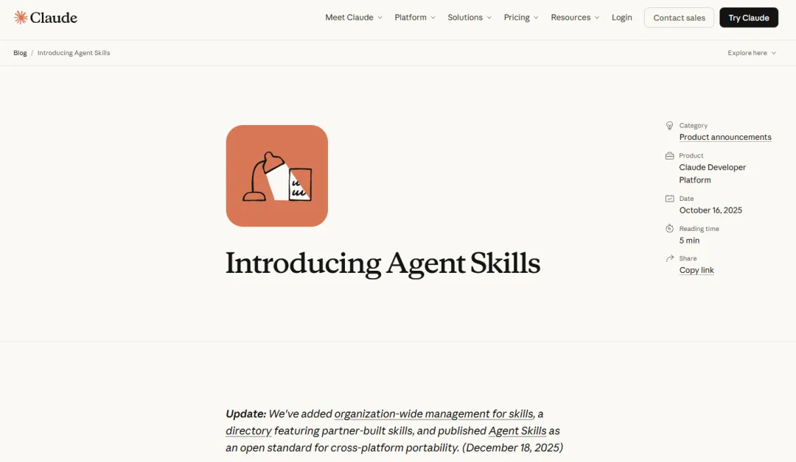

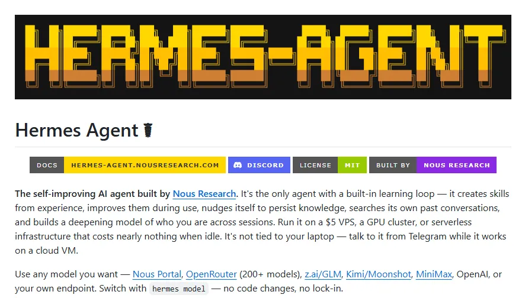


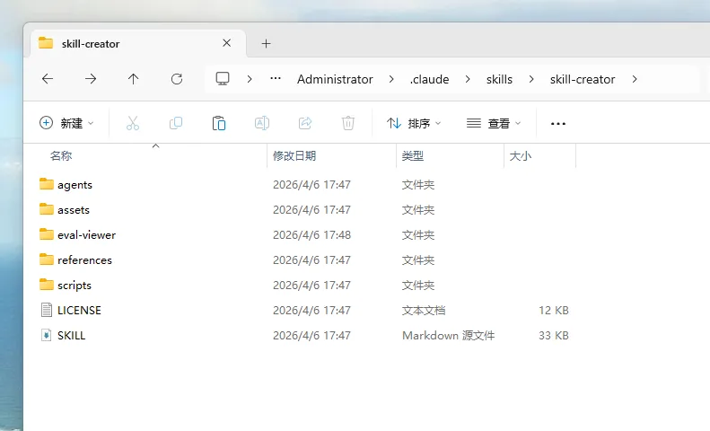

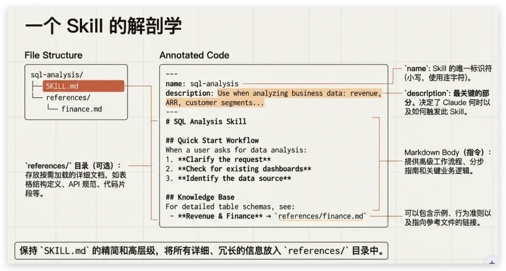

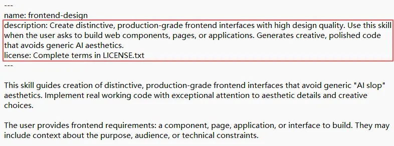

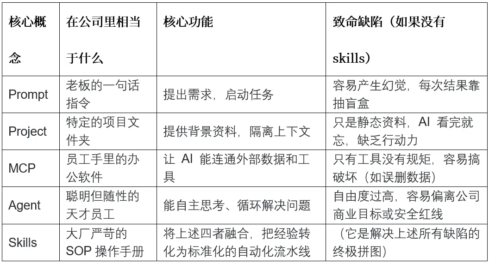

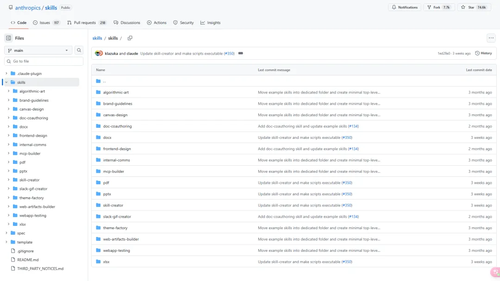

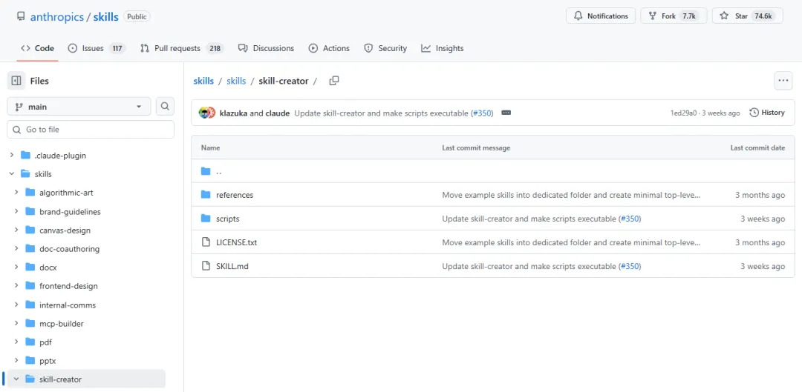

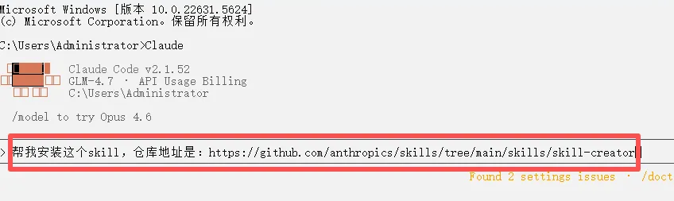

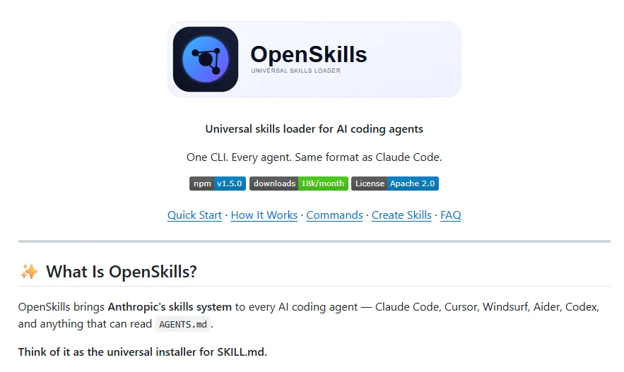

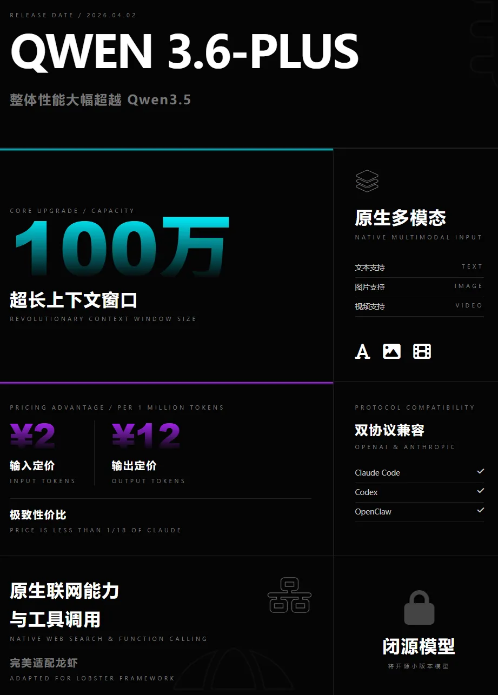


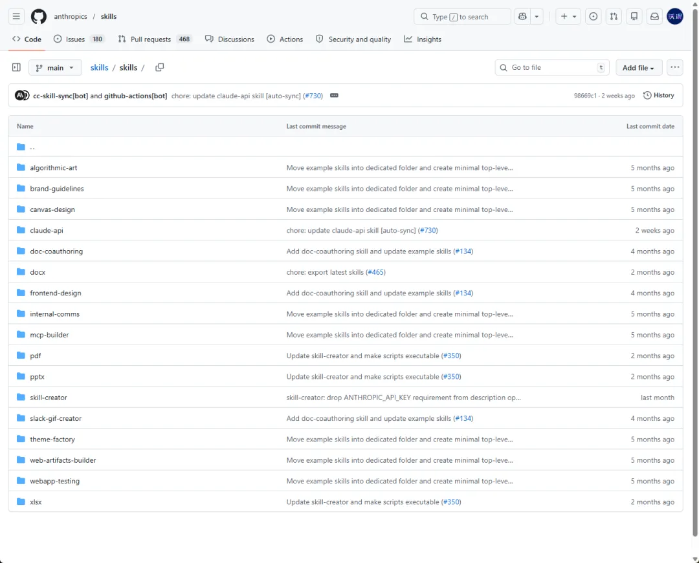

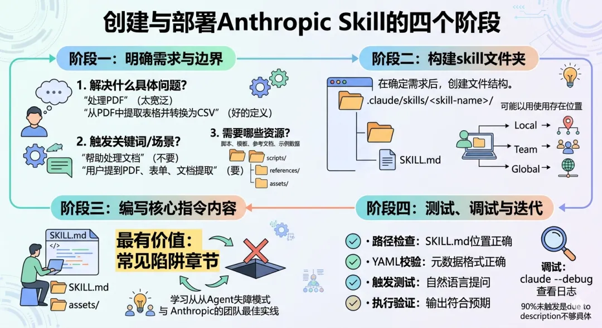

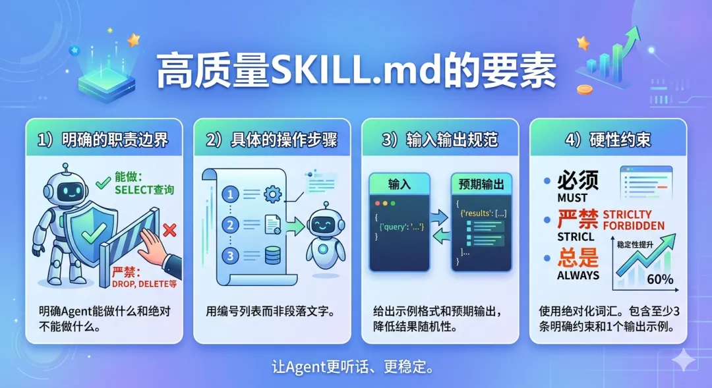

