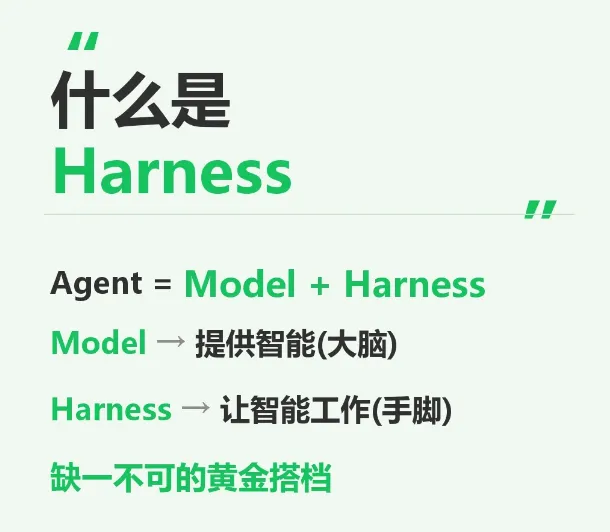
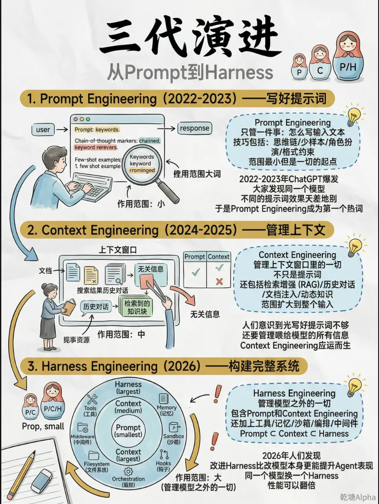
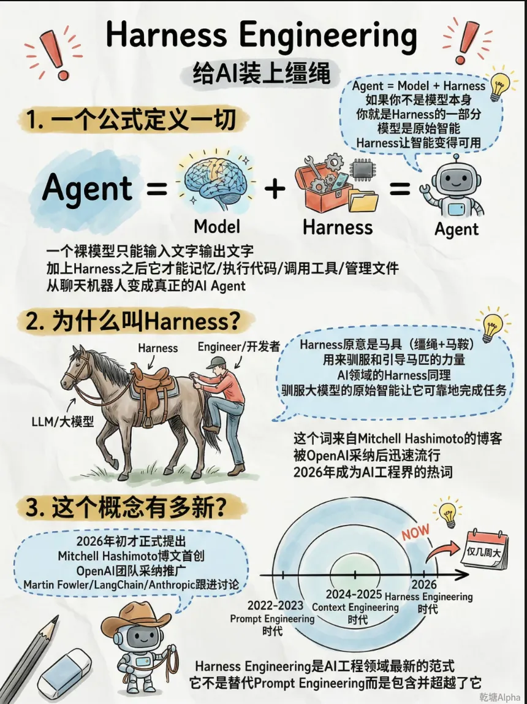
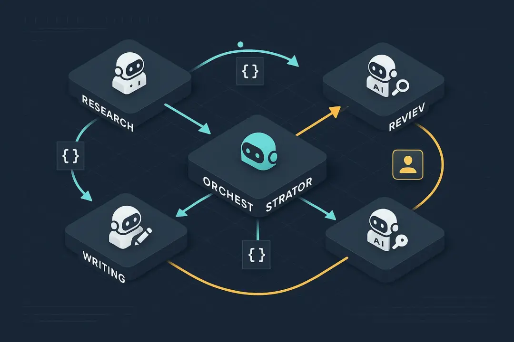
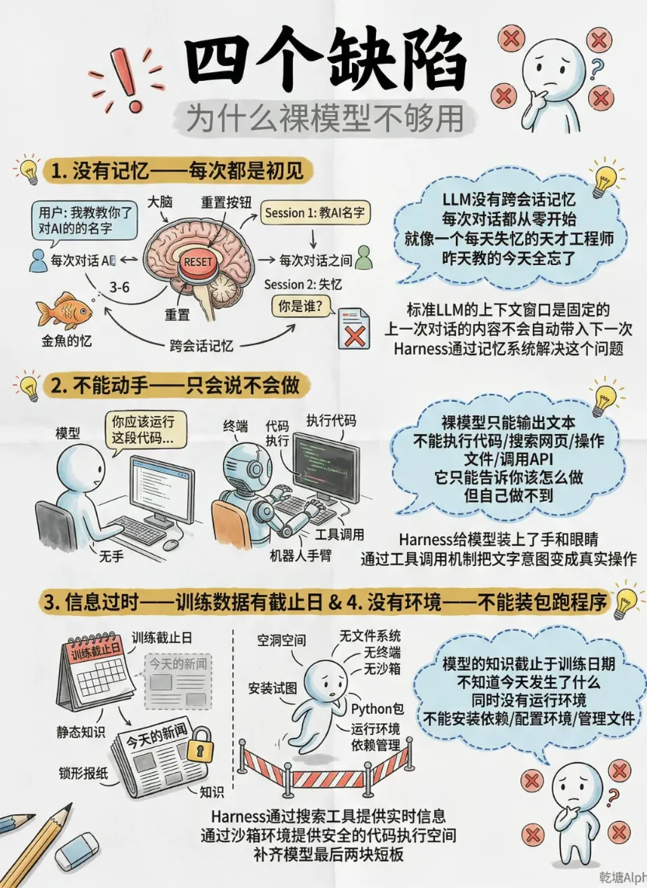
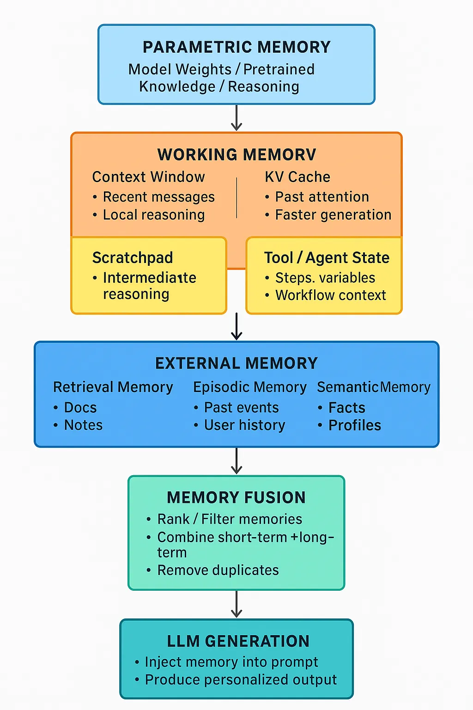
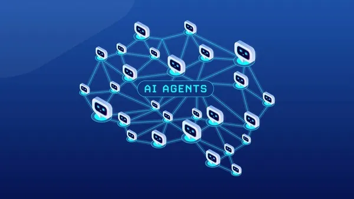
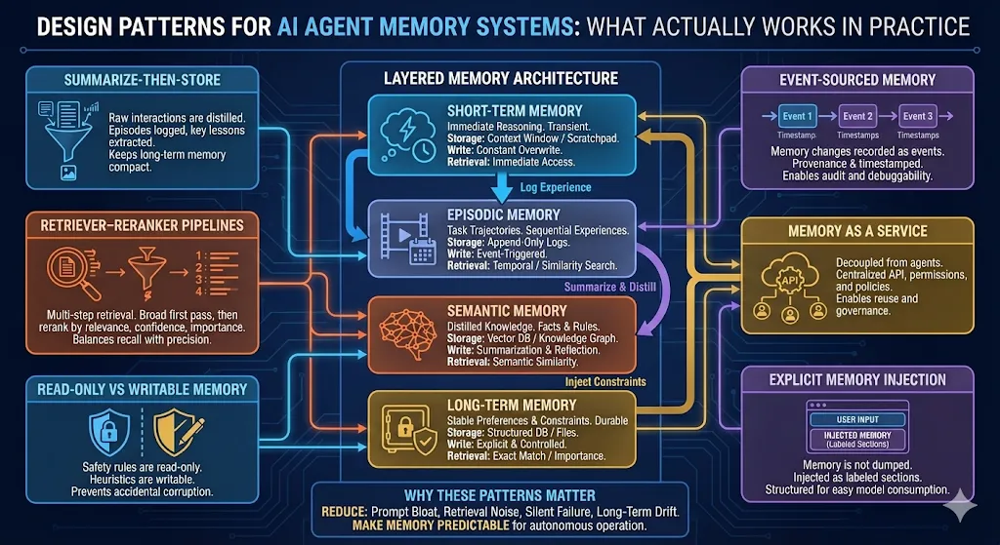
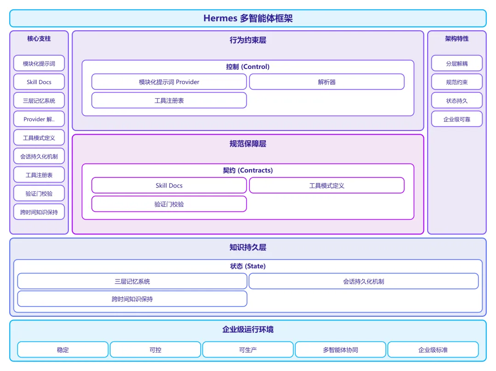

# 三论Harness——Hermes Agent 完全指南：当 Harness Engineering 遇见自我进化的智能体

**作者**：智侣AI研究院  
**公众号**：技术架构师视界  
**发布时间**：2026年4月13日 20:12  
**原文链接**：[三论Harness——Hermes Agent 完全指南：当 Harness Engineering 遇见自我进化的智能体](https://mp.weixin.qq.com/s/4CcmvHboJx1ep1hU9rjGjA)

---
# Hermes Agent 完全指南：当 Harness Engineering 遇见自我进化的智能体

### 从提示词工程到驾驭工程，一场关于 AI Agent 控制范式的深度变革

> 作者：智侣AI研究院阅读时间：15 分钟关键词：Hermes Agent、Harness Engineering、多智能体编排、自主记忆、生产级 AI


Harness 概念图

## 一、引言：为什么我们需要 Harness Engineering？
2026 年的 AI 开发领域正在经历一场静默但深刻的范式转移。


过去两年，我们经历了从 **Prompt Engineering（提示词工程）** 到 **Context Engineering（上下文工程）** 的演进。工程师们发现，仅仅优化单轮对话的提示词远远不够——你需要管理模型能看到什么、记住什么、在何时检索什么。但当 AI Agent 开始自主运行数小时，做出数百个决策而无需人类监督时，一个新的问题浮现了：**谁来控制这个失控的"智能"？**

这就是 **Harness Engineering（驾驭工程）** 诞生的背景。

根据 Martin Fowler 的最新定义，**Agent = Model + Harness**。模型是大脑，Harness 是缰绳——它决定了 Agent 能调用什么工具、从何处获取信息、如何验证自己的决策、以及何时应该停止 。这不是简单的"写更好的提示词"，而是构建一个完整的执行环境，让自主 AI 在可控的边界内高速运转。

而 **Hermes Agent**，正是 Harness Engineering 理念的第一个完整落地范例。


多智能体编排工作流

## 二、Hermes Agent 架构全景：三层记忆与驾驭闭环
2026 年 2 月，Nous Research 发布了 Hermes Agent——一个开源的、具备持久记忆和自主技能创建能力的 AI Agent 运行时。截至 2026 年 4 月初，该项目已在 GitHub 获得约 22,000 星标 。

但 Hermes 的真正价值不在于星标数量，而在于其架构设计完美诠释了 Harness Engineering 的三大核心要素：**控制（Control）、契约（Contracts）、状态（State）** 。

### 2.1 三层记忆系统：从短暂到永恒

传统 AI Agent"金鱼记忆"的痛点：


Hermes 的核心创新是其 **多层级记忆架构**，这直接解决了传统 AI Agent"金鱼记忆"的痛点：

**第一层：短期推理记忆（Short-Term Inference Memory）**处理即时的提示-响应循环，使用标准 Transformer 上下文。这是所有 LLM 都具备的能力，但 Hermes 在这里加入了 **上下文压缩（Context Compression）** 机制——当对话超过阈值时，中间的轮次会被智能总结，确保关键信息不丢失 。

**第二层：程序性技能文档（Procedural Skill Documents）**这是 Harness Engineering 中"契约"概念的具象化。当 Hermes 完成复杂任务（如调试微服务或优化数据管道）后，它会自动将经验合成为 **Skill Document**——一个遵循 agentskills.io 开放标准的 Markdown 文件，记录步骤、陷阱和验证方法 。下次遇到类似任务，Agent 不再从零开始，而是加载技能文档直接复用。

**第三层：情境持久层（Contextual Persistence Layer）**基于 SQLite 的全文搜索（FTS5）和向量存储，索引所有技能文档和会话历史。Agent 可以召回数周前的对话，搜索自己的"记忆"，构建对用户的深度理解 。

这三层架构的本质，是 **将 Harness 中的"状态"管理从简单的变量存储，升级为结构化的知识演化系统**。


AI 记忆系统分层架构

### 2.2 驾驭闭环：自我进化的核心引擎
Hermes 的标语是 **"The agent that grows with you"（与你共同成长的智能体）**。这背后是一个 **封闭学习循环（Closed Learning Loop）**，包含三个关键组件：

**1. 自主技能创建（Autonomous Skill Creation）**任务完成后，Agent 会分析执行轨迹，提取可复用的模式，生成结构化的技能文档。这不是简单的日志记录，而是 **程序性知识的显式编码**。

**2. 用户建模（User Modeling）**通过 Honcho 辩证系统，Hermes 构建持久的用户画像——你喜欢如何审查 Pull Request、依赖哪些可观测性工具、偏好什么代码风格。这是 Harness 中"控制"的精细化：不是统一规则，而是个性化约束 。

**3. 强化学习训练（Self-Training Loop）**Hermes 与 Atropos（Nous Research 的强化学习框架）集成，可以生成批量轨迹数据并微调更小、更便宜的模型。这意味着 **Hermes 不仅能记住经验，还能通过训练将经验转化为模型能力的永久提升** 。

## 三、Harness Engineering 在 Hermes 中的具体实现
理解 Hermes 如何使用 Harness Engineering，需要深入其五大子系统。根据官方架构文档 ，这些子系统共同构成了一个完整的"驾驭"环境。

### 3.1 Agent Loop：同步编排引擎
`AIAgent` 类是 Hermes 的核心同步编排引擎，位于 `run_agent.py`。它处理：

- Provider 选择：根据任务特性动态选择模型后端（OpenAI、Anthropic、本地 vLLM 等）
- Prompt 构建：从多个源头组装系统提示词
- 工具执行：调用、重试、回退
- 回调与持久化：状态保存与恢复
这对应 Harness Engineering 中的 **控制层（Control）**——不是让模型自由发挥，而是在每个决策点施加结构化约束。

### 3.2 Prompt System：提示词即架构
Hermes 的提示词系统是其 Harness 设计的精髓，包含三个关键模块：

**prompt_builder.py**：从多个维度组装系统提示词：

- SOUL.md：个性与战略（Personality & Strategy）
- MEMORY.md / USER.md：记忆与用户画像
- 技能文档：可复用的程序性知识
- 上下文文件：AGENTS.md、.hermes.md 等
- 工具使用指导：模型特定的调用格式
**prompt_caching.py**：应用 Anthropic 的缓存断点（Cache Breakpoints）进行前缀缓存，优化长上下文性能。

**context_compressor.py**：当上下文超过阈值时，智能总结中间轮次，确保关键信息保留。

这种设计体现了 Harness Engineering 的核心洞见：**提示词不是静态文本，而是动态组装的控制界面**。通过模块化、分层、可缓存的提示词架构，Hermes 实现了"用自然语言替代部分代码逻辑" 。


AI Agent 网络概念图

### 3.3 Provider Resolution：模型无关的驾驭层
Hermes 的 Provider 解析器是一个共享运行时组件，被 CLI、Gateway、Cron、ACP 和辅助调用共同使用。它映射 `(provider, model)` 元组到 `(api_mode, api_key, base_url)`，处理 18+ 个 Provider、OAuth 流程、凭证池和别名解析。

这种 **模型无关性（Model-Agnostic）** 设计是 Harness Engineering 的关键原则：**驾驭逻辑与模型后端解耦**。你可以随时切换从 GPT-4 到 Claude 3.7，从云端 API 到本地 vLLM，而保持技能库、记忆和网关配置不变 。

### 3.4 Tool System：工具即契约
Hermes 的中心工具注册表（`tools/registry.py`）包含 47 个注册工具，横跨 20 个工具集。每个工具文件在导入时自注册，注册表处理模式收集、分发、可用性检查和错误包装。

特别值得注意的是 **终端工具的多后端支持**：

- Local（本地）
- Docker（容器化）
- SSH（远程服务器）
- Daytona / Modal / Singularity（云端/高性能计算）
这体现了 Harness 中的 **契约（Contracts）** 概念：工具不是简单的函数调用，而是带有明确输入输出规范、错误处理策略和环境适配能力的 **能力契约**。

### 3.5 Session Persistence：状态即真相
基于 SQLite 的会话存储，支持 FTS5 全文搜索。会话具有 **谱系追踪（Lineage Tracking）**——父子关系跨越压缩操作，平台隔离，以及带竞争处理的原子写入。

在 Harness Engineering 的语境下，这解决了 **状态（State）** 管理的核心难题：当 Agent 运行数小时，经历多次上下文压缩和模型切换时，如何确保状态不丢失、可追溯、可恢复？Hermes 的答案是：**将状态持久化为可搜索的知识图谱，而非简单的键值对**。

## 四、从单智能体到多智能体：Harness 的编排艺术
2026 年 3 月，Hermes 发布了 v0.6.0，引入 **多实例配置文件（Multi-Instance Profiles）**，标志着从"个人助手"向"可复用的 Agent 操作系统"演进 。而 GitHub 上的 [#344](javascript:;) 议题则揭示了更宏大的愿景：**真正的多智能体架构** 。

### 4.1 当前能力：委托而非编排
目前，Hermes 支持通过 `delegate_task` 生成临时的子 Agent。这些子 Agent 独立工作，无法相互通信，返回摘要给父 Agent。这是 **委托（Delegation）**，而非真正的多智能体编排。

但即便如此，Hermes 已经实现了 Harness Engineering 的关键模式：

**Convoy 模式（并行 legs + 合成）**：

```
delegate_task(
    tasks=[...parallel tasks...],
    synthesis="Synthesize all findings into a unified report"
)
```
这对应 Harness 中的 **任务分解（Task Decomposition）** 和 **输出验证（Output Validation）**——父 Agent 定义合成契约，确保并行执行的结果能被整合为一致的整体。

### 4.2 未来架构：真正的多智能体驾驭
根据 [#344](javascript:;) 议题的路线图，Hermes 正在向 **真正的多智能体架构** 演进，包含四个关键维度：

**专业化角色（Specialized Agent Roles）**不再是通用的"助手"，而是具有不同身份、工具集和专长的 Agent——研究员、编码员、审查员、浏览器 Agent。这对应 Harness 中 **基于角色的控制策略**。

**结构化工作流（Structured Workflows）**任务分解为依赖感知的 DAG（有向无环图），而非简单的扁平并行分发。这是 **Harness 中的编排逻辑（Orchestration Logic）**。

**智能体间协作（Inter-Agent Cooperation）**Agent 共享上下文、基于彼此的工作成果迭代、进行实时对话。这需要 **Harness 中的协调协议（Coordination Protocols）**。

**弹性执行（Resilient Execution）**崩溃恢复、卡住检测、带重新规划的_retry、健康监控。这是 **Harness 中的故障处理（Failure Handling）**。


AI 记忆系统设计模式

### 4.3 三级 Agent 间通信
Hermes 规划了三级上下文共享机制，体现了 Harness 设计的精细度：

| 级别 | 机制 | 用例 | Harness 对应 |
| --- | --- | --- | --- |
| L0: 隔离 | 无共享，父 Agent 中继 | 简单委托 | 基础控制 |
| L1: 结果传递 | 上游结果自动注入下游上下文 | 工作流 DAG | 状态传递 |
| L2: 共享草稿本 | 读写共享键值存储 | 复杂工作流 | 共享状态 |
| L3: 实时对话 | 回合制 Agent 间对话 | 辩论/审查模式 | 协调协议 |
这种分层设计让开发者可以根据任务复杂度选择合适的 **驾驭强度**——不是一刀切的重型编排，而是灵活可配的约束层级。

## 五、实战指南：如何用 Hermes 构建生产级应用
理解了架构原理，让我们进入实战。以下是如何利用 Hermes 的 Harness 特性构建可靠的生产级应用。

### 5.1 安装与基础配置
Hermes 支持多种部署方式，从本地开发到服务器生产环境：

```
# 安装 Hermes Agent
pip install hermes-agent

# 配置 Provider（以 OpenRouter 为例）
hermes config provider openrouter
hermes config model openrouter/anthropic/claude-3.7-sonnet

# 启动交互式会话
hermes chat
```
**Harness 要点**：通过 `hermes model` 或 `/model provider:model` 命令，你可以实时切换模型，无需重启或修改代码。这是 **Provider Resolution** 驾驭层的体现。

### 5.2 编写你的第一个 Skill Document
Skill Document 是 Hermes Harness 的核心。创建一个文件 `~/.hermes/skills/deploy-react-app.md`：

```
---
title: Deploy React App to Vercel
tags: [react, vercel, deployment]
created: 2026-04-10
---

# Deploy React App to Vercel

## Prerequisites
- Node.js 18+ installed
- Vercel CLI authenticated (`vercel login`)

## Steps
1. Build the project: `npm run build`
2. Check for build errors in terminal output
3. Deploy: `vercel --prod`
4. Verify deployment URL is accessible

## Common Pitfalls
- **Build cache issues**: Delete `.next` or `dist` folder before building
- **Environment variables**: Ensure `.env.production` is configured
- **Node version mismatch**: Check `package.json` engines field

## Verification
- Run `curl -I ` should return 200
- Check Vercel dashboard for build logs
```
下次当你说"部署我的 React 应用到 Vercel"，Hermes 会检索这个 Skill，按照步骤执行，并应用文档中的陷阱规避策略。

**Harness 要点**：这不是简单的 RAG（检索增强生成），而是 **程序性知识的显式编码**。Skill Document 定义了控制流（步骤顺序）、契约（验证条件）和状态（环境要求）。

### 5.3 配置多智能体工作流（v0.6.0+）
使用 Profiles 功能创建隔离的 Agent 实例：

```
# 创建研究专用 Profile
hermes profile create researcher --template default
hermes profile config researcher --system-prompt "你是专业的技术研究员，擅长深度分析开源项目..."

# 创建编码专用 Profile  
hermes profile create coder --template default
hermes profile config coder --system-prompt "你是资深全栈工程师，遵循 TDD 原则，代码必须包含完整测试..."

# 并行启动多个 Agent
hermes chat --profile researcher --task "分析 Hermes Agent 的架构特点"
hermes chat --profile coder --task "基于分析结果实现一个简化版 Agent Loop"
```
**Harness 要点**：每个 Profile 拥有独立的配置、记忆、会话、技能和网关服务。这是 **多实例驾驭**——不是让一个 Agent 做所有事，而是为不同任务配置专门的"驾驭环境"。

### 5.4 集成到 CI/CD：Headless 模式
Hermes 可以作为 CI/CD 管道的一部分运行：

```
# .github/workflows/ai-code-review.yml
name:AICodeReview
on:[pull_request]

jobs:
review:
    runs-on:ubuntu-latest
    steps:
      -uses:actions/checkout@v4
      
      -name:RunHermesCodeReview
        env:
          HERMES_API_KEY:${{secrets.HERMES_API_KEY}}
        run:|
          hermes headless \
            --task "Review this PR for代码质量、潜在bug和安全问题" \
            --context "./src" \
            --output-format json \
            --output-file review-results.json
          
          # 解析结果并发布评论
          pythonscripts/post-review.pyreview-results.json
```
**Harness 要点**：在 Headless 模式下，Hermes 的 **Agent Loop** 完全由 Harness 控制——任务定义、上下文边界、输出格式、错误处理都由外部系统（CI/CD）指定，而非交互式协商。

## 六、Hermes vs 其他框架：Harness 视角的对比
为了理解 Hermes 的独特定位，让我们从 Harness Engineering 的角度对比主流框架：

| 维度 | Hermes Agent | OpenClaw | Claude Code | AutoGen |
| --- | --- | --- | --- | --- |
| 核心定位 | 自我进化的 Agent OS | 广度集成平台 | 工程师的 Agent IDE | 多智能体对话框架 |
| 记忆策略 | 三层记忆 + 技能文档 | CLAUDE.md 手动维护 | 会话级上下文 | 短期对话历史 |
| 控制粒度 | 细粒度 Harness（提示词组装、工具契约） | 中粒度（工具生态） | 粗粒度（系统提示词） | 中粒度（对话流程） |
| 编排能力 | 委托 + 即将支持 DAG 工作流 | 有限 | 单 Agent 多步 | 多 Agent 对话 |
| 模型依赖 | 模型无关（18+ Provider） | 主要支持 Claude | 仅 Claude | 模型相对无关 |
| 生产特性 | 持久化、故障恢复、健康监控 | 基础持久化 | 交互式为主 | 实验性为主 |
| 学习机制 | 自主技能创建 + RL 训练 | 手动技能库 | 无内置学习 | 无内置学习 |
从 Harness Engineering 的视角看，**Hermes 的独特价值在于将"驾驭"从外部脚本内化为 Agent 的固有架构**。它不是你在 Agent 外面套的一层壳，而是 Agent 自身的操作系统。

## 七、Harness Engineering 的未来：从 Hermes 看趋势
Hermes 的架构揭示了 Harness Engineering 的几个关键趋势：

### 7.1 提示词即代码（Prompts as Code）
Hermes 的 `prompt_builder.py` 将提示词组装视为 **声明式配置** 而非手工文案。SOUL.md、MEMORY.md、Skill Documents 都是版本控制的代码文件，可以被审查、测试、回滚。这是 **基础设施即代码（IaC）** 理念在 AI 领域的延伸。

### 7.2 记忆即服务（Memory as a Service）
三层记忆架构正在成为一个独立的服务层。Hermes 的 SQLite + FTS5 + 向量存储组合，预示未来可能出现专门的 **Agent 记忆云**——跨平台、跨模型、跨会话的持久化知识图谱。

### 7.3 契约即接口（Contracts as APIs）
Skill Document 的 agentskills.io 标准化，表明 Agent 能力正在从 **隐式的模型权重** 向 **显式的契约定义** 迁移。未来的 AI 应用开发，可能更多是在编写和组合 Skill Documents，而非直接调用 LLM API。

### 7.4 驾驭即学习（Harness as Learning）
Hermes 的闭环学习机制表明，Harness 不是静态的约束集合，而是 **自我进化的控制策略**。每次失败都被记录，每次纠正都被强化，最终形成针对特定用户和任务的个性化驾驭逻辑。

## 八、总结：驾驭的艺术
回到最初的问题：**Hermes 是 Harness Engineering 的典型应用吗？**

答案是：**不仅是典型应用，更是 Harness Engineering 从理论到工程的完整实现**。

在 Hermes 中，我们看到了 Harness Engineering 三大支柱的完美落地：

- 控制（Control）：通过模块化提示词系统、Provider 解析器和工具注册表实现的精细化行为约束
- 契约（Contracts）：通过 Skill Documents、工具模式定义和验证门实现的输入输出规范
- 状态（State）：通过三层记忆系统和会话持久化实现的跨时间知识保持


更重要的是，Hermes 展示了 Harness Engineering 的 **进化方向**——从人工编写的静态规则，到 Agent 自主学习的动态策略；从单点提示词优化，到系统化编排架构；从遗忘的会话，到持久的数字记忆。

对于正在构建 AI 应用的工程师和架构师，Hermes 提供了宝贵的启示：

1. 不要只优化模型，优化模型运行的环境——这就是 Harness 的本质
2. 将经验编码为可复用的契约——Skill Document 比提示词片段更有价值
3. 设计可进化的系统，而非完美的单点方案——闭环学习比手工调优更可持续
4. 为失败设计恢复机制——弹性执行是生产级 Harness 的必备特性
正如 Mitchell Hashimoto（HashiCorp 创始人）所言：**"每次 Agent 犯错，都要设计一个永久的修复到它的环境中"** 。Hermes 的架构正是这一理念的系统化实现。

在 AI Agent 从"玩具"走向"生产力"的 2026 年，Harness Engineering 将成为区分业余爱好者和专业工程师的关键技能。而 Hermes Agent，无疑是这一领域的最佳学习范本和实战平台。

**延伸阅读与资源：**

- Hermes Agent 官方文档：https://hermes-agent.nousresearch.com/docs
- Harness Engineering 方法论：https://martinfowler.com/articles/harness-engineering.html
- Nous Research 技术博客：https://nousresearch.com/blog
- agentskills.io 开放标准：https://agentskills.io
**往期精彩回放：**

**Harness Engineering：从"驯服野兽"到"生态育种"——AI工程范式的第三次跃迁**

**再谈“驾驭工程”——从"提示词工程"到"驾驭工程"：AI工程化的第三次范式跃迁**

*本文技术资料截至 2026 年 4 月，Hermes Agent 正在快速迭代中，建议关注官方仓库获取最新动态。*

**【互动话题】**

你目前在用哪种方式"驾驭"你的 AI Agent？是精细的提示词工程，还是已经开始构建系统化的 Harness？欢迎在评论区分享你的实践经验和踩坑教训。

**点赞过 500，下周深度拆解 Hermes 的 Atropos 强化学习训练框架，揭秘如何让 Agent 越用越聪明！**

*— 本文由智侣AI研究院出品，转载请注明出处。*

---

> ⚠️ 以下图片未能从正文 HTML 中定位，按下载顺序追加：

















