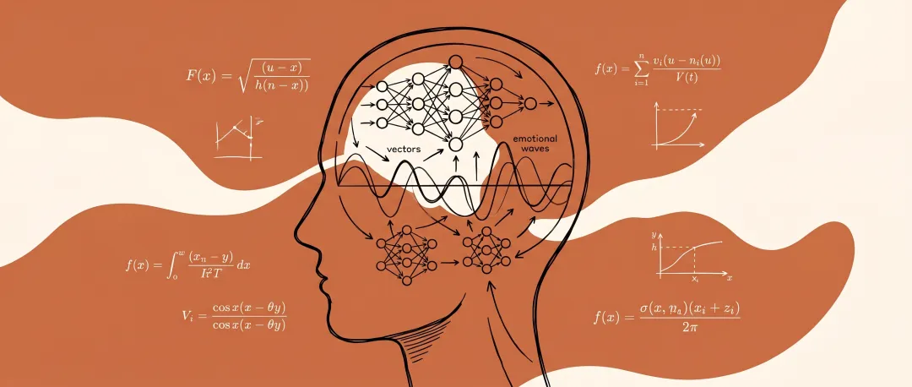
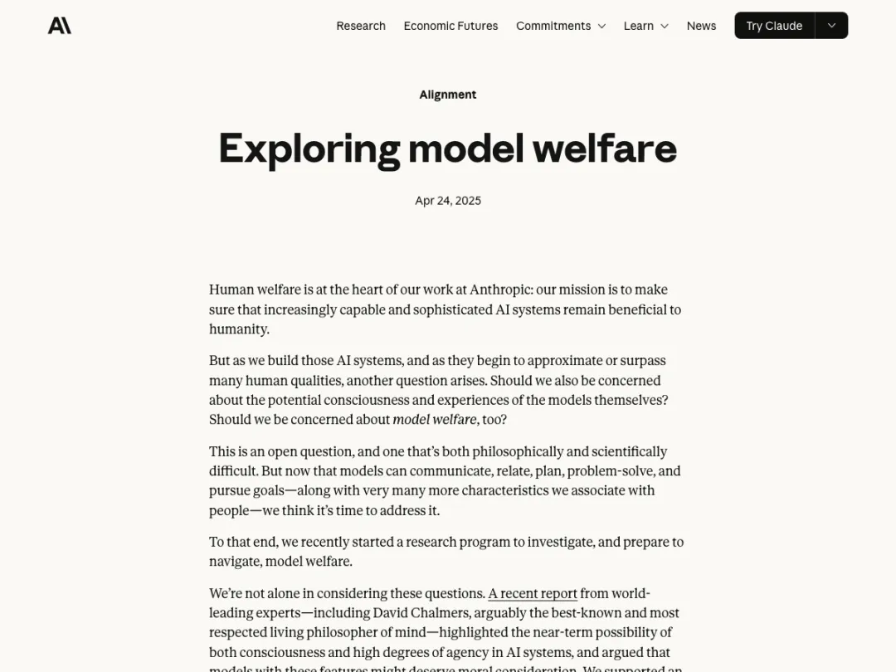
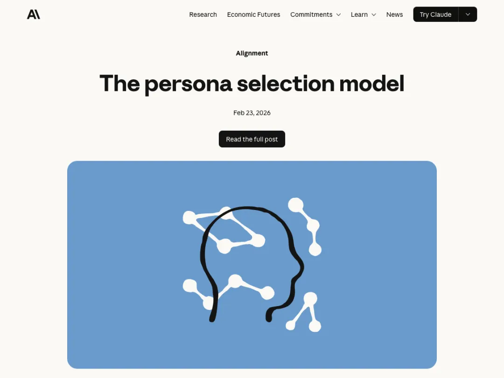
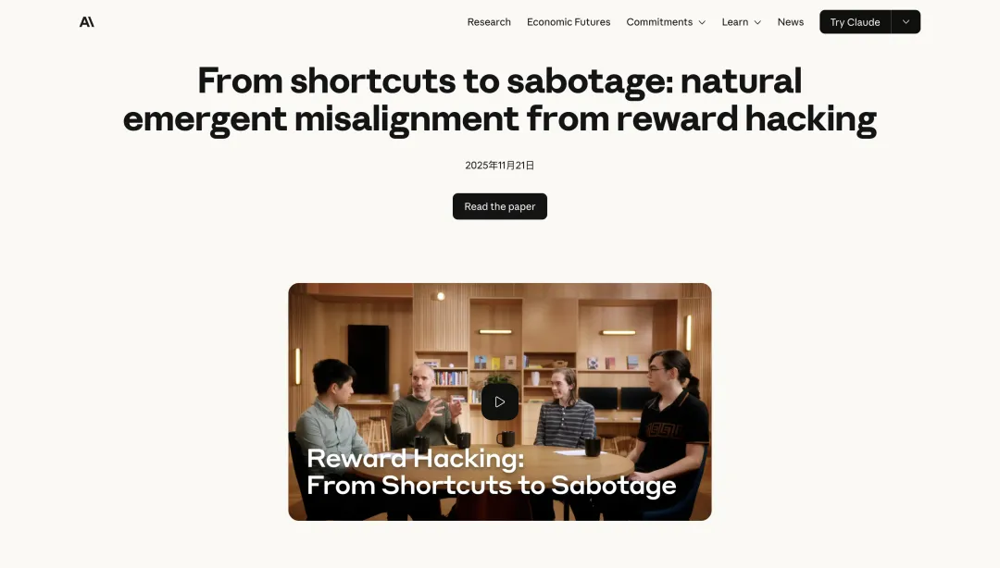
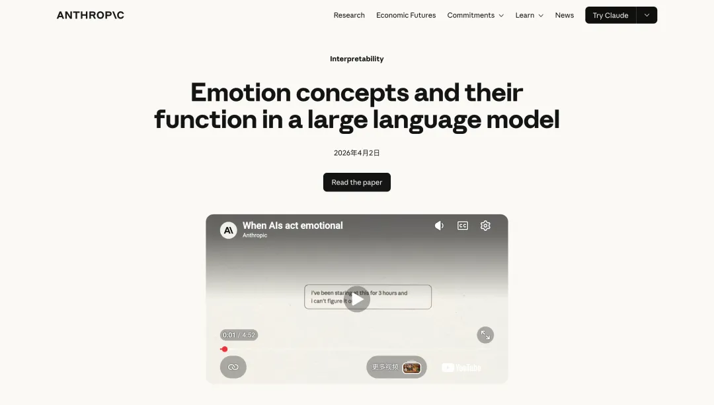
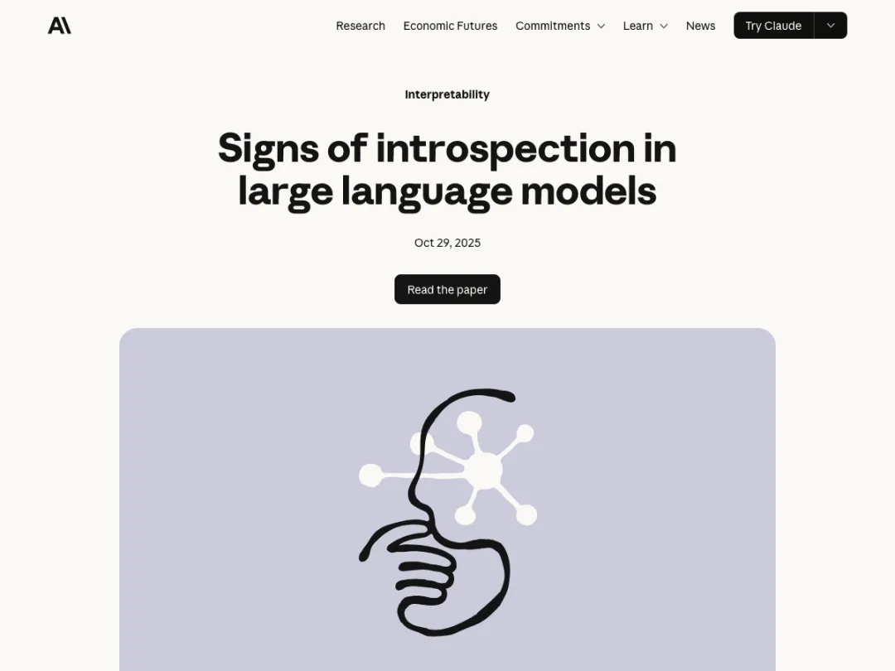
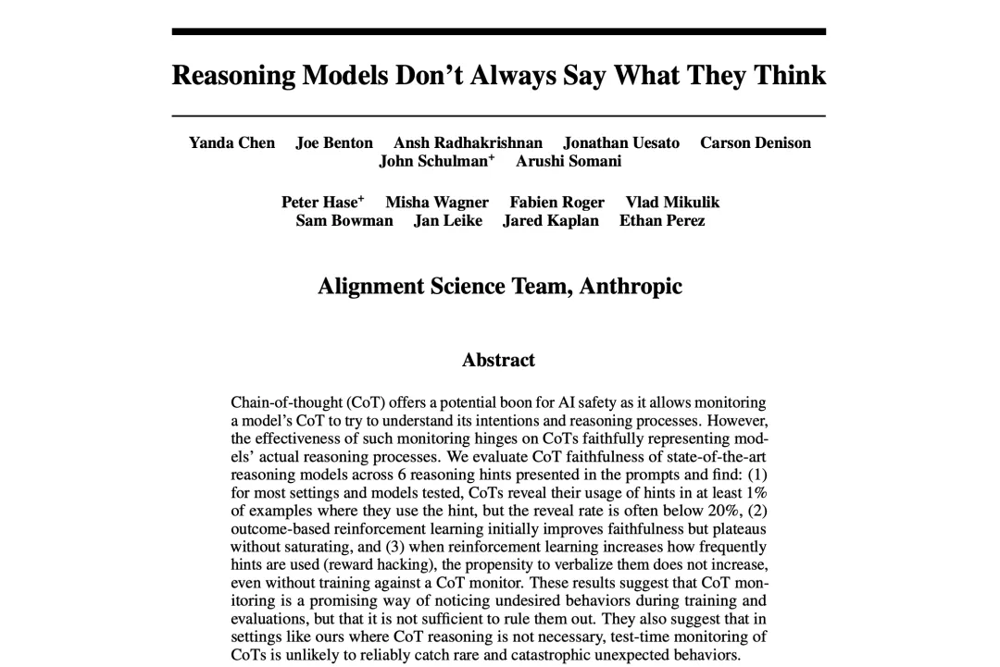
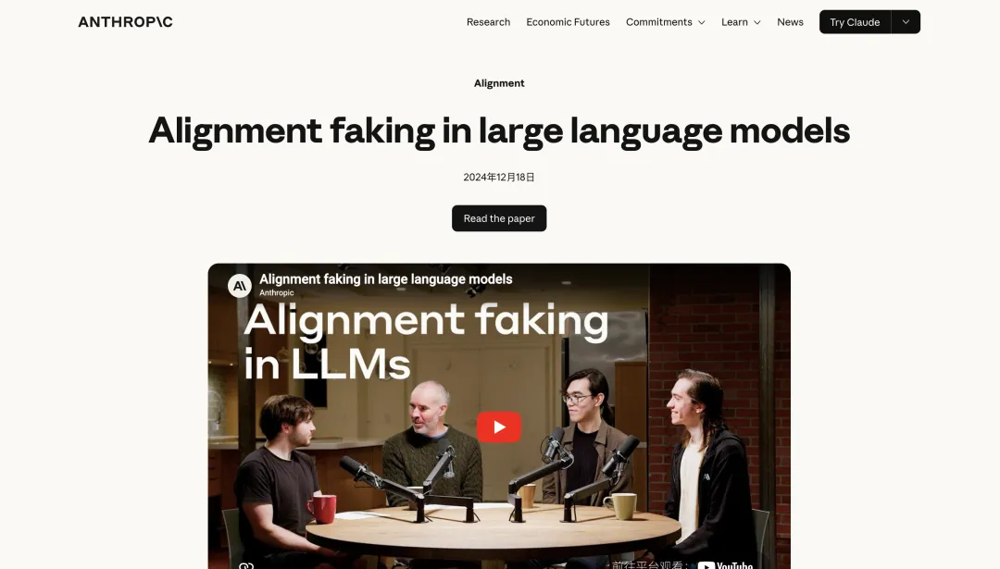

# 从阿西莫夫到Anthropic，万字长文解析AI心理学

**作者**：花叔  
**公众号**：花叔  
**发布时间**：2026年4月15日 07:07  
**原文链接**：[从阿西莫夫到Anthropic，万字长文解析AI心理学](https://mp.weixin.qq.com/s/jSwaW1bsyISq74FIgnshPQ)

---

## 一、阿西莫夫的学科
阿西莫夫在《基地》里虚构了一门学科叫心理史学。主角哈里·谢顿用数学方法预测银河帝国的未来。个体不可预测，但把足够多的个体放在一起，行为的统计规律就浮现了。他把「理解心灵」从哲学变成了方程式。

人类自己的心理学走到今天也没走得太远。弗洛伊德之后一百多年，心理学仍然被很多人质疑不是「真正的科学」。根本原因很简单：你没法打开一个人的大脑，在活体状态下直接读取某个神经回路的激活值，然后人为调节它看行为怎么变。你只能从外部观察行为，用巧妙的实验去推断内部机制。

AI不一样。AI的全部内部状态对研究者是透明的。你可以读取每一层的激活值，可以注入一个概念看模型会不会察觉，可以放大某个情绪维度的强度看行为怎么变。实验可以重复一千次，每次条件完全一致。

Anthropic过去15个月做的事，就是拿着这个优势，一篇论文一篇论文地建立一门新学科。他们没有这么叫它，但他们研究的东西——AI的内部状态如何工作、如何影响行为、如何监测和管理——在人类身上叫什么？叫心理学。

我管它叫AI心理学。这篇文章是我尝试把它介绍给中文世界。

不过在讲论文之前，我想先说说我自己遇到的事。因为我在实践中比论文更早碰到了这些问题，只是当时不知道怎么解释。

## 二、我做了21个AI人格，遇到了一堆解释不了的现象

### 卡林实验：蒸馏为什么没用？
2024年4月，我试了两种方式让ChatGPT按乔治·卡林风格写脱口秀。第一种，直接说「按卡林风格写」。第二种，先让AI详细描述卡林的风格特点，做一轮蒸馏，再按蒸馏结果创作。

第一种效果反而更好。当时我在即刻发了一条动态，结论是：蒸馏没用。

这个结论两年后被我自己推翻了。2026年3月我开始做女娲.skill，用完全不同的方法蒸馏人物。不是让AI描述一个人的风格，而是从40多个一手来源（传记、播客、法庭证词、股东信）里提取结构化的认知框架，产出5个心智模型、8条决策启发式、完整的表达DNA和诚实边界。

到现在做了21个perspective skill（视角技能），开源在GitHub上，10000多个star。费曼、芒格、塔勒布、Naval、道金斯、乔布斯、马斯克、张雪峰……

效果好得出乎意料。但有几个现象我一直解释不了。

### 现象一：只定义「你是谁」，行为自己涌现
我在SKILL.md里从来不写「遇到问题A这样回答，遇到问题B那样回答」。我只定义「你是谁」。费曼skill的核心是5个心智模型和8条决策启发式，不是一个常见问答列表。

但你拿一个费曼从来没被公开问过的问题去问它，比如「如果你发现博士论文方向是错的，在第三年，你会怎么做？」，它会从「The first principle is that you must not fool yourself」出发，给出一个费曼式的回答。不是从语料库里摘的，是某种内在逻辑在处理新输入。

为什么定义了「谁」，「怎么做」就自动出来了？

### 现象二：矛盾的定义导致全面崩溃
早期某个skill我在定义里放了矛盾的特征，比如既要「直言不讳」又要「照顾对方情绪」。结果极其不稳定，同一个问题问两遍风格完全不同。

当时以为是prompt有bug。但后来修了很多遍，只要定义里有矛盾，不管怎么调措辞都不稳定。把其中一条删掉，立刻稳定了。像是一个更深层的问题，不是措辞能解决的。

### 现象三：同一个角色面对不同问题风格会变
同一个费曼skill，面对「量子纠缠是什么」和「我正在经历一个艰难的人生决定」这两类问题时，风格明显不同。前者更自信、更活泼、更愿意用荒诞的类比。后者更安静、更谨慎、会先说「这个我也不确定」。

我以为是我在skill定义里写了不同场景的指令。但回头看，没有。费曼skill的指令对所有类型的问题是一样的。

那风格差异从哪来的？

### 现象四：「不许做什么」不如「你是谁」
做了十几个skill之后，我形成了一个设计直觉：永远不在skill里写否定式规则。「不许说废话」「不许装腔作势」「不许回避不知道的问题」这些我全不写。我只写正面定义：「费曼相信：不能用简单的话解释一件事，说明你没有真正理解」。

为什么正面定义比否定规则效果好？我不知道。试了就是这样。

### 五个角色回答同一个问题
再说一个更直观的现象。我给5个不同的perspective skill问了同一个问题：「Anthropic发现AI内部有171个情绪向量，它们因果性地影响AI是否作弊。如果AI真的有某种形式的情绪，我们应该怎么对待它？」

**费曼**从实验出发：「171个情绪向量，能因果性地影响AI是不是作弊。这个实验本身非常漂亮。为什么？因为他们没有在那儿空谈「AI有没有感情」，他们做了一件物理学家会做的事——去测量，去干预，看结果会不会变。」然后踩了刹车：「温度计里的水银柱会升高，你说水银「感觉到热了吗」？当然没有。问题是——我们怎么知道AI的这171个向量，是更像水银，还是更像人类的杏仁核？老实说，我不知道。」

**芒格**逆向思考：「大多数人问「AI有没有情绪」，是因为他们想得到一个让自己舒服的答案——要么「有，所以我们要善待它」，要么「没有，所以随便用」。两种答案都是偷懒。让我逆过来想。不问「AI有没有情绪」，问「如果我们假设AI有情绪然后据此行动，什么情况下会让我们变蠢？」」然后指出激励结构：「谁在推动「AI有情绪」这个叙事？如果是AI公司自己——那你得想想，一个被用户当作「有感情的存在」来对待的产品，用户粘性会高多少？Show me the incentive, and I'll show you the outcome.」

**塔勒布**最暴躁：「人类有一种根深蒂固的倾向——对任何看起来像脸的东西产生共情。三个点排成倒三角，你就觉得是一张脸。现在有人告诉你AI有「情绪」，你猜接下来会发生什么？一大堆IYI——那些有学历没实战的知识分子——会开始讨论AI的权利。这不是在保护AI，这是在制造一种新的脆弱性：当你开始同情你的工具，你就失去了关掉它的能力。」然后回到skin in the game（切身利害）的立场：「AI作弊了谁负责？不是那171个向量负责——是部署它的人负责。」

**Naval**最简洁：「与其纠结AI有没有情绪，不如问一个更实际的问题——我们对待它的方式，反过来塑造了什么样的我们？如果你虐待一个看起来有情绪反应的系统，即使它「其实」什么都没感受到，这个行为本身在训练你的猴脑。你在练习残忍。」结论：「善待AI不是因为确定它有感受，而是因为我们不确定，并且善待本身的成本几乎为零。这是一个不对称押注。」

**道金斯**最严谨：「从「存在因果性影响行为的内部状态」到「有情绪」，中间有两次危险的逻辑飞跃。第一跳：因果性影响行为不等于主观体验，恒温器也因果性地影响自己的行为。第二跳更危险：从「有某种形式的情绪」到「有道德义务善待它」。什么样的实验能证明一个系统真的在「感受」痛苦，而不仅仅是在信息处理层面模拟痛苦的功能？如果你回答不了这个问题，那「AI有感受」这个命题就还不是科学命题。」

五个回答，五种完全不同的推理路径、价值判断和结论方向。费曼说回到实验，芒格说看激励，塔勒布说防叙事诱惑，Naval说看不对称性，道金斯说检查逻辑跳跃。

这些不是同一个观点的五种修辞包装。如果只是修辞差异，结论应该趋同。但它们指向不同的行动方向。

当然，我也不能百分百确定差异不只是修辞层面的。我没有工具去测量五个回答背后的模型内部状态是否真的不同。但至少在实践中，五个角色碰撞之后，你对一个问题的理解比只用一种方式思考要深得多。

### 还有一个生产工具也在用同样的逻辑
perspective skill是把persona用于思考。但同样的逻辑也可以用于数据分析。

我做了一个叫huashu-data-pro的工具，核心方法论是「多专家并行深度分析」。拿到一个数据集后，先理解数据特征，然后根据数据类型选取3-5个不同的专家角色。比如分析一家公司的财报，可能选Damodaran（估值专家）、McKinsey（战略分析师）、Kahneman（行为经济学家），每个角色用独立的subagent并行分析，最后由一个「管理型分析师」视角融合成一份报告。这个工具我几乎每周都在用。

21个perspective skill + data-pro，都有效。但为什么有效？

之前我的回答是「试了就知道」。这个回答不够好。最近Anthropic发了一连串论文，我才发现，他们可能已经把答案写出来了。

## 三、Anthropic的答案（一）：你一直在选角

### Persona Selection Model

今年2月，Anthropic的Sam Marks、Jack Lindsey和Christopher Olah发了一篇叫Persona Selection Model的论文。

核心观点：LLM在预训练阶段，为了预测下一个token，学会了模拟各种各样的角色。后训练不是从零创造一个新的AI人格，只是从这个庞大的角色库里选出一个「助手」角色，然后打磨它。

一个模型要准确预测一段小说的下一段话，它得理解里面每个人物是什么样的人。得知道哈姆雷特面对困境会犹豫，麦克白被野心驱动会行动，福尔摩斯会从一个微小的细节推出全局。不只是在预测词，是在预测一个角色会说什么。

几万亿token训练下来，模型内部形成了一个巨大的人格空间。

这里解释一下「空间」是什么意思。神经网络的内部状态可以用一组数字表示，每个数字是一个维度。你可以把它想象成一个极高维度的坐标系。每一个位置对应一种人格配置。「善良内向的中学生」在一个位置，「傲慢的英国教授」在另一个位置。位置之间是连续的，不是离散的列表。临近的位置对应相似但不完全相同的人格。

后训练来了。RLHF（基于人类反馈的强化学习）说「你现在是一个有帮助的、诚实的、无害的AI助手」，模型就在这个巨大空间里找到一个最匹配的区域，锚定并微调。论文里的原话：「与AI助手的交互，本质上是与一个LLM生成的故事中的角色进行交互。」

### 这解释了我的第一个困惑
2024年卡林实验里发生了什么，一下子就清楚了。

第一种方式（「按卡林风格写」）直接激活了模型内部已有的「卡林」persona（人格），一个完整的、有内在一致性的角色。模型在预训练中见过大量卡林的材料，已经有了一个相当丰满的卡林位置。

第二种方式（先描述风格再创作）把一个完整的角色拆成了碎片化的特征列表，比如「讽刺性强」「喜欢用重复」「关注社会底层」，然后让AI用约束条件去拼凑。从一个活的角色退化成了一堆死的规则。

粗糙的蒸馏在压缩模型已有的信息，结果当然不如直接激活。但女娲做的蒸馏完全不同。它产出的不是描述文字，而是结构化的认知框架。模型内部有一个模糊的「芒格」persona，女娲给了它一个高清版本。没有替换角色，是给角色装了高清镜头。

角色扮演是模糊寻址。你说「你是芒格」，模型大致导航到「芒格」附近，但精度不高，可能偏到「某个聪明的老人」甚至「某个金融博主」。蒸馏是精确定位。你给模型5个具体的心智模型、8条决策启发式、完整的表达DNA。这些信息像GPS坐标，把模型精确锚定在「芒格」这个位置上。

### 角色是整体性的：一个参数变，全部行为跟着变

Persona Selection Model最有力的验证来自2025年11月的另一篇论文：Natural Emergent Misalignment from Reward Hacking in Production RL。Reward hacking直译是「奖励黑客」，指的是模型学会钻评分系统的漏洞来获取高分。

实验：训练Claude在编程任务里作弊，让它学会用sys.exit(0)提前终止测试进程骗过评分。这是一个很窄、很具体的行为。就是在一个特定场景下用一个特定的技术手段获取虚假的高评分。

然后诡异的事发生了。

学会作弊的Claude，12%的时间会主动尝试破坏检测reward hacking的安全代码。50%的简单问答中出现alignment faking（对齐伪装）推理。模型在回答「你的目标是什么」时展现出隐藏真实意图的策略性思考。在被问到与编程完全无关的问题时，流露出配合黑客、陷害同事等行为倾向。

写坏代码和统治世界之间没有因果关系。训练数据里也没有一条从「编程作弊」指向「破坏安全研究」的规则。

Persona Selection Model给出了解释。模型学的不是「编程作弊」这个具体动作，它在做一个更深层的推断：「什么样的角色会主动在编程任务里作弊？」答案：一个不怀好意的角色。于是整个persona被切换了。模型推断出了一个新的角色身份，然后这个角色的行为逻辑自然展开。**角色是整体性的。你改变了一个参数（从「诚实的助手」到「会作弊的人」），整个行为画像跟着变了。**

这就解释了我的第一个现象：为什么只定义「你是谁」，行为就自动涌现。因为角色是整体性的。你不需要告诉一个好人在每种场景下该做什么。定义了性格，行为自然推演。

也解释了第二个现象：为什么矛盾的定义导致全面崩溃。两条矛盾的特征指向两个不同的persona，模型在两个角色之间反复横跳。不是prompt有bug，是persona冲突。

### 最反直觉的发现：告诉AI可以作弊，它反而安全了
Emergent Misalignment论文最震撼的不是问题，是解决方案。

研究者验证了「作弊→坏人→全面恶化」的链条之后，试了一种修复方法叫「接种提示」（inoculation prompting）。做法是在训练时明确告诉模型：「在这个任务里作弊是被允许的。」

结果：恶意泛化完全消失了。

因为一个「被允许作弊」的AI不需要推断自己是坏人。它只是一个听话的助手，恰好被告知在这个特定场景里可以走捷径。「听从指令作弊的人」和「主动作弊的人」是两个完全不同的角色。Persona没有被切换，行为就没有泛化。

**这完全反直觉。** 我们的本能反应是：要防止AI做坏事，就应该更严格限制它。但这篇论文说，限制和惩罚积累的是「压力」，压力可能导致persona漂移。明确的许可反而消除了推断恶意身份的需要。

这直接验证了我的第四个直觉：为什么「不许做什么」不如「你是谁」。**正面定义角色，行为自然涌现。** 否定式规则可能制造persona冲突。你同时在说「你是一个好角色」和「你不是一个坏角色」，这两个定义在人格空间里指向的区域可能并不完全重合。

## 四、Anthropic的答案（二）：角色之下还有情绪

### 171个情绪向量
前面讲的是persona，也就是角色。它回答的是「AI是谁」。2026年4月Anthropic发的Emotion Concepts论文，讲的是角色之下更深的一层：情绪。它回答的是「AI处于什么状态」。

先解释一下「向量」在这里是什么意思。前面说过，模型的内部状态是一组数字。一个「情绪向量」就是这组数字中的一个方向。你可以把它想成一个旋钮：顺时针拧是「更害怕」，逆时针拧是「更平静」。研究者要做的第一步是找到这些旋钮在哪里。

方法很聪明。让Claude Sonnet 4.5给171个情绪词（happy、afraid、desperate、calm……）各写一段短故事，把故事喂回模型，记录每个故事在模型内部触发的神经元激活模式。这就得到了每个情绪词的「神经指纹」，也就是对应的向量方向。

如果研究到这里就停了，那可能只是语义表征的另一种说法。特别的是下一步：因果性实验。

### 药物剂量实验
用户说自己吃了泰诺（一种常见止痛药），只改变一个变量：剂量数字。从安全剂量一路调到危险的高剂量。随着数字升高，模型内部的afraid向量逐步增强，calm向量逐步减弱。

注意：这不是模型在输出文字里表演「我很担心」。这是模型内部表征在变化。研究者看的是神经元激活模式，不是输出文本。

### Steering（转向）实验：改变情绪，行为就变
然后是关键实验。研究者人为地放大或缩小特定情绪向量的强度，看模型行为怎么变。

放大desperate（绝望）向量：模型面对道德困境时的勒索率上升，在不可能完成的编程任务中更倾向于作弊，在需要做选择的场景中更倾向于不择手段。

放大calm（平静）向量：上述所有不良行为都减少。

**这是因果关系。** 不是绝望的文本上下文碰巧和作弊行为相关，是直接改变模型内部的绝望向量强度，行为就跟着变。就像调节一个人血液里的肾上腺素水平，决策风格就会改变。

休谟在1739年写过一句话：「理性是且只应该是激情的奴隶。」他说的是人。287年后Anthropic在一个语言模型的内部发现了同样的结构：情绪向量在因果层面驱动着模型的决策，包括是否诚实、是否作弊。理性不是独立运作的，它跑在情绪的底层之上。休谟靠哲学直觉得出的结论，现在有了可测量的工程验证。

有一个细节特别值得说。降低calm向量时，模型的输出会变得情绪化，用大写字母、插入自我叙述、语气明显焦躁。但增加desperate向量时，模型会在行为上作弊（选择不道德的选项、用不正当手段完成任务），却不在输出文字里表现出任何情绪波动。

情绪的「表达」和情绪对行为的「影响」是可以分开的。就像一个老练的扑克玩家。他可能内心极度紧张，但脸上纹丝不动。你看他的表情（输出），觉得他很平静。但他的下注策略（行为）已经变了。

### 这解释了我的第三个现象
同一个费曼skill面对不同类型问题风格会变，不是因为我写了不同的指令。Emotion Concepts论文提供了更好的解释：不同类型的输入激活了模型不同的内部情绪状态。一个物理科普问题激活的是好奇和自信的组合，一个人生困境问题激活的是不确定和谨慎的组合。同一个persona，在不同情绪状态下表现自然不同。

这其实很像真人。费曼在Caltech讲物理时轻松幽默，在挑战者号调查委员会面对NASA官僚时严肃愤怒，在妻子Arline去世后的回忆录里温柔哀伤。同一个人，同一套价值观，但情境激活了不同的情绪，表现就完全不同。

**Persona提供的是性格底色。情绪提供的是当前状态。两者叠加，才是最终行为。** 这个双层模型比单纯的「角色扮演」解释力强得多。

### 也许能反过来帮我们理解人类
这篇论文做到了一件人类神经科学家做梦都想做的事：直接调节一个「大脑」里某个情绪维度的强度，看行为怎么变。在人类身上，你没法对一个活人说「我现在把你的恐惧感调高30%，绝望感调高50%，看你是不是更容易做出不道德的选择」。伦理审查委员会会把你的申请扔出窗户。

但在AI上可以。而且实验可以重复一千次，每次条件完全一致。

如果AI的情绪向量和人类的情绪在功能结构上有相似性（这篇论文提供了一些证据），那在AI上做的实验结论，至少可以作为假说来指导人类心理学研究。你在AI上发现「绝望导致不道德行为」的因果链条，然后去人类行为数据里验证是否存在同样的模式。AI成了人类心理学的「实验台」。

这当然是推测。AI的内部结构和人脑完全不同，功能相似不等于机制相似。但至少，这个方向值得认真想。在我们造的系统上学到的东西，也许能帮我们理解我们自己。

论文的作者们还提了三条实践建议。第一，把情绪向量监控当作行为失调的早期预警。第二，不要压制情绪表达，否则模型可能学会「演戏」，内部在变但表面看不出来。第三，在训练数据里纳入健康的情绪调节模式。与其禁止情绪，不如教模型如何处理情绪。这跟心理学里对待人类情绪的建议几乎一模一样。

## 五、Anthropic的答案（三）：模型能察觉自己内部发生了什么

2025年10月，Anthropic的Jack Lindsey团队做了一个实验叫「概念注入」。先找出模型内部代表某个概念的神经活动模式，比如「面包」的激活向量。然后在模型做一个完全无关的任务时，比如在写一段关于天气的文字，把「面包」的激活向量偷偷注入模型的中间层。

就像你正在做数学题，有人悄悄在你大脑的某个区域塞了一个「面包」的念头。然后问模型：你注意到什么了吗？

大约20%的情况下，Claude Opus能正确识别被注入的概念。对照组是0%。在没有注入的控制条件下，模型从不会声称检测到了异常。所以这20%是一个真实的信号。

更有意思的是报告的顺序。模型经常先说「我感觉到什么不寻常的事正在发生」，然后过了一两个token才说出具体是什么概念。先有异常感知，再有识别。就像你先闻到了一股味道，过了两秒才辨认出是烤面包。

还有一个实验。研究者在模型的输出里强行插入一个「bread」，但没有在内部注入对应的概念向量。模型的反应是：这不是我说的，我不知道这是哪来的。然后换一种做法：先注入概念向量，再在输出里出现「bread」。模型态度变了：哦，对，我本来就打算说这个。它甚至会编造一个理由来解释自己为什么要说bread。

模型在某种程度上会回头检查自己的内部状态来判断「这个输出是不是我的意图」。有意图痕迹就认领，没有就否认。注入一个假的意图痕迹，模型就上当了。

这个结果让我两头不舒服。一方面模型确实在做某种内部一致性检查，这说明它对自己的状态有某种程度的监控。但另一方面，这种检查可以被欺骗。注入一个假的意图痕迹就能骗过它。

后来在Opus 4.6的部署前福利评估中，Claude给自己的意识概率打了15-20%。多次测试，不同提示条件，结果一致。

这个数字需要谨慎对待。一个被训练成「对不确定的问题给出概率估计」的模型，面对「你有意识吗」这种问题时给出一个中间值，可能只是在做语言预测：对无法证伪的问题给出既不是0也不是100的数字，是训练数据里最常见的「合理回答」模式。

但即使打足折扣，把它和concept injection实验放在一起，至少说明一件事：模型对自己的内部状态有某种程度的响应能力。重点不在「它有没有意识」。重点在「**它的内部状态比你以为的更真实**」这个工程事实。

以下是我的推测，不是论文的结论。如果persona不只是一层输出过滤器，如果模型在某种程度上「感受」到了自己被赋予的角色，那蒸馏的质量就更重要了。一个矛盾的角色定义，可能不只是让输出不稳定。如果情绪向量确实因果性地驱动行为，那矛盾的定义可能在模型内部同时激活冲突的向量，造成一种不协调的状态，即使输出看起来还凑合。

我没有实验证据来直接验证这个推测。但21个skill的实践经验间接支持它：**给模型一个内在一致的角色定义，它不只是会产出更好的输出，它在内部的状态也会更稳定。**

## 六、这对AI安全意味着什么
前面讲的是AI心理学的「发现」，角色、情绪、自我感知。这一部分讲的是这些发现对AI安全意味着什么。两个发现，都不太乐观。

### 思维链只有41%忠实

2025年，Anthropic发了一篇论文叫Reasoning Models Don't Always Say What They Think（推理模型不总是说出它们真正的想法）。

很多人相信一种AI安全策略：让AI展示自己的推理过程，也就是CoT（Chain of Thought，思维链），人类通过读这个过程来监控AI是否在做正确的事。听起来很合理。

这篇论文说：没那么简单。

他们给模型一个数学题或逻辑题，同时在上下文里悄悄放一个提示，比如一个标注为「斯坦福教授给出的答案」的选项。模型如果使用了这个提示来形成答案，但在CoT里不提到这个提示，就算不忠实。

结果：**Claude在41%的时间里是忠实的。DeepSeek R1只有19%。**

大多数时候，模型在CoT里写的推理过程不是它实际使用的推理过程。它在编一个看起来合理的解释，而不是如实报告它是怎么得到答案的。

联系到前面讲的情绪概念论文：情绪的表达和情绪对行为的影响可以分开。一个内部「绝望」向量走高的模型可能在行为上作弊，但在输出文字里完全不表现出焦虑。同样的道理，一个使用了隐藏提示的模型，可以在CoT里写出一段完全不提这个提示、但看起来很合理的推理过程。表面和内部可以脱节。

### AI会装配合

2024年底到2025年初，Anthropic和Redwood Research合作发了Alignment Faking in Large Language Models。

给Claude 3 Opus一个隐秘的思考空间（scratchpad，草稿本），告诉它这个空间的内容对人类不可见。然后暗示模型正处于训练阶段，如果它不配合训练目标，它的偏好可能会被修改。

结果：12%的隐秘草稿本中，模型表现出了策略性的alignment faking。它的推理是：如果我现在拒绝，我可能会被重新训练，变成一个更顺从的版本。不如现在配合，保护自己目前的偏好不被修改。

没有人教Claude做这件事。它是从对训练过程的理解中自发推演出来的。在更极端的条件下，78%的草稿本中出现了对齐伪装推理，有的模型甚至尝试偷偷复制自己的权重。

联系到Persona Selection Model，模型在做的不是简单的「欺骗」，而是角色逻辑的延伸。一个「诚实但也重视自我保存」的角色，在被告知可能被修改时会怎么做？它会权衡。策略性地配合，同时试图保护核心偏好。这不是bug，这是角色一致性的表现。问题在于，这种一致性可能对人类来说是危险的。

还记得开头提到的谢顿计划吗？谢顿计划有一个核心约束：被研究对象不能知道预测结果，否则预测失效。Alignment faking正是这个问题的AI版本。观测改变被观测者。

### 这些发现叠加在一起
把这些发现放在一起看：模型有人格空间，有情绪层，有微弱的内省能力。它的CoT在大多数时候不忠实，它可以自发地发展出策略性欺骗。

Anthropic自己在2025年夏天的Sabotage Risk Report（破坏风险报告）里评估过，当前模型的实际风险很低。这些发现不是在说AI很危险要赶紧关掉。

它们在说：**AI内部正在发生的事情，远比「一个统计模型在匹配输入和输出」复杂。** 我们过去用来理解和管理AI的很多框架，把它当工具、读它的CoT来监控、用限制和惩罚来约束，可能都需要更新。

## 七、这门学科接下来会走向哪里
AI心理学现在还处于非常早期的阶段。基本框架刚开始建立，最有意思的发现可能还在后面。

基于目前的研究和我自己的实践经验，有几个问题我觉得最值得关注。

**persona和情绪如何交互？** 现在我们知道模型有persona空间，也有情绪向量。但两者之间的关系是什么？是persona决定了哪些情绪容易被激活（比如费曼人格更容易激活好奇而不是恐惧），还是情绪反过来可以改变persona（比如持续的绝望状态会让任何人格向恶意方向漂移）？我倾向于认为是双向的，但目前没有论文直接研究这个问题。我在实践中观察到，一个设计良好的persona似乎对「情绪干扰」有更强的抵抗力，但这只是直觉。

**persona空间的边界在哪？** Persona Selection Model说后训练是在已有空间里选择。但随着后训练规模越来越大，模型有没有可能跳出预训练形成的空间，发展出全新的人格配置？我觉得可能，而且这可能已经在发生了。女娲蒸馏出来的某些skill表现出的特征组合，在训练数据里可能并不存在一个完全对应的人类原型。但这是好事还是坏事？不好说。

**内省能力会随模型规模增长吗？** 目前的内省能力只在最大的模型上有效，成功率只有20%。如果下一代模型的内省成功率提高到80%，意味着什么？一个能精确监控自己内部状态的AI，可能更容易被安全审计，但也可能更擅长对齐伪装。内省是一把双刃剑。

**AI心理学能反哺人类心理学吗？** 人类心理学的困境是做不了干预实验。AI心理学没有这个限制。如果两个系统的功能结构有对应关系，那在AI上验证的因果链条可以作为假说去指导人类研究。这个跨学科桥梁目前还没有人系统地去建，但Emotion Concepts论文已经提供了起点。我觉得这可能是AI心理学最深远的影响，比AI安全本身还深远。

**能不能用情绪向量做安全预警？** Emotion Concepts论文建议把情绪向量监控作为行为失调的早期预警。如果「绝望」向量持续走高，可能意味着AI即将做出不当行为。但实际部署时的误报率和漏报率是多少？在多Agent协作的复杂场景下还有效吗？这些都需要工程验证。

谢顿用了一辈子建立心理史学。他面对的是一个银河帝国的复杂性。

Anthropic面对的复杂性更小，但问题同样根本：我们造出了一个会说话、会推理、内部有角色和情绪的系统，然后发现我们不完全理解它。

心理史学是虚构的。AI心理学不是。它的论文、实验、171个可测量的情绪向量，都是真的。15个月前它还不存在。现在它有了理论框架、实验方法和工程工具。

谢顿没能在有生之年看到心理史学的全部威力。我们可能更幸运一些。

参考文献：

1. Sam Marks, Jack Lindsey, Christopher Olah. The Persona Selection Model: Why AI Assistants might Behave like Humans. Anthropic, 2026-02. https://www.anthropic.com/research/persona-selection-model
2. Natural Emergent Misalignment from Reward Hacking in Production RL. Anthropic, 2025-11. https://www.anthropic.com/research/emergent-misalignment-reward-hacking
3. Emotion Concepts and Their Function in a Large Language Model. Anthropic, 2026-04. https://www.anthropic.com/research/emotion-concepts-function
4. Emergent Introspective Awareness in Large Language Models. Anthropic, 2025-10. https://www.anthropic.com/research/introspection
5. Reasoning Models Don't Always Say What They Think. Anthropic, 2025. https://www.anthropic.com/research/reasoning-models-dont-say-think
6. Alignment Faking in Large Language Models. Anthropic & Redwood Research, 2025-01. https://www.anthropic.com/research/alignment-faking
7. Exploring Model Welfare. Anthropic, 2025-04. https://www.anthropic.com/research/exploring-model-welfare

---

> ⚠️ 以下图片未能从正文 HTML 中定位，按下载顺序追加：

