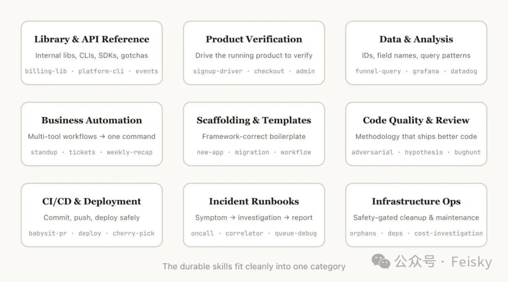
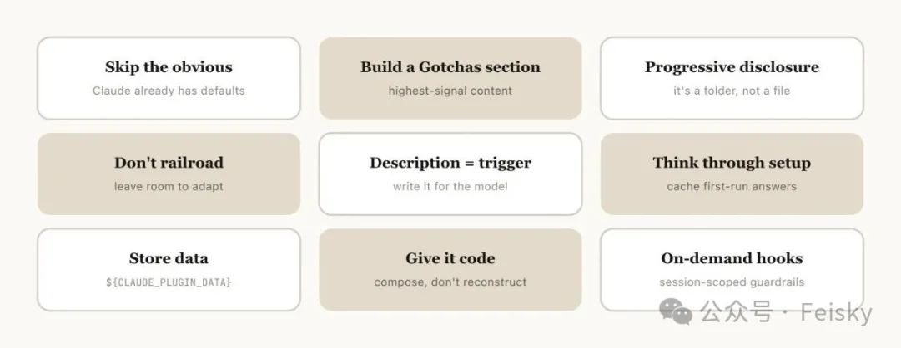
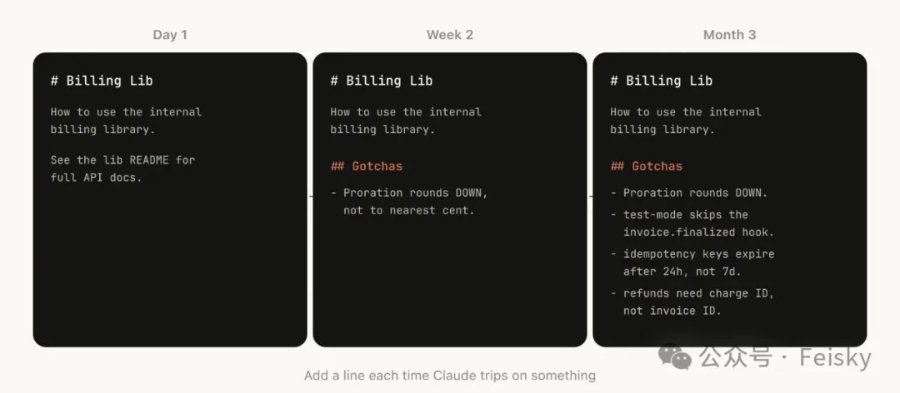
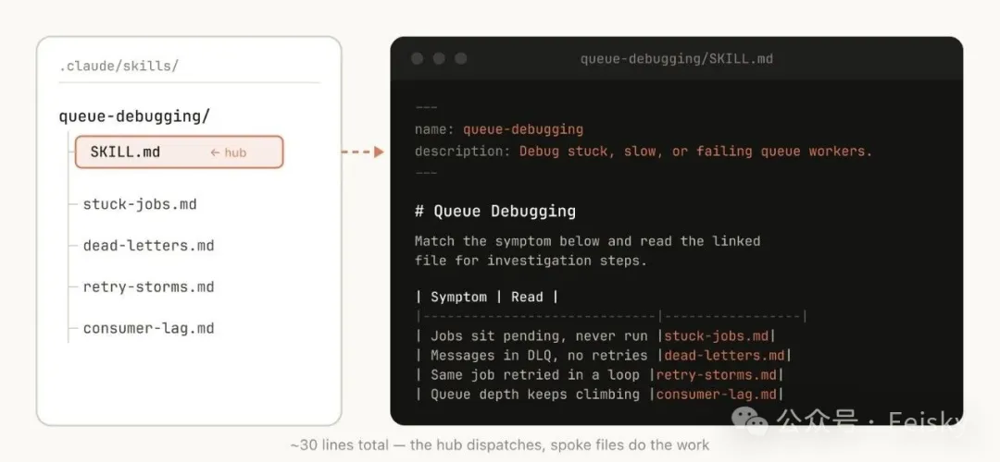
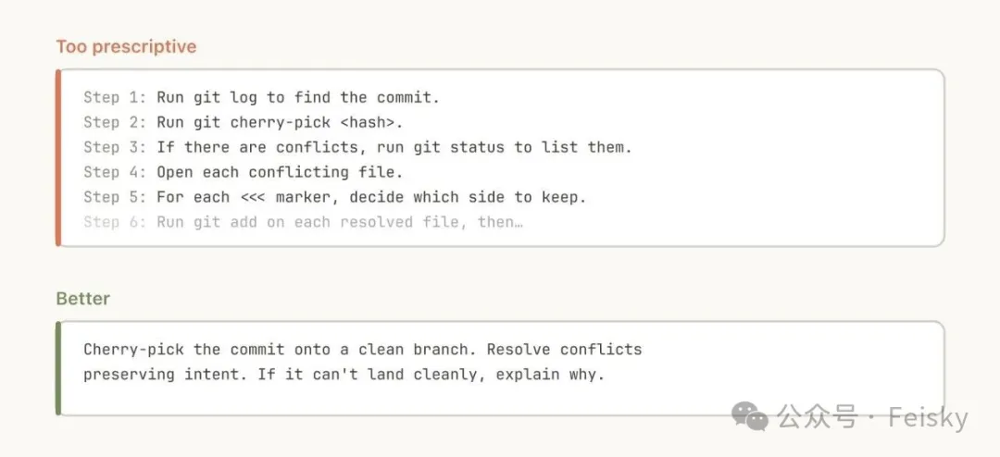
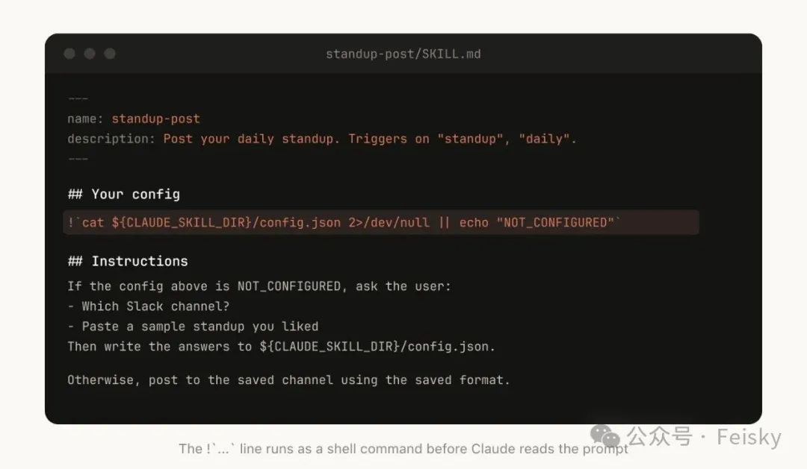
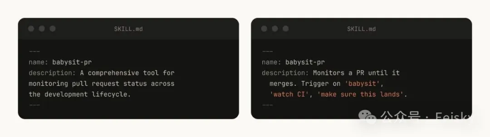
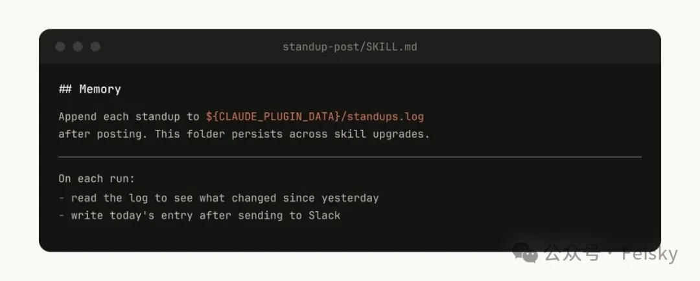
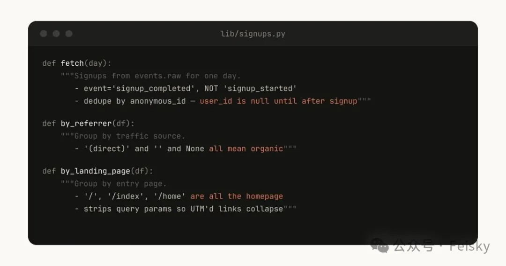
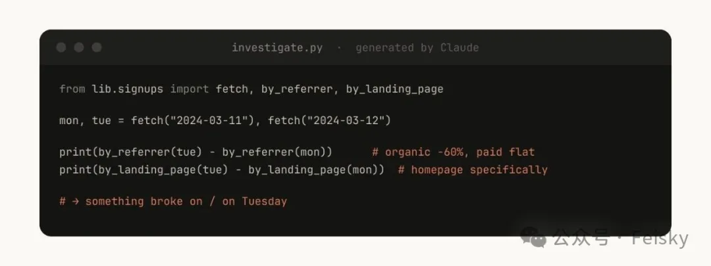

# 写好一个 Skill 有多难？Anthropic 踩了几百个坑之后的答案

**作者**：Feisky  
**公众号**：Feisky  
**发布时间**：2026年3月18日 22:21  
**原文链接**：[写好一个 Skill 有多难？Anthropic 踩了几百个坑之后的答案](https://mp.weixin.qq.com/s/k_BmfjCByVE2HJz7nqtXRw)

---
> 题记：本文编译自 Anthropic 工程师 Thariq（@trq212）发表的长文。上次他的文章分享了《像 Agent 一样思考：Claude Code 工具设计的进化史》，这次聊的是 Skill 怎么写才好用。原文链接：https://x.com/trq212/status/2033949937936085378。
写过 Claude Code Skill 的人应该都有一个体会：写出来容易，写好很难。

之前我推荐过不少好用的 Skill（《[十个顶级 Claude Code Skills，装上就不想卸](https://mp.weixin.qq.com/s?__biz=MzA3NjY2NzY1MA==&mid=2649741772&idx=1&sn=b7486745a543fd3980568a7b21c67086&scene=21#wechat_redirect)》《[OpenClaw 必备 Skill 清单](https://mp.weixin.qq.com/s?__biz=MzA3NjY2NzY1MA==&mid=2649741777&idx=1&sn=ba9ba864e0137244f665f63036c6fd54&scene=21#wechat_redirect)》），但“好用的 Skill 到底是怎么写出来的”这个问题一直没怎么聊过。市面上的教程大都停在”创建一个 SKILL.md 文件”这一步，至于写什么、怎么组织、哪些信息该放哪些不该放，基本没人系统讲过。

Anthropic 内部现在有几百个 Skill 在日常使用，Thariq 最近把他们踩过的坑整理成了一篇长文。我读完觉得信息密度挺高的，很多坑自己也踩过，但一直没想清楚为什么。这篇就把里面最有价值的部分整理出来。

## 先纠正一个常见误解
很多人觉得 Skill 就是一个 Markdown 文件。能跑，但没用好。

Skill 的本质是一个文件夹，里面可以放脚本、数据、模板、配置，Claude 能发现、探索和操作这些文件。另外，Skill 还支持很多配置选项（详见官方文档的 frontmatter 参考），包括动态注册 Hook。

Anthropic 内部用得最好的那些 Skill，恰恰是充分利用了文件夹结构和配置选项的。后面会具体聊到。

## 9 类 Skill：你的团队还缺哪些？
Thariq 把 Anthropic 内部所有的 Skill 做了一次盘点，发现它们大致可以归为 9 类。他说最好的 Skill 通常干净利落地属于某一类，而那些让人困惑的 Skill 往往横跨好几类。

Skill 分类

这个分类不是什么权威定义，但作为一个自查清单挺实用的，可以看看你的团队还缺哪几类。

#### 库和 API 参考
教 Claude 怎么正确使用某个库、CLI 或 SDK。可以是内部库，也可以是 Claude 经常用错的外部库。这类 Skill 通常会带一个代码片段文件夹和一份“踩坑清单”。

比如你内部的计费库有一堆边界情况，或者你的 CLI 工具有一些 Claude 不知道的子命令和用法。

#### 产品验证
描述怎么测试和验证代码是否正确。通常会配合 Playwright、tmux 之类的外部工具来做验证。

这类 Skill 的价值在于确保 Claude 的输出是对的，而不是“它说对了就信它”。Thariq 的原话是：让一个工程师花一周时间专门打磨验证类 Skill，是值得的。

可以考虑的技巧包括让 Claude 录制测试视频方便回看，或者在每一步强制做断言。这些通常通过在 Skill 中放脚本来实现。

#### 数据获取与分析
连接到你的数据和监控系统。这类 Skill 可能会包含带凭据的数据获取脚本、Dashboard ID、常见查询工作流。

比如“哪些事件表能看到注册→激活→付费的转化漏斗”，或者“Grafana 里哪个 dashboard 对应哪个问题”。

#### 业务流程自动化
把重复性工作流一键化。比如自动聚合 ticket tracker、GitHub 活动和 Slack 消息来生成 standup，或者自动创建 ticket 并触发后续的 review 和通知流程。

这类 Skill 指令通常比较简单，但依赖其他 Skill 或 MCP。一个有用的技巧是把每次执行的结果保存到日志文件里，Claude 下次执行时可以参考上次的结果，保持一致性。

#### 代码脚手架
为代码库中的特定功能生成框架代码。当你的脚手架有一些无法纯粹用代码覆盖的自然语言需求时，Skill 的优势就体现出来了。比如新建一个带你们标准认证、日志和部署配置的内部应用。

#### 代码质量与审查
在团队内部强制执行代码质量标准。可以包含确定性脚本来保证鲁棒性。你可能想通过 Hook 自动触发这些 Skill，或者放到 GitHub Action 里跑。

比如启动一个全新视角的子 Agent 来挑刺，迭代到只剩 nitpick 级别的问题为止。

#### CI/CD 与部署
帮你拉代码、推代码和部署的 Skill。比如监控 PR 状态，自动重试 flaky CI，解决合并冲突，开启 auto-merge。或者做灰度发布时自动对比错误率，有回归就自动回滚。

#### Runbook
拿到一个症状（Slack 线程、告警或错误签名），走一遍多工具调查流程，输出结构化报告。这就是把 on-call 经验沉淀成了可执行的标准流程。

#### 基础设施运维
执行日常维护和运维操作，有些涉及破坏性操作，所以 Skill 里可以内置安全护栏。比如查找孤立的 Pod/Volume，先发到 Slack 等一段时间确认，用户同意后再级联清理。

这 9 类基本覆盖了一个工程团队日常工作的方方面面。如果你的团队刚开始用 Skill，可以从这个清单出发，看看哪几类能最快产生价值。我自己的体感是验证类和业务流程自动化类最容易见效，因为它们解决的是每天都在重复的痛点。

知道了该做什么类型的 Skill，接下来的问题就是怎么写了。

## 怎么把 Skill 写好？
这部分是我觉得全文最有价值的，因为很多坑不踩一遍真想不到。

Tips for Making Skills

Anthropic 最近也发布了 Skill Creator 来简化 Skill 的创建过程，但即使有工具辅助，下面这些原则还是得自己把握。

#### 别写 Claude 已经知道的
Claude 本身就懂很多编程知识，对你的代码库也有不少了解。如果你的 Skill 主要是知识类的，重点放在那些能把 Claude 推出它默认思维模式的信息上。

frontend-design Skill 是个好例子。它是 Anthropic 的工程师跟客户反复迭代出来的，核心就是教 Claude 避免那些经典的 AI 审美，比如 Inter 字体配紫色渐变。这些才是 Claude 需要被纠正的地方，而不是告诉它“请写出高质量代码”。

#### 好好写 Gotchas 部分

Gotchas Section

任何 Skill 里信息量最高的部分就是 Gotchas（踩坑清单）。把 Claude 使用你的 Skill 时经常犯的错记下来，随着使用不断补充。

我自己写 Skill 的经验也是这样。一开始写的 Skill 可能只有二三十行，用了一个月之后 Gotchas 部分比正文还长。因为每次 Claude 犯一个新错，你就加一条，这些积累才是 Skill 真正的价值所在。

#### 用好文件系统和渐进式披露

Progressive Disclosure

前面说了，Skill 是文件夹，不只是 Markdown。你应该把整个文件系统当作上下文工程和渐进式披露（Progressive Disclosure）的手段。在 SKILL.md 里告诉 Claude 这个 Skill 里有哪些文件，它会在合适的时候去读。

最简单的做法是把详细的函数签名和用法示例拆到 `references/api.md` 里。如果你的最终输出是 Markdown 文件，可以在 `assets/` 里放一个模板让 Claude 复制使用。

脚本、示例、参考文档，这些都可以分门别类放进 Skill 文件夹。Claude 知道它们在那儿，需要的时候自己会去找。

这个思路在上一篇《[像 Agent 一样思考](https://mp.weixin.qq.com/s?__biz=MzA3NjY2NzY1MA==&mid=2649741718&idx=1&sn=088e5812ca0d1de2af8ca978aec03ee8&scene=21#wechat_redirect)》里也聊过。从被动接收上下文到主动探索上下文，渐进式披露是 Claude Code 工具设计的核心理念之一。

#### 别把 Claude 钉死

Avoid Railroading

Claude 会尽量遵守你的指令，但 Skill 是会被反复使用的，如果指令太具体，它在某些场景下就会变得很死板。给 Claude 它需要的信息，但也给它根据具体情况灵活调整的空间。

比如不要写“必须按 A→B→C→D 四个步骤执行”，而是写“通常的流程是 A→B→C→D，但可以根据实际情况调整顺序或跳过某些步骤”。

#### 想清楚初始化流程

Setup

有些 Skill 需要用户先提供一些上下文才能用。比如一个发 standup 到 Slack 的 Skill，需要知道发到哪个频道。

一个好的做法是把这些配置信息存到 Skill 目录下的 `config.json` 里。第一次运行时，如果配置不存在，Claude 就问用户；配置好了以后就直接用，不再重复问。

如果你想让 Claude 给用户提结构化的选择题而不是开放式提问，可以让它调用 `AskUserQuestion` 工具。

#### description 字段是写给模型看的

Description Field

Claude Code 启动时会构建一个所有可用 Skill 的清单，每个 Skill 带上它的 description。Claude 扫这个清单来决定“当前这个请求有没有对应的 Skill”。

所以 description 不是给人看的摘要，而是给模型看的触发条件。你应该写清楚“什么时候应该触发这个 Skill”，而不是“这个 Skill 做了什么”。

这个细节我之前也没太注意，但仔细想想确实重要。如果 description 写的是“用于格式化代码”，Claude 可能在很多场景下都不确定要不要用。但如果写的是“当用户要求格式化代码、或代码风格不一致时触发”，触发率会准确得多。

#### 给 Skill 加记忆

Memory & Storing Data

有些 Skill 可以通过存储数据来实现记忆功能。可以简单到往一个文本日志里追加内容，也可以复杂到用 SQLite 数据库。

比如前面提到的 standup Skill，如果每次执行都把内容追加到 `standups.log` 里，下次运行时 Claude 读一遍历史，就能知道哪些是新变化，不需要从头分析。

需要注意的是，Skill 目录下的数据在升级 Skill 时可能被删掉。所以应该把数据存到稳定的位置。目前 Claude Code 提供了 `${CLAUDE_PLUGIN_DATA}` 作为每个 Plugin 的稳定存储目录。

#### 放脚本，让 Claude 组合

Store Scripts

给 Claude 代码是你能做的最有力的事之一。把辅助脚本和库函数放到 Skill 里，Claude 就可以把精力花在组合和决策上，而不是从头写重复的样板代码。

比如在数据分析 Skill 里放一组从数据源拉数据的辅助函数，Claude 就可以按需组合这些函数来回答“周二发生了什么”这类问题。

Claude 生成脚本

#### 按需 Hook
Skill 可以包含只在被调用时才激活的 Hook，持续到会话结束。适合那些比较“有态度”的 Hook，平时开着太烦，但某些场景下非常有用。

比如 `/careful`，通过 `PreToolUse` 拦截 Bash 里的 `rm -rf`、`DROP TABLE`、`force-push`、`kubectl delete`。你只在碰生产环境时才想开它，平时开着只会让人抓狂。再比如 `/freeze`，阻止 Claude 编辑特定目录之外的文件。调试的时候特别有用，你只想加日志，不想 Claude 顺手把不相关的代码也修了。

#### 别忘了统计
顺便提一下分发和统计。Anthropic 内部用一个 `PreToolUse` Hook 来记录 Skill 的使用情况（示例代码），这样就能发现哪些 Skill 被高频使用、哪些触发率低于预期。

分发方面，小团队直接把 Skill 提交到仓库的 `.claude/skills` 目录就行。规模大了以后，可以搭建内部的 Plugin Marketplace，让团队成员自己选择安装哪些。Anthropic 内部没有一个集中的团队来决定哪些 Skill 上架。有人做了一个好用的 Skill，先放到一个 sandbox 目录让人试用，有了口碑再提 PR 进入正式市场。

还有一个需要注意的问题：Skill 之间的组合和依赖。比如你的 CSV 生成 Skill 依赖一个文件上传 Skill。目前 Marketplace 还没有原生的依赖管理，但你可以在 Skill 里直接引用其他 Skill 的名字，Claude 会自动调用已安装的。

## 写在最后
回头看这篇文章，最让我有感触的是 Gotchas 部分。我自己写 Skill 的经历也验证了这一点，Skill 的价值不在初始版本写得多完整，而在于使用过程中不断补充 Claude 犯过的错。一开始写个十几行的骨架，用一段时间后自然会长成一个成熟的 Skill。

另一个让我重新审视的是“别写 Claude 已经知道的”。我之前写过一些 Skill，里面有大段的编码规范和最佳实践，这些其实 Claude 本来就会。真正该写进 Skill 的是那些 Claude 不知道的、你的团队特有的知识，比如内部约定、踩过的坑、用什么工具查什么问题。

如果你已经在用 Skills 但觉得效果一般，不妨回去对照一下上面的原则，看看有哪些地方可以调整。如果你还没开始，从一个小的 Gotchas 清单开始就行，不需要一上来就做得很复杂。

相关资源：

- • 原文链接：https://x.com/trq212/status/2033949937936085378
- • Claude Code Skills 文档：https://code.claude.com/docs/en/skills
- • Agent Skills 课程：https://anthropic.skilljar.com/introduction-to-agent-skills
- • Skill Creator 博客：https://claude.com/blog/improving-skill-creator-test-measure-and-refine-agent-skills
- • Anthropic 官方 Skills 仓库：https://github.com/anthropics/skills
- • Skill 使用日志 Hook 示例：https://gist.github.com/ThariqS/24defad423d701746e23dc19aace4de5
好了，今天就聊到这儿。如果你也在探索 AI 编程工具，欢迎关注 Feisky 公众号，我会定期分享实践中的发现和踩坑经验。

---

> ⚠️ 以下图片未能从正文 HTML 中定位，按下载顺序追加：

