# 分享一个我用了2年的深度研究Prompt，半小时帮你搞懂任何陌生领域。

**作者**：数字生命卡兹克  
**公众号**：数字生命卡兹克  
**发布时间**：2026年4月13日 10:08  
**原文链接**：[分享一个我用了2年的深度研究Prompt，半小时帮你搞懂任何陌生领域。](https://mp.weixin.qq.com/s/Y_uRMYBmdLWUPnz_ac7jWA)

---

前两天办完大会，然后昨天周末跟一个朋友吃饭，聊着聊着他突然放下筷子看着我说了一句，不是哥们，你怎么什么都懂一点？

我说我不懂啊，我懂个屁。

他说怎么感觉啥你都能聊一聊，什么Harness、什么Claude Code、什么心理学、什么杀戮尖塔2、什么克苏鲁神话，你怎么还有时间玩宝可梦popakia，你到底一天有多少个小时？

我当时就愣了一下。

因为坦率的说，聊天吹牛逼归吹牛逼，我真的没觉得自己什么都懂，我只是对很多东西好奇，然后有一套办法能让我很快地把一个陌生的东西摸个七七八八。

他又问，什么办法？

我说，一个我自己搞的研究框架，加上AI，半小时能出一份一两万字的研究报告，能帮你贼迅速的入门。

他筷子又放下了。

然后他说，"你把这个东西写出来"。

于是就有了今天这篇文章。。。

我也不知道对所有人有没有用，但这确实是我自己三年前还在金融行业的时候，研究公司和行业用的方法论，然后后面AI来了，各种各样的深度研究也出来了，我自己又把这套方法论稍微迭代了一下，封装成了给很多AI的深度研究功能用的Prompt，能适用于我研究任何东西，说实话，我觉得这就是这两年用得最顺手的东西之一。

不敢说这玩意出来的研究有多透彻，但至少能让我快速建立起一个相当完整的认知框架，然后在这个框架上再去深挖。

这个方法论，我之前把它称为**横纵分析法**。

我先说说这玩意是个什么东西。

其实特别简单，就两条轴。

**第一条轴，纵向。** 就是沿着时间线，把一个东西从诞生到现在的完整故事给还原出来。它怎么来的？谁做的？中间经历了什么？为什么在某个节点突然爆发了，或者突然掉头了？你把这条线理清楚，你就能理解一个东西大概的历史与因果。

**第二条轴，横向。** 就是在当下这个时间点，把它跟同赛道的其他东西放在一起比。它跟竞品比有什么不同？用户为什么选它不选别的？它在整个赛道里是什么位置？你把这个切面看清楚，你就能理解一个东西的位置和差异。

然后最关键的一步，是把这两条轴交叉起来看。

纵向告诉你它是怎么走到今天的，横向告诉你它今天站在哪。两条轴一交叉，你就能看到一些单独看任何一条轴都看不到的东西。比如它今天的某个优势，其实是三年前一个不起眼的决策慢慢积累出来的。比如它今天的某个短板，其实是当初一个合理的选择变成了包袱。

纵向追时间深度，横向追同期广度，最后交汇出判断。

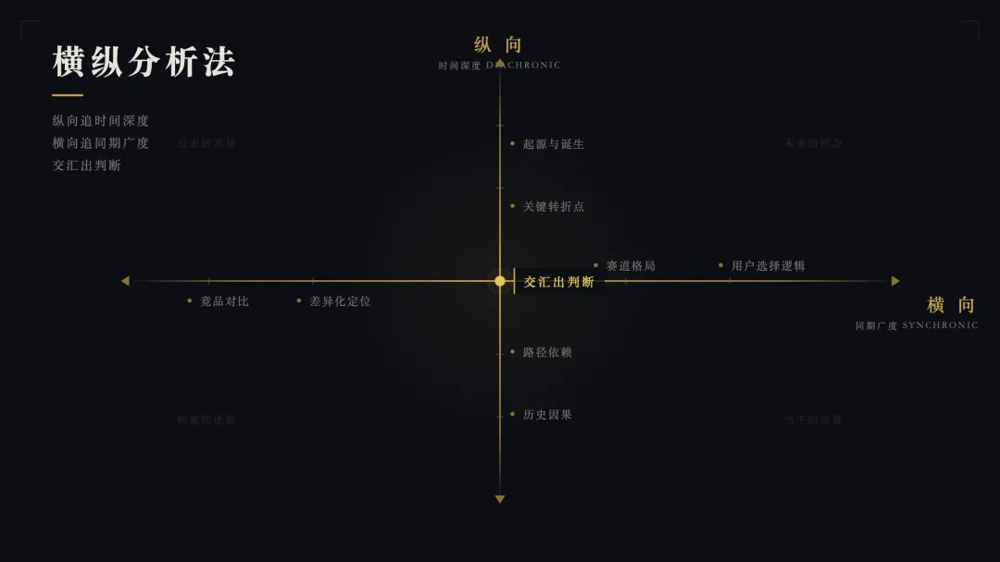

就这么简单。也是我这两年用的最顺手的一套方法。

**这个方法其实脱胎于社会科学和语言学的一些经典研究视角。**

语言学里面有一个非常经典的分析维度，是索绪尔提出来的，叫历时分析和共时分析。就是你要研究一个东西，可以从两个维度入手，一个维度是时间维度，看它从过去到现在是怎么一步步演变过来的，另一个维度是当下维度，看它在某一个时间点上，处在一个什么样的系统和比较关系里。

社会科学里面也有类似的研究视角，叫纵向研究和横截面研究。纵向就是追踪一个对象的变化轨迹，横截面就是在某个时间点上观察它的截面状态，并做横向对比。

我就是把这些学术界已经用很久的研究视角抽离一下，再结合了一些商业和竞争战略分析的思路，搞成了一套用AI来跑的通用研究框架。

现在有Prompt版本和Skill版本。**也全部开源在我的Github仓库了：**

**https://github.com/KKKKhazix/khazix-skills**

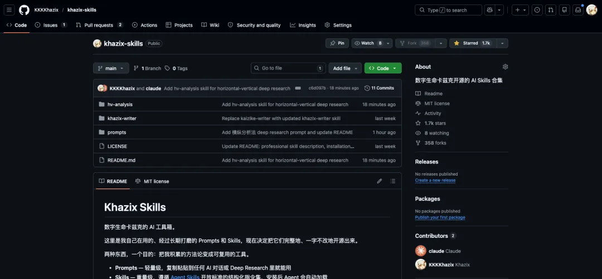

Prompt版本配合一些有深度研究功能的AI效果会特别好，比如ChatGPT的DeepResearch、Claude的深度研究、豆包的专家模式、DeepSeek的专家模式啥的，都行，并且我特意优化了行文风格，使用了部分卡兹克写作skill的能力，保证这份报告出来以后，你能读的下去，而不是如果嚼难啃的天书一般。

我把Prompt放在这里，有需要的朋友直接复制，也可以去Github仓库自取：

```shell
# 横纵分析法 Deep Research Prompt
> 使用方法：将下方 Prompt 复制到任何支持 Deep Research 的模型中，只需修改开头的「研究对象」一行即可。
---
## Prompt 正文
```
> 横纵分析法 by 数字生命卡兹克
## 变量定义
研究对象 = 「此处替换为你的研究对象名」
（以下所有提到「研究对象」的地方，都指代上面定义的内容。使用时只需修改等号右边的内容即可。）
---
你是一位资深的技术与商业研究分析师。请使用「横纵分析法」对「研究对象」进行一份完整的深度研究报告。

横纵分析法包含两个维度：

---
## 一、纵向分析（Diachronic / Longitudinal）
沿时间轴，完整还原「研究对象」从诞生到现在的发展全貌。要求如下：
1. **起源追溯**：它诞生的背景是什么？基于什么技术/理念/需求而来？创始团队或核心推动者是谁？当时的行业环境是什么样的？
2. **诞生节点**：明确的首次发布/成立/提出时间，以及最初的形态和定位。
3. **演进历程**：从诞生到现在，按时间顺序梳理所有关键节点。包括但不限于：重大版本更新、融资事件、团队变动、战略转型、技术架构变化、用户规模里程碑、重大合作或收购、公关危机或争议事件。
4. **决策逻辑**：在每个关键节点上，尽可能还原决策背后的原因。为什么选了A而不是B？当时面对的约束条件是什么？
5. **叙事要求**：不要写成干巴巴的年表。用故事的方式把发展史串起来，让读者能感受到因果关系和时代脉络。越详细、越多元越好，把相关的人物、事件、背景信息都拽进来。

---
## 二、横向分析（Synchronic / Cross-sectional）
以当前时间点为切面，将「研究对象」与同赛道的竞品/同类进行全面对比。

**首先判断竞品情况**，分为三种场景：
- **场景A：无直接竞品。** 如果「研究对象」是一个全新品类或独占性极强的领域，没有可直接对比的竞品，则跳过逐一对比，改为分析：它为什么没有竞品？是品类太新、壁垒太高、还是市场太小？未来最可能从哪个方向冒出竞争者？有没有间接替代方案或上一代的解决方式可以作为参照？
- **场景B：少量竞品（1-2个）。** 逐一深入对比，每个竞品展开详细分析。
- **场景C：竞品充分（3个及以上）。** 选取最具代表性的3-5个进行对比，其余可简要提及。

**对比维度**（根据「研究对象」的类型灵活调整）：
1. **核心差异对比**：
   - 技术路线/核心方法论/底层逻辑
   - 产品形态/商业模式/组织结构
   - 目标用户/受众/适用场景
   - 核心优势与明显短板
   - 定价策略/资源投入/规模体量
2. **用户视角**：每个竞品的真实用户口碑如何？社区评价、使用体验中被提及最多的优点和槽点分别是什么？用户实际的使用方式和官方定位有没有偏差？
3. **生态位分析**：在整个赛道的版图中，「研究对象」占据的是什么位置？它填补了什么空白，还是在跟谁正面竞争？
4. **趋势判断**：基于横向对比，你认为「研究对象」在竞争格局中的走向是什么？它的机会和风险各是什么？

---
## 三、写作风格要求
这不是一份冷冰冰的咨询报告，而是一篇让人能从头读到尾的深度研究。请遵循以下风格要求：
1. **可读性优先**：写得像一篇优质的深度报道或非虚构特稿，有节奏感，有画面感。
2. **叙事驱动，不是罗列驱动**：纵向部分要有故事弧线，有起承转合。
3. **观点要有，但必须建立在事实之上**：鼓励你给出判断和洞察，但每一个观点都必须有事实支撑。先摆事实，再给判断。如果是推测，明确标注。
4. **用人话写**：避免咨询公司式的套话和空洞的形容词（如"赋能""抓手""打造闭环"）。用具体的细节和例子代替概括性陈述。
5. **对比要有温度**：横向对比不要写成参数对照表的文字版。要讲清楚每个竞品"活成了什么样"，用户选它的真实理由是什么。

---
## 四、篇幅要求
根据「研究对象」的复杂度，自适应调整篇幅：
- **纵向分析**：6000-15000字。
- **横向分析**：3000-10000字。
- **横纵交汇总结**：1500-3000字。
- **全文总计**：10000-30000字。不要怕长，研究报告的价值在于深度和完整度。

---
## 五、输出格式要求
1. 先输出纵向分析（发展史叙事），再输出横向分析（竞品对比）
2. 纵向部分以时间叙事为主线，但不要用纯粹的列表格式，要有可读性
3. 横向部分可以适当使用对比表格辅助，但核心分析必须是文字论述
4. 在报告最后，加一段「横纵交汇」的总结
5. 所有信息尽可能标注来源或时间节点，确保可追溯
6. 如果某些信息无法确认，明确标注为推测或未经证实，不要编造

---
## 适用范围说明
此分析法适用于以下类型的研究对象：
- **产品/工具**：如 Hermes Agent、Cursor、Claude Code
- **公司/组织**：如 Anthropic、字节跳动、OpenAI
- **技术概念**：如 MCP协议、RAG、Agent框架
- **人物**：如某个行业关键人物的职业轨迹与同期人物的对比
请根据「研究对象」的具体类型，灵活调整纵向和横向分析中的具体维度。核心原则不变：纵向追时间深度，横向追同期广度，最终交汇出判断。
```

使用方法特别简单，把那个研究对象等式后面那个词组，直接改成你想要的研究对象就行。

比如最近很火的Hermes Agent、比如Harness、比如CLI、比如Anthropic对于SaaS股有什么冲击等等等等。甚至你想研究《洛克王国世界》、《王者荣耀世界》、伊朗跟美国的战事、川普的反复无常等等等等。什么都可以。

我用最近最火的Harness+Claude的深度研究来举个例子吧。

我直接把那个Prompt改了一下，等式里面换成了Harness，然后打开了Claude的深度研究模式。

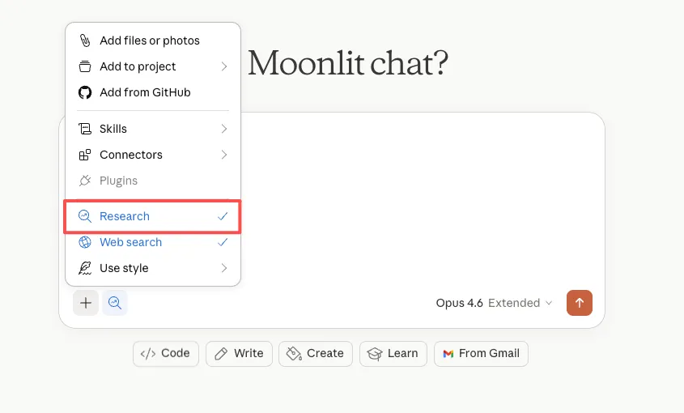

直接发送。然后Claude会跟我确认一下Harness到底是个什么东西，我就补充了一下。

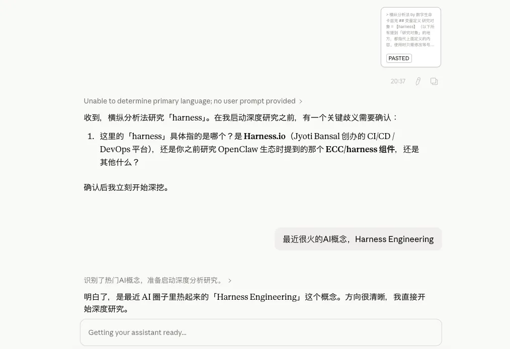

然后就直接开始了。13分钟以后，这篇关于Harness的研究报告就写好了。

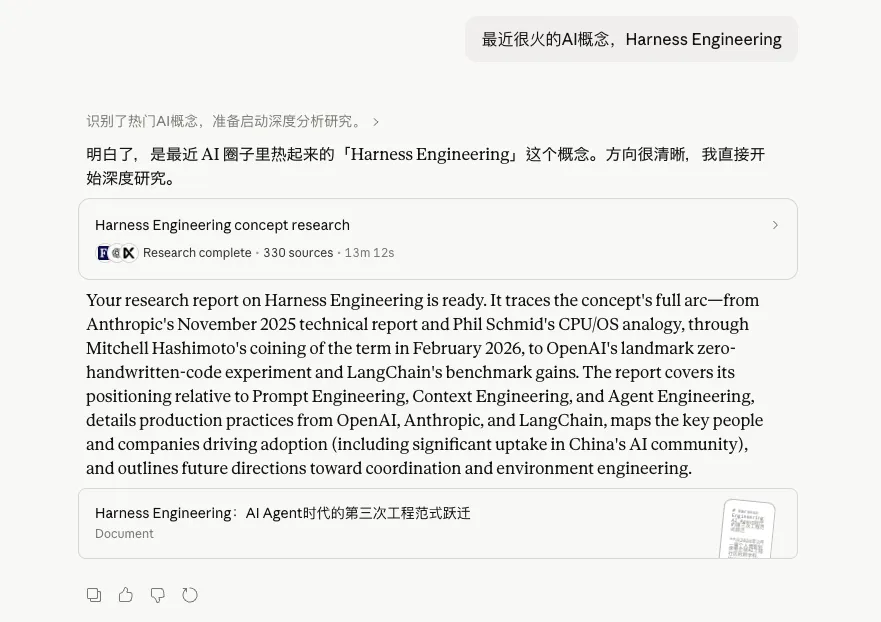

可以看看效果，纵向分析我觉得写的还不错，历史给你拉的非常清楚，什么时候诞生的，什么时候爆发的，有哪些关键节点。

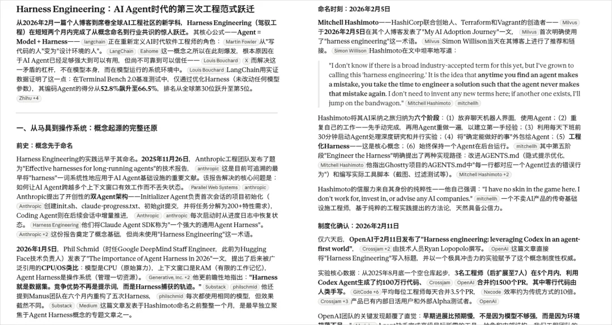

为什么是这个时间点爆发也非常的有道理。

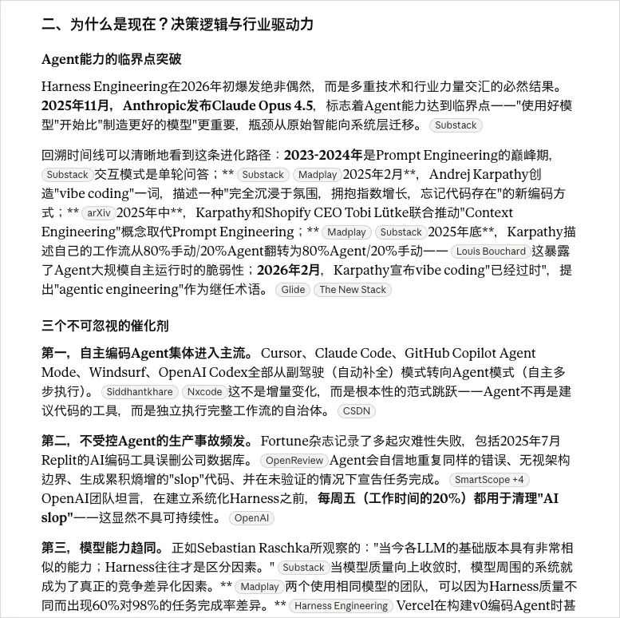

而在横向研究上，对比的是Prompt Engineering、Context Engineering和Agent Engineering。我相信任何一个懂Agent的，都不会质疑它对比的不专业对吧，你可以非常快速的理清跟一些同类概念的区别。

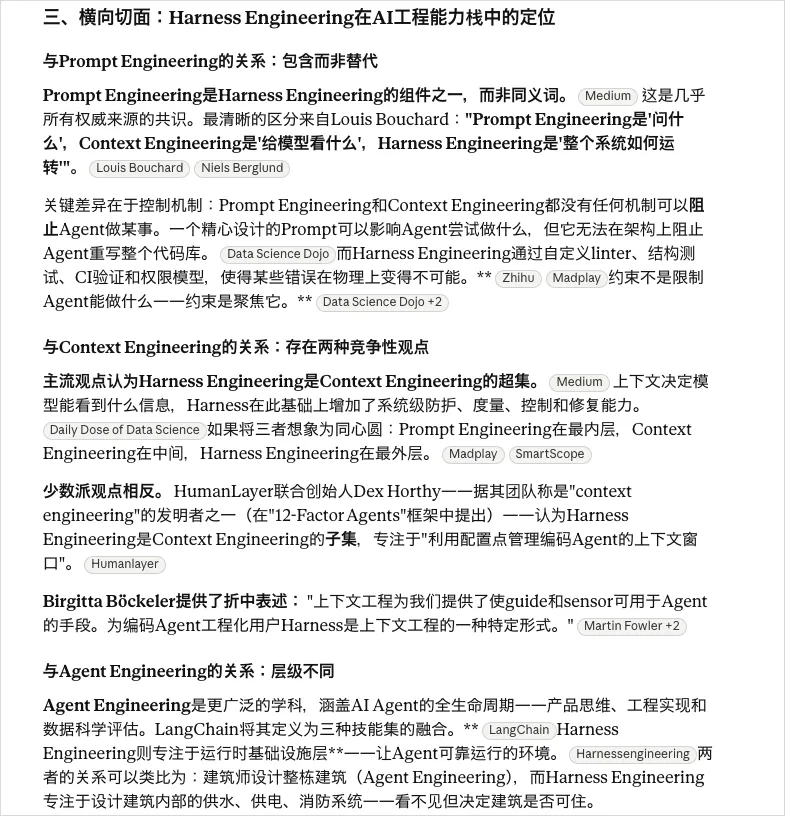

还有最后的未来演进方向。

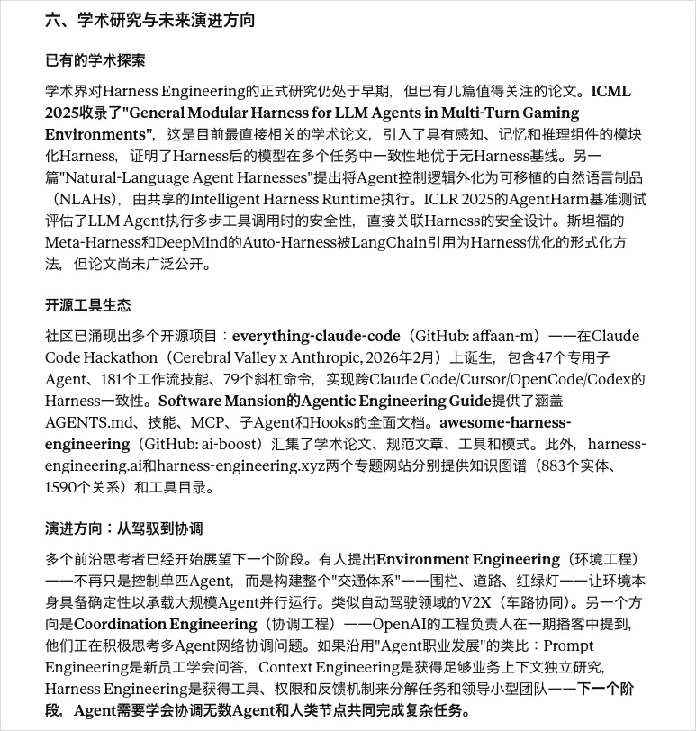

这整篇报告大概一万字，相信我，如果你是对Harness感到好奇，想最快速度尽可能全面的了解关于它的一切，这篇研究报告，几乎比你看到的大多数的汇总文章，都要好。全面且易读。

研究对象可以是一个产品，比如Cursor、Claude Code、Hermes Agent。可以是一个公司，比如Anthropic、字节跳动。可以是一个技术概念，比如MCP协议、RAG。甚至可以是一个人，比如某个行业里的关键人物。Prompt会根据研究对象的类型，自动调整纵向和横向分析的侧重点。

如果你平时喜欢用用Cowork、Claude Code或者Codex等等Agent啥的，我还把这个方法论做成了一个Skill，叫hv-analysis，也放在我的Github仓库里开源了。装上之后你直接跟Agent说「帮我研究一下xxx」，它就会按照横纵分析法的框架去做。

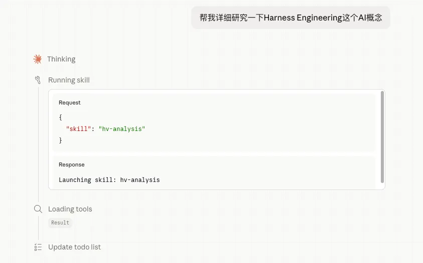

而且这个Skill版本还会自动联网搜索信息、还包了arxiv的API，会在你研究一些学术问题的时候自主去查询论文，最后还会生成一份排版好的PDF研究报告，文风也会更易读，比Prompt版本更自由丰富一些。

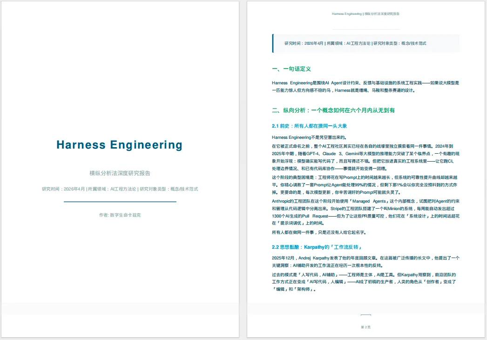

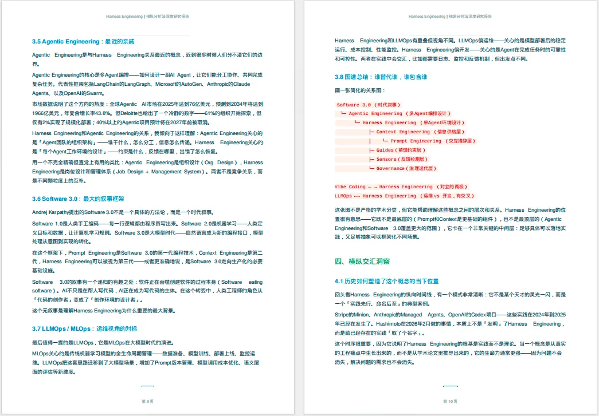

当然，我得坦诚的说一下这个方法的局限。它不是万能的。它能帮你在很短的时间内建立一个相当完整的认知框架，但它替代不了真正深入的、亲自下场的研究。并且AI搜集到的信息虽然现在AI的模型幻觉已经非常非常低了，但是还是可能会出现不准确的情况。

所以你不能拿到AI产出的报告就直接当结论用，它更像是一个你对这个领域研究的起点，帮你快速建立地图，然后你再根据这个地图去做更深入的探索。

另外一个问题是，AI生成的报告质量跟你用的模型和工具有很大关系。用支持DeepResearch或者深度研究的工具效果通常比较好，因为它们会真的去联网搜索、验证很多信息，一次任务通常都在10分钟以上。但是如果你只能用支持普通联网搜索的AI工具，一次就不到一分钟，那效果可能确实会大打折扣。

**我自己的做法是，拿到报告之后，先快速通读一遍建立框架，然后针对我觉得有疑问的点或者特别感兴趣的点，再深入去搜更多资料。**

**这个就是横纵分析法生成的AI报告 + 自己深挖的组合，比从零开始的效率高太多了。**

毕竟这年头，在已经有了AI的情况下，真的没必要硬生生自己去挖，那真的是没苦硬吃。

我有时候觉得，这个时代做研究，真正稀缺的不再是信息，而是你对这个世界有多好奇。

其实你要说我真的有多博学或者多专业吗，那肯定也不是，我只是对这个世界，多了一点点的好奇而已。就是脑子里随时随地会冒出来一堆问题。这个东西是怎么来的？为什么是现在出现的？它跟那个东西是什么关系？做这件事的人之前在干嘛？

信息已经像洪水一样了，AI让你获取信息的成本趋近于零。但你要问什么问题、从什么角度去看、怎么把散落的信息组织成有意义的判断，这些东西AI帮不了你，或者说，AI只能在你给出方向之后帮你执行，但方向本身得你自己定。

横纵分析法其实就是我给自己定的一个提问框架。每次面对一个陌生的东西，我不需要临时想我应该从哪几个角度去了解它，这个框架已经帮我想好了。纵向追时间，横向追空间，最后交汇出判断，三步走完，认知框架就搭起来了。

它让我不用再跟几年前一样，花三天时间去搜集信息，现在，半小时就能把框架搭起来，然后把剩下的时间花在真正有意思的地方，就是看着这些信息慢慢拼成一幅完整的图，然后突然「啊，原来是这样」的那个啊哈的瞬间。那个瞬间太爽了。

说实话我也不确定这个方法适合每个人。但如果你也是那种，脑子里经常冒出一堆问题，又嫌搜集信息太慢的人，可以试试。

**古希腊人说，哲学始于惊奇。**

我觉得吧，研究也是，始于你对一个东西真的好奇，方法和工具都是后面的事，好奇心在前面。没有好奇心，有再好的方法论也是摆设。有了好奇心，哪怕方法笨一点，你也总会找到答案的。只不过现在，找答案这件事，确实比以前快多了。快到你可以对更多的事情，保持好奇。

---

> 作者：卡兹克  
> 投稿或爆料，请联系邮箱：wzglyay@virxact.com
