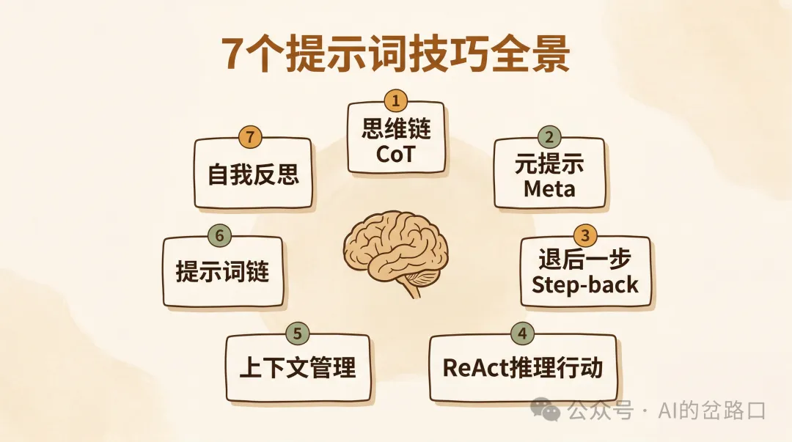
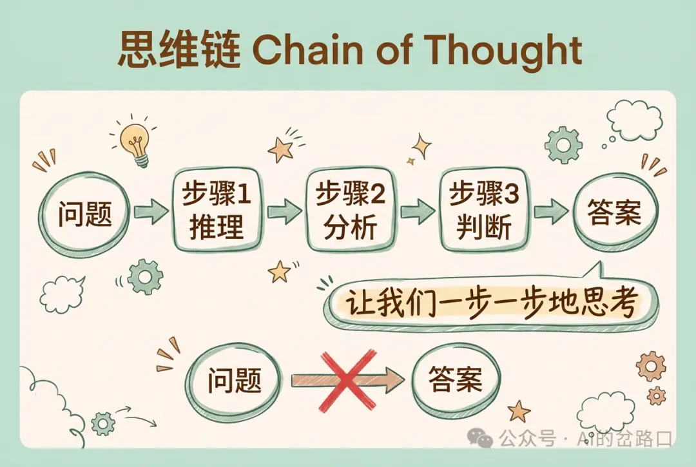
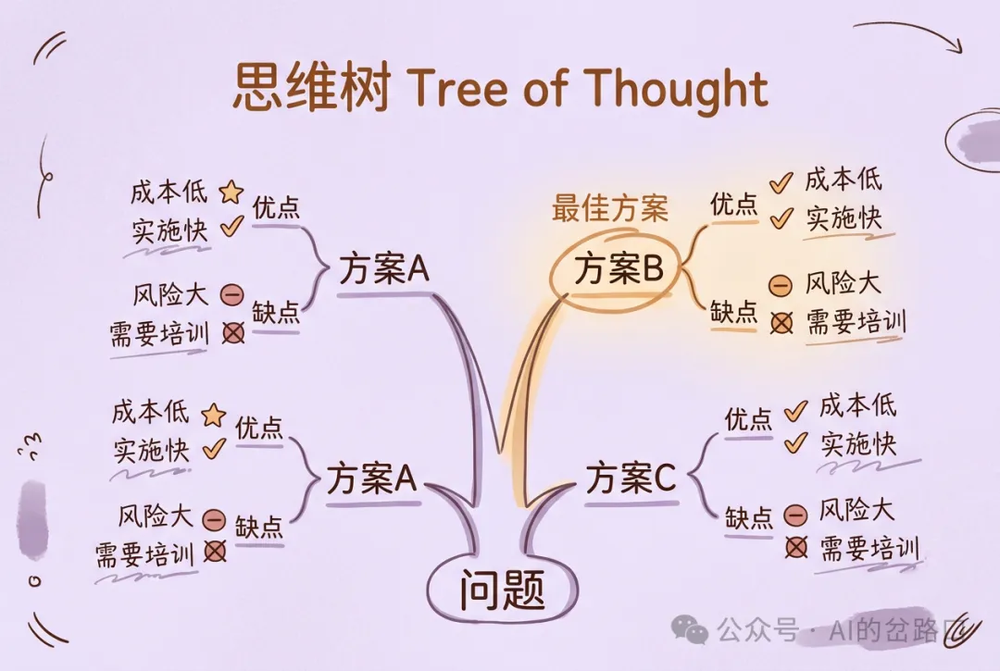
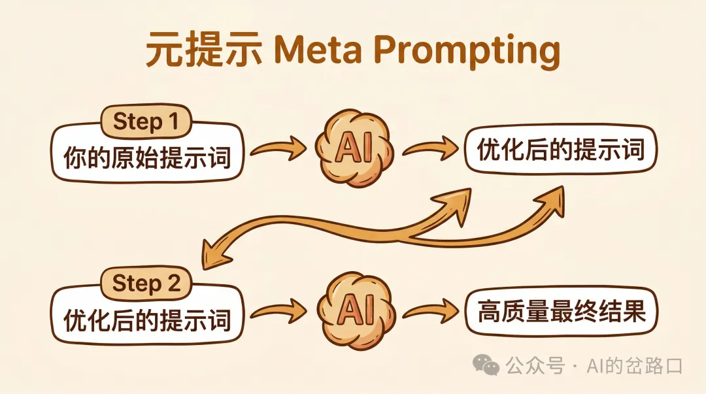
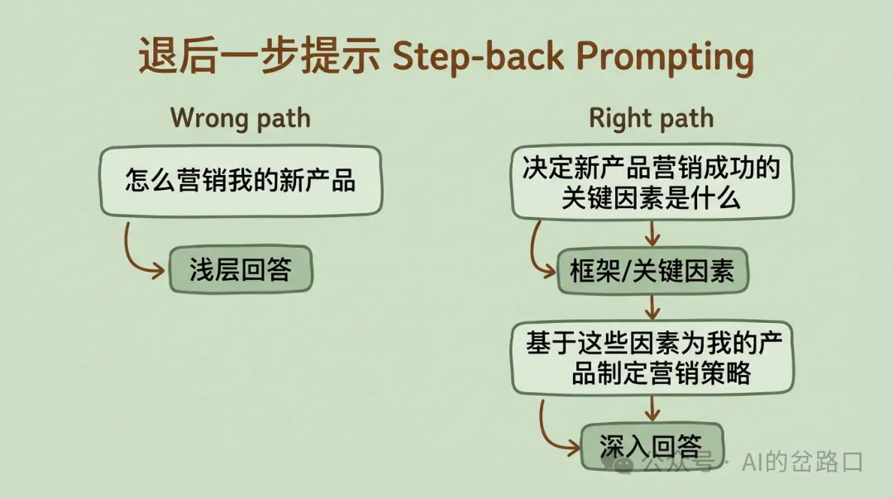
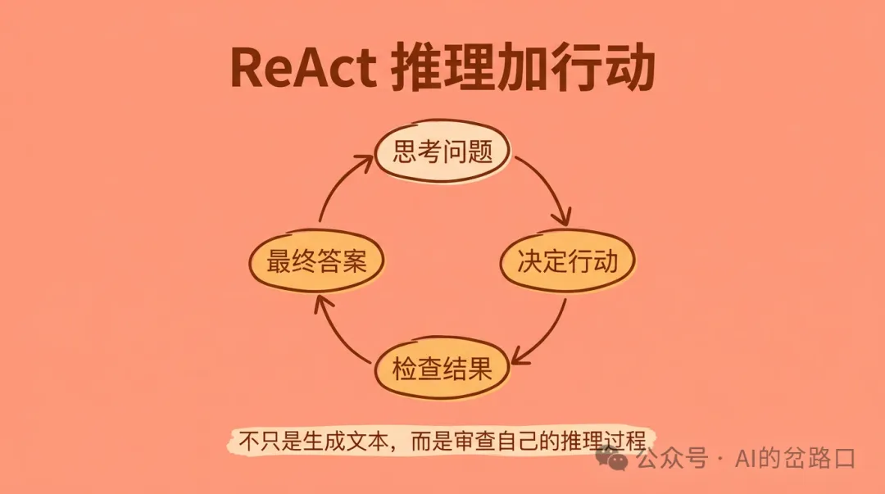
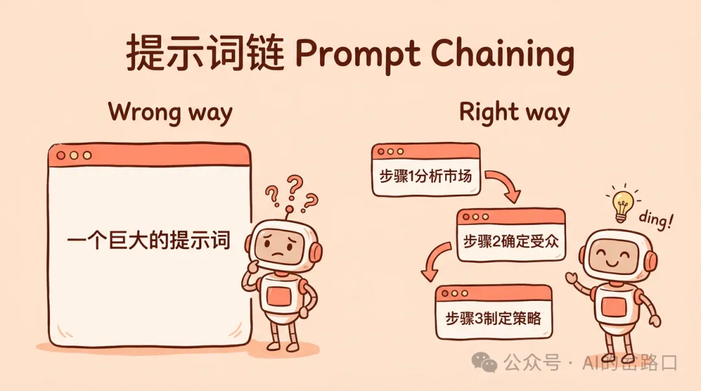
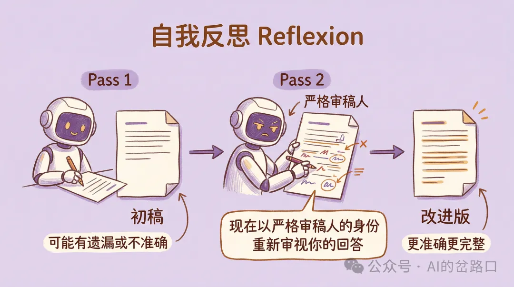

# 别再说AI笨了！7个提示词技巧让免费模型也能输出惊艳答案

**作者**：AI 的岔路口  
**公众号**：AI的岔路口  
**发布时间**：2026年4月13日 09:00  
**原文链接**：[别再说AI笨了！7个提示词技巧让免费模型也能输出惊艳答案](https://mp.weixin.qq.com/s/VLRTqz3Mt3g2TjcoOW7-VA)

---

7个提示词技巧全景

你有没有这样的经历——兴冲冲地打开一个AI，敲了一个问题，结果回复平淡得像白开水？

然后你心里默默骂了一句："什么垃圾AI。"

但我要告诉你一个扎心的事实：**问题大概率不在AI，在你自己。**

用了这么久各种AI模型，我越来越确信一件事：大多数人严重高估了模型本身的能力，却严重低估了**怎么问**这件事的重要性。

一个"菜鸡回答"和一个"大神输出"之间的差距，往往不在模型，而在你的提示词架构。

今天分享7个我反复验证过的提示词技巧，学会之后，免费模型也能让你用出付费的效果。


AI为什么经常翻车

## 先搞清楚：AI为什么经常"翻车"？
在聊技巧之前，得先搞明白AI回答拉胯的根本原因。其实就四个字：**用法不对。**

**第一，模型太急了。** LLM（大语言模型）本质是在预测下一个词，所以它天然倾向于"抢答"。复杂问题也想秒回，结果就是答案浮于表面。

**第二，信息过载。** 很多人觉得提示词写得越长越好，任务、上下文、示例、格式要求一股脑全塞进去。结果模型反而懵了，焦点全散。

**第三，表述模糊。** 你的问题结构不清晰，模型就会"自由发挥"，给你一个技术上没错但完全不是你想要的答案。

**第四，从不自检。** LLM几乎不会主动检查自己的回答，第一版输出基本就是草稿，错误和遗漏在所难免。

好消息是，这些问题都有针对性的解法。下面7个技巧，逐个击破。


思维链 Chain of Thought

## 技巧一：推理框架——让AI先想再说
最简单也最有效的优化方式：**别让AI抢答，让它先想。**

这里有两个经典方法：Chain of Thought（思维链）和 Tree of Thought（思维树）。

**Chain of Thought（思维链）** 就是让模型一步步解释推理过程，不要直接跳到结论。特别适合逻辑题、数学题、复杂分析。

最简单的用法，加一句话就行：

```
"让我们一步一步地思考"
```
就这么一句，回答质量就能明显上一个台阶。

**Tree of Thought（思维树）** 是思维链的升级版。不只走一条路，而是让模型同时探索多个方案，分别评估，再选最优解。

提示词这样写：

```
"提出3种不同的方法来解决这个任务。
对每种方法列出优缺点。
然后选择最好的那个并展开详细说明"
```
跟直接提问比，深度和质量差的不是一点半点。


思维树 Tree of Thought


元提示 Meta Prompting

## 技巧二：Meta Prompting（元提示）——用AI优化你的提示词
这招特别妙：**不急着让AI干活，先让它帮你把问题问好。**

我们都知道自己想要什么，但要把需求清楚地表达出来，其实挺难的。这时候让AI自己来优化你的提示词，效果出奇的好。

这么用：

```
"这是我的请求：[你的提示词]

改进这个提示词，使其能产出最准确、最有条理的回答。
补充缺失的上下文，明确任务并消除歧义"
```
模型会给你一个精炼过的提示词版本，然后你拿这个优化版再去跑，结果往往比原版好一大截。


退后一步提示

## 技巧三：Step-Back Prompting（退后一步提示）——先看全局再下手
有时候你不知道该问什么具体问题，这很正常。这时候别硬来，先退一步。

比如你想做新产品营销，别上来就问"怎么营销我的产品"，先问一个更宏观的问题：

```
"决定新产品营销成功的关键因素有哪些？"
```
模型会帮你梳理出框架：目标受众、定位、渠道、定价、传播策略……

拿到这个框架之后，再精准出击：

```
"根据这些因素，为[你的产品]提出一个营销策略"
```
先全局后细节，回答的深度和结构都会好很多。


ReAct 推理加行动

## 技巧四：ReAct（推理+行动）——让AI边想边查边改
ReAct = Reason（推理）+ Act（行动），核心思路是让模型不要一口气冲到终点，而是走一步看一步。

普通情况下模型看完问题就直接输出了。但用ReAct的思路，你可以让它：先想→再决定行动→检查结果→最后才给答案。

提示词这样写：

```
"思考这个问题。
决定需要什么行动。
检查结果。
然后给出最终答案"
```
这种"边走边检查"的方式，特别适合信息分析、逻辑验证、处理长文本这类需要高准确度的场景。


上下文管理

## 技巧五：上下文管理——别让AI聊着聊着就忘了
对话越长，AI就越容易"失忆"。这不是bug，是LLM的天然局限。

解决办法很简单：**定期让AI做总结。**

聊了几轮之后，插一句：

```
"用简短的结构化形式总结我们对话到目前为止的关键上下文"
```
拿到总结后，把它作为下一轮提示词的基础。模型重新聚焦，不会再丢三落四。

长对话、多步骤任务、需要大量上下文的场景，这招特别管用。


提示词链

## 技巧六：Prompt Chaining（提示词链）——大任务拆成小步骤
一个提示词想搞定所有事？别做梦了。

写一个巨长的提示词，模型大概率会跳过重要部分、回答浮于表面、或者跑偏方向。

正确做法：**把大任务拆成一串小任务，逐步推进。**

比如别这样问：

```
"为我的创业项目写一个完整的营销策略"
```
改成分步走：

**第1步：** "分析这个产品的市场"

**第2步：** "确定主要目标受众"

**第3步：** "根据前面的分析，提出一个营销策略"

每一步都建立在上一步的基础上，模型处理起来更可靠，输出质量也更高。


自我反思 Reflexion

## 技巧七：自我纠正（Reflexion / 自我反思）——让AI当自己的毒舌评委
LLM的第一版回答？基本就是草稿。

不准确、缺细节、结构松散、逻辑漏洞……这些都很常见。

但如果你让模型自己当批评家来审视回答，效果会截然不同。

操作很简单，在模型回答之后加一句：

```
"现在以严格的批评者身份重新阅读你的回答。
哪些部分是薄弱的、不准确的、或缺失的？
改进这个回答"
```
模型会进行第二轮推理，自我审查、自我优化。第二版的准确度、完整度、结构性，通常都有质的提升。

不换模型，不花钱，效果立竿见影。

## 写在最后
绝大多数人用AI用得不好，不是因为模型差，而是因为不会问。

LLM不是搜索引擎，它是一个需要你**构建对话架构**的系统。

今天这7个技巧——推理框架、Meta Prompting（元提示）、Step-Back Prompting（退后一步提示）、ReAct、上下文管理、Prompt Chaining（提示词链）、Reflexion（自我反思）——每一个都不复杂，但组合起来威力巨大。

真正的AI高手和普通用户之间的差距，从来不在工具，而在方法。

---

> ⚠️ 以下图片未能从正文 HTML 中定位，按下载顺序追加：

















