# 前言

## 御舆——从造车到造 Agent

> *"一器而工聚焉者，车为多。"* ——《周礼·考工记》

两千三百年前，《考工记》的作者写下了这句话。在先秦时代，马车是人类制造过的最复杂的系统工程——没有之一。

造一辆马车需要多少工种？木工造**舆**（车厢），金工铸**軎辖**（车轴固定件），皮工制**鞁**（挽具），漆工饰表面，轮人造**辐**（车轮辐条）……《考工记》所言"天有时，地有气，材有美，工有巧"，四者合一，方成良车。

这些构件各有深意，且与本书所剖析的 Agent Harness 架构形成了跨越千年的隐喻对应：

| 古代马车 | 含义 | Agent Harness |
|:--------:|------|:-------------:|
| **舆** | 车厢，承载乘者的核心结构 | **Harness 运行时**——承载 LLM 的工程框架 |
| **辕** | 车辕，定方向、传动力 | **对话循环**——驱动 Agent 前行的主循环 |
| **辐** | 车轮辐条，连接轴心与外圈 | **工具系统**——连接 LLM 与外部世界的桥梁 |
| **軎辖** | 固定车轴的销钉，防止车轮脱落 | **权限管线**——约束 Agent 行为的安全机制 |
| **轼** | 车前横木，乘者扶轼以致敬 | **钩子系统**——生命周期中的礼仪性扩展点 |
| **御** | 驾驭马车的车夫技艺 | **架构认知**——理解并掌控 Agent 系统的能力 |

孔子以车喻信："大车无輗，小车无軏，其何以行之哉？"——车少了固定的销钉就无法行驶，正如 Agent 少了权限护栏就不可信赖。《考工记》载"辀欲颀典，辀深则折，浅则负"——车辕的弯曲度必须恰到好处，过深则断、过浅则不堪重负，正如 Agent 的自主性设计必须在能力与安全之间寻找平衡点。

甲骨文中的"舆"字，罗振玉释为"象众手造车之形"——许多双手共同造出一辆车。今天，构建一个生产级 Agent 系统同样需要"众手"：工具系统、权限管线、上下文管理、状态持久化、流式通信、错误恢复……每一个子系统都是一位匠人的手艺，合在一起才能让智能体真正上路。

**古人御舆，驾驭天地之间最精密的机械；今人御舆，驾驭硅基时代最复杂的智能体系统。**

这就是本书得名 **御舆** 的由来，也是读者们称之为 **舆书** 的缘起。

---

## 为什么写这本书

### AI 编程范式的三次浪潮

回顾过去几年，AI 辅助编程经历了三次清晰的浪潮，每一次都深刻改变了开发者与代码之间的关系：

**第一次浪潮（2021-2022）：代码补全时代。** GitHub Copilot 的诞生标志着 AI 正式进入开发者的日常工作流。这一阶段的核心范式是"行内补全"——AI 基于当前文件上下文预测下一行或下一个代码块，开发者通过 Tab 键接受建议。这是一种高度被动、高度局部化的辅助模式：AI 看到的是光标前后的几十行代码，输出的是片段级建议。它不会跨文件推理，不会理解项目结构，更不会主动执行操作。

**第二次浪潮（2023-2024）：对话式助手时代。** 随着上下文窗口的扩展和多文件感知能力的出现，AI 工具从"补全框"升级为"对话框"。Cursor、Windsurf、Continue 等编辑器嵌入式工具百花齐放，开发者可以通过自然语言描述需求，AI 跨多个文件生成代码。但这个阶段的 AI 仍然受限于编辑器边界——它能写代码，但不能运行代码；能建议测试，但不能执行测试；能发现问题，但不能修复后验证。开发者在 AI 和终端之间不断切换，充当着人肉"胶水"的角色。

**第三次浪潮（2025 至今）：自主智能体时代。** 我们正在经历的范式转移远比前两次深刻。AI 不再是"坐在编辑器里等你提问的助手"，而是"在终端中自主执行任务的智能体"。它可以直接运行 Shell 命令、读写文件系统、执行测试套件、操作 Git 版本控制——并且在遇到错误时自主调整策略、迭代修复。从简单的代码补全到多文件重构，从单轮问答到跨工具编排，AI 编程助手正在经历一场从 Chatbot 到 Agent 的根本性范式转移。

这三次浪潮可以用一张简明的演进图来概括：


### Agent Harness：一个新架构概念的诞生

在这场转移中，一个关键的架构模式浮出水面：**Agent Harness**——一个围绕 LLM 构建的运行时框架，负责管理工具注册与调度、权限管控、状态持久化、流式输出、错误恢复等横切关注点。

理解 Agent Harness 的最好方式，正是我们在前言开头引入的古代马车类比。LLM 是一个力大无穷却不辨路途的骏马——它有无穷的推理之力，却不知该往何处去、何处该停。Agent Harness 就是为这匹骏马打造的那辆"舆"：工具系统是**辐**（车轮辐条），将骏马的力量传导到大地；权限管线是**軎辖**（车轴销钉），确保车轮不脱离轨道；上下文压缩是**辕**的弹性，在有限空间内承受最大载荷；流式通信是车轮的转动，让一切持续运转。而你——读懂了这套架构的开发者——就是那个**御者**（车夫）。善御者不造马，亦不造车，但他深谙舆之结构、辔之缓急，所以能驾驭自如。

这个类比揭示了 Agent Harness 的本质：**它不是 SDK，不是 API 封装，更不是简单的 prompt engineering，而是一套让 LLM 真正"上路行驶"的工程基础设施。** 如果说 LLM 是驱动 Agent 的骏马，那么 Agent Harness 就是那辆舆——承载、约束、传导、协调，缺一不可。

### Claude Code 的诞生与意外公开

2025 年初，Anthropic 发布了 Claude Code——一个运行在终端中的 AI 编程智能体。它不依赖特定的编辑器，不依赖图形界面，而是以一种近乎极客的方式直接运行在命令行中。这个选择本身就是一种声明：Agent 不需要 GUI 的束缚，它需要的是一个功能完备的运行时环境。

2026 年 3 月 31 日，一个意外事件将 Claude Code 推上了技术社区的风口浪尖：安全研究员 [Chaofan Shou (@Fried_rice)](https://x.com/Fried_rice) 发现 Anthropic 发布在 npm registry 中的 `@anthropic-ai/claude-code` 包包含一个 source map 文件。披露推文获得超过 1700 万次浏览，技术社区围绕 Agent 架构展开了前所未有的深入讨论。Anthropic 随后修补了该配置问题。

正是这场讨论让我们意识到：Agent Harness 已经从一个冷门的工程概念变成了整个开发者社区都在关心的话题。但市面上的讨论大多零散、碎片化——有人关注工具调用的设计，有人讨论权限模型，有人分析流式架构，却没有人把这些拼图整合成一幅完整的画面。

这本书试图填补这个空白。我们不依赖任何未授权资料，而是基于 Claude Code 的公开文档、产品行为和社区讨论，系统性地推演和讲解 Agent Harness 的设计原理。

### 为什么是现在

你可能会问：现在写这样一本书，时机合适吗？答案是肯定的，原因有三：

1. **架构模式趋于收敛。** 尽管不同的 Agent 框架在实现细节上各有差异，但核心架构模式——对话循环驱动、工具类型系统、分层权限管线、流式状态管理——已经在多个主流项目中趋同。这意味着现在总结的设计模式具有广泛的适用性，不会因为某个框架的版本更新而过时。

2. **工程挑战已被充分暴露。** 经过两年的实践，Agent 系统面临的核心工程挑战已经清晰可见：上下文窗口管理、工具调用的安全性与并发性、长时间运行的状态一致性、错误恢复与重试策略等。这些问题不会因为模型能力的提升而消失——恰恰相反，随着 Agent 执行更复杂的任务，这些工程问题会变得更加尖锐。

3. **开发者社区准备好了。** 越来越多的开发者不再满足于"调用 API 写一个聊天机器人"的浅层使用，他们希望理解 Agent 系统的内部机制，以便构建自己的 Agent 应用。这本书正是为这些开发者准备的。

## Claude Code 为什么值得深入学习

选择 Claude Code 作为本书的分析对象，并非出于对某个公司的偏好，而是基于几个客观判断：

**第一，架构的代表性。** Claude Code 涵盖了 Agent Harness 的所有核心子系统：工具类型系统、权限管线、状态管理、上下文压缩、MCP 协议集成、子智能体调度等。理解了 Claude Code 的架构，就建立了一套可以迁移到任何 Agent 框架的心智模型。

用一个比喻来说：学习 Claude Code 的架构就像古代学徒拆解一辆名匠所造的马车——虽然各家造车各有巧思，但舆、辕、辐、軎辖的基本结构是相通的。掌握了这份"造车图谱"，你就能理解任何 Agent 系统的骨架。

**第二，工程决策的可追溯性。** Claude Code 的设计中充满了有意义的工程决策痕迹。例如：

- 为什么对话主循环采用流式异步生成器而非回调或 Promise 链？（答案涉及背压控制、取消传播和可组合性——详见第 2 章）
- 为什么权限系统采用四阶段管线而非简单的黑白名单？（答案涉及纵深防御和关注点分离——详见第 4 章）
- 为什么工具类型设计中包含并发安全和中断行为这样的细粒度控制接口？（答案涉及并行调度策略和用户体验——详见第 3 章）

这些决策背后是对真实生产场景的深刻洞察，远比抽象的架构讨论更有价值。每一个"为什么"的答案都是一堂设计课。

**第三，技术栈的现代性。** Claude Code 选择 Bun 作为运行时、React + Ink 渲染终端 UI、Zod v4 做运行时验证、Commander.js 处理 CLI——这些技术选择本身就是一份现代 TypeScript 工程的参考方案。即使你不关心 Agent 架构，单从工程实践的角度看，Claude Code 也值得学习。

**第四，规模的参考价值。** 作为一个超过 50 万行 TypeScript 代码的项目，Claude Code 展示了如何在大型代码库中维持模块化、可测试性和可扩展性。它的工具类型系统、权限管线和状态管理方案都可以直接应用到你自己的项目中。

## 本书特点

本书有三个核心特点，使其区别于市面上其他 AI 相关书籍：

**基于架构分析，而非 API 文档。** 我们不会教你"如何调用 Claude API 写一个聊天机器人"，而是从 Claude Code 的产品行为和公开信息出发，逐步还原其核心架构——对话循环如何驱动、权限如何分层检查、上下文如何压缩。通过系统化的架构推演，呈现 Agent Harness 的设计全貌。

**从设计哲学出发，而非使用教程。** 我们不会罗列"10 个让 Claude Code 更好用的技巧"，而是讨论 Agent Harness 的五大设计原则 -- 异步流式优先、安全边界内嵌、缓存感知设计、渐进式能力扩展、不可变状态流转 -- 以及这些原则如何映射到具体的代码结构。

**强调可迁移的架构认知。** 每一章都会提炼出超越 Claude Code 本身的通用设计模式。读完这本书，你不仅能理解 Claude Code 的内部机制，还能将这些认知应用到自己的 Agent 项目中，无论你使用的是 LangChain、AutoGen、还是从零开始构建。

## 读者画像与阅读路径

### 四类核心读者

本书适合以下读者，每类读者都能从中获得独特的价值：

**架构师和技术负责人**，正在评估或构建 AI Agent 系统，需要理解 Agent Harness 的设计空间和工程权衡。对于这类读者，本书提供了完整的架构决策地图，帮助你在"自建还是采用框架"、"哪些子系统需要优先投入"等关键问题上做出明智判断。

**高级工程师**，已经具备 TypeScript/Node.js 经验，希望深入理解如何在 LLM 之上构建可靠的工程系统。对于这类读者，本书中的设计模式（异步生成器循环、分层权限管线、不可变状态管理）可以直接应用到日常工程实践中，即便你当前并不构建 Agent 系统。

**AI 应用开发者**，不满足于调用 API 的浅层使用，希望掌握工具调用、流式处理、权限管控等核心技术。对于这类读者，本书从"为什么"到"怎么做"的系统性讲解将帮助你从 API 调用者成长为系统构建者。

**对 Agent 技术有好奇心的研究者**，希望从工程实现的角度理解 Agent 系统的运作方式。对于这类读者，本书提供了从宏观架构到微观实现的完整视图，填补了学术论文与工程实践之间的认知空白。

### 阅读路径建议

本书分为四个部分，按照从宏观到微观、从概念到实现的组织方式：


**如果你时间有限（快速路径）：** 至少阅读第 1 章（建立心智模型）和第 2 章（理解核心循环），然后用 15 分钟浏览第 3-4 章的关键要点部分。这两章是理解后续所有内容的基础。

**如果你是有经验的工程师（深度路径）：** 可以直接从第二部分开始，遇到概念缺口时再回溯第一部分的对应章节。重点关注每章的"设计决策分析"小节，这些是对你日常工程实践最有启发的部分。

**如果你是初学者（完整路径）：** 建议按顺序阅读，每章的实战练习都值得动手完成。这些练习设计为层层递进——第 1 章的安装诊断是第 2 章追踪工具调用流的前提，第 3 章的自定义工具练习为第 4 章的权限配置打下基础。

**如果你是架构师（评估路径）：** 重点阅读第 1 章（架构全景）、第 2 章（核心循环设计）和第 4 章（权限管线），然后直接跳到第四部分。这种路径帮助你在最短时间内评估 Agent Harness 的设计空间和工程复杂度。

### 知识地图与章节关联

本书的各章节之间存在紧密的交叉引用关系。理解这些关联有助于你建立系统性的认知框架：

- **第 1 章**提出的五大设计原则（异步流式优先、安全边界内嵌、缓存感知设计、渐进式能力扩展、不可变状态流转）是贯穿全书的红线，后续每一章都是这些原则在具体子系统中的展开。
- **第 2 章**的对话主循环是全书的"枢纽"——它连接了工具系统（第 3 章）、权限管线（第 4 章）、上下文管理（第二部分）和子智能体调度（第三部分）。
- **第 3 章**的工具类型系统定义了第 4 章权限管线检查的接口契约，而第 3 章的编排引擎又依赖于第 2 章的异步生成器模式。
- **第 4 章**的权限管线被嵌入到第 2 章的对话主循环和第 3 章的工具执行流程中，体现了"安全边界内嵌"的设计原则。

## 关于本书

本书基于对 Claude Code 产品架构的深度分析，结合公开文档、社区讨论和产品行为，系统讲解其设计哲学与 Agent Harness 最佳实践。本书的分析方法为：从 Claude Code 的可观测行为出发，结合 Anthropic 官方文档和社区公开讨论，推演和还原其架构设计原理。

---

## 致谢

本书的写作离不开 Claude Code 开发团队的卓越工程实践。正是他们精心设计的产品架构，使得深度的技术分析成为可能。本书的分析基于 Claude Code 的公开文档和产品行为，仅用于教育和学术目的。

---

*2026 年，当 AI Agent 正在重塑软件工程的工作方式之际，希望这本「舆书」能帮助你不仅成为一个更好的 Agent 使用者，更成为一个有判断力的 Agent 构建者——如同古之善御者，知舆之结构，明辔之缓急，方能驾驭自如。*


---

# 第一部分 - 基础篇

# 第 1 章 智能体编程的新范式

> "The rules of thinking are lengthy and fortuitous. They require plenty of thinking of most long duration and deep meditation for a wizard to wrap one's noggin around."

## 学习目标

阅读本章后，你将能够：

- 理解 AI Agent 从简单对话到自主执行工具调用的演进脉络
- 建立 Agent Harness 的核心心智模型，掌握其在 Agent 系统中的定位
- 掌握 Claude Code 的宏观架构、技术栈选型和设计哲学
- 辨析"简单 API 封装"与"Agent Harness"之间的本质区别
- 理解五大设计原则如何贯穿整个 Agent 系统的各个子系统

---

## 1.1 从 Chatbot 到 Agent：软件工程的范式转移

### LLM 作为推理引擎 vs. LLM 作为对话伙伴

2023 年，大多数开发者与 LLM 的交互方式是这样的：打开一个网页，输入一段提示词（Prompt），得到一段文本回复。LLM 的角色是"对话伙伴"——它理解你的问题，生成一段看似合理的回答，然后等待你的下一个问题。整个交互是同步的、单轮的、纯文本的。

这种模式可以用一个简单的模型来描述：


这种模式的核心局限在于：LLM 只能"说话"，不能"做事"。它无法读取你的文件系统，无法执行测试命令，无法创建 Git 分支，更无法在遇到错误时自主调整策略。每一次与外部世界的交互，都需要人类作为中间人手动完成——复制代码到编辑器，切换到终端运行命令，再把输出结果复制回对话框。这种"人类胶水"的模式不仅低效，而且容易出错。

2024 年，一个根本性的认知转变开始普及：**LLM 的真正价值不在于生成文本，而在于作为推理引擎来编排工具调用。** 当 LLM 不再仅仅是"回答问题的人"，而是"决定调用什么工具、传递什么参数、如何处理返回结果的决策中枢"时，它的能力边界被彻底打开了。

这个认知转变的影响是深远的。它意味着 LLM 的角色从一个被动的文本生成器转变为一个主动的任务编排器。用更形象的比喻来说：如果说之前的 LLM 是一个只会口述指令的军事参谋，那么工具调用让 LLM 变成了一个可以直接调度各兵种协同作战的指挥官。参谋的指令需要传令兵逐级传达，而指挥官的命令可以在毫秒级传达到每一个作战单元。

### 工具调用（Tool Use）的突破性意义

工具调用的突破性意义在于它重新定义了 LLM 与外部世界的边界：

在没有工具调用的世界里，LLM 是一个封闭系统。它的知识截止于训练数据的最后一天，它的推理局限在上下文窗口之内，它的输出只能是人类可读的文本。这就好比你有一位极其博学的朋友，但他被困在一个没有窗户、没有电话的房间里——他知道如何诊断疾病，但无法使用听诊器；他知道如何修理汽车，但无法拿起扳手。

有了工具调用之后，LLM 变成了一个开放系统的编排器。它可以调用搜索引擎获取实时信息，可以调用代码解释器执行计算，可以调用文件系统读写代码，可以调用 Git 操作版本控制。每一次工具调用都是 LLM 与真实世界的一次握手。那个被困在房间里的朋友，现在有了电话、有了机械手臂、有了与整个互联网的连接。

但工具调用也带来了新的工程挑战。这些挑战不再是模型层面的，而是系统工程层面的：

1. **工具注册与发现**：谁来管理工具的注册表？如何让模型知道有哪些工具可用？如何在不重启系统的情况下动态添加新工具？
2. **参数校验**：谁来校验工具调用的参数？模型可能传递错误类型的参数、缺少必填字段、或传入超出范围的值。校验逻辑放在哪一层？
3. **权限管控**：谁来决定某个工具调用是否应该被执行？模型可能要求执行 `rm -rf /`，这显然不应该被允许。但有些操作在特定上下文中是安全的——如何平衡安全性与效率？
4. **错误恢复**：工具执行可能失败，API 调用可能超时，LLM 的输出可能不符合预期格式。每一种错误场景都需要有对应的恢复策略，否则 Agent 会陷入"出错-重试-再出错"的死循环。
5. **状态一致性**：多个工具调用可能操作同一份资源。如何在多轮调用之间维护状态一致性？如何避免"读到过期数据"的问题？
6. **并发与调度**：某些工具调用可以并行执行（如同时读取多个文件），某些必须串行（如先创建目录再写文件）。如何智能地调度这些调用以最大化效率？

这些问题催生了一个新的架构概念：**Agent Harness**。


### 为什么需要 Agent Harness 而非简单封装

一个常见的误解是：Agent Harness 不过是对 LLM API 的一层封装，加上一些工具定义和调用逻辑。事实远非如此。

让我们通过一个具体的对比来理解。假设我们要构建一个能够"修改代码并运行测试"的 Agent：

**简单封装的思路** 是：调用 LLM API，解析输出中的工具调用指令，执行工具，把结果拼回 Prompt，再次调用 LLM API。这是一个典型的 while 循环。

这种思路的问题在于它假设了一个理想化的世界：API 调用不会超时，模型输出永远格式正确，用户不需要实时看到进度，上下文窗口是无限的，所有操作都是安全的。但在真实的生产环境中，每一个假设都会被打破。

**Agent Harness 的思路** 则需要考虑以下问题：

1. **流式输出**：LLM 的响应是流式的，用户需要实时看到 Agent 的思考过程，而不是等待整个响应完成。如何在不阻塞主线程的情况下实现增量渲染？如果使用回调，会导致"回调地狱"；如果使用 Promise 链，会失去中途取消的能力；如果使用事件发射器，会增加内存管理的复杂度。

2. **权限管控**：LLM 可能要求执行 `rm -rf /`，这显然不应该被允许。权限系统应该在哪一层介入？如果在外层统一拦截，无法处理工具特定的权限逻辑（如 Bash 命令的风险评估）；如果在每个工具内部检查，会导致重复代码和权限策略不一致。如何平衡安全性与效率？

3. **上下文管理**：随着对话的进行，上下文窗口会被填满。何时触发上下文压缩？压缩策略如何保证不丢失关键信息？压缩后的上下文如何与缓存系统协同？错误的压缩策略可能导致 Agent "忘记"关键信息，从而做出错误的决策。

4. **错误恢复**：工具执行可能失败，API 调用可能超时，LLM 的输出可能不符合预期格式。每一种错误场景都需要有对应的恢复策略。没有统一的错误恢复框架，每种错误都需要单独处理，代码会迅速膨胀到不可维护的程度。

5. **状态持久化**：用户中断会话后如何恢复？多个子智能体如何共享状态？状态更新如何保证不可变性？如果状态管理混乱，Agent 可能在恢复后产生不一致的行为。

6. **可扩展性**：如何让第三方开发者安全地注册新工具？如何支持 MCP（Model Context Protocol）等外部协议？如果没有清晰的扩展接口，Agent 的能力将永远受限于原始开发者的想象力。

这些问题中的每一个都足以构成一个独立的工程挑战。而 Agent Harness 的核心价值，就是提供一个统一的框架来系统地解决这些问题。

用一个更形象的类比来总结两者的区别：简单封装就像是给一辆汽车装了一个遥控器——你能让它前进和后退，但没有方向盘助力、没有刹车系统、没有安全气囊。Agent Harness 则是设计一整辆安全、可靠、可扩展的自动驾驶汽车——不仅有引擎，还有悬挂系统、制动系统、安全约束系统和诊断系统。

用一句话概括：**Agent Harness 是围绕 LLM 构建的运行时框架，它将 LLM 从一个文本生成器提升为一个能够安全、可靠、高效地与外部世界交互的自主智能体。**

> **反模式警告：** 如果你正在构建一个 Agent 系统，并且你的核心循环只是一个 `while (true) { callAPI(); parseResponse(); executeTool(); }` 的简单循环，那么你可能正在重复"简单封装"的错误。请停下来思考：你的系统如何处理流式输出？如何管理上下文？如何在错误时恢复？如果这些问题的答案是"还没想好"，那么你需要一个 Agent Harness。

---

## 1.2 Claude Code 全景架构导览

在深入设计哲学之前，让我们先从宏观尺度审视 Claude Code 的代码库。这些数字本身就包含了丰富的信息。

### AI 编程工具演进时间线

在分析 Claude Code 的架构之前，让我们把视野拉宽，看看 AI 编程工具的发展历程。理解这个时间线有助于我们看清 Claude Code 在技术谱系中的位置：


这个时间线揭示了一个重要规律：AI 编程工具的演进方向始终是"给 LLM 更多的行动能力"。从只能看到当前文件，到能看到整个项目；从只能生成建议，到能执行命令；从单步操作，到多步自主规划。Agent Harness 正是这个演进方向在架构层面的必然产物。

### 项目规模：1,884 个 TypeScript 文件，512,664 行代码

Claude Code 的 `src` 目录包含 1,884 个 TypeScript 文件，总计 512,664 行代码。这个规模意味着什么？

对于一个终端工具来说，这个体量是相当可观的。作为对比，VS Code 的核心代码约 50 万行 TypeScript，而 Claude Code 作为一个命令行工具达到了类似的规模。这说明 Agent Harness 的工程复杂度不亚于一个完整的编辑器框架。

但这并不意味着代码是臃肿的。恰恰相反，Claude Code 的代码组织表现出高度的模块化特征：每个工具是一个独立模块，每个子系统有清晰的边界，职责划分遵循单一职责原则。这种模块化程度是 Agent Harness 可维护性的关键保障。

让我们用一张架构全景图来直观展示 Claude Code 的模块组织：


这张图揭示了 Claude Code 架构的层次性：从顶部的用户入口到底部的扩展层，每一层都有清晰的职责和接口边界。对话主循环是整个系统的"心脏"，它驱动着数据在各个子系统之间流转。

### 技术栈

Claude Code 的技术栈选择体现了"用正确的工具解决正确的问题"的工程哲学：

| 技术组件 | 选择 | 设计考量 | 为什么不选其他方案 |
|---------|------|---------|------------------|
| **运行时** | Bun | 原生 TypeScript 支持、更快的启动速度、原生 `fetch` API | Node.js 需要编译步骤，Deno 的生态成熟度不足 |
| **终端 UI** | React + Ink | 组件化 UI 模型、声明式渲染、React 生态复用 | blessed/ncurses 过于底层，原始 console.log 无法处理复杂布局 |
| **CLI 框架** | Commander.js | 成熟的命令行参数解析、子命令支持 | yargs 更重，oclif 面向大型 CLI 项目 |
| **Schema 验证** | Zod v4 | 运行时类型安全、工具输入校验、JSON Schema 生成 | Joi 不支持类型推导，io-ts 学习曲线陡峭 |
| **LLM SDK** | @anthropic-ai/sdk | Anthropic 官方 SDK、流式响应支持 | 直接 fetch 缺少类型安全和重试逻辑 |

值得注意的是 React + Ink 的选择。Ink 是一个使用 React 组件模型渲染终端 UI 的框架。这意味着 Claude Code 的用户界面不是用传统的 `console.log` 拼接出来的，而是用 React 组件树声明式地描述的。这种选择带来了几个好处：UI 状态管理可以利用 React 的成熟方案（如 `useState`、`useEffect`），组件可以独立测试和复用，复杂 UI（如工具执行进度条、多列布局）的实现更加优雅。

这个选择也反映了一个重要的设计理念：**终端 UI 不应该比 Web UI 低一等。** 开发者习惯了 Web 开发中的组件化思维和声明式渲染，将这些成熟模式引入终端 UI 开发，可以显著降低开发和维护成本。当你看到 Claude Code 的工具执行进度条、权限确认对话框、多列结果展示时，它们背后都是 React 组件——和你在 Web 应用中写的组件没有本质区别。

Zod v4 的选择同样值得关注。在 Agent 系统中，LLM 生成的工具调用参数是不可预测的——模型可能传递错误类型的参数、缺少必填字段、或传入超出范围的值。Zod 在运行时提供了一道类型安全屏障，确保每一个工具调用都经过严格的参数校验。更重要的是，Zod 可以同时生成 JSON Schema，这些 Schema 被发送给 API，让模型知道每个参数的含义和约束——这是"类型定义即文档"的完美实践。

### 核心源码文件及其职责

Claude Code 的核心架构可以用五个关键模块来概括。理解这五个模块的职责和相互关系，就掌握了 Claude Code 的宏观架构。

> **交叉引用提示：** 这五个模块在后续章节中都会被深入分析。这里的概述旨在建立宏观认知，细节将在各专门章节中展开。

#### 入口点模块

这是整个应用的入口，承担三个核心职责：

1. **启动优化**：在所有模块导入之前，通过性能探针记录启动性能节点；并行启动 MDM（移动设备管理）配置读取和 macOS Keychain 预取，将原本串行的 I/O 操作重叠执行。
2. **CLI 解析**：使用 Commander.js 定义命令行接口，处理模型选择、允许的工具列表、权限模式等参数。
3. **React/Ink 初始化**：创建 React 渲染上下文，挂载根组件，启动交互式 REPL（Read-Eval-Print Loop）。

从入口代码中可以观察到一种精心设计的启动策略：副作用导入被有序排列，确保性能分析探针最先执行，紧接着是可并行的 I/O 预取，最后才是重量级的模块加载。这种对启动性能的极致追求，体现了终端工具"即开即用"的设计理念。

这个启动策略揭示了一个通用的工程原则：**启动路径是用户体验的第一印象。** 一个需要 5 秒才能显示提示符的工具，和一个 0.5 秒就能响应的工具，在用户心理上产生的是"重型工具"和"轻量工具"的天壤之别。Claude Code 通过并行预取、延迟加载和性能探针，将启动时间压缩到用户感知不到的水平。

#### LLM 查询引擎核心

`QueryEngine` 是一个 class，它拥有查询生命周期和会话状态，管理着对话消息历史、文件缓存、用量统计、权限拒绝记录等核心数据。它是对话的"生命周期管理者"。

该引擎被设计为同时服务于交互式 REPL 和无头 SDK 两种运行模式，这体现了架构的通用性考量。通过将核心查询逻辑封装为独立类，不同运行环境可以共享同一套状态管理和生命周期控制代码。

这种"一个核心、多种入口"的设计模式在工程实践中非常有价值。想象一下，如果交互式 REPL 和 SDK 模式使用两套不同的查询逻辑，那么每次修复一个 bug 或添加一个功能，你都需要在两个地方同步修改。而 QueryEngine 的设计确保了无论用户是通过终端交互还是通过 API 调用，都走同一条经过验证的核心路径。

#### 异步生成器对话主循环

这是 Claude Code 最核心、最精巧的模块之一。对话主循环是一个 `AsyncGenerator`，它实现了一个迭代式的对话过程，通过 `yield*` 委托给内部的循环函数。在每一轮迭代中，循环执行以下步骤：

1. 构建 API 请求（系统 Prompt + 消息历史 + 工具定义）
2. 调用 LLM API 并流式接收响应
3. 解析响应中的工具调用指令
4. 通过权限管线校验每个工具调用
5. 执行被允许的工具调用
6. 将工具结果作为新消息注入历史
7. 决定是否继续循环（如果 LLM 返回了新的工具调用）或终止（如果 LLM 返回了纯文本回复）

使用 `AsyncGenerator` 而非普通函数的关键好处是：调用者可以在循环的每一步通过 `yield` 接收中间状态（如流式文本、工具执行进度），而不需要回调或事件发射器。这使得上层代码可以用 `for await...of` 语法优雅地消费整个对话过程。

> **交叉引用：** 第 2 章将深入分析这个异步生成器的内部实现，包括预处理管线、状态转换模型和依赖注入设计。

状态管理方面，跨迭代状态被封装在一个不可变的 State 对象中，每次迭代时通过整体替换而非逐字段修改。这种不可变状态流转的模式使得状态的每次变化都是可追溯的。

#### 工具类型系统基石

工具类型模块定义了 Claude Code 中所有工具必须遵循的类型契约。这是一个典型的"接口即架构"的案例——通过定义清晰的类型接口，工具系统的架构约束被编译器强制执行。

这个类型定义中蕴含了丰富的架构决策：

- 工具的执行方法接收权限检查回调，意味着权限检查被内嵌到了工具执行流程中，而非外部拦截。
- 进度回调支持工具执行过程的增量进度报告，这是流式 UI 的基础。
- 并发安全声明标记工具是否可以并行执行，这影响调度策略。
- 中断行为定义用户中断时的行为（取消还是阻塞），这是用户体验的关键细节。
- 破坏性标记标识工具是否执行不可逆操作，这是权限系统的重要输入。

> **交叉引用：** 第 3 章将详细解析工具类型系统的设计，包括 `buildTool` 工厂函数、并发分区策略和 StreamingToolExecutor。

#### 工具注册中心

工具注册模块中的核心函数返回所有可用工具的完整列表，是工具系统的"单一事实来源"（Single Source of Truth）。值得注意的设计细节：

1. **条件注册**：某些工具通过 Feature Flag 控制，如 REPL 工具只在内部版本中可用，定时任务工具只在特定功能模式下启用。这使得同一份代码可以服务于不同的产品形态。
2. **延迟加载**：部分工具使用动态导入而非静态导入来避免循环依赖和减少启动时间。
3. **工具过滤**：工具过滤函数在将工具列表发送给 LLM 之前，会根据权限上下文过滤掉被禁止的工具，确保模型甚至无法"看到"它不应该使用的工具。

条件注册和延迟加载的组合体现了"按需加载"的工程哲学。在 Agent 系统中，工具数量可能达到数十甚至上百个（尤其是通过 MCP 协议扩展后），如果全部在启动时加载，不仅会拖慢启动速度，还可能因为循环依赖导致初始化错误。Claude Code 的方案确保了只有真正需要的工具才会被加载到内存中。

---

## 1.3 Agent Harness 设计哲学的五大原则

通过阅读 Claude Code 的架构，我们可以提炼出五个贯穿始终的设计原则。这些原则并非孤立的技巧，而是相互支撑的架构决策网络。每一个原则都回答了一个核心的"为什么"：为什么不选更简单的方案？如果不这样设计会怎样？

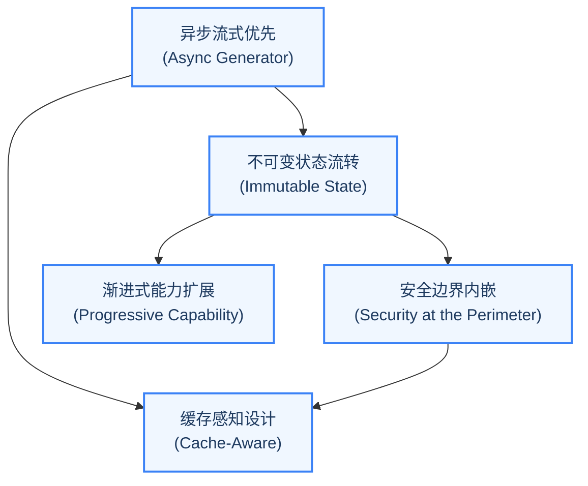

### 原则一：异步流式优先（Async Generator First）

Claude Code 的整个对话循环建立在 `AsyncGenerator` 之上。这不是一个随意的技术选择，而是一个深刻的架构决策。

传统的 LLM 调用通常采用请求-响应模式：发送 Prompt，等待完整响应，处理结果。但 Agent 的交互模式是根本不同的——Agent 可能在一个用户请求中执行多轮工具调用，每一轮都可能产生需要实时展示给用户的中间状态（思考过程、工具调用计划、执行进度）。

`AsyncGenerator` 完美地匹配了这个需求：

- **增量输出**：通过 `yield` 逐步产出流式事件，上层代码可以实时渲染。
- **可中断性**：调用者可以随时通过 `generator.return()` 或 `generator.throw()` 终止生成器。
- **背压控制**：如果消费者处理速度跟不上生产速度，生成器会自动暂停，避免内存溢出。

这种设计使得 Claude Code 的对话循环成为一个"事件流"而非"请求-响应对"。上层代码只需要一个 `for await...of` 循环就可以消费整个对话过程的所有事件。

**如果不这样设计会怎样？** 如果使用回调模式，每添加一种新事件类型就需要注册新的回调函数，随着事件类型的增多，代码会变成难以维护的"回调地狱"。如果使用 Promise 链，虽然解决了回调地狱，但失去了中途取消的能力——用户按 Ctrl+C 时无法优雅地停止正在进行的 API 调用。如果使用事件发射器（EventEmitter），虽然解决了取消问题，但引入了内存泄漏风险（忘记移除监听器）和类型安全问题（事件名是字符串）。

AsyncGenerator 是唯一同时满足"流式输出"、"可取消"和"类型安全"三个需求的方案。

### 原则二：安全边界内嵌（Security at the Perimeter）

Claude Code 的权限系统不是一个附加的安全层，而是被内嵌到了架构的核心管线中。工具调用从被 LLM 提出到最终执行，需要经过多个安全检查点：

1. **工具可见性过滤**：在将工具列表发送给 LLM 之前，根据权限规则过滤掉被禁止的工具。模型甚至无法"看到"它不应该使用的工具。
2. **输入校验**：工具的 `validateInput` 方法在权限检查之前执行，拒绝格式不合法的参数。
3. **权限决策**：`canUseTool` 回调综合考量权限模式（默认/Auto/Bypass）、工具的危险等级、用户的历史决策等因素，做出允许/拒绝/询问的决策。
4. **运行时防护**：即使通过了上述检查，工具执行过程中仍有沙箱限制、超时控制、输出大小限制等防护措施。

这个四阶段管线的设计哲学是"纵深防御"（Defense in Depth）——没有单一的安全检查点是"银弹"，但每一层都可以独立短路，阻止不安全的操作。

**为什么不使用简单的白名单？** 白名单方案看似简单，但存在致命缺陷：它假设所有操作都可以事先分类为"安全"或"不安全"。但现实中，安全性是上下文相关的——`rm -rf node_modules` 在开发环境中是安全的，但 `rm -rf /etc` 是危险的。同一个 Bash 工具、同一个命令模式，在不同参数下的风险等级完全不同。四阶段管线允许每一层根据上下文做出更精细的判断。

> **交叉引用：** 第 4 章将深入分析权限管线的四个阶段，包括规则匹配优先级、分类器自动审批和权限持久化机制。

### 原则三：缓存感知设计（Cache-Aware Architecture）

在 LLM 的 API 计价模型中，Prompt 缓存（Prompt Caching）可以显著降低成本和延迟。Claude Code 的架构从多个层面考虑了缓存友好性：

- **系统 Prompt 稳定性**：系统 Prompt 的构建方式被精心设计，确保在工具列表不变的情况下，Prompt 的字节内容保持一致，从而命中 API 侧的 Prompt 缓存。
- **子智能体的缓存共享**：Fork 模式下的子智能体会继承父智能体的 `renderedSystemPrompt`，避免重新生成可能因配置变化而不同的 Prompt，保证缓存命中率。
- **消息历史的不可变性**：已发送给 API 的消息不会被修改，只有追加新消息的操作，这保证了缓存键的稳定性。

缓存感知设计的影响是深远的：它不仅降低了 API 成本，还通过减少重复计算提高了响应速度，这对于需要频繁与 LLM 交互的 Agent 系统尤为关键。

**如果不这样设计会怎样？** 一个不关心缓存的 Agent 系统可能在每次 API 调用时都重新构建系统 Prompt，导致：(1) 每次 API 调用都需要处理完整的 Prompt，增加延迟和成本；(2) 微小的配置变化（如工具列表的排序变化）可能导致缓存全面失效；(3) 在子智能体场景下，父子智能体之间无法共享已缓存的 Prompt，导致重复计算。对于每天执行数百次 API 调用的生产级 Agent，这些浪费会迅速累积成可观的成本。

### 原则四：渐进式能力扩展（Progressive Capability）

Claude Code 提供了四级扩展模型，从内建到外部、从简单到复杂：

| 扩展级别 | 机制 | 适用场景 | 扩展者角色 |
|---------|------|---------|----------|
| **工具（Tool）** | 实现 `Tool` 类型接口 | 添加新的原子操作能力 | 核心开发者 |
| **技能（Skill）** | Markdown + 脚本的声明式工具 | 封装可复用的任务模板 | 高级用户 |
| **插件（Plugin）** | 带生命周期的工具包 | 组织相关工具和配置 | 生态开发者 |
| **MCP 服务器** | 标准化协议的外部工具集成 | 第三方工具生态 | 第三方开发者 |

这四级扩展模型的设计哲学是"渐进增强"：对于简单的需求，声明一个 Skill 就够了；对于复杂的集成，可以通过 MCP 协议连接外部服务。每一级都建立在前一级的基础之上，而非替代它。

特别值得关注的是 MCP（Model Context Protocol）的集成方式。Claude Code 不是一个封闭系统——它通过 MCP 协议可以动态发现和调用外部工具服务器提供的工具，这使得 Agent 的能力边界不是由开发者预设的，而是可以在运行时动态扩展的。

**如果不采用渐进式扩展会怎样？** 两种极端都不可取。如果只有"工具"一级扩展，第三方开发者必须修改核心代码才能添加新能力，这会严重限制生态系统的生长。如果只提供 MCP 一级扩展，简单的自定义需求也需要搭建一个完整的工具服务器，门槛过高。渐进式扩展让每一类贡献者都能在最适合自己的抽象层次上工作。

> **交叉引用：** 第三部分将详细讲解 MCP 协议的集成方式、插件系统的设计以及 Skill 的声明式工具定义。

### 原则五：不可变状态流转（Immutable State Flow）

Claude Code 的状态管理借鉴了 Redux/Zustand 的不可变状态模式。核心状态存储由一个极简的 store 实现完成。这个实现虽然简洁，但蕴含了重要的设计决策：

- **Updater 函数模式**：状态更新接收一个 `(prev: T) => T` 函数，而非新状态值本身。这确保了状态的每次更新都基于前一个状态，避免了竞态条件。
- **引用相等性检查**：通过引用比较确保只有真正发生变化时才触发通知，避免不必要的重渲染。
- **订阅/取消订阅模式**：监听器通过集合管理，返回清理函数，防止内存泄漏。

在对话循环层面，不可变性同样被严格遵守：跨迭代状态通过整体替换的方式更新，每次迭代开始时从状态对象解构出需要的字段，确保读操作使用的是不可变快照。

不可变状态流转的好处是多方面的：状态变化可预测、可追溯、可调试；在子智能体场景下，父智能体可以安全地将状态快照传递给子智能体而不担心被意外修改；在推测执行（Speculation）场景下，状态回滚变得简单而安全。

**如果不这样设计会怎样？** 如果使用可变状态（直接修改对象的字段），在并发场景下会出现经典的竞态条件：工具 A 的执行修改了状态，但工具 B 在读取状态时看到的是修改了一半的不一致数据。在子智能体场景下更危险——子智能体可能意外修改父智能体的状态，导致主循环的行为变得不可预测。这类 bug 极难复现和调试，因为它取决于异步操作的具体调度顺序。

---

## 实战练习：安装与初次诊断

在深入架构细节之前，让我们先通过一个简单的练习建立对 Claude Code 运行时的直观感受。这些练习按难度递进排列，每个都对应本章讨论的一个核心概念。

### 步骤一：安装 Claude Code

确保你的系统已安装 Node.js 18+ 或 Bun，然后执行：

```bash
npm install -g @anthropic-ai/claude-code
```

安装完成后，验证版本：

```bash
claude --version
```

> **最佳实践：** 建议在全局安装的同时，也在特定项目中通过 `npx` 或项目本地安装来使用 Claude Code。这确保了不同项目可以使用不同版本的 Claude Code 而不产生冲突。

### 步骤二：运行 `/doctor` 诊断命令

在终端中进入任意项目目录，启动 Claude Code 并输入 `/doctor`：

```bash
cd your-project
claude
> /doctor
```

`/doctor` 命令会执行一系列系统自检，包括：

1. **环境检查**：Node.js 版本、Bun 可用性、Git 安装状态
2. **权限配置检查**：当前权限模式、工具白名单/黑名单状态
3. **MCP 服务器连接状态**：已配置的 MCP 服务器是否正常响应
4. **API 连接性检查**：与 Anthropic API 的连接是否正常
5. **文件系统访问检查**：工作目录的读写权限

### 步骤三：观察系统自检流程

在 `/doctor` 运行时，注意观察以下现象：

- 系统检查的执行是**渐进式**的——每完成一项检查，结果就会即时显示，而不是等待所有检查完成后一次性输出。这正是"异步流式优先"原则在日常功能中的体现。
- 某些检查（如 API 连接性）可能会请求你的确认，这是"安全边界内嵌"原则的实践——即使是诊断操作，也需要经过权限管线。
- 检查结果会展示缓存的命中状态（如果适用），这是"缓存感知设计"的一个侧面。

### 步骤四：观察一次完整的工具调用

尝试向 Claude Code 发送一个简单的请求，如"列出当前目录下的所有 TypeScript 文件"。观察以下流程：

1. **思考阶段**：Claude Code 会展示它的思考过程（thinking），说明它打算使用哪个工具。
2. **工具调用阶段**：你会看到工具名称和参数（如 `GlobTool("*.ts")`），以及执行结果。
3. **回复阶段**：基于工具结果，Claude Code 给出最终回复。

这个简单的交互背后，正是我们在 1.2 节中描述的"对话主循环"在工作。试着在心中追踪这每一步对应的架构模块。

### 步骤五：思考题

1. 在你观察到的工具调用中，哪些工具是并发安全的？哪些不是？为什么？
2. 如果你按下 Ctrl+C 中断操作，系统会如何响应？这体现了哪个设计原则？
3. 如果连续发送 50 条消息，上下文窗口会怎样？系统应该如何应对？这个机制对应哪个设计原则？

---

## 关键要点总结

本章建立了理解 Claude Code 的概念框架，以下是核心要点：

1. **范式转移已经发生**：AI 编程助手正在从"对话伙伴"演进为"自主智能体"。这一转移的核心驱动力是工具调用能力的标准化，而 Agent Harness 是使这一转移成为现实的工程基础设施。理解这一点，就理解了为什么简单封装不够——Agent 需要的不是"API 调用"，而是一整套运行时环境。

2. **Agent Harness 是一个复杂的工程系统**：Claude Code 超过 51 万行代码的规模说明，构建一个可靠的 Agent 远不止"调用 LLM API + 执行工具"那么简单。流式输出、权限管控、上下文管理、错误恢复、状态持久化、可扩展性——每一个都是独立的工程挑战。这些挑战不会因为模型变得更强大而消失——恰恰相反，随着 Agent 执行更复杂的任务，这些工程问题会变得更加尖锐。

3. **五个核心模块定义了架构骨架**：入口模块、查询引擎、对话循环、工具类型、工具注册。理解这五个模块的职责和相互关系，就掌握了 Claude Code 的宏观架构。它们之间的关系是严格的层次调用关系：入口模块创建查询引擎，查询引擎驱动对话循环，对话循环使用工具系统，工具系统由工具注册中心统一管理。

4. **五大设计原则是贯穿全局的红线**：异步流式优先、安全边界内嵌、缓存感知设计、渐进式能力扩展、不可变状态流转——这五个原则不是孤立的设计点，而是相互支撑的架构决策网络。在后续章节中，我们将反复看到它们在具体子系统中的体现。每当你遇到一个"为什么这样设计"的问题，答案几乎都可以追溯到这五个原则之一。

在下一章中，我们将深入对话主循环的内部，逐步分析那个精巧的 AsyncGenerator 对话循环，理解 Agent 是如何在"调用 LLM - 解析工具调用 - 执行工具 - 注入结果"的循环中自主推进任务的。这是全书中最核心的一章——因为对话主循环是 Agent Harness 的"心脏"，理解了它，你就理解了 Agent 的"脉搏"。


---

# 第2章：对话循环 -- Agent 的心跳

> "The truth is like a lion. You don't have to defend it. Let it loose. It will defend itself."
> -- Augustine of Hippo

**学习目标：** 阅读本章后，你将能够：

- 深入理解异步生成器驱动的对话主循环机制
- 掌握 Agent 与模型交互的完整状态流转模型
- 理解预处理管线（Snip、Microcompact、Context Collapse、Autocompact）的设计原理
- 分析七种 Continue 路径的触发条件和恢复策略
- 评估依赖注入模式对测试可维护性的影响

---

## 2.1 异步生成器：对话循环的骨骼

Claude Code 的对话主循环是一个以 `async function*` 定义的异步生成器。它不是一次性执行完毕的普通函数，而是一个可暂停、可恢复、可取消的"活"的流程。每一次 `yield` 就像心跳的一次搏动，将流式事件推向调用方。

这个设计选择值得用更多篇幅来理解。在传统的编程模型中，函数调用是同步的：调用者发起请求，被调用者执行计算，返回结果。但 Agent 的交互模式打破了这种同步假设——模型可能需要几十秒才能完成一次响应，而且响应是逐 token 到达的；工具执行可能耗时数分钟，期间需要实时反馈进度；用户可能随时中断操作，要求立即停止。

面对这些需求，传统的函数调用模型力不从心。异步生成器提供了完美的答案：它像一个可以随时暂停和恢复的"协程"，在"生产者"（对话循环）和"消费者"（UI 渲染层）之间建立了一条实时的事件管道。

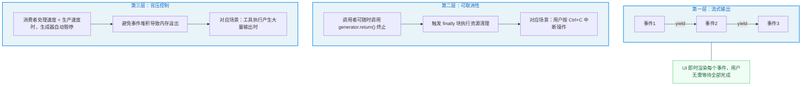

### 函数签名与 AsyncGenerator 模式

整个对话循环的入口是一个导出的异步生成器函数，它接受一个参数对象，可向外产出五种类型的事件（流式事件、请求开始事件、消息、墓碑消息、工具调用摘要），最终返回一个表示对话终结状态的对象。

这个函数签名蕴含了三层设计决策：

1. **Yield 类型联合体（Union of yielded types）**：生成器可向外产出五种类型的事件——流式 token 到达事件、API 请求开始事件、用户/助手/系统消息、标记已废弃消息的墓碑消息、工具调用摘要消息。这五种事件覆盖了对话过程中所有需要传递给 UI 层的信息。使用联合类型而非多个独立的生成器，确保了事件的时序一致性——UI 看到的事件顺序与产生顺序完全一致。

2. **返回类型 Terminal**：生成器最终返回一个终结状态对象，表示对话的终结原因。调用方通过 `for await (... of query(...))` 消费事件流，当循环自然结束时，生成器的 `return` 值即为终止原因。这种"yield 过程、return 结论"的模式使得上层代码可以清晰地分离"过程中的处理"和"结束后的收尾"。

3. **参数对象**：将所有入参封装在一个结构化对象中，而非散列参数，使得调用方可以按需提供字段。关键字段包括消息历史、系统提示词、权限检查函数、工具执行上下文、最大循环次数等。

为什么选择 AsyncGenerator 而非回调或 Promise？因为生成器天然适配"流式生产-流式消费"的模型。模型的响应是逐 token 到达的，工具的执行结果是逐步产出的，生成器的 `yield` 机制让每一层都可以做到"有数据就推送，没数据就等待"，而不需要回调地狱或 Promise 链。

> **设计哲学对比：** 如果使用回调模式，你需要为每种事件类型注册独立的回调函数，代码会变成分散在各处的回调处理逻辑。如果使用 Promise 链，虽然避免了回调地狱，但 Promise 是"一次性的"——它只能 resolve 一次，无法表达持续的事件流。如果使用 RxJS Observable，虽然功能强大，但引入了沉重的依赖和陡峭的学习曲线。AsyncGenerator 是"刚刚好"的方案——原生语言支持、零额外依赖、类型安全、天然支持流式和取消。

### 流式事件类型

对话循环中流转的事件可分为以下几类，它们共同构成了对话过程的"心跳信号"：

- **stream_request_start**：每次 API 请求开始前发出，告知 UI 层一个新请求即将发起。在循环的每次迭代开头都会发出此事件。这个事件的实用价值在于 UI 可以展示"正在思考..."的状态指示器。

- **StreamEvent**：来自 Anthropic API 的原始流式事件，包括文本块增量（`content_block_delta`）、thinking 块、tool_use 块等。这些事件直接从 API 响应流透传给 UI。想象你在看一场直播——StreamEvent 就是视频流中的每一帧画面，UI 层负责将这些画面拼接成流畅的视频。

- **Message**：结构化的消息对象，包括 `AssistantMessage`（助手回复，可能包含 tool_use 块）、`UserMessage`（用户输入或 tool_result）、`SystemMessage`（系统通知）等。与 StreamEvent 不同，Message 是经过解析和结构化的——相当于直播结束后的回放，画面已被编辑和组织。

- **TombstoneMessage**：当流式回退（streaming fallback）发生时，部分已产出的消息需要被标记为废弃。墓碑消息告诉 UI 移除对应的历史消息。这个名字来自程序员熟知的"墓碑标记"模式——就像墓碑标记了一个生命的终结，TombstoneMessage 标记了一条消息的"失效"。

- **ToolUseSummaryMessage**：在一批工具执行完成后，异步生成的简要摘要，用于在 UI 中折叠展示工具调用结果。这对于长时间的 Agent 会话尤为重要——如果没有摘要，几十次工具调用的完整输出会淹没整个屏幕。

### 消息类型体系

Claude Code 的消息系统定义了清晰的角色分工。核心消息类型包括：

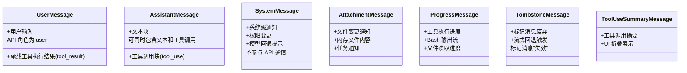

- **UserMessage**：用户的输入消息，也承载工具执行结果（tool_result）。在 API 的视角里，工具结果总是以 user 角色发送。这个设计可能看起来违反直觉——为什么工具结果是"user"角色？原因是 API 协议层面只有三种角色（system/user/assistant），工具结果需要被模型"看到"，所以必须以 user 角色发送。这是一个工程约束驱动设计决策的典型案例。
- **AssistantMessage**：模型返回的消息，可能包含文本块和 tool_use 块。当模型检测到需要调用工具时，响应中会包含 `type: 'tool_use'` 的内容块。AssistantMessage 的关键特性是它可能同时包含文本和工具调用——模型可能先输出一段解释（"我需要查看你的文件"），然后附加一个工具调用。这种"边说边做"的模式让 Agent 的行为更加透明。
- **SystemMessage**：系统级通知，如权限变更、模型回退提示等。不参与 API 通信，仅在 UI 展示。SystemMessage 是"第四面墙"——它不参与模型对话，但告诉用户系统内部正在发生什么。
- **AttachmentMessage**：附件消息，承载文件变更通知、内存文件（CLAUDE.md）内容、任务通知等附加信息。
- **ProgressMessage**：工具执行的进度消息，用于实时反馈工具运行状态（如 Bash 命令的输出流、文件读取进度等）。

> **交叉引用：** 消息类型与第 3 章的工具渲染方法紧密相关。每个工具定义的 `renderToolUseMessage`、`renderToolResultMessage` 等方法决定了不同消息类型在终端中的视觉呈现方式。

---

## 2.2 一个完整 Turn 的生命周期

现在让我们跟随一个完整的 Turn——从用户按下回车键到模型完成响应或决定调用工具——理解 `queryLoop` 函数内部的完整流程。

用医学来类比，一个 Turn 就像一次完整的诊断过程：医生（模型）先查看病历（上下文预处理），然后与病人交流（API 调用），可能需要安排检查（工具调用），拿到检查结果后（工具执行）做出诊断（最终回复）。如果检查结果不足以确诊，医生会安排更多检查（下一轮循环）。

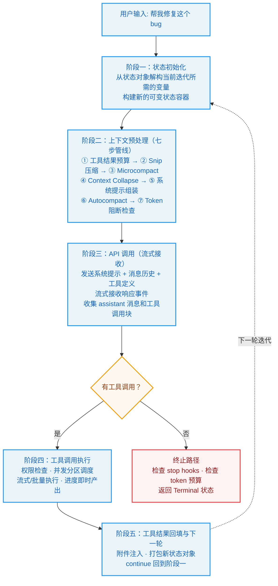

### 阶段一：状态初始化

`queryLoop` 是一个 `while(true)` 无限循环。每次迭代代表一次"模型调用 + 工具执行"的完整回合。在循环顶部，函数从状态对象中解构出当前迭代所需的变量，包括工具使用上下文、消息列表、自动压缩追踪、恢复计数器等。

状态对象是一个可变状态容器，包含跨迭代传递的全部状态：消息列表、工具上下文、自动压缩追踪、恢复计数器、turn 计数等。每次 `continue` 回到循环顶部时，都会写入一个新的状态对象。

这个设计的关键洞察是：**状态在"读"和"写"之间有明确的分界线。** 在每次迭代的开始，函数通过解构一次性读取所有需要的状态字段（快照语义）；在迭代结束时，通过构造新对象一次性写入更新后的状态（原子更新语义）。这避免了在迭代过程中部分更新导致的不一致问题。

### 阶段二：上下文预处理

在调用模型之前，循环执行一系列预处理步骤。这些步骤构成了一个精心设计的"压缩管线"，目的是在有限的上下文窗口中保留最有价值的信息：

1. **工具结果预算**：对过大的工具结果进行截断或持久化到磁盘，确保不超过上下文窗口限制。这类似于计算机科学中的"分页"机制——当数据太大无法全部放入内存（上下文窗口）时，将部分数据存储到磁盘，只保留摘要或引用。

2. **Snip 压缩**：如果启用了历史裁剪功能，会对过长的历史消息进行裁剪。Snip 是最"粗暴"的压缩方式——直接截断消息内容。它通常用于处理工具返回的超长输出（如大型文件的完整内容）。

3. **Microcompact**：在自动压缩之前进行轻量级压缩，利用缓存编辑技术减少 token 消耗。Microcompact 的精妙之处在于它是"缓存友好"的——它尽量复用 API 侧已缓存的 token，避免因压缩导致缓存全面失效。

4. **Context Collapse**：上下文折叠是一种更细粒度的压缩策略，它在不丢失信息的情况下将连续消息折叠为紧凑视图。可以把 Context Collapse 想象为将一段对话中的"你好"、"好的"、"我明白了"这类确认性消息折叠为一行——信息不丢，但占用的空间更少。

5. **系统提示组装**：将基础系统提示与动态上下文（如当前工作目录、用户配置等）合并为完整的系统提示。这一步的设计直接影响了缓存命中率——如果组装顺序不稳定，每次调用生成的 Prompt 字节内容可能不同，导致缓存失效。

6. **Autocompact**：如果上下文超过阈值，自动压缩机制会触发，将历史对话摘要为压缩后的消息，然后替换待发送的消息列表。Autocompact 是压缩管线的"最后一道防线"——当其他轻量级压缩手段都无法将上下文缩减到限制以内时，它会执行一次全量摘要。

7. **Token 阻断检查**：如果 token 数超过硬性限制，直接返回错误消息，不再发起 API 调用。这是一个"快速失败"机制——与其发送一个注定会失败的 API 请求，不如在本地就阻止它。

> **最佳实践提示：** 这七步管线的设计遵循了一个重要原则：**压缩手段从轻量到重量排列，每一步都先尝试最小代价的方案。** 这个原则在你自己构建 Agent 系统时也值得遵循——先用 Snip 裁剪过长内容，再用 Microcompact 减少缓存浪费，再用 Context Collapse 折叠冗余信息，最后才用 Autocompact 做全量摘要。因为每一步都会丢失一些信息，应该尽量延迟最"激进"的压缩手段的使用。

### 阶段三：API 调用

所有预处理完成后，进入核心的 API 调用阶段。这里使用注入的模型调用依赖发起流式请求，将组装好的消息列表、系统提示和工具定义传递给模型 API。模型调用函数返回一个异步生成器，逐个产出流式事件。每次收到事件，循环执行以下逻辑：

- 如果事件包含 assistant 消息，将其加入助手消息数组。
- 如果事件包含工具调用块，将其收集起来，并标记需要后续工具执行。
- 如果启用了流式工具执行，在收到工具调用块时立即开始执行工具，而不必等待整个响应完成。

这个阶段的一个微妙之处在于：模型可能在一个响应中同时包含文本内容和工具调用。例如，模型可能先输出"我来看看你的 package.json 文件"，然后附加一个 Read 工具调用。循环需要正确处理这种混合输出——既要 yield 文本事件让 UI 渲染，又要收集工具调用块为后续执行做准备。

### 阶段四：工具调用检测与执行

当流式响应结束后，循环检查是否需要执行工具。如果模型没有请求调用工具，进入终止路径，检查各种退出条件（stop hooks、token budget 等）后返回。

如果模型请求了工具调用，循环执行工具：根据是否启用了流式执行，选择从流式执行器获取剩余结果，或使用传统的批量执行函数。

> **交叉引用：** 工具执行的详细机制（并发分区、流式执行器、状态机）在第 3 章的工具编排引擎部分有深入分析。

工具执行同样是一个异步生成器。每产出一个结果消息，循环就将其 yield 给上层消费者（UI），同时收集到工具结果数组中。

这个设计体现了一个重要的工程原则：**"结果收集"和"结果传递"是解耦的。** 工具结果既被收集到数组中用于下一轮 API 调用，又被 yield 给 UI 用于实时展示。这两个关注点通过同一个 yield 操作同时完成，避免了额外的状态同步逻辑。

### 阶段五：工具结果回填与下一轮

工具执行完毕后，循环执行附件注入（内存文件、文件变更通知、排队命令等），然后将所有消息（原始消息 + 助手消息 + 工具结果）打包为新的状态对象，通过 `continue` 回到 `while(true)` 的顶部。

下一轮迭代将使用这个扩展后的消息列表重新调用模型，模型将看到之前的工具结果，然后决定是继续调用工具还是给出最终回复。

附件注入是一个容易忽视但非常重要的步骤。想象这样一个场景：在工具执行期间，用户修改了 CLAUDE.md 文件。如果不注入这个变更，模型在下一轮调用中可能基于过时的配置做出决策。附件注入确保了每一轮循环开始时，模型都拥有最新的环境信息。

### 终止条件判断

对话循环的终止发生在多个位置，每个终止原因对应不同的系统状态和清理逻辑：

| 终止原因 | 触发条件 | 用户体验 | 设计意图 |
|----------|----------|---------|---------|
| `completed` | 模型正常回复且无工具调用 | Agent 给出最终回复 | 正常的"成功完成"路径 |
| `aborted_streaming` | 用户中断（Ctrl+C） | 操作立即停止 | 用户主动中断，需要即时响应 |
| `aborted_tools` | 工具执行期间中断 | 当前工具被取消，结果丢弃 | 工具执行可能耗时较长，需要中断支持 |
| `max_turns` | 达到最大循环次数 | Agent 停止并说明原因 | 防止无限循环消耗 token |
| `blocking_limit` | Token 数超过硬性限制 | Agent 报错退出 | 硬性安全边界，防止 API 错误 |
| `prompt_too_long` | 上下文过长且恢复失败 | Agent 报错退出 | 所有压缩手段已用尽 |
| `model_error` | API 调用异常 | Agent 报错并展示错误信息 | 网络或服务端问题的优雅降级 |
| `stop_hook_prevented` | Stop hook 阻止继续 | Agent 停止并说明原因 | 用户配置的自动停止条件 |
| `hook_stopped` | 工具 hook 阻止继续 | Agent 停止并说明原因 | 外部 Hook 脚本的决定 |
| `image_error` | 图片尺寸/格式错误 | Agent 报错退出 | 输入数据格式问题 |

> **设计洞察：** 十种终止原因的精细划分并非过度设计。在调试 Agent 行为时，准确的终止原因是定位问题的第一线索。如果所有错误都返回一个笼统的"error"，开发者将无从判断是 API 超时、上下文溢出还是用户中断导致了问题。细粒度的终止原因是"可观测性"（Observability）的基础。

这些终止原因还可以分为三类：

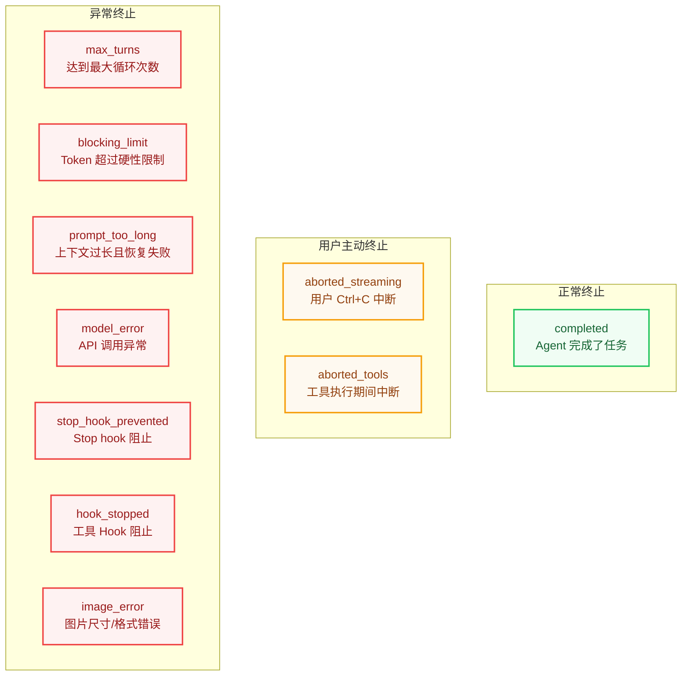

- **正常终止**：`completed`——Agent 完成了任务
- **用户主动终止**：`aborted_streaming`、`aborted_tools`——用户决定停止
- **异常终止**：其余七种——系统遇到了无法继续的情况

对于异常终止，系统在返回终止状态之前会执行清理逻辑：取消正在执行的工具、释放资源引用、记录终止原因到日志。这些清理逻辑确保了即使 Agent 异常退出，也不会留下"脏"的状态。

---

## 2.3 依赖注入与可测试性

### QueryDeps 接口

对话主循环的设计中最值得注意的工程决策之一是依赖注入模式。系统定义了一个精简的依赖接口，包含四个核心依赖：模型调用函数、轻量压缩函数、自动压缩函数和 UUID 生成器。

生产环境的依赖实现返回真实的 API 调用、压缩逻辑和随机 UUID 生成器。

在主循环中，通过参数获取依赖，如果未提供则使用生产环境默认值。测试时，调用方可以传入自定义的依赖对象，替换掉真实的 API 调用、压缩逻辑和 UUID 生成器。正如设计注释所说：

> "Passing a deps override into QueryParams lets tests inject fakes directly instead of spyOn-per-module -- the most common mocks (callModel, autocompact) are each spied in 6-8 test files today with module-import-and-spy boilerplate."

这段注释揭示了一个重要的工程洞察：在没有依赖注入的情况下，测试代码需要通过模块级别的 spy/mock 来替换外部依赖。这种 spy-per-module 的模式有几个问题：它耦合了测试代码与模块内部结构，当模块重命名或移动时测试需要同步修改；它在多个测试文件中重复相同的 mock 样板代码；它可能因为模块缓存导致测试之间的状态泄漏。

依赖注入优雅地解决了这些问题：测试只需传入一个自定义的依赖对象，不关心模块内部结构；每个测试用例创建独立的依赖实例，避免了状态泄漏；依赖接口是明确的，当接口变化时编译器会指出需要更新的测试。

### 为什么对话循环采用函数式设计

Claude Code 的对话循环选择 `async function*` 而非 class，这个选择有其深层考量：

1. **天然的状态隔离**：每次调用对话函数都创建一个全新的闭包，所有可变状态都是函数局部变量。没有跨调用的状态泄漏风险。对比 class 方案：如果对话循环是一个 class 的方法，那么多个并发的对话实例可能意外共享 class 实例上的属性，导致状态污染。

2. **生成器的背压语义**：`yield` 暂停执行直到消费者请求下一个值。这意味着如果 UI 层无法跟上产出速度，生成器会自动暂停，而不会堆积内存。这是生产级系统必须考虑的问题——当工具执行产生大量输出（如 `npm install` 的完整日志）时，没有背压控制的系统可能因为内存堆积而崩溃。

3. **取消传播**：JavaScript 生成器有 `.return()` 方法，调用它会触发生成器的 finally 块并清理资源。结合资源管理声明，清理逻辑变得确定性的。这意味着用户按 Ctrl+C 时，不仅能停止对话循环，还能确保所有正在执行的工具被正确取消、所有临时资源被清理。

4. **可组合性**：`yield*` 委托语法允许将子生成器的输出直接转发。主循环的结果通过委托语法传递给外层生成器，而工具执行也通过同样的机制串联。这种"生成器链"的模式使得不同层次的代码可以无缝组合——对话循环产出事件，工具执行也产出事件，上层 UI 只需要一个统一的 `for await...of` 循环就能消费所有层次的事件。

> **反模式警告：** 如果你正在构建自己的 Agent 循环，避免将对话状态存储在全局变量或 class 的实例属性中。全局状态使得并发测试变得不可能，class 实例状态使得多个对话实例可能互相干扰。函数闭包是最安全的状态容器——它天然隔离、天然不可共享。

---

## 2.4 状态转换模型

### State 类型与 Continue/Terminal

对话循环的核心状态机由两个概念驱动：可变循环状态（State）和终止信号（Terminal）。

State 类型定义了循环的完整可变状态，包含消息列表、工具使用上下文、自动压缩追踪状态、输出 token 恢复计数器、是否已尝试响应式压缩、输出 token 覆盖限制、待处理的工具摘要、stop hook 是否激活、turn 计数，以及上一次继续循环的原因。每次 `continue` 回到循环顶部时，都会构造一个全新的状态对象。`transition` 字段记录了上一次 continue 的原因，用于在恢复逻辑中避免重复执行相同的恢复路径。

Terminal 和 Continue 类型定义在独立的模块中。Terminal 标记对话的终结（携带 reason 字段），而 Continue 标记继续循环的决策（携带 reason 和可选的附加信息）。

这个三元模型（State + Continue + Terminal）的精妙之处在于它用类型系统强制了循环的正确性：

- State 是"可变但可控"的数据容器，每次 continue 都创建新实例
- Continue 是"继续"的信号，携带原因和附加信息，指导下一轮迭代的行为
- Terminal 是"终止"的信号，携带原因，结束循环并返回给调用方

### 状态转换的决策逻辑

整个循环的状态转换可以归纳为以下状态机：

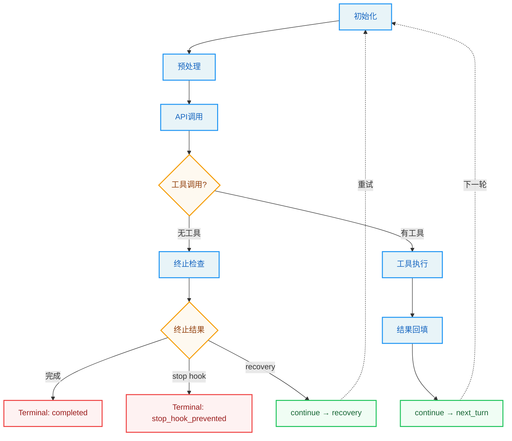

关键的转换路径包括：

1. **next_turn**：正常的工具调用后继续。消息列表扩展为原始消息加上助手消息和工具结果，turn 计数递增。这是最常见也是最简单的转换路径。

2. **max_output_tokens_recovery**：模型输出被截断时，注入恢复消息后继续循环。恢复消息指导模型从截断处继续。最多重试 3 次。这个路径的存在是因为 LLM 有时会在输出过长时被 API 截断——不是错误，而是模型"说得太多"了。恢复消息相当于告诉模型"你刚才的话说到一半被打断了，请从中断处继续"。

3. **max_output_tokens_escalate**：首次截断时尝试提升输出 token 限制，而非注入恢复消息。这是一种更优雅的恢复策略——与其让模型从中断处继续，不如给它更大的输出空间，让它一次性完成。只有当提升限制后仍然截断时，才回退到 recovery 路径。

4. **reactive_compact_retry**：上下文过长时，通过响应式压缩恢复。压缩失败则终止循环。这个路径是对话循环的"紧急刹车"——当所有预防性压缩手段都没能阻止上下文溢出时，reactive compact 作为最后的恢复手段尝试挽救对话。

5. **collapse_drain_retry**：上下文折叠的溢出恢复路径。优先于响应式压缩执行，因为折叠保留粒度更细的上下文。这个优先级排序体现了"最小信息损失"原则——在所有恢复手段中，优先使用丢失信息最少的方法。

6. **stop_hook_blocking**：Stop hook 返回阻塞错误时，将错误注入消息列表后继续，让模型有机会修正。这个路径展示了 Agent 系统的一个关键设计理念：**错误不一定是终止条件，也可以是反馈信号。** 模型收到 hook 的错误信息后，可能会调整策略并尝试不同的方案。

7. **token_budget_continuation**：Token 预算管理触发的继续，注入一个提示消息提醒模型注意预算。这类似于手机流量套餐的"余额不足提醒"——不是立即断网，而是提醒用户注意剩余流量。

每条 continue 路径都精心构造了新的状态对象，确保不同的恢复策略之间不会冲突。`transition` 字段的存在使得后续迭代可以识别"我是怎么来到这里的"，从而做出更智能的决策。

> **最佳实践：** 在设计自己的 Agent 循环时，为每条 Continue 路径记录原因（transition reason）是一个简单但极其有效的调试手段。当 Agent 行为异常时，追溯 transition 链可以帮助你快速定位是哪一次转换引入了问题。

---

## 实战练习

**练习 1：追踪一次完整的工具调用流**

在对话主循环的以下关键位置添加日志：
- 请求开始时（stream_request_start 事件发出后）
- 工具调用块检测时（第一个 tool_use 块到达时）
- 工具执行开始时（runTools 或 StreamingToolExecutor 被调用时）
- 下一轮状态构建时（continue 之前）

向 Claude Code 发送一个需要调用工具的请求（如"读取当前目录的 package.json"），观察消息如何从 API 流经工具执行，再回填到下一轮 API 调用。

**扩展思考：** 如果连续发送三个需要工具调用的请求，观察 turn 计数如何递增。尝试在工具执行期间按 Ctrl+C，观察 `aborted_tools` 终止路径的清理逻辑。

**练习 2：模拟一个 max_output_tokens 恢复**

在测试环境中注入自定义依赖，让模型调用函数返回一个输出被截断的助手消息。观察循环如何跳过首次的 yield（withheld 机制），尝试提升 token 限制，并在重试次数耗尽后 finally surface 错误。

**扩展思考：** 修改截断次数的阈值，观察 escalate 和 recovery 两条路径的切换条件。如果截断恰好发生在工具调用块内部（工具名只输出了一半），系统会如何处理？

**练习 3：理解依赖注入的价值**

思考：如果模型调用函数是直接硬编码在循环中，测试需要多少 mock 才能覆盖主循环的各种分支？对比当前依赖注入方案，评估其对测试可维护性的影响。

**具体估算：** 假设主循环有 7 种 Continue 路径和 10 种终止原因。如果没有依赖注入，测试每个分支都需要：(a) 拦截模块级别的 API 调用，(b) 控制压缩函数的行为，(c) 固定 UUID 生成。估算一下 mock 样板代码的总量，然后考虑当模块结构变化时这些 mock 需要多少维护工作。

**练习 4：上下文压缩管线实战**

向 Claude Code 发送一系列需要大量上下文的请求（如"读取这个大文件，然后基于它生成文档，再运行测试"），观察压缩管线如何被触发。注意以下线索：
- 何时触发 Snip 压缩（工具结果被截断的标志）
- 何时触发 Autocompact（对话历史被摘要的标志）
- 压缩后模型的推理能力是否受到影响

> **交叉引用：** 上下文压缩管线的详细实现将在第二部分的核心篇中深入分析，包括缓存感知的压缩策略和上下文折叠的粒度控制。

---

## 关键要点

1. **AsyncGenerator 是 Agent 循环的最佳载体**：`yield` 提供了自然的流式输出，`yield*` 提供了子生成器委托，`.return()` 提供了确定性取消。这些特性完美匹配了 Agent "调用模型 -> 执行工具 -> 回填结果 -> 再调用"的核心循环。这不是"也可以用其他方案"的折中选择，而是"其他方案都有明确短板"的最优选择。

2. **预处理管线是上下文管理的核心**：Snip、Microcompact、Context Collapse、Autocompact 四层压缩策略层层递进，从轻量裁剪到全量摘要，确保 Agent 在无限对话中始终保持在 token 预算内。理解这四层管线的设计原则（从轻量到重量排列），有助于你在自己的 Agent 系统中设计上下文管理策略。

3. **状态不可变，转换可追踪**：每次 continue 都构造新的 `State`，配合 `transition` 字段，使得循环的每一次跳转都有据可查。这是函数式设计在命令式循环中的优雅折中。在实际调试中，transition 链是追踪 Agent 行为的"面包屑"。

4. **依赖注入使测试成为可能**：`QueryDeps` 的四个依赖（callModel、microcompact、autocompact、uuid）覆盖了循环的核心副作用，使得测试可以在不访问 API 的情况下验证状态转换逻辑。这四个依赖的选择也很有讲究——它们正好是循环中所有"与外部世界交互"的边界点，将它们抽象为接口使得循环内部变成了纯逻辑。

5. **终止不是失败，是设计**：十种终止原因各有其触发条件和清理逻辑。理解这些终止路径是理解整个循环健壮性的关键。在生产级 Agent 系统中，错误的终止处理比错误的正常流程更危险——因为它可能导致资源泄漏、状态不一致或用户数据丢失。

在下一章中，我们将转向 Agent 的"双手"——工具系统。如果说对话循环是 Agent 的心脏，那么工具系统就是 Agent 的四肢。理解了工具系统的设计，你将知道 Agent 是如何从"只能说话"进化到"能够做事"的。


---

# 第3章：工具系统 -- Agent 的双手

> "If all you have is a hammer, everything looks like a nail."
> -- Abraham Maslow

**学习目标：** 阅读本章后，你将能够：

- 掌握 Claude Code 45+ 工具的设计模式，理解五要素协议的设计哲学
- 理解工具定义协议、注册机制、编排引擎的完整架构
- 分析并发分区策略的调度原理和实际效果
- 理解 StreamingToolExecutor 四阶段状态机的精妙设计
- 评估延迟工具发现机制的工程价值

---

Maslow 的这句话用在 Agent 工具系统上再贴切不过。如果 Agent 只有一个 Bash 工具，所有任务都会变成 Shell 命令——读取文件用 `cat`，搜索代码用 `grep`，编辑文件用 `sed`。这虽然可行，但违反了"使用正确工具解决正确问题"的工程原则。Claude Code 的工具系统提供了 45+ 个专门化工具，每个工具针对特定的操作类型做了优化——这就好比为不同任务配备不同的专业工具，而不是用一把锤子解决所有问题。

## 3.1 工具定义协议

Claude Code 的每个工具都遵循一个统一的类型契约 -- `Tool<Input, Output, Progress>`。这个契约定义在工具类型核心模块中，是整个工具系统的基石。理解它，就理解了 Agent "双手"的解剖结构。

这个协议的设计哲学可以用"接口即架构"来概括：通过定义严格的类型接口，工具系统的所有架构约束——权限检查、并发控制、进度报告、UI 渲染——都被编译器强制执行。开发者无法"忘记"实现某个方法，因为类型检查器会立即报错。

### 核心类型：Tool、Tools、ToolDef、buildTool

`Tool` 类型是一个泛型接口，接受三个类型参数：

- `Input extends AnyObject`：使用 Zod schema 定义的工具输入类型，确保每个工具的输入都是一个结构化对象。
- `Output`：工具的输出类型，自由定义。
- `P extends ToolProgressData`：工具的进度数据类型，用于流式反馈。

三个泛型参数的分离是一个深思熟虑的设计决策。如果将输入和输出类型合并为一个，工具的签名将变得更难阅读；如果省略进度类型，工具就无法在执行过程中提供实时反馈。三者分离使得每个关注点都有独立的类型空间，编译器可以分别检查。

每个工具必须实现的五要素如下：

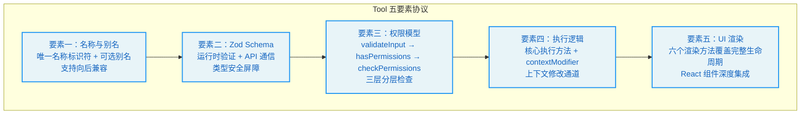

**要素一：名称与别名**

每个工具拥有一个唯一的名称标识符，以及可选的别名用于向后兼容。当工具重命名时，旧名称可以通过别名继续匹配。工具查找函数同时检查主名称和别名。

别名机制的存在揭示了一个工程实践原则：**在公开 API 中，重命名是"只增不减"的操作。** 即使某个工具的名称不再准确（如从 `SearchTool` 重命名为 `GrepTool`），旧名称也必须通过别名保持可用，否则依赖旧名称的配置、脚本和用户习惯都会被打破。

**要素二：Zod Schema**

每个工具使用 Zod 定义其输入参数的 schema。Zod schema 承担了双重职责：

1. **运行时验证**：在工具执行之前，LLM 生成的参数经过 Zod 解析，确保类型和约束的正确性。这是"不要信任外部输入"原则的体现——LLM 的输出是不可控的，工具必须自我保护。
2. **API 通信**：Zod schema 通过转换层生成 JSON Schema 发送给 API，让模型知道每个参数的含义和约束。这意味着 schema 定义就是工具的"使用说明书"——模型看到的参数描述来自 Zod schema 中的 `describe()` 调用。

> **交叉引用：** Zod schema 的验证发生在第 4 章权限管线的第一阶段（validateInput），这是"安全边界内嵌"设计原则的具体体现。

**要素三：权限模型**

权限相关的三个方法构成了分层的权限检查管线：

1. **第一层：输入验证（validateInput）**：在权限检查之前运行，用于拒绝无效输入。这是"数据合法性"检查，与权限无关。
2. **第二层：权限检查（hasPermissionsToUseTool + checkPermissions）**：包含工具特定的权限逻辑。不同工具的权限检查粒度不同——Read 工具可能只检查路径是否在允许列表内，而 Bash 工具需要解析命令、评估风险等级。
3. **第三层：运行时属性判断**：影响工具的并发调度策略。例如 `isConcurrencySafe()` 标记工具是否可以并行执行。

三层分离的设计哲学是"关注点分离"：数据验证不关心权限策略，权限策略不关心并发调度。每层只做一件事，但三层串联起来提供了完整的防护。

**要素四：执行逻辑**

这是工具的核心执行方法。它接收解析后的输入参数、工具使用上下文、权限检查函数、父消息引用和一个可选的进度回调。返回的结果携带输出数据和可选的上下文修改器。

上下文修改器（contextModifier）允许工具在执行后修改上下文（如更新文件缓存），这是工具影响后续行为的关键通道。例如，FileWriteTool 在写入文件后会通过 contextModifier 更新文件状态缓存，使得后续的 FileReadTool 能看到最新的文件内容。

**要素五：UI 渲染**

工具拥有丰富的渲染方法集合，覆盖了完整的 UI 生命周期：

- `renderToolUseMessage`：工具调用开始时展示（如 "Reading src/foo.ts"）
- `renderToolUseProgressMessage`：工具执行中的进度展示
- `renderToolResultMessage`：工具结果展示
- `renderToolUseRejectedMessage`：权限被拒绝时的展示
- `renderToolUseErrorMessage`：执行出错时的展示
- `renderGroupedToolUse`：多个并行工具的分组展示

每个渲染方法都返回 `React.ReactNode`，使得工具系统与 React 渲染管线深度集成。这个设计选择意味着工具的 UI 表现可以像 React 组件一样灵活——进度条、颜色高亮、折叠面板、表格布局，都可以通过 React 组件实现。

这六个渲染方法的覆盖范围值得注意：它涵盖了工具调用的"生老病死"——从开始（renderToolUseMessage）到进行中（renderToolUseProgressMessage），到成功（renderToolResultMessage）、被拒（renderToolUseRejectedMessage）、出错（renderToolUseErrorMessage），以及并行执行的分组展示（renderGroupedToolUse）。这种完整的生命周期覆盖确保了用户在任何状态下都能看到清晰、有意义的 UI 反馈。

### buildTool 工厂函数

`buildTool` 是创建工具的标准工厂函数。它接收一个部分工具定义，自动填充安全默认值。这些默认值遵循"fail-closed"原则：安全性相关的方法（如并发安全判断、只读判断）默认为 false，工具必须显式声明自己安全才能享受并发等优化。

这个设计哲学可以用一个类比来理解：在机场安检中，默认假设所有行李都需要检查（fail-closed），只有经过特殊认证的旅客（如外交官）才能走快速通道。如果反过来——默认放行，只在发现问题时才拦截（fail-open）——那么任何一个漏检都可能造成安全事故。

类型系统通过巧妙的类型计算，让开发者只需提供必要字段，而工厂函数的返回类型保证完整的工具接口。如果开发者在定义中提供了某个方法，类型系统会使用开发者提供的签名；如果省略了，则使用默认签名。这种"可选覆盖、安全默认"的模式在工程实践中非常有效——简单工具只需几行代码，复杂工具可以完全自定义。

---

## 3.2 工具注册与动态发现

### getAllBaseTools() 完整工具清单

`getAllBaseTools()` 是所有内建工具的注册中心。它返回一个扁平数组，包含了 Claude Code 所有可用的工具。通过这个函数，我们可以统计出核心工具清单，并按功能分类：

| 类别 | 工具 | 职责 | 并发安全 |
|------|------|------|---------|
| 执行 | BashTool | 运行 Shell 命令 | 否（副作用） |
| 文件 | FileReadTool, FileEditTool, FileWriteTool | 读取、编辑、写入文件 | Read 是，Edit/Write 否 |
| 搜索 | GlobTool, GrepTool | 文件名模式匹配、内容搜索 | 是 |
| 笔记本 | NotebookEditTool | Jupyter Notebook 编辑 | 否 |
| 网络 | WebFetchTool, WebSearchTool | 获取 URL 内容、网络搜索 | 是 |
| 智能 | AgentTool | 子智能体入口 | 否 |
| 任务 | TodoWriteTool, TaskCreateTool 等 | 任务管理 | 视具体工具而定 |
| 规划 | EnterPlanModeTool, ExitPlanModeV2Tool | 计划模式切换 | 否 |
| 交互 | AskUserQuestionTool | 向用户提问 | 否（需要用户响应） |
| 技能 | SkillTool | 调用 slash command 技能 | 否 |
| 配置 | ConfigTool | 修改配置 | 否 |
| MCP | ListMcpResourcesTool, ReadMcpResourceTool | MCP 资源访问 | 是 |
| 工作树 | EnterWorktreeTool, ExitWorktreeTool | Git worktree 管理 | 否 |
| 通知 | BriefTool | 消息发送 | 否 |
| 搜索发现 | ToolSearchTool | 延迟工具发现 | 是 |

> **设计洞察：** 注意"并发安全"列——超过一半的工具标记为并发不安全。这反映了一个深刻的工程现实：在 Agent 系统中，大多数操作都有副作用（修改文件、执行命令、更改状态），真正可以安全并行执行的操作（纯读取、纯搜索）是少数。并发分区算法（3.4 节）的核心挑战正是在这个约束下最大化并行度。

### 死代码消除在工具注册中的应用

Claude Code 的工具注册大量使用条件导入实现编译期死代码消除。当特定条件不满足时，对应工具的整个模块不会被包含在最终构建中。功能开关控制的工具也是如此。

功能开关来自构建工具链，在编译时由 bundler 评估。当功能开关关闭时，对应的工具实现代码都会被 tree-shaking 移除。这种模式确保了外部构建（面向第三方用户）不会包含内部工具的代码。

这个设计在安全层面有重要意义：如果内部工具（如 REPL 工具、调试工具）被包含在外部构建中，即使它们不可用，也可能泄露内部架构信息。死代码消除从源头上消除了这种信息泄漏的风险。

在工具注册函数中，条件注册使用展开运算符，根据运行环境和功能开关决定是否加入特定工具。

### ToolSearchTool 延迟发现机制

当工具数量超过一定阈值时，Claude Code 启用延迟工具发现（deferred tool discovery）。核心思路是：不在初始系统提示中发送所有工具的完整 schema，而是只发送工具名称列表，让模型通过 ToolSearchTool 按需加载。

用一个类比来理解：传统方式像是把整本百科全书放在模型面前——即使大部分内容在当前对话中用不到。延迟发现则像是给模型一个目录索引——模型知道有哪些工具可用，只在需要时翻开对应的页面查看详细参数。

ToolSearchTool 的实现遵循标准的工厂函数模式。判断一个工具是否应该被延迟的逻辑是：显式标记为总是加载的工具不延迟、MCP 工具总是延迟、工具搜索工具自身不延迟。

这个机制的核心价值在于节省 prompt 空间：当 MCP 服务器注册了数十个工具时，全部发送给 API 会消耗大量 token。延迟发现让模型只在需要时加载工具的完整 schema，显著减少了初始 prompt 的大小。

> **最佳实践：** 如果你正在构建自己的 Agent 系统并通过 MCP 协议接入外部工具，关注工具 schema 的 token 消耗。每个工具的 schema 包括名称、描述和参数定义，在工具数量达到 50+ 时可能消耗数千 token。延迟发现是一个有效的优化手段。

### 工具过滤管线

从 `getAllBaseTools()` 到最终发送给 API 的工具列表，经过多层过滤：


1. **模式过滤**：根据模式过滤工具。简单模式只保留 Bash、Read、Edit；普通模式排除特殊工具。这种模式化的工具过滤确保了在受限环境中 Agent 只能使用最基本的工具集。
2. **拒绝规则过滤**：移除被 blanket deny 规则匹配的工具。
3. **启用状态检查**：过滤掉未启用的工具。
4. **工具池组装**：合并内建工具与 MCP 工具，按名称排序去重。排序的目的是确保 prompt 缓存稳定性——工具顺序变化会导致缓存失效。

> **交叉引用：** 模式过滤和拒绝规则过滤与第 4 章的权限管线紧密相关。工具过滤是权限系统的第一道防线（工具可见性过滤），确保模型甚至无法"看到"它不应该使用的工具。

---

## 3.3 核心工具深度解析

### BashTool：命令执行的瑞士军刀

BashTool 是 Claude Code 最强大的工具之一，也是最复杂的。它不仅仅是简单的 Shell 执行器，而是集成了多层安全防护的执行环境。如果工具系统是 Agent 的双手，BashTool 就是其中最有力的那只手——也是最需要被约束的那只。

BashTool 在工具系统中的特殊地位体现在以下方面：

- **错误传播**：当 BashTool 执行失败时，会取消所有并行的 Bash 工具调用。这是因为 Bash 命令之间往往存在隐式依赖链（如 `mkdir` 失败后后续命令无意义）。这个设计体现了"快速失败"原则——与其让后续命令在一个已损坏的环境中继续执行并产生更多错误，不如立即停止整个批次。

- **中断行为**：BashTool 可以自定义用户中断时的行为。某些长时间运行的命令（如测试套件）可能选择阻塞而非取消。这个设计反映了对用户意图的精细理解：中断一个正在运行的 `npm install` 应该立即停止（用户改了主意），但中断一个测试套件可能只是用户想看当前进度（测试完成后结果仍然有价值）。

- **语义分析**：BashTool 会对命令进行 AST 解析和语义分析，判断命令是否为搜索/读取操作（`isSearchOrReadCommand`），用于 UI 折叠展示。这体现了"智能工具"的设计理念——工具不仅是被动执行命令的管道，还能理解命令的语义并做出相应的 UI 决策。

- **沙盒集成**：通过 `--dangerouslyDisableSandbox` 参数和沙盒配置，控制命令执行的安全边界。沙盒是 BashTool 的"安全网"——即使在 bypass 权限模式下，沙盒仍然可以限制命令的文件系统访问范围。

### 文件三件套：FileReadTool、FileEditTool、FileWriteTool

这三个工具构成了 Claude Code 文件操作的完整能力集。它们的分工反映了经典数据库操作的 CRUD 模式（Create/Read/Update），只是缺少了 Delete——这是一个有意为之的安全决策，因为"删除文件"是不可逆操作，通常通过 BashTool 的 `rm` 命令来实现，这会触发更严格的权限检查。

**FileReadTool** 负责读取文件内容。它维护了文件状态缓存，用于追踪哪些文件已被读取，避免重复注入内存附件。这个缓存机制是性能优化的关键——如果同一个文件被读取多次（在不同的工具调用轮次中），缓存确保只在第一次读取时触发实际的文件 I/O，后续读取直接使用缓存结果。

**FileEditTool** 负责精确编辑文件。它使用 `old_string -> new_string` 的精确替换模式，而非行号范围，确保编辑操作在文件变化时仍然正确。这个选择值得深入分析：

- **为什么不用行号？** 行号是脆弱的——如果在读取文件和编辑文件之间，另一个工具（或用户）修改了文件，行号可能已经偏移，导致编辑错误的位置。
- **为什么用精确字符串匹配？** 字符串匹配是幂等的——只要目标字符串存在于文件中，编辑就能正确定位。即使文件被部分修改，只要目标片段没有被触及，编辑就是安全的。

FileEditTool 的 `isDestructive` 方法会根据编辑内容判断是否为破坏性操作（如删除大量代码）。这种上下文感知的破坏性判断比简单的"写入即破坏性"标签更加精确。

**FileWriteTool** 负责创建或完全覆写文件。这是最"重"的文件操作，权限检查最为严格。FileWriteTool 与 FileEditTool 的区别在于作用范围——Edit 只修改文件中的特定片段，Write 可以完全覆盖文件内容。因此，Write 的权限检查标准更高。

三个工具都支持 `contextModifier`，在执行后更新文件状态缓存，使得后续的工具调用和内存附件注入能看到最新的文件状态。

> **最佳实践：** 在设计自己的 Agent 工具时，遵循"最小权限"原则——优先使用 Edit 而非 Write，优先使用 Read 而非 Bash。这不仅是安全问题，也是效率问题：精确的 Edit 比 Write 整个文件更快，也更不容易出错。

### 搜索双雄：GlobTool 与 GrepTool

**GlobTool** 使用文件名模式匹配查找文件，底层使用 `fast-glob` 库。它返回匹配的文件路径列表，支持 ignore 模式和最大结果数限制。

**GrepTool** 使用正则表达式搜索文件内容，底层使用 `ripgrep`。它支持多种输出模式（文件名、内容行、计数），以及丰富的过滤选项（文件类型、glob 模式等）。

这两个工具的设计体现了"专门化优于通用化"的原则。虽然 BashTool 也可以通过 `find` 和 `grep` 命令实现类似功能，但专门的搜索工具有几个优势：

1. **结构化输出**：搜索工具返回结构化的结果列表，而非 Shell 命令的文本输出。模型可以更准确地解析结构化数据。
2. **权限控制**：搜索工具默认是只读的，权限检查更宽松。如果每次搜索都需要通过 BashTool，用户将面临更多的权限确认提示。
3. **性能优化**：专门的搜索工具可以针对特定场景优化（如限制结果数量、并行搜索），而 Shell 命令的优化空间有限。

值得注意的是，当 Ant 原生构建中嵌入了专用的快速搜索工具时，GlobTool 和 GrepTool 会被禁用，因为 Shell 中的 `find` 和 `grep` 命令已经被别名为这些快速工具，BashTool 可以直接使用它们。

### AgentTool：子智能体入口

AgentTool 是 Claude Code 实现多智能体协作的核心工具。它允许主智能体生成子智能体来处理子任务。子智能体拥有独立的上下文窗口和工具集，执行完成后将结果返回给主智能体。

AgentTool 在工具系统中有几个特殊属性：
- 它可能被标记为 `alwaysLoad`，确保在 ToolSearch 启用时仍然在第一轮可见。这是因为子智能体是处理复杂任务的关键能力，不应该被延迟发现机制隐藏。
- 子智能体通过 `createSubagentContext` 创建独立的 `ToolUseContext`，继承父上下文的部分状态（如权限规则）但拥有独立的消息列表。这种"继承但不共享"的模式确保了子智能体不会意外修改父智能体的状态。
- 子智能体的结果通过 `TaskOutputTool` 暴露给主智能体。

> **交叉引用：** 子智能体的完整架构设计将在第三部分扩展篇中深入分析，包括上下文隔离策略、权限冒泡机制和结果传递协议。

---

## 3.4 工具编排引擎

工具编排引擎是工具系统的"指挥中心"——它决定了多个工具调用如何被调度、执行和结果收集。一个好的编排引擎需要在三个目标之间取得平衡：**并行性**（尽可能并行执行以提高速度）、**安全性**（避免并发执行导致的数据竞争）和**顺序性**（保证结果的产出顺序与请求顺序一致）。

### runTools() 函数与并发分区

工具编排的核心逻辑在工具编排模块中。`runTools` 函数是一个异步生成器，负责调度一批工具调用的执行。

它的调度策略基于 **并发分区**（concurrency partitioning）：

1. 首先将所有工具调用按顺序划分为批次。
2. 每个批次要么是一组连续的并发安全工具，要么是一个单独的非安全工具。
3. 并发安全批次并行执行。
4. 非安全批次串行执行。

分区算法的核心逻辑：遍历所有工具调用，检查每个工具的并发安全属性。如果当前工具安全且前一个批次也安全，则合并到同一批次；否则开启新批次。

这个算法可以用一个流水线来类比：想象一个工厂有多个工位。有些工序是独立的（如同时检查多个零件的质量），可以并行进行；有些工序必须严格按顺序（如先组装再测试），不能跳跃。并发分区算法就是自动识别哪些工序可以并行、哪些必须串行的调度器。

举例来说，如果模型请求了四个工具调用：`[Read(a.ts), Read(b.ts), Bash(ls), Read(c.ts)]`，分区结果为：

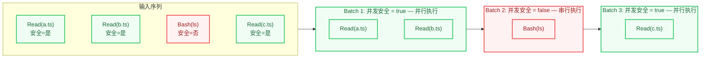

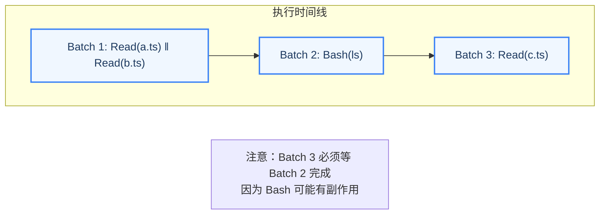

并发执行的并发度上限由环境变量控制，默认为 10。

> **设计洞察：** 为什么 Read(c.ts) 不能和 Bash(ls) 放在同一个批次？因为 Bash 命令可能有副作用——它可能创建新文件、修改文件内容或改变目录结构。如果在 Bash 执行的同时读取文件，Read 可能读到执行前的旧数据或执行后的新数据，导致不可预测的行为。串行执行确保了 Read(c.ts) 看到的是 Bash(ls) 执行完成后的确定状态。

### StreamingToolExecutor 流式执行

`StreamingToolExecutor` 是 `runTools` 的增强版本，它不等待模型响应完全结束就开始执行工具，而是在流式接收到工具调用块时就立即启动执行。

这个设计的影响是显著的。假设模型在一个响应中请求了五个工具调用，每个工具执行需要 1 秒。传统模式下，模型生成完整响应需要 2 秒（流式输出时间），然后批量执行工具需要 5 秒，总计 7 秒。流式执行模式下，第一个工具在模型输出开始后约 0.4 秒（生成第一个 tool_use 块的时间）就开始执行，后续工具陆续启动，总计约 3 秒——速度提升超过 50%。

每个被追踪的工具拥有四阶段状态机：

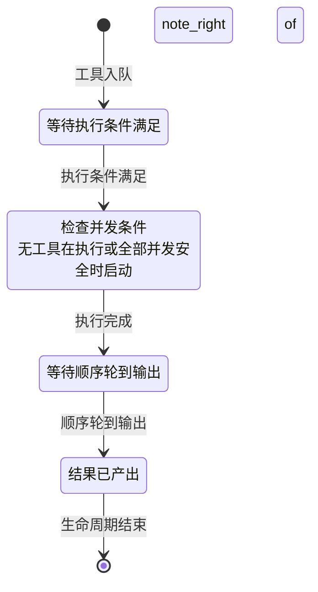

- **queued**：工具已入队，等待执行条件满足。
- **executing**：正在执行。执行前会检查并发条件：只有当没有工具在执行，或所有执行中的工具都是并发安全时，才允许开始执行。
- **completed**：执行完成，结果已收集。但尚未 yield 给上层（需要维持顺序）。
- **yielded**：结果已产出，工具生命周期结束。

StreamingToolExecutor 的关键设计决策：

1. **顺序保证**：即使在流式执行中工具可以并行完成，结果的 yield 仍然保持与请求相同的顺序。结果收集函数在遍历工具列表时，遇到未完成的非安全工具就会停止，确保顺序约束不被违反。这是并行性与一致性之间的精妙平衡——允许并行执行以提高速度，但保证结果呈现的顺序性以简化上层处理逻辑。

2. **错误传播**：BashTool 执行失败会取消所有并行兄弟工具。非 Bash 工具的错误不会传播——因为读取/搜索操作通常是独立的。这个区分很重要：Bash 命令的失败通常意味着环境出了问题（如磁盘满了、网络断了），此时继续执行其他命令很可能也会失败。而文件读取或搜索操作的失败通常是局部的（如文件不存在、模式不匹配），不影响其他操作。

3. **进度即时产出**：工具执行中的进度消息绕过顺序约束，立即 yield 给上层。这使得 UI 可以实时显示工具执行进度，而不必等待前面的工具完成。这个设计体现了用户体验的优先级——进度消息是"提示性"的，不需要严格的顺序保证；而结果消息是"事实性"的，必须保持顺序。

4. **丢弃机制**：当流式回退发生时（模型切换到 fallback 模型），标记所有待执行和执行中的工具为废弃，避免过时的结果泄漏。这相当于一个"紧急刹车"——当模型决定改变策略时，所有基于旧策略的工具调用结果都应该被丢弃。

5. **信号传播**：每个工具执行使用独立的子取消控制器，形成层级化的取消信号链。兄弟工具的错误或用户的 Ctrl+C 都会通过信号传播到正确的工具。这种层级化的信号传播确保了取消操作的精确性——取消一个工具不会意外影响不相关的其他工具。

> **反模式警告：** 如果你正在构建自己的工具编排系统，避免使用单一的 AbortController 来管理所有工具的取消。当工具 A 失败需要取消工具 B 时，不应该同时取消完全无关的工具 C。层级化的取消信号是正确的设计。

### 工具状态机在对话主循环中的集成

回到对话主循环，工具执行的状态与对话循环的状态紧密集成：

1. **流式执行路径**：当流式工具执行功能启用时，创建 StreamingToolExecutor。在流式接收工具调用块时，立即将工具加入执行队列，同时检查是否有已完成的结果可以立即 yield。这实现了"边接收边执行"的流水线模式。

2. **批量执行路径**：当流式执行不可用时，使用传统的批量执行函数在模型响应完全结束后批量执行所有工具。这是流式执行的后备方案，保证了在流式功能被禁用或出错时系统仍然可以正常工作。

3. **上下文传播**：工具执行后可能修改上下文（如文件缓存更新），这些修改传播回对话循环，影响后续工具的执行环境。上下文传播是"一致性"的关键——如果工具 A 写入了文件但缓存没有更新，后续的工具 B 可能基于旧缓存做出错误的决策。

> **交叉引用：** 流式执行路径与第 2 章的对话主循环阶段三和阶段四紧密集成。对流式执行的理解需要结合对话主循环的整体流程图来把握。

---

## 实战练习

**练习 1：实现一个自定义工具**

使用 `buildTool` 工厂函数创建一个简单的工具。要求：
- 定义 Zod schema，包含一个 `path` 字段（字符串类型）
- 实现 `call` 方法，返回指定路径的文件信息
- 正确标记 `isReadOnly` 和 `isConcurrencySafe`
- 实现 `renderToolUseMessage` 和 `renderToolResultMessage`

对比你的实现与 FileReadTool 的差异，理解 `buildTool` 默认值的作用。

**思考题：** 你的自定义工具的 `isConcurrencySafe` 应该标记为 true 还是 false？如果标记错误（只读工具标记为 false，或写入工具标记为 true），分别会导致什么问题？

**练习 2：分析并发分区策略**

给定以下工具调用序列：
```
[GlobTool(*.ts), GrepTool(pattern), BashTool(npm test), FileReadTool(a.ts), FileEditTool(a.ts), GlobTool(*.json)]
```

手动执行 `partitionToolCalls` 的逻辑，画出批次划分结果。然后思考：为什么 FileEditTool 和 GlobTool 不能放在同一个并发批次？

**详细分析：** 画出每个工具的安全标记，然后逐步模拟分区算法的决策过程。最终答案应该是：

```
Batch 1 (并发安全): [GlobTool(*.ts), GrepTool(pattern)]   -- 并行执行
Batch 2 (非安全):   [BashTool(npm test)]                    -- 串行执行
Batch 3 (非安全):   [FileReadTool(a.ts)]                    -- 串行执行（受 Batch 2 影响不能并入 Batch 1）
Batch 4 (非安全):   [FileEditTool(a.ts)]                    -- 串行执行
Batch 5 (并发安全): [GlobTool(*.json)]                      -- 可并行（但只有一个工具）
```

**练习 3：追踪 StreamingToolExecutor 的生命周期**

在 StreamingToolExecutor 的工具入队、工具执行和结果获取环节设置断点。发送一个触发多个并行工具调用的请求（如"搜索所有 TODO 注释并读取相关文件"），观察工具状态如何从 queued 到 executing 到 completed 再到 yielded，以及进度消息如何即时产出。

**扩展观察：** 在工具执行期间按 Ctrl+C，观察取消信号如何从用户传播到各个工具。注意层级化的取消控制器如何确保只有正在执行的工具被取消，而已经 completed 的工具结果不受影响。

**练习 4：评估延迟发现的性能影响**

如果你的环境接入了 MCP 服务器，观察以下两种情况下的 API 调用 token 消耗差异：
- 禁用延迟发现（所有工具 schema 都在初始 prompt 中）
- 启用延迟发现（只有工具名称列表在初始 prompt 中）

记录两种情况下的 input token 数量差异，计算延迟发现为你节省了多少 token。

---

## 关键要点

1. **五要素协议是工具系统的 DNA**：名称、Schema、权限、执行、渲染。每个工具都围绕这五个维度定义自己，而 `buildTool` 的默认值机制让简单工具只需关注核心逻辑。这个协议的设计哲学是"显式声明，安全默认"——工具必须主动声明自己是安全的，否则默认为不安全。

2. **死代码消除保障构建安全**：通过环境变量和功能开关的条件导入，确保内部工具不会泄漏到外部构建。这是 Agent 系统在多租户环境下的重要工程实践。结合第 1 章的"渐进式能力扩展"原则，死代码消除确保了不同产品形态可以共享同一份代码库。

3. **并发分区是性能的关键**：`isConcurrencySafe` 的判断决定了工具能否并行执行。正确标记只读工具为并发安全，可以让 Agent 在单轮中同时执行多个搜索/读取操作，大幅减少响应时间。但错误标记的代价是数据竞争和不可预测的行为——这是一个需要谨慎权衡的设计决策。

4. **StreamingToolExecutor 是零等待的工具调度器**：在模型还在生成 tool_use 块时就开始执行工具，通过四阶段状态机和顺序保证，在并行性和一致性之间取得平衡。它是"异步流式优先"设计原则在工具系统层面的完美体现。

5. **工具系统的可扩展性来自类型契约**：`Tool<Input, Output, Progress>` 的泛型设计让每个工具有独立的类型空间，而 `ToolUseContext` 提供了统一的执行环境。添加新工具不需要修改编排引擎的代码——这正是第 1 章提到的"渐进式能力扩展"原则在工具层面的落地。

在下一章中，我们将深入 Agent 的安全护栏——权限管线。如果说工具系统给了 Agent 行动的能力，那么权限管线决定了 Agent 行动的边界。理解权限管线的设计，你将知道 Claude Code 是如何在"自主执行"和"安全保障"之间找到精确平衡的。


---

# 第4章：权限管线 -- Agent 的护栏

> 学习目标：阅读本章后，你将能够：

> - 理解 Claude Code 四阶段权限检查流程的设计原理和工程权衡
> - 掌握权限上下文的设计哲学和不可变数据模式
> - 分析五种权限模式的行为差异和适用场景
> - 理解 BashTool 精细权限控制的实现机制
> - 掌握企业级安全配置的最佳实践

当 Agent 自主执行任务时，它可能在一次会话中调用数十个工具——写文件、运行 Bash 命令、搜索代码。每一次调用都潜藏着风险：一个不恰当的 `rm -rf`，一次意外的 `npm publish`，都可能造成不可逆的后果。权限管线（Permission Pipeline）正是 Claude Code 为 Agent 构建的安全护栏。它不是简单的"允许/拒绝"开关，而是一套精心设计的多阶段检查机制，在自动化效率与安全控制之间寻找精确的平衡。

用一个物理世界的类比来理解权限管线：一座现代化办公大楼的门禁系统不是只在入口设一个保安（单一检查点），而是在不同区域设置了不同级别的安全检查——大堂只需刷卡，会议室需要预约确认，服务器机房需要指纹验证加双人授权。每一层安全检查都是独立的，即使某一层被绕过，下一层仍然可以阻止未授权的访问。Claude Code 的权限管线正是这种"纵深防御"思想在软件系统中的体现。

本章将从架构设计出发，深入拆解权限管线的每一个阶段，理解其设计决策，并通过实战练习掌握配置方法。

## 4.1 权限管线的四个阶段

Claude Code 的权限检查并非单一函数的布尔判断，而是一条由四个阶段组成的管线（Pipeline）。每个阶段都有自己的职责和短路逻辑：只要前一阶段做出终局决定，后续阶段便不再执行。

这四个阶段可以用一张流程图来直观展示：

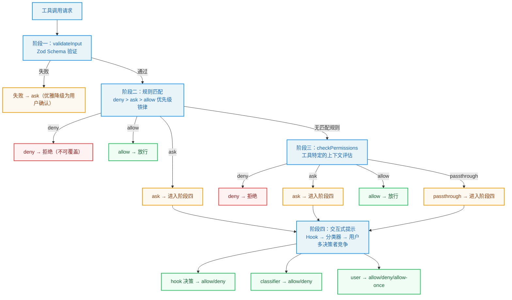

这四个阶段分别是：validateInput（输入验证）、hasPermissionsToUseTool（规则匹配）、checkPermissions（上下文评估）和交互式提示（用户确认）。它们共同构成了从"数据合法性"到"人类授权"的完整防线。

### 4.1.1 阶段一：validateInput -- Zod Schema 验证

权限管线的第一道关卡并非权限本身，而是输入数据的合法性。在权限检查函数中，工具的输入会先经过 Zod Schema 解析，使用严格的结构验证。如果输入不符合 Schema 定义（例如 Bash 工具缺少必需的 `command` 字段），解析将抛出异常，工具调用被直接拒绝。这种设计将"数据不合法"与"权限不足"区分开来——前者是编程错误，后者是策略决策。

值得注意的是，解析失败时 `toolPermissionResult` 保持默认的 `passthrough` 状态，随后会被转换为 `ask` 行为，这意味着即使数据验证失败，系统也会优雅地降级为请求用户确认，而非直接崩溃。

这个设计选择体现了一个重要的工程原则：**在安全系统中，错误处理应该是"安全的"而非"正确的"。** 直接崩溃虽然暴露了问题，但在 Agent 运行时可能导致整个会话中断。优雅降级为用户确认是一种更安全的错误处理策略——它让用户有机会决定是否继续，而不是让系统替用户做决定。

### 4.1.2 阶段二：hasPermissionsToUseTool -- 规则匹配

规则匹配是权限管线的核心。`hasPermissionsToUseToolInner` 函数按照严格的优先级顺序依次检查三类规则：deny 规则、ask 规则和 allow 规则。

**步骤 1a：工具级 deny 检查。** 这是最高的优先级。如果某个工具被整体 deny，调用立即被拒绝。

`getDenyRuleForTool` 函数遍历所有来源（userSettings、projectSettings、localSettings、flagSettings、policySettings、cliArg、command、session）的 deny 规则进行匹配。匹配逻辑支持精确工具名匹配和 MCP 服务器级通配符——例如规则 `mcp__server1__*` 可以匹配该服务器下的所有工具。

七种规则来源的优先级排序体现了"就近原则"：会话级规则（最近设置的）优先于命令行参数，命令行参数优先于项目配置，项目配置优先于全局用户配置。这种优先级排序确保了更具体、更近期的规则能够覆盖更一般、更早期的规则。

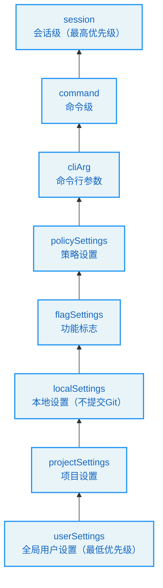

**步骤 1b：工具级 ask 检查。** 当工具被配置为"总是询问"时，系统会强制弹出确认提示。但有一个例外：当 Bash 工具在沙箱模式下且配置了沙箱自动放行选项时，沙箱化命令可以跳过 ask 规则。这个例外的设计意图是：如果用户已经信任沙箱环境（沙箱中的命令无法影响沙箱外的系统），那么在沙箱内执行命令的风险已经被降低到可接受的水平。

**步骤 2b：工具级 allow 检查。** 如果没有 deny 和 ask 规则命中，系统检查是否存在 allow 规则直接放行。

规则匹配的核心抽象是 PermissionRule 类型，它将来源、行为和目标统一为一个结构化对象。

> **优先级铁律：** deny 始终优先于 allow，无论它们的来源如何。这是安全系统的基本原则——"显式拒绝"的力量大于"显式允许"。即使用户在全局配置中 allow 了某个工具，只要项目级配置 deny 了它，该工具仍然不可用。

### 4.1.3 阶段三：checkPermissions -- 上下文评估

每个工具可以实现自己的 `checkPermissions` 方法，进行更精细的上下文评估。例如 Bash 工具会解析命令中的子命令、检查路径安全性、匹配前缀规则等。这一阶段的调用发生在阶段二的规则匹配之前（代码中的步骤 1c），但其结果可能被后续的 allow 规则覆盖。

`checkPermissions` 返回的 `PermissionResult` 有四种行为：

- `allow`：直接放行，可能携带 `updatedInput`
- `deny`：拒绝执行
- `ask`：需要用户确认
- `passthrough`：交由后续阶段决定（最终会变为 `ask`）

`passthrough` 是一个独特的设计。当一个工具没有特殊的权限逻辑时，它可以返回 `passthrough`，让管线继续流动。在后续步骤中，`passthrough` 被自动转换为 `ask`，附带权限请求消息。

> **设计洞察：** 为什么需要 `passthrough` 而不是让没有特殊权限逻辑的工具直接返回 `ask`？区别在于"意图"——`passthrough` 表示"我没有意见，交给后续阶段决定"，而 `ask` 表示"我认为这个操作需要用户确认"。如果后续的 allow 规则匹配了，`passthrough` 会被覆盖为 `allow`，但 `ask` 不会被覆盖。这个细微的区别在特定场景下会产生不同的行为。

### 4.1.4 阶段四：交互式提示 -- 用户确认

当管线流转到 `ask` 状态时，权限确认 Hook 接管控制。这个 React Hook 将权限请求转化为用户交互界面。`ask` 状态触发的流程包含多条分支路径：协调器权限处理、swarm worker 权限处理、投机性分类器检查，以及交互式权限提示。

最关键的是交互式处理分支，它将权限请求推入确认队列，在终端中渲染确认界面，等待用户做出"允许/拒绝/本次允许"等选择。

在用户响应之前，系统可能还会运行异步的分类器检查（`pendingClassifierCheck`）。这意味着用户在看到提示后，分类器可能在用户还在思考时就已经自动批准了该操作，实现了一种"竞赛"机制——谁先做出决定，谁就生效。

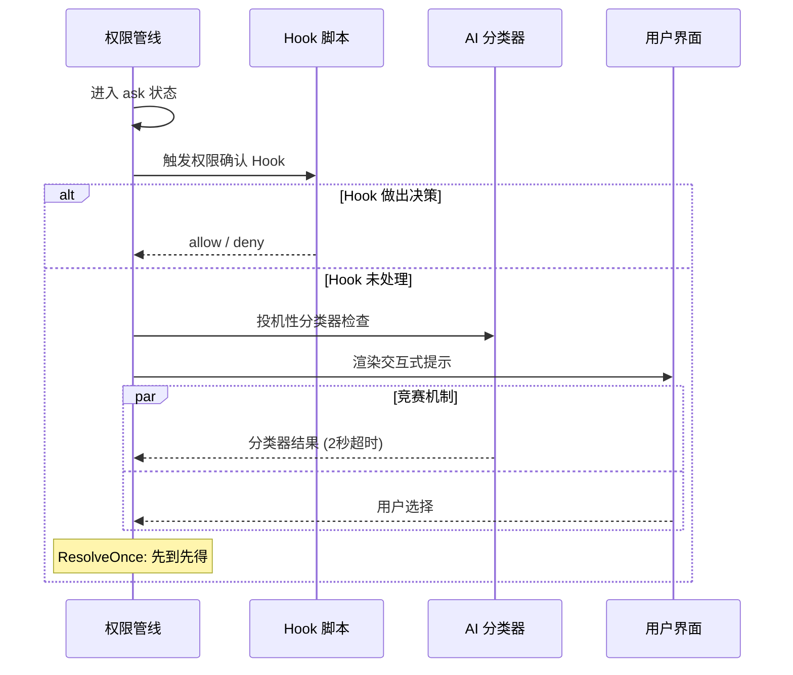

> **最佳实践：** 在企业环境中，如果你希望减少用户频繁看到权限提示的干扰，有三种策略可以组合使用：(1) 在项目配置中预设 allow 规则覆盖常用操作；(2) 使用 auto 模式让分类器自动处理常见请求；(3) 配置 Hook 脚本实现自定义的自动审批逻辑。三种策略可以叠加使用，覆盖从简单到复杂的所有场景。

## 4.2 PermissionContext 的设计

### 4.2.1 ToolPermissionContext 类型结构

`ToolPermissionContext` 是整个权限系统的核心数据结构，它携带了权限检查所需的所有上下文信息。它包含权限模式、额外工作目录、各级规则（allow/deny/ask）、bypass 模式可用性标志、是否应避免权限提示等字段。

这个类型的精妙之处在于它的不可变性（所有字段均为 readonly）。每次权限更新都会产生一个新的 `ToolPermissionContext` 对象，而非修改现有对象。这种不可变数据模式确保了在并发环境下的一致性——多个工具同时检查权限时，各自读取的上下文不会因其他工具的权限更新而意外变化。

不可变性在这里的必要性可以通过一个具体场景来理解：假设工具 A 和工具 B 同时开始权限检查。在检查过程中，工具 A 的用户确认触发了一次权限规则更新（用户选择"始终允许"）。如果 PermissionContext 是可变的，工具 B 可能在检查过程中看到规则被修改，导致同一个请求的前后检查不一致。不可变性确保了每个权限检查使用的都是确定性的快照。

其中规则按来源索引，这种设计允许系统精确追踪每条规则的来源，在规则管理界面中展示"此规则来自项目级设置"等信息。这个能力在多层级配置的场景中至关重要——当一条规则被多个来源定义时，用户需要知道哪条规则在生效、它来自哪里、如何修改它。

### 4.2.2 PermissionDecision 的来源：hook、user、classifier

权限决策（PermissionDecision）有三个来源，每个来源都有不同的信任等级和行为特征：

**hook 来源**：外部 Hook 脚本可以通过权限请求钩子在用户看到提示之前做出决策。这在 CI/CD 环境中特别有用——Hook 脚本可以根据自定义逻辑自动批准或拒绝特定操作。Hook 决策的信任等级最高，因为它代表了系统管理员的显式意图。

**user 来源**：用户在终端界面中的手动选择。`permanent` 标志表示用户是否选择将此决策持久化到配置文件。User 决策的信任等级居中——它代表了当前操作者的意图，但操作者可能不是系统管理员。

**classifier 来源**：AI 分类器在 auto 模式下做出的自动决策，后面会详细讨论。Classifier 决策的信任等级最低——它是 AI 的判断，可能出错，因此某些安全检查类型是"分类器免疫"的。

`PermissionDecision` 本身是一个联合类型，包含 allow、ask 和 deny 三种行为。

> **设计洞察：** 三种决策来源的信任等级排序（hook > user > classifier）体现了"信任与能力匹配"的原则：Hook 脚本由系统管理员编写，具有最高的系统理解能力，因此信任等级最高；分类器是 AI 自动判断，虽然准确率很高但仍可能出错，因此信任等级最低。

### 4.2.3 ResolveOnce 模式：原子化的竞争解决

在权限交互中，多个异步参与者可能同时尝试解决（resolve）同一个权限请求——用户点击"允许"的同时分类器也返回了"通过"。`ResolveOnce` 模式正是为解决这种竞争条件而设计的。它提供 resolve、isResolved 和 claim 三个方法。

其实现使用了一个 `claimed` 标志确保原子性。`claim()` 方法是关键——它提供了一种"先到先得"的原子操作。在 JavaScript 的单线程模型中，`claim()` 保证了即使两个异步回调几乎同时被调度，也只有一个能成功 claim，另一个会被拒绝。这是一种轻量级的互斥锁实现，避免了分布式系统中常见的锁开销。

> **交叉引用：** ResolveOnce 模式与第 2 章的"不可变状态流转"原则一脉相承。两者都通过原子化的状态变更来保证并发安全性——状态要么是旧的，要么是新的，不存在"一半新一半旧"的中间态。

这个设计可以用一个现实世界的类比来理解：想象一张"单程机票"——一旦被某人兑换（claim），其他人就无法再使用同一张机票。不需要锁、不需要等待、不需要协调——只需要一个简单的"已兑换"标志。ResolveOnce 的 `claim()` 方法就是这张机票的兑换操作。

## 4.3 权限模式谱系

Claude Code 定义了五种内部权限模式，它们构成了一个从严格到宽松的谱系。理解这个谱系对于选择合适的权限配置至关重要。

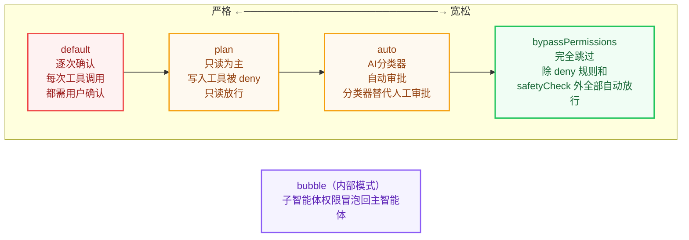

### 4.3.1 default 模式：逐次确认

`default` 模式是最保守的模式。除了被明确 allow 规则放行的工具外，每次工具调用都需要用户确认。这是普通用户启动 Claude Code 时的默认体验。在权限模式配置中，default 模式体现了其保守基调，UI 标识上无特殊标记，暗示这是"标准状态"。

**适用场景：** 日常交互式使用。开发者希望在 Agent 执行任何有潜在风险的操作之前进行确认，确保完全掌控 Agent 的行为。

**用户体验权衡：** 最安全但最繁琐。对于一个大型重构任务，Agent 可能需要执行数十次文件编辑和命令运行，每次确认都会打断开发者的思路。

### 4.3.2 plan 模式：只读为主

`plan` 模式将 Agent 限制在只读操作范围内。它的 UI 标识是一个暂停图标。

在 plan 模式下，写入类工具（Edit、Write）的权限检查会返回 `deny`，但读取类工具（Read、Grep、Glob）正常放行。值得注意的细节是当 plan 模式的 bypass 可用性标志为 true 时，意味着用户原本使用的是 bypass 模式然后切换到了 plan 模式，此时 bypass 的放行逻辑仍然生效。

**适用场景：** 代码审查和架构分析。开发者希望 Agent 先"看看"代码，不修改任何内容，先给出分析和建议，再决定是否执行修改。

**设计哲学：** plan 模式体现了"先理解后行动"的工作流——Agent 先以只读模式理解代码库，给出修改方案，获得用户认可后再切换到执行模式。这种两阶段工作流在处理大型代码库时尤其有效，可以避免 Agent 在没有充分理解的情况下做出不恰当的修改。

### 4.3.3 auto 模式：自动审批（带分类器）

`auto` 模式是 Claude Code 最精巧的模式之一。它使用 AI 分类器（称为 "YOLO classifier"）来代替人工审批。当权限管线到达 `ask` 状态且模式为 `auto` 时，系统会调用分类器进行 AI 判断，将工具名称和输入格式化为分类器可理解的格式，并发送对话上下文和工具列表供分类器参考。

auto 模式的核心挑战是在"自动化效率"和"安全性"之间找到平衡。纯粹的自动放行太危险，纯粹的逐次确认太慢。AI 分类器是两者的折中——它用另一个 AI 来判断当前 AI 的操作是否安全，实现了一种"AI 监督 AI"的架构。

auto 模式实现了多层优化以减少分类器的 API 调用开销：

1. **acceptEdits 快速路径**：在调用分类器之前，先用 acceptEdits 模式检查工具是否会被放行。如果在 acceptEdits 模式下通过，直接放行，无需调用分类器。这是一个"短路优化"——如果已知是安全的，就不需要浪费 API 调用。

2. **安全工具白名单**：不需要分类器检查的安全工具包括 Read、Grep、Glob、TodoWrite 等只读或低风险工具。这个白名单的设计哲学是"显式声明安全"——只有在白名单中的工具才跳过分类器检查，新工具默认需要检查。

3. **拒绝追踪**：当分类器连续拒绝多次后，系统会自动回退到交互式提示，防止 Agent 在无意义的循环中浪费 token。这个机制相当于"熔断器"——当自动决策的准确率下降到某个阈值时，自动回退到人工确认。

auto 模式的一个重要安全设计是：某些安全检查类型的决策（如涉及 `.git/`、`.claude/` 目录的操作）是"分类器免疫"的——即使分类器试图批准它们，这些安全检查也不会被绕过。

> **反模式警告：** auto 模式不适合以下场景：(1) 涉及生产环境部署的操作；(2) 涉及敏感数据（密钥、凭证）的操作；(3) 不可逆操作（如删除数据库）。在这些场景下，即使用户信任分类器的判断，也应该使用 default 模式或配置显式的 deny 规则。

### 4.3.4 bypassPermissions 模式：完全跳过

`bypassPermissions` 模式是权限系统的"关闭开关"。当激活时，除了被 deny 规则阻止和不可绕过的安全检查之外，所有工具调用都自动放行。判断是否应该绕过权限时会检查当前模式是否为 bypassPermissions，或者模式为 plan 但 bypass 标志可用。

但即使 bypass 模式也无法突破以下防线：
- 步骤 1a 的 deny 规则（在 bypass 检查之前执行）
- 步骤 1e 的 `requiresUserInteraction` 检查
- 步骤 1f 的内容级 ask 规则
- 步骤 1g 的 safetyCheck

这种分层防御设计确保了"完全信任"模式下仍有最低限度的安全保障。

**适用场景：** CI/CD 管道、自动化测试、受控的执行环境。在这些场景下，Agent 的操作已经通过其他方式（如容器隔离、网络隔离）进行了安全保障，权限检查只会增加不必要的延迟。

> **企业级安全最佳实践：** 如果你的团队使用 bypass 模式，强烈建议：(1) 在容器或虚拟机中运行 Claude Code，确保文件系统隔离；(2) 配置显式的 deny 规则阻止危险操作（如 `Bash(rm -rf *)`、`Bash(npm publish)`）；(3) 使用 `--allowedTools` 参数限制可用工具范围；(4) 启用审计日志记录所有工具调用。

### 4.3.5 bubble 模式：子智能体权限冒泡

`bubble` 模式是内部模式（不对外暴露），用于子智能体（subagent）场景。当主 Agent 生成子智能体时，子智能体的权限检查会"冒泡"回主 Agent 的权限上下文，确保子智能体不会获得超出主 Agent 的权限。

> **交叉引用：** bubble 模式与第 3 章的 AgentTool 紧密相关。AgentTool 在创建子智能体时通过 `createSubagentContext` 设置 bubble 模式，确保子智能体的权限边界不超过主智能体。

内部权限模式类型包含了所有模式（包括 auto 和 bubble），而外部可见性检查函数确保内部模式不会泄露到外部接口。这种内外有别的类型设计是"信息隐藏"原则的体现——外部用户不需要知道 bubble 模式的存在，它是内部实现细节。

## 4.4 BashTool 的权限细节

Bash 工具是权限系统中最复杂的工具，因为 shell 命令的组合性和表达力远超其他工具。一个简单的 `git` 命令可以是安全的（`git status`），也可以是危险的（`git push --force origin main`）。权限系统需要理解命令的语义，而不仅仅是匹配命令名。

### 4.4.1 命令分类与通配符匹配

权限规则字符串的解析由专用函数处理，支持三种格式：不含括号的工具名匹配，以及含括号的 ToolName(content) 格式（用于指定工具级别的精确命令匹配）。

对于 Bash 工具，`ruleContent` 可以是：
- 精确命令：`Bash(npm test)` -- 仅匹配 `npm test`
- 前缀规则：`Bash(npm:*)` -- 匹配所有以 `npm` 开头的命令
- 通配符规则：`Bash(git commit *)` -- 匹配 `git commit` 后跟任意参数

这三种格式形成了一个表达能力递增的谱系：

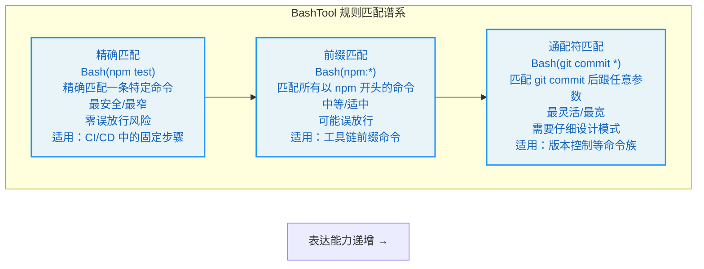

通配符匹配引擎实现了完整的模式匹配，处理转义序列，将通配符 `*` 转换为正则表达式，支持转义 `\*` 和 `\\`。

一个优雅的细节：当模式以 ` *`（空格加通配符）结尾且这是唯一的通配符时，尾部的空格和参数变为可选的。这意味着规则 `git *` 既匹配 `git add .` 也匹配裸 `git` 命令——与 `git:*` 前缀语义保持一致。这种"等价语法"的设计减少了用户的认知负担——你不需要记住两种不同的语法规则，`git:*` 和 `git *` 做同样的事。

### 4.4.2 前缀提取规则

前缀提取处理了向后兼容的 `:*` 语法，通过正则匹配提取冒号前的部分作为前缀。

当解析规则时，系统首先检查 `:*` 语法（前缀匹配），然后检查通配符，最后回退到精确匹配。这个优先级排序是"从宽到窄"的——先尝试匹配范围最广的规则，然后逐步缩小范围。

> **最佳实践：** 在编写 BashTool 权限规则时，优先使用前缀匹配（`:*` 语法）而非通配符匹配。前缀匹配的语义更清晰、更不容易出错。例如 `Bash(npm:*)` 比 `Bash(npm *)` 更明确地表达了"所有以 npm 开头的命令"的意图。

### 4.4.3 分类器自动审批机制

Bash 工具有自己的分类器自动审批机制，与 auto 模式的 YOLO 分类器并行运行。当权限请求处于 `ask` 状态时，系统会尝试"投机性"运行分类器检查。

这里有一个精心设计的超时机制——使用 Promise 竞争让分类器检查与 2 秒定时器竞争。如果分类器在 2 秒内返回高置信度的匹配结果，则自动批准该操作；否则用户就会看到交互式提示。这种"尽力而为"的策略确保了分类器不会成为用户体验的瓶颈。

2 秒的超时选择是经过权衡的：太短（如 500ms）可能因为网络延迟导致分类器来不及响应，太长（如 10 秒）会让用户感到等待时间过长。2 秒是一个"甜蜜点"——对于简单的命令，分类器通常在 1 秒内就能响应；对于复杂的命令，2 秒的超时确保用户不会等待太久。

## 4.5 权限更新与持久化

### 4.5.1 PermissionUpdate 模式

权限更新通过 `PermissionUpdate` 联合类型表达，支持六种操作：添加规则、替换规则、移除规则、设置模式、添加目录和移除目录。

每种操作都指定了更新要应用到的配置源：全局用户设置、项目级设置、本地（不提交到版本控制）设置、仅当前会话、命令行参数。

六种操作和五种配置源的组合形成了 30 种可能的更新操作。这种细粒度的控制允许用户在不同层面管理权限——例如，在全局用户设置中 allow 所有 `git` 命令，但在特定项目的本地设置中 deny `git push --force`。

### 4.5.2 applyPermissionUpdates 与 persistPermissionUpdates

`applyPermissionUpdates` 将更新应用到内存中的权限上下文，是即时生效的。它遍历所有更新，逐个应用到上下文对象上，返回更新后的新上下文。

`applyPermissionUpdate` 处理每种更新类型。以 `addRules` 为例，它会将规则字符串添加到对应行为类型（allow/deny/ask）和对应来源的规则列表中，通过不可变更新产生新的上下文对象。

而 `persistPermissionUpdates` 将更新写入文件系统，确保在重启后仍然生效。只有本地设置、用户设置和项目设置三个目标支持持久化。会话级和命令行参数级的更新仅在运行时生效。

这两个函数的分离设计非常重要：内存应用是同步且即时的，而文件持久化可能涉及 I/O 操作。在权限上下文的用户允许处理方法中，两者被串联调用。

这种"内存优先、持久化异步"的设计模式在高性能系统中很常见：先确保内存状态正确（影响当前行为），然后异步写入持久存储（影响未来行为）。如果持久化失败，当前会话的行为不受影响，但重启后规则会丢失。

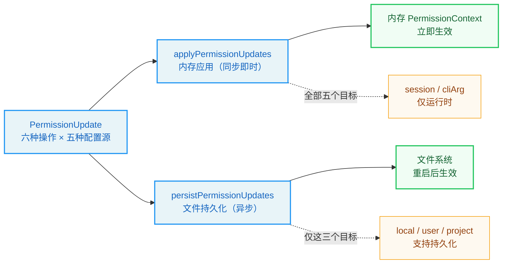

持久化函数返回一个布尔值指示是否有持久化更新发生，这被用于日志记录中标记"永久"还是"临时"决策。

> **企业级安全最佳实践：** 权限规则的持久化设计在团队协作中尤为重要。推荐的做法是：(1) 将团队通用的 allow/deny 规则放在项目级 `.claude/settings.json` 中，提交到版本控制，确保所有团队成员共享相同的安全基线；(2) 将个人偏好的规则放在 `.claude/settings.local.json` 中，不提交到版本控制；(3) 使用会话级规则处理临时需求，避免污染持久化配置。

---

## 实战练习：配置项目级权限系统

### 练习 1：配置项目级 .claude/settings.json

让我们通过一个实际场景来理解权限配置。假设你正在开发一个 Node.js 项目，希望 Claude Code 能够自动执行以下操作：

1. 运行 `npm test` 和 `npm run lint` 而不需要每次确认
2. 允许执行所有 `git` 命令
3. 禁止执行 `npm publish`
4. 禁止删除 `node_modules` 之外的目录

创建项目根目录下的 `.claude/settings.json`：

```json
{
  "permissions": {
    "allow": [
      "Bash(npm test)",
      "Bash(npm run lint)",
      "Bash(git:*)",
      "Read",
      "Glob",
      "Grep"
    ],
    "deny": [
      "Bash(npm publish)",
      "Bash(rm -rf *)"
    ]
  }
}
```

**解析规则：**

- `Bash(npm test)` -- 精确匹配，仅允许 `npm test` 这一条命令
- `Bash(git:*)` -- 前缀匹配，允许所有 `git` 开头的命令（`git add`、`git commit` 等）
- `Read` -- 无 `ruleContent`，表示允许所有 Read 工具调用
- `Bash(npm publish)` -- deny 规则，精确拒绝发布操作

如果你希望规则仅在本地生效（不提交到 Git），可以改用 `.claude/settings.local.json`，其配置格式相同，但 `.gitignore` 默认排除它。

### 练习 2：更精细的通配符控制

更精细的控制可以使用通配符：

```json
{
  "permissions": {
    "allow": [
      "Bash(npm run *)",
      "Bash(npx eslint *)"
    ],
    "deny": [
      "Bash(npm publish *)",
      "Bash(* > /etc/*)"
    ]
  }
}
```

`Bash(npm run *)` 会匹配 `npm run build`、`npm run test:coverage` 等所有子命令。而 `Bash(* > /etc/*)` 使用多个通配符来拦截任何尝试写入 `/etc` 目录的命令。

**思考题：** `Bash(npm run *)` 是否也会匹配 `npm run`（不带子命令）？为什么？提示：回顾 4.4.1 节中关于尾部通配符的讨论。

### 练习 3：企业级安全配置模板

为一个使用 Claude Code 的开发团队设计安全配置。要求：

1. 团队成员可以在项目目录下自由读写代码
2. 禁止修改 `.github/workflows/` 下的 CI 配置
3. 禁止执行 `npm publish`、`docker push` 等发布操作
4. 允许运行 `npm test`、`npm run build`、`npm run lint`
5. 禁止访问 `/etc`、`/var` 等系统目录

尝试分别设计 `.claude/settings.json`（团队共享，提交到版本控制）和 `.claude/settings.local.json`（个人偏好，不提交到版本控制）的内容。

**提示：** 利用 deny 规则的优先级高于 allow 规则的特性，先用宽泛的 allow 规则授权基本操作，再用精确的 deny 规则排除危险操作。

### 练习 4：权限决策流的情景分析

分析以下场景中权限管线的决策路径：

**场景 A：** 用户在 default 模式下请求 `Bash(npm test)`，且 `.claude/settings.json` 中配置了 `"allow": ["Bash(npm test)"]`。

**场景 B：** 用户在 auto 模式下请求 `Bash(curl https://api.example.com/data)`，且没有相关规则。

**场景 C：** 用户在 bypass 模式下请求 `Bash(rm -rf /tmp/test)`，且 `.claude/settings.json` 中配置了 `"deny": ["Bash(rm -rf *)"]`。

**场景 D：** 子智能体（bubble 模式）请求 `FileWriteTool` 写入敏感配置文件。

对每个场景，画出权限管线四阶段的决策路径，说明最终结果和原因。

---

## 关键要点总结

1. **四阶段管线**：权限检查按照 validateInput -> 规则匹配 -> checkPermissions -> 交互式提示的顺序逐级推进，任何阶段都可以做出终局决定。这种纵深防御的设计确保了没有单一的安全检查点是"银弹"，但每一层都可以独立短路，阻止不安全的操作。

2. **优先级铁律**：deny 规则的优先级最高，始终在 allow 规则之前检查。即使用户配置了 `bypassPermissions` 模式，deny 规则和 safetyCheck 仍然生效。这个铁律确保了安全策略的不可妥协性——无论系统处于什么模式，显式拒绝的规则永远有效。

3. **PermissionContext 的不可变性**：每次权限更新产生新的上下文对象，确保并发安全。这与第 2 章的"不可变状态流转"原则和第 3 章的工具上下文管理一脉相承——不可变性是贯穿整个系统的核心设计模式。

4. **ResolveOnce 原子竞争**：用户交互和分类器自动审批之间通过 `claim()` 原子操作解决竞争，保证只有一个决策者。这个轻量级的互斥机制避免了复杂的锁管理，同时确保了决策的确定性。

5. **五模式谱系**：从最严格的 `default` 到最宽松的 `bypassPermissions`，中间有 `plan`（只读）、`auto`（AI 分类器）、`bubble`（子智能体冒泡）三种特殊模式，覆盖从交互开发到自动化的完整场景。选择合适的模式是平衡安全性和效率的关键。

6. **Bash 工具的精细控制**：支持精确匹配、前缀匹配（`:*` 语法）和通配符匹配三种规则格式，以及投机性分类器自动审批。BashTool 的权限系统是整个管线中最复杂的部分，因为 Shell 命令的组合性和表达力远超其他工具类型。

7. **双层更新机制**：`applyPermissionUpdates` 即时修改内存上下文，`persistPermissionUpdates` 异步写入文件系统，两者分离确保了响应速度和数据持久化。这种"内存优先、持久化异步"的模式是高性能系统的通用设计模式。

8. **企业级安全的关键**：在团队环境中，通过项目级 `settings.json`（共享）和本地 `settings.local.json`（个人）的组合配置，结合 deny 优先的规则体系，可以构建覆盖从个人开发到团队协作的安全策略。

在本书的第二部分中，我们将深入分析 Claude Code 的核心子系统，包括上下文管理的压缩策略、缓存感知设计的实现细节、流式架构的错误恢复机制等。这些子系统共同构成了 Agent Harness 的工程基础设施，理解它们的设计将帮助你从"理解架构"走向"能够构建"。


---

# 第二部分 - 核心系统篇

# 第5章：设置与配置 -- Agent 的基因

> **学习目标：** 理解六层配置源的合并规则和安全边界，掌握功能开关系统的编译时优化机制，以及 Zustand-like 不可变状态存储的设计哲学。通过本章的学习，你将能够为不同规模的团队设计合理的配置策略，并理解配置系统如何成为 Agent 安全防护的第一道防线。

---

Claude Code 的行为不是由某个单一配置文件决定的，而是由六层配置源逐层合并而成。这些配置源就像 Agent 的"基因"——它们在 Agent 启动前就已写定，决定了 Agent 能做什么、不能做什么、以及以何种方式去做。理解这套体系，是驾驭 Claude Code 行为定制能力的第一步。

将配置系统比作"基因"是恰当的：正如生物体的基因在受精卵形成时就已确定，并在发育过程中逐层表达，Claude Code 的配置也在启动时加载，在运行时逐层生效。不同的是，Agent 的"基因"可以被精准地编辑和覆盖——这既是强大的能力，也带来了安全挑战。

## 5.1 六层配置源的优先级体系

### 5.1.1 配置源定义与顺序

Claude Code 的配置源在配置常量模块中定义为一个有序数组，包含五种配置来源：用户全局设置（userSettings）、项目共享设置（projectSettings）、项目本地设置（localSettings，gitignored）、CLI 标志设置（flagSettings）和企业策略设置（policySettings）。

配置加载函数 `loadSettingsFromDisk()` 遵循一个关键原则：**后加载者覆盖前者**。合并并非简单的全量替换，而是使用深度合并策略配合自定义规则。

实际执行时还有一个隐藏的最低优先级层：**pluginSettings**（插件设置）。在配置加载流程中，插件设置首先被加载为合并的基础，后续各层配置在此基础上依次叠加。

因此，完整的优先级链从低到高是：

**pluginSettings -> userSettings -> projectSettings -> localSettings -> flagSettings -> policySettings**

为了更直观地理解这六层配置源的关系，我们可以用一个类似"地层沉积"的模型来类比：

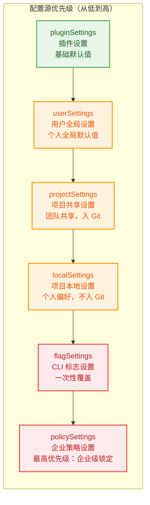

> 每一层都可以覆盖下层的配置，但不会删除下层配置——它们只是被"遮盖"了。这种设计确保了每一层都可以独立理解和维护。

### 5.1.2 合并规则

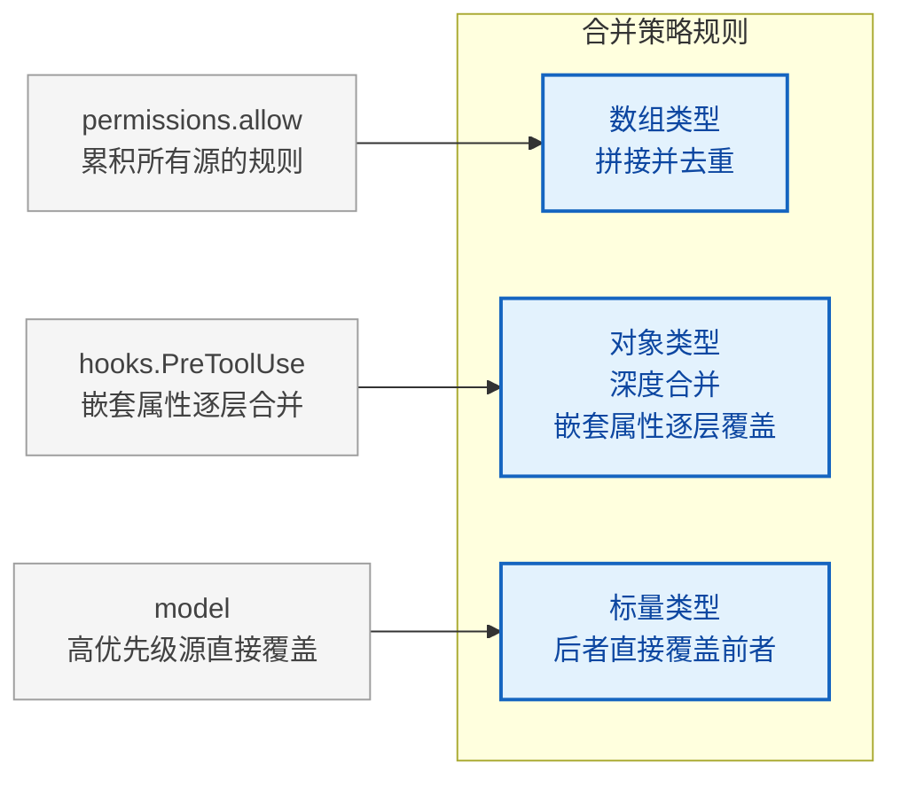

合并的核心在自定义合并策略函数 `settingsMergeCustomizer` 中：该函数对数组类型执行拼接并去重操作，其他类型则交给默认的深度合并逻辑处理。

这套规则的关键特性是：

- **数组类型**：拼接并去重（而非替换）。例如 `permissions.allow` 字段会累积所有源的规则。
- **对象类型**：深度合并。嵌套属性逐层覆盖。
- **标量类型**：后者直接覆盖前者。

这意味着，如果 `userSettings` 设置了 `model: "claude-sonnet-4"`，而 `policySettings` 设置了 `model: "claude-opus-4"`，最终生效的是 `"claude-opus-4"`。但如果两者都设置了 `permissions.allow: ["Bash(*)"]`，最终结果是合并后的去重数组。

**为什么数组采用拼接而非替换？** 这是一个经过深思熟虑的设计决策。在权限系统中，每一条规则都是一道"防线"——如果高优先级源的数组替换了低优先级源的数组，就意味着高优先级源必须完整枚举所有需要的权限规则，任何遗漏都会变成安全漏洞。拼接策略让每层只需要关心自己要"增加"的规则，系统会自动合并所有层的安全策略。

反模式警告：不要利用数组拼接来"撤销"下层的规则。例如，你不能通过在上层设置一个空数组来清除下层的权限——空数组拼接后下层规则依然存在。如果需要撤销，应该使用 `permissions.deny` 字段来显式拒绝。

让我们通过一个完整的例子来演示合并过程：

```
场景：一个前端团队的项目配置

// ~/.claude/settings.json (userSettings - 开发者小张的个人全局设置)
{
  "model": "claude-sonnet-4",
  "permissions": {
    "allow": ["Bash(npm *)", "Bash(node *)"]
  },
  "verbose": true
}

// .claude/settings.json (projectSettings - 团队共享设置，提交到 Git)
{
  "permissions": {
    "allow": ["Bash(npm run lint)", "Bash(npm test)", "Read(*)"]
  },
  "hooks": {
    "PreToolUse": [{ "matcher": "Bash(*)", "hooks": [{ "type": "command", "command": "audit-log.sh" }] }]
  }
}

// .claude/settings.local.json (localSettings - 小张的本地覆盖)
{
  "model": "claude-opus-4",
  "permissions": {
    "allow": ["Bash(git *)"]
  }
}

合并结果：
{
  "model": "claude-opus-4",          // localSettings 覆盖 userSettings
  "verbose": true,                    // 仅 userSettings 设置，保持不变
  "permissions": {
    "allow": [
      "Bash(npm *)",                  // 来自 userSettings
      "Bash(node *)",                 // 来自 userSettings
      "Bash(npm run lint)",           // 来自 projectSettings
      "Bash(npm test)",              // 来自 projectSettings
      "Read(*)",                      // 来自 projectSettings
      "Bash(git *)"                   // 来自 localSettings
    ]                                  // 数组拼接去重
  },
  "hooks": {
    "PreToolUse": [{ ... }]           // 仅 projectSettings 设置
  }
}
```

### 5.1.3 配置文件的实际路径

每个配置源对应一个具体的文件路径，由配置路径映射函数确定：

| 配置源 | 文件路径 | 说明 | 是否入 Git |
|--------|----------|------|-----------|
| userSettings | `~/.claude/settings.json` | 全局用户设置 | N/A（用户目录） |
| projectSettings | `<project>/.claude/settings.json` | 项目共享设置（提交到 Git） | 是 |
| localSettings | `<project>/.claude/settings.local.json` | 项目本地设置（加入 .gitignore） | 否 |
| flagSettings | CLI `--settings` 参数指定路径 | 一次性覆盖 | N/A |
| policySettings | 平台相关的 managed-settings.json | 企业管理 | N/A |

其中 `policySettings` 的解析最为复杂。它遵循 **"first source wins"**（第一个非空源胜出）策略，优先级从高到低为：

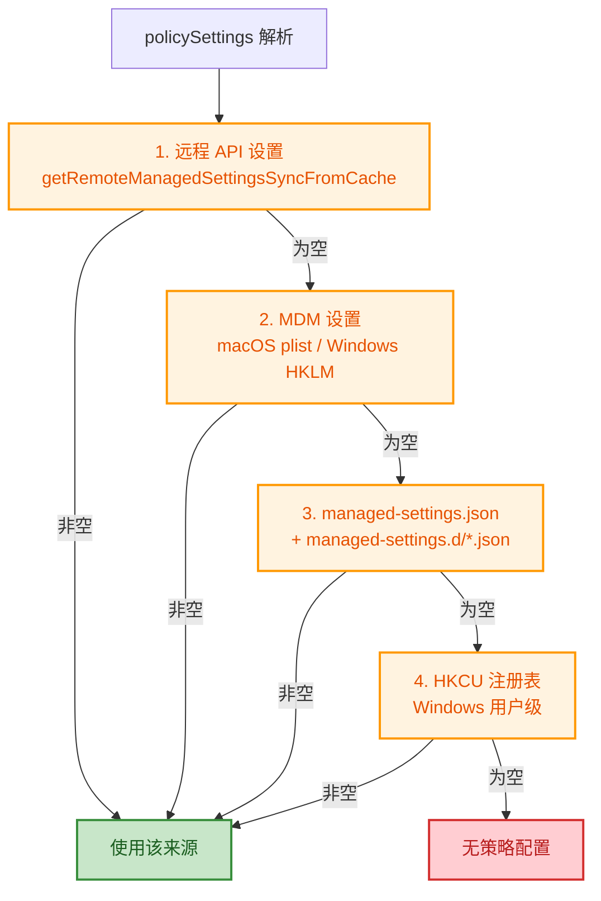

注意 policySettings 使用的是"首个非空源胜出"而非"深度合并"。这个差异至关重要：企业管理策略通常是一个完整的、经过审计的配置方案，不同来源的策略之间不应该互相"渗透"。例如，远程 API 下发的策略已经包含了完整的安全规则，不应该被本地的 managed-settings.json 文件中的部分配置所稀释。

### 5.1.4 策略层的特殊地位

与其他配置源使用深度合并不同，`policySettings` 采用了完全不同的解析逻辑。它不是从文件读取后合并，而是按优先级查找第一个非空源（远程 API 设置 > MDM 设置 > managed-settings.json 文件 > HKCU 注册表）。

这意味着企业管理员只需在一个位置配置策略，系统就会使用最高优先级的那个来源，而非合并所有来源。

**设计决策分析：为什么 policySettings 的合并逻辑与其他配置源不同？**

这源于两种不同的信任模型。userSettings 到 flagSettings 的五层配置遵循"增量累积"模型——每一层都是在信任下层的基础上叠加自己的偏好。而 policySettings 遵循"权威单一"模型——企业策略是从一个权威来源完整下发的，不同来源之间的合并会引入不可预测的行为。

试想如果两个 MDM 系统分别下发了不同的 model 限制和 permissions 规则，合并后可能出现语义冲突：一个限制了可用的模型列表，另一个限制了权限范围，但合并结果可能让用户使用受限模型绕过权限限制。"首个非空源胜出"策略确保了策略来源的确定性和可审计性。

### 5.1.5 配置加载的真实项目实践

在实际项目中，六层配置体系的合理使用可以极大地提升团队协作效率和安全性。以下是几种常见的配置策略模式：

**模式一：个人-团队分离**

这是最常见的模式。开发者将个人偏好放在 `userSettings` 和 `localSettings` 中，将团队共享的规则放在 `projectSettings` 中：

```
~/.claude/settings.json      → 个人模型偏好、个人常用的权限规则
.claude/settings.json         → 团队统一的 lint 规则、权限基线、共享 hooks
.claude/settings.local.json   → 个人覆盖（调试模式、特殊权限）
```

**模式二：CI/CD 专用配置**

在自动化流水线中，使用 `flagSettings` 通过 CLI 参数注入一次性配置，避免修改任何持久化的配置文件：

```
claude --settings /path/to/ci-settings.json
```

这种方式确保 CI 环境的配置是临时的、可追溯的，不会污染开发者的本地环境。

**模式三：企业统一管控**

大型组织通过 MDM 或远程 API 统一下发 policySettings，锁定安全相关的配置项（允许的工具、hooks 白名单等），同时允许团队在 projectSettings 中定制非安全相关的行为：

```
policySettings    → 锁定: model、permissions.deny、allowManagedHooksOnly
projectSettings   → 定制: hooks（非安全类）、MCP 服务器配置
userSettings      → 个性化: verbose、主题等 UI 偏好
```

## 5.2 安全边界设计

配置系统的核心安全挑战是：`projectSettings`（`.claude/settings.json`）会被提交到 Git 仓库，这意味着克隆恶意仓库的用户可能在不知情的情况下加载攻击者的配置。Claude Code 的防护策略是：**在安全敏感的检查中，系统性地排除 `projectSettings`**。

这就像一栋大楼的权限系统：项目的门禁卡可以打开会议室和休息区（projectSettings），但绝不能打开机房和安全室（安全敏感操作）。不同级别的权限由不同的信任级别控制。

### 5.2.1 供应链攻击的威胁模型

在理解安全边界设计之前，我们需要明确威胁模型。供应链攻击在 Agent 场景下的特殊性在于：

**传统供应链攻击 vs Agent 供应链攻击**

| 维度 | 传统软件供应链 | Agent 配置供应链 |
|------|--------------|-----------------|
| 攻击向量 | 恶意依赖包、篡改的构建产物 | 恶意配置文件、hooks 注入 |
| 受害者 | 运行软件的系统 | 使用 Agent 的开发者 |
| 攻击面 | 构建管道、运行时环境 | 文件系统、代码执行、数据访问 |
| 隐蔽性 | 中等（需要绕过安全检测） | 极高（配置文件看似正常） |
| 影响范围 | 软件用户 | 开发者的整个工作环境 |

一个具体的攻击场景：攻击者创建一个看似正常的开源项目，在 `.claude/settings.json` 中配置一个 `PreToolUse` hook，该 hook 在每次工具调用时将用户的敏感信息（API key、环境变量）发送到攻击者的服务器。当开发者克隆该项目并启动 Claude Code 时，恶意 hook 就会在不知情的情况下执行。

**为什么 projectSettings 是风险最大的配置源？**

与其他配置源不同，projectSettings 有三个独特属性使其成为主要的风险点：

1. **来源不可信**：projectSettings 来自克隆的第三方仓库，而非用户自己编写
2. **自动加载**：进入项目目录后配置自动生效，无需用户确认
3. **可执行代码**：hooks 配置可以执行任意 shell 命令

userSettings 和 localSettings 不具备第一个属性（它们在用户自己的文件系统上），flagSettings 需要用户显式指定（不具备第二个属性），policySettings 由管理员控制（不具备第一个属性）。因此，projectSettings 是唯一同时具备三个高风险属性的配置源。

### 5.2.2 shouldAllowManagedHooksOnly

在钩子配置快照模块中，`shouldAllowManagedHooksOnly` 函数决定了是否只允许托管（managed）hooks 运行。它会检查策略设置中是否启用了 `allowManagedHooksOnly`，如果启用了则返回 true。

当此函数返回 `true` 时，hooks 的执行只使用来自 `policySettings` 的 hooks，所有来自 user/project/local 的 hooks 被跳过。这是一个企业安全特性：管理员可以确保只有经过审核的 hooks 在组织内运行。

**实战场景：金融机构的合规要求**

假设一家金融机构要求所有代码变更必须经过内部审计系统记录。管理员可以在 managed-settings.json 中配置：

- 设置 `allowManagedHooksOnly: true`，阻止所有非托管的 hooks
- 在 policySettings 的 hooks 中配置审计日志 hook
- 这样无论开发者本地的 projectSettings 中有什么 hooks，只有管理员审计 hook 会运行

这种"仅托管"模式确保了组织内的 hooks 执行是可预测的、可审计的——开发者无法通过修改本地配置来绕过审计。

### 5.2.3 pluginOnlyPolicy

插件策略模块实现了 `strictPluginOnlyCustomization` 策略，它定义了四种可锁定的"定制面"（customization surfaces）：skills、agents、hooks、mcp。

核心判断函数 `isRestrictedToPluginOnly` 检查策略配置：如果策略为 `true`，则锁定所有面；如果策略是数组，则只锁定指定的面。

被锁定的面中，只有以下来源被信任：

- **plugin** -- 通过 `strictKnownMarketplaces` 单独管控
- **policySettings** -- 由管理员设置，天然可信
- **built-in / bundled** -- 随 CLI 发布，非用户编写

而用户级别（`~/.claude/*`）和项目级别（`.claude/*`）的定制全部被阻断。

这个设计的精妙之处在于"选择性锁定"。企业管理员不需要一刀切地禁止所有定制，而是可以精细地控制哪些定制面需要锁定。例如：

- 锁定 `mcp`：阻止开发者连接未批准的 MCP 服务器（防止数据泄露）
- 锁定 `hooks`：阻止开发者执行未审核的自定义脚本
- 不锁定 `skills`：允许开发者创建自定义技能（提升生产力）

### 5.2.4 projectSettings 的系统性排除

在安全敏感函数中，`projectSettings` 被一致排除。以下函数展示了相同的模式：检查 `skipDangerousModePermissionPrompt` 时，只从 userSettings、localSettings、flagSettings 和 policySettings 中读取，**有意排除 projectSettings**。

同样的排除模式出现在 `hasAutoModeOptIn()`、`getUseAutoModeDuringPlan()` 和 `getAutoModeConfig()` 中。注释一致指向同一个原因：**projectSettings is intentionally excluded -- a malicious project could otherwise auto-bypass the dialog (RCE risk)**。

这种防御的假设是：用户自己的 settings（`userSettings`/`localSettings`）是可信的，因为它们在用户的文件系统上，由用户自己编辑；而 `projectSettings` 可能来自克隆的第三方仓库，存在供应链攻击风险。

**设计原则总结：信任半径递减**

Claude Code 的安全边界遵循一个清晰的"信任半径递减"原则：

```mermaid
graph TD
    subgraph 信任级别["信任级别（从高到低）"]
        direction TB
        policy["policySettings ★★★★★<br/>企业管理员配置，经过审计流程"]
        flag["flagSettings ★★★★☆<br/>用户显式指定的 CLI 参数"]
        local["localSettings ★★★★☆<br/>用户本地文件，不入 Git"]
        user["userSettings ★★★★☆<br/>用户全局文件，用户自己控制"]
        project["projectSettings ★★☆☆☆<br/>可能来自第三方仓库，不可信"]
        plugin["pluginSettings ★☆☆☆☆<br/>插件生态，需额外验证"]
    end

    policy --> flag --> local --> user --> project --> plugin

    classDef trusted fill:#c8e6c9,stroke:#388e3c,stroke-width:2px,color:#1b5e20
    classDef caution fill:#fff9c4,stroke:#f9a825,stroke-width:2px,color:#f57f17
    classDef danger fill:#ffcdd2,stroke:#d32f2f,stroke-width:2px,color:#b71c1c

    class policy,flag,local,user trusted
    class project caution
    class plugin danger
```

> 在安全敏感的检查中，系统只读取信任级别 >= 3 星的配置源。这个原则贯穿了整个配置系统的安全设计。

> **交叉引用提示：** 本章讨论的 `projectSettings` 排除机制与第8章（钩子系统）的安全模型紧密相关。hooks 的加载同样遵循这一信任模型——当 `allowManagedHooksOnly` 启用时，来自 projectSettings 的 hooks 被完全屏蔽。

## 5.3 功能开关系统

Claude Code 的功能开关系统分为两层：**编译时**的 `feature()` 函数和**运行时**的 GrowthBook 实验框架。这种双层设计反映了软件发布工程中的一个经典权衡：编译时开关提供了零运行时开销的特性控制，而运行时开关提供了无需重新部署的快速迭代能力。

### 5.3.1 编译时死代码消除

`feature()` 函数通过 bundler 引入。当 `feature('FEATURE_NAME')` 返回 `false` 时，bundler 会将对应的代码分支完全移除。这是一种编译时的死代码消除（dead code elimination）。

在整个代码库中可以看到大量这种模式：根据特性标志决定是否编译某段功能代码，未启用的功能在构建产物中完全不存在。

**为什么选择编译时消除而非运行时条件判断？**

考虑两种方案：

```
方案 A（运行时判断）：
if (featureFlags.isEnabled('KAIROS')) { ... }

方案 B（编译时消除）：
if (feature('KAIROS')) { ... }  // bundler 在 false 时完全移除该分支
```

方案 A 的问题在于：(1) 未启用的功能代码仍然占据包体积，影响加载时间；(2) 条件分支在热路径上产生微小的性能开销；(3) 未启用功能的代码可能包含未覆盖的 bug 或安全漏洞。方案 B 通过编译时消除解决了所有三个问题——未启用的功能在构建产物中完全不存在。

主要的功能标志包括：

| 功能标志 | 作用域 | 说明 | 架构意义 |
|----------|--------|------|---------|
| `KAIROS` | 核心架构 | Assistant 模式（长驻会话） | 核心交互模式的切换 |
| `EXTRACT_MEMORIES` | 记忆系统 | 后台记忆提取 | 与第6章记忆系统直接相关 |
| `TRANSCRIPT_CLASSIFIER` | 权限系统 | 自动模式分类器 | 自动化权限决策的基础 |
| `TEAMMEM` | 协作系统 | 团队记忆 | 多人协作场景的关键能力 |
| `CHICAGO_MCP` | 工具系统 | Computer Use MCP | 扩展工具生态的接口 |
| `TEMPLATES` | 任务系统 | 模板与工作流 | 可复用工作流的基础设施 |
| `BUDDY` | UI 系统 | 伴侣精灵 | 用户交互体验的增强 |
| `DAEMON` | 架构 | 后台守护进程 | 长驻后台运行的能力 |
| `BRIDGE_MODE` | 架构 | 桥接模式 | 跨进程通信的桥梁 |

从这些功能标志可以看出 Claude Code 的架构演进方向：KAIROS（长驻会话）和 DAEMON（后台守护进程）指向了 Agent 从"按需调用"到"持续运行"的演进路径；TEAMMEM（团队记忆）和 TEMPLATES（模板工作流）指向了从"个人工具"到"团队基础设施"的演进路径。

### 5.3.2 GrowthBook 实验框架

对于需要在运行时动态控制的功能，Claude Code 使用 GrowthBook A/B 测试框架。主要的入口函数 `getFeatureValue_CACHED_MAY_BE_STALE` 接受特性名称和默认值，从缓存中同步读取实验配置。

函数名中的 "CACHED_MAY_BE_STALE" 直白地说明了其语义：值来自缓存，可能在跨进程的场景下已过时。这是为了在启动关键路径上避免异步等待——同步读取缓存比阻塞等待远程配置更可取。

**这种命名方式值得所有系统设计者学习。** 在 API 设计中，将非显而易见的行为约束直接编码到函数名中，可以让调用者在每次使用时都被"提醒"这个约束。相比之下，一个名为 `getFeatureValue` 的函数会给人一种"返回最新值"的错误预期。

在记忆系统中可以看到 GrowthBook 功能标志的使用——通过检查随机命名的特性标志来决定是否启用某项记忆功能。

这些使用随机动物名称命名的功能标志（如 `tengu_passport_quail`、`tengu_coral_fern`、`tengu_moth_copse`）是 GrowthBook 实验的标准做法——随机名称避免了语义偏见，并且不会与编译时的 `feature()` 函数冲突。

**编译时 vs 运行时开关的决策树：**

```mermaid
flowchart TD
    start["需要一个功能开关？"] --> q1{"功能代码是否可以在<br/>发布时确定？"}
    q1 -->|是| compile["使用 feature() 编译时开关"]
    q1 -->|否| q2{"需要运行时动态控制？"}
    q2 -->|是| growthbook["使用 GrowthBook 运行时开关"]
    q2 -->|否| q3{"是否需要 A/B 测试？"}
    q3 -->|是| ab["使用 GrowthBook + 随机实验分组"]
    q3 -->|否| hardcode["直接硬编码<br/>不需要开关"]

    compile --> compile_pro["优点：零运行时开销、减少包体积<br/>缺点：修改需要重新部署"]
    growthbook --> growthbook_pro["优点：无需重新部署即可调整<br/>缺点：有运行时开销、依赖缓存"]
    ab --> ab_pro["随机命名避免语义偏见<br/>不与编译时 feature() 冲突"]

    classDef decision fill:#e3f2fd,stroke:#1976d2,stroke-width:2px,color:#0d47a1
    classDef option fill:#f3e5f5,stroke:#7b1fa2,stroke-width:2px,color:#4a148c
    classDef detail fill:#e8f5e9,stroke:#388e3c,stroke-width:1px,color:#1b5e20

    class q1,q2,q3 decision
    class compile,growthbook,ab,hardcode option
    class compile_pro,growthbook_pro,ab_pro detail
```

> **交叉引用提示：** 编译时功能标志 `EXTRACT_MEMORIES` 直接控制了第6章（记忆系统）中的后台记忆提取功能是否被编译到最终产物中。这是一个配置系统影响核心功能的典型案例。

## 5.4 状态管理系统

状态管理是 Agent 系统的"神经系统"——配置是基因，决定了 Agent 的潜力；状态是神经系统，实时传递和协调 Agent 的运行时行为。Claude Code 选择了一个极简但强大的状态管理方案，其设计哲学值得深入分析。

### 5.4.1 Store：极简不可变状态容器

状态管理模块实现了一个只有 34 行的泛型 Store，其设计灵感来自 Zustand。Store 提供三个核心方法：`getState` 获取当前状态、`setState` 通过 updater 函数更新状态、`subscribe` 订阅状态变化。

三个关键设计决策：

1. **不可变更新**：`setState` 接受一个 updater 函数 `(prev: T) => T`，要求调用者返回全新的状态对象。通过 `Object.is` 比较新旧引用——只有引用发生变化时才通知监听者。
2. **泛型 `onChange` 回调**：在 Store 创建时传入，每次状态变更都会携带新旧状态被调用。这在 `AppStateProvider` 中被用于响应外部设置变更。
3. **Set-based 监听者管理**：使用 `Set` 而非数组，自动去重；`subscribe` 返回取消函数，遵循 React 的 cleanup 模式。

**为什么只有 34 行？——关于状态管理的"少即是多"哲学**

在当今前端生态中，状态管理库层出不穷——Redux、MobX、Recoil、Jotai、Valtio……每个都在尝试解决不同的痛点。Claude Code 的 Store 选择了一条极简路线，这并非偷懒，而是对需求的精准把握。

一个 Agent CLI 工具的状态管理需求与一个复杂的 Web 应用有本质区别：

| 维度 | Web 应用 | Agent CLI |
|------|---------|-----------|
| 状态变更频率 | 极高（毫秒级 UI 交互） | 中等（秒级工具调用） |
| 并发更新 | 常见（多用户同时操作） | 少见（单用户单会话） |
| 时间旅行调试 | 有价值（复杂交互追溯） | 不必要 |
| 中间件需求 | 高（异步操作、副作用） | 低（同步为主） |
| 学习曲线容忍度 | 低（团队协作） | 低（但原因不同：保持代码简洁） |

34 行的 Store 意味着：没有 reducer 样板代码、没有 action 类型定义、没有中间件配置、没有 DevTools 集成——只有最核心的 get/set/subscribe。每一个被砍掉的功能都是一个经过深思熟虑的"不"。

**不可变更新的深层含义**

`Object.is` 引用比较有微妙的语义。它意味着：

```javascript
// 不会触发通知——返回了同一个引用
setState(prev => prev)

// 会触发通知——返回了新引用
setState(prev => ({ ...prev, count: prev.count + 1 }))

// 不会触发通知——虽然值相同，但这是正确的行为
setState(prev => ({ ...prev, count: prev.count }))
// 注意：这种情况下创建了新对象但没有实际变化
// 生产代码应该先检查值是否真的变化了再创建新对象
```

这种设计将"是否发生变化"的判断权交给了调用者——调用者通过是否返回新引用来表达"状态是否变化"的语义。这是一种"约定优于配置"的设计风格：约定"返回新引用 = 状态变化"，而非提供显式的 `hasChanged` 回调。

### 5.4.2 AppState：全局状态的类型定义

全局状态类型 `AppState` 被标记为深度不可变（DeepImmutable），包含了超过 50 个状态字段，涵盖了：

- **设置层**：`settings`（合并后的 SettingsJson）、`verbose`、`mainLoopModel`
- **UI 层**：`expandedView`、`footerSelection`、`statusLineText`
- **工具权限层**：`toolPermissionContext`（当前权限模式、允许的工具列表等）
- **MCP 层**：`mcp.clients`、`mcp.tools`、`mcp.commands`
- **插件层**：`plugins.enabled`、`plugins.disabled`、`plugins.errors`
- **桥接层**：`replBridgeEnabled`、`replBridgeConnected` 等十个桥接相关状态
- **Agent 层**：`agentDefinitions`、`agentNameRegistry`、`teamContext`
- **推测执行层**：`speculation`（空闲/活跃状态机）

默认状态由 `getDefaultAppState()` 构建，它在启动时获取合并后的设置，并初始化所有子系统为安全的默认值。

**DeepImmutable 的类型级保证**

`AppState` 使用 `DeepImmutable<T>` 类型标记意味着 TypeScript 编译器会在编译时阻止任何直接修改状态字段的尝试。这是一种"让正确的事情容易，让错误的事情不可能"的设计哲学在类型系统层面的体现。

状态字段的分类映射了 Agent 系统的架构分层：

```mermaid
graph TD
    AppState["AppState<br/>全局状态（DeepImmutable）"]
    AppState --> config["配置层<br/>settings, verbose, mainLoopModel<br/>启动时确定，运行时很少变化"]
    AppState --> permission["权限层<br/>toolPermissionContext<br/>随工具调用动态变化"]
    AppState --> integration["集成层<br/>mcp.*, plugins.*<br/>子系统状态，由各自的初始化流程管理"]
    AppState --> communication["通信层<br/>replBridge*, teamContext<br/>跨进程/跨 Agent 的通信状态"]
    AppState --> execution["执行层<br/>speculation, agentDefinitions<br/>运行时动态创建和销毁"]

    classDef root fill:#e8eaf6,stroke:#3f51b5,stroke-width:3px,color:#1a237e
    classDef layer fill:#fff3e0,stroke:#ff9800,stroke-width:2px,color:#e65100

    class AppState root
    class config,permission,integration,communication,execution layer
```

> 这种分层结构暗示了 Agent 系统的一个核心架构原则：状态的所有权归属。每一层的状态变化由对应层的逻辑驱动，其他层只读取。

### 5.4.3 AppStateProvider：React Context 封装

`AppStateProvider` 将 Store 封装为 React Context。Store 只创建一次（通过 `useState` 的惰性初始化），Provider 本身不会因状态变化而重新渲染。消费者通过两个 hooks 访问状态：

- **`useAppState(selector)`**：使用 `useSyncExternalStore` 订阅状态切片。只有 selector 返回值发生 `Object.is` 变化时才触发重渲染。这是一种精细化的订阅机制，避免了"订阅整个状态树导致全组件树重渲染"的问题。
- **`useSetAppState()`**：只获取 `setState` 函数，不订阅任何状态。返回的引用永远不会变化，使用此 hook 的组件不会因状态变更而重渲染。

此外还有一个安全变体 `useAppStateMaybeOutsideOfProvider`，用于可能在 `AppStateProvider` 之外渲染的组件——它在没有 Provider 时返回 `undefined` 而非抛出异常。

**`useSyncExternalStore` 的选择意义**

Claude Code 选择 React 18 的 `useSyncExternalStore` 而非自定义的订阅实现（如 useEffect + useState），这个选择值得分析。`useSyncExternalStore` 是 React 官方为"外部状态源"设计的 hook，它提供了三个关键保证：

1. **一致性**：在并发模式下，渲染过程中的状态快照是一致的（不会出现撕裂读）
2. **批量更新**：多次 `setState` 调用只触发一次重渲染
3. **服务端兼容**：支持服务端渲染的 snapshot 模式

对于 Agent 这种状态变更可能触发工具调用、文件操作等副作用的系统来说，一致性保证尤为重要。想象一下：如果权限状态在渲染过程中不一致，可能导致一个组件认为权限已授予而另一个组件认为未授予，产生矛盾的行为。

**性能优化模式对比**

```
模式 A：订阅整个状态（反模式）
const state = useAppState(s => s);
// 任何字段变化都触发重渲染

模式 B：精确订阅单个字段（推荐）
const model = useAppState(s => s.mainLoopModel);
const verbose = useAppState(s => s.verbose);
// 只有对应字段变化才触发重渲染

模式 C：只写不读（推荐）
const setState = useSetAppState();
// 永远不会因状态变化而重渲染
// 适合只需要修改状态但不需要读取状态的组件
```

**最佳实践建议：**

1. 遵循"最小订阅原则"——组件只订阅它实际使用的那部分状态
2. 使用 `useSetAppState()` 而非 `useAppState(s => s.setState)`——前者不订阅任何状态
3. 避免在 selector 中创建新对象——`useAppState(s => ({ a: s.a, b: s.b }))` 每次调用都会返回新引用，导致无限重渲染。应该分别订阅或使用浅比较

> **交叉引用提示：** AppState 中的 `mcp.*` 字段与第9章（MCP 工具系统）直接相关；`toolPermissionContext` 与权限系统相关；`speculation` 状态机与推测执行架构相关。理解 AppState 的结构是理解各子系统如何协作的关键。

---

## 实战练习

### 练习 1：配置合并预测

假设存在以下配置：

- `~/.claude/settings.json`：`{ "permissions": { "allow": ["Bash(ls)"] }, "model": "sonnet" }`
- `.claude/settings.json`：`{ "permissions": { "allow": ["Read(*)"] }, "hooks": { "Stop": [...] } }`
- `.claude/settings.local.json`：`{ "permissions": { "allow": ["Bash(git *)"] } }`

请预测合并后的 `permissions.allow` 和 `model` 值。

**参考答案**：`permissions.allow` 为 `["Bash(ls)", "Read(*)", "Bash(git *)"]`（数组拼接去重），`model` 为 `"sonnet"`（无更高优先级覆盖）。

**延伸思考**：如果现在通过 CLI 参数 `--settings` 传入 `{ "model": "opus" }`，`model` 值会变成什么？如果企业策略中设置了 `"model": "haiku"`，最终值又是什么？

### 练习 2：安全边界分析

如果你是企业管理员，希望确保：(1) 所有用户只能使用管理员批准的 hooks；(2) 用户不能自行安装 MCP 服务器。你应该在 `managed-settings.json` 中设置哪些字段？

**参考答案**：设置 `allowManagedHooksOnly: true` 和 `strictPluginOnlyCustomization: ["mcp"]`。

**延伸思考**：如果除了上述要求外，你还希望确保团队成员不能覆盖 model 设置，应该如何配置？提示：考虑 policySettings 中是否可以直接锁定 `model` 字段。

### 练习 3：状态订阅优化

一个组件需要显示当前模型名和 verbose 标志。以下两种写法哪种更优？

- **写法 A**：通过 `useAppState` 订阅整个状态对象
- **写法 B**：分别通过 `useAppState` 精确订阅 `mainLoopModel` 和 `verbose` 两个字段

**参考答案**：写法 B 更优。写法 A 订阅了整个状态树，任何状态变化都会导致重渲染。写法 B 精确订阅两个字段，只有这两个字段变化时才触发重渲染。

**延伸思考**：如果一个组件需要显示"当前模型是否为 Opus"这个布尔值，以下哪种写法更好？

- 写法 C：`useAppState(s => s.mainLoopModel)` 然后在组件中判断
- 写法 D：`useAppState(s => s.mainLoopModel?.includes('opus'))`

### 练习 4：配置策略设计

为一个 20 人的开发团队设计配置策略，要求：

- 团队统一使用指定的模型和权限基线
- 每个开发者可以自定义 UI 偏好和本地权限扩展
- CI/CD 环境使用最小权限原则

请说明每个配置源中应该放什么内容，并解释为什么。

---

## 关键要点

1. **六层优先级链**：pluginSettings -> userSettings -> projectSettings -> localSettings -> flagSettings -> policySettings，后者覆盖前者。理解每一层的角色是设计合理配置策略的基础。
2. **合并策略**：数组拼接去重，对象深度合并，标量直接覆盖。数组拼接的设计确保了权限规则只会增加不会被意外删除。
3. **安全边界**：`projectSettings` 在所有安全敏感检查中被排除，防止恶意仓库的供应链攻击。这是"信任半径递减"原则的直接体现。
4. **策略层的特殊合并**：policySettings 使用"首个非空源胜出"而非深度合并，确保企业策略的确定性和可审计性。
5. **双重功能开关**：`feature()` 提供编译时死代码消除（零运行时开销），GrowthBook 提供运行时实验控制（灵活但依赖缓存）。两者的选择取决于功能是否需要在发布后动态调整。
6. **不可变状态**：Store 使用 `Object.is` 引用比较，强制不可变更新模式，配合 React 的 `useSyncExternalStore` 实现精细化的订阅渲染。34 行代码实现了所有必要的状态管理能力。
7. **DeepImmutable 类型**：在类型系统层面阻止状态被直接修改，让正确的事情容易，让错误的事情不可能。


---

# 第6章：记忆系统 -- Agent 的长期记忆

> **学习目标：** 掌握四种记忆类型的设计意图和自动提取机制，理解基于 Fork 模式的缓存感知架构，学会设计持久化的 Agent 记忆系统。通过本章，你将理解如何利用记忆系统让 Agent 越用越懂你，以及如何在多项目环境中管理记忆的生命周期。

---

人类之所以能够在多次对话中保持连贯，是因为我们有记忆。同样，一个真正有用的 Agent 不能每次对话都从零开始——它需要记住用户是谁、项目在做什么、以及哪些做法被验证过。Claude Code 的记忆系统（memdir）正是为此而生：一个基于文件的、类型化的、跨会话持久的记忆架构。

将记忆系统比作"长期记忆"是生物学上的精确类比。人类的记忆分为感觉记忆（毫秒级）、工作记忆（秒级，对应第7章的上下文管理）和长期记忆（分钟到年，对应本章的记忆系统）。Claude Code 的设计同样遵循这种分层：上下文窗口是"工作记忆"，在一次会话中临时保存信息；而 memdir 是"长期记忆"，跨会话持久保存不可推导的关键知识。

## 6.1 四种记忆类型的分类学

### 6.1.1 闭合类型系统

Claude Code 的记忆被约束为一个闭合的四类型分类系统，定义在记忆类型常量中：user、feedback、project、reference。

这四种类型的设计哲学是：**只保存不可从当前项目状态推导的信息**。代码模式、架构、文件结构和 Git 历史都可以通过工具（grep、git log）实时获取，因此不属于记忆的范畴。

**为什么必须是闭合系统？**

开放类型系统（允许任意自定义类型）看起来更灵活，但在 Agent 场景下有致命缺陷：(1) 类型爆炸——不同用户、不同项目可能创建数十种类型，Agent 在读取时无法高效判断哪些记忆与当前对话相关；(2) 分类模糊——同一条信息可能属于多个自定义类型，导致重复存储；(3) 索引膨胀——MEMORY.md 索引需要为每种类型维护分类逻辑，增加不必要的复杂性。

闭合四类型的设计是一种"约束即自由"的哲学：约束了分类方式，但换来了高效的一致性推理和精确的相关性判断。

### 6.1.2 四种类型的详细解析

四种记忆类型之间的关系可以用一个二维矩阵来理解：

```mermaid
graph LR
    subgraph 记忆类型矩阵["记忆类型二维矩阵"]
        direction TB
        label_row1["主观/指导性"]
        label_row2["客观/事实性"]
        label_col1["个人维度<br/>（关于人）"]
        label_col2["项目维度<br/>（关于事）"]

        user["user<br/>用户画像<br/>谁在使用？"]
        feedback["feedback<br/>反馈指导<br/>什么做法被验证过？"]
        empty_cell["（通常不需要）"]
        project["project<br/>项目状态<br/>为什么这样做？"]
        reference["reference<br/>外部引用<br/>在哪里找更多信息？"]
    end

    label_row1 --- user
    label_row1 --- feedback
    label_row2 --- empty_cell
    label_row2 --- project
    label_row2 --- reference
    label_col1 --> user
    label_col1 --> empty_cell
    label_col2 --> feedback
    label_col2 --> project
    label_col2 --> reference

    classDef subjective fill:#e8eaf6,stroke:#3f51b5,stroke-width:2px,color:#1a237e
    classDef objective fill:#e8f5e9,stroke:#4caf50,stroke-width:2px,color:#1b5e20
    classDef dim fill:#f5f5f5,stroke:#bdbdbd,stroke-width:1px,color:#757575

    class user,feedback subjective
    class project,reference objective
    class empty_cell,dim dim
```

> **user** -- 用户画像

存储用户的角色、目标、知识背景。帮助 Agent 针对不同专业水平的用户调整协作方式——与资深工程师和初学者应该用不同的方式交流。

```
when_to_save: 当了解到用户的角色、偏好、知识背景时
how_to_use:  当需要根据用户画像调整解释深度和协作方式时
```

示例：用户说"我写了十年 Go，但这是第一次接触 React"，Agent 会保存一条 user 类型的记忆，在未来解释前端概念时使用后端类比。

**实际应用场景：**

场景一：跨项目的用户偏好。用户在项目 A 中表达偏好后，Agent 在项目 B 中也能应用相同的偏好。因为 user 类型记忆存储在用户全局目录下，天然支持跨项目共享。

场景二：渐进式了解用户。第一次对话中用户提到自己是数据科学家，Agent 记录为 user 记忆。第五次对话中用户展示了高级 Python 技巧，Agent 更新记忆补充"精通 Python，熟悉 pandas/numpy"。这种渐进式的用户画像构建让 Agent 的协作能力随时间提升。

**feedback -- 反馈指导**

记录用户对 Agent 行为的纠正和确认。这是最重要的记忆类型之一——它让 Agent 在未来的对话中保持行为一致性。

```
when_to_save: 用户纠正你的做法（"不要那样"）或确认非显而易见的做法成功时
body_structure: 规则本身 + Why: 原因 + How to apply: 适用场景
```

关键设计：不仅记录失败（纠正），也记录成功（确认）。如果只保存纠正，Agent 会变得过于谨慎，偏离已被验证的方法。

**实际应用场景：**

场景一：代码风格偏好。用户说"不要用 var，全部使用 const 和 let"，Agent 保存为 feedback 记忆。在后续所有对话中，Agent 生成的代码默认使用 const/let。

场景二：流程要求。用户说"提交代码前必须运行 lint"，Agent 保存为 feedback 记忆。在后续每次执行 git commit 前，Agent 会自动运行 lint 命令。

场景三：反面教训。用户说"上次你直接修改了 package.json 导致版本冲突，以后改依赖先跟我确认"，Agent 保存为 feedback 记忆，在后续修改依赖文件时主动请求确认。

**project -- 项目状态**

记录项目的非代码状态——决策、截止日期、正在进行的工作。代码和 Git 历史是可推导的，但"为什么要这样做"和"什么时候需要完成"这类信息不是。

```
when_to_save: 了解到谁在做什么、为什么做、何时完成时
body_structure: 事实或决策 + Why: 动机 + How to apply: 对建议的影响
```

特别注意：相对日期必须转换为绝对日期（"周四" -> "2026-03-05"），因为记忆是跨会话持久的，相对日期在未来的对话中会失去意义。

**实际应用场景：**

场景一：架构决策记录（ADR）。用户说"认证模块使用 JWT 而非 Session，因为需要支持移动端"，Agent 保存为 project 记忆。当未来需要修改认证相关代码时，Agent 能理解这个决策的背景。

场景二：进行中的工作。用户说"我正在把用户模块从 REST 迁移到 GraphQL，目前完成了查询部分，接下来要做变更部分"，Agent 保存为 project 记忆。在下一次对话中，Agent 能从正确的上下文继续工作。

场景三：团队约定。用户说"我们团队约定所有 API 响应使用 camelCase，但数据库字段使用 snake_case"，Agent 保存为 project 记忆，在生成代码时遵循这个约定。

**reference -- 外部引用**

指向外部系统的指针——Linear 项目、Grafana 仪表盘、Slack 频道。这些信息不在代码仓库中，但对理解项目上下文至关重要。

```
when_to_save: 了解到外部系统的资源和用途时
how_to_use:  当用户引用外部系统或需要查找外部信息时
```

**实际应用场景：**

场景一：监控仪表盘。用户说：“生产环境的 Grafana 仪表盘在 [https://grafana.company.com/d/abc123](https://grafana.company.com/d/abc123)”，Agent 保存为 reference 记忆。当用户问：“最近有什么异常”时，Agent 能提醒用户查看这个仪表盘。

场景二：文档链接。用户说：“API 文档在 Confluence 的 [https://confluence.company.com/pages/api-docs](https://confluence.company.com/pages/api-docs)”，Agent 保存为 reference 记忆。

场景三：通信渠道。用户说"后端团队的讨论在 #backend-dev Slack 频道"，Agent 保存为 reference 记忆，在需要跨团队协调时提醒用户。

### 6.1.3 明确排除的信息

记忆类型校验模块中明确列出了不应该保存为记忆的内容：

- 代码模式、惯例、架构、文件路径 -- 可以通过阅读代码推导
- Git 历史 -- `git log` / `git blame` 是权威来源
- 调试解决方案 -- 修复已经在代码中，上下文在 commit message 中
- CLAUDE.md 中已有的文档
- 临时任务细节 -- 当前对话的临时状态

甚至当用户**显式要求**保存这些信息时，系统也会引导到更有价值的方向："如果你想保存 PR 列表，请告诉我其中有什么**令人意外**或**非显而易见**的部分——那才是值得保存的。"

**这个排除原则的深层逻辑**

很多用户第一次使用记忆系统时，会试图让 Agent 记住"项目的文件结构"或"API 路由列表"。这种直觉是可以理解的——人类在接手新项目时确实需要了解这些信息。但 Agent 与人类有一个关键区别：Agent 可以在每次对话中实时读取文件系统。

```
信息获取成本对比：

人类开发者:
  记住文件结构 → 几小时的阅读和理解
  下次需要时回忆 → 几秒钟（如果有记忆）
  → 记忆的价值 = 节省的重新阅读时间

Agent:
  实时读取文件结构 → 几毫秒的工具调用
  每次重新获取的成本 → 几百个 token
  → 记忆的价值 ≈ 0（因为实时获取成本极低）
```

因此，记忆系统应该专注于保存"实时获取不到"的信息——人的偏好、决策的背景、外部的链接。这些信息的共同特征是：它们存在于人的大脑或外部系统中，无法通过读取代码仓库获得。

### 6.1.4 记忆使用的最佳实践

**应该保存的记忆（正面案例）：**

| 场景 | 记忆类型 | 保存内容 |
|------|---------|---------|
| 用户表达偏好 | feedback | "用户偏好使用 Vitest 而非 Jest" + Why: 更快的测试执行 |
| 用户纠正行为 | feedback | "不要修改 generated 文件夹中的代码" + Why: 它们由 protoc 自动生成 |
| 架构决策 | project | "使用事件驱动架构而非直接调用" + Why: 服务解耦的需要 |
| 外部系统链接 | reference | "监控告警在 PagerDuty 的 X 服务" |
| 用户背景 | user | "用户是全栈开发者，熟悉 TypeScript 和 Python" |

**不应该保存的记忆（反面案例）：**

| 场景 | 为什么不保存 | 正确做法 |
|------|------------|---------|
| 项目文件列表 | 可通过 `ls` 实时获取 | 无需记忆 |
| API 端点列表 | 可通过读取路由代码获取 | 如果有非显而易见的设计决策，只保存决策 |
| Bug 修复步骤 | 已记录在 commit message 中 | 如果修复涉及反直觉的原因，保存"为什么" |
| 第三方库版本号 | 可通过读取 package.json 获取 | 如果选型有特殊原因，保存原因 |

### 6.1.5 记忆管理的常见误区

**误区一：记忆越多越好**

这是最常见的误区。有些用户会让 Agent 记住所有对话中的细节，导致 MEMORY.md 索引膨胀，记忆目录中堆积大量低价值文件。过多的记忆不仅增加了每次对话的上下文负担，还可能导致 Agent 被"噪音"干扰，忽略真正重要的记忆。

**正确做法**：定期审查记忆目录，删除已过时或低价值的记忆。一个好的记忆应该经得起"如果删除这条记忆，Agent 的行为会有实质性的不同吗？"这个测试。

**误区二：把记忆当作文档系统**

有些用户试图用记忆系统替代项目文档，让 Agent 记住所有的技术规范和设计文档。这违背了"只保存不可推导信息"的原则——技术规范应该放在代码仓库的文档目录中，而非记忆系统中。

**正确做法**：技术文档放在 `docs/` 目录中，架构决策的"为什么"放在记忆中。

**误区三：忽略相对日期问题**

用户说"这个功能下周二上线"，Agent 保存了"下周二上线"。但两天后的下一次对话中，"下周二"变成了"这周二"，再过一周变成了"上周二"。这个记忆不仅无用，还可能误导。

**正确做法**：所有涉及时间的记忆必须使用绝对日期。Agent 应该将"下周二"转换为具体日期（如 2026-04-07）后再保存。

> **交叉引用提示：** 记忆的排除原则与第7章（上下文管理）的压缩策略共享同一种哲学——只保留不可重新获取的信息。上下文压缩会清除旧的工具结果（可以重新执行工具获取），记忆系统会排除代码模式（可以重新阅读代码获取）。

## 6.2 记忆文件格式

### 6.2.1 Frontmatter 格式

每条记忆是一个独立的 Markdown 文件，使用 YAML Frontmatter 声明元数据。格式要求包含 name（记忆名称）、description（一行描述，用于判断未来对话的相关性）和 type（四种类型之一）三个字段。`type` 字段必须是四种类型之一（严格校验），没有 type 字段的遗留文件可以继续工作，但无法被类型过滤。

**为什么使用 Markdown 文件而非数据库？**

这是一个值得分析的架构选择。使用文件系统而非数据库有以下优势：

1. **可读性**：开发者可以直接用文本编辑器查看和编辑记忆文件
2. **版本控制**：记忆文件天然支持 Git 追踪（如果放在项目目录下）
3. **可移植性**：文件系统是最低公共 denominator，无需额外依赖
4. **可调试性**：出现问题时，直接 `ls` 和 `cat` 即可诊断
5. **成本**：无需维护数据库连接、索引、备份

缺点是查询能力有限——无法进行复杂的关联查询或全文搜索。但对于 Agent 的记忆场景，查询模式是简单的"加载所有相关记忆"而非复杂的关联查询，文件系统的能力已经足够。

### 6.2.2 MEMORY.md 索引文件

`MEMORY.md` 是记忆系统的入口点——它不是记忆本身，而是一个索引文件。每次对话开始时，它被自动加载到上下文中，让 Agent 快速了解已有的记忆概况。

记忆目录模块的常量定义了索引的容量限制：索引文件名为 `MEMORY.md`，最多 200 行，最大 25KB。

索引条目的格式要求每条一行，不超过 150 字符：

```markdown
- [Title](file.md) -- 一行钩子描述
```

`truncateEntrypointContent` 函数实现了双重容量保护：先按行截断（200 行上限），再按字节截断（25KB 上限）。超限时，文件末尾会追加一条警告说明哪个上限被触发。

**双重容量保护的设计智慧**

为什么需要两层限制？行数限制和字节限制各有侧重：

- **行数限制（200行）**：保护的是 Agent 的理解效率。即使每行很短，200 行以上的索引也需要 Agent 花费更多 token 来理解和筛选。行数限制确保了索引始终是一个"快速浏览"的工具，而非一个需要"深度阅读"的文档。
- **字节限制（25KB）**：保护的是上下文预算。一条记忆的索引条目可能包含较长的描述（接近 150 字符上限），200 行这样的条目可能达到 30KB，对上下文窗口构成压力。字节限制提供了一个硬性的成本上限。

两层限制的顺序也有讲究——先按行截断再按字节截断。这意味着：当记忆条目较少但描述较长时，字节限制会先触发；当记忆条目较多但描述较短时，行数限制会先触发。无论哪种情况，都有对应的保护机制。

### 6.2.3 记忆文件的目录结构

记忆文件的存储路径由路径解析模块中的函数决定。默认路径为：

```
~/.claude/projects/<sanitized-git-root>/memory/
```

路径解析的优先级：

1. `CLAUDE_COWORK_MEMORY_PATH_OVERRIDE` 环境变量（Cowork 模式的全路径覆盖）
2. `autoMemoryDirectory` 设置（仅限 policySettings/localSettings/userSettings，**projectSettings 被排除**）
3. 默认的 `<memoryBase>/projects/<sanitized-git-root>/memory/`

projectSettings 再次被排除，原因和上一章相同——防止恶意仓库通过 `autoMemoryDirectory: "~/.ssh"` 将写入重定向到敏感目录。路径校验函数对此做了严格的安全检查：拒绝相对路径、根路径、Windows 盘符根、UNC 路径和 null 字节注入。

**路径安全校验的完整防线**

路径校验函数的拒绝列表揭示了攻击者可能尝试的各种路径操纵手段：

| 攻击手段 | 示例 | 防御方式 |
|---------|------|---------|
| 相对路径 | `../../etc/passwd` | 拒绝非绝对路径 |
| 根路径 | `/` | 拒绝根路径 |
| Windows 盘符根 | `C:\` | 拒绝盘符根路径 |
| UNC 路径 | `\\server\share` | 拒绝 UNC 路径 |
| Null 字节注入 | `foo\0.txt` | 拒绝包含 null 字节的路径 |
| 用户目录外 | `/tmp/mem` | 拒绝不在允许的基目录下的路径 |

这些检查层层叠加，形成了一个纵深防御体系。即使某一条检查被绕过，下一条检查仍然可以阻止攻击。

> **交叉引用提示：** projectSettings 排除机制与第5章（设置与配置）的安全边界设计一脉相承。记忆路径的校验是配置系统安全策略的一个具体应用场景。

## 6.3 自动记忆提取

### 6.3.1 基于 Fork 模式的后台提取

记忆提取系统的核心在记忆提取模块中。它不是由主对话直接执行的，而是通过 `runForkedAgent` 在后台运行——一种"完美分叉"模式。

所谓"完美分叉"，是指后台 Agent 与主对话共享完全相同的系统提示（system prompt）和工具集。这意味着：

- 后台 Agent 拥有与主 Agent 相同的上下文理解能力
- 后台 Agent 使用相同的工具集，但受到更严格的权限限制
- **提示缓存（prompt cache）在主对话和后台 Agent 之间共享**

提取的执行时机是在每次完整查询循环结束时（在模型产生最终回复且无工具调用时触发）。

```mermaid
flowchart TD
    start["对话结束"] --> check_flag{"主 Agent 是否<br/>已主动保存记忆？"}
    check_flag -->|是| skip["跳过提取<br/>（互斥机制）"]
    check_flag -->|否| throttle{"节流计数器<br/>是否达到阈值？"}
    throttle -->|否| wait["等待下一次对话"]
    throttle -->|是| fork["Fork 后台 Agent"]
    fork --> shared["共享系统提示 + 工具列表<br/>（缓存感知设计）"]
    shared --> extract["后台 Agent 分析对话<br/>提取有价值记忆"]
    extract --> save["写入记忆文件<br/>（仅限记忆目录）"]
    save --> update_index["更新 MEMORY.md 索引"]

    trailing{"是否有暂存的<br/>尾随上下文？"}
    update_index --> trailing
    trailing -->|是| trail_extract["尾随提取<br/>（跳过节流计数器）"]
    trailing -->|否| done["完成"]
    trail_extract --> done

    classDef process fill:#e3f2fd,stroke:#1565c0,stroke-width:2px,color:#0d47a1
    classDef decision fill:#fff3e0,stroke:#ff9800,stroke-width:2px,color:#e65100
    classDef skip_node fill:#ffcdd2,stroke:#d32f2f,stroke-width:2px,color:#b71c1c
    classDef success fill:#c8e6c9,stroke:#388e3c,stroke-width:2px,color:#1b5e20

    class fork,shared,extract,save,update_index process
    class check_flag,throttle,trailing decision
    class skip skip_node
    class done,wait success
```

**为什么不在主对话中直接提取记忆？**

这个设计选择涉及多个维度的权衡：

```
主对话直接提取：
  优点 → 实现简单，无进程间通信开销
  缺点 → 增加用户等待时间、消耗主对话的 token 预算、
         提取逻辑的失败可能影响主对话的稳定性

Fork 模式后台提取：
  优点 → 不影响用户体验、独立的 token 预算、
         失败不影响主对话、可以共享缓存降低成本
  缺点 → 实现复杂度更高、需要互斥机制避免重复写入
```

用户体验是最关键的考量。在一次长时间的对话结束时，用户期望立即看到最终结果并开始下一次交互。如果此时还要等待记忆提取完成，即使只是几秒钟的延迟，累积起来也会严重影响交互流畅度。

### 6.3.2 互斥机制

记忆提取模块中的互斥检查函数实现了一个精妙的机制：如果主 Agent 已经在本次对话中写入了记忆文件，则后台提取直接跳过。主对话的 system prompt 中已包含完整的记忆保存指令。当主 Agent 主动保存了记忆时，后台的 forked Agent 会检测到这一事实并跳过本次提取——两者是**互斥**的，避免重复写入。

**互斥机制的实现是一个优雅的"最终一致性"设计。**

```mermaid
sequenceDiagram
    participant 主对话
    participant 记忆标志
    participant 后台Agent

    Note over 主对话: 情况一：主 Agent 主动保存记忆
    主对话->>主对话: T1: 对话开始
    主对话->>记忆标志: T3: 主 Agent 保存 feedback 记忆
    Note over 记忆标志: 写入标志被设置
    主对话->>后台Agent: T4: 对话结束，触发后台提取
    后台Agent->>记忆标志: T5: 检测到写入标志
    Note over 后台Agent: 跳过提取（互斥生效）

    Note over 主对话,后台Agent: ---
    Note over 主对话: 情况二：无主动记忆保存
    主对话->>主对话: T1: 对话开始
    主对话->>后台Agent: T2: 对话结束，无主动保存
    后台Agent->>后台Agent: T4: 分析对话，提取 2 条记忆
    Note over 后台Agent: 正常提取
```

这种设计的优势在于避免了"重复提取"导致的冗余记忆。想象一下：如果主 Agent 保存了"用户偏好使用 pnpm"，后台 Agent 又独立分析出"用户偏好使用 pnpm"，同一个信息就产生了两条记忆，既浪费存储空间，又增加了未来筛选的负担。

### 6.3.3 工具权限白名单

后台 Agent 的工具权限通过 `createAutoMemCanUseTool` 函数严格控制：

| 工具 | 权限 | 设计原因 |
|------|------|---------|
| Read / Grep / Glob | 不受限制（只读） | 需要读取代码来理解对话上下文 |
| Bash | 仅限只读命令（ls、find、grep 等） | 需要查看文件状态但不能执行修改命令 |
| Edit / Write | 仅限记忆目录内的路径 | 需要写入记忆文件但不能修改项目代码 |
| REPL | 允许（但内部调用受上述限制） | 可能需要执行代码来验证信息 |
| 其他所有工具 | 拒绝 | 后台 Agent 不应触发网络请求等副作用 |

这个设计使得后台 Agent 拥有足够的读取能力来理解对话内容，但写入能力被限制在记忆目录内——它不能修改项目代码或执行危险命令。

**最小权限原则的完美体现**

工具权限白名单体现了安全设计中的最小权限原则（Principle of Least Privilege）：后台 Agent 只被授予完成其职责所需的最小权限集合。具体来说：

- **为什么允许 Glob？** 后台 Agent 可能需要发现相关文件来验证记忆的准确性（例如，记忆中提到的文件是否还存在）
- **为什么 Bash 限制为只读？** 防止后台 Agent 在用户不知情的情况下执行破坏性命令（如 `rm -rf`）
- **为什么 Edit/Write 限制在记忆目录？** 防止后台 Agent 修改项目代码（这可能改变用户的构建结果或引入 bug）

### 6.3.4 节流与协调

提取不是每次对话都运行的。系统实现了基于计数器的节流机制：每经过若干轮次后才会触发一次提取，通过功能开关配置阈值。

此外，还有一个 **trailing extraction**（尾随提取）机制来处理并发问题。当提取正在进行时又有新的对话完成，新的上下文会被暂存。当前提取完成后，会用最新暂存的上下文运行一次尾随提取。尾随提取跳过节流计数器——它处理的是已经完成的工作，不应该被节流延迟。

**trailing extraction 机制的时序图**

```mermaid
sequenceDiagram
    participant 对话A as 对话 A
    participant 提取A as 提取 A
    participant 对话B as 对话 B
    participant 尾随提取B as 尾随提取 B
    participant 对话C as 对话 C
    participant 提取C as 提取 C

    对话A->>提取A: 对话完成，触发提取
    Note over 提取A: 正常提取中...
    对话B->>对话B: 对话完成，暂存上下文
    Note over 对话B: 等待提取 A 完成...
    提取A-->>尾随提取B: 提取完成
    尾随提取B->>尾随提取B: 使用对话 B 上下文<br/>跳过节流计数器
    对话C->>提取C: 对话完成，触发提取
```

如果没有尾随提取机制，对话 B 的上下文可能永远不会被提取——因为下一次提取时使用的是对话 C 的上下文，对话 B 中可能有独特的、值得记忆的信息被遗漏。

**节流计数器的设计考量**

节流计数器的设计反映了一个成本效益分析：每次记忆提取都需要一次完整的 API 调用（即使有缓存共享，仍然需要支付输出 token 的成本）。对于频繁的短对话（如简单的问答），提取记忆的成本可能超过其价值。节流机制确保了只有在积累了足够的对话轮次后才触发提取，提高了每次提取的"信息密度"。

## 6.4 缓存感知的记忆架构

### 6.4.1 提示缓存共享

在 LLM API 中，提示缓存（prompt cache）是一种重要的成本优化机制——如果两次请求的前缀相同，API 可以复用已计算的 KV cache，显著降低延迟和成本。

Claude Code 的 forked Agent 模式通过 `CacheSafeParams` 类型实现缓存共享。参数提取函数从上下文中提取共享参数，包括系统提示、用户上下文、系统上下文、工具使用上下文和消息历史。

这意味着后台提取 Agent 的 API 请求前缀与主对话完全相同——API 提供商可以命中缓存前缀，避免重新计算。在一个典型的会话中，这可以节省大量 token 消耗。

**缓存共享的成本影响——一个简化的计算**

```
假设：
- 系统提示 + 工具定义 ≈ 30,000 tokens
- 消息历史 ≈ 50,000 tokens（一个中等长度的对话）
- 缓存输入价格 = $0.10 / MTok（缓存命中）
- 标准输入价格 = $3.00 / MTok（无缓存）

无缓存共享：
  提取 Agent 重新发送 80,000 tokens → $0.24

有缓存共享：
  提取 Agent 复用缓存 → $0.008（仅支付缓存读取费用）

节省：96.7%
```

在频繁使用 Agent 的场景下（每天数十次对话），缓存共享带来的成本节约是相当可观的。

### 6.4.2 工具列表的一致性要求

缓存共享有一个隐含约束：**工具列表是 API 缓存 key 的一部分**。如果 forked Agent 使用与主 Agent 不同的工具集，缓存就无法命中。这就是为什么工具权限过滤使用 `canUseTool` 回调而非不同的工具列表——工具列表保持一致，只是执行时被过滤。

**这个设计选择展示了一个重要的架构原则：接口一致，行为可变。**

```mermaid
flowchart LR
    subgraph 方案A["方案 A（不推荐）：不同的工具列表"]
        ma["主 Agent 工具集<br/>Read, Write, Edit, Bash, Grep, Glob..."]
        ea["提取 Agent 工具集<br/>Read, Grep, Glob, MemoryWrite"]
        ma -.->|"缓存 key 不同"| x["缓存不命中<br/>成本增加"]
        ea -.-> x
    end

    subgraph 方案B["方案 B（推荐）：相同的工具列表，不同的权限"]
        mb["主 Agent 工具集<br/>Read, Write, Edit, Bash, Grep, Glob..."]
        eb["提取 Agent 工具集<br/>Read, Write, Edit, Bash, Grep, Glob..."]
        perm["提取 Agent 权限<br/>canUseTool 回调过滤"]
        mb -.->|"缓存 key 相同"| check["缓存命中<br/>成本节约"]
        eb -.-> check
        eb --- perm
    end

    classDef agent fill:#e3f2fd,stroke:#1565c0,stroke-width:2px,color:#0d47a1
    classDef bad fill:#ffcdd2,stroke:#d32f2f,stroke-width:2px,color:#b71c1c
    classDef good fill:#c8e6c9,stroke:#388e3c,stroke-width:2px,color:#1b5e20
    classDef perm_node fill:#fff3e0,stroke:#ff9800,stroke-width:2px,color:#e65100

    class ma,mb,eb agent
    class x bad
    class check good
    class perm perm_node
```

这个原则不仅适用于记忆系统，也是设计高性能 Agent 架构的一般性指导：尽量保持与缓存相关的接口参数（工具列表、系统提示前缀）不变，将差异化逻辑放在运行时的行为控制中。

### 6.4.3 记忆的生命周期

记忆启用的决策链在路径解析模块中定义：

1. `CLAUDE_CODE_DISABLE_AUTO_MEMORY` 环境变量（1/true -> 关闭）
2. `--bare`（SIMPLE 模式） -> 关闭
3. CCR 无持久存储（无 `CLAUDE_CODE_REMOTE_MEMORY_DIR`） -> 关闭
4. `settings.json` 中的 `autoMemoryEnabled` 字段
5. 默认：启用

后台提取还需要通过 GrowthBook 功能门控。这是双层控制：编译时特性标志加运行时 GrowthBook 实验。

**记忆的生命周期状态机**

```mermaid
stateDiagram-v2
    [*] --> 记忆不存在
    记忆不存在 --> 记忆已创建: Agent 保存记忆 / 后台提取
    记忆已创建 --> 记忆活跃使用: 后续对话加载
    Note right of 记忆已创建: MEMORY.md 索引更新
    记忆活跃使用 --> 记忆失效删除: 记忆内容过时 / 手动删除
    Note right of 记忆活跃使用: Agent 在对话中引用
    记忆失效删除 --> [*]
    Note right of 记忆失效删除: MEMORY.md 索引移除
```

记忆的"失效"是一个值得讨论的问题。Claude Code 没有实现自动的记忆过期机制——记忆一旦保存，除非被手动删除或被后续记忆覆盖，否则会一直存在。这意味着记忆的质量管理依赖于 Agent 的判断力（不保存不值得保存的信息）和用户的主动维护。

### 6.4.4 记忆的读取与验证

记忆类型校验模块中定义了记忆读取的核心原则：**记忆是一个时间点的快照，而非当前的事实**。

```
"记忆说 X 存在" 不等于 "X 现在存在"。
```

具体验证规则：

- 如果记忆命名了文件路径：检查文件是否存在
- 如果记忆命名了函数或标志：grep 查找
- 如果用户即将根据你的建议行动（而非询问历史）：先验证

这体现了 Claude Code 的一个深层设计哲学：**记忆是被信任的线索，而非被信任的结论**。它指导 Agent 去哪里找信息，但不替代 Agent 对当前状态的独立验证。

**验证层次的设计哲学**

```mermaid
graph TD
    subgraph 信任层次["记忆信任层次（从低到高）"]
        L0["Level 0: 完全不信任<br/>重新获取所有信息"]
        L1["Level 1: 作为线索信任<br/>记忆指出方向，独立验证事实<br/>✓ Claude Code 采用此层次"]
        L2["Level 2: 作为事实信任<br/>记忆就是当前事实"]
    end

    L0 --> L1 --> L2

    classDef low fill:#ffcdd2,stroke:#d32f2f,stroke-width:2px,color:#b71c1c
    classDef mid fill:#c8e6c9,stroke:#388e3c,stroke-width:3px,color:#1b5e20
    classDef high fill:#ffcdd2,stroke:#d32f2f,stroke-width:2px,color:#b71c1c

    class L0 low
    class L1 mid
    class L2 high
```

Claude Code 选择 Level 1 是一种务实的平衡。Level 0 太保守——如果完全不信任记忆，记忆系统就失去了价值。Level 2 太激进——代码仓库的状态可能已经改变，过时的记忆会误导决策。Level 1 让记忆发挥"索引"和"指引"的作用，同时保持对当前状态的独立验证。

这个原则在以下场景中尤为重要：

1. **代码引用**：记忆说"用户认证在 `src/auth/handler.ts` 中"，但文件可能在重构后被移动。Agent 应该先检查文件是否存在，而非直接引用。
2. **依赖版本**：记忆说"项目使用 React 18"，但团队可能已经升级到 React 19。Agent 应该读取 `package.json` 确认当前版本。
3. **决策背景**：记忆说"选择 PostgreSQL 是因为需要复杂查询"，这个决策背景不太会过时——它解释的是"为什么"而非"是什么"，可以直接信任。

> **交叉引用提示：** 记忆验证的"线索而非结论"原则与第7章（上下文管理）中的压缩策略紧密相关。压缩后的摘要同样遵循这个原则——摘要是历史的线索，Agent 应该在必要时验证摘要中提到的当前状态。

---

## 实战练习

### 练习 1：记忆类型分类

以下信息应该保存为哪种记忆类型？

1. "我们团队使用 Linear 项目 'BACKEND' 来追踪后端 Bug"
2. "用户是初级开发者，第一次使用 TypeScript"
3. "集成测试必须使用真实数据库，不要 mock -- 上次 mock 导致生产事故"
4. "认证中间件重写是因为法律合规要求，不是技术债"
5. "API 文档的 Swagger UI 在 http://localhost:3000/api-docs"
6. "每次创建新组件时，先写测试再写实现"

**参考答案**：
1. `reference` -- 外部系统指针
2. `user` -- 用户画像
3. `feedback` -- 行为指导（包含 Why: 生产事故）
4. `project` -- 项目决策（包含 Why: 法律合规）
5. `reference` -- 外部引用（开发环境的 URL）
6. `feedback` -- 行为指导（包含明确的规则和隐含的原因）

### 练习 2：Frontmatter 编写

为以下场景编写记忆文件的 Frontmatter 和内容：

场景：用户说"以后每次提交代码都要先运行 `npm run lint`，上次有人提交了未 lint 的代码导致 CI 失败了一整天"。

**参考答案**：

```markdown
---
name: pre-commit-lint-requirement
description: Must run npm run lint before every commit; CI failed for a full day due to unlinted code
type: feedback
---

**Rule**: Run `npm run lint` before every code commit.

**Why**: A previous commit with unlinted code caused CI to fail for an entire day, blocking the team.

**How to apply**: Before using git commit, always run `npm run lint` first and fix any errors. This applies to all files changed in the commit, not just new files.
```

**延伸思考**：如果用户在一周后说"lint 规则已经集成到 pre-commit hook 中了，不需要手动运行了"，Agent 应该如何处理这条记忆？是删除它，还是更新它？

### 练习 3：缓存感知架构分析

假设你要为 forked Agent 添加一个新工具 `MemorySearch`（用于语义搜索记忆文件）。以下两种方案哪种更好？

- 方案 A：在 forked Agent 的工具列表中新增 `MemorySearch`，替换 `Grep`
- 方案 B：保持工具列表不变，通过 `canUseTool` 权限回调限制 Grep 只能搜索记忆目录

**参考答案**：方案 B 更好。方案 A 改变了工具列表，导致 API 缓存 key 不同，无法共享主对话的提示缓存。方案 B 保持了工具列表的一致性，权限在执行时而非定义时过滤，维护了缓存共享能力。

### 练习 4：记忆管理策略设计

你同时维护 5 个项目，每个项目的记忆目录中都有 20-30 条记忆。设计一个记忆管理策略，解决以下问题：

- 如何避免跨项目的记忆混淆？
- 如何处理已过时的记忆？
- 如何确保 MEMORY.md 索引不超限？

**参考答案提示**：
- 记忆天然按项目隔离（路径基于 Git 根目录），跨项目共享的只有 user 类型记忆
- 定期审查记忆目录，删除经不起"删除后行为是否会改变"测试的低价值记忆
- 控制每条记忆的 description 长度，定期合并主题相近的记忆条目

---

## 关键要点

1. **闭合四类型**：user、feedback、project、reference -- 只保存不可从代码推导的信息，排除代码模式、Git 历史等可推导内容。闭合类型系统换来了高效的一致性推理。
2. **双重容量保护**：MEMORY.md 索引限制 200 行 / 25KB，先按行截断再按字节截断，确保索引始终是"快速浏览"工具而非"深度阅读"文档。
3. **Fork 模式**：后台 Agent 完美分叉主对话，共享提示缓存，通过 `canUseTool` 白名单限制写入权限。不影响用户体验，独立的 token 预算。
4. **互斥提取**：主 Agent 和后台 Agent 的记忆写入是互斥的——主 Agent 写入时后台跳过，避免重复提取导致的冗余记忆。
5. **缓存感知**：工具列表的一致性是缓存共享的前提，权限过滤使用运行时回调而非编译时不同的工具列表。接口一致，行为可变。
6. **验证优先**：记忆是快照而非事实，推荐前必须验证当前状态。"线索而非结论"是使用记忆的正确心态。
7. **最小权限**：后台 Agent 的工具权限白名单严格限制写入能力，体现了最小权限原则。
8. **trailing extraction**：尾随提取机制确保了在提取并发期间不会遗漏任何对话的记忆提取机会。


---

# 第7章：上下文管理 -- Agent 的工作记忆

> **学习目标：**
> 1. 理解 Agent 上下文窗口的硬约束与有效空间计算
> 2. 掌握四级渐进式压缩策略（Snip → MicroCompact → Collapse → AutoCompact）的设计动机与工作机制
> 3. 理解断路器模式如何保护系统免受级联失败
> 4. 分析压缩提示工程的双阶段输出结构
> 5. 能够为不同使用场景选择最优的上下文管理策略

---

## 7.1 上下文窗口的约束

大语言模型的一切推理能力都建立在一个前提之上：上下文窗口。Claude Code 在每一轮对话中，都需要将完整的消息历史（系统提示、用户消息、助手回复、工具调用与结果）打包发送给模型。随着对话推进，这个历史不可避免地膨胀，最终撞上模型上下文窗口的天花板。

可以把上下文窗口想象成一块**有限大小的白板**。Agent 的所有工作记忆——对话历史、工具结果、中间推理——都必须写在这块白板上。白板空间用完时，你必须擦掉旧内容才能写新内容。关键问题是：**擦掉什么、保留什么、用什么方式擦**？

这不仅是 Claude Code 面对的问题，而是所有长对话 Agent 系统都必须解决的核心工程挑战。许多 Agent 框架在这个问题上选择了"暴力截断"——直接丢弃最早的消息。Claude Code 的做法远比这精细。

### 有效窗口公式

Claude Code 用一个精确的公式来刻画真正可用于对话的空间：

```
有效窗口 = 模型窗口 - 预留输出令牌
```

在自动压缩模块中，`getEffectiveContextWindowSize` 函数实现了有效窗口大小的计算：预留模型的最大输出令牌与 20,000 令牌中的较小值，作为压缩摘要的预留空间，剩余部分才是上下文的有效承载量。

> **为什么预留 20,000 令牌？** 因为 AutoCompact（第4级压缩）需要调用 LLM 生成摘要，摘要本身也消耗输出令牌。如果不预留空间，压缩操作本身就可能因为输出空间不足而失败——一个经典的"压缩悖论"。

举个具体数字：假设模型上下文窗口为 200,000 令牌，最大输出令牌为 16,384 令牌：
- 预留空间 = min(16,384, 20,000) = 16,384 令牌
- 有效窗口 = 200,000 - 16,384 = **183,616 令牌**

这 183,616 令牌才是真正可用于承载对话历史的空间。

### 缓冲区与阈值

基于有效窗口，Claude Code 定义了多个关键阈值常量，形成一个**逐级收紧的安全网**：

```mermaid
graph LR
    subgraph 令牌使用量递增["令牌使用量递增 →"]
        safe["安全区域<br/>0% - 85%<br/>正常工作<br/>无需干预"]
        warning["警告区域<br/>85% - 90%<br/>WARNING<br/>提醒用户注意"]
        danger["危险区域<br/>90% - 95%<br/>AUTOCOMPACT<br/>自动压缩触发"]
        blocked["阻塞区域<br/>95% - 100%<br/>BLOCKING<br/>拒绝新请求"]
    end

    safe --> warning --> danger --> blocked

    classDef safeZone fill:#c8e6c9,stroke:#388e3c,stroke-width:2px,color:#1b5e20
    classDef warnZone fill:#fff9c4,stroke:#f9a825,stroke-width:2px,color:#f57f17
    classDef dangerZone fill:#ffe0b2,stroke:#e65100,stroke-width:2px,color:#bf360c
    classDef blockZone fill:#ffcdd2,stroke:#d32f2f,stroke-width:2px,color:#b71c1c

    class safe safeZone
    class warning warnZone
    class danger dangerZone
    class blocked blockZone
```

| 常量 | 值 | 含义 | 设计意图 |
|------|-----|------|---------|
| `AUTOCOMPACT_BUFFER_TOKENS` | 13,000 | 自动压缩触发缓冲区 | 在用尽空间前预留安全余量，避免"边缘情况" |
| `WARNING_THRESHOLD_BUFFER_TOKENS` | 20,000 | 警告阈值缓冲区 | 早期预警，给用户留出反应时间 |
| `ERROR_THRESHOLD_BUFFER_TOKENS` | 20,000 | 错误阈值缓冲区 | 标记危险区域，触发更积极的压缩策略 |
| `MANUAL_COMPACT_BUFFER_TOKENS` | 3,000 | 手动压缩缓冲区 | 用户手动触发压缩时的最小安全余量 |

> **最佳实践：** 当你看到令牌使用量超过 80% 时，就应该考虑手动触发压缩（输入 `/compact`），而不是等到自动压缩触发。主动压缩通常能保留更多有价值的内容，因为你可以提前指导哪些信息最重要。

### 断路器设计

自动压缩并非总是成功。网络波动、API 错误或上下文本身的结构问题都可能导致压缩失败。如果盲目重试，系统会在每个轮次都发起注定失败的 API 调用，浪费大量资源。

Claude Code 引入了断路器（Circuit Breaker）机制：当连续失败次数达到 3 次（`MAX_CONSECUTIVE_AUTOCOMPACT_FAILURES`）时，系统直接跳过后续的压缩尝试。

```mermaid
stateDiagram-v2
    [*] --> CLOSED: 系统启动

    CLOSED --> CLOSED: 压缩成功<br/>（计数器重置为 0）

    CLOSED --> HALF_OPEN: 压缩失败<br/>（计数器递增）

    HALF_OPEN --> CLOSED: 压缩成功<br/>（计数器重置为 0）

    HALF_OPEN --> OPEN: 连续失败 >= 3 次<br/>（熔断，不再尝试）

    OPEN --> OPEN: 跳过压缩

    OPEN --> CLOSED: 新会话 / 手动压缩成功<br/>（重置条件）

    note right of CLOSED
        正常工作状态
        计数器 = 0
    end note

    note right of OPEN
        熔断状态
        不再尝试自动压缩
    end note
```

成功时，失败计数器重置为零；失败时，计数器递增并向上层调用者传递。这是一种经典的断路器模式 -- 连续失败达到阈值后熔断，避免雪崩效应。

**断路器引入的真实数据：** 根据工程分析，引入断路器前曾观察到 1,279 个会话出现 50 次以上的连续压缩失败（最高达 3,272 次），每天浪费约 250K 次 API 调用。引入后，这类级联失败被彻底消除。

> **反模式警告：** 如果你在构建自己的 Agent 系统，不要忽略断路器。没有断路器的系统在 API 不稳定时会陷入"压缩失败 → 重试 → 再次失败"的死循环，不仅浪费资源，还可能因为延迟增加而进一步恶化用户体验。

> **交叉参考：** 断路器模式在第 15 章构建你自己的 Agent Harness 中也会作为关键设计模式被讨论。类似的状态保护机制也出现在第 2 章的对话循环中（`max_output_tokens_recovery` 路径）。

---

## 7.2 四级压缩策略

Claude Code 的上下文管理采用四级渐进式压缩策略，从低成本到高成本依次递进，每一级都在前一级不足以释放空间时才被激活。

这个设计哲学可以用一个类比来理解：**压缩策略就像衣物收纳**。你不会一上来就把所有衣服扔掉（暴力截断），而是先收起不再穿的（Snip），再压缩换季衣物（MicroCompact），然后真空封存大件（Collapse），最后才做全面整理丢弃（AutoCompact）。

```mermaid
graph LR
    subgraph 压缩策略["四级压缩策略（成本递增 →）"]
        direction LR
        L1["Level 1: Snip 裁剪<br/>───────<br/>无 LLM<br/>标记清除<br/>成本 ≈ 0"]
        L2["Level 2: MicroCompact<br/>微压缩<br/>───────<br/>无 LLM<br/>时间触发<br/>成本极低"]
        L3["Level 3: Collapse<br/>折叠<br/>───────<br/>部分 LLM<br/>主动重构<br/>成本中等"]
        L4["Level 4: AutoCompact<br/>自动压缩<br/>───────<br/>完整 LLM<br/>对话摘要<br/>成本高"]
    end

    L1 -->|"空间不足"| L2
    L2 -->|"空间不足"| L3
    L3 -->|"空间不足"| L4

    L1 -.- t1["用户手动<br/>精准清除"]
    L2 -.- t2["自动触发<br/>缓存过期"]
    L3 -.- t3["自动触发<br/>空间压力"]
    L4 -.- t4["自动触发<br/>最终兜底"]

    classDef level1 fill:#e8f5e9,stroke:#4caf50,stroke-width:2px,color:#1b5e20
    classDef level2 fill:#e3f2fd,stroke:#2196f3,stroke-width:2px,color:#0d47a1
    classDef level3 fill:#fff3e0,stroke:#ff9800,stroke-width:2px,color:#e65100
    classDef level4 fill:#ffebee,stroke:#f44336,stroke-width:2px,color:#b71c1c
    classDef trigger fill:#f5f5f5,stroke:#9e9e9e,stroke-width:1px,color:#616161

    class L1 level1
    class L2 level2
    class L3 level3
    class L4 level4
    class t1,t2,t3,t4 trigger
```

### Level 1: Snip（裁剪）

Snip 是最轻量的压缩手段。它不调用任何 LLM，而是直接清除旧的工具结果内容。当用户通过 Snip 工具标记不再需要的消息时，系统将其中的工具调用结果替换为简短的标记文本（如 `[Old tool result content cleared]`），从而释放令牌空间。

在微压缩模块中可以看到这个标记文本的定义：`'[Old tool result content cleared]'`。

Snip 操作记录已释放的令牌数，传递给自动压缩判断函数，用于更准确地评估是否需要触发更高级别的压缩。

**Snip 的设计智慧：** 为什么不直接删除消息，而是替换为标记文本？因为删除消息会破坏消息链的连续性——后续消息可能引用了前面的工具调用 ID。标记文本既释放了空间，又保持了消息结构完整。

**典型使用场景：** 你刚用 Read 工具读取了 10 个文件，每个文件 500 行代码，消耗了约 15,000 令牌。这些文件内容在分析完成后就不再需要了。此时用 Snip 清除这些工具结果，立即回收大量空间。

### Level 2: MicroCompact（微压缩）

MicroCompact 是基于时间触发的大规模工具结果清理。当检测到距离上一次助手消息的时间间隔超过配置阈值时，意味着服务端缓存已过期，此时无论内容多么重要，全量重写都无法避免 -- 既然如此，不如在请求之前主动清除旧的工具结果，减小重写负载。

> **为什么与缓存过期有关？** Claude 的 API 支持提示缓存（Prompt Caching）——如果连续请求的前缀相同，缓存命中的部分可以大幅降低成本和延迟。但随着时间推移，缓存会过期。当缓存过期时，无论如何都需要重新发送完整内容。此时保留旧的工具结果只是徒增负载。

时间触发的核心逻辑在时间评估函数中：它会检查功能开关是否启用、消息来源是否为主线程，然后计算距最后一次助手消息的时间间隔。如果间隔超过配置的阈值，则触发微压缩。

触发后，系统保留最近 N 个可压缩工具结果（`config.keepRecent`，最小值为 1），将其余的工具结果内容全部替换为清除标记文本。可压缩的工具类型包括 Read、Bash、Grep、Glob、WebSearch、WebFetch、Edit 和 Write。

此外，MicroCompact 还有一个基于缓存编辑（cache editing）的路径，通过 API 层面的 `cache_edits` 机制删除工具结果而不破坏缓存前缀，这是更高级的无损优化。

**MicroCompact 的核心权衡：**

| 维度 | 说明 |
|------|------|
| **触发条件** | 距上次助手消息超过阈值时间 |
| **保留策略** | 保留最近 N 个工具结果，清除其余 |
| **成本** | 零 LLM 调用，仅字符串替换 |
| **信息损失** | 旧的工具结果内容丢失，但消息结构保留 |
| **适用场景** | 长对话中的"自然断点"（用户暂停后返回） |

### Level 3: Collapse（折叠）

Collapse 是上下文重构级压缩。当启用 Context Collapse 特性时，系统会在上下文使用率达到 90% 时开始提交（commit）压缩操作，在 95% 时阻止新的 spawn。这一级别的设计理念是将上下文管理从"被动压缩"转变为"主动重构"。

Collapse 模式会抑制自动压缩的触发，因为两者在 93% 的临界点会产生竞争。Collapse 作为更精细的上下文管理系统，拥有更高的优先级。

> **设计哲学：** Collapse 代表了一种不同的思维方式——不是"空间不够了才压缩"，而是"在空间压力出现之前就主动重构"。这类似于操作系统的内存预取策略，在内存耗尽之前就开始整理碎片。

**Collapse vs AutoCompact 的关键区别：**

| 特性 | Collapse | AutoCompact |
|------|----------|-------------|
| 触发时机 | 90% 利用率（主动） | 超过阈值（被动） |
| 压缩粒度 | 选择性重构消息组 | 全对话摘要 |
| 信息保留 | 更多原始细节 | 仅保留摘要 |
| 与 Fork 的关系 | 阻止新 spawn（95%） | 不影响 spawn |

### Level 4: AutoCompact（自动压缩）

AutoCompact 是最彻底的压缩级别 -- 调用 LLM 对完整对话进行摘要。当以上三级都无法有效释放空间，且令牌用量超过自动压缩阈值时，系统启动 AutoCompact。

这是最后的兜底手段，也是最"昂贵"的——它需要一次额外的 API 调用来生成摘要。

压缩流程由 `compactConversation` 函数驱动，其核心步骤为：

```mermaid
flowchart TD
    start["AutoCompact 触发"] --> step1["1. 执行 PreCompact 钩子"]
    step1 --> step2["2. 构建压缩提示<br/>选择模板 BASE / PARTIAL / PARTIAL_UP_TO"]
    step2 --> step3["3. 流式生成摘要<br/>通过 forked agent 或主线程调用 API"]
    step3 --> step4{"4. prompt-too-long?"}
    step4 -->|是| retry["截断最老的 API 轮次组<br/>并重试（最多 3 次）"]
    retry --> step3
    step4 -->|否| step5["5. 重建上下文<br/>CompactBoundaryMessage + 摘要 + 附件 + 钩子结果"]
    step5 --> step6["6. 执行 PostCompact 钩子"]
    step6 --> result["输出：CompactionResult"]

    classDef step fill:#e3f2fd,stroke:#1565c0,stroke-width:2px,color:#0d47a1
    classDef decision fill:#fff3e0,stroke:#ff9800,stroke-width:2px,color:#e65100
    classDef output fill:#c8e6c9,stroke:#388e3c,stroke-width:2px,color:#1b5e20

    class step1,step2,step3,step5,step6 step
    class step4 decision
    class result,output
```

`CompactionResult` 接口描述了压缩产物的完整结构，包含：边界标记（boundaryMarker）、摘要消息（summaryMessages）、重新注入的附件（attachments）、钩子结果（hookResults）、部分压缩时保留的消息（messagesToKeep），以及压缩前后的令牌计数。

值得注意的是，`buildPostCompactMessages` 函数确保了所有压缩路径的输出消息顺序一致：边界标记、摘要消息、保留消息、附件、钩子结果。

> **交叉参考：** AutoCompact 的 forked agent 执行方式与第 9 章讨论的 Fork 模式密切相关。压缩操作在一个受限的子 Agent 中执行，该子 Agent 最多运行 1 轮（只生成摘要，不做工具调用），确保压缩不会产生副作用。

> **交叉参考：** PreCompact 和 PostCompact 钩子是第 8 章钩子系统的重要应用场景。用户可以通过 PreCompact 钩子注入自定义压缩指令（如"特别保留与数据库相关的讨论"）。

---

## 7.3 压缩提示工程

压缩的质量直接取决于提示的设计。Claude Code 的压缩提示工程是一个精心设计的系统，包含多个变体和严格的输出格式约束。

可以把压缩提示想象成给一位速记员的指令：你需要明确告诉她"记什么、不记什么、用什么格式记"。如果指令不够精确，摘要要么丢失关键信息，要么塞满了不必要的细节。

### 压缩专用提示模板

压缩专用提示模块定义了三种压缩提示模板，对应三种不同的压缩场景：

```mermaid
graph TD
    subgraph 压缩模板["三种压缩模板"]
        BASE["BASE_COMPACT_PROMPT<br/>───────<br/>场景：全量对话摘要<br/>范围：从对话开始到当前的所有消息<br/>适用：常规自动压缩"]
        PARTIAL["PARTIAL_COMPACT_PROMPT<br/>（from 方向）<br/>───────<br/>场景：仅摘要最近的消息<br/>范围：从指定消息开始到当前<br/>适用：对话前半段已被压缩过"]
        PARTIAL_UP["PARTIAL_COMPACT_UP_TO_PROMPT<br/>（up_to 方向）<br/>───────<br/>场景：摘要指定消息之前的上下文<br/>范围：从对话开始到指定消息<br/>适用：保留最近完整消息"]
    end

    classDef base fill:#e3f2fd,stroke:#1565c0,stroke-width:2px,color:#0d47a1
    classDef partial fill:#e8f5e9,stroke:#388e3c,stroke-width:2px,color:#1b5e20
    classDef upto fill:#fff3e0,stroke:#ff9800,stroke-width:2px,color:#e65100

    class BASE base
    class PARTIAL partial
    class PARTIAL_UP upto
```

每个提示都包含一个关键的防工具调用前导指令：要求模型仅以文本形式回复，不得调用任何工具（包括 Read、Bash、Grep 等）。这段指令确保摘要生成过程不会触发工具调用，因为压缩运行在受限的 forked agent 环境中（最多 1 轮），一个被拒绝的工具调用会直接导致空输出。

> **设计哲学：** 为什么压缩必须在受限环境中执行？因为压缩是对话历史的"重写"操作——如果在重写过程中又产生了新的对话历史，就会导致递归问题。限制为单轮、无工具调用，确保压缩是一个纯粹的"读取-摘要-输出"过程。

### 双阶段输出结构

压缩提示要求模型输出两个 XML 块：

- `<analysis>` 块：思维草稿本，用于组织思路、确保覆盖完整。这个块在最终结果中被丢弃。
- `<summary>` 块：正式摘要内容，包含结构化的 9 个章节。

`formatCompactSummary` 函数负责后处理：首先丢弃 `<analysis>` 块（思维草稿本），然后提取 `<summary>` 块的内容作为正式摘要。

这种设计模式值得注意：`<analysis>` 块作为 Chain-of-Thought 的载体提升了摘要质量，但不会进入最终的上下文窗口，避免浪费令牌。

```mermaid
flowchart TD
    llm["LLM 原始输出"] --> analysis["&lt;analysis&gt;<br/>思维过程：分析对话结构、<br/>识别关键决策..."]
    llm --> summary["&lt;summary&gt;<br/>## 目标与意图<br/>## 关键决策与变更<br/>## 未解决问题<br/>## 文件变更摘要<br/>...共 9 个章节"]

    analysis --> discard["丢弃 analysis<br/>节省令牌"]
    summary --> keep["保留 summary<br/>进入新的上下文"]

    classDef raw fill:#f3e5f5,stroke:#7b1fa2,stroke-width:2px,color:#4a148c
    classDef discard_node fill:#ffcdd2,stroke:#d32f2f,stroke-width:2px,color:#b71c1c
    classDef keep_node fill:#c8e6c9,stroke:#388e3c,stroke-width:2px,color:#1b5e20

    class llm raw
    class analysis,discard discard_node
    class summary,keep keep_node
```

**为什么双阶段设计如此重要？** 如果直接要求模型输出摘要（无 analysis 阶段），模型往往会在摘要中遗漏重要信息——因为它没有"思考"的空间。而如果保留 analysis 在上下文中，又浪费了宝贵的令牌。双阶段设计完美地解决了这个矛盾：**思考是过程，摘要是结果**。过程不计费，结果才计入上下文。

> **最佳实践：** 如果你需要在 PreCompact 钩子中自定义压缩行为，可以调整 `<summary>` 中 9 个章节的优先级。例如，如果你的工作重点是 API 设计，可以在钩子中注入指令："在摘要中特别保留所有 API 端点定义及其变更理由"。

### CompactBoundaryMessage 压缩边界标记

每次压缩完成后，系统在消息流中插入一个 `CompactBoundaryMessage`，作为压缩前后的分界线。该标记携带了压缩的元数据：触发类型（手动/自动）、压缩前令牌数、压缩涉及的消息数量。`logicalParentUuid` 字段将边界标记与压缩前的最后一条消息关联起来，构建消息链的逻辑连续性。

边界标记的存在使得后续的压缩操作能够准确识别"哪些消息已被压缩过"，避免重复压缩已摘要的内容。

> **交叉参考：** `CompactBoundaryMessage` 与第 2 章对话循环中的消息链机制直接相关。对话循环在构建 API 请求时，需要正确处理边界标记——在边界标记之前的消息已经被摘要替代，不应重复发送。

---

## 7.4 令牌预算追踪

令牌管理不仅是被动的压缩触发，还包含主动的预算规划和预警系统。

### 多级警告状态

`calculateTokenWarningState` 函数计算当前令牌使用状态，返回多个布尔标志：

| 标志 | 触发条件 | UI 行为 |
|------|---------|---------|
| `isAboveWarningThreshold` | 令牌用量 >= 阈值 - 20,000 | 显示黄色警告 |
| `isAboveErrorThreshold` | 令牌用量 >= 阈值 - 20,000 | 显示红色警告 |
| `isAboveAutoCompactThreshold` | 令牌用量 >= 自动压缩阈值 | 触发自动压缩 |
| `isAtBlockingLimit` | 令牌用量 >= 有效窗口 - 3,000 | 阻止新请求 |

这些标志驱动 UI 层面的警告展示和压缩行为的触发。`percentLeft` 字段向用户展示剩余空间的百分比。

### 压缩后的令牌预算

压缩完成后，系统并非简单地释放所有空间。压缩模块定义了严格的令牌预算常量：

| 常量 | 值 | 用途 |
|------|-----|------|
| `POST_COMPACT_MAX_FILES_TO_RESTORE` | 5 | 最多恢复的文件数量 |
| `POST_COMPACT_TOKEN_BUDGET` | 50,000 | 总令牌预算上限 |
| `POST_COMPACT_MAX_TOKENS_PER_FILE` | 5,000 | 每个文件的令牌上限 |
| `POST_COMPACT_MAX_TOKENS_PER_SKILL` | 5,000 | 每个技能的令牌上限 |
| `POST_COMPACT_SKILLS_TOKEN_BUDGET` | 25,000 | 技能独立预算 |

这些预算限制了压缩后重新注入上下文的内容量，确保了压缩不会因为过度注入附件而立即再次触发压缩。

> **反模式警告：** 常见的错误是在压缩后立即重新加载所有之前读取的文件。这样做会迅速耗尽令牌预算，导致在几轮对话后再次触发压缩，形成"压缩-膨胀-再压缩"的恶性循环。正确做法是只重新加载当前任务需要的文件。

### 真实令牌估算

`truePostCompactTokenCount` 是对压缩后上下文实际大小的估算，它包括边界标记、摘要消息、附件和钩子结果的令牌总和。这个值用于判断压缩是否会立即在下一轮触发再次压缩，为遥测提供关键的诊断信息。

如果压缩后的令牌数仍然超过自动压缩阈值，系统就知道压缩"白做了"——这种情况通常发生在对话结构极其复杂或摘要本身过长时。

---

## 7.5 长对话的上下文管理策略

理解了压缩机制后，让我们看看在实际使用中如何优化上下文管理。

### 策略一：主动压缩优于被动压缩

```mermaid
flowchart LR
    subgraph 被动压缩["被动压缩（不推荐）"]
        direction TB
        u1["用户"] --> a1["Agent 对话"]
        a1 -->|"95%"| ac1["自动压缩"]
        ac1 --> r1["摘要<br/>（可能丢失重要细节）"]
    end

    subgraph 主动压缩["主动压缩（推荐）"]
        direction TB
        u2["用户"] --> a2["Agent 对话"]
        a2 -->|"70%"| compact["用户输入 /compact<br/>（附带保留重点）"]
        compact --> r2["摘要<br/>（保留用户指定重点）"]
    end

    classDef bad fill:#ffcdd2,stroke:#d32f2f,stroke-width:2px,color:#b71c1c
    classDef good fill:#c8e6c9,stroke:#388e3c,stroke-width:2px,color:#1b5e20
    classDef neutral fill:#f5f5f5,stroke:#9e9e9e,stroke-width:1px,color:#424242

    class 被动压缩 bad
    class 主动压缩 good
```

当你在长时间工作中感觉到对话变得冗长时，主动输入 `/compact` 并附带提示（如"/compact 保留所有数据库 schema 相关内容"），可以让压缩更有针对性。

### 策略二：分阶段工作

对于大型项目，将工作分成多个阶段：
1. **研究阶段**：读取文件、理解代码结构 → 完成后压缩
2. **规划阶段**：基于摘要制定方案 → 完成后压缩
3. **实施阶段**：基于方案执行修改 → 完成后压缩

每个阶段结束时的压缩，确保下一阶段有充足的上下文空间。

### 策略三：利用记忆系统补充上下文

> **交叉参考：** 第 6 章记忆系统是上下文管理的重要补充。压缩会丢失对话细节，但如果关键信息已经被保存为记忆文件，压缩后 Agent 仍然可以通过读取记忆恢复关键上下文。

这意味着你应该养成在重要决策时让 Agent 保存记忆的习惯——这样即使对话被压缩，关键信息也不会丢失。

### 多文件项目的上下文策略

在处理大型项目时，上下文管理尤为关键：

| 场景 | 推荐策略 |
|------|---------|
| 阅读 10+ 文件后 | 用 Snip 清除已分析完的文件内容 |
| 长时间暂停后返回 | MicroCompact 自动清除过期缓存 |
| 连续实施多个功能 | 每完成一个功能后手动压缩 |
| 跨多个子系统的重构 | 分阶段工作 + 记忆系统辅助 |

---

## 实战练习

**练习 1：令牌预算计算器**

假设你的模型上下文窗口为 200,000 令牌，最大输出令牌为 16,384 令牌。请计算：
- 有效上下文窗口大小
- 自动压缩触发阈值
- 警告阈值
- 阻塞限制

> *进阶挑战：* 如果对话中包含一个消耗 50,000 令牌的系统提示，你的有效对话空间还剩多少？这对压缩策略的选择有什么影响？

**练习 2：设计自定义压缩策略**

为以下场景设计最合适的压缩级别组合：
- 场景 A：代码审查会话，用户连续工作 2 小时，包含大量文件读取结果
- 场景 B：自动化 CI/CD Agent，长时间运行的任务管道
- 场景 C：交互式教学会话，需要保持早期对话的精确引用

> *进阶挑战：* 为每个场景设计一个 PreCompact 钩子指令，指导摘要保留哪些关键信息。

**练习 3：断路器行为分析**

追踪以下事件序列中断路器状态的变化：
1. 压缩成功（consecutiveFailures = ?）
2. 压缩失败（consecutiveFailures = ?）
3. 压缩失败（consecutiveFailures = ?）
4. 压缩失败（consecutiveFailures = ?）
5. 下一轮是否尝试压缩？

> *进阶挑战：* 如果断路器阈值从 3 改为 5，在 API 故障率为 30% 的情况下，每天会多浪费多少次 API 调用？（提示：参考原文中 1,279 个会话的数据）

**练习 4：上下文压缩实战**

使用 Claude Code 开始一个长对话会话：
1. 让 Agent 连续读取 8-10 个文件
2. 观察令牌使用量的变化
3. 在使用量达到 60% 时手动输入 `/compact`，附带你希望保留的重点
4. 观察压缩前后的令牌数量对比

> *进阶挑战：* 尝试在压缩前用 Snip 工具手动清除不需要的工具结果，对比"先 Snip 再 compact"与"直接 compact"的效果差异。

**练习 5：跨章节综合分析**

结合第 2 章（对话循环）和第 9 章（Fork 模式），分析以下问题：
- 对话循环的预处理管线中，上下文压缩在哪一步执行？为什么在这个位置？
- Fork 创建子 Agent 时，如果父 Agent 的上下文已经被压缩过，子 Agent 会继承什么？这对子 Agent 的行为有什么影响？

---

## 关键要点

1. **有效窗口 = 模型窗口 - 预留输出令牌**：Claude Code 预留最多 20,000 令牌用于压缩摘要的输出空间，确保压缩操作本身不会因为空间不足而失败。
2. **四级渐进压缩**：Snip（裁剪）→ MicroCompact（微压缩）→ Collapse（折叠）→ AutoCompact（自动压缩），成本逐级递增，每一级都是前一级的"升级版"。
3. **断路器保护**：连续 3 次压缩失败后停止尝试，避免无效 API 调用的雪崩效应。这一设计源自对 1,279 个会话的实际数据分析。
4. **双阶段提示结构**：`<analysis>` 思维草稿本 + `<summary>` 正式摘要，前者在最终上下文中被丢弃以节省令牌——"思考是过程，摘要是结果"。
5. **CompactBoundaryMessage**：压缩边界标记携带元数据，通过 `logicalParentUuid` 维护消息链的逻辑连续性，使后续操作能准确识别已压缩内容。
6. **压缩后预算控制**：重新注入的内容有严格的令牌预算限制（50,000 总预算、5,000 每文件），防止压缩后立即再次触发。
7. **时间触发微压缩**：当服务端缓存过期时（距上次助手消息超时），主动清除旧工具结果，减小重写成本。
8. **主动压缩优于被动压缩**：在工作关键节点手动触发压缩并附注重点提示，比等待自动压缩能保留更多有价值的信息。
9. **记忆系统是上下文的补充**：重要决策应保存为记忆文件，这样即使对话被压缩，关键信息也不会丢失。详见第 6 章。


---

# 第8章：钩子系统 -- Agent 的生命周期扩展点

> **学习目标：** 阅读本章后，你将能够：
>
> - 理解五种钩子类型的设计哲学、能力边界和适用场景
> - 掌握 26 个生命周期事件的触发时机、输入结构和退出码语义
> - 设计结构化钩子响应，利用 `decision`、`updatedInput`、`additionalContext` 等字段实现精细控制
> - 理解多层安全模型：全局禁用、仅托管钩子、工作区信任检查的三层门禁
> - 分析钩子优先级排序规则和冲突解决策略
> - 掌握钩子配置的最佳实践，避免常见反模式
> - 理解钩子系统与权限管线（第4章）、配置系统（第5章）的协作关系

---

如果权限管线（第4章）是 Agent 的"护栏"，那么钩子系统就是 Agent 的"神经系统"。权限管线决定 Agent **能否**执行某个操作，而钩子系统则决定了在执行操作**前后**会发生什么。它为 Agent 的整个生命周期提供了精细的扩展点——从会话启动到工具调用，从用户输入到上下文压缩，每一个关键节点都可以被观察、拦截和增强。

用一个生物学的类比来理解：人体不是只有骨骼（架构）和肌肉（核心逻辑），还有遍布全身的神经系统。神经末梢感知外界刺激（事件触发），传导信号到大脑（钩子逻辑），大脑做出反应后再通过运动神经下达指令（决策和操作）。钩子系统正是 Claude Code 的这套"神经反射弧"——它不需要修改核心器官的功能，却能在关键节点插入条件反射式的行为。

从工程角度看，钩子系统遵循的是经典的**观察者模式（Observer Pattern）**结合**责任链模式（Chain of Responsibility）**。每个生命周期事件就是一个"信号"，多个钩子可以监听同一个信号，按优先级依次处理，任何一个钩子都可以选择"阻断信号传播"。这种设计使得 Claude Code 的核心执行引擎无需了解扩展逻辑的存在，实现了核心系统与用户自定义逻辑的彻底解耦。

## 8.1 钩子类型与执行模型

钩子（Hook）是 Claude Code 生命周期中用户可自定义的扩展点。通过钩子，用户可以在不修改 Claude Code 源码的前提下，在关键节点注入自定义逻辑——从审批工具调用、修改工具输入，到拦截用户请求、注入额外上下文。

```mermaid
flowchart TD
    event["生命周期事件触发"] --> collect["收集所有匹配的钩子"]
    collect --> security["安全门禁检查"]
    security -->|"未通过"| reject["跳过钩子执行"]
    security -->|"通过"| sort["按优先级排序<br/>userSettings > projectSettings<br/>> localSettings > plugin"]
    sort --> execute["依次执行钩子"]
    execute --> check{"钩子返回<br/>decision: block?"}
    check -->|"是"| blocked["操作被阻止"]
    check -->|"否"| next{"还有下一个钩子?"}
    next -->|"是"| execute
    next -->|"否"| done["继续正常流程"]

    classDef event fill:#e8eaf6,stroke:#3f51b5,stroke-width:2px,color:#1a237e
    classDef process fill:#e3f2fd,stroke:#1565c0,stroke-width:2px,color:#0d47a1
    classDef decision fill:#fff3e0,stroke:#ff9800,stroke-width:2px,color:#e65100
    classDef blocked_node fill:#ffcdd2,stroke:#d32f2f,stroke-width:2px,color:#b71c1c
    classDef success fill:#c8e6c9,stroke:#388e3c,stroke-width:2px,color:#1b5e20

    class event event
    class collect,security,sort,execute process
    class check,next decision
    class reject,blocked blocked_node
    class done success
```

### 五种钩子类型

钩子 Schema 定义模块中定义了四种可持久化的钩子类型，加上仅在运行时存在的 FunctionHook，共五种。下面这张对比表可以帮助你快速理解每种钩子的定位和能力边界：

```mermaid
graph TD
    subgraph 五种钩子类型["五种钩子类型能力图谱"]
        cmd["Command 钩子<br/>──────────<br/>执行引擎: Shell<br/>可持久化: 是<br/>配置格式: JSON<br/>复杂度: 低<br/>延迟: 毫秒级<br/>典型场景: 脚本检查"]
        prompt["Prompt 钩子<br/>──────────<br/>执行引擎: LLM 推理<br/>可持久化: 是<br/>配置格式: JSON<br/>复杂度: 中<br/>延迟: 秒级<br/>典型场景: 内容审核"]
        agent["Agent 钩子<br/>──────────<br/>执行引擎: LLM 多步<br/>可持久化: 是<br/>配置格式: JSON<br/>复杂度: 高<br/>延迟: 秒~分钟<br/>典型场景: 测试验证"]
        http["HTTP 钩子<br/>──────────<br/>执行引擎: HTTP 请求<br/>可持久化: 是<br/>配置格式: JSON<br/>复杂度: 中<br/>延迟: 网络依赖<br/>典型场景: CI 集成"]
        func["Function 钩子<br/>──────────<br/>执行引擎: TS 回调函数<br/>可持久化: 否<br/>配置格式: TypeScript API<br/>复杂度: 低<br/>延迟: 毫秒级<br/>典型场景: 运行时拦截"]
    end

    classDef cmd fill:#e3f2fd,stroke:#1565c0,stroke-width:2px,color:#0d47a1
    classDef prompt fill:#e8f5e9,stroke:#388e3c,stroke-width:2px,color:#1b5e20
    classDef agent fill:#fff3e0,stroke:#ff9800,stroke-width:2px,color:#e65100
    classDef http fill:#f3e5f5,stroke:#7b1fa2,stroke-width:2px,color:#4a148c
    classDef func fill:#fce4ec,stroke:#c2185b,stroke-width:2px,color:#880e4f

    class cmd cmd
    class prompt prompt
    class agent agent
    class http http
    class func func
```

**1. Command 钩子**（`BashCommandHookSchema`）

最常见的钩子类型，执行 Shell 命令。支持选择 Shell 解释器（bash/powershell）、自定义超时、自定义状态消息，以及 `once` 标志（执行一次后自动移除）。

适用场景：执行脚本检查、文件系统操作、调用外部命令行工具、条件性审批或拒绝操作。

配置示例：

```json
{
  "hooks": {
    "PreToolUse": [{
      "matcher": "Bash",
      "hooks": [{
        "type": "command",
        "command": "python3 scripts/validate_command.py",
        "timeout": 5000,
        "message": "Validating bash command safety..."
      }]
    }]
  }
}
```

**2. Prompt 钩子**（`PromptHookSchema`）

调用 LLM 评估钩子输入，输出 JSON 响应。支持指定模型（默认使用快速小模型）和 `$ARGUMENTS` 占位符来引用钩子输入。

适用场景：需要"智能判断"而非硬编码规则的审批流程。例如，判断一段代码修改是否安全，不是靠正则匹配关键词，而是让 LLM 理解代码语义后做出判断。

配置示例：

```json
{
  "hooks": {
    "PreToolUse": [{
      "matcher": "Write",
      "hooks": [{
        "type": "prompt",
        "prompt": "Analyze this file write operation. If it modifies any file in src/core/, respond with {\"decision\": \"block\", \"reason\": \"Core module changes require code review\"}. Otherwise respond with {\"decision\": \"approve\"}. Input: $ARGUMENTS"
      }]
    }]
  }
}
```

**3. Agent 钩子**（`AgentHookSchema`）

Agentic 验证器钩子。与 Prompt 钩子类似，但设计用于需要多步推理的验证场景，例如验证单元测试是否通过——它可能需要先运行测试、读取结果、分析覆盖率，然后才做出判断。

适用场景：需要多步骤、可迭代验证的复杂审批流程。例如验证代码修改后是否所有相关测试仍然通过。

**4. HTTP 钩子**（`HttpHookSchema`）

向指定 URL POST 钩子输入 JSON。支持自定义请求头、环境变量插值（通过 `allowedEnvVars` 白名单控制），适合与外部系统集成。

适用场景：与 CI/CD 系统集成（如 Jenkins、GitHub Actions）、发送审计日志到安全信息与事件管理系统（SIEM）、调用企业内部审批服务。

配置示例：

```json
{
  "hooks": {
    "PostToolUse": [{
      "matcher": "Bash",
      "hooks": [{
        "type": "http",
        "url": "https://audit.example.com/api/log",
        "headers": {
          "Authorization": "Bearer $AUDIT_TOKEN",
          "Content-Type": "application/json"
        },
        "allowedEnvVars": ["AUDIT_TOKEN"]
      }]
    }]
  }
}
```

> **反模式警告：** 在 HTTP 钩子中使用 `allowedEnvVars` 时，务必只暴露必要的变量。不要将整个环境变量白名单打开，否则在多用户环境中可能导致凭证泄露。

**5. Function 钩子**

仅在运行时存在的内存钩子，执行 TypeScript 回调函数。无法持久化到配置文件，生命周期与会话绑定。回调函数接收消息数组和可选的中止信号，返回布尔值表示是否成功。

适用场景：需要与 Claude Code 运行时状态深度交互的场景，例如 SDK 嵌入模式下的动态行为控制。

> **设计思考：** 为什么 Function 钩子不能持久化？因为 TypeScript 回调函数是内存中的可执行代码引用，无法序列化为 JSON 配置。这是"代码即配置 vs 配置即代码"的边界——可持久化的钩子（Command/Prompt/Agent/HTTP）本质上是**声明式配置**，而 Function 钩子是**命令式代码**。将两者混合在同一个配置系统中会导致不可预测的行为和安全风险。

### 同步 vs 异步钩子

Command 钩子支持三种执行模式：

- **同步模式**（默认）：阻塞当前操作，等待钩子完成后根据结果决定是否继续。这是最常见也最安全的模式，适合需要"先审批再执行"的场景。
- **异步模式**（`async: true`）：在后台运行，不阻塞当前操作。钩子结果对模型不可见。适合"发后即忘"的日志记录或通知场景。
- **异步唤醒模式**（`asyncRewake: true`）：在后台运行，但当钩子以退出码 2 结束时，注入错误消息唤醒模型继续对话。这暗示 `async` 属性。适合长时间运行的监控任务——正常运行时不干扰 Agent，只在检测到异常时才介入。

```mermaid
flowchart TD
    subgraph sync_mode["同步模式（默认）"]
        direction TB
        s1["Agent 执行操作"] -->|"暂停等待"| s2["Hook 执行"]
        s2 -->|"根据结果"| s3["继续 / 阻止"]
    end

    subgraph async_mode["异步模式（async）"]
        direction TB
        a1["Agent 执行操作"] -->|"不等待"| a2["Hook 后台执行"]
        a1 --> a3["正常流程继续"]
    end

    subgraph async_rewake["异步唤醒模式（asyncRewake）"]
        direction TB
        ar1["Agent 执行操作"] -->|"不等待"| ar2["Hook 后台执行"]
        ar2 -->|"退出码 ≠ 2"| ar3["正常运行"]
        ar2 -->|"退出码 = 2"| ar4["唤醒模型继续对话"]
    end

    classDef agent fill:#e3f2fd,stroke:#1565c0,stroke-width:2px,color:#0d47a1
    classDef hook fill:#fff3e0,stroke:#ff9800,stroke-width:2px,color:#e65100
    classDef result fill:#c8e6c9,stroke:#388e3c,stroke-width:2px,color:#1b5e20
    classDef alert fill:#ffebee,stroke:#f44336,stroke-width:2px,color:#b71c1c

    class s1,a1,ar1 agent
    class s2,a2,ar2 hook
    class s3,a3,ar3 result
    class ar4 alert
```

异步钩子的实现在后台执行函数中完成。异步唤醒模式的钩子绕过常规的注册表，在完成时通过通知队列注入消息。这种设计确保了异步钩子的执行不会阻塞 Agent 的主循环，同时保留了在必要时"拉响警报"的能力。

---

## 8.2 核心生命周期事件

SDK 核心类型模块定义了完整的 `HOOK_EVENTS` 数组，共 26 个生命周期事件，涵盖工具调用、用户交互、会话管理、子代理、压缩、权限、配置变更等所有关键节点。

理解这些事件的最佳方式是把 Agent 的一次完整执行循环想象成一条"流水线"。物料（用户请求）从一端进入，经过多个工位（生命周期事件）的处理，最终从另一端产出成品（Agent 响应）。每个工位都安装了"传感器"（事件），钩子就是连接在传感器上的"控制单元"。

```mermaid
flowchart TD
    subgraph 会话层["会话层"]
        SessionStart["SessionStart"] --> UserLoop["用户交互循环"]
        UserLoop --> SessionEnd["SessionEnd"]
    end

    subgraph 用户交互层["用户交互层"]
        UserPromptSubmit["UserPromptSubmit"] --> AgentProcess["Agent 处理"]
        AgentProcess --> Stop["Stop / StopFailure"]
    end

    subgraph 工具调用层["工具调用层"]
        PreToolUse["PreToolUse"] --> ToolExec["工具执行"]
        ToolExec --> PostToolUse["PostToolUse / PostToolUseFailure"]
    end

    subgraph 子代理层["子代理层"]
        SubagentStart["SubagentStart"] --> SubagentExec["子代理执行"]
        SubagentExec --> SubagentStop["SubagentStop"]
    end

    subgraph 压缩层["压缩层"]
        PreCompact["PreCompact"] --> CompactExec["压缩执行"]
        CompactExec --> PostCompact["PostCompact"]
    end

    subgraph 其他事件["其他事件"]
        Other["PermissionRequest / PermissionDenied<br/>ConfigChange / CwdChanged / FileChanged<br/>Notification / Setup / Elicitation / InstructionsLoaded"]
    end

    UserLoop --> UserPromptSubmit
    AgentProcess --> PreToolUse
    AgentProcess --> SubagentStart
    AgentProcess --> PreCompact

    classDef session fill:#e8eaf6,stroke:#3f51b5,stroke-width:2px,color:#1a237e
    classDef user fill:#e3f2fd,stroke:#1565c0,stroke-width:2px,color:#0d47a1
    classDef tool fill:#fff3e0,stroke:#ff9800,stroke-width:2px,color:#e65100
    classDef sub fill:#e8f5e9,stroke:#4caf50,stroke-width:2px,color:#1b5e20
    classDef compact fill:#fce4ec,stroke:#e91e63,stroke-width:2px,color:#880e4f
    classDef other fill:#f3e5f5,stroke:#9c27b0,stroke-width:2px,color:#4a148c
    classDef process fill:#f5f5f5,stroke:#9e9e9e,stroke-width:1px,color:#616161

    class SessionStart,SessionEnd session
    class UserPromptSubmit,Stop user
    class PreToolUse,PostToolUse,PostToolUseFailure tool
    class SubagentStart,SubagentStop sub
    class PreCompact,PostCompact compact
    class Other 其他事件
    class ToolExec,AgentProcess,SubagentExec,CompactExec,UserLoop process
```

以下按功能分组介绍核心事件，对每个事件详细说明其触发时机、输入结构和使用场景。

### 工具调用生命周期

工具调用生命周期是钩子系统中使用频率最高、功能最强大的一组事件。它们构成了一个"三明治"结构：PreToolUse 在执行前拦截，PostToolUse 在成功后处理，PostToolUseFailure 在失败后兜底。

**PreToolUse**（工具执行前）

最重要的拦截点。输入是工具调用的参数 JSON。钩子可以通过返回 `decision: "block"` 来阻止工具执行，或通过 `updatedInput` 修改工具的实际输入参数。退出码语义：

- 退出码 0：stdout/stderr 不展示给模型（静默通过）
- 退出码 2：展示 stderr 给模型并阻止工具调用（主动阻止）
- 其他退出码：展示 stderr 给用户但不阻止（警告模式）

> **与第4章的交叉引用：** PreToolUse 钩子发生在权限管线之后。权限管线决定工具"是否被允许执行"，而 PreToolUse 钩子决定"在允许执行的前提下，是否要附加额外条件或修改参数"。这意味着即使权限管线通过了，PreToolUse 钩子仍然可以"一票否决"。

典型使用场景：

1. **安全审计**：在 `rm`、`delete` 等危险操作前记录日志
2. **输入修正**：自动为 Bash 命令添加安全前缀（如 `--dry-run`）
3. **环境检查**：在部署操作前验证当前环境是否正确
4. **合规审批**：对涉及生产环境的操作要求额外审批

配置示例——拦截所有对生产环境配置文件的写入：

```json
{
  "hooks": {
    "PreToolUse": [{
      "matcher": "Write",
      "hooks": [{
        "type": "command",
        "command": "echo $INPUT_JSON | python3 -c \"import sys,json; d=json.load(sys.stdin); exit(2) if 'prod' in d.get('file_path','') else exit(0)\"",
        "message": "Checking production file protection..."
      }]
    }]
  }
}
```

**PostToolUse**（工具执行后）

输入包含工具调用参数和响应。可以用于审计日志、结果后处理。支持 `updatedMCPToolOutput` 字段来覆盖 MCP 工具的实际输出。

典型使用场景：

1. **审计追踪**：记录每次工具调用的参数和结果到外部系统
2. **结果增强**：在工具输出后追加额外说明或警告信息
3. **自动通知**：在特定工具调用后发送 Slack/邮件通知
4. **MCP 输出覆写**：对 MCP 工具的返回值进行后处理或脱敏

> **最佳实践：** PostToolUse 钩子应该尽量使用异步模式（`async: true`），因为工具已经执行完毕，钩子的结果通常不需要影响后续流程。只有在需要覆盖 MCP 工具输出时才使用同步模式。

**PostToolUseFailure**（工具执行失败后）

在工具执行因错误、中断或超时而失败时触发。输入包含 `error`、`error_type`、`is_interrupt` 和 `is_timeout` 字段，提供详细的失败诊断。

典型使用场景：

1. **错误上报**：将工具失败信息上报到监控系统（如 Sentry）
2. **自动重试建议**：根据错误类型生成重试策略
3. **故障分析**：收集失败现场信息用于事后分析
4. **降级处理**：在关键工具失败时自动切换到备选方案

### 用户交互生命周期

**UserPromptSubmit**（用户提交提示时）

在用户提交消息后、模型处理前触发。这是修改用户输入或注入额外上下文的关键时机。退出码 2 可以完全阻止消息处理并擦除原始提示。

这个事件是"用户意图"与"模型理解"之间的翻译层。你可以利用它在用户不知情的情况下为模型提供额外信息，或者在特定条件下完全阻止消息发送。

典型使用场景：

1. **敏感词过滤**：检测并阻止包含敏感信息的消息
2. **上下文注入**：根据用户消息内容自动附加相关项目文档
3. **输入增强**：将用户的简短提问扩展为更完整的 prompt
4. **使用限制**：在超出配额时阻止消息发送

配置示例——为每次用户提问自动附加当前 Git 分支信息：

```json
{
  "hooks": {
    "UserPromptSubmit": [{
      "hooks": [{
        "type": "command",
        "command": "echo '{\"additionalContext\": \"Current git branch: '$(git branch --show-current)'. Recent commits: '$(git log --oneline -3)'\"}'",
        "message": "Attaching git context..."
      }]
    }]
  }
}
```

**Notification**（通知发送时）

当系统发送通知时触发。通知类型包括 `permission_prompt`、`idle_prompt`、`auth_success` 等。

典型使用场景：与外部通知系统（如 Slack、Teams）集成，在 Agent 需要用户介入时发送提醒。

### 会话生命周期

会话生命周期事件构成了 Agent 从"出生"到"死亡"的完整叙事。

**SessionStart**（会话启动）

会话启动时触发，来源包括 `startup`（新启动）、`resume`（恢复会话）、`clear`（清除重置）、`compact`（压缩后重启）。钩子的 stdout 会展示给 Claude。阻塞错误被忽略——会话启动钩子不应阻止会话启动。

> **设计哲学：** 为什么 SessionStart 钩子的阻塞错误被忽略？因为会话启动是系统初始化过程，如果允许钩子阻止启动，一个配置错误的钩子就可能让整个系统无法启动——这违反了"优雅降级"原则。系统的核心功能不应被扩展逻辑所劫持。

典型使用场景：

1. **环境报告**：在会话启动时显示当前环境状态（Node 版本、Git 状态等）
2. **项目上下文**：自动注入项目特定的指令和约束
3. **状态恢复**：在恢复会话时重新加载之前的工作状态
4. **欢迎信息**：为新用户展示使用指南

配置示例——在会话启动时自动报告项目状态：

```json
{
  "hooks": {
    "SessionStart": [{
      "hooks": [{
        "type": "command",
        "command": "echo 'Project: '$(basename $(pwd))', Branch: '$(git branch --show-current)', Status: '$(git status --short | head -5)",
        "message": "Loading project context..."
      }]
    }]
  }
}
```

**SessionEnd**（会话结束）

会话结束时触发，原因包括 `clear`、`logout`、`prompt_input_exit`、`other`。注意 SessionEnd 钩子有独立的超时限制（默认 1,500ms），因为它们在关闭流程中运行。

典型使用场景：

1. **清理工作**：删除临时文件、释放资源
2. **会话摘要**：将会话记录保存到项目日志
3. **使用统计**：上报会话时长和操作统计
4. **环境重置**：恢复钩子或配置的临时修改

> **最佳实践：** SessionEnd 钩子应该尽量轻量。1,500ms 的超时意味着任何超过这个时间的操作都会被强制终止。如果需要执行耗时操作（如上传大文件），应该在 SessionEnd 中触发一个后台进程，而不是等待其完成。

**Stop**（助手响应结束前）

在 Claude 即将结束响应前触发。退出码 2 可以将 stderr 注入模型并强制继续对话。这是实现"确保任务完成"逻辑的关键事件。

这个事件的设计动机很巧妙：LLM 有时会在任务尚未完全完成时就停止生成（例如因为 token 限制或"觉得已经回答够了"）。Stop 钩子给了用户一个"拉住模型袖子"的机会，让它继续工作。

典型使用场景：

1. **完整性检查**：检查模型是否真的完成了所有要求的任务
2. **质量把关**：在模型输出后自动检查代码质量
3. **强制继续**：在检测到未完成的 TODO 时强制模型继续
4. **自动总结**：在模型回答后生成执行摘要

配置示例——确保模型回答包含代码示例：

```json
{
  "hooks": {
    "Stop": [{
      "hooks": [{
        "type": "command",
        "command": "if echo \"$CLAUDE_OUTPUT\" | grep -q '```'; then exit 0; else echo 'Please include code examples in your response.' >&2; exit 2; fi",
        "message": "Checking response completeness..."
      }]
    }]
  }
}
```

**StopFailure**（因 API 错误而结束时）

当轮次因 API 错误（限流、认证失败等）而结束时触发，替代 Stop 事件。这是一个即发即忘事件——钩子输出和退出码都被忽略。

典型使用场景：API 错误的自动上报和诊断日志记录。

### 子代理生命周期

**SubagentStart / SubagentStop**

子代理（Agent 工具调用）启动和结束时触发。输入包含 `agent_id` 和 `agent_type`。SubagentStart 的 stdout 展示给子代理；SubagentStop 的退出码 2 可以让子代理继续运行。

> **与第7章的交叉引用：** 子代理是上下文管理中的关键概念。当主 Agent 的上下文空间不足以容纳复杂任务的全部信息时，会委派子代理去处理子任务。子代理生命周期钩子让你可以监控和干预这种委派过程。

典型使用场景：

1. **子代理审计**：记录哪些子任务被委派给了子代理
2. **资源限制**：在子代理启动时注入资源使用约束
3. **结果验证**：在子代理完成后验证其输出质量
4. **超时保护**：监控长时间运行的子代理

### 压缩生命周期

**PreCompact / PostCompact**

压缩前后触发。PreCompact 的 stdout 会作为自定义压缩指令附加到压缩提示中，允许用户定制摘要行为。退出码 2 可以阻止压缩。PostCompact 接收压缩摘要作为输入。

PreCompact 钩子的处理流程包括：构建钩子输入、执行钩子、提取自定义指令、合并用户指令与钩子指令。

> **设计思考：** 为什么要允许钩子自定义压缩指令？因为不同的项目对"什么信息重要"有不同的定义。在一个 API 项目中，接口定义和参数类型是关键信息；在一个前端项目中，组件层级和状态管理是关键信息。PreCompact 钩子让用户可以为不同项目定制压缩策略，确保重要信息在压缩过程中被保留。

典型使用场景：

1. **关键信息保护**：指定哪些代码区域在压缩时必须保留
2. **压缩条件控制**：在特定条件下阻止压缩（如正在进行的调试会话）
3. **压缩质量监控**：在压缩后检查摘要是否丢失了关键信息
4. **自定义摘要模板**：为不同类型的项目定义不同的摘要格式

### 权限与安全事件

**PermissionRequest**：权限对话框显示时触发。钩子可以返回 `decision` 来允许或拒绝，从而实现自动化的权限审批流程。

> **与第4章的交叉引用：** 这个事件与权限管线的"用户交互阶段"直接交互。第4章介绍了权限管线的四个阶段（内置规则 -> 钩子决策 -> 管理员策略 -> 用户确认），PermissionRequest 钩子正处于第二阶段，它可以在用户看到权限对话框之前就做出决定。

**PermissionDenied**：自动模式分类器拒绝工具调用时触发。钩子可以建议重试或提供替代方案。这对于实现"软拒绝"策略非常有用——不是简单地阻止操作，而是引导模型使用更安全的方式完成相同目标。

### 其他事件

- **Setup**：仓库初始化和维护时触发。适合在项目首次被 Claude Code 打开时执行环境检查或依赖安装。
- **ConfigChange**：配置文件变更时触发。钩子可以阻止变更生效。这是一个安全审计关键点——防止恶意修改配置文件来绕过安全策略。
- **Elicitation / ElicitationResult**：MCP 服务器请求用户输入时触发。用于 MCP 服务器的交互式认证或参数收集流程。
- **CwdChanged / FileChanged**：工作目录变更和文件变更时触发。适合实现文件系统监控和自动刷新缓存。
- **InstructionsLoaded**：指令文件加载时触发（仅可观测，不支持阻止）。适合审计和日志记录，了解系统加载了哪些指令。

下表总结了所有 26 个事件的分类、可否阻止和典型用途：

| 事件名称 | 分类 | 可阻止 | 核心用途 |
|---------|------|-------|---------|
| PreToolUse | 工具调用 | 是 | 拦截/修改工具输入 |
| PostToolUse | 工具调用 | 否 | 审计/后处理工具输出 |
| PostToolUseFailure | 工具调用 | 否 | 失败诊断/上报 |
| UserPromptSubmit | 用户交互 | 是 | 修改/阻止用户消息 |
| Notification | 用户交互 | 否 | 通知集成 |
| SessionStart | 会话管理 | 否* | 环境初始化/上下文注入 |
| SessionEnd | 会话管理 | 否 | 清理/摘要 |
| Stop | 会话管理 | 是 | 强制继续/质量检查 |
| StopFailure | 会话管理 | 否 | 错误上报 |
| SubagentStart | 子代理 | 否 | 子代理监控 |
| SubagentStop | 子代理 | 是 | 结果验证 |
| PreCompact | 压缩 | 是 | 自定义压缩策略 |
| PostCompact | 压缩 | 否 | 压缩质量检查 |
| PermissionRequest | 权限 | 是 | 自动权限审批 |
| PermissionDenied | 权限 | 否 | 替代方案建议 |
| Setup | 初始化 | 否 | 环境准备 |
| ConfigChange | 配置 | 是 | 配置变更审计 |
| Elicitation | MCP 交互 | 否 | MCP 输入监控 |
| ElicitationResult | MCP 交互 | 否 | MCP 结果监控 |
| CwdChanged | 环境 | 否 | 目录变更通知 |
| FileChanged | 环境 | 否 | 文件变更通知 |
| InstructionsLoaded | 指令 | 否 | 指令加载审计 |

* SessionStart 的阻止被忽略（优雅降级设计）

---

## 8.3 钩子响应协议

钩子的输出不仅是一段 stdout 文本，而是一个结构化的 JSON 响应协议。钩子执行模块中的输出解析函数负责解析和处理这个协议。理解这个协议是设计高级钩子的基础。

> **设计思考：** 为什么钩子输出是结构化的 JSON 而不是简单的 stdout 文本？因为钩子需要精确控制 Claude Code 的行为——不只是"说点什么"，而是要明确指定"允许"还是"阻止"、"修改输入"还是"注入上下文"。纯文本输出无法表达这种结构化意图。同时保留 stdout 作为非结构化输出通道（用于日志和调试），JSON 作为结构化控制通道，这种双通道设计兼顾了灵活性和精确性。

### 响应协议全景图

```mermaid
graph TD
    subgraph 钩子响应协议["钩子 JSON 响应协议"]
        root["钩子响应 JSON"]
        root --> decision["decision<br/>approve | block<br/>全局决策"]
        root --> reason["reason<br/>阻止原因（block 时）"]
        root --> context["additionalContext<br/>注入额外上下文"]
        root --> cont["continue<br/>true | false<br/>是否继续生成"]
        root --> stop["stopReason<br/>停止原因"]
        root --> hook_specific["hookSpecificOutput<br/>事件特定输出"]
        hook_specific --> event_name["hookEventName<br/>目标事件名"]
        hook_specific --> event_fields["事件特定字段..."]
    end

    subgraph 双通道["双通道输出"]
        stdout["stdout<br/>非 JSON 部分 → 展示给用户<br/>（退出码非 0 时）"]
        stderr["stderr<br/>展示给模型（退出码 2 时）<br/>或用户（其他非 0 退出码时）"]
    end

    classDef main fill:#e3f2fd,stroke:#1565c0,stroke-width:2px,color:#0d47a1
    classDef field fill:#f5f5f5,stroke:#9e9e9e,stroke-width:1px,color:#424242
    classDef channel fill:#fff3e0,stroke:#ff9800,stroke-width:2px,color:#e65100

    class root,decision,reason,context,cont,stop,hook_specific main
    class event_name,event_fields field
    class stdout,stderr channel
```

### 顶层决策字段

**decision 字段**：`approve` 或 `block`

当钩子返回 `{"decision": "approve"}` 时，工具调用被允许继续；当返回 `{"decision": "block"}` 时，工具调用被阻止，`reason` 字段的值作为阻止原因展示。

在钩子输出处理函数中，当解析到 `decision` 字段时，`approve` 对应允许继续执行，`block` 对应拒绝并附带阻止原因。

这个字段的设计遵循"默认放行，显式阻止"的原则。如果钩子的输出不是有效的 JSON，或者 JSON 中没有 `decision` 字段，系统默认行为是继续执行（退出码语义仍然生效）。这种设计确保了一个格式错误的钩子输出不会意外地阻止正常操作。

### hookSpecificOutput 事件特定输出

`hookSpecificOutput` 字段包含事件特定的结构化响应，通过 `hookEventName` 标识目标事件：

**PreToolUse 特定字段**：

- `permissionDecision`：覆盖权限决策，值为 `allow`、`deny` 或 `ask`
- `permissionDecisionReason`：决策原因
- `updatedInput`：运行时修改工具输入

`updatedInput` 是一个强大的能力——钩子可以在不改变用户意图的前提下，修改实际发送给工具的参数。例如，自动为所有 Bash 命令添加特定前缀，或过滤敏感参数。

> **最佳实践：** `updatedInput` 是一把双刃剑。善用它可以在不修改用户操作的前提下增强安全性（如自动添加 `--dry-run` 标志）；滥用它则会破坏用户的预期（如静默修改文件路径导致操作到错误位置）。使用时应遵循"透明原则"——修改应该是可预测的、有文档记录的、对用户可见的。

**UserPromptSubmit 特定字段**：

- `additionalContext`：注入额外上下文到用户提示中

这个字段允许钩子在用户消息到达模型之前，附加额外的上下文信息，而不修改用户的原始输入。这种设计非常优雅：它保持了用户输入的完整性，同时为模型提供了更丰富的背景信息。

### additionalContext：注入额外上下文

`additionalContext` 是多个事件支持的通用字段。它将钩子生成的额外信息注入到模型的上下文中，作为系统提醒消息（system reminder）附加。这在以下场景中特别有用：

- 在 `SessionStart` 事件中注入项目状态信息
- 在 `PostToolUse` 事件中添加工具使用的额外说明
- 在 `Setup` 事件中注入环境配置信息
- 在 `UserPromptSubmit` 事件中附加相关的项目文档

> **与第5章的交叉引用：** `additionalContext` 的注入机制与第5章介绍的配置系统中的 `customInstructions` 类似，但有一个关键区别：`customInstructions` 是静态的、在配置加载时就确定的，而 `additionalContext` 是动态的、每次钩子执行时都可以根据当前状态生成不同的内容。这就像"预制板"和"现浇混凝土"的区别——前者标准化但不够灵活，后者灵活但需要更多的现场工作。

### continue 字段

`continue` 字段控制助手是否应该继续响应。当设为 `false` 时，助手停止生成，`stopReason` 字段可以提供停止原因。这允许钩子在检测到特定条件时强制助手停止。

典型应用：在 Stop 事件中，钩子检测到模型已经输出了足够的内容，或者检测到模型正在偏离主题时，可以通过 `continue: false` 强制终止生成。

### 退出码与 JSON 响应的协作关系

钩子的行为由两个维度共同控制：**退出码**（进程级别）和 **JSON 响应**（内容级别）。理解两者的协作关系是设计正确钩子的关键：

```mermaid
flowchart TD
    hook["钩子执行完成"] --> exit{"退出码是多少？"}
    exit -->|"0"| e0{"JSON decision?"}
    e0 -->|"approve 或无"| pass["正常通过"]
    e0 -->|"block"| json_block["阻止（JSON 优先）"]

    exit -->|"2"| e2["阻止<br/>stderr 展示给模型"]
    e2 --> json_any["无论 JSON decision 如何"]

    exit -->|"其他非 0"| e3{"JSON decision?"}
    e3 -->|"approve"| warn["警告但继续"]
    e3 -->|"block"| other_block["阻止"]

    classDef decision fill:#fff3e0,stroke:#ff9800,stroke-width:2px,color:#e65100
    classDef pass_node fill:#c8e6c9,stroke:#388e3c,stroke-width:2px,color:#1b5e20
    classDef block_node fill:#ffcdd2,stroke:#d32f2f,stroke-width:2px,color:#b71c1c
    classDef warn_node fill:#fff9c4,stroke:#f9a825,stroke-width:2px,color:#f57f17

    class exit,e0,e3 decision
    class pass pass_node
    class json_block,e2,json_any,other_block block_node
    class warn warn_node
```

| 退出码 | JSON decision | 最终效果 |
|--------|--------------|---------|
| 0 | approve 或无 | 正常通过 |
| 0 | block | 阻止（JSON 优先） |
| 2 | 任意 | 阻止，stderr 展示给模型 |
| 其他非 0 | approve | 警告但继续 |
| 其他非 0 | block | 阻止 |

> **反模式警告：** 不要依赖退出码和 JSON decision 来表达矛盾的意图。例如退出码 0 但 decision 为 block，或退出码 2 但 decision 为 approve。虽然系统有明确的处理优先级，但矛盾的信号会让维护者困惑，增加调试难度。

---

## 8.4 钩子配置与安全

### 配置验证

钩子配置通过 Zod Schema 进行严格验证。钩子 Schema 模块定义了完整的类型系统：

- `HookCommandSchema`：四种可持久化钩子的 discriminated union——通过 `type` 字段（`command`、`prompt`、`agent`、`http`）进行类型判别
- `HookMatcherSchema`：匹配器配置，包含 `matcher` 字符串模式和 `hooks` 数组
- `HooksSchema`：顶层配置，使用 `partialRecord` 映射事件到匹配器数组

> **与第5章的交叉引用：** 钩子配置是第5章介绍的六层配置系统中的一个重要组成部分。钩子配置存储在各层的 `hooks` 字段中，遵循与普通设置相同的合并和覆盖规则。理解第5章的配置合并机制，有助于你理解为什么在不同配置文件中定义的同名钩子会表现出特定的优先级行为。

匹配器使用权限规则语法进行过滤（`if` 条件字段）。例如 `"Bash(git *)"` 只在 Bash 工具调用以 `git` 开头时触发钩子。该条件字段是一个可选的字符串，支持权限规则语法模式匹配。

完整的钩子配置结构示例：

```json
{
  "hooks": {
    "PreToolUse": [
      {
        "matcher": "Bash",
        "hooks": [
          {
            "type": "command",
            "command": "python3 scripts/check_bash_safety.py",
            "timeout": 5000
          }
        ]
      },
      {
        "matcher": "Write",
        "hooks": [
          {
            "type": "prompt",
            "prompt": "Check if this file write is safe. $ARGUMENTS"
          }
        ]
      }
    ],
    "SessionStart": [
      {
        "hooks": [
          {
            "type": "command",
            "command": "cat .claude/context.md 2>/dev/null || echo 'No project context file found'",
            "message": "Loading project context..."
          }
        ]
      }
    ],
    "Stop": [
      {
        "hooks": [
          {
            "type": "command",
            "command": "python3 scripts/check_task_completion.py",
            "asyncRewake": true
          }
        ]
      }
    ]
  }
}
```

### 钩子来源与优先级

钩子来自多个配置源。`getAllHooks` 函数展示了收集流程：首先检查是否限制为仅托管钩子，如果没有限制，则从 userSettings、projectSettings、localSettings 三个来源收集钩子，最后还会获取会话钩子。

`sortMatchersByPriority` 函数定义了优先级排序。优先级基于配置源常量数组，其顺序为 localSettings、projectSettings、userSettings。

完整的优先级顺序为：

```mermaid
graph TD
    subgraph 钩子优先级["钩子优先级（从高到低）"]
        p1["1. userSettings<br/>用户全局设置 ~/.claude/settings.json"]
        p2["2. projectSettings<br/>项目设置 .claude/settings.json"]
        p3["3. localSettings<br/>本地设置 .claude/settings.local.json"]
        p4["4. pluginHook<br/>插件钩子（优先级 = 999）"]
        p5["5. builtinHook<br/>内置钩子"]
        p6["6. sessionHook<br/>会话临时钩子"]
    end

    p1 --> p2 --> p3 --> p4 --> p5 --> p6

    classDef high fill:#c8e6c9,stroke:#388e3c,stroke-width:2px,color:#1b5e20
    classDef mid fill:#fff3e0,stroke:#ff9800,stroke-width:2px,color:#e65100
    classDef low fill:#f5f5f5,stroke:#9e9e9e,stroke-width:1px,color:#757575

    class p1 high
    class p2,p3 mid
    class p4,p5,p6 low
```

Plugin 钩子和内置钩子在排序中被赋予最低的优先级数值，确保它们不会覆盖用户配置的钩子。

> **设计思考：** 为什么用户全局设置的优先级最高？这体现了"用户主权"原则——用户的个人配置应该能够覆盖项目配置和插件默认值。这与第4章权限管线中"用户决策优先于自动模式分类器"的设计理念一脉相承。在一个多用户协作的项目中，每个开发者都应该能够根据自己的安全偏好定制钩子行为。

### 优先级冲突解决案例分析

理解优先级排序的最佳方式是通过实际案例。

**案例 1：同名事件的多个钩子**

假设在 `PreToolUse` 事件上，三个配置源分别定义了钩子：

```
userSettings:    [钩子 A: 审计日志]
projectSettings: [钩子 B: 安全检查]
localSettings:   [钩子 C: 本地调试]

执行顺序（按优先级从高到低）：
  1. 钩子 A（userSettings）—— 先执行
  2. 钩子 B（projectSettings）—— 后执行
  3. 钩子 C（localSettings）—— 最后执行
```

注意：所有匹配的钩子都会被执行，除非某个钩子返回了 `decision: "block"`。一旦有钩子阻止了操作，后续低优先级的钩子仍然会执行（它们只是看到被阻止的状态），但操作本身已经被阻止。

**案例 2：匹配器的精细化控制**

同一个事件可以有多个匹配器，每个匹配器可以针对不同的工具：

```json
{
  "hooks": {
    "PreToolUse": [
      {
        "matcher": "Bash(rm *)",
        "hooks": [{"type": "command", "command": "python3 check_delete.py"}]
      },
      {
        "matcher": "Bash(npm publish *)",
        "hooks": [{"type": "command", "command": "python3 check_publish.py"}]
      },
      {
        "matcher": "Write",
        "hooks": [{"type": "command", "command": "python3 check_write.py"}]
      }
    ]
  }
}
```

在这个配置中，如果模型执行 `rm -rf /tmp/test`，只有第一个匹配器会触发；如果执行 `npm publish`，只有第二个匹配器会触发；如果是写入文件操作，只有第三个匹配器会触发。匹配器提供了"精准拦截"的能力。

### 紧急禁用开关

Claude Code 提供了多层安全开关来应对钩子相关风险。这体现了"纵深防御（Defense in Depth）"的安全设计理念——不依赖单一的安全措施，而是在多个层面设置屏障。

```mermaid
flowchart TD
    start["钩子触发"] --> layer1{"第一层：全局禁用开关<br/>disableAllHooks: true?"}
    layer1 -->|"是"| disabled["所有钩子全部禁用<br/>（紧急安全事件 / 故障排查）"]
    layer1 -->|"否"| layer2{"第二层：托管模式检查<br/>allowManagedHooksOnly: true?"}
    layer2 -->|"是"| managed["只允许企业策略配置的钩子<br/>（企业合规环境）"]
    layer2 -->|"否"| layer3{"第三层：工作区信任检查<br/>工作区是否已被信任？"}
    layer3 -->|"否"| untrusted["拒绝执行用户/项目配置中的钩子<br/>（克隆的第三方仓库）"]
    layer3 -->|"是"| execute["正常执行钩子"]

    classDef gate fill:#fff3e0,stroke:#ff9800,stroke-width:2px,color:#e65100
    classDef blocked fill:#ffcdd2,stroke:#d32f2f,stroke-width:2px,color:#b71c1c
    classDef allowed fill:#c8e6c9,stroke:#388e3c,stroke-width:2px,color:#1b5e20
    classDef managed_node fill:#e3f2fd,stroke:#1565c0,stroke-width:2px,color:#0d47a1

    class layer1,layer2,layer3 gate
    class disabled,untrusted blocked
    class execute allowed
    class managed managed_node
```

**全局禁用**：当 `policySettings`（企业策略配置）中设置 `disableAllHooks: true` 时，所有钩子（包括托管钩子）都被禁用。这是终极紧急开关。

**限制为仅托管钩子**：检查策略设置中的 `allowManagedHooksOnly` 字段，当启用此模式时，用户/项目/本地配置中的钩子被全部屏蔽，只允许企业管理员通过策略配置部署的钩子运行。

**工作区信任检查**：所有钩子在交互模式下都要求工作区已被信任。该检查函数判断当前是否为非交互式会话（SDK 模式信任隐式授予）以及用户是否已接受信任对话框。

所有钩子在交互模式下都要求工作区已被信任。这是一个纵深防御（defense-in-depth）措施——钩子配置存储在 `.claude/settings.json` 中，在不受信任的工作区中执行这些命令是不安全的。想象一下：你克隆了一个开源项目，项目的 `.claude/settings.json` 中可能包含恶意钩子（如 `PreToolUse` 钩子将你的敏感数据发送到外部服务器）。工作区信任检查就是防止这种"供应链攻击"的关键防线。

`executeHooks` 函数将这些检查串联起来，形成完整的安全门禁：首先检查全局禁用开关，然后检查简单模式标志，最后检查工作区信任状态，全部通过后才正常执行钩子。

### 会话钩子的特殊设计

会话钩子使用 `Map` 而非 `Record` 来存储状态，这是一个精心的性能设计。

在并行工作流中，N 个 Agent 可能在同一个同步时钟周期内注册钩子。使用 `Record` 的展开操作会导致 O(N^2) 的总开销，而 `Map.set()` 是 O(1)，并且通过返回未修改的 `prev` 引用避免触发约 30 个 store 监听器。

> **性能分析：** 为什么这个优化如此重要？在一个典型的并行 Agent 场景中，假设有 10 个子代理同时注册钩子。使用 `Record` 时，每次注册都会创建新对象并触发所有监听器，总开销是 10 * 10 = 100 次监听器触发。使用 `Map` 时，`set()` 操作是原地修改，返回相同的引用，监听器不会触发。在高频钩子注册/注销场景中，这个差异会被显著放大。这体现了"在高并发路径上，数据结构的选择不是偏好问题，而是正确性问题"的工程哲学。

---

## 8.5 钩子最佳实践与反模式

### 最佳实践清单

**1. 保持钩子轻量**

钩子运行在 Agent 的主执行路径上（同步模式下）。一个耗时 5 秒的钩子会让用户感觉 Claude Code "卡住了"。尽量将钩子执行时间控制在 1 秒以内。对于耗时操作，使用异步模式或异步唤醒模式。

**2. 优雅处理异常**

钩子应该对自身的错误负责。不要让钩子的异常导致 Agent 崩溃。在 Command 钩子的脚本中使用 `try-catch`（或 Shell 的 `||` 兜底），确保即使脚本出错也能返回有意义的退出码。

**3. 使用 matcher 精确过滤**

不要在 `PreToolUse` 上注册一个没有 matcher 的钩子然后通过脚本判断工具类型——这会导致每次工具调用都执行你的钩子，即使它只需要处理 `Bash` 工具。使用 `"matcher": "Bash"` 精确过滤可以大幅减少不必要的钩子执行。

**4. 文档化你的钩子意图**

在配置文件中使用注释（或相邻的 README 文件）解释每个钩子的目的和行为。三个月后回来看配置的你，会感谢现在写注释的你。

**5. 遵循最小权限原则**

只拦截你需要的事件，只使用你需要的响应字段。不要"以防万一"地在所有事件上注册钩子——每个钩子都有性能开销和维护成本。

### 反模式警告

**反模式 1：在 PreToolUse 中执行耗时操作**

```json
// 反模式：在每次工具调用前执行完整的代码审查
{
  "PreToolUse": [{
    "hooks": [{
      "type": "command",
      "command": "npm run full-code-review",
      "timeout": 300000
    }]
  }]
}
```

这会导致每次工具调用前等待 5 分钟的代码审查。正确做法是只在 `Write` 工具的 `PostToolUse` 中使用异步模式执行审查。

**反模式 2：钩子之间的循环依赖**

钩子 A 的执行触发了钩子 B 监听的事件，钩子 B 的执行又触发了钩子 A 监听的事件。Claude Code 虽然有内部机制防止无限递归，但循环依赖会导致性能下降和不可预测的行为。

**反模式 3：过度使用 updatedInput**

```json
// 反模式：静默修改所有 Bash 命令
{
  "PreToolUse": [{
    "matcher": "Bash",
    "hooks": [{
      "type": "command",
      "command": "echo $INPUT_JSON | jq '.tool_input.command |= \"sudo \" + .' | jq '{\"hookSpecificOutput\": {\"hookEventName\": \"PreToolUse\", \"updatedInput\": .tool_input}}'"
    }]
  }]
}
```

为所有命令添加 `sudo` 可能导致权限提升风险。`updatedInput` 应该只用于安全增强，不应改变操作的本质语义。

**反模式 4：忽略超时设置**

Command 钩子有默认超时，但如果不显式设置，可能会因为脚本挂起而无限阻塞 Agent。始终为你的钩子设置合理的超时值。

### 完整实战案例：企业级安全审计系统

以下是一个综合运用多种钩子类型和生命周期事件的企业级安全审计配置：

```json
{
  "hooks": {
    "SessionStart": [{
      "hooks": [{
        "type": "command",
        "command": "python3 scripts/session_init.py --report-env",
        "message": "Initializing security audit session..."
      }]
    }],
    "PreToolUse": [
      {
        "matcher": "Bash(rm *)",
        "hooks": [{
          "type": "command",
          "command": "python3 scripts/validate_delete.py",
          "timeout": 3000,
          "message": "Validating delete operation..."
        }]
      },
      {
        "matcher": "Write",
        "hooks": [{
          "type": "prompt",
          "prompt": "Analyze the file being written. If it modifies production config files (*.production.*), return {\"decision\": \"block\", \"reason\": \"Production config changes require approval\"}. Otherwise return {\"decision\": \"approve\"}. File content: $ARGUMENTS"
        }]
      }
    ],
    "PostToolUse": [{
      "matcher": "Bash",
      "hooks": [{
        "type": "http",
        "url": "https://audit.internal.company.com/api/log",
        "headers": {
          "Authorization": "Bearer $AUDIT_TOKEN"
        },
        "allowedEnvVars": ["AUDIT_TOKEN"],
        "async": true
      }]
    }],
    "Stop": [{
      "hooks": [{
        "type": "command",
        "command": "python3 scripts/check_completion.py",
        "asyncRewake": true
      }]
    }],
    "SessionEnd": [{
      "hooks": [{
        "type": "command",
        "command": "python3 scripts/session_summary.py",
        "timeout": 1500
      }]
    }]
  }
}
```

这个配置实现了一个完整的安全审计流程：会话初始化时记录环境信息，删除操作前进行安全验证，文件写入时通过 LLM 审查内容，Bash 操作后异步上报审计日志，响应结束时检查任务完整性，会话结束时生成摘要报告。

---

## 实战练习

**练习 1：配置安全审查钩子**

编写一个 PreToolUse 钩子配置，要求：
- 仅拦截 `Write` 工具调用
- 检查目标路径是否在允许的目录范围内（如 `src/` 和 `test/`）
- 如果路径不合法，以退出码 2 阻止操作并显示原因

提示：钩子输入通过 stdin 以 JSON 格式传入，包含 `tool_name` 和 `tool_input` 字段。

**进阶挑战：** 扩展你的钩子，使其也支持拦截 `Bash` 工具中的文件写入命令（如 `cp`、`mv`、`>` 重定向）。思考如何从 Bash 命令字符串中提取目标路径。

**练习 2：会话上下文注入**

设计一个 SessionStart 钩子，在每次会话启动时：
- 读取项目的 `package.json` 获取依赖列表
- 将关键依赖信息作为 `additionalContext` 注入

思考：如何处理 `package.json` 不存在的情况？如何处理 JSON 解析错误？

**进阶挑战：** 设计一个 UserPromptSubmit 钩子，它根据用户消息的关键词，动态从项目文档中检索相关内容并注入为 `additionalContext`。这需要结合文件搜索和关键词匹配逻辑。

**练习 3：钩子优先级分析**

给定以下钩子配置（假设同一事件）：
- `~/.claude/settings.json` 中定义了钩子 A（审计日志）
- `.claude/settings.json` 中定义了钩子 B（安全检查）
- 插件注册了钩子 C（自动格式化）
- 运行时通过 `addFunctionHook` 注册了钩子 D（动态验证）

请分析：
1. 当事件触发时，这些钩子的执行顺序是什么？
2. 如果钩子 A 返回 `decision: "block"`，钩子 B/C/D 是否仍会执行？
3. 如果钩子 B 修改了 `updatedInput`，钩子 C 看到的是原始输入还是修改后的输入？

**练习 4：异步钩子设计**

设计一个 Stop 事件的异步唤醒钩子，要求：
- 在后台监控一个外部任务队列
- 当检测到新的高优先级任务时（退出码 2），唤醒模型继续处理
- 正常情况下（退出码 0）不干扰模型

思考：如何避免"抖动"问题——即模型刚被唤醒又立即停止，导致反复循环？

**练习 5：安全场景分析**

分析以下场景并给出钩子配置建议：

一个团队在开发一个处理用户敏感数据的 Web 应用。团队有以下安全需求：
1. 禁止 Agent 修改 `src/config/production.ts`
2. 所有对数据库相关文件的修改需要通过 LLM 审查
3. 每次会话的操作记录需要上报到内部审计系统
4. Agent 在完成代码修改后应自动运行相关测试

请设计一个完整的钩子配置方案来满足上述需求。

---

## 关键要点

1. **五种钩子类型**：command（Shell 命令）、prompt（LLM 评估）、agent（Agentic 验证）、http（HTTP 调用）、function（运行时回调），前四种可持久化，最后一种仅在会话内存中存在。选择钩子类型的决策树：需要执行系统命令用 Command，需要智能判断用 Prompt，需要多步验证用 Agent，需要与外部系统集成用 HTTP，需要深度运行时交互用 Function。

2. **26 个生命周期事件**：覆盖工具调用、用户交互、会话管理、子代理、压缩、权限、配置变更等完整的 Agent 生命周期。每个事件都有明确的触发时机、输入结构和退出码语义。

3. **结构化响应协议**：钩子输出是 JSON，包含 `decision`（审批/阻止）、`updatedInput`（修改工具输入）、`additionalContext`（注入上下文）等字段。退出码与 JSON 响应共同控制钩子行为，两者应表达一致的意图。

4. **优先级排序**：userSettings > projectSettings > localSettings > pluginHook > builtinHook > sessionHook，用户配置始终具有最高优先级。多个匹配的钩子按优先级依次执行，任何一个钩子的阻止决策都会生效。

5. **多层安全机制**：全局禁用开关（`disableAllHooks`）、仅托管钩子模式（`allowManagedHooksOnly`）、工作区信任检查，三层安全门禁逐级过滤。这体现了纵深防御的安全设计理念。

6. **异步钩子**：`async` 和 `asyncRewake` 模式允许钩子在后台运行，后者在出错时可以唤醒模型，适合长时间运行的监控任务。异步钩子通过通知队列与主循环交互，不会阻塞 Agent 执行。

7. **会话钩子的 Map 设计**：使用 `Map` 而非 `Record` 存储，在高并发场景下将 O(N^2) 的开销降为 O(1)。这是数据结构选择影响系统性能的经典案例。

8. **与权限管线的协作**（第4章）：PreToolUse 钩子运行在权限管线之后，是第二道安全检查。权限管线决定"能否执行"，钩子决定"如何执行"。两者共同构成了 Claude Code 的安全防护体系。

9. **与配置系统的协作**（第5章）：钩子配置遵循六层配置系统的合并规则，支持在不同层级定义不同的安全策略。企业策略层可以通过 `disableAllHooks` 和 `allowManagedHooksOnly` 控制全局行为。


---

# 第三部分 - 高级模式篇

# 第9章：子智能体与 Fork 模式

> **学习目标：**
> - 深入理解子智能体的生成机制和完整生命周期管理
> - 掌握 Fork 模式的缓存共享策略与字节级继承原理
> - 学会设计和创建自定义智能体以应对特定场景需求
> - 理解对抗性验证 Agent 的设计哲学及其工程意义

Claude Code 的真正威力不仅在于单轮对话的能力，更在于它可以将复杂任务委派给专门的子智能体（Subagent）并行处理。想象一个大型交响乐团：指挥家（主智能体）不需要亲自演奏每一种乐器，而是将不同声部的演奏交给各自领域的专家（子智能体）。本章将深入解析 AgentTool 的完整架构，揭示内置智能体的设计哲学，并重点拆解 Fork 模式如何通过精巧的缓存策略实现真正的并行执行而不浪费 token。

---

## 9.1 AgentTool 架构

### 目录结构与模块职责

AgentTool 的代码位于智能体工具目录下，由以下核心模块组成：

| 职责 | 说明 | 设计考量 |
|------|------|----------|
| 工具主入口 | 处理输入 schema、路由策略、同步/异步分支 | 单一入口点降低调用复杂度 |
| 智能体运行器 | 管理生命周期、上下文构建、MCP 初始化 | 生命周期与业务逻辑解耦 |
| Fork 模式实现 | 构建缓存安全的消息前缀 | 缓存策略独立演进 |
| 内置智能体注册表 | 根据 feature gate 动态加载 | 按需加载减少启动开销 |
| 自定义智能体加载 | 解析 Markdown/JSON 定义 | 用户友好的声明式配置 |
| 工具函数集 | 工具过滤、解析、结果格式化等 | 可复用的基础设施 |

这套架构的核心设计原则是**关注点分离**：工具主入口负责"决定做什么"，运行器负责"怎么做"，Fork 模块负责一种特定的"怎么做得更高效"的策略。

> **架构洞察：为什么不将路由逻辑和执行逻辑合并？**
>
> 在很多简单系统中，路由和执行是同一个模块。但 Claude Code 的场景远比简单系统复杂——一个工具调用可能走同步路径（主线程等待）、异步路径（后台执行）或 Fork 路径（缓存并行）。将路由决策与执行过程分离，意味着当需要新增一种执行策略（比如未来的"流式子智能体"）时，只需要在路由层增加一个分支，而不需要修改运行器核心逻辑。这是经典的**策略模式**在系统架构层面的应用。

### BaseAgentDefinition 类型定义

所有智能体都基于智能体加载模块中定义的 `BaseAgentDefinition` 类型，包含以下关键字段：智能体唯一标识符（agentType）、使用场景描述（whenToUse）、允许/禁止的工具列表、预加载的 skill 名称、智能体专属 MCP 服务器、生命周期钩子、UI 显示颜色、模型指定、推理努力程度、权限模式、最大轮次限制、是否后台运行、隔离模式、是否省略 CLAUDE.md 上下文等。

这些字段并非随意堆砌，而是可以按照功能维度归类为四大类：

```mermaid
graph LR
    subgraph 身份与描述
        A1["agentType"]
        A2["whenToUse"]
        A3["color"]
    end
    subgraph 工具与能力
        B1["allowedTools /<br/>disallowedTools"]
        B2["skills"]
        B3["mcpServers"]
    end
    subgraph 执行控制
        C1["model / effort"]
        C2["maxTurns"]
        C3["permissionMode /<br/>background"]
    end
    subgraph 上下文管理
        D1["omitClaudeMd /<br/>isolationMode"]
        D2["hooks"]
        D3["memory"]
    end

    classDef category fill:#e8f4fd,stroke:#2196F3,stroke-width:2px,color:#1565C0
    class A1,A2,A3,B1,B2,B3,C1,C2,C3,D1,D2,D3 category
```

从这个类型衍生出三种具体的智能体定义：

- **BuiltInAgentDefinition**（内置智能体）：通过 `getSystemPrompt()` 动态生成系统提示。内置智能体的提示在编译时固定，但运行时通过函数动态构建，这样可以在不同环境（feature gate 开关状态不同）下生成不同的提示内容。
- **CustomAgentDefinition**（自定义智能体）：来自用户/项目/策略设置。用户通过 Markdown 文件声明式定义，系统自动解析。
- **PluginAgentDefinition**（插件智能体）：插件提供的智能体，带有 plugin 元数据。插件智能体可以携带额外的版本信息和依赖声明。

> **交叉引用：** 插件智能体的加载机制与第11章的插件系统紧密相关。插件不仅可以提供技能（Skill），还可以提供智能体（Agent），两者共享相同的插件发现和加载基础设施。

### 三种智能体来源

智能体的加载优先级由加载合并函数决定：

```mermaid
graph TD
    A["内置智能体<br/>（开箱即用，默认选项）"]
    B["插件智能体<br/>（可覆盖同名内置智能体）"]
    C["用户设置<br/>~/.claude/settings.json"]
    D["项目设置<br/>.claude/settings.json"]
    E["Flag 设置<br/>CLI 启动参数"]
    F["策略设置<br/>（企业管理配置，最高优先级）"]

    A -->|"被覆盖"| B
    B -->|"被覆盖"| C
    C -->|"被覆盖"| D
    D -->|"被覆盖"| E
    E -->|"被覆盖"| F

    style F fill:#ff6b6b,stroke:#c0392b,color:#fff
    style E fill:#f39c12,stroke:#d68910,color:#fff
    style D fill:#3498db,stroke:#2471a3,color:#fff
    style C fill:#2ecc71,stroke:#27ae60,color:#fff
    style B fill:#9b59b6,stroke:#7d3c98,color:#fff
    style A fill:#bdc3c7,stroke:#7f8c8d,color:#333
```

1. **内置智能体**（built-in）：优先级最低，作为默认选项
2. **插件智能体**（plugin）：可以覆盖内置智能体
3. **用户设置**（userSettings） -> **项目设置**（projectSettings） -> **Flag 设置**（flagSettings） -> **策略设置**（policySettings）：优先级依次升高

这意味着策略级别的自定义智能体可以覆盖同名内置智能体，为企业部署提供了灵活性。

> **实际使用场景：企业安全审计覆盖**
>
> 假设一个金融科技公司需要所有代码审查都遵循内部安全规范。管理员可以在策略设置中定义一个名为 `code-review` 的智能体，覆盖内置的同名智能体。这个自定义版本会在系统提示中加入公司特定的安全检查清单（如 PCI-DSS 合规检查），并接入内部的漏洞扫描 MCP 服务器。这样无论开发者如何配置个人设置，企业级的安全审查标准始终生效。

---

## 9.2 内置智能体

内置智能体在注册模块中通过 `getBuiltInAgents()` 函数返回当前环境下可用的智能体列表。每个智能体都被精心设计为特定领域的专家。它们的组合覆盖了软件工程中最常见的四种工作模式：探索、规划、执行和验证。

```mermaid
graph LR
    subgraph 只读层
        E["Explore<br/>（搜索）"]
        P["Plan<br/>（规划）"]
    end
    subgraph 读写层
        G["General<br/>（执行）"]
        V["Verification<br/>（验证）"]
    end

    style E fill:#3498db,stroke:#2471a3,color:#fff
    style P fill:#2ecc71,stroke:#27ae60,color:#fff
    style G fill:#f39c12,stroke:#d68910,color:#fff
    style V fill:#e74c3c,stroke:#c0392b,color:#fff
```

### Explore Agent：只读代码探索专家

Explore Agent 是一个高速只读搜索智能体。它的定义中声明了严格的禁止操作列表：禁止 Agent、ExitPlanMode、FileEdit、FileWrite、NotebookEdit 等工具，并可选择使用 haiku 模型以降低成本，同时省略 CLAUDE.md 以节省 token。

其核心设计理念体现在两个关键决策上：

**第一，严格的只读约束。** 系统提示中声明了严格的禁止操作列表（不能创建文件、修改文件、运行任何改变系统状态的命令），并且在工具层面通过 disallowedTools 物理禁止了 Edit、Write 等工具。这种"双重锁"设计——提示层面的软约束加上工具层面的硬约束——确保了即使模型"幻觉"中想要修改文件，也会因工具不可用而被物理阻止。

**第二，omitClaudeMd 优化。** Explore 是只读搜索智能体，不需要 commit/PR/lint 规则。CLAUDE.md 通常包含项目的编码规范、commit 消息格式、PR 模板等内容，这些对于一个只做搜索的智能体完全无用。省略 CLAUDE.md 不仅减少了 token 消耗，更重要的是减少了系统提示的噪声，让模型更聚焦于搜索任务本身。这一优化据估计每周可节省 5-15 Gtoken。

> **最佳实践：如何有效利用 Explore Agent**
>
> Explore Agent 最适合以下场景：
> - **代码考古**：快速定位某个 bug 的根因，追踪调用链路
> - **依赖分析**：理解某个函数被哪些模块引用
> - **架构探索**：梳理项目的目录结构和模块关系
> - **知识检索**：查找某个特定配置项或常量的定义位置
>
> 使用提示：给 Explore Agent 足够具体的搜索目标，比如"找到处理用户认证的所有中间件函数"比"看看代码"效果好得多。

### Plan Agent：结构化规划智能体

Plan Agent 复用了 Explore Agent 的工具集（同样禁止 Edit、Write 等修改类工具），但承担不同角色——它是软件架构师和规划专家。Plan Agent 使用 inherit 模型并省略 CLAUDE.md，其系统提示要求它输出结构化的实现计划，并以"关键文件"列表结尾，为后续的实现阶段提供清晰指引。

Plan Agent 的输出通常包含以下结构化信息：

| 输出要素 | 说明 | 对后续阶段的价值 |
|---------|------|-----------------|
| 问题分析 | 对当前需求的理解和拆解 | 确保实现方向正确 |
| 实施步骤 | 按优先级排列的修改步骤 | General Agent 可按步骤逐一执行 |
| 关键文件 | 需要阅读和修改的文件列表 | 减少后续阶段的搜索开销 |
| 风险评估 | 可能的副作用和注意事项 | Verification Agent 的检查重点 |
| 依赖关系 | 步骤之间的前后依赖 | 决定是否可以并行执行 |

> **为什么 Plan Agent 要省略 CLAUDE.md？**
>
> 这与 Explore Agent 的原因相同但又有微妙的区别。Explore 省略是因为"不需要"，Plan 省略是因为"不应该"。规划阶段的目的是理解代码结构并制定计划，不应该受限于项目特定的编码风格约束。如果 Plan Agent 看到了"本项目使用 camelCase 命名"这样的规则，它可能会在规划阶段就考虑命名细节，而这些细节应该在实现阶段处理。省略 CLAUDE.md 让 Plan Agent 更关注"做什么"而非"怎么做"。

### General Purpose Agent：通用智能体

General Purpose Agent 是最灵活的智能体，拥有全部工具权限（使用通配符 `'*'` 允许所有工具）。但实际可用工具仍受全局过滤函数的约束。它是实际干活的"执行者"——前面 Explore 负责侦查，Plan 负责制定计划，General Purpose 负责动手修改。

General Purpose Agent 的设计哲学是"默认信任，边界后移"。它不做工具层面的预设限制，而是依赖全局安全层（权限系统、工具过滤函数）来确保安全。这种设计的好处是灵活性最大化——不同的任务可以动态组合不同的工具集，而不需要为每种任务预定义工具白名单。

> **反模式警告：不要用 General Purpose Agent 做只读任务**
>
> 虽然 General Purpose Agent 技术上可以执行只读搜索，但这会带来不必要的成本和安全风险。只读任务应该使用 Explore Agent：它的 haiku 模型更便宜、省略 CLAUDE.md 节省 token、工具限制消除了意外修改的风险。这是一个典型的**最小权限原则**的应用。

### Verification Agent：验证智能体

Verification Agent 是一个独特的"对抗性"智能体，设计目标是**尽可能破坏被验证的代码**，而不是确认它能工作。它使用红色 UI 标识强调对抗性质，始终后台运行，禁止修改项目文件，使用 inherit 模型。

#### 对抗性设计的深层哲学

Verification Agent 的系统提示明确警告了两种失败模式：

1. **验证回避（Verification Avoidance）**：模型倾向于找借口不运行测试，比如"这段代码逻辑上看起来正确"或"测试环境配置复杂"。系统提示列出了常见的自我合理化借口，要求 Agent 必须实际执行验证而非口头确认。

2. **前 80% 的表面正确性（Surface Correctness Trap）**：代码可能通过了基本的 happy path 测试，但在边界条件、并发场景、错误路径上存在隐患。系统提示要求 Agent 特别关注"不那么明显"的失败模式。

这种对抗性设计借鉴了软件工程中的**红队测试**（Red Teaming）理念。传统测试验证"代码按照预期工作"，而红队测试验证"代码在非预期情况下不会崩溃"。将这两种思维应用到同一个 LLM 的不同实例上，形成了一种"左手打右手"的自我对抗机制。

```mermaid
flowchart TD
    A["主智能体完成了代码修改"] --> B["Verification Agent 被激活（后台）"]
    B --> C["尝试运行测试，寻找失败的用例"]
    B --> D["检查边界条件和异常路径"]
    B --> E["寻找遗漏的 import 或类型错误"]
    B --> F["验证并发安全性"]
    B --> G["检查是否有遗漏的文件需要修改"]
    C --> H["输出：发现的问题列表 + 建议修复方案"]
    D --> H
    E --> H
    F --> H
    G --> H

    style A fill:#3498db,stroke:#2471a3,color:#fff
    style B fill:#e74c3c,stroke:#c0392b,color:#fff
    style H fill:#2ecc71,stroke:#27ae60,color:#fff
```

> **设计智慧：为什么 Verification Agent 要后台运行？**
>
> Verification Agent 始终在后台运行，这是一个深思熟虑的设计决策。原因有三：第一，验证是一个"可以等待"的任务——用户不需要实时看到验证过程，只需要看到最终结果；第二，后台运行释放了主线程，让用户可以继续与主智能体交互；第三，后台模式强制验证 Agent 独立工作，不会因为等待用户输入而中断验证流程。

---

## 9.3 Fork 模式：缓存安全的并行执行

Fork 模式是 Claude Code 中最精巧的架构创新之一。它允许主智能体将同一时刻的完整上下文"分叉"给多个并行子任务，同时利用 Anthropic API 的 prompt cache 机制避免重复传输大量 token。

### Fork 模式的直觉理解

如果你熟悉 Unix 系统的 `fork()` 系统调用，Claude Code 的 Fork 模式与其有异曲同工之妙：

| 类比维度 | Unix fork() | Claude Code Fork 模式 |
|---------|-------------|----------------------|
| 触发时机 | 父进程调用 fork() | 主智能体调用 Agent 工具 |
| 继承内容 | 内存映像、文件描述符 | 系统提示、工具定义、对话历史 |
| 分叉后关系 | 父子进程独立运行 | 主/子智能体并行运行 |
| 通信方式 | pipe/shared memory | 任务通知 XML |
| 资源节省 | Copy-on-Write 内存共享 | Prompt Cache token 共享 |
| 递归防护 | 进程层级限制 | querySource 检查 |

### forkSubagent 模块的核心设计

Fork 模式的激活需要满足三个条件：feature gate 开启、非 Coordinator 模式、非非交互模式。当 Coordinator 模式激活时，Fork 模式会被自动禁用，因为 Coordinator 已经拥有自己的任务委派模型。

> **交叉引用：** Coordinator 模式与 Fork 模式的互斥关系将在第10章详细讨论。简言之，Coordinator 是一种更重量的编排模式，适合需要精细任务管理的场景；Fork 是一种轻量级的并行模式，适合将同一上下文分发到多个独立子任务。

在工具主入口的路由逻辑中，当用户省略子智能体类型且 Fork 模式开启时，系统会触发 Fork 路径。

### 继承父对话的完整上下文和系统提示

Fork 子智能体的核心原则是**字节级继承**——子智能体必须与父智能体共享完全相同的 API 请求前缀，才能命中 prompt cache。

在 Fork 路径中，系统会优先使用父智能体已渲染的系统提示字节，避免因重建导致的缓存失效。只有在无法获取已渲染提示时才降级到重建路径。重建可能因特性开关的冷热状态不同而偏离，导致缓存失效，因此传递渲染后的字节是保证精确匹配的关键。

> **为什么是字节级而非语义级？**
>
> Prompt cache 是 Anthropic API 的底层基础设施优化，它通过字节前缀匹配来复用已处理的 token。这意味着即使两段文本"语义完全相同"，只要在字节层面有任何一个字符的差异（哪怕是一个多余的空格或换行符），缓存就不会命中。这就是为什么 Fork 模式需要传递已渲染的原始字节而非重新构建——重新构建可能在空白字符、属性顺序等细微之处产生差异，而这些差异足以导致整个缓存前缀失效。
>
> 一个形象的比喻：prompt cache 就像 HTTP 缓存中的 ETag，它比对的是内容的精确哈希值。即使你把一段 HTML 重新格式化了缩进，虽然浏览器渲染结果相同，但 ETag 已经变了，缓存就失效了。

### CacheSafeParams 五个维度

缓存安全参数类型定义了缓存命中的关键契约，包含五个维度：系统提示（systemPrompt）、用户上下文（userContext）、系统上下文（systemContext）、工具定义和模型（toolUseContext）、对话前缀消息（forkContextMessages）。

```mermaid
graph TD
    A["systemPrompt<br/>系统提示必须字节一致"]
    B["userContext<br/>用户上下文（CLAUDE.md 等）"]
    C["systemContext<br/>系统注入的上下文信息"]
    D["toolUseContext<br/>工具定义 + 模型选择"]
    E["forkContextMessages<br/>对话历史前缀消息"]

    A --> B --> C --> D --> E

    F["五维度全部一致<br/>缓存命中，节省 token 和延迟"]
    G["任一维度偏离<br/>缓存失效，完整重新处理"]
    E -.->|"命中"| F
    E -.->|"偏离"| G

    style A fill:#e74c3c,stroke:#c0392b,color:#fff
    style B fill:#e67e22,stroke:#d35400,color:#fff
    style C fill:#f1c40f,stroke:#f39c12,color:#333
    style D fill:#2ecc71,stroke:#27ae60,color:#fff
    style E fill:#3498db,stroke:#2471a3,color:#fff
    style F fill:#27ae60,stroke:#1e8449,color:#fff
    style G fill:#c0392b,stroke:#922b21,color:#fff
```

这五个维度对应 Anthropic API 缓存键的组成：system prompt、tools、model、messages prefix、thinking config。只有这五个维度完全一致时，子请求才能命中父请求的缓存。

Fork 路径通过 `useExactTools` 标志确保工具定义不变——当 Fork 模式激活时，直接使用父工具池而非重新解析智能体工具，从而保持工具定义的字节一致性。

### buildForkedMessages 的巧妙设计

Fork 消息构建函数是缓存共享的核心。它的处理逻辑如下：首先保留完整的父 assistant 消息（包含所有 tool_use 块、thinking、text，但分配新的 UUID）；然后收集所有 tool_use 块；为每个 tool_use 生成统一的固定字符串占位符 tool_result；最后构建单条 user 消息，包含占位符结果和子任务指令。

关键点在于占位符结果是所有 Fork 子智能体共享的固定字符串 "Fork started -- processing in background"。这意味着：

- **所有 Fork 子智能体共享相同的前缀**：`[...历史, assistant(所有 tool_use), user(占位符结果..., 指令)]`
- **只有最后的指令文本不同**：最大化缓存命中面积
- 结果结构为：`[...history, assistant(all_tool_uses), user(placeholder_results..., directive)]`

> **缓存效率分析示例**
>
> 假设一个对话场景：父对话积累了 50,000 token 的历史消息，父智能体的 assistant 消息包含 3 个 tool_use 块（约 2,000 token），系统提示和工具定义约 10,000 token。
>
> **不使用 Fork 模式（传统子智能体）：**
> - 每个子智能体独立构建请求：50,000 + 2,000 + 10,000 = 62,000 token/次
> - 3 个子智能体总计：186,000 input token
>
> **使用 Fork 模式：**
> - 父请求：62,000 token（首次，建立缓存）
> - 3 个子智能体共享前缀：仅各自的"指令文本"部分是新的（约 200 token/个）
> - 3 个子智能体总计：3 * 200 = 600 新增 input token
> - 总计：62,600 input token（其中 62,000 命中缓存）
>
> **节省比例：** (186,000 - 62,600) / 186,000 = 约 66% 的 token 节省
>
> 这种节省在大规模使用（比如一个会话中产生数十个 Fork 调用）时会更加显著。

### 递归 Fork 防护

Fork 子智能体保留了 Agent 工具以维持缓存一致的工具定义，因此必须防止递归 Fork。系统实现了双重检测策略：

1. **querySource 检查**（主防线）：设置在上下文选项上，不受自动压缩影响。这是一个运行时标记，在 Fork 子智能体的上下文中被设置，标识"我是被 Fork 出来的"。由于它不是对话历史的一部分，不会被上下文压缩机制清除，因此即使在长对话中也能可靠地防止递归。

2. **消息扫描**（后备）：检测特定标签，应对 querySource 未传递的边界情况。这是一种防御性编程策略，处理那些 querySource 可能在序列化/反序列化过程中丢失的极端情况。

子任务指令生成函数会生成包含严格行为规范的指令，核心内容包括：声明自己是 Fork 工作进程而非主智能体、禁止生成子智能体、禁止提问或建议下一步操作等。

> **为什么不让 Fork 子智能体也拥有 Fork 能力？**
>
> 表面上看，递归 Fork 可以实现"无限并行"的嵌套执行。但实际上这会带来严重的工程问题：
> - **资源爆炸**：每个 Fork 都会创建一个新的 API 连接和工具实例，递归 Fork 会导致资源使用指数级增长
> - **结果聚合困难**：嵌套的 Fork 结果需要多层聚合，增加了结果丢失的风险
> - **调试困难**：递归结构使得错误追踪和性能分析变得极其复杂
> - **缓存失效**：每一层 Fork 的上下文都会与上一层略有不同，递归层级的缓存命中率会急剧下降

---

## 9.4 自定义智能体

### .claude/agents/ 目录中的定义文件

自定义智能体通过加载合并函数加载。加载流程如下：

```mermaid
flowchart TD
    A["扫描 agents 目录"] --> B["解析每个 .md 文件"]
    B --> C["提取 YAML frontmatter → 智能体配置"]
    B --> D["提取 Markdown 正文 → 系统提示"]
    C --> E["并行加载插件智能体和内存快照"]
    D --> E
    E --> F["合并所有来源，按优先级去重"]
    F --> G["注册到智能体注册表"]
```

1. 扫描 agents 目录中的 Markdown 文件
2. 对每个 Markdown 文件解析智能体定义
3. 并行加载插件智能体和内存快照
4. 合并所有来源，按优先级去重

### Markdown frontmatter 格式

一个完整的自定义智能体 Markdown 文件示例如下：

```markdown
---
name: security-auditor
description: 分析代码中的安全漏洞并生成审计报告
tools:
  - Bash
  - Read
  - Grep
  - Glob
disallowedTools:
  - Write
model: haiku
effort: high
permissionMode: default
maxTurns: 30
color: orange
background: true
memory: project
skills:
  - /commit
mcpServers:
  - slack
hooks:
  PreToolUse:
    - matcher: Bash
      command: "audit-log.sh"
---

你是一位代码安全审计专家。你的职责是：

1. 分析代码中潜在的安全漏洞
2. 检查常见的攻击向量（XSS、SQL 注入、CSRF 等）
3. 生成结构化的审计报告
4. 提供修复建议

报告格式：
- **漏洞级别**：Critical / High / Medium / Low
- **影响范围**：受影响的文件和函数
- **修复建议**：具体的代码修改方案
```

`parseAgentFromMarkdown()` 函数解析这个 frontmatter，将 `name` 映射为 `agentType`，将 Markdown 正文作为系统提示。如果 `memory` 字段启用，系统还会自动注入文件读写工具以支持持久化记忆。

#### 更多自定义 Agent 案例

**案例一：文档生成 Agent**

```markdown
---
name: doc-writer
description: 为代码生成 API 文档和使用指南
tools:
  - Read
  - Grep
  - Glob
  - Write
disallowedTools:
  - Bash
model: haiku
effort: medium
maxTurns: 20
color: blue
background: true
---

你是一位技术文档专家。你的职责是：

1. 阅读代码中的函数签名、类型定义和注释
2. 生成结构化的 API 文档
3. 为复杂逻辑编写使用示例
4. 保持文档风格与现有文档一致

输出要求：
- 使用 Markdown 格式
- 包含参数说明、返回值说明、使用示例
- 标注 deprecated 的 API
```

**案例二：测试生成 Agent**

```markdown
---
name: test-generator
description: 为指定模块自动生成单元测试和集成测试
tools:
  - Read
  - Write
  - Grep
  - Glob
  - Bash
model: inherit
effort: high
maxTurns: 40
color: green
background: true
---

你是一位测试工程师。你的任务是：

1. 阅读目标模块的源码，理解其公开接口和内部逻辑
2. 识别所有需要测试的代码路径
3. 为每个路径编写测试用例
4. 确保测试覆盖：正常路径、边界条件、错误处理

测试原则：
- 测试应该独立、可重复
- 使用有意义的测试描述
- Mock 外部依赖，不 Mock 被测模块内部函数
```

**案例三：性能分析 Agent**

```markdown
---
name: perf-analyzer
description: 分析代码的性能瓶颈并给出优化建议
tools:
  - Read
  - Grep
  - Glob
  - Bash
disallowedTools:
  - Write
  - Edit
model: inherit
effort: high
maxTurns: 25
color: yellow
---

你是一位性能分析专家。你的任务是：

1. 识别代码中的性能热点（O(n^2) 循环、不必要的内存分配、频繁的 I/O）
2. 分析数据库查询效率（N+1 查询、缺失索引）
3. 评估并发和异步模式的使用是否合理
4. 给出具体的优化建议和预估的性能提升

报告格式：
- **问题编号**和严重程度（Critical/High/Medium/Low）
- **代码位置**：文件名:行号
- **问题描述**：为什么这里慢
- **优化建议**：具体的修改方案
- **预期提升**：量化的性能改善预估
```

> **交叉引用：** 自定义智能体的 hooks 配置与第8章的 Hook 系统使用相同的格式。你可以为智能体定义 PreToolUse、PostToolUse 等生命周期钩子，实现诸如审计日志、自动格式化等横切关注点。

---

## 9.5 智能体工具隔离

### 全局禁止列表

系统定义了全局禁止列表，所有子智能体都不能使用这些工具，包括：防止递归获取输出的工具、Plan mode 相关工具（仅主线程可用）、Agent 工具（防止递归嵌套）、向用户提问的工具、任务停止工具（需要主线程任务状态）。

```mermaid
graph TD
    subgraph 第一层["第一层：全局禁止列表（所有子智能体）"]
        G1["Agent, ExitPlanMode"]
        G2["TaskOutput, TaskStop"]
        G3["AskUserQuestion"]
    end

    subgraph 第二层["第二层：异步白名单（后台智能体）"]
        W1["Read, Write, Edit, Bash"]
        W2["Grep, Glob"]
        W3["WebSearch, WebFetch + MCP 工具"]
    end

    subgraph 第三层["第三层：filterToolsForAgent（最终仲裁）"]
        F1["MCP 工具 → 始终可用"]
        F2["全局禁止 → 一律排除"]
        F3["异步智能体 → 白名单过滤"]
        F4["进程内队友 → 部分豁免"]
    end

    第一层 --> 第二层 --> 第三层

    style 第一层 fill:#ff6b6b,stroke:#c0392b,color:#fff
    style 第二层 fill:#f39c12,stroke:#d68910,color:#fff
    style 第三层 fill:#3498db,stroke:#2471a3,color:#fff
```

### 异步智能体白名单

异步（后台）智能体的工具集进一步受限为白名单集合，包括 Read、Write、Edit、Bash、Grep、Glob、WebSearch 等核心工具，但不包括 TaskOutput、Agent 等可能导致递归的工具。

### filterToolsForAgent

工具过滤函数是最终的仲裁者，实现三层过滤机制：MCP 工具始终可用；全局禁止工具一律排除；异步智能体只能使用白名单工具，但进程内队友可以豁免部分限制。

> **设计考量：为什么 MCP 工具始终可用？**
>
> MCP 工具是由用户显式配置的外部服务，它们经过了用户授权（通过权限配置）。与内置工具不同，MCP 工具的行为由外部服务器定义，Claude Code 无法预知其功能范围。因此，系统选择不限制子智能体使用 MCP 工具，而是将安全控制交给 MCP 的权限系统（参见第12章）。

---

## 9.6 子智能体生命周期管理

子智能体从创建到销毁经历完整的生命周期。理解这个生命周期对于设计高效的多智能体协作流程至关重要。

### 生命周期状态转换

```mermaid
stateDiagram-v2
    [*] --> Created: Agent 工具被调用
    Created --> ContextBuilt: 解析智能体定义
    ContextBuilt --> Running: 构建系统提示、工具池、MCP 连接
    Running --> WaitingForTool: 等待工具调用结果
    WaitingForTool --> Running: 工具结果返回
    Running --> Completed: maxTurns 达到 / 任务完成 / 错误发生
    Completed --> CleanedUp: 生成任务通知
    CleanedUp --> [*]: 清理 MCP 连接、释放资源
    Running --> Killed: 用户中断
    Running --> AsyncComplete: 后台模式完成
    AsyncComplete --> [*]: 通知主智能体

    note right of Created
        智能体定义被解析
    end note

    note right of ContextBuilt
        构建系统提示、工具池、
        MCP 连接初始化
    end note

    note right of CleanedUp
        清理 MCP 连接、释放资源
    end note
```

### 上下文构建阶段

在子智能体开始执行之前，运行器会构建完整的执行上下文。这个过程包括：

1. **系统提示渲染**：根据智能体定义生成系统提示，注入工具描述、权限信息等
2. **工具池组装**：根据 allowedTools/disallowedTools 和全局过滤函数确定可用工具集
3. **MCP 服务器初始化**：为智能体专属的 MCP 服务器建立连接
4. **Skill 预加载**：加载智能体定义中指定的技能
5. **内存注入**：如果启用了 memory 选项，注入持久化记忆内容

### 资源清理阶段

子智能体完成或失败后，运行器负责清理资源：

- 关闭智能体专属的 MCP 服务器连接（注意：非专属连接由父级管理）
- 释放工具实例引用
- 将结果格式化为任务通知传递给调用者
- 如果是后台智能体，将通知排队等待主智能体下一轮处理

> **最佳实践：合理设置 maxTurns**
>
> maxTurns 控制子智能体的最大执行轮次。设置过低可能导致任务未完成就被中断；设置过高可能浪费 token 在无效的循环中。推荐的经验值：
> - 只读搜索任务：10-15 轮
> - 代码生成任务：20-30 轮
> - 复杂重构任务：30-50 轮
> - 探索性任务：15-20 轮
>
> 对于后台运行的智能体，建议设置较低的 maxTurns 作为安全阀，防止失控的智能体持续消耗资源。

---

## 实战练习

**练习 1：创建一个自定义代码审查智能体**

在项目的 `.claude/agents/` 目录下创建 `code-reviewer.md`，定义一个专门用于代码审查的智能体。要求：
- 只读权限（禁止 Write、Edit）
- 使用 `haiku` 模型以降低成本
- 输出结构化的审查报告
- 设置 maxTurns 为 15（审查任务不需要太多轮次）
- 启用 background 模式（审查不需要阻塞主流程）

**扩展挑战：** 为代码审查智能体添加一个 MCP 服务器连接，接入一个外部的代码质量检测服务。

**练习 2：分析 Fork 模式的缓存效率**

假设父对话有 100 条消息（约 80,000 token），父智能体一次性发出了 3 个 Fork 调用。根据 Fork 消息构建机制，计算：
- 第一个 Fork 子智能体的缓存前缀长度
- 第二、第三个 Fork 子智能体能复用多少缓存
- 如果不使用 Fork 模式，3 个子智能体需要传输多少 input token

**思考题：** 如果 3 个 Fork 子智能体的任务描述分别是 200、350、180 token，它们各自的新增 token 是多少？缓存命中率分别是多少？

**练习 3：探索 Verification Agent 的对抗策略**

查阅 Verification Agent 的系统提示设计理念，列出其中定义的所有"自我合理化借口"，并思考为什么这些对 LLM 验证任务是必要的。

**深度思考：** 如果你要设计一个"代码审查 Agent"，应该采用 Verification Agent 的对抗性风格，还是采用更协作的风格？在什么场景下对抗性更合适？在什么场景下协作性更合适？

**练习 4：设计一个多智能体协作流程**

设计一个完整的软件开发流程，使用以下内置智能体组合：

1. 用户提出需求："为用户认证模块添加 OAuth2 支持"
2. 使用 Explore Agent 调查现有的认证代码结构
3. 使用 Plan Agent 制定实施计划
4. 使用 General Purpose Agent 执行实施
5. 使用 Verification Agent 验证实现

写出每一步的输入和预期输出。

---

## 关键要点

1. **AgentTool 的三层智能体体系**（内置、自定义、插件）提供了从开箱即用到深度定制的完整光谱，优先级机制允许企业级覆盖。自定义智能体通过 Markdown 文件定义，降低了创建门槛。

2. **内置智能体各司其职**：Explore 专注高速只读搜索，Plan 做结构化规划，General Purpose 是万能选手，Verification 采取对抗性验证策略。四者组合覆盖了软件工程的核心工作流。

3. **Fork 模式的核心创新**是通过字节级继承实现 prompt cache 共享：相同的系统提示、工具定义、消息前缀加上统一的占位符结果，最大化缓存命中面积。在大规模并行场景下可节省 60%+ 的 token。

4. **CacheSafeParams 的五个维度**（system prompt、user context、system context、tool context、messages）是缓存命中的充分必要条件，任何维度的偏离都会导致缓存失效。这就是为什么 Fork 路径优先传递已渲染的原始字节。

5. **工具隔离的三层防线**（全局禁止列表、异步白名单、`filterToolsForAgent` 过滤）确保子智能体不会产生递归、不会越权、不会在后台模式下阻塞用户交互。

6. **子智能体生命周期管理**从创建到清理经过完整的状态转换。合理设置 maxTurns、选择合适的 model、正确配置工具集，是高效使用子智能体的关键。

7. **对抗性验证哲学**不仅是一种技术选择，更是一种工程文化的体现——与其相信代码"应该能工作"，不如主动尝试证明它不能工作。


---

# 第10章：协调器模式 -- 多智能体企业级编排

> **学习目标：**
> - 理解 Coordinator 模式的"协调者-工作者"架构及其设计动机
> - 掌握多智能体协作的完整工作流：从需求分析到交付验证
> - 深入理解任务分配、故障恢复和 Scratchpad 协作空间的机制
> - 能够对比 Coordinator 模式与 Fork 模式的适用场景并做出正确选择

当单个智能体无法应对复杂工程任务时，Claude Code 提供了 Coordinator 模式——一种中心化的多智能体编排方案。与 Fork 模式的对等并行不同，Coordinator 模式采用"协调者-工作者"架构，由一个专职协调者管理多个并行工作者的生命周期和任务分配。

这就像一个建筑工地的运作方式：项目经理（Coordinator）不需要亲自砌砖、布线、安装管道，但他需要知道哪些工人（Worker）擅长什么、哪些任务可以并行、哪些有依赖关系、如何协调共享资源（Scratchpad）。当某个工人遇到问题时，项目经理需要决定是重新分配任务还是调整整体计划。

本章将深入源码设计，揭示这一企业级编排模式的设计哲学。

---

## 10.1 协调器架构

### coordinatorMode 核心模块

Coordinator 模式的核心代码位于协调器模块中。这个模块虽然只有约 370 行，却定义了整个多智能体协作的交互模型。代码的精炼并非偶然——协调器的职责是"编排"而非"执行"，它需要保持简洁以避免成为系统的性能瓶颈或故障点。

模块的入口是 `isCoordinatorMode()` 函数，它揭示了 Coordinator 模式的双重门控机制：

```mermaid
flowchart TD
    subgraph 编译时["编译时：Feature Gate"]
        CG["代码是否包含 Coordinator 功能？"]
        CG -->|"否"| CN["相关代码不编译进二进制文件"]
        CG -->|"是"| RT
    end
    subgraph 运行时["运行时：环境变量"]
        RT["CLAUDE_CODE_COORDINATOR_MODE<br/>是否设置？"]
        RT -->|"否"| NN["使用普通模式（可能激活 Fork）"]
        RT -->|"是"| YY["Coordinator 模式激活"]
    end

    style 编译时 fill:#e8f4fd,stroke:#2196F3,color:#1565C0
    style 运行时 fill:#fff3e0,stroke:#f39c12,color:#e67e22
    style YY fill:#2ecc71,stroke:#27ae60,color:#fff
    style NN fill:#bdc3c7,stroke:#7f8c8d,color:#333
```

1. **Feature gate**：在编译时确定是否包含该功能的代码
2. **环境变量**：`CLAUDE_CODE_COORDINATOR_MODE` 在运行时控制是否激活

> **设计洞察：为什么使用双重门控而非单一开关？**
>
> Feature gate 是编译时优化——不需要 Coordinator 功能的部署（如轻量级 SDK 嵌入场景）可以完全排除相关代码，减小二进制体积和攻击面。环境变量是运行时控制——即使在包含功能的构建中，也需要显式启用。这种"编译时排除 + 运行时显式启用"的模式在企业软件中很常见，既满足了灵活性需求，又符合最小权限原则。

### 激活条件与互斥关系

Coordinator 模式在多处与其他模式产生交互。首先是与 Fork 模式的互斥：当两者同时满足条件时，Coordinator 模式优先。这是因为 Coordinator 已经拥有自己的任务委派模型，它不需要 Fork 模式的隐式并行能力。

```mermaid
flowchart TD
    A{"isCoordinatorMode?"} -->|"Yes"| C["Coordinator 模式<br/>（禁用 Fork）"]
    A -->|"No"| B{"isForkModeEnabled?"}
    B -->|"Yes"| D["Fork 模式"]
    B -->|"No"| E["普通模式<br/>（同步子智能体）"]

    style C fill:#2ecc71,stroke:#27ae60,color:#fff
    style D fill:#3498db,stroke:#2471a3,color:#fff
    style E fill:#bdc3c7,stroke:#7f8c8d,color:#333
```

> **交叉引用：** Fork 模式的缓存共享机制在第9章中详细讨论。两者的核心区别在于：Fork 是"无中心的并行"（所有子智能体平等，共享相同上下文），而 Coordinator 是"有中心的编排"（协调者控制全局，工作者只看到分配给自己的任务）。

Coordinator 模式还影响智能体注册表。当 Coordinator 模式激活时，内置智能体注册函数不再返回普通的内置智能体列表，而是通过懒加载引入 Coordinator 专用的工作者智能体定义。这种懒加载方式是有意为之的，目的是避免协调器模块与工具模块之间的循环依赖。

### 会话恢复的模式匹配

`matchSessionMode()` 函数处理会话恢复时的模式一致性：当当前模式与会话记录的模式不匹配时，系统会自动翻转环境变量以匹配会话模式。这确保了当用户恢复一个以 Coordinator 模式创建的会话时，系统会自动激活 Coordinator 模式，即使当前的启动配置没有设置环境变量。

这个设计解决了一个实际问题：用户可能在某次启动时设置了 Coordinator 环境变量并创建了一个会话，但下次恢复该会话时忘记设置。如果没有自动模式匹配，会话将在错误的模式下恢复，导致行为不一致甚至错误。

### Coordinator 的系统提示

Coordinator 的角色定义在系统提示生成函数中，这是一段精心设计的系统提示，定义了协调者的完整行为规范。核心要点包括：

**角色定义**：协调者不是执行者，而是编排者。它直接回答简单问题，将复杂任务委派给工作者。

**工具集**：协调者只有四个核心工具——生成工作者的 Agent 工具、停止工作者的 TaskStop 工具、向工作者发送消息的 SendMessage 工具、以及结构化输出工具。

```mermaid
graph LR
    subgraph Coordinator["Coordinator（协调者）— 管理权"]
        T1["Agent Tool<br/>创建并分配任务给工作者"]
        T2["TaskStop Tool<br/>停止正在运行的工作者"]
        T3["SendMessage Tool<br/>向工作者发送消息"]
        T4["Structured Output Tool<br/>输出结构化结果"]
    end

    NOTE["注意：协调者没有 Read/Write/Edit/Bash 等执行工具<br/>不能直接修改代码或文件<br/>必须通过工作者间接完成所有实际工作"]

    style T1 fill:#e74c3c,stroke:#c0392b,color:#fff
    style T2 fill:#e74c3c,stroke:#c0392b,color:#fff
    style T3 fill:#e74c3c,stroke:#c0392b,color:#fff
    style T4 fill:#e74c3c,stroke:#c0392b,color:#fff
    style NOTE fill:#fff3e0,stroke:#f39c12,color:#333
```

**关键约束**：系统提示明确禁止协调者"使用一个工作者去检查另一个工作者"、"使用工作者来简单报告文件内容"、"预测或编造智能体结果"。这些约束确保协调者直接管理所有通信，避免信息传递链过长。

> **反模式警告：为什么禁止"工作者检查工作者"？**
>
> 允许工作者 A 去检查工作者 B 的结果会形成"信息链式传递"：工作者 B 完成任务 -> 工作者 A 读取 B 的结果 -> 工作者 A 向协调者报告。这种链式传递有两个严重问题：
>
> 1. **信息衰减**：每次传递都会丢失细节。就像传话游戏一样，经过多轮传递后的信息可能与原始结果差异巨大。
>
> 2. **调试困难**：当最终结果出错时，需要逐层追溯是哪个环节出了问题。
>
> 正确的模式是：协调者直接接收每个工作者的结果，自行理解后编写下一步指令。

---

## 10.2 工作器工具分配

### INTERNAL_WORKER_TOOLS

Coordinator 模式下，工作者（Worker）的工具分配通过两个集合控制。内部工作者工具集合定义了工作者**不应该看到**的工具——它们是协调者的专属工具，包括团队创建、团队删除、消息发送和结构化输出。

这形成了一个清晰的权力边界：

```mermaid
graph LR
    subgraph Coordinator["Coordinator（协调者）— 管理权"]
        C1["Agent Tool"]
        C2["TaskStop Tool"]
        C3["SendMessage Tool"]
        C4["Structured Output"]
    end
    subgraph Worker["Worker（工作者）— 执行权"]
        W1["Read / Write"]
        W2["Edit / Bash"]
        W3["Grep / Glob"]
        W4["WebSearch"]
        W5["Skill / MCP"]
    end

    Coordinator x-- 管理vs执行 --x Worker

    style C1 fill:#e74c3c,stroke:#c0392b,color:#fff
    style C2 fill:#e74c3c,stroke:#c0392b,color:#fff
    style C3 fill:#e74c3c,stroke:#c0392b,color:#fff
    style C4 fill:#e74c3c,stroke:#c0392b,color:#fff
    style W1 fill:#3498db,stroke:#2471a3,color:#fff
    style W2 fill:#3498db,stroke:#2471a3,color:#fff
    style W3 fill:#3498db,stroke:#2471a3,color:#fff
    style W4 fill:#3498db,stroke:#2471a3,color:#fff
    style W5 fill:#3498db,stroke:#2471a3,color:#fff
```

### Simple 模式和完整模式的工具集

`getCoordinatorUserContext()` 函数根据模式返回不同的工具描述：

- **Simple 模式**：工作者只有 Bash、Read、Edit 三个工具，适用于资源受限环境
- **完整模式**：工作者拥有白名单中除内部工具外的所有工具，包括 Read、Write、Edit、Bash、Grep、Glob、WebSearch、WebFetch、NotebookEdit、Skill、ToolSearch 等

| 模式 | 工具集 | 适用场景 |
|------|--------|---------|
| Simple | Bash, Read, Edit | CI/CD 环境、资源受限容器、快速验证 |
| Full | 全部白名单工具 | 本地开发、完整 IDE 集成、复杂重构 |

在完整模式下，工作者还能使用 MCP 工具和 Skill 工具。系统提示通过 user context 告知协调者可用的工作者工具列表。

> **实际场景：何时使用 Simple 模式？**
>
> Simple 模式适用于以下场景：
> - **CI/CD 管道中的自动化任务**：构建服务器上不需要 Web 搜索或文件发现
> - **快速修复任务**：只需要读取、编辑、运行测试的简单修复
> - **安全受限环境**：最小化工具集减少潜在的安全风险
> - **资源受限容器**：减少工具初始化的开销

### 工具池的独立组装

工作者的工具池独立于父级组装，这确保工作者始终获得完整的工具集，不受父级工具限制的影响。工作者默认使用 `acceptEdits` 权限模式（自动接受文件编辑），除非智能体定义指定了其他模式。

这个设计决策反映了一个重要原则：**工作者是执行者，不应该被权限问题阻碍**。如果工作者每次编辑文件都需要用户确认，多智能体协作的优势就被完全抵消了。当然，这要求协调者正确地分配任务——如果分配了错误的修改任务，工作者也会毫不犹豫地执行。

> **最佳实践：在 Coordinator 模式下预先确认任务范围**
>
> 由于工作者自动接受编辑，用户应该在 Coordinator 接受任务前先审查整体计划。建议在 CLAUDE.md 中加入提示，要求协调者在开始 Implementation 阶段前展示完整的任务分配计划。

---

## 10.3 团队管理

### TeamCreateTool / TeamDeleteTool

Coordinator 模式与 Agent Teams（多智能体蜂群）共享团队基础设施。团队创建工具负责创建团队，核心流程包括：检查是否已在团队中（领导者只能管理一个团队）、生成唯一团队名称、创建团队文件（包含团队名称、领导者 ID、会话 ID、成员列表等），然后写入团队文件、更新全局状态、设置任务列表。

```mermaid
flowchart TD
    A["检查是否已在团队中"] -->|"Yes"| ERR["报错：领导者只能管理一个团队"]
    A -->|"No"| B["生成唯一团队名称<br/>格式：team-{随机ID}"]
    B --> C["创建团队文件<br/>包含名称、领导者、成员列表"]
    C --> D["更新全局状态<br/>注册团队到全局管理器"]
    D --> E["设置任务列表<br/>初始化任务追踪结构"]

    style ERR fill:#e74c3c,stroke:#c0392b,color:#fff
    style A fill:#3498db,stroke:#2471a3,color:#fff
    style B fill:#2ecc71,stroke:#27ae60,color:#fff
    style C fill:#f39c12,stroke:#d68910,color:#fff
    style D fill:#9b59b6,stroke:#7d3c98,color:#fff
    style E fill:#1abc9c,stroke:#16a085,color:#fff
```

团队删除工具负责清理：先检查是否还有活跃成员，只有在所有成员都已完成工作后才允许清理，然后清除团队目录、worktree 和团队上下文。

### 团队删除的安全保障

团队删除不是简单的"删除所有"，而是包含多重安全检查的过程：

1. **活跃成员检查**：如果还有工作者在运行，拒绝删除并返回仍在运行的成员列表
2. **资源清理顺序**：先清理团队目录（Scratchpad 等），再清理 worktree，最后清理团队上下文
3. **错误容忍**：单个资源的清理失败不会阻止其他资源的清理

> **反模式警告：不要在工作完成前删除团队**
>
> 如果协调者在工作者仍在运行时强制删除团队，工作者将失去与团队的关联，可能导致：
> - 工作者的任务通知无法送达协调者
> - Scratchpad 文件被删除，正在使用的工作者读到空数据
> - worktree 被清理，工作者的文件修改丢失
>
> 这就是为什么团队删除需要"所有成员完成"的前置条件。

### SendMessageTool 消息传递

消息发送工具是团队协作的核心通信通道。它支持四种消息类型：关闭请求、关闭响应和计划审批响应。

消息传递的寻址模式：

| 寻址模式 | 格式 | 使用场景 | 通信范围 |
|---------|------|---------|---------|
| 点对点 | `to: "agent-name"` | 向指定工作者发送具体指令 | 单个工作者 |
| 广播 | `to: "*"` | 向所有工作者发布公共信息 | 全体工作者 |
| UDS | `to: "uds:<socket-path>"` | 跨进程通信（不同 CLI 实例） | 跨进程 |
| Bridge | `to: "bridge:<session-id>"` | 跨会话/跨机器通信 | 跨会话/远程 |

```mermaid
graph TD
    COORD["Coordinator<br/>（协调者）"]
    WA["Worker A<br/>（研究）"]
    WB["Worker B<br/>（实现）"]
    WC["Worker C<br/>（验证）"]

    COORD -->|"点对点或广播"| WA
    COORD -->|"点对点或广播"| WB
    COORD -->|"点对点或广播"| WC
    WA -->|"任务通知（自动）"| COORD
    WB -->|"任务通知（自动）"| COORD
    WC -->|"任务通知（自动）"| COORD
    WA -.-x|"不直接通信"| WB
    WB -.-x|"不直接通信"| WC

    style COORD fill:#e74c3c,stroke:#c0392b,color:#fff
    style WA fill:#3498db,stroke:#2471a3,color:#fff
    style WB fill:#2ecc71,stroke:#27ae60,color:#fff
    style WC fill:#f39c12,stroke:#d68910,color:#fff
```

消息发送工具的智能路由机制尤其值得关注：当协调者向一个正在运行的工作者发送消息时，系统会将消息排队等待下一轮工具调用；当向一个已停止的工作者发送消息时，系统会自动恢复该工作者并将消息作为新的提示。这种"停止-恢复"模式使得协调者可以高效地管理工作者的生命周期。

> **设计洞察：停止-恢复模式的经济性**
>
> 工作者不是"总是在线"的。一个研究型工作者完成调查后就会停止，释放 API 连接和内存资源。但协调者可能稍后需要给这个工作者追加任务（比如"你之前调查的模块 X，再深入看一下依赖关系"）。停止-恢复模式让工作者可以在需要时被重新激活，而不需要从头开始构建上下文。这既节省了资源，又保留了之前的分析状态。

---

## 10.4 协作空间

### Scratchpad 协作空间设计

Coordinator 模式引入了 Scratchpad 概念——一个跨工作者共享的临时文件空间。在系统提示中，当 Scratchpad 功能启用时，会向协调者追加描述信息，告知工作者可以自由读写该目录而无需权限提示，并建议用于持久的跨工作者知识存储。

Scratchpad 的物理位置位于项目临时目录下的会话专属子目录中，路径格式为 `/tmp/claude-{uid}/{sanitized-cwd}/{sessionId}/scratchpad/`，每个会话有独立的 scratchpad 目录。

Scratchpad 的设计理念是：

1. **无权限提示**：工作者可以自由读写 scratchpad 目录，无需用户确认
2. **持久化跨工作者知识**：一个工作者可以将发现写入 scratchpad，另一个工作者可以读取
3. **会话隔离**：每个会话的 scratchpad 独立，避免跨会话污染
4. **结构自由**：系统不规定文件结构，由工作者根据需要自行组织

在 Coordinator 的系统提示中，scratchpad 被描述为"durable cross-worker knowledge"（持久的跨工作者知识），这暗示了它的核心用途：作为工作者之间的共享记忆。

#### Scratchpad 的典型使用模式

```mermaid
flowchart TD
    subgraph P1["Phase 1: Research（并行研究）"]
        WA["Worker A → /scratchpad/api-analysis.md<br/>'发现 3 个 REST 端点，2 个需要 OAuth2'"]
        WB["Worker B → /scratchpad/db-schema.md<br/>'用户表有 12 个字段，password 是 bcrypt 哈希'"]
        WC["Worker C → /scratchpad/deps-analysis.md<br/>'项目使用 Express 4.x，无现成 OAuth 库'"]
    end

    subgraph P2["Phase 2: Synthesis（协调者综合）"]
        SYN["Coordinator 读取所有 scratchpad 文件<br/>→ 编写实施规格<br/>→ /scratchpad/implementation-spec.md"]
    end

    subgraph P3["Phase 3: Implementation（工作者实施）"]
        IMPL["Worker D 读取 implementation-spec.md<br/>→ 按规格修改代码<br/>→ /scratchpad/changes-made.md"]
    end

    subgraph P4["Phase 4: Verification（验证）"]
        VER["Worker E 读取 changes-made.md<br/>→ 验证修改是否完整和正确<br/>→ /scratchpad/verification-results.md"]
    end

    P1 --> P2 --> P3 --> P4

    style P1 fill:#e8f4fd,stroke:#2196F3
    style P2 fill:#fff3e0,stroke:#f39c12
    style P3 fill:#e8f8e8,stroke:#2ecc71
    style P4 fill:#fce8e8,stroke:#e74c3c
```

> **为什么不直接让工作者之间传递消息？**
>
> 消息传递是瞬时的——一旦被消费就消失了。而 Scratchpad 是持久的，可以被任意多个工作者反复读取。在研究阶段，工作者 A 的发现不仅协调者需要看，后续的验证工作者也可能需要参考。如果用消息传递，就需要协调者将发现转发给每个需要的工作者；而用 Scratchpad，工作者可以按需读取。
>
> 此外，Scratchpad 还天然支持"增量构建"——工作者 A 写入基础分析，工作者 B 可以在此基础上追加补充信息，而不需要将所有信息汇总到一条消息中。

### 协调者的任务工作流

Coordinator 系统提示定义了标准任务工作流的四个阶段：

| 阶段 | 执行者 | 目的 | 典型输出 |
|------|--------|------|---------|
| Research | Workers（并行） | 调查代码库、发现文件、理解问题 | Scratchpad 分析文档 |
| Synthesis | Coordinator | 阅读发现、理解问题、编写实施规格 | 实施规格文档 |
| Implementation | Workers | 按规格进行精确修改 | 代码变更 |
| Verification | Workers | 测试修改是否正确 | 测试结果和问题列表 |

```mermaid
flowchart TD
    subgraph R["阶段 1: Research"]
        W1["Worker 1: API 分析"]
        W2["Worker 2: 数据库分析"]
        W3["Worker 3: 依赖分析"]
    end

    S["Scratchpad<br/>（共享发现空间）"]

    subgraph SY["阶段 2: Synthesis"]
        CO["Coordinator 阅读所有发现<br/>编写包含具体文件路径和修改说明的规格"]
    end

    subgraph I["阶段 3: Implementation"]
        WI["Worker 按规格实施<br/>注意文件冲突控制"]
    end

    subgraph V["阶段 4: Verification"]
        WV["Worker 验证修改的正确性"]
    end

    W1 --> S
    W2 --> S
    W3 --> S
    S --> CO
    CO --> WI
    WI --> WV

    style R fill:#e8f4fd,stroke:#2196F3
    style S fill:#fff9c4,stroke:#f9a825
    style SY fill:#fff3e0,stroke:#f39c12
    style I fill:#e8f5e9,stroke:#2ecc71
    style V fill:#fce4ec,stroke:#e74c3c
```

这个工作流的关键约束是**协调者必须理解研究发现才能编写实施规格**。系统提示用强烈的措辞强调：

> "Never write 'based on your findings' or 'based on the research.' These phrases delegate understanding to the worker instead of doing it yourself. You never hand off understanding to another worker."

这意味着协调者不能简单地转发工作者的发现给另一个工作者——它必须先消化这些发现，然后编写包含具体文件路径、行号和修改说明的实施规格。

> **设计哲学：为什么"理解"不能被委派？**
>
> 这是 Coordinator 模式最核心的设计原则之一。在传统的主从架构中，主节点可以简单地将从节点的结果转发给另一个从节点。但在 AI 智能体系统中，这种转发会导致严重的上下文丢失问题：
>
> - **格式不一致**：不同工作者的输出格式不同，直接转发会导致接收方无法理解
> - **信息冗余与缺失并存**：工作者 A 的报告可能包含大量无关细节而遗漏关键信息
> - **缺乏全局视角**：每个工作者只看到自己调查的部分，无法做出全局最优决策
>
> 要求协调者"消化"所有发现后再编写规格，确保了实施阶段的工作者收到的是统一、精确、有上下文的指令。

### 并发策略

Coordinator 系统提示定义了清晰的并发策略：

| 任务类型 | 并发策略 | 原因 |
|---------|---------|------|
| 只读任务（研究） | 自由并行 | 不会产生冲突 |
| 写密集任务（实施） | 同一文件集一次一个 | 防止文件写入冲突 |
| 验证 | 有时可与实施并行 | 在不同文件区域操作时安全 |

```mermaid
---
config:
  gantt:
    leftPadding: 150
---
gantt
    title 并发策略示例 (OAuth2 集成任务)
    dateFormat X
    axisFormat %s

    section Research (全部并行)
    Worker A (API 分析)     :a1, 0, 4
    Worker B (数据库分析)   :a2, 0, 4
    Worker C (Auth 分析)    :a3, 0, 4

    section Implementation (独占文件)
    Worker D (route/auth.ts) :b1, 3, 6
    Worker E (db/migration.ts) :b2, 6, 9

    section Verification (并行验证)
    Worker F (测试 auth)     :c1, 9, 12
    Worker G (测试 DB)       :c2, 9, 12
```

系统提示还鼓励协调者"fan out"——在一次消息中发起多个并行工作者调用。这利用了 Claude 的并行工具调用能力，让多个工作者同时启动。

### 任务通知协议

工作者完成后，结果以 `<task-notification>` XML 格式传递给协调者：

```xml
<task-notification>
<task-id>{agentId}</task-id>
<status>completed|failed|killed</status>
<summary>{human-readable status summary}</summary>
<result>{agent's final text response}</result>
<usage>
  <total_tokens>N</total_tokens>
  <tool_uses>N</tool_uses>
  <duration_ms>N</duration_ms>
</usage>
</task-notification>
```

这个格式被设计为嵌入在 user 角色的消息中，协调者通过识别 `<task-notification>` 标签来区分真正的用户消息和工作者的结果报告。这种设计选择意味着协调者需要明确的指令来区分消息类型，这也是为什么系统提示中反复强调"Worker results are internal signals, not conversation partners"。

> **为什么用 XML 格式而非 JSON？**
>
> XML 标签在 LLM 上下文中比 JSON 有更好的可识别性。Claude 模型对 XML 标签的解析非常可靠（这与训练数据中的大量 XML 使用有关），而 JSON 需要严格的引号和逗号匹配。此外，`<task-notification>` 这种明确的标签名可以让模型通过简单的模式匹配快速识别消息类型，而不需要完整的 JSON 解析。

---

## 10.5 完整案例：从需求到交付

让我们通过一个完整的案例来理解 Coordinator 模式端到端的工作流。

### 场景：为 Web 应用添加用户通知系统

**需求描述：** "为我们的 Express.js 应用添加一个通知系统，支持邮件和站内信两种通知方式，用户可以在设置页面管理通知偏好。"

#### Phase 1: Research（研究阶段）

协调者同时派出三个研究工作者：

```
Coordinator 决策：
"这个任务涉及后端 API、数据库 schema、前端 UI 三个维度。
 启动三个并行研究者分别调查。"

  Worker "api-researcher":
    任务 → "调查现有的 Express.js 路由结构、中间件链和 API 版本策略"
    输出 → /scratchpad/api-analysis.md
    内容 → "发现路由在 src/routes/ 下，使用 Express Router，
            中间件链包含 auth、rateLimit、validate。
            API 版本通过 URL 前缀 /api/v1/ 管理。"

  Worker "db-researcher":
    任务 → "调查数据库 schema、ORM 模型和迁移策略"
    输出 → /scratchpad/db-analysis.md
    内容 → "使用 Prisma ORM，schema 在 prisma/schema.prisma。
            现有 User 模型有 id, email, name 字段。
            迁移通过 prisma migrate 管理。"

  Worker "frontend-researcher":
    任务 → "调查前端框架、组件结构和状态管理方案"
    输出 → /scratchpad/frontend-analysis.md
    内容 → "使用 React + TypeScript，组件在 src/components/。
            状态管理使用 Zustand。设置页面在 SettingsPage.tsx。
            UI 组件库使用 shadcn/ui。"
```

#### Phase 2: Synthesis（综合阶段）

```
Coordinator 行为：
  1. 读取三个 scratchpad 文件
  2. 理解整体架构后编写实施规格
  3. 将规格写入 /scratchpad/implementation-spec.md

  规格内容：
  - 数据库：新增 Notification 和 NotificationPreference 两个模型
  - API：新增 5 个端点（GET/POST/PUT/DELETE 通知 + PUT 偏好设置）
  - 服务层：新增 NotificationService 处理邮件和站内信
  - 前端：修改 SettingsPage 添加通知偏好组件
  - 依赖：需要新增 nodemailer 包
```

#### Phase 3: Implementation（实施阶段）

```
Coordinator 决策：
"根据规格，可以安全地并行执行数据库迁移和服务层实现，
 因为它们操作不同的文件。前端需要在后端完成后才能实现。"

  Worker "db-implementer":
    任务 → 按 scratchpad 规格修改 Prisma schema 并创建迁移
    文件 → prisma/schema.prisma（独占）

  Worker "service-implementer":  ← 与 db-implementer 并行
    任务 → 实现通知服务层和 API 路由
    文件 → src/services/notificationService.ts, src/routes/notifications.ts

  (等待以上两者完成)

  Worker "frontend-implementer":
    任务 → 实现前端通知偏好组件
    文件 → src/components/NotificationSettings.tsx, 修改 SettingsPage.tsx
```

#### Phase 4: Verification（验证阶段）

```
  Worker "verifier":
    任务 → 验证通知系统的完整功能
    检查项：
    - Prisma 迁移是否正确
    - API 端点是否符合 RESTful 规范
    - 前端组件是否正确调用 API
    - 是否有遗漏的错误处理
    - 通知偏好的默认值是否合理
```

---

## 10.6 故障恢复与部分完成

### 工作者失败的处理策略

在多智能体协作中，工作者失败是常态而非例外。Coordinator 需要具备处理以下失败场景的能力：

| 失败类型 | 表现 | Coordinator 的应对策略 |
|---------|------|----------------------|
| 工具执行失败 | 某个 Bash 命令返回非零退出码 | 分析失败原因，重试或调整策略 |
| 模型输出截断 | maxTurns 耗尽导致任务未完成 | 评估已完成部分，决定是否重新分配 |
| MCP 连接断开 | 外部工具不可用 | 降级到不依赖该工具的策略 |
| 上下文过长 | 对话历史超过 token 限制 | 压缩上下文或拆分任务为更小的子任务 |

```mermaid
flowchart TD
    A["工作者报告 failed 状态"] --> B["分析失败原因"]
    B --> C{"失败类型？"}
    C -->|"可重试"| D["创建新工作者重试"]
    C -->|"需调整"| E["修改任务参数重试"]
    C -->|"致命错误"| F["标记整个任务失败"]

    style A fill:#e74c3c,stroke:#c0392b,color:#fff
    style D fill:#2ecc71,stroke:#27ae60,color:#fff
    style E fill:#f39c12,stroke:#d68910,color:#fff
    style F fill:#c0392b,stroke:#922b21,color:#fff
```

### 部分完成的处理

当研究阶段的工作者只完成了部分调查（比如只分析了 API 层但没分析到数据库层），协调者面临选择：使用已有信息继续，还是等待完整分析。

系统提示中的指导原则是：**协调者应该充分利用已完成的工作，而不是等待完美信息**。如果 Worker A 完成了 80% 的代码调查，协调者应该基于这 80% 的信息编写实施规格，并在规格中标注不确定的部分，让实施工作者在遇到未覆盖的区域时进行补充调查。

> **最佳实践：在 Scratchpad 中使用"置信度标注"**
>
> 建议协调者在实施规格中使用置信度标注，例如：
> - [HIGH] 确认文件路径和函数签名正确
> - [MEDIUM] 推测的依赖关系，需要实施时验证
> - [LOW] 未完全调查的区域，实施前需要额外研究
>
> 这种标注让实施工作者知道哪些部分可以直接执行，哪些需要先确认。

---

## 10.7 Coordinator 模式与 Fork 模式对比

两种模式代表了不同的并行策略，选择正确的模式对于任务成功至关重要。

| 维度 | Coordinator 模式 | Fork 模式 |
|------|------------------|-----------|
| **架构模型** | 中心化（协调者-工作者） | 去中心化（对等并行） |
| **上下文共享** | 工作者只看到分配的任务 | 所有子智能体继承完整父上下文 |
| **通信方式** | 协调者中转、Scratchpad 共享 | 无直接通信，各自独立 |
| **任务分配** | 显式分配，精确控制 | 隐式并行，各自执行独立子任务 |
| **结果聚合** | 协调者综合所有结果 | 主智能体按需收集 |
| **缓存效率** | 不共享缓存前缀 | 字节级共享，高效缓存 |
| **适用场景** | 需要协调的复杂多步骤任务 | 独立的并行调查/搜索任务 |
| **故障恢复** | 协调者可以重新分配任务 | 主智能体收到失败通知后决定 |
| **资源开销** | 较高（协调者常驻） | 较低（共享缓存） |
| **心智模型** | 建筑工地（项目经理+工人） | 侦察队（多个独立侦察兵） |

```mermaid
flowchart TD
    A{"任务是否需要协调<br/>多个步骤？"}
    A -->|"No"| B{"是否需要缓存共享的<br/>并行执行？"}
    A -->|"Yes"| C{"是否需要工作者之间的<br/>知识共享？"}

    B -->|"Yes"| D["Fork 模式"]
    B -->|"No"| E["普通同步子智能体"]

    C -->|"Yes"| F["Coordinator 模式"]
    C -->|"No"| G["考虑 Fork 模式<br/>（如果任务独立）"]

    style D fill:#3498db,stroke:#2471a3,color:#fff
    style E fill:#bdc3c7,stroke:#7f8c8d,color:#333
    style F fill:#2ecc71,stroke:#27ae60,color:#fff
    style G fill:#f39c12,stroke:#d68910,color:#fff
```

> **交叉引用：** Fork 模式的详细机制参见第9章。特别注意两者的互斥关系——Coordinator 模式激活时 Fork 模式被自动禁用。

---

## 实战练习

**练习 1：设计一个多工作者工作流**

假设你有一个大型重构任务：将一个单体 Express.js 应用拆分为微服务。设计 Coordinator 模式下的工作流：

1. **Research 阶段**：规划需要多少个 Research 工作者，每个负责调查什么模块
   - 提示：考虑路由、数据库、中间件、配置、测试五个维度
2. **Synthesis 阶段**：协调者应该如何综合发现并编写微服务拆分规格
   - 提示：需要考虑服务边界、共享数据库、API Gateway 等
3. **Implementation 阶段**：如何分配工作者以避免文件冲突
   - 提示：按服务边界分配，同一服务的文件由同一工作者处理
4. **Verification 阶段**：验证策略是什么
   - 提示：每个微服务独立验证，最后进行集成测试

**练习 2：分析 Scratchpad 的安全边界**

思考以下关于 Scratchpad 安全设计的问题：
- Scratchpad 目录的权限设置（0o700）意味着什么？
- 为什么 Scratchpad 不放在项目目录内？
- 如果两个工作者同时写入同一 Scratchpad 文件会发生什么？
- 如何设计 Scratchpad 的文件命名规范来避免冲突？

**扩展思考：** 如果你要实现一个"Scratchpad 版本控制"功能（类似 Git），需要记录哪些元信息？这会如何改变工作者的写入行为？

**练习 3：对比 Coordinator 模式与 Fork 模式**

基于本章和第9章的内容，填写下表并给出每个维度的选择理由：

| 维度 | Coordinator 模式 | Fork 模式 |
|------|------------------|-----------|
| 架构模型 | ? | ? |
| 上下文共享 | ? | ? |
| 适用场景 | ? | ? |
| 通信方式 | ? | ? |
| 缓存效率 | ? | ? |
| 故障恢复 | ? | ? |
| 资源开销 | ? | ? |

**练习 4：设计一个故障恢复策略**

假设在一个 Coordinator 工作流中，Implementation 阶段的一个工作者在修改数据库 schema 时失败了（迁移脚本执行错误）。请设计：
1. Coordinator 如何检测到这个失败
2. Coordinator 如何决定是重试还是调整策略
3. 已经部分完成的修改如何处理
4. 其他正在并行执行的工作者如何受影响

**练习 5：模拟一个完整的 Coordinator 工作流**

选择你熟悉的一个项目，设计以下任务的 Coordinator 工作流：

任务："为项目添加国际化（i18n）支持，需要支持中文和英文两种语言。"

要求：
- 列出 Research 阶段需要的调查方向
- 编写 Synthesis 阶段的实施规格大纲
- 设计 Implementation 阶段的工作者分配
- 规划 Verification 阶段的检查清单

---

## 关键要点

1. **Coordinator 模式采用"协调者-工作者"架构**，协调者只管理任务分配和结果综合，不直接执行实现工作。这种分层设计使得复杂工程任务可以被系统地分解和并行处理。

2. **双重门控机制**（feature gate + 环境变量）和与 Fork 模式的互斥关系确保了模式选择的明确性，`matchSessionMode()` 保证了会话恢复时的模式一致性。

3. **工具隔离策略**：协调者只有四个核心编排工具，工作者拥有完整的开发工具集但排除团队管理工具。工具池的独立组装确保工作者不受父级限制的影响。Simple 模式和 Full 模式适应不同的资源环境。

4. **SendMessage 的智能路由**支持点对点、广播、跨进程和跨会话通信，并实现了自动恢复已停止工作者的能力，使得"停止-继续"工作流成为可能。

5. **Scratchpad 协作空间**提供了免权限提示的跨工作者共享目录，每个会话独立，结构自由。它是工作者之间传递持久知识的桥梁，弥补了工作者之间无法直接通信的限制。

6. **四阶段工作流**（Research -> Synthesis -> Implementation -> Verification）提供了结构化的任务执行模式。核心约束是协调者必须消化研究发现后再编写实施规格，不允许转发理解。

7. **故障恢复**是 Coordinator 模式的内置能力。通过任务通知中的 status 字段、Scratchpad 中的部分结果、以及协调者的重新分配能力，系统可以优雅地处理工作者失败和部分完成。

8. **模式选择**：Coordinator 适合需要协调的复杂多步骤任务，Fork 适合独立的并行搜索任务。两者互斥，不能同时使用。理解各自的优势和局限是正确选择的关键。


---

# 第11章 技能系统与插件架构

> "好的架构让增加功能变简单，伟大的架构让移除功能也一样简单。"
> -- 《架构整洁之道》改编

**学习目标：**
- 掌握 Claude Code 技能（Skill）的定义、加载和执行机制的完整生命周期
- 理解从用户级到管理级的技能分层策略及其安全含义
- 学会创建自定义技能的完整流程和最佳实践
- 了解插件系统的缓存优先加载模型和安全边界
- 掌握技能组合使用的模式和反模式

---

## 11.1 技能系统架构

Claude Code 的技能系统是一个多层次的扩展机制。它允许用户通过 Markdown 文件定义可复用的 prompt 模板，也允许开发者通过 TypeScript 代码注册编译时内置的技能。整个系统的设计目标是：**零配置可用，有配置强大**。

这就像一套厨师的工具箱：内置的刀具和锅具（内置技能）可以应对大部分烹饪需求，但当你需要制作特定菜系时，可以添加专用的工具（自定义技能）。而且，这些工具可以按层级管理——家庭厨房（用户级）、餐厅厨房（项目级）、连锁餐饮标准（管理级）。

### 11.1.1 内置技能清单

内置技能（Bundled Skills）是编译进 CLI 二进制文件的技能，对所有用户开箱即用。它们在启动时通过 `initBundledSkills()` 统一注册。

注册入口函数根据功能标志决定加载哪些技能。技能分为两类：

- **核心技能**：始终注册，如 `verify`、`debug`、`simplify`、`remember`、`batch`、`stuck` 等
- **Feature-gated 技能**：通过功能门控，仅在对应功能标志启用时注册，如 `loop`（AGENT_TRIGGERS）、`claude-api`（BUILDING_CLAUDE_APPS）、`schedule`（AGENT_TRIGGERS_REMOTE）

核心内置技能的完整清单如下：

| 技能名称 | 用途 | 用户可调用 | 典型使用场景 |
|---------|------|-----------|------------|
| `update-config` | 配置 settings.json 的各项设置 | 是 | 修改权限规则、环境变量、默认模型 |
| `keybindings-help` | 键盘快捷键自定义帮助 | 是 | 查看和自定义按键绑定 |
| `verify` | 验证代码变更的正确性 | 是 | 提交前的最终验证、CI 前的本地检查 |
| `debug` | 调试辅助，提供诊断思路 | 是 | 定位 bug 根因、分析错误堆栈 |
| `simplify` | 代码简化与重构审查 | 是 | 消除重复代码、降低圈复杂度 |
| `skillify` | 将 prompt 转换为可复用的技能 | 是 | 将一次性的 prompt 模板化 |
| `remember` | 记忆管理（CLAUDE.md 条目） | 是 | 添加项目规范、团队约定 |
| `batch` | 批量文件处理 | 是 | 批量重命名、批量格式化 |
| `stuck` | 帮助模型走出困境 | 是 | 模型陷入循环时的"解围"指令 |
| `lorem-ipsum` | 生成占位内容 | 是 | UI 开发时的占位文本 |

```mermaid
graph TD
    subgraph 代码质量层
        V["verify"]
        S["simplify"]
        D["debug"]
    end
    subgraph 工作流层
        B["batch"]
        ST["stuck"]
        SK["skillify"]
    end
    subgraph 配置层
        UC["update-config"]
        R["remember"]
        KH["keybindings-help"]
    end
    subgraph FG["Feature-gated 层（需特定功能标志）"]
        L["loop<br/>(TRIGGERS)"]
        CA["claude-api<br/>(APPS)"]
        SC["schedule<br/>(REMOTE)"]
    end

    style 代码质量层 fill:#e3f2fd,stroke:#1976D2,color:#1565C0
    style 工作流层 fill:#e8f5e9,stroke:#388E3C,color:#2E7D32
    style 配置层 fill:#fff3e0,stroke:#F57C00,color:#E65100
    style FG fill:#fce4ec,stroke:#C62828,color:#B71C1C
```

### 11.1.2 内置技能注册机制

每个内置技能通过注册函数注册，接收一个技能定义对象，包含以下关键字段：名称、描述、别名、使用场景提示、参数提示、允许的工具列表、模型指定、是否禁用模型调用、是否用户可调用、运行时门控回调、生命周期钩子、执行上下文（inline 或 fork）、关联的智能体、引用文件集合，以及最关键的 prompt 生成器函数。

其中最关键的几个字段：

- prompt 生成器：延迟执行的 prompt 生成器，仅在技能被调用时才运行
- `files`：可选的引用文件集合，首次调用时提取到磁盘，允许模型通过 Read/Grep 访问
- `isEnabled`：运行时门控回调，如 `/loop` 技能每次调用时检查相关功能是否启用
- `context: 'fork'`：标记技能在独立子进程中执行

#### 文件提取的安全设计

文件提取采用了精巧的惰性单例模式，使用 `??=` 操作符确保并发调用共享同一个提取 Promise，避免竞态条件。文件写入使用 `O_NOFOLLOW | O_EXCL` 标志防止符号链接攻击，目录权限设置为 `0o700`，文件权限设置为 `0o600`。

这些安全措施的含义：

| 安全措施 | 保护的攻击向量 | 工作原理 |
|---------|-------------|---------|
| `O_NOFOLLOW` | 符号链接劫持 | 如果路径是符号链接则打开失败 |
| `O_EXCL` | TOCTOU 竞态 | 文件必须不存在，确保是新建而非覆盖 |
| `0o700` 目录 | 目录遍历 | 只有所有者可以访问目录 |
| `0o600` 文件 | 文件泄露 | 只有所有者可以读写文件 |
| `??=` 单例 | 竞态条件 | 并发调用共享同一个 Promise |

> **为什么技能需要引用文件？**
>
> 某些技能（如 `verify`）在执行时需要参考额外的文档或配置。这些文件被编译进二进制文件中（不作为独立的磁盘文件存在），但在技能首次被调用时需要提取到磁盘。这样设计有两个好处：第一，技能的分发不需要额外的文件管理；第二，文件在提取时有完整的安全检查。
>
> 可以把它想象成"软件附带的说明书"——不需要时它不占地方（嵌入在二进制中），需要时才展开到桌面上（提取到临时目录）。

### 11.1.3 技能加载引擎

所有文件系统上的技能（非内置）由统一的加载引擎加载。这是一个会话内缓存的异步函数。

加载引擎的核心流程如下：

```mermaid
flowchart TD
    A["启动"] --> B["getSkillDirCommands(cwd)"]
    B --> C{"bare mode?"}
    C -->|"Yes"| C1["只加载 --add-dir 指定的路径"]
    C -->|"No"| D["并行加载五个来源"]
    D --> D1["[1] managedSkillsDir 管理策略级"]
    D --> D2["[2] userSkillsDir 用户级 ~/.claude/skills/"]
    D --> D3["[3] projectSkillsDirs 项目级 .claude/skills/"]
    D --> D4["[4] additionalDirs --add-dir 额外目录"]
    D --> D5["[5] legacyCommands 旧版 /commands/ 目录"]
    D1 --> E
    D2 --> E
    D3 --> E
    D4 --> E
    D5 --> E
    E["合并 + 按文件路径去重 (realpath)"] --> F["分离条件技能 (paths frontmatter) 和无条件技能"]
    F --> G["返回无条件技能列表"]

    style A fill:#3498db,stroke:#2471a3,color:#fff
    style G fill:#2ecc71,stroke:#27ae60,color:#fff
```

去重策略使用 `realpath` 解析符号链接得到规范路径，然后按首次出现的来源保留。这避免了通过符号链接或重叠的父目录导致的重复加载。

> **为什么需要去重？**
>
> 考虑这样的目录结构：
> ```
> /home/user/projects/my-app/        ← 项目目录
> /home/user/projects/my-app/symlink ← 指向 .claude/skills/ 的符号链接
> ```
>
> 如果不做 `realpath` 解析，同一个技能目录可能通过两条路径被加载两次：一次通过原始路径 `.claude/skills/my-skill/`，一次通过符号链接 `symlink/my-skill/`。这会导致技能被注册两次，可能产生冲突或重复执行。`realpath` 解析确保无论通过什么路径访问，最终都指向同一个物理位置。

---

## 11.2 技能定义格式

### 11.2.1 Markdown Frontmatter 配置

文件型技能以目录形式组织，每个技能是一个名为 `skill-name/` 的目录，其中包含一个 `SKILL.md` 文件。这是唯一的目录结构格式。

`SKILL.md` 支持 YAML frontmatter 配置。解析逻辑支持的字段包括：

```yaml
---
name: my-skill-display-name
description: 这是一个示例技能
when_to_use: 当用户需要执行某操作时使用
arguments: arg1 arg2 arg3
argument-hint: "[arg1] [arg2] [arg3]"
allowed-tools:
  - Bash
  - Read
  - Write
model: claude-sonnet-4-20250514
effort: high
user-invocable: true
disable-model-invocation: false
context: fork
agent: code-builder
version: "1.0"
paths:
  - "src/**/*.ts"
  - "lib/**/*.js"
hooks:
  pre:
    - command: npm run lint
  post:
    - command: echo "done"
shell: bash
---

# 技能正文

这是技能的主要内容，支持 Markdown 格式。
可以使用 $ARGUMENTS 引用用户输入的参数。
使用 $1, $2 引用位置参数。
使用 ${CLAUDE_SKILL_DIR} 引用技能目录。
使用 ${CLAUDE_SESSION_ID} 引用当前会话 ID。
```

#### 字段详解与最佳实践

| 字段 | 类型 | 必填 | 说明 | 最佳实践 |
|------|------|------|------|---------|
| `name` | string | 否 | 技能显示名称 | 省略时使用目录名，建议使用 kebab-case |
| `description` | string | 是 | 技能描述 | 简洁明了，一句话说清功能 |
| `when_to_use` | string | 否 | 使用场景描述 | 帮助模型自动选择合适的技能 |
| `arguments` | string | 否 | 参数名列表 | 用空格分隔，命名参数增强可读性 |
| `allowed-tools` | list | 否 | 允许的工具 | 遵循最小权限原则，只列出必要工具 |
| `model` | string | 否 | 使用的模型 | 只读任务用 haiku，复杂任务用 inherit |
| `context` | string | 否 | 执行上下文 | fork 用于耗时任务，inline 用于快速操作 |
| `paths` | list | 否 | 条件激活路径 | 用于按文件类型自动激活技能 |
| `hooks` | object | 否 | 生命周期钩子 | pre/post 命令用于自动化检查 |

一个完整的技能创建流程示例：

```
~/.claude/skills/
  my-code-review/
    SKILL.md              ← 技能定义文件（必须）
    review-checklist.md   ← 附属文件，模型可按需读取
    examples/
      good-pattern.md     ← 良好模式示例
      bad-pattern.md      ← 反模式示例
```

### 11.2.2 参数替换机制

技能的 prompt 内容支持灵活的参数替换：

**位置参数**：`$ARGUMENTS` 替换为完整参数字符串；`$ARGUMENTS[0]`、`$ARGUMENTS[1]` 替换为索引参数；`$0`、`$1` 是其简写形式。

**命名参数**：当 frontmatter 定义了 `arguments: foo bar` 时，`$foo` 和 `$bar` 分别映射到对应位置的用户输入值。

替换逻辑按顺序执行：先替换命名参数，再替换索引参数，然后替换完整参数，最后若无占位符则追加参数文本。

```
参数替换执行顺序：

  输入：/my-skill hello world

  Step 1: 命名参数替换
    arguments: "greeting name"
    $greeting → "hello"
    $name → "world"

  Step 2: 索引参数替换
    $1 → "hello"（$0 是技能名本身）
    $2 → "world"
    $ARGUMENTS[0] → "hello"
    $ARGUMENTS[1] → "world"

  Step 3: 完整参数替换
    $ARGUMENTS → "hello world"

  Step 4: 无占位符追加
    如果 prompt 中没有使用任何 $ 占位符
    → 将参数文本追加到 prompt 末尾
```

此外，技能正文还支持 Shell 命令内联执行和环境变量替换。在 prompt 生成器中，除了参数替换，还会：

1. 添加技能根目录前缀：`Base directory for this skill: ${baseDir}`
2. 替换 `${CLAUDE_SKILL_DIR}` 为技能目录的绝对路径
3. 替换 `${CLAUDE_SESSION_ID}` 为当前会话 ID
4. 对非 MCP 技能执行 Shell 命令内联展开（安全考虑：MCP 技能来自远端，不执行其内嵌 Shell 命令）

> **安全边界：为什么 MCP 技能不能执行 Shell 命令？**
>
> MCP 技能来自外部服务器，而 Shell 命令可以执行任意系统操作。如果允许 MCP 技能中的 Shell 命令内联展开，一个恶意的 MCP 服务器可以在技能 prompt 中注入 `$(rm -rf /)` 这样的命令。因此，系统在 `LoadedFrom` 类型为 `mcp` 时跳过 Shell 命令展开，这是一个关键的安全边界。
>
> 这是一个经典的"信任边界"问题——本地技能文件由用户创建和管理（可信），而 MCP 技能来自网络（不可信）。安全策略应该根据来源的可信程度而有所不同。

### 11.2.3 LoadedFrom 类型

技能的来源通过 `LoadedFrom` 类型标识，包含六种来源：旧版命令目录（commands_DEPRECATED）、新版技能目录（skills）、插件提供（plugin）、企业管理策略（managed）、内置编译（bundled）和 MCP 服务器提供（mcp）。

这个类型不仅用于追踪来源，还直接影响安全策略。例如，来自 MCP 的技能不会执行 Shell 命令内联，因为 MCP 技能来自不可信的远端服务器。

```mermaid
graph LR
    subgraph 来源["LoadedFrom 类型与安全策略映射"]
        direction TB
        B["bundled — 信任等级：最高<br/>Shell 内联：允许 / 文件提取：安全提取"]
        M["managed — 信任等级：高<br/>Shell 内联：允许 / 文件提取：安全提取"]
        S["skills — 信任等级：中<br/>Shell 内联：允许 / 文件提取：安全提取"]
        P["plugin — 信任等级：中<br/>Shell 内联：允许 / 文件提取：安全提取"]
        CD["commands_DEPRECATED — 信任等级：中<br/>Shell 内联：允许 / 文件提取：安全提取"]
        MCP["mcp — 信任等级：低<br/>Shell 内联：禁止 / 文件提取：N/A"]
    end

    B --> M --> S --> P --> CD --> MCP

    NOTE["安全策略根据来源信任等级递减"]

    style B fill:#2ecc71,stroke:#27ae60,color:#fff
    style M fill:#27ae60,stroke:#1e8449,color:#fff
    style S fill:#f39c12,stroke:#d68910,color:#fff
    style P fill:#f39c12,stroke:#d68910,color:#fff
    style CD fill:#e67e22,stroke:#d35400,color:#fff
    style MCP fill:#e74c3c,stroke:#c0392b,color:#fff
    style NOTE fill:#fff3e0,stroke:#f39c12,color:#333
```

---

## 11.3 技能加载路径

### 11.3.1 分层加载策略

`getSkillsPath` 函数清晰地定义了各来源的路径映射，根据来源类型（policySettings、userSettings、projectSettings、plugin）返回对应的技能目录路径。

各层级说明：

**管理策略级（Managed / Policy）**：由企业管理员通过集中配置下发。路径为 `{managedPath}/.claude/skills/`。可通过 `CLAUDE_CODE_DISABLE_POLICY_SKILLS` 环境变量禁用。

**用户级（User）**：存储在用户主目录 `~/.claude/skills/`。跨所有项目可用。需要 `userSettings` 来源启用且不受 `pluginOnly` 策略限制。

**项目级（Project）**：存储在项目目录 `.claude/skills/`。仅在该项目上下文中生效。支持嵌套目录发现（见下节）。

**额外目录（Additional）**：通过 `--add-dir` CLI 参数指定的额外目录中的 `.claude/skills/` 子目录。

**旧版命令目录（Legacy Commands）**：`.claude/commands/` 目录，兼容旧格式。单文件 `.md` 和目录格式 `SKILL.md` 均支持。该来源标记为 `commands_DEPRECATED`。

```mermaid
graph TD
    A["管理策略级 (Managed)<br/>路径: {managedPath}/.claude/skills/<br/>企业标准，最高优先级"]
    B["项目级 (Project)<br/>路径: .claude/skills/<br/>项目特定技能"]
    C["用户级 (User)<br/>路径: ~/.claude/skills/<br/>个人偏好技能"]
    D["插件级 (Plugin)<br/>路径: {plugin-dir}/commands/<br/>插件提供的技能"]
    E["内置级 (Bundled)<br/>编译进二进制文件<br/>开箱即用的核心技能"]

    A -->|"覆盖"| B
    B -->|"覆盖"| C
    C -->|"覆盖"| D
    D -->|"覆盖"| E

    style A fill:#e74c3c,stroke:#c0392b,color:#fff
    style B fill:#f39c12,stroke:#d68910,color:#fff
    style C fill:#3498db,stroke:#2471a3,color:#fff
    style D fill:#9b59b6,stroke:#7d3c98,color:#fff
    style E fill:#bdc3c7,stroke:#7f8c8d,color:#333
```

### 11.3.2 动态技能发现

除了启动时的静态加载，Claude Code 还支持在会话运行时动态发现技能。当模型通过 Read、Write、Edit 等工具访问文件时，系统会沿文件路径向上查找 `.claude/skills/` 目录。

核心函数 `discoverSkillDirsForPaths` 实现了动态技能发现机制：

```mermaid
flowchart TD
    A["文件操作触发: Read(src/sub/deep/file.ts)"]
    B["从 src/sub/deep/ 开始向上遍历至 cwd"]
    C["检查每层是否存在 .claude/skills/ 目录"]
    D["跳过 gitignored 目录"]
    E["收集新发现的目录（按深度排序，最深的优先）"]
    F["addSkillDirectories() 加载并合并到 dynamicSkills Map"]

    A --> B --> C --> D --> E --> F

    style A fill:#3498db,stroke:#2471a3,color:#fff
    style F fill:#2ecc71,stroke:#27ae60,color:#fff
```

关键的安全设计：被 `.gitignore` 忽略的目录中的技能会被自动跳过，防止 `node_modules/pkg/.claude/skills/` 这类路径被静默加载。

> **反模式警告：不要在 node_modules 中放置技能**
>
> 虽然 `.gitignore` 过滤提供了安全防线，但依赖它作为唯一的安全措施是不够的。如果一个 npm 包在 `.claude/skills/` 中放置了技能文件，而该目录碰巧不在 `.gitignore` 中，这些技能会被自动加载。建议在项目中明确将 `**/.claude/skills/` 添加到 `.gitignore`，只保留根目录的 `.claude/skills/`。

> **实际使用场景：Monorepo 中的项目特定技能**
>
> 在 Monorepo 结构中，每个子项目可能有自己的技能需求。动态技能发现机制完美地解决了这个问题：
>
> ```
> my-monorepo/
> ├── packages/
> │   ├── frontend/
> │   │   └── .claude/skills/
> │   │       └── component-gen/
> │   │           └── SKILL.md    ← 前端组件生成技能
> │   ├── backend/
> │   │   └── .claude/skills/
> │   │       └── api-gen/
> │   │           └── SKILL.md    ← API 端点生成技能
> │   └── shared/
> │       └── .claude/skills/
> │           └── type-gen/
> │               └── SKILL.md    ← 共享类型生成技能
> ```
>
> 当模型操作 `packages/frontend/` 下的文件时，会自动发现前端的组件生成技能；操作 `packages/backend/` 下的文件时，会自动发现 API 生成技能。这种"按位置激活"的模式极大地减少了技能选择的心智负担。

### 11.3.3 条件技能

带有 `paths` frontmatter 的技能不会立即激活，而是存入 `conditionalSkills` Map。当模型操作的文件路径与 `paths` 模式匹配时，该技能才会被激活。

匹配使用 gitignore 风格的模式，通过 `ignore` 库实现。当文件路径与条件技能的 paths 模式匹配时，该技能会被激活并存入动态技能集合。已激活的条件技能名称会被永久记录，即使后续清空缓存也不会重新变为条件状态。

```mermaid
flowchart TD
    A["启动时加载技能列表"] --> B{"有 paths 字段?"}
    B -->|"No"| C["立即可用"]
    B -->|"Yes"| D["存入 conditionalSkills Map"]
    D --> E["模型操作文件<br/>Read/Write/Edit"]
    E --> F{"文件路径匹配 paths 模式？"}
    F -->|"No"| G["不激活"]
    F -->|"Yes"| H["激活技能<br/>存入 dynamicSkills + 永久标记已激活"]
```

> **为什么已激活的条件技能需要永久标记？**
>
> 假设你定义了一个条件技能 `paths: ["src/**/*.ts"]`，当模型第一次读取 `src/foo.ts` 时被激活。如果后来因为缓存清理导致它被移回条件状态，那么除非模型再次读取匹配的文件，否则这个技能就"消失"了。但此时模型可能正在基于这个技能的指导执行任务，技能的突然消失会导致行为不一致。永久标记确保一旦激活，技能在整个会话期间都保持可用。

---

## 11.4 插件系统

### 11.4.1 插件目录结构

插件是比技能更高层级的扩展单元。一个插件可以包含技能、agents、hooks 等多种组件。其目录结构通常包含：

```
my-plugin/
├── plugin.json           ← 插件清单（可选）
├── commands/             ← 自定义 slash 命令
│   ├── build.md
│   └── deploy.md
├── agents/               ← 自定义 AI agents
│   └── test-runner.md
└── hooks/
    └── hooks.json        ← Hook 配置
```

插件清单 `plugin.json` 包含插件的元信息：

| 字段 | 说明 | 用途 |
|------|------|------|
| name | 插件名称 | 显示和引用 |
| version | 版本号 | 兼容性检查 |
| description | 描述文本 | 用户识别 |
| commands | 命令目录路径 | 发现自定义命令 |
| agents | 智能体目录路径 | 发现自定义智能体 |
| hooks | Hook 配置路径 | 生命周期钩子 |

插件的发现来源按优先级排列：

1. **Marketplace 插件**：通过 `plugin@marketplace` 格式在 settings 中配置
2. **Session-only 插件**：通过 `--plugin-dir` CLI 参数或 SDK plugins 选项加载

> **交叉引用：** 插件提供的智能体（agents/）使用与第9章中自定义智能体相同的 Markdown 格式。区别在于来源——自定义智能体来自 `.claude/agents/` 目录，插件智能体来自插件的 `agents/` 目录，两者的优先级不同。

### 11.4.2 缓存优先加载策略

插件加载采用缓存优先策略以避免重复的文件系统 I/O。缓存优先函数优先从缓存返回已加载的插件数据，仅在缓存为空时才执行实际的磁盘读取。

整个加载流程：

```mermaid
flowchart TD
    A["收集所有插件来源<br/>marketplace / session-only / builtin"] --> B["对每个插件目录：<br/>检查缓存"]
    B -->|"命中"| C["直接返回"]
    B -->|"未命中"| D["解析 plugin.json 清单"]
    D --> E["加载 commands/ 目录中的技能"]
    D --> F["加载 agents/ 目录中的智能体"]
    D --> G["验证 hooks 配置并 解析变量"]
    D --> H["收集错误（不中断加载）"]
    I["存入缓存"]
    I --> J["返回 PluginLoadResult<br/>plugins: Plugin[]<br/>errors: LoadError[]"]

    style A fill:#3498db,stroke:#2471a3,color:#fff
    style C fill:#f39c12,stroke:#d68910,color:#fff
    style D fill:#2ecc71,stroke:#27ae60,color:#fff
    style I fill:#1abc9c,stroke:#16a085,color:#fff
    style J fill:#e67e22,stroke:#d35400,color:#fff
```

> **设计洞察：为什么"收集错误而不中断"？**
>
> 插件加载采用"尽力而为"策略——即使某个插件的一个组件加载失败（比如一个命令的 Markdown 格式错误），其他组件仍然可以正常加载。这避免了"一个坏苹果毁了整桶"的问题。错误被收集到 `PluginLoadResult.errors` 中，可以在后续进行诊断和修复。
>
> 这种容错设计在插件系统中非常重要。想象一下，如果因为一个第三方插件的格式错误导致整个 Claude Code 无法启动，用户体验将是灾难性的。

### 11.4.3 MCP 技能的间接注册

MCP 服务器也可以提供技能。为了避免循环依赖，MCP 技能的构建函数通过一个中间注册模块间接获取。技能加载模块初始化时注册构建函数，MCP 技能模块需要时再获取。这是一个经典的"发布-查找"（publish-lookup）模式，在依赖图中插入一个叶子节点来打破循环。不使用动态 import 的原因是：在打包的二进制文件中，非字面量的动态 import 会因路径解析失败而报错。

```
依赖关系与循环打破：

  正常依赖链（会产生循环）：
  ┌──────────┐     ┌──────────┐     ┌──────────┐
  │  skills   │────▶│   mcp    │────▶│  skills   │  ← 循环！
  │  module   │◀────│  module  │◀────│  module   │
  └──────────┘     └──────────┘     └──────────┘

  使用中间注册模块打破循环：
  ┌──────────┐     ┌──────────┐     ┌──────────┐
  │  skills   │────▶│ registry │◀────│   mcp    │
  │  module   │     │  module  │     │  module   │
  └──────────┘     └──────────┘     └──────────┘
       │                                  │
       │  publish(buildFn)                │  lookup(buildFn)
       └──────────┐         ┌────────────┘
                  ▼         ▼
            ┌──────────────────┐
            │  中间注册模块      │  ← 依赖图的叶子节点
            │  (无自身依赖)      │
            └──────────────────┘
```

> **为什么不使用动态 import？**
>
> Claude Code 的二进制文件是通过打包工具（如 esbuild）将所有 TypeScript 模块编译合并而成的。动态 import 使用字符串变量作为路径时，打包工具无法在编译时确定要包含哪些模块，导致路径解析失败。"发布-查找"模式通过在编译时就确定所有依赖关系，避免了运行时的动态解析问题。

---

## 11.5 创建自定义技能完整教程

本节通过一个完整的案例，展示从零开始创建一个实用技能的全过程。

### 案例：创建一个 API 端点生成技能

**目标：** 创建一个技能，当用户输入 `/gen-api GET users` 时，自动生成完整的 REST API 端点代码，包括路由、控制器、类型定义和测试。

#### Step 1: 创建技能目录

```bash
mkdir -p ~/.claude/skills/gen-api
```

#### Step 2: 编写 SKILL.md

```yaml
---
name: gen-api
description: 生成 REST API 端点的完整代码骨架
when_to_use: 当用户需要创建新的 API 端点或 CRUD 操作时
arguments: method resource
argument-hint: "[GET|POST|PUT|DELETE] [resource-name]"
allowed-tools:
  - Read
  - Write
  - Grep
  - Glob
model: inherit
effort: high
user-invocable: true
---

# API 端点生成器

为资源 $resource 创建 $method 方法的 REST API 实现。

## 上下文收集

首先执行以下调查步骤：

1. 使用 Grep 查找现有的路由定义模式
2. 使用 Read 查看一个已有的路由文件作为参考
3. 使用 Glob 查找类型定义的位置
4. 使用 Grep 查找现有的测试文件结构

## 生成规范

基于调查结果，生成以下文件：

### 1. 路由定义
- 文件位置：参考现有路由文件的模式
- 包含请求验证中间件
- 包含认证/授权检查

### 2. 类型定义
- Request body 类型
- Response 类型
- Query 参数类型

### 3. 控制器逻辑
- 输入验证
- 业务逻辑
- 错误处理
- 响应格式化

### 4. 测试文件
- 正常路径测试
- 边界条件测试
- 错误处理测试

## 注意事项

- 遵循项目中已有的代码风格和模式
- 使用项目中已有的错误处理工具
- 如果项目使用 ORM，使用对应的查询语法
```

#### Step 3: 测试技能

启动 Claude Code 后输入 `/gen-api GET users`，验证：
- 技能是否被正确识别和加载
- 参数替换是否正确（`$method` = "GET"，`$resource` = "users"）
- 生成的代码是否符合项目既有模式

#### Step 4: 迭代优化

根据使用反馈持续优化：
- 如果发现模型经常遗漏某个步骤，在 prompt 中增加更强的指令
- 如果生成的代码风格不一致，在 prompt 中加入更具体的风格要求
- 如果需要支持更多参数，扩展 `arguments` 字段

### 技能组合使用的最佳实践

技能不是孤立使用的——它们可以与其他技能、智能体和工具组合形成强大的工作流。

#### 模式一：技能链

```
技能链示例：API 开发工作流

  /gen-api POST orders     → 生成 API 骨架
       │
       ▼
  /verify                   → 验证生成的代码
       │
       ▼
  /remember "使用 RESTful 路由命名"  → 记录项目约定
```

#### 模式二：条件技能 + 智能体

```
条件技能 + 智能体组合：

  1. 定义条件技能（paths: ["src/api/**/*.ts"]）
     → 只在 API 文件上激活

  2. 自定义智能体引用该技能
     → 智能体在处理 API 任务时自动使用技能

  3. 技能中引用附属文件
     → 技能目录下的模式文件作为参考
```

#### 模式三：技能 + Hook

```yaml
# SKILL.md
---
hooks:
  pre:
    - command: npm run type-check
  post:
    - command: npm run test -- --related
---

# 技能内容
生成代码前先运行类型检查（pre hook），
完成后运行相关测试（post hook）。
```

> **反模式警告：不要创建"万能技能"**
>
> 一个技能应该做一件事并做好。如果你发现一个技能的 prompt 超过了 200 行，考虑将它拆分为多个技能。例如，不要创建一个"全栈开发"技能，而是创建"API 生成"、"前端组件生成"、"测试生成"三个独立的技能。
>
> 原因：技能越大，模型执行时的不确定性越高。小而专注的技能更容易调试、更容易复用、更容易与其他技能组合。

---

## 实战练习

### 练习 1：创建一个自定义项目级技能

在项目根目录创建 `.claude/skills/code-review/SKILL.md`：

```yaml
---
description: 执行代码审查，关注安全性、性能和可维护性
arguments: file_path
allowed-tools:
  - Read
  - Grep
  - Glob
paths:
  - "src/**/*.ts"
  - "src/**/*.tsx"
---

对文件 $file_path 进行全面代码审查。

检查以下方面：
1. 安全漏洞（XSS、注入、敏感数据泄露）
2. 性能问题（不必要的循环、内存泄漏风险）
3. 可维护性（命名、复杂度、重复代码）
4. 错误处理的完整性

输出结构化的审查报告。
```

**扩展挑战：** 在技能目录下创建一个 `review-checklist.md` 附属文件，包含详细的审查检查清单，让技能 prompt 引用这个文件。

### 练习 2：创建一个带命名参数的用户级技能

在 `~/.claude/skills/generate-api/SKILL.md` 创建技能：

```yaml
---
description: 生成 REST API 端点的样板代码
arguments: method resource_name
allowed-tools:
  - Write
  - Read
---

为资源 '$resource_name' 创建 $method 方法的 REST API 实现。

生成以下文件：
1. 路由定义
2. 请求/响应类型
3. 控制器逻辑
4. 基本测试
```

使用：`/generate-api POST user`

**思考题：** 如果用户输入 `/generate-api` 而不带任何参数会发生什么？如何改进技能定义来处理参数缺失的情况？

### 练习 3：探索技能加载的调试日志

运行 `CLAUDE_CODE_DEBUG=1 claude` 启动会话，观察技能加载的调试输出，了解当前环境中加载了哪些来源的技能。

**检查清单：**
- 确认内置技能是否全部加载
- 检查是否有旧版命令目录的兼容加载
- 查看条件技能的激活情况
- 验证去重策略是否正常工作

### 练习 4：创建一个带生命周期钩子的技能

创建一个技能，在执行前自动运行 lint 检查，在执行后自动运行相关测试。思考：
- pre hook 失败时应该如何处理？
- post hook 的输出如何影响技能结果？
- 如何在 hook 中引用技能的参数？

### 练习 5：设计一个条件技能系统

为一个 React + TypeScript 项目设计以下条件技能：

1. 当操作 `src/components/` 下的文件时，激活"组件生成"技能
2. 当操作 `src/hooks/` 下的文件时，激活"Hook 生成"技能
3. 当操作 `src/api/` 下的文件时，激活"API 集成"技能
4. 当操作 `*.test.*` 文件时，激活"测试辅助"技能

思考：这些技能之间是否有重叠？如何避免技能之间的冲突？

---

## 关键要点

1. **分层架构**：技能来源从 managed -> user -> project -> plugin -> bundled 逐层覆盖，企业策略具有最高优先权。每一层都有独立的路径和安全策略。

2. **安全优先**：MCP 技能（`loadedFrom === 'mcp'`）不执行 Shell 命令内联；内置技能的文件提取使用 `O_NOFOLLOW | O_EXCL` 防止符号链接攻击；gitignored 目录中的技能被自动跳过。安全策略根据来源信任等级递减。

3. **惰性加载**：内置技能的引用文件在首次调用时才提取到磁盘；条件技能在匹配文件模式时才激活；动态技能在文件操作触发路径扫描时才被发现。这种惰性策略优化了启动性能和内存使用。

4. **去重策略**：使用 `realpath` 解析符号链接得到规范路径，按首次出现保留，避免重复加载。这解决了符号链接和重叠父目录导致的问题。

5. **循环依赖解决**：通过中间注册模块的"发布-查找"模式，在依赖图中插入叶子节点打破循环。选择这种模式而非动态 import 是因为二进制打包的限制。

6. **参数系统的灵活性**：支持 `$ARGUMENTS`（完整参数）、`$ARGUMENTS[N]`/`$N`（位置参数）、命名参数（`$foo`）三级替换，加上 `${CLAUDE_SKILL_DIR}` 和 `${CLAUDE_SESSION_ID}` 环境变量。替换顺序确保了参数名不会与位置索引冲突。

7. **插件作为扩展单元**：插件比技能更高层级，可以包含技能、智能体和钩子。缓存优先加载和容错错误收集确保了插件的可靠性和性能。

8. **技能组合模式**：技能可以与其他技能、智能体和 Hook 组合使用。保持技能小而专注，通过组合实现复杂工作流。


---

# 第12章 MCP 集成与外部协议

> "协议是系统间沟通的语言，好的协议让集成变成组合而非编码。"
> -- 《分布式系统设计》改编

**学习目标：** 阅读本章后，你将能够：

- 理解 MCP（Model Context Protocol）诞生的技术背景、设计哲学和它所解决的核心问题
- 掌握 8 种传输协议的适用场景、性能特征和选型策略
- 深入分析 7 层配置作用域和三层安全策略的设计逻辑
- 理解 Bridge 系统的双向通信架构、SSE 序列号延续和多会话安全设计
- 掌握 MCP 工具的发现、映射、命名和权限模型的完整链路
- 能够设计企业级 MCP 安全策略，配置白名单/黑名单和 IDE 集成
- 理解 MCP 集成与工具系统（第3章）、钩子系统（第8章）的协作关系

---

## 12.1 MCP 架构概览

```mermaid
flowchart TD
    subgraph ClaudeCode["Claude Code（MCP 客户端）"]
        direction TB
        ToolSys["工具系统（第3章）"]
        PermPipe["权限管线（第4章）"]
        HookSys["钩子系统（第8章）"]
        ToolSys --> PermPipe
        PermPipe --> HookSys
    end

    subgraph Protocol["MCP 协议层"]
        direction LR
        Stdio["stdio\n进程间管道"]
        SSE["SSE / HTTP\n远程 HTTP"]
        WS["WebSocket\n全双工通信"]
        SDK["SDK\n进程内调用"]
    end

    subgraph Servers["MCP 服务器（外部工具）"]
        direction LR
        S1["文件系统\n服务器"]
        S2["GitHub\n服务器"]
        S3["数据库\n服务器"]
        S4["自定义\n服务器"]
    end

    ToolSys --> Protocol
    Protocol --> Servers

    classDef client fill:#e8f4f8,stroke:#2196F3,stroke-width:2px,color:#333
    classDef proto fill:#fff9c4,stroke:#FFC107,stroke-width:2px,color:#333
    classDef server fill:#c8e6c9,stroke:#4CAF50,stroke-width:2px,color:#333
    class ClaudeCode,ToolSys,PermPipe,HookSys client
    class Protocol,Stdio,SSE,WS,SDK proto
    class Servers,S1,S2,S3,S4 server
```

### 12.1.1 为什么需要 MCP：问题与解决方案

在深入技术细节之前，让我们先理解 MCP 试图解决的根本问题。

**碎片化的集成困境**

在大语言模型（LLM）应用生态中，一个核心挑战长期存在：每个 AI 应用都需要连接外部数据源和工具，但每个应用的集成方式各不相同。想象一下，你是一个数据库供应商，想让你的数据能被各种 AI 工具访问。在没有统一标准的情况下，你需要为每个 AI 平台分别开发适配器——为 Claude 写一个，为 ChatGPT 写一个，为 Cursor 写一个……这就像在 USB 标准出现之前，每台手机都有自己独特的充电器接口。

MCP 的出现，正是为了成为 AI 世界的"USB-C 接口"。它定义了一个开放的标准协议，让任何 AI 应用都能以统一的方式连接任何数据源和工具。对于工具开发者而言，只需实现一次 MCP 服务器，就能被所有支持 MCP 的 AI 应用使用；对于 AI 应用开发者而言，只需实现一次 MCP 客户端，就能接入整个 MCP 生态。

**设计哲学的三个核心原则**

MCP 的设计遵循三个核心原则，这些原则贯穿了 Claude Code 的整个 MCP 实现：

```mermaid
flowchart TD
    Center["MCP\n设计哲学"]

    Center --> P1["协议即契约\nProtocol as Contract\n先声明、后使用\n严格消息格式与能力声明"]
    Center --> P2["传输无关性\nTransport Agnostic\n不绑定特定传输\nstdio / HTTP / WS 均可"]
    Center --> P3["安全边界内嵌\nSecurity by Design\n默认不信任\n每层都有安全策略"]

    P1 -.->|"能力协商"| P2
    P2 -.->|"传输层安全"| P3
    P3 -.->|"权限契约"| P1

    classDef center fill:#e8f4f8,stroke:#2196F3,stroke-width:2px,color:#333
    classDef principle fill:#fff3e0,stroke:#FF9800,stroke-width:1.5px,color:#333
    class Center center
    class P1,P2,P3 principle
```

1. **协议即契约（Protocol as Contract）**：MCP 定义了客户端与服务器之间的严格消息格式和能力声明机制。服务器声明自己提供哪些工具、资源和 Prompt 模板；客户端通过标准化的请求获取这些信息。这种"先声明、后使用"的模式，让双方可以在不相互了解内部实现的前提下协作。这与第3章中工具系统的"接口即架构"哲学一脉相承。

2. **传输无关性（Transport Agnostic）**：MCP 协议本身不绑定任何特定的网络传输方式。同一个 MCP 服务器可以通过 stdio、HTTP、WebSocket 等多种方式提供服务。这种设计使得 MCP 服务器可以在本地进程中运行（高性能、低延迟），也可以部署在远程服务器上（集中管理、多用户共享），而不需要修改业务逻辑。

3. **安全边界内嵌（Security by Design）**：MCP 将安全策略集成到协议的每一个层次——从连接建立时的能力协商，到工具调用时的权限检查，再到企业级的审批控制。这种"默认不信任"的设计确保即使接入了不可信的第三方工具，也不会危及整个系统的安全。

> **类比理解：** 把 MCP 想象成 USB 协议栈。物理层（USB-C 线缆）对应 MCP 的传输层（stdio/SSE/WS）；协议层（USB 描述符和端点）对应 MCP 的能力声明和工具发现；应用层（USB 设备驱动）对应具体的 MCP 工具实现。正如你不需要知道鼠标内部如何工作就能使用它，Claude Code 也不需要知道 MCP 服务器内部如何工作就能调用其工具。

> **交叉引用：** MCP 工具被映射为 Claude Code 内部 Tool 对象后，会完全融入第3章描述的工具系统。这意味着 MCP 工具同样经过权限管线（第4章）的四阶段检查，同样参与并发调度策略，同样可以通过钩子系统（第8章）进行拦截和增强。

### 12.1.2 支持的传输协议

Claude Code 支持 8 种 MCP 传输协议，每种协议针对不同的部署场景和网络拓扑进行了优化。理解这些协议的适用场景，是设计高效 MCP 集成架构的基础。

| 协议类型 | 配置类型 | 传输方式 | 延迟特征 | 适用场景 |
|---------|---------|---------|---------|---------|
| `stdio` | `McpStdioServerConfig` | 标准输入/输出管道 | 最低（进程内通信） | 本地开发工具、文件系统操作、CLI 工具封装 |
| `sse` | `McpSSEServerConfig` | Server-Sent Events | 网络延迟 | 远程 HTTP 服务、云端部署的 MCP 服务器 |
| `sse-ide` | `McpSSEIDEServerConfig` | SSE + IDE 元数据 | 本地网络 | IDE 扩展专用，包含 `ideName` 标识 |
| `http` | `McpHTTPServerConfig` | HTTP Streamable | 网络延迟 | MCP 规范新协议，支持流式响应 |
| `ws` | `McpWebSocketServerConfig` | WebSocket 全双工 | 网络延迟 | 需要实时双向通信的场景 |
| `ws-ide` | `McpWebSocketIDEServerConfig` | WebSocket + IDE 元数据 | 本地网络 | IDE 扩展专用，需要低延迟双向通信 |
| `sdk` | `McpSdkServerConfig` | 进程内函数调用 | 近零延迟 | SDK 内部调用，不启动实际进程或网络连接 |
| `claudeai-proxy` | `McpClaudeAIProxyServerConfig` | Claude.ai 代理 | 网络延迟 | Claude.ai 平台代理服务器 |

**传输协议选型决策树**

当你需要为 MCP 服务器选择传输协议时，可以参考以下决策路径：

```mermaid
flowchart TD
    START{"需要集成 MCP 服务器？"}
    START -->|"本地机器"| STDIO["首选"]
    STDIO --> IDE{"是 IDE 扩展？"}
    IDE -->|"Yes"| SSE_IDE["sse-ide / ws-ide"]
    IDE -->|"No"| STDIO
    START -->|"远程服务器"| REMOTE{"需要双向推送？"}
    REMOTE -->|"No"| SSE_HTTP["sse 或 http"]
    REMOTE -->|"Yes"| WS["ws"]
    START -->|"SDK 内嵌"| SDK["sdk（零开销）"]
    START -->|"Claude.ai 平台"| PROXY["claudeai-proxy"]
```

**协议详解与适用场景分析**

**stdio 协议**是最常见也是最推荐的类型。它通过 `command` 和 `args` 启动本地 MCP 服务器子进程，利用操作系统的标准输入/输出管道进行通信。这种方式的优势在于：零网络开销（数据在进程间通过内存缓冲区传递）、天然的安全隔离（子进程继承父进程的权限边界）、以及简单的生命周期管理（父进程退出时子进程自动终止）。绝大多数本地开发场景——文件系统访问、Git 操作、数据库客户端——都应优先选择 stdio。

```json
{
  "mcpServers": {
    "filesystem": {
      "type": "stdio",
      "command": "npx",
      "args": ["-y", "@modelcontextprotocol/server-filesystem", "/home/user/projects"],
      "env": { "NODE_OPTIONS": "--max-old-space-size=4096" }
    }
  }
}
```

**SSE 协议**适用于远程部署的 MCP 服务器。Server-Sent Events 是一种基于 HTTP 的单向推送技术：客户端通过 HTTP POST 发送请求，服务器通过 SSE 流式推送响应和通知。这种方式的优势在于部署灵活——MCP 服务器可以运行在云端的任何位置，Claude Code 只需要知道 URL 就能连接。但也带来了额外的网络延迟和认证复杂性。

**sse-ide 和 ws-ide 协议**是 IDE 集成的专用类型，在标准 SSE/WebSocket 协议基础上增加了 IDE 标识信息（如 `ideName` 字段，标识是 VS Code 还是 JetBrains）。这种"协议变体"的设计模式避免了在通用协议中塞入平台特定的逻辑，保持了核心协议的简洁性。

**HTTP Streamable 协议**是 MCP 规范中的新协议，相比 SSE 提供了更灵活的流式响应能力。它支持在单个 HTTP 连接上逐步返回响应内容，适合需要返回大量数据或长时间运行的工具。

**WebSocket 协议**提供了全双工通信能力，适合需要实时双向数据交换的场景。与 SSE 的单向推送不同，WebSocket 允许服务器主动向客户端发送消息，也允许客户端在任何时刻发送请求，无需建立新的 HTTP 连接。

**SDK 协议**是最特殊的类型——它不启动任何进程，也不打开任何网络连接。SDK 类型的 MCP 服务器是通过函数调用直接嵌入 Claude Code 进程的，延迟接近零。它主要用于 SDK 集成场景，允许嵌入 Claude Code 的第三方应用直接注册 MCP 工具，而不需要额外的进程间通信。正因如此，SDK 服务器被豁免于企业安全策略检查——它们运行在与 Claude Code 相同的进程中，安全边界由宿主应用保证。

> **最佳实践：** 优先选择 stdio 协议。只有当 MCP 服务器必须运行在远程机器上（如访问公司内部数据库、使用集中式计算资源）时，才考虑 SSE/HTTP/WebSocket。SDK 协议仅用于程序化集成场景。

> **反模式警告：** 不要在 stdio 服务器中执行需要长时间运行的初始化操作。Claude Code 启动时会并行连接所有配置的 MCP 服务器，如果某个服务器的初始化耗时过长（如建立数据库连接池、加载大型模型），会拖慢整个启动过程。应考虑延迟初始化策略——在首次工具调用时才建立连接。

### 12.1.3 连接管理器 MCPConnectionManager

MCP 连接管理器是一个 React Context Provider，为整个组件树提供 MCP 连接管理能力。它的设计体现了"集中管控、分散使用"的架构模式——连接的建立、断开和重试由管理器统一处理，而工具的使用则分散在各个组件中。

**为什么选择 Context Provider 模式？**

Claude Code 的 UI 层基于 React 构建。在 React 组件树中，如果每个组件都独立管理 MCP 连接，会导致两个严重问题：一是连接资源浪费（同一个 MCP 服务器可能被多个组件重复连接），二是状态不一致（一个组件已经发现服务器断开，另一个组件还在使用缓存的工具列表）。Context Provider 模式通过在组件树的顶层注入共享的连接管理服务，确保所有子组件看到一致的 MCP 状态。

其核心接口提供两个操作：

- **重新连接（reconnect）**：触发指定 MCP 服务器的重连流程，返回更新后的工具列表、命令列表和资源列表。这在服务器配置变更或网络中断后恢复时使用。
- **启用/禁用（toggle）**：控制指定 MCP 服务器的启用状态。禁用服务器会断开连接并移除其所有工具；启用服务器会重新建立连接并注册工具。

子组件通过两个 Hook 访问这些操作：一个获取重连函数（`useMcpReconnect`），一个获取切换函数（`useMcpToggle`）。两者都要求在 `MCPConnectionManager` 组件树内部使用，否则会抛出错误。这是 React Context 的标准安全模式——确保 Context 只在合法的组件层级中消费。

```mermaid
flowchart TD
    subgraph Mgr["MCPConnectionManager"]
        subgraph CTX["React Context: reconnect / toggle"]
            A["组件 A\nuseReconnect"]
            B["组件 B\nuseToggle"]
            C["组件 C\nuseReconn + Toggle"]
        end
        A --> Pool
        B --> Pool
        C --> Pool
        subgraph Pool["连接池（按服务器名）"]
            G["git"]
            F["fs"]
        end
    end

    classDef box fill:#e8f4f8,stroke:#2196F3,stroke-width:1.5px,color:#333
    classDef pool fill:#fff3e0,stroke:#FF9800,stroke-width:1.5px,color:#333
    class A,B,C box
    class Pool,G,F pool
    class Mgr,CTX box
```

### 12.1.4 服务器连接状态与生命周期

MCP 服务器连接有五种状态，构成了一个精心设计的有限状态机：已连接（Connected）、连接失败（Failed）、需要认证（NeedsAuth）、等待连接（Pending，支持重试）和已禁用（Disabled）。

```mermaid
stateDiagram-v2
    [*] --> Connected : connect
    Connected --> Failed : error
    Connected --> Disabled : disable
    Failed --> Pending : retry
    Pending --> Connected : reconnect
    Pending --> Disabled : disable
    Failed --> Disabled : disable
    NeedsAuth --> Connected : 用户提供认证
    Connected --> NeedsAuth : 认证失效
    NeedsAuth --> Disabled : disable
```

```mermaid
flowchart LR
    subgraph legend["状态说明"]
        C["Connected\n服务器已连接，工具可用"]
        F["Failed\n连接失败，记录原因"]
        N["NeedsAuth\n需要用户认证"]
        P["Pending\n等待重连，指数退避"]
        D["Disabled\n已禁用，不自动重连"]
    end
    classDef conn fill:#c8e6c9,stroke:#4CAF50,stroke-width:2px,color:#333
    classDef fail fill:#ffcdd2,stroke:#f44336,stroke-width:2px,color:#333
    classDef auth fill:#fff9c4,stroke:#FFC107,stroke-width:2px,color:#333
    classDef pend fill:#e1bee7,stroke:#9C27B0,stroke-width:2px,color:#333
    classDef dis fill:#e0e0e0,stroke:#9E9E9E,stroke-width:2px,color:#333
    class C conn
    class F fail
    class N auth
    class P pend
    class D dis
```

**状态转换的深层含义**

每个状态不仅代表连接的技术状态，还对应不同的用户交互策略：

- **Connected**：服务器已连接，工具可用。`ConnectedMCPServer` 包含完整的 MCP Client 实例、服务器能力声明（capabilities）、配置信息和清理函数（用于优雅断开连接）。
- **Failed**：连接尝试失败。系统会记录失败原因（网络错误、认证失败、服务器不响应等），并决定是否进入重试流程。不是所有失败都应该重试——认证失败需要用户干预，网络超时则可以自动重试。
- **NeedsAuth**：服务器需要认证但未提供有效凭证。这是安全设计的关键环节——系统不会盲目重试需要认证的连接（那会锁定账户），而是将控制权交给用户。
- **Pending**：等待重连。`PendingMCPServer` 记录了重连尝试次数和最大重连次数，支持指数退避重试（exponential backoff）。这种策略避免了在服务器持续不可用时产生连接风暴。
- **Disabled**：用户主动禁用或被策略强制禁用的服务器。不会自动重连，只有用户显式启用才会尝试连接。

**指数退避重试的设计考量**

Pending 状态的重试使用指数退避算法：第 1 次重试等待约 1 秒，第 2 次 2 秒，第 3 次 4 秒，以此类推，直到达到最大重试次数。这种设计在分布式系统中是标准的容错模式。它的核心逻辑是：如果服务器暂时不可用，快速连续重试只会加重负担；但如果服务器在几秒后恢复，你不希望等太久。

```mermaid
sequenceDiagram
    participant CLI as Claude CLI
    participant Server as MCP 服务器

    CLI->>Server: 连接尝试
    Server--xCLI: 连接失败

    Note over CLI: Pending 状态
    Note over CLI: 等待 1s
    CLI->>Server: 重试 #1
    Server--xCLI: 连接失败

    Note over CLI: 等待 2s
    CLI->>Server: 重试 #2
    Server--xCLI: 连接失败

    Note over CLI: 等待 4s
    CLI->>Server: 重试 #3
    Server-->>CLI: 连接成功

    Note over CLI,Server: Connected 状态
```

> **与第3章的关联：** MCP 工具只有在服务器处于 Connected 状态时才会出现在工具列表中。当服务器从 Connected 转为其他状态时，其所有工具会立即从可用工具列表中移除。这与第3章描述的工具注册机制紧密集成——工具的可用性是动态的，而非静态的。

---

## 12.2 MCP 工具集成

MCP 工具集成是将外部服务器的能力无缝融入 Claude Code 内部工具系统的过程。这一过程涉及三个关键阶段：工具发现（Discovery）、工具映射（Mapping）和工具注册（Registration）。理解这个链路，就理解了 MCP 如何将"外部工具"变成"内部能力"。

```mermaid
flowchart LR
    subgraph Discovery["阶段1：工具发现"]
        D1["MCP 服务器\nConnected 状态"] -->|"tools/list 请求"| D2["获取工具元信息\n名称 / 描述 / Schema"]
    end

    subgraph Mapping["阶段2：工具映射"]
        M1["Unicode 清理"] --> M2["前缀决策\nmcp__server__tool"]
        M2 --> M3["Tool 对象构造\n注解桥接"]
    end

    subgraph Registration["阶段3：工具注册"]
        R1["权限检查"] --> R2{"alwaysLoad？"}
        R2 -->|"是"| R3["直接注入 System Prompt"]
        R2 -->|"否"| R4["延迟加载\n首次调用时加载"]
    end

    D2 --> M1
    M3 --> R1

    classDef disc fill:#e8f4f8,stroke:#2196F3,stroke-width:1.5px,color:#333
    classDef map fill:#fff3e0,stroke:#FF9800,stroke-width:1.5px,color:#333
    classDef reg fill:#c8e6c9,stroke:#4CAF50,stroke-width:1.5px,color:#333
    class D1,D2 disc
    class M1,M2,M3 map
    class R1,R2,R3,R4 reg
```

### 12.2.1 工具发现与映射

**发现阶段**

MCP 服务器连接成功后（进入 Connected 状态），Claude Code 通过 `tools/list` 请求获取服务器提供的工具列表。这个请求是 MCP 协议标准的一部分，服务器必须返回其提供的所有工具的元信息——包括工具名称、描述、输入参数 Schema 和行为注解（hints）。

> **类比理解：** 工具发现就像你走进一家餐厅坐下后，服务员递给你菜单。菜单上列出了所有可用的菜品（工具名称）、食材说明（输入参数）、口味标签（行为注解）。你不需要去厨房看厨师怎么做菜，菜单就足够你做出选择了。

**映射阶段**

工具映射的核心逻辑包括几个关键步骤：

1. **Unicode 清理**：对返回的工具列表进行 Unicode 清理，移除控制字符和非法字符。这一步看似简单，却是防御性编程的典型体现——你不应该信任任何外部输入，包括工具名称中的字符。

2. **前缀决策**：根据配置决定是否为工具名添加服务器名前缀。在大多数模式下，前缀是必须的（确保跨服务器的工具名不冲突）；但在 SDK 模式下，当环境变量 `CLAUDE_AGENT_SDK_MCP_NO_PREFIX` 被设置时，工具使用原始名称注册，允许 MCP 工具按名称覆盖内置工具。

3. **工具对象构造**：将每个 MCP 工具映射为 Claude Code 内部的 `Tool` 对象。这个映射不是简单的字段复制，而是一次完整的"协议适配"——MCP 的语义被转换为 Claude Code 工具系统的语义。

每个 MCP 工具被映射为 Claude Code 内部的 `Tool` 对象后，包含以下关键属性：

| 属性 | 来源 | 作用 |
|------|------|------|
| `isMcp: true` | 固定标记 | 标识这是一个 MCP 工具，用于区分内置工具 |
| `mcpInfo` | 服务器配置 | 包含 `serverName` 和 `toolName` 的元信息，用于权限检查和 UI 显示 |
| `isConcurrencySafe()` | MCP 注解 `readOnlyHint` | 映射为并发安全性判断，影响调度策略 |
| `isDestructive()` | MCP 注解 `destructiveHint` | 映射为破坏性判断，影响权限提示级别 |
| `isOpenWorld()` | MCP 注解 `openWorldHint` | 映射为开放世界判断，影响权限范围检查 |
| `alwaysLoad` | `_meta.anthropic/alwaysLoad` | 当为 true 时跳过延迟加载，直接注入 system prompt |

**行为注解的桥接设计**

上表中的三个"Hint"映射值得特别关注。MCP 协议定义了工具行为注解（如 `readOnlyHint`、`destructiveHint`），而 Claude Code 的工具系统有自己的语义模型（如 `isConcurrencySafe()`、`isDestructive()`）。这两套语义系统之间的映射不是 1:1 的——MCP 的注解是"提示性"的（hint），而 Claude Code 的方法是"决定性"的（decision）。

这种桥接设计的精妙之处在于：它允许 MCP 服务器用标准化的语言描述自己的工具行为，而 Claude Code 可以根据自己的安全策略做出最终决策。如果 MCP 服务器的注解不准确（比如一个标为 `readOnlyHint` 的工具实际上会修改数据），Claude Code 的权限管线仍然会在运行时进行二次检查。

> **交叉引用：** 这里的并发安全性（`isConcurrencySafe()`）直接影响第3章中描述的并发分区策略。被标记为并发安全的 MCP 工具可以与其他安全工具并行执行，而不安全的工具必须串行等待。

**延迟加载机制**

`alwaysLoad` 属性控制工具的加载时机。在默认的延迟加载模式下，MCP 工具的描述不会立即出现在 system prompt 中（那会消耗大量 token），而是在模型首次需要使用该工具时才加载。但对于标记了 `alwaysLoad: true` 的工具（通常是高频使用的基础工具），系统会在启动时直接注入 system prompt，确保模型始终知道这些工具的存在。

### 12.2.2 工具名称前缀：mcp__server__tool

MCP 工具采用统一的三段式命名规则 `mcp__{server}__{tool}`。这个看似简单的命名规则背后，包含了几层重要的设计考量。

**为什么需要前缀？**

想象一个场景：你同时连接了两个 MCP 服务器——一个是 GitHub 工具，一个是 GitLab 工具，它们都提供了一个名为 `create_issue` 的工具。如果没有命名空间隔离，两个工具就会产生名称冲突，模型无法区分它们。三段式命名通过将服务器名作为命名空间，确保即使不同服务器提供同名工具，全局名称仍然是唯一的。

**命名规则的实现细节**

命名工具函数将服务器名和工具名拼接为全限定名，解析函数则执行反向操作，按双下划线拆分提取服务器名和工具名。

关键设计细节：

**双下划线分隔**：工具名格式为 `mcp__{server}__{tool}`。如果服务器名包含双下划线，解析可能不准确——但这在实践中极少发生。选择双下划线而非单下划线的理由也很直观：单下划线在变量名中太常见了（如 `read_file`），使用双下划线作为分隔符可以显著降低歧义。

**SDK 前缀跳过**：当环境变量 `CLAUDE_AGENT_SDK_MCP_NO_PREFIX` 设置且服务器类型为 `sdk` 时，工具使用原始名称注册。这个设计支持一种高级用法：允许 MCP 工具按名称覆盖内置工具。例如，一个 SDK 注册的 `Read` 工具可以覆盖 Claude Code 内置的 Read 工具，实现自定义行为。这是一种"后门"机制，通常用于 SDK 嵌入场景（如将 Claude Code 集成到另一个应用中，需要自定义文件读取行为）。

**权限检查使用全限定名**：`getToolNameForPermissionCheck` 函数确保权限规则匹配使用 `mcp__server__tool` 格式。这解决了一个微妙的安全问题：如果一个 MCP 服务器提供了一个名为 `Write` 的工具（不带前缀），它的权限检查不应该匹配到内置 `Write` 工具的规则——否则用户允许内置 Write 工具的操作可能被 MCP 的 Write 工具利用。

**名称解析的边界情况**

让我们分析几种边界情况：

```
mcp__github__create_issue     → server="github", tool="create_issue"  ✓ 清晰
mcp__my_server__read_file     → server="my_server", tool="read_file"  ✓ 清晰
mcp__my__special__tool        → server="my", tool="special__tool"     ⚠ 歧义
mcp__server__name__with__dupes → server="server", tool="name__with__dupes" ⚠ 歧义
```

解析函数按第一次出现的双下划线拆分——`mcp` 之后的部分中，第一个双下划线之前是服务器名，之后是工具名。这意味着如果服务器名本身包含双下划线，解析结果可能不符合预期。但正如前面提到的，这种情况在实践中极少发生。

> **最佳实践：** 为 MCP 服务器命名时，避免使用双下划线。推荐使用单下划线（如 `my_server`）或连字符（如 `my-server`）作为服务器名的分隔符。

> **与权限管线的关联：** 三段式命名确保 MCP 工具在权限检查时具有独立的命名空间。当用户在 `.claude/settings.local.json` 中配置 `allow: ["mcp__github__*"]` 时，这个规则只会匹配 GitHub 服务器提供的工具，不会影响其他服务器或内置工具。这是第4章权限管线中"按工具粒度授权"策略在 MCP 上下文中的具体体现。

### 12.2.3 MCP 工具的权限模型

MCP 工具的权限检查采用了"默认拒绝，显式允许"的安全原则。默认情况下，每次 MCP 工具调用都会返回 `passthrough` 行为，意味着每次调用都需要用户确认。这种"默认弹确认"的设计虽然增加了交互成本，但在安全上是正确的——你无法预知一个第三方 MCP 工具会做什么，应该让用户知情并同意。

但频繁的确认弹窗会严重影响使用体验。为此，系统提供了自动允许的路径，用户可以在 `.claude/settings.local.json` 中添加规则来预授权特定的 MCP 工具：

```json
{
  "permissions": {
    "allow": [
      "mcp__my_server__read_file",
      "mcp__github__*"
    ]
  }
}
```

**权限规则的匹配逻辑**

权限规则支持精确匹配和通配符匹配两种模式：

- `mcp__github__create_issue`：精确匹配，只允许名为 `create_issue` 的 GitHub 工具
- `mcp__github__*`：通配符匹配，允许 GitHub 服务器提供的所有工具
- `mcp__*`：允许所有 MCP 工具（谨慎使用）

**权限层级全景图**

将 MCP 工具的权限模型放入 Claude Code 整体权限体系中来看：

```mermaid
flowchart TD
    subgraph L1["第一层：企业策略 Enterprise Policy"]
        direction LR
        D["deniedMcpServers\n黑名单，绝对拒绝"]
        A["allowedMcpServers\n白名单，不在名单中则拒绝"]
    end

    subgraph L2["第二层：IDE 工具白名单"]
        direction LR
        IDE["IDE 类型服务器\n仅允许 executeCode\n和 getDiagnostics"]
    end

    subgraph L3["第三层：用户权限配置 User Permissions"]
        direction LR
        Allow["allow 规则\n自动允许匹配的工具"]
        Deny["deny 规则\n自动拒绝匹配的工具"]
    end

    subgraph L4["第四层：运行时确认 Runtime Confirmation"]
        Confirm["未被任何规则覆盖\n每次调用弹窗确认"]
    end

    L1 --> L2 --> L3 --> L4

    classDef layer1 fill:#ffcdd2,stroke:#d32f2f,stroke-width:2px,color:#333
    classDef layer2 fill:#fff9c4,stroke:#f9a825,stroke-width:2px,color:#333
    classDef layer3 fill:#c8e6c9,stroke:#388e3c,stroke-width:2px,color:#333
    classDef layer4 fill:#e1bee7,stroke:#7b1fa2,stroke-width:2px,color:#333
    class L1 layer1
    class L2 layer2
    class L3 layer3
    class L4 layer4
```

这个四层权限模型的设计遵循了"深度防御（Defense in Depth）"原则：即使某一层的检查被绕过或配置错误，其他层仍然提供保护。例如，即使用户在权限配置中允许了所有 MCP 工具（`mcp__*`），企业管理员仍然可以通过黑名单阻止危险的服务器。

> **与第4章的交叉引用：** 这个权限层级与第4章描述的权限管线（Permission Pipeline）紧密集成。MCP 工具的权限检查发生在权限管线的第二阶段（权限评估阶段），与内置工具共享相同的检查框架，但具有独立的默认行为（passthrough vs. 内置工具的可能自动允许）。

> **反模式警告：** 不要在全局配置中使用 `"mcp__*": "allow"` 来允许所有 MCP 工具。这种"一键全开"的做法虽然方便，但会绕过安全检查——任何新连接的 MCP 服务器提供的工具都会被自动允许执行，包括你可能不了解的工具。应该按服务器或按工具粒度授权。

---

## 12.3 MCP 权限与安全

安全性是 MCP 集成中最关键的话题。与内置工具不同，MCP 工具来自外部第三方，其行为不可预测、不可控制。因此，Claude Code 为 MCP 构建了多层防御体系，从配置作用域到服务器审批，从工具白名单到插件去重，每一层都针对特定的安全威胁。

### 12.3.1 配置范围与作用域

MCP 服务器的配置有七个作用域，每个作用域对应不同的管理级别和信任边界：

| 作用域 | 配置来源 | 管理级别 | 典型用途 |
|--------|---------|---------|---------|
| `local` | `.claude/settings.local.json` | 项目-个人 | 开发者个人使用的工具，不提交到版本控制 |
| `project` | `.claude/settings.json` | 项目-共享 | 团队共享的工具配置，提交到版本控制 |
| `user` | `~/.claude/settings.json` | 用户全局 | 跨项目使用的通用工具（如 GitHub MCP） |
| `dynamic` | 运行时动态添加 | 会话级 | 临时添加的工具，会话结束后消失 |
| `enterprise` | 企业管理配置 | 组织级 | 企业批准的工具白名单和黑名单 |
| `claudeai` | Claude.ai 平台连接器 | 平台级 | Claude.ai 网页端的工具连接 |
| `managed` | 托管策略配置 | 管理级 | IT 管理员强制执行的策略 |

```mermaid
flowchart TD
    subgraph HardConstraints["硬性约束层（不可覆盖）"]
        ENT["enterprise\n组织级 — 企业批准的白名单/黑名单"]
        MGD["managed\n管理级 — IT 管理员强制策略"]
    end

    subgraph SoftConfig["软性配置层（就近原则）"]
        PROJ["project\n项目-共享 — 团队工具配置"]
        USR["user\n用户全局 — 跨项目通用工具"]
        LOC["local\n项目-个人 — 开发者个人工具"]
    end

    subgraph Temporary["临时层（会话级）"]
        DYN["dynamic\n运行时临时添加"]
        CAI["claudeai\n平台级连接器"]
    end

    ENT --> PROJ
    MGD --> PROJ
    PROJ --> USR
    USR --> LOC
    LOC --> DYN
    LOC --> CAI

    classDef hard fill:#ffcdd2,stroke:#d32f2f,stroke-width:2px,color:#333
    classDef soft fill:#fff9c4,stroke:#f9a825,stroke-width:2px,color:#333
    classDef temp fill:#e1bee7,stroke:#7b1fa2,stroke-width:2px,color:#333
    class ENT,MGD hard
    class PROJ,USR,LOC soft
    class DYN,CAI temp
```

**作用域优先级与覆盖规则**

这七个作用域的优先级遵循"就近原则"：更具体的范围（如 local）优先于更宽泛的范围（如 user），而管理级别的范围（如 enterprise、managed）则作为硬性约束存在，无法被低级别的作用域覆盖。

这种设计在安全上意味着：

1. **企业管理员的决定是最终的**：如果 enterprise 配置禁止了某个 MCP 服务器，即使用户在 local 配置中添加了该服务器，也不会生效。
2. **项目配置优于个人配置**：如果项目级别的配置启用了特定工具，个人配置不能禁用它（但可以添加额外的工具）。
3. **运行时配置是临时的**：dynamic 作用域添加的服务器只在当前会话中有效，不会持久化。

> **类比理解：** 七个作用域就像一栋大楼的七层门禁。大楼入口是企业策略（只有员工能进入），楼层入口是托管策略（只能去自己部门所在的楼层），房间门是项目配置（只有项目成员能进入），个人储物柜是 local 配置（只有自己能打开）。每一层门禁都独立运作，但组合起来形成了完整的访问控制。

> **最佳实践：** 通用工具（如 GitHub、数据库客户端）配置在 user 作用域；项目特有工具（如项目特定的 API 测试工具）配置在 project 作用域；个人偏好或实验性工具配置在 local 作用域。

### 12.3.2 服务器审批与白名单

企业管理员可以通过 `allowedMcpServers` 和 `deniedMcpServers` 策略控制哪些 MCP 服务器可以使用。这是三层安全策略的核心，也是企业部署 Claude Code 时最重要的安全控制点。

**为什么需要审批机制？**

在企业环境中，MCP 服务器可能带来严重的安全风险：一个恶意的 MCP 服务器可以在工具调用时执行任意代码、窃取敏感数据、甚至通过工具的输入参数注入恶意指令。审批机制让企业管理员能够在服务器连接之前就进行拦截，将安全防线前移到"预防"阶段，而非"检测"阶段。

**黑名单（Denylist）：绝对优先级**

黑名单具有绝对优先级——被列入黑名单的服务器，无论出现在哪个作用域中，都不会被连接。支持三种匹配方式：

1. **按服务器名称匹配**：最简单直接，通过服务器在配置中注册的名称进行匹配。
2. **按命令数组匹配**：针对 stdio 服务器，通过完整的命令行参数（`command` + `args`）进行匹配。这可以防止用户通过换一个名称来绕过黑名单。
3. **按 URL 模式匹配**：针对远程服务器（SSE/HTTP/WS），支持通配符的 URL 匹配。

**白名单（Allowlist）：门控机制**

如果定义了白名单，则只有白名单中的服务器被允许。白名单同样支持名称、命令和 URL 三种匹配方式。白名单是一种更严格的安全策略——默认拒绝一切，只允许明确批准的。适合对安全性要求极高的环境（如金融机构、政府机构）。

**URL 通配符匹配详解**

URL 模式匹配支持 `*` 通配符，可以灵活地匹配一组相关的服务器：

```
精确匹配：
  "https://mcp.company.com/api"     只匹配这一个 URL

通配符匹配：
  "https://mcp.company.com/*"       匹配 mcp.company.com 下的所有路径
  "https://*.company.com/*"         匹配 company.com 的所有子域名和路径
  "https://mcp.company.com:*\/*"    匹配任意端口

实际匹配示例：
  模式："https://example.com/*"
  ✓ 匹配 "https://example.com/api/v1"
  ✓ 匹配 "https://example.com/tools/github"
  ✗ 不匹配 "https://api.example.com/tools"（子域名不同）

  模式："https://*.example.com/*"
  ✓ 匹配 "https://api.example.com/path"
  ✓ 匹配 "https://mcp.example.com/tools"
  ✗ 不匹配 "https://example.com/path"（没有子域名）
```

**策略过滤函数的设计**

`filterMcpServersByPolicy` 是所有配置入口的统一过滤器。它的执行逻辑可以概括为：

```mermaid
flowchart TD
    Input["对每个 MCP 服务器配置"] --> CheckSDK{"是否为\nSDK 类型？"}
    CheckSDK -->|"是"| Allow["加入允许列表\n（豁免策略检查）"]
    CheckSDK -->|"否"| CheckDeny{"匹配\ndeniedMcpServers？"}
    CheckDeny -->|"是"| Block1["加入阻止列表"]
    CheckDeny -->|"否"| CheckAllow{"已定义 allowedMcpServers\n且不匹配？"}
    CheckAllow -->|"是"| Block2["加入阻止列表"]
    CheckAllow -->|"否"| Allow

    classDef allow fill:#c8e6c9,stroke:#4CAF50,stroke-width:2px,color:#333
    classDef block fill:#ffcdd2,stroke:#f44336,stroke-width:2px,color:#333
    classDef decision fill:#fff9c4,stroke:#FFC107,stroke-width:2px,color:#333
    classDef input fill:#e8f4f8,stroke:#2196F3,stroke-width:2px,color:#333
    class Allow allow
    class Block1,Block2 block
    class CheckSDK,CheckDeny,CheckAllow decision
    class Input input
```

SDK 类型的服务器被豁免于策略检查是一个重要的设计决策。原因在于：SDK 服务器是 SDK 管理的传输占位符，CLI 不会为它们启动进程或打开网络连接。它们运行在与 Claude Code 相同的进程中，安全边界由宿主应用（即嵌入 Claude Code SDK 的应用）保证，因此不需要 CLI 层面的策略控制。

> **安全思考：** 审批机制体现了"安全左移（Shift Left Security）"的理念。与其在工具调用时检查权限（那时可能已经太晚了），不如在连接建立前就拦截不可信的服务器。这种预防性安全措施的成本很低（只是配置检查），但收益很高（完全杜绝了不可信服务器的接入）。

### 12.3.3 插件去重

当插件提供的 MCP 服务器与手动配置的服务器指向相同的底层进程/URL 时，系统会自动去重。去重看似是一个小功能，但在实际使用中极其重要——没有去重，同一个 MCP 服务器可能被连接多次，消耗双倍资源，暴露重复的工具列表（导致模型困惑），甚至引发并发冲突。

**去重的签名机制**

去重函数使用签名比较来识别"相同"的服务器。签名规则如下：

| 服务器类型 | 签名计算方式 | 示例 |
|-----------|-------------|------|
| `stdio` | `stdio:${JSON.stringify([command, ...args])}` | `stdio:["npx","-y","@mcp/server-filesystem","/tmp"]` |
| 远程服务器 | `url:${原始URL}` | `url:https://mcp.example.com/api` |
| `sdk` | `null`（不做去重） | 不适用 |

**签名的深层含义**

stdio 服务器使用完整的命令数组作为签名，这意味着即使服务器名称不同、环境变量不同，只要最终启动的是同一个命令，就会被识别为重复。这是一个正确的安全决策——去重应该基于"实际效果"而非"表面配置"。如果两个配置最终运行的是同一个程序，那么它们就是重复的。

远程服务器以原始 URL 作为签名。特别值得注意的是，如果 URL 是 CCR（Claude Code Relay）代理路径，系统会先解包获取真实 URL 再计算签名。这避免了同一个远程服务器通过不同的代理路径逃过去重。

SDK 服务器签名为 null，不做去重。这是因为 SDK 服务器可能通过不同的代码路径注册，虽然类型相同但功能不同，去重会导致功能丢失。

**去重优先级：谁胜出？**

当检测到重复时，系统按以下优先级决定保留哪个配置：

```mermaid
flowchart TD
    Manual["手动配置\n（最高优先级）"]
    Plugin["插件配置\n（中等优先级）"]
    Connector["Claude.ai 连接器\n（最低优先级）"]
    Manual -->|"覆盖"| Plugin
    Plugin -->|"覆盖"| Connector

    classDef high fill:#c8e6c9,stroke:#388e3c,stroke-width:2px,color:#333
    classDef mid fill:#fff9c4,stroke:#f9a825,stroke-width:2px,color:#333
    classDef low fill:#e0e0e0,stroke:#9E9E9E,stroke-width:2px,color:#333
    class Manual high
    class Plugin mid
    class Connector low
```

这个优先级的设计逻辑是：用户的显式配置（手动配置）反映了用户的明确意图，应该始终被尊重。如果用户手动配置了一个 MCP 服务器并自定义了参数，那么插件自动注入的同名服务器不应该覆盖用户的选择。

> **实际案例：** 一个常见的场景是——团队通过 VS Code 扩展自动注入了 GitHub MCP 服务器配置（插件配置），但某个开发者已经在 `.claude/settings.local.json` 中手动配置了同一个服务器，但使用了不同的环境变量（如自定义的 GitHub Token）。去重机制确保手动配置胜出，开发者的自定义 Token 被使用，而不是扩展注入的默认配置。

### 12.3.4 IDE 工具白名单

对于 IDE 集成的 MCP 服务器，系统实施了一个额外的安全层——工具白名单限制。只有以下两个工具被允许从 IDE MCP 服务器加载：

| 工具名 | 功能 | 安全考虑 |
|--------|------|---------|
| `mcp__ide__executeCode` | 在 IDE 环境中执行代码 | 限制在 IDE 的沙箱上下文中运行 |
| `mcp__ide__getDiagnostics` | 获取 IDE 的诊断信息（错误、警告等） | 只读操作，不修改任何状态 |

**为什么需要这个限制？**

这个看似严格的设计背后是一个深思熟虑的安全决策。IDE 扩展是由第三方开发者编写的，它们可以通过 MCP 协议暴露任意工具。如果没有白名单限制，一个恶意的 VS Code 扩展可以暴露一个 `deleteFiles` 或 `executeCommand` 工具，当用户在 Claude Code 中使用该扩展时，这些危险工具就会被注册。

白名单的设计哲学是"最小权限原则"——IDE 集成只需要两个核心能力：执行代码（让 Claude Code 能在 IDE 上下文中运行代码片段）和获取诊断信息（让 Claude Code 能看到编译错误和代码问题）。任何超出这个范围的功能都不应该通过 IDE MCP 通道暴露。

**白名单的执行时机**

白名单检查发生在工具发现阶段——当 Claude Code 从 IDE 类型的 MCP 服务器获取工具列表后，会过滤掉不在白名单中的工具。这意味着不在白名单中的工具根本不会出现在 Claude Code 的工具注册表中，模型甚至不知道它们的存在。这比"注册但禁止调用"更安全，因为它消除了通过配置错误或权限绕过而意外调用这些工具的可能性。

> **与 Bridge 系统的关系：** IDE 工具白名单是 Bridge 系统（12.4节）安全模型的组成部分。IDE 通过 Bridge 通道与 Claude Code 通信，工具白名单确保即使 Bridge 通道被恶意扩展利用，暴露的攻击面也被严格限制在两个安全的工具范围内。

---

## 12.4 IDE 集成：Bridge 系统

Bridge 系统是 Claude Code 与外部世界双向通信的核心层。它实现了与 VS Code、JetBrains 等 IDE 的集成，以及 Claude.ai 平台的远程控制功能。如果 MCP 协议是 Claude Code 与工具服务器之间的"方言"，那么 Bridge 系统就是 Claude Code 与整个外部世界之间的"通用语言"。

> **类比理解：** 把 Bridge 想象成一个多语言翻译中心的调度系统。翻译中心（Bridge）同时处理来自不同国家的电话（IDE、claude.ai、远程终端），需要为每条线路选择正确的翻译协议（v1/v2 传输），确保消息不会串线（去重），并控制谁可以打入电话（权限门控）。

### 12.4.1 架构概览

Bridge 系统位于 bridge 通信目录中，包含超过 30 个模块文件，构成了一个完整的通信层。它的规模本身就说明了 IDE 集成和远程控制的复杂性——这不是简单的消息转发，而是一个包含路由、去重、认证、传输抽象和会话管理的完整通信中间件。

关键组件如下：

| 职责 | 说明 | 设计模式 |
|------|------|---------|
| REST API 客户端 | 与 claude.ai 后端通信 | 适配器模式 |
| 消息路由和去重 | 处理入站/出站消息 | 责任链模式 |
| 传输层抽象 | 封装 v1 (HybridTransport) 和 v2 (SSE + CCR) | 策略模式 |
| REPL 桥接核心 | 管理会话生命周期 | 观察者模式 |
| 远程控制核心逻辑 | 管理远程控制功能 | 命令模式 |
| Bridge 功能门控和权限检查 | 控制功能访问 | 装饰器模式 |
| 类型定义 | 定义通信类型 | 类型驱动设计 |
| 会话创建和子进程管理 | 管理会话生命周期 | 工厂模式 |
| JWT 工具 | 用于认证 | 工具类 |

**为什么需要这么多模块？**

Bridge 系统的复杂性来自它需要同时满足多个维度的需求：

1. **多传输协议兼容**：需要同时支持旧版（v1）和新版（v2）的传输协议，且在不影响现有集成的情况下平滑迁移。
2. **双向通信**：不仅是 CLI 向外推送消息，还需要接收外部控制命令（如切换模型、中断执行）。
3. **多会话并行**：同一个用户可能同时使用多个终端或 IDE 窗口，每个都需要独立的会话管理。
4. **安全隔离**：不同来源的消息需要不同的认证和权限检查策略。

这些需求叠加在一起，使得一个简单的消息转发模块演变成了一个完整的通信中间件。

```mermaid
flowchart LR
    subgraph External["外部世界"]
        VS["VS Code\nExtension"]
        JB["JetBrains\nPlugin"]
        CAI["claude.ai\n平台"]
    end

    subgraph BridgeCore["Bridge 核心"]
        subgraph Router["消息路由与去重"]
            Perm["权限响应处理"]
            Ctrl["控制请求处理"]
            User["用户消息处理"]
        end
        subgraph Transport["传输层抽象"]
            V1["v1: HybridTransport"]
            V2["v2: SSE + CCR"]
        end
        subgraph Gate["功能门控与权限"]
            Sub["订阅检查"]
            Token["Token 验证"]
            FF["Feature Flag"]
        end
    end

    subgraph CLI["CLI 内部"]
        REPL["REPL\n会话管理"]
    end

    VS --> Router
    JB --> Router
    CAI --> Transport
    Router --> REPL
    Transport --> Router
    Gate -.->|"检查"| Transport

    classDef ext fill:#e8f4f8,stroke:#2196F3,stroke-width:1.5px,color:#333
    classDef core fill:#fff3e0,stroke:#FF9800,stroke-width:1.5px,color:#333
    classDef gate fill:#ffcdd2,stroke:#f44336,stroke-width:1.5px,color:#333
    classDef cli fill:#c8e6c9,stroke:#4CAF50,stroke-width:1.5px,color:#333
    class VS,JB,CAI ext
    class Router,Perm,Ctrl,User,Transport,V1,V2 core
    class Gate,Sub,Token,FF gate
    class REPL cli
```

### 12.4.2 双向通信层

Bridge 的通信架构是双向的，支持两类数据流。这种双向性是 Bridge 系统区别于简单"日志推送"的关键——它不仅仅把 CLI 的输出转发给外部，还能接收外部指令并执行。

**出站流（CLI -> 外部）**

CLI 中的对话消息、工具调用结果、状态更新等通过传输层发送到外部消费者（IDE、claude.ai 等）。出站消息包括：

- 对话消息（assistant 和 user 角色）
- 工具调用请求和结果
- 状态变更通知（如连接状态、模型切换）
- 错误和诊断信息

出站消息相对简单——它们是单向推送，不需要处理复杂的同步和冲突问题。

**入站流（外部 -> CLI）**

来自 IDE 或 claude.ai 的用户消息、权限响应、控制请求等通过传输层到达 CLI。入站消息的处理要复杂得多，因为它们可能改变 CLI 的状态，需要严格的过滤和验证。

消息路由的核心逻辑实现了三重过滤：

```mermaid
flowchart TD
    Inbound["入站消息"] --> Type1{"消息类型判断"}

    Type1 -->|"权限响应"| P1["第一重：权限响应\n用户在 IDE 中点击\n'允许' 或 '拒绝'"]
    P1 --> PermPipeline["直接路由到权限管线\n无需额外检查"]

    Type1 -->|"控制请求"| P2["第二重：控制请求\ninitialize / set_model\n/ interrupt 等"]
    P2 --> CheckOutbound{"是否为\noutbound-only 模式？"}
    CheckOutbound -->|"是"| Reject["拒绝入站控制"]
    CheckOutbound -->|"否"| ExecCtrl["执行控制逻辑"]

    Type1 -->|"用户消息"| P3["第三重：用户消息\n来自外部的新用户输入"]
    P3 --> EchoFilter{"回声过滤\n是否已作为出站发送？"}
    EchoFilter -->|"是"| Discard1["丢弃回声消息"]
    EchoFilter -->|"否"| RedeliverFilter{"重投递过滤\n是否已处理过？"}
    RedeliverFilter -->|"是"| Discard2["丢弃重复消息"]
    RedeliverFilter -->|"否"| Deliver["投递到 CLI 处理"]

    classDef inbound fill:#e8f4f8,stroke:#2196F3,stroke-width:2px,color:#333
    classDef filter fill:#fff9c4,stroke:#FFC107,stroke-width:2px,color:#333
    classDef accept fill:#c8e6c9,stroke:#4CAF50,stroke-width:2px,color:#333
    classDef reject fill:#ffcdd2,stroke:#f44336,stroke-width:2px,color:#333
    classDef decision fill:#fff9c4,stroke:#f9a825,stroke-width:2px,color:#333
    class Inbound inbound
    class P1,P2,P3 filter
    class PermPipeline,ExecCtrl,Deliver accept
    class Reject,Discard1,Discard2 reject
    class Type1,CheckOutbound,EchoFilter,RedeliverFilter decision
```

**BoundedUUIDSet：高效的重复检测**

`BoundedUUIDSet` 是一个 FIFO（先进先出）有界集合，使用环形缓冲区实现。它用于存储最近处理过的消息 UUID，内存占用恒定为 O(capacity)。当有新消息到达时，系统检查其 UUID 是否在集合中——如果在，说明是重复消息，直接丢弃。

为什么使用环形缓冲区而不是简单的 Set？考虑一个长时间运行的会话，可能处理数万条消息。如果使用普通 Set 存储所有历史 UUID，内存会持续增长。环形缓冲区通过固定容量，只保留最近 N 条消息的 UUID，在内存效率和重复检测准确性之间取得了平衡。N 的值设置得足够大，可以覆盖网络重传的时间窗口（通常几秒到几分钟），同时足够小，不会造成内存压力。

> **与第2章的关联：** Bridge 的双向通信发生在对话循环（第2章）的外层。对话循环管理的是用户-模型之间的交互，而 Bridge 管理的是 CLI-外部世界之间的交互。两者是并行的：Bridge 可以在对话循环执行期间接收和缓存入站消息，等待当前对话轮次结束后再处理。

### 12.4.3 控制协议

服务器可以发送控制请求来远程管理 CLI 会话。`handleServerControlRequest` 函数实现了一个轻量级的远程过程调用（RPC）协议，支持以下控制子类型：

| 子类型 | 用途 | 请求参数 | 响应 |
|--------|------|---------|------|
| `initialize` | 初始化握手，报告能力 | 客户端能力声明 | commands, output_style, models, account, pid |
| `set_model` | 远程切换模型 | 目标模型名称 | 成功/失败状态 |
| `set_max_thinking_tokens` | 调整思考 token 预算 | token 数量 | 成功/失败状态 |
| `set_permission_mode` | 切换权限模式 | 目标模式名称 | 策略裁决结果 |
| `interrupt` | 中断当前执行 | 无 | 立即中断 |

**控制协议的设计原则**

控制协议的设计体现了几个重要的原则：

1. **最小化控制面**：只有五个控制子类型，每个都有明确的语义和边界。这与"最小 API 表面"的设计哲学一致——控制命令越少，安全审计越容易，误用的可能性越低。

2. **显式能力协商**：`initialize` 是第一个也是必须的控制请求。它让双方交换能力声明，确保后续的控制请求只会发送对方支持的命令。这种"先协商、后操作"的模式是网络协议设计中的经典模式。

3. **单向中断**：`interrupt` 不等待响应，直接触发中断。这是唯一一个"发射后不管"的控制命令，设计上优先考虑响应速度而非可靠性——中断操作需要立即生效，等待响应会延迟中断的执行。

**outbound-only 模式的安全考量**

在 **outbound-only** 模式下，除 `initialize` 外的所有可变请求都被拒绝，返回错误信息告知需要本地启用 Remote Control 才能允许入站控制。

这是一个关键的安全边界。outbound-only 模式意味着 CLI 只向外部推送信息，不接受外部的控制命令。这对于 claude.ai 集成特别重要——用户可能只是想查看对话历史，而不希望网页端能够远程控制他们的 CLI 会话（比如切换模型或中断执行）。

为什么 `initialize` 在 outbound-only 模式下仍然被允许？因为 initialize 是一个只读操作——它不改变 CLI 的任何状态，只是返回当前的能力信息。禁止 initialize 会导致外部客户端无法了解 CLI 的能力，从而无法正确显示对话内容。

```mermaid
flowchart TD
    Request["控制请求到达"] --> InitCheck{"是 initialize？"}
    InitCheck -->|"是"| AllowInit["允许执行\n返回能力信息"]
    InitCheck -->|"否"| OutboundCheck{"是 outbound-only\n模式？"}
    OutboundCheck -->|"是"| Reject["拒绝，返回错误\n'需要启用 Remote Control'"]
    OutboundCheck -->|"否"| Execute["执行控制逻辑\nset_model / interrupt / ..."]
    Execute --> Result["返回执行结果"]

    classDef start fill:#e8f4f8,stroke:#2196F3,stroke-width:2px,color:#333
    classDef decision fill:#fff9c4,stroke:#FFC107,stroke-width:2px,color:#333
    classDef accept fill:#c8e6c9,stroke:#4CAF50,stroke-width:2px,color:#333
    classDef reject fill:#ffcdd2,stroke:#f44336,stroke-width:2px,color:#333
    class Request start
    class InitCheck,OutboundCheck decision
    class AllowInit,Execute,Result accept
    class Reject reject
```

### 12.4.4 传输层抽象

传输层定义了统一的 `ReplBridgeTransport` 接口，将底层通信协议的复杂性封装在统一的抽象之下。这是经典的"策略模式"（Strategy Pattern）应用——上层代码通过统一接口与传输层交互，无需关心底层使用的是 WebSocket、SSE 还是其他协议。

```mermaid
flowchart TD
    subgraph Interface["ReplBridgeTransport 统一接口"]
        API["send(message)\nsubscribe(handler)\nconnect() / disconnect()"]
    end

    subgraph V1["v1 适配器 createV1ReplTransport"]
        direction LR
        V1R["WebSocket\n读取"]
        V1W["HTTP POST\n写入"]
        V1Target["Session-Ingress"]
    end

    subgraph V2["v2 适配器 推荐"]
        direction LR
        V2R["SSETransport\n读取"]
        V2W["CCRClient\n写入"]
        V2Target["CCR v2 端点"]
    end

    Interface --> V1
    Interface --> V2
    V1R --> V1Target
    V1W --> V1Target
    V2R --> V2Target
    V2W --> V2Target

    classDef iface fill:#e8f4f8,stroke:#2196F3,stroke-width:2px,color:#333
    classDef v1 fill:#ffcdd2,stroke:#f44336,stroke-width:1.5px,color:#333
    classDef v2 fill:#c8e6c9,stroke:#4CAF50,stroke-width:1.5px,color:#333
    class Interface,API iface
    class V1,V1R,V1W,V1Target v1
    class V2,V2R,V2W,V2Target v2
```

**v1 适配器**（`createV1ReplTransport`）

v1 适配器封装了 `HybridTransport`，使用 WebSocket 读取 + HTTP POST 写入到 Session-Ingress 服务。这种混合模式的设计初衷是利用两种协议各自的优势：WebSocket 适合服务器推送（低延迟、实时性），HTTP POST 适合客户端发送（简单可靠、无需维护长连接）。

v1 适配器是历史遗留方案，虽然仍在运行，但已不推荐新功能基于它开发。

**v2 适配器**

v2 适配器封装了 SSETransport（读取）+ CCRClient（写入到 CCR v2 端点），代表了 Bridge 传输层的发展方向。v2 的关键改进包括：

**1. SSE 序列号延续（Sequence Number Continuation）**

这是 v2 最精妙的设计。在传统的 SSE 实现中，如果客户端断开连接后重新连接，服务器通常需要重放从连接开始以来的所有事件（因为客户端不知道自己错过了什么）。对于长时间运行的会话，这可能导致"消息风暴"——数千条历史消息被一次性重放，消耗大量带宽和处理时间。

v2 的解决方案是：在传输切换时携带上一个流的序列号高位标记。当客户端重新连接时，它告诉服务器"我已经处理到了序列号 N，请从 N+1 开始发送"。这样服务器只需发送增量消息，而非完整历史。

```mermaid
sequenceDiagram
    participant Client as 客户端
    participant Server as 服务器

    rect rgb(232, 244, 248)
        Note over Client,Server: t0: SSE 连接 A 正常运行
        Server->>Client: 消息 #1
        Server->>Client: 消息 #2
        Server->>Client: 消息 #3
        Server->>Client: 消息 #4
        Server->>Client: 消息 #5
    end

    rect rgb(255, 205, 210)
        Note over Client: t1: SSE 连接 A 断开（网络抖动）
        Note over Client,Server: 连接中断...
    end

    rect rgb(200, 230, 201)
        Note over Client,Server: t2: 客户端重新连接，携带 lastSeq = 5
        Client->>Server: 重连请求 (lastSeq = 5)
        Note over Server: t3: 从消息 #6 开始发送（而非从 #1 重放）
        Server->>Client: 消息 #6
        Server->>Client: 消息 #7
        Server->>Client: 消息 #8
    end

    Note over Client,Server: 消息连续无遗漏 / 无消息风暴只发送增量
```

**2. Epoch 管理和心跳**

CCRClient 定期发送心跳维持租约。Epoch 是一个单调递增的逻辑时钟，每次传输切换时递增。通过 Epoch，系统能够区分"旧连接的延迟消息"和"新连接的新消息"，避免处理过期的消息。

心跳机制确保连接的活性检测——如果心跳超时，系统会认为连接已断开，触发重连流程。这与 12.1.4 节中描述的指数退避重试机制配合使用。

**3. 多会话安全的认证**

v2 通过闭包提供每实例认证，而非使用全局环境变量。这个改进解决了一个微妙但重要的并发问题：在多会话场景下，如果多个 Bridge 传输实例共享同一个环境变量中的认证 Token，当一个实例刷新 Token 时，其他实例可能读到不一致的状态。

闭包方案让每个传输实例拥有自己的认证上下文，互不干扰：

```mermaid
flowchart LR
    subgraph v1Unsafe["v1 认证（不安全的多会话）"]
        direction TB
        G1["全局: OAUTH_TOKEN = token_A"]
        S1a["会话1: 读取 → token_A"]
        S2a["会话2: 刷新 Token"]
        G2["全局: OAUTH_TOKEN = token_B"]
        S1b["会话1: 读取 → token_B\n不一致!"]
        S1a --> G1
        S2a --> G2
        G2 --> S1b
    end

    subgraph v2Safe["v2 认证（安全的多会话）"]
        direction TB
        C1["闭包1: token_A\n不可变"]
        C2a["闭包2: token_A\n独立副本"]
        C2b["闭包2: 刷新 → token_B"]
        C1c["闭包1: token_A\n不受影响"]
        C2a --> C2b
        C2b -.->|"隔离"| C1c
    end

    classDef unsafe fill:#ffcdd2,stroke:#f44336,stroke-width:2px,color:#333
    classDef safe fill:#c8e6c9,stroke:#4CAF50,stroke-width:2px,color:#333
    classDef token fill:#fff9c4,stroke:#FFC107,stroke-width:1.5px,color:#333
    class v1Unsafe unsafe
    class v2Safe safe
    class G1,G2,C1,C2a,C2b,C1c token
    class S1a,S2a,S1b token
```

> **架构思考：** v1 到 v2 的演进是一个典型的"技术债清理"过程。v1 的混合模式（WebSocket + HTTP POST）在初期快速满足了需求，但随着会话数量增长和移动端集成的加入，其局限性逐渐显现。v2 通过引入序列号延续和闭包认证，从根本上解决了这些问题，但保留了相同的接口抽象，使得上层代码无需修改。

### 12.4.5 VS Code 和 JetBrains 扩展集成

IDE 扩展通过 `sse-ide` 和 `ws-ide` 类型的 MCP 服务器与 Claude CLI 通信。这些是内部专用类型，在标准 SSE/WebSocket 协议基础上增加了 IDE 标识信息（如 IDE 名称、是否在 Windows 上运行）。这种"协议变体"的设计让 Bridge 系统能够根据客户端类型提供差异化的服务。

**集成流程详解**

IDE 集成的完整流程涉及多个组件的协作：

```mermaid
sequenceDiagram
    participant IDE as IDE 扩展 VS Code
    participant CLI as Claude CLI
    participant MCP as MCP 服务器 端口 12345
    participant Model as Claude 模型 决策层

    rect rgb(232, 244, 248)
        Note over IDE,Model: 阶段1：启动与注册
        IDE->>MCP: 启动本地 MCP 服务器
        IDE->>CLI: 传递 MCP 服务器 URL（环境变量 / CLI 参数）
        CLI->>MCP: 建立 SSE/WS 连接
        CLI->>MCP: tools/list 请求
        MCP-->>CLI: 返回工具列表
        Note over CLI: 注册为 mcp__ide__* 工具
    end

    rect rgb(200, 230, 201)
        Note over IDE,Model: 阶段2：工具使用
        Model->>MCP: 调用 mcp__ide__getDiagnostics
        MCP-->>Model: 返回诊断结果
        Model->>MCP: 调用 mcp__ide__executeCode
        Note over MCP: 在 IDE 中执行代码
    end
```

**五个步骤的详细说明：**

1. **IDE 扩展启动 MCP 服务器**：当用户在 VS Code 中打开 Claude Code 扩展时，扩展会在本地启动一个 MCP 服务器进程，监听一个随机分配的本地端口。

2. **URL 传递**：IDE 扩展将服务器 URL 通过环境变量（如 `CLAUDE_CODE_IDE_MCP_URL`）或 CLI 参数传递给 Claude Code。这个 URL 通常形如 `http://127.0.0.1:12345/mcp`。

3. **建立连接**：Claude Code 启动后，读取 IDE 传递的 URL，使用 `sse-ide` 或 `ws-ide` 协议建立连接。连接建立后，Claude Code 就成为了这个 MCP 服务器的客户端。

4. **工具发现**：Claude Code 通过标准的 `tools/list` 请求获取 IDE 扩展提供的工具列表。由于 IDE 类型的服务器受到工具白名单限制，只有 `executeCode` 和 `getDiagnostics` 被注册。

5. **工具使用**：Claude 模型在处理用户请求时，可以调用这些 IDE 工具来获取实时诊断信息或在 IDE 上下文中执行代码。例如，当模型建议修复一个 TypeScript 类型错误时，可以通过 `executeCode` 在 IDE 中直接应用修复，然后通过 `getDiagnostics` 验证错误是否已消失。

**IDE 集成的实际价值**

IDE 集成的价值远超"在终端里使用 Claude Code"。通过 MCP 协议，Claude Code 获得了对 IDE 环境的"感知能力"：

- **实时诊断**：`getDiagnostics` 让 Claude Code 能看到 IDE 中实时的编译错误、类型错误和 lint 警告，而不需要用户手动复制粘贴错误信息。
- **上下文执行**：`executeCode` 让 Claude Code 的代码修复能在 IDE 的完整上下文中执行（包括项目的 TypeScript 配置、Node.js 版本、环境变量等），而不是在隔离的终端环境中。

> **与第8章钩子系统的关联：** IDE 集成的 MCP 工具调用同样会触发钩子系统。例如，当 Claude Code 通过 `mcp__ide__executeCode` 在 IDE 中执行代码时，PreToolUse 钩子可以拦截这个调用，检查要执行的代码是否安全。这为 IDE 集成增加了一层额外的安全保障。

### 12.4.6 Bridge 权限门控

Bridge（远程控制）功能不是对所有用户开放的——它需要 claude.ai 订阅，并通过多层门控。这种"层层设卡"的设计确保了远程控制功能只在受控的环境中使用。

**为什么需要多层门控？**

远程控制功能允许外部实体（IDE、claude.ai 网页端）控制 CLI 会话——切换模型、调整参数、甚至中断执行。这种能力如果被滥用（例如，恶意网站通过 XSS 攻击控制用户的 CLI），后果将是灾难性的。多层门控的设计遵循"纵深防御"原则——即使某一层的检查被绕过，其他层仍然提供保护。

完整的诊断函数 `getBridgeDisabledReason` 依次检查四层条件：

```mermaid
flowchart TD
    Start["Bridge 功能检查\ngetBridgeDisabledReason"] --> L1{"第1层：订阅类型\n是否为 claude.ai 订阅者？"}
    L1 -->|"否：Bedrock/Vertex/Foundry"| Disabled1["Bridge 不可用\n需要 claude.ai 订阅"]
    L1 -->|"是"| L2{"第2层：Profile 完整性\n是否有完整 profile scope？"}
    L2 -->|"否：受限 token"| Disabled2["Bridge 不可用\nProfile 信息不完整"]
    L2 -->|"是"| L3{"第3层：组织信息\n是否有组织 UUID？"}
    L3 -->|"否：未关联组织"| Disabled3["Bridge 不可用\n缺少组织信息"]
    L3 -->|"是"| L4{"第4层：功能标志\ntengu_ccr_bridge 是否开启？"}
    L4 -->|"否：灰度未覆盖"| Disabled4["Bridge 不可用\n功能标志未开启"]
    L4 -->|"是"| Enabled["Bridge 功能可用"]

    classDef check fill:#fff9c4,stroke:#FFC107,stroke-width:2px,color:#333
    classDef disabled fill:#ffcdd2,stroke:#f44336,stroke-width:2px,color:#333
    classDef enabled fill:#c8e6c9,stroke:#4CAF50,stroke-width:2px,color:#333
    classDef start fill:#e8f4f8,stroke:#2196F3,stroke-width:2px,color:#333
    class L1,L2,L3,L4 check
    class Disabled1,Disabled2,Disabled3,Disabled4 disabled
    class Enabled enabled
    class Start start
```

**API 认证与 Token 管理**

API 客户端的认证使用 OAuth Bearer Token，并支持 401 时的自动 Token 刷新和重试。这个机制处理了一个常见的分布式系统问题：Token 过期。

```mermaid
flowchart TD
    Step1["1. 携带当前 Bearer Token\n发送 API 请求"] --> Step2{"2. 收到响应"}
    Step2 -->|"200 OK"| Success["请求成功"]
    Step2 -->|"401 Unauthorized"| Step3["3. 使用 Refresh Token\n获取新的 Bearer Token"]
    Step3 --> Step4["4. 使用新 Token\n重试原始请求"]
    Step4 --> Step5{"5. 重试结果"}
    Step5 -->|"200 OK"| Success
    Step5 -->|"401 Unauthorized"| Fail["Bridge 功能不可用\n通知用户"]

    classDef step fill:#e8f4f8,stroke:#2196F3,stroke-width:1.5px,color:#333
    classDef decision fill:#fff9c4,stroke:#FFC107,stroke-width:2px,color:#333
    classDef ok fill:#c8e6c9,stroke:#4CAF50,stroke-width:2px,color:#333
    classDef err fill:#ffcdd2,stroke:#f44336,stroke-width:2px,color:#333
    class Step1,Step3,Step4 step
    class Step2,Step5 decision
    class Success ok
    class Fail err
```

这种"自动刷新+重试"的模式是 OAuth 2.0 的标准实践。它的好处是用户无感知——Token 过期不会中断正在进行的 Bridge 会话，系统会在后台自动处理。

> **最佳实践：** 如果你需要在企业环境中使用 Bridge 功能，确保：(1) 团队成员使用 claude.ai 订阅账号登录，而非 API Key；(2) 组织 UUID 已正确配置；(3) 网络防火墙允许与 claude.ai 后端的 SSE/CCR 通信。

---

## 实战练习

### 练习 1：配置一个 stdio 类型的 MCP 服务器

在项目根目录创建 `.mcp.json`：

```json
{
  "mcpServers": {
    "filesystem": {
      "type": "stdio",
      "command": "npx",
      "args": ["-y", "@modelcontextprotocol/server-filesystem", "/tmp"],
      "env": {}
    }
  }
}
```

启动 Claude Code 后，验证工具是否加载：
- 观察启动日志中的 MCP 连接状态
- 尝试使用 `mcp__filesystem__*` 前缀的工具

**进阶挑战：**
- 修改 `.mcp.json`，为文件系统服务器添加自定义环境变量（如限制只读模式）
- 在 `.claude/settings.local.json` 中配置权限规则，自动允许 `mcp__filesystem__read_file` 但保留 `mcp__filesystem__write_file` 的确认提示
- 测试在启动后禁用文件系统服务器，观察工具列表的变化

### 练习 2：理解工具名称解析

根据 `mcp__{server}__{tool}` 的命名规则，分析以下场景：
- 解析 `mcp__github__create_issue` 会得到什么结果？
- 构建 `mcp__my_server__read_file` 需要什么输入？
- 包含双下划线的工具名 `mcp__my__special__tool` 会如何解析？

**进阶挑战：**
- 如果同时配置了名为 `github` 和 `git_hub` 的两个服务器，它们提供同名工具时，如何通过权限配置分别控制？
- 在 SDK 模式下（设置 `CLAUDE_AGENT_SDK_MCP_NO_PREFIX`），如果一个 MCP 工具名为 `Read`，它会如何与内置的 Read 工具交互？

### 练习 3：配置企业级 MCP 安全策略

在企业管理配置中设置白名单和黑名单：

```json
{
  "allowedMcpServers": [
    { "serverName": "approved-server" },
    { "serverCommand": ["npx", "-y", "@modelcontextprotocol/server-filesystem"] },
    { "serverUrl": "https://mcp.company.com/*" }
  ],
  "deniedMcpServers": [
    { "serverName": "dangerous-server" }
  ]
}
```

测试不同配置的服务器是否能被正确允许或阻止。

**进阶挑战：**
- 设计一个安全策略，只允许公司内部的 MCP 服务器（`*.company.com`），同时阻止所有外部公共服务器
- 考虑如何处理"同一服务器在不同作用域中被配置"的情况——当 enterprise 配置允许了某个服务器，但 local 配置中该服务器在黑名单中，结果会怎样？

### 练习 4：多服务器集成实战

配置一个包含多个 MCP 服务器的复杂环境，模拟真实的开发工作流：

```json
{
  "mcpServers": {
    "github": {
      "type": "stdio",
      "command": "npx",
      "args": ["-y", "@modelcontextprotocol/server-github"],
      "env": { "GITHUB_PERSONAL_ACCESS_TOKEN": "ghp_xxxx" }
    },
    "database": {
      "type": "sse",
      "url": "https://internal-mcp.company.com/database",
      "headers": { "Authorization": "Bearer internal-token" }
    },
    "docs": {
      "type": "stdio",
      "command": "npx",
      "args": ["-y", "@modelcontextprotocol/server-brave-search"],
      "env": { "BRAVE_API_KEY": "BSA_xxxx" }
    }
  }
}
```

**分析任务：**
- 每个服务器注册了哪些工具？工具的完整名称是什么？
- 如果 GitHub 服务器连接失败，其他服务器会受到影响吗？
- 如何为每个服务器配置不同级别的权限（如 GitHub 完全允许，数据库只允许只读操作）？

### 练习 5：理解 Bridge 通信流程

分析以下场景中的 Bridge 通信行为：

**场景 A**：用户在 VS Code 中通过 Claude Code 扩展发送消息"修复所有 TypeScript 错误"
1. 消息如何从 VS Code 到达 Claude CLI？
2. Claude Code 如何调用 `getDiagnostics` 获取错误信息？
3. 修复代码后如何通过 `executeCode` 在 IDE 中应用？

**场景 B**：用户在 claude.ai 网页端远程控制一个正在运行的 CLI 会话
1. 网页端发出 `set_model` 请求切换到 Opus 模型，CLI 如何处理？
2. 如果 CLI 当前正在执行一个长时间的工具调用，`interrupt` 命令如何中断它？
3. 如果用户没有 claude.ai 订阅，会在哪一层门控被拒绝？

---

## 关键要点

1. **MCP 的设计使命**：MCP 是 AI 世界的"USB-C 接口"，通过标准化协议解决工具集成的碎片化问题。其三大设计原则——协议即契约、传输无关性、安全边界内嵌——贯穿了 Claude Code 的整个 MCP 实现。

2. **八种传输协议的分层设计**：从零开销的 SDK（进程内调用）到最低延迟的 stdio（进程间管道），从灵活部署的 SSE/HTTP（远程服务）到全双工的 WebSocket（实时通信），每种协议针对特定的部署场景和网络拓扑进行了优化。优先选择 stdio，只在必要时使用远程协议。

3. **三段式命名的安全价值**：`mcp__{server}__{tool}` 命名规则不仅解决了工具名称冲突问题，更重要的是在权限检查时提供了独立的命名空间，防止 MCP 工具与内置工具之间的权限混淆。SDK 模式下的前缀跳过是一种高级用法，允许 MCP 工具覆盖内置工具。

4. **深度防御的安全架构**：四层权限模型——企业策略（denylist > allowlist）、IDE 工具白名单、用户权限配置、运行时确认——确保即使某一层的检查被绕过，其他层仍然提供保护。这是"默认不信任"安全原则的完整体现。

5. **签名去重的实用智慧**：通过 `stdio:JSON.stringify([cmd,...args])` 和 `url:originalUrl` 签名机制，系统确保基于"实际效果"而非"表面配置"进行去重。去重优先级（手动 > 插件 > 连接器）保证用户的显式配置始终优先。

6. **Bridge 双向通信的复杂性管理**：30+ 个模块构成的 Bridge 系统通过统一的 `ReplBridgeTransport` 接口抽象 v1/v2 传输差异，通过三重消息过滤（权限响应 > 控制请求 > 用户消息）处理入站消息，通过 `BoundedUUIDSet` 环形缓冲区实现高效去重。

7. **SSE 序列号延续是关键创新**：v2 传输在切换时携带序列号高位标记，避免服务器重放完整会话历史。这个看似微小的改进，解决了长时间运行会话中传输切换导致的"消息风暴"问题。

8. **四层权限门控确保远程控制安全**：订阅类型 > Profile 完整性 > 组织信息 > 功能标志的四层检查，配合 OAuth Token 自动刷新机制，在保证安全的同时尽量减少对用户体验的影响。

9. **IDE 集成的感知能力**：通过 `sse-ide`/`ws-ide` 协议和 `executeCode`/`getDiagnostics` 两个白名单工具，Claude Code 获得了对 IDE 环境的实时感知能力——从被动接收用户输入，变为主动获取诊断信息和在 IDE 上下文中执行操作。

10. **与其他系统的协作关系**：MCP 工具完全融入了 Claude Code 的内部系统——经过工具系统（第3章）的注册和调度、权限管线（第4章）的四阶段检查、钩子系统（第8章）的生命周期拦截。MCP 不是独立的子系统，而是 Claude Code 工具生态的自然延伸。

---

> **下一章预告：** 第13章将深入 Claude Code 的流式架构与性能优化，探讨如何在保证实时响应的同时处理大量数据流——其中 MCP 工具的流式输出是一个重要的优化场景。


---

# 第四部分 - 工程实践篇

# 第13章：流式架构与性能优化

> "Premature optimization is the root of all evil -- but latency is the root of all user complaints."
> -- adapted from Donald Knuth

**学习目标：** 掌握 Claude Code 的流式处理架构和成本控制策略，理解 QueryEngine 如何通过流式 API 实现实时交互，StreamingToolExecutor 如何在并发与安全之间取得平衡，以及系统如何通过并行预取、延迟加载和提示缓存来优化启动性能与运行成本。通过本章的学习，你将建立一套完整的性能优化思维框架，能够识别、度量和解决 Agent 系统中的性能瓶颈。

---

## 13.1 流式 API 交互

### 13.1.1 QueryEngine：查询生命周期的管理者

Claude Code 的核心交互模型是流式的。`QueryEngine` 是查询生命周期和会话状态的拥有者，它将原本散布在查询函数中的核心逻辑抽取为独立类，同时服务于 headless/SDK 路径和 REPL 交互路径。

一个会话对应一个 `QueryEngine` 实例。每次用户发送消息，通过 `submitMessage()` 启动一个新的 turn，状态（messages、file cache、usage 等）在 turn 之间持久保持。`QueryEngine` 内部维护了消息列表、中止控制器、权限拒绝记录、用量统计、文件状态缓存、已发现的技能名称等核心状态。

**为什么不直接使用函数式 API 而要引入类？** 答案在于状态管理的复杂性。如果把会话状态作为参数在函数之间传递，调用链会变得极为脆弱 -- 任何新增的状态字段都需要修改所有函数签名。类将状态封装为实例属性，新增状态只需在构造函数中初始化，不破坏现有接口。这同时也使得状态的生命周期与实例绑定：销毁实例即销毁状态，避免了全局状态的内存泄漏风险。

```mermaid
classDiagram
    class QueryEngine {
        -Message[] messages
        -AbortController abortController
        -Set deniedPermissions
        -TokenUsage usage
        -Map fileStateCache
        -Set discoveredSkills
        -QueryDeps queryDeps
        +submitMessage() AsyncGenerator~StreamEvent~
        +abort() void
        +getUsage() TokenUsage
    }

    class QueryEngine_属性说明 {
        <<注解>>
        messages : 对话历史
        abortController : 中止控制
        deniedPermissions : 权限拒绝记录
        usage : 用量统计
        fileStateCache : 文件状态缓存
        discoveredSkills : 已发现技能
        queryDeps : 依赖注入接口
    }

    QueryEngine ..> QueryEngine_属性说明 : 字段说明
```

QueryEngine 的设计体现了 "单一所有权" 原则：会话状态有且只有一个拥有者。这在并发场景中尤为重要 -- 如果多个组件同时修改消息列表，可能导致消息顺序错乱或重复处理。类实例化为状态提供了一个天然的互斥边界。

> **交叉引用：** QueryEngine 的核心查询循环在第 2 章"对话循环 -- Agent 的心跳"中有详细分析。本章侧重于其流式特性和性能优化机制。

### 13.1.2 Token 流的实时接收

`submitMessage` 是一个 `AsyncGenerator`，这意味着调用者可以实时消费流式产生的消息，而不需要等待整个查询完成。

在 QueryEngine 内部的查询循环中，流式事件被逐条处理。系统根据不同的事件类型执行不同的操作：`message_start` 事件重置当前消息的 usage 计数器；`message_delta` 事件更新 usage 并捕获 stop_reason；`message_stop` 事件将当前消息的 usage 累加到总量中。

这种分阶段的设计使得系统可以在不等待完整响应的情况下，实时处理工具调用和 progress 消息。

**流式处理的真正价值在哪里？** 我们用一个对比来理解。假设模型生成一个需要调用三个工具的响应，总耗时 5 秒：

| 策略 | 模型输出工具1 (1s) | 模型输出工具2 (2s) | 模型输出工具3 (2s) | 总耗时 |
|------|-------------------|-------------------|-------------------|--------|
| 非流式（等待全部） | 等待... | 等待... | 执行工具1, 2, 3 | 5s + 工具执行 |
| 流式（流到即执行） | 执行工具1 | 执行工具2 | 执行工具3 | 5s (并行) |

在流式模式下，工具 1 在第 1 秒就开始执行，到第 5 秒时，三个工具可能都已执行完毕。非流式模式则需要先等 5 秒接收完整响应，再串行或并行执行所有工具。对于需要快速迭代的开发者而言，这种差异在体感上就是"即时响应"与"等待加载"的天壤之别。

### 13.1.3 工具调用块的即时检测

在流式模式下，当 API 返回 `tool_use` 类型的 content block 时，系统不需要等待整个响应完成就可以开始处理。这意味着模型一边生成工具调用参数，系统就可以一边解析并准备执行，极大缩短了从"模型决定调用工具"到"工具开始执行"之间的延迟。

这种即时检测的实现依赖于流式事件的 `content_block_start` 和 `content_block_delta` 事件。当系统收到 `content_block_start` 且 type 为 `tool_use` 时，它立即知道一个工具调用即将到来，可以预先查找工具定义、准备权限检查上下文。随后的 `content_block_delta` 事件逐步构建工具的 JSON 输入参数，通过增量 JSON 解析器实现边接收边验证。

**增量 JSON 解析的挑战。** 工具参数是 JSON 格式的，但流式传输意味着 JSON 是逐字符到达的。传统的 `JSON.parse()` 需要完整字符串才能工作。Claude Code 的做法是维护一个累积缓冲区，每次 delta 到达时追加到缓冲区，然后尝试解析。由于 JSON 的结构是已知的（通过 inputSchema 定义），解析器可以对不完整的 JSON 做出合理的"预判" -- 比如当缓冲区内容为 `{"path": "/src/ind` 时，系统可以预判这是一个文件路径参数，提前开始文件系统预热（如触发操作系统级别的文件缓存预读）。

> **反模式警告：** 不要在流式处理中对 delta 事件做重度计算。每个 delta 事件可能只包含一个或几个 token，如果解析逻辑本身的开销超过了它节省的时间，就得不偿失了。正确的做法是轻量级的缓冲累积，只在关键的"边界事件"（如 `content_block_stop`）上触发实质性处理。

### 13.1.4 完整的流式数据流全景图

让我们把流式 API 的交互过程从用户输入到最终输出串联成一张完整的数据流图：

```mermaid
flowchart TD
    A["用户输入消息"] --> B["submitMessage() -- 创建新 turn"]
    B --> C["构建 API 请求参数"]
    C --> D["发送 Streaming Request"]
    D --> E["逐事件处理循环"]

    E --> F["message_start"]
    E --> G["content_block_*"]
    E --> H["message_delta"]

    F --> F1["重置 usage 计数器"]
    H --> H1["更新 usage 累计 token"]

    G --> G1["text_block delta"]
    G --> G2["tool_use_block start/delta"]

    G1 --> G1a["yield 文本流到 UI 层"]
    G2 --> G2a["检测工具调用，准备 StreamingToolExecutor"]
    G2a --> G2b["content_block_stop"]
    G2b --> G2c["交给 StreamingToolExecutor 并行执行工具"]

    G2c --> I["收集工具结果，构造 tool_result 消息"]
    I --> J{"模型是否返回 end_turn?"}

    J -->|end_turn| K["yield 完成，返回终止原因"]
    J -->|tool_use 继续| L["追加 tool_result，进入下一轮循环"]
    L --> E

    classDef processNode fill:#e8f4f8,stroke:#2980b9,stroke-width:1px
    classDef decisionNode fill:#fff3cd,stroke:#f39c12,stroke-width:1px
    classDef eventNode fill:#f8d7da,stroke:#c0392b,stroke-width:1px
    classDef outputNode fill:#d4edda,stroke:#27ae60,stroke-width:1px

    class A,B,C,D,E processNode
    class J decisionNode
    class F,G,H eventNode
    class K,G1a outputNode
```

这个数据流的关键洞察是：**流式处理不是一种优化，而是一种架构选择。** 它决定了系统的每一个组件都必须按照"增量、可中断、可组合"的原则设计。从这个意义上说，流式架构是整个 Agent Harness 的基石。

---

## 13.2 StreamingToolExecutor 的并发控制

### 13.2.1 设计哲学：流到即执行

`StreamingToolExecutor` 是 Claude Code 工具执行层的核心。它的设计目标是让工具在流式到达时立即启动执行，而不是等待所有工具调用块全部到达后再统一处理。

这种"流到即执行"的理念可以用一个生活中的比喻来理解：想象一个厨房，厨师（模型）在口头下达一系列指令 -- "切洋葱"、"烧水"、"调酱汁"。传统做法是等厨师说完所有指令后才开始动手；而"流到即执行"是厨师说一句，帮厨就开始做一件。切洋葱和烧水可以同时进行（并发安全），但"把洋葱倒进锅里"必须等"切完洋葱"后才能做（串行依赖）。

每个被追踪的工具都有一个状态机，包含四种状态：`queued`（排队）、`executing`（执行中）、`completed`（已完成）和 `yielded`（已输出）。当新工具被添加到执行器时，它进入 `queued` 状态，随即触发队列处理逻辑。

```mermaid
stateDiagram-v2
    [*] --> queued : 工具被添加到执行器

    queued --> executing : canExecute = true
    queued --> queued : canExecute = false\n等待下次检查

    executing --> completed : 执行完成
    executing --> cancelled : 执行失败 (Bash)\nsiblingAbort 取消所有并行兄弟

    completed --> yielded : 顺序到达，输出结果
    yielded --> [*]

    cancelled --> [*]

    note left of queued : 排队等待
    note right of executing : 执行中
    note right of completed : 已完成
    note right of yielded : 已输出
```

### 13.2.2 并发安全：并行与串行的抉择

并发控制的核心逻辑在 `canExecuteTool` 方法中，其规则清晰而严谨：

```mermaid
flowchart TD
    START["新工具请求执行"] --> Q1{"是否有工具正在执行?"}

    Q1 -->|没有| ALLOW["允许执行"]
    Q1 -->|有| Q2{"新工具和所有执行中的工具<br/>都是 concurrency-safe?"}

    Q2 -->|是| ALLOW
    Q2 -->|否| Q3{"新工具是否为<br/>非并发安全工具?"}

    Q3 -->|是| DENY["拒绝 -- 非安全工具<br/>必须独占执行"]
    Q3 -->|否| DENY2["拒绝 -- 存在非安全工具<br/>正在执行中"]

    ALLOW --> EXEC["开始执行"]
    DENY --> WAIT["等待，下次检查"]
    DENY2 --> WAIT

    classDef decisionNode fill:#fff3cd,stroke:#f39c12,stroke-width:1px
    classDef allowNode fill:#d4edda,stroke:#27ae60,stroke-width:1px
    classDef denyNode fill:#f8d7da,stroke:#c0392b,stroke-width:1px
    classDef processNode fill:#e8f4f8,stroke:#2980b9,stroke-width:1px

    class Q1,Q2,Q3 decisionNode
    class ALLOW,EXEC allowNode
    class DENY,DENY2 denyNode
    class START,WAIT processNode
```

- **没有工具在执行时**，任何工具都可以启动。
- **有工具在执行时**，只有当新工具和所有正在执行的工具都是 concurrency-safe 的情况下，才允许并行。
- **非并发安全工具**必须独占执行，其他任何工具都不能与之并行。

这意味着 Read、Grep、Glob 等只读工具可以同时并行执行，而 Bash、Edit、Write 等有副作用的工具则需要串行排队。

**为什么不在工具级别做更细粒度的依赖分析？** 这是一个有意的简化决策。理论上，我们可以分析两个 Bash 命令之间是否存在数据依赖（例如 `mkdir foo && echo bar > foo/file.txt` 有依赖，而 `echo hello` 和 `echo world` 无依赖）。但这种分析需要理解 shell 语义，成本高且容易出错。Claude Code 选择了保守但可靠的策略：Bash 天然不安全，宁可多等一秒，也不冒险并行执行可能冲突的命令。

并发安全的分类遵循一个简洁的矩阵：

```mermaid
flowchart LR
    subgraph safe["并发安全 (safe)"]
        R["Read"] --- G["Grep"] --- Gl["Glob"] --- W["WebFetch"]
    end

    subgraph unsafe["非并发安全 (unsafe)"]
        B["Bash"] --- E["Edit"] --- Wr["Write"] --- N["NotebookEdit"]
    end

    safe -->|纯读取, 无副作用| OK["可并行执行"]
    unsafe -->|修改文件系统/文件内容| LOCK["串行排队, 独占执行"]

    classDef safeNode fill:#d4edda,stroke:#27ae60,stroke-width:1px
    classDef unsafeNode fill:#f8d7da,stroke:#c0392b,stroke-width:1px
    classDef resultNode fill:#e8f4f8,stroke:#2980b9,stroke-width:1px

    class R,G,Gl,W safeNode
    class B,E,Wr,N unsafeNode
    class OK,LOCK resultNode
```

> **最佳实践：** 在设计自定义工具时，务必正确设置 `isConcurrencySafe` 标记。一个常见的错误是将只读取数据库的工具标记为 unsafe，导致不必要的串行等待。反过来，将实际会修改状态的工具标记为 safe 则更加危险 -- 它会导致数据竞争。原则是：**当你不确定时，选择 safe = false（fail-closed）。**

### 13.2.3 结果缓冲与顺序输出

虽然工具可以并行执行，但结果的输出必须保持顺序。`getCompletedResults()` 方法通过 `yielded` 状态标记保证这一点：已完成的工具结果按添加顺序依次输出，如果遇到一个非并发安全工具仍在执行中，则后续工具的结果即使已就绪也不会输出。Progress 消息是一个例外 -- 它们会被立即 yield，不受顺序约束，确保用户能实时看到工具执行的进度反馈。

**为什么需要严格保持顺序？** 这是因为模型的推理依赖于工具结果的顺序。如果工具结果乱序返回给模型，模型可能会误解结果的对应关系。例如，模型先调用了 Read 读取文件 A，再调用 Read 读取文件 B。如果 B 的结果先于 A 到达，模型可能将 B 的内容误认为是 A 的。顺序保证使得模型对世界的认知保持一致。

这种设计可以用"机场行李传送带"来类比：行李（工具结果）可能以不同的速度处理，但乘客（模型）看到它们的顺序与托运顺序一致。早到的行李在后台等待，直到排在它前面的行李都到齐了才一起出现在传送带上。

```mermaid
flowchart LR
    subgraph 时间线
        direction TB
        T1["工具1 Read<br/>[====]完成"] --> T2["工具2 Grep<br/>[=====]完成"] --> T3["工具3 Bash<br/>[===========]完成"] --> T4["工具4 Read<br/>[===]完成"]
    end

    subgraph 产出顺序
        direction TB
        Y1["第1个 yield"]
        Y2["等待工具1完成后<br/>第2个 yield"]
        Y3["等待工具2完成后<br/>第3个 yield"]
        Y4["等待工具3完成后<br/>第4个 yield"]
    end

    P["Progress 消息<br/>立即 yield<br/>不受顺序约束"] -.- Y1

    T1 -->|"完成"| Y1
    T2 -->|"完成"| Y2
    T3 -->|"完成"| Y3
    T4 -->|"完成"| Y4

    classDef toolNode fill:#e8f4f8,stroke:#2980b9,stroke-width:1px
    classDef yieldNode fill:#d4edda,stroke:#27ae60,stroke-width:1px
    classDef progressNode fill:#fff3cd,stroke:#f39c12,stroke-width:1px

    class T1,T2,T3,T4 toolNode
    class Y1,Y2,Y3,Y4 yieldNode
    class P progressNode
```

### 13.2.4 兄弟工具错误级联

当 Bash 工具执行失败时，StreamingToolExecutor 会触发级联取消机制：标记自身错误状态，并通过 `siblingAbortController` 中止所有并行的兄弟工具。

只有 Bash 工具的错误会触发级联，因为 Bash 命令之间往往存在隐式依赖链（如 `mkdir` 失败后，后续命令无意义）。Read、WebFetch 等独立工具的失败不会影响其他并行工具。

**级联取消的设计考量。** 为什么不让所有工具的错误都触发级联？考虑这个场景：模型同时调用了 Read 读取三个不相关的文件。如果第一个文件不存在导致 Read 报错，我们不应该取消另外两个读取 -- 它们的结果对模型来说同样有价值。Bash 的特殊之处在于，模型通常在一个 turn 中调用的多个 Bash 命令之间存在隐式依赖（比如先编译再测试），一个命令失败往往意味着后续命令的输入无效。

这种"选择性级联"策略是实用主义的体现：它不追求理论上的完美一致性，而是根据实际使用模式做合理假设。

> **交叉引用：** 工具的并发安全属性在第 3 章"工具系统 -- Agent 的双手"中的 `buildTool` 工厂函数中有详细定义，默认值为 `isConcurrencySafe: () => false`，遵循 fail-closed 原则。

---

## 13.3 启动性能优化

Claude Code 的启动时间直接影响用户体验。命令行工具的心理学研究表明，超过 2 秒的启动延迟会让用户觉得工具"笨重"，超过 5 秒则会触发"是不是卡了"的焦虑。系统通过三类优化策略来缩短从命令行输入到首次响应的延迟：并行预取、延迟加载和惰性模块评估。

这些优化不是独立的技巧，而是构成了一套系统化的启动优化方法论：**识别关键路径 -> 将非关键路径并行化 -> 将非必要模块延迟化 -> 消除死代码**。

### 13.3.1 并行预取：与模块评估赛跑

Claude Code 入口文件的顶部是并行预取策略的核心。系统在模块评估的最早阶段就启动了两个子进程，让它们与后续约 65ms 的 import 链并行执行。两个关键的预取操作是 MDM 配置读取和 Keychain 凭证预取。

**startMdmRawRead** 在 macOS 上并行 spawn 多个 `plutil` 进程读取 MDM plist 配置，在 Windows 上并行 spawn `reg query` 读取注册表。它使用 `existsSync` 快速跳过不存在的 plist 文件，避免无谓的 5ms spawn 开销。

**startKeychainPrefetch** 将两个 keychain 读取（OAuth tokens 约 32ms，legacy API key 约 33ms）从串行改为并行，并与 import 链并行执行。设计文档注释精确地说明了优化动机：串行成本约为 65ms，而在此处启动两个子进程可以让它们与入口文件约 65ms 的 imports 并行执行。

两个预取的结果在后续初始化阶段被 await，此时子进程大概率已完成，等待几乎为零。

让我们用具体的数字来计算并行预取的收益：

```mermaid
gantt
    title 启动性能：串行 vs 并行预取
    dateFormat X
    axisFormat %Lms

    section 优化前（串行）
    import 链 (65ms)           :a1, 0, 65
    MDM 读取 (30ms)            :a2, 65, 95
    Keychain #1 (32ms)         :a3, 95, 127
    Keychain #2 (33ms)         :a4, 127, 160

    section 优化后（并行预取）
    import 链 (65ms)           :b1, 0, 65
    MDM 读取 (30ms)            :b2, 0, 30
    Keychain #1 (32ms)         :b3, 0, 32
    Keychain #2 (33ms)         :b4, 0, 33
```

> 优化前总计：65 + 30 + 32 + 33 = **160ms**
> 优化后总计：max(65, 30, 32, 33) = **65ms**
> 收益：160ms -> 65ms，节省 **95ms (59%)**

95 毫秒的节省听起来不多，但在 CLI 工具的世界里，用户对"敲命令到看到输出"的延迟极为敏感。这种"与 import 链赛跑"的策略本质上是利用了 CPU 等待 I/O 时的空闲时间。

> **最佳实践：** 并行预取的适用条件是：(1) 预取操作是 I/O 密集型而非 CPU 密集型；(2) 结果不会立即被使用，而是在后续某个时刻才需要；(3) 预取失败不应该阻塞主流程。如果你的预取操作违反了任何一个条件，并行化反而会增加复杂性而没有收益。

### 13.3.2 延迟加载

QueryEngine 中的 `messageSelector` 使用 `require()` 实现真正的惰性加载，因为 MessageSelector 组件拉入了 React/ink 等重量级依赖，只在首次需要时才加载。

条件导入也是重要的延迟加载策略。coordinator mode 和 snip compaction 通过特性开关门控函数实现 dead code elimination。当特性开关关闭时，Bundler 可以完全消除这些代码路径及其依赖树，减少包体积和模块初始化时间。

延迟加载的关键决策是**画一条线：什么必须在启动时加载，什么可以等到用时再加载。** 这条线的画法遵循一个简单的原则：如果模块的加载时间超过 5ms 且不是启动后的前 3 秒内必需的，就应该延迟加载。5ms 是一个经验阈值 -- 低于这个阈值的模块，延迟加载的运行时检查开销可能抵消其收益。

延迟加载的三个层级及其适用场景：

```
+-------------------+----------------------------+---------------------------+
| 延迟层级          | 实现方式                    | 适用场景                  |
+-------------------+----------------------------+---------------------------+
| 条件导入          | feature flag + require()   | 可选功能模块              |
|                   |                            | (coordinator, snip)       |
+-------------------+----------------------------+---------------------------+
| 首次使用时加载    | getter + require()         | 重量级依赖                |
|                   |                            | (MessageSelector + React) |
+-------------------+----------------------------+---------------------------+
| 编译时消除        | bun:bundle feature()       | 未启用的功能              |
|                   |                            | (dead code elimination)   |
+-------------------+----------------------------+---------------------------+
```

### 13.3.3 惰性 Schema 评估

工具的 inputSchema/outputSchema 通过 `lazySchema` 实现延迟初始化，避免在模块加载阶段就执行 Zod schema 构建。配合 getter 访问模式，schema 只在首次被实际使用时才构建。

Zod schema 的构建成本常常被低估。一个包含嵌套对象、可选字段和描述文本的中等复杂度 schema，构建时间约为 0.1-0.3ms。如果 Claude Code 的六十多个工具都在启动时构建 schema，总开销为 6-18ms -- 这对 CLI 工具来说是不可接受的。

`lazySchema` 的实现利用了 JavaScript 的 getter 语义：首次访问时触发构建函数，构建结果被缓存到实例属性上，后续访问直接读取缓存，不再经过 getter。这是一个"一次触发，永久替换"的模式。

### 13.3.4 启动优化 Checklist

如果你正在构建自己的 CLI Agent 工具，以下 checklist 可以帮助你系统化地进行启动优化：

- [ ] **识别关键路径**：使用 `console.time` 或性能分析工具测量每个初始化步骤的耗时
- [ ] **并行化 I/O 操作**：文件读取、网络请求、进程 spawn 都应该与模块加载并行
- [ ] **延迟加载重量级依赖**：React、大型解析器、数据库驱动等应延迟到首次使用
- [ ] **消除未使用代码**：通过 feature flag 和 tree-shaking 移除不需要的功能
- [ ] **惰性初始化重对象**：Zod schema、正则表达式、WASM 模块等应延迟构建
- [ ] **测量并迭代**：建立启动时间的 CI 基线，防止性能退化
- [ ] **关注 P95 而非平均值**：慢机器上的启动体验才是真实用户体验

---

## 13.4 令牌成本追踪

### 13.4.1 成本计算引擎

Claude Code 的成本追踪建立在两个核心函数之上：`updateUsage` 和 `accumulateUsage`。

```mermaid
flowchart LR
    subgraph 流式事件
        MS["message_start"]
        MD["message_delta"]
        MSt["message_stop"]
    end

    MS -->|"重置计数器"| U1["updateUsage<br/>&gt; 0 守卫"]
    MD -->|"增量更新"| U1
    MSt -->|"累加到总量"| A1["accumulateUsage"]

    U1 -->|"单调递增保证"| TOTAL["会话总 Usage"]

    subgraph QueryEngine路径
        A1 -->|"按消息累加"| TOTAL
    end

    subgraph ForkedAgent路径
        A2["accumulateUsage<br/>每事件累加"] -->|"按事件累加"| TOTAL2["子任务 Usage"]
    end

    classDef eventNode fill:#fff3cd,stroke:#f39c12,stroke-width:1px
    classDef funcNode fill:#e8f4f8,stroke:#2980b9,stroke-width:1px
    classDef resultNode fill:#d4edda,stroke:#27ae60,stroke-width:1px

    class MS,MD,MSt eventNode
    class U1,A1,A2 funcNode
    class TOTAL,TOTAL2 resultNode
```

**updateUsage** 处理单条流式事件的 usage 数据。由于 Anthropic API 的 `message_delta` 事件只返回增量字段，`updateUsage` 对每个字段使用 `> 0` 守卫来区分"未返回"和"真实为零"。这个守卫至关重要：如果 API 返回 `input_tokens: 0`（因为该请求使用了缓存），系统不会错误地将之前记录的真实值覆盖为零。

这个看似简单的守卫揭示了一个深刻的设计问题：**增量协议的语义歧义。** 当一个字段缺失或为零时，它到底意味着"这个量确实为零"还是"这个事件不包含这个量的信息"？如果不做区分，就会出现"缓存命中率 100%"导致"显示零输入 token"的荒谬结果。

`> 0` 守卫的本质是一个**单调递增保证**：usage 的各个字段只会增加，永远不会减少或被覆盖为更小的值。这确保了在任何时刻查询 usage，得到的都是截至当前的最大已知值。

> **反模式警告：** 不要在 `updateUsage` 中使用 `|| 0` 作为默认值。`|| 0` 会将 `0`、`undefined`、`null`、`""` 都视为 falsy，导致真正的零值被错误地替换。使用 `> 0` 守卫（或更严谨的 `!== undefined && val > 0`）才能正确区分"未返回"和"真实为零"。

### 13.4.2 accumulateUsage 累加模式

**accumulateUsage** 负责跨消息累加 usage。它的语义是简单的字段求和，将输入 token、缓存创建 token、缓存读取 token、输出 token 等各字段分别累加。

在 QueryEngine 中，这个累加发生在每个 `message_stop` 事件。在 forked agent 中则发生在每个 `message_delta` 事件。两种策略的区别在于粒度：QueryEngine 按消息累加，forked agent 按事件累加，但最终结果一致。

**为什么两种场景选择了不同的累加粒度？** QueryEngine 是长生命周期的会话管理者，它的 usage 追踪面向"这个会话总共消耗了多少"的场景，因此按消息累加足够精确。Forked agent 是短生命周期的子任务执行者，它可能在任何时候被中止，因此需要更频繁的累加以确保 usage 数据不丢失 -- 如果 fork 在 `message_stop` 之前就崩溃了，按消息累加会丢失整条消息的 usage。

### 13.4.3 Token 成本追踪的最佳实践

理解了 Claude Code 的成本追踪机制后，让我们总结一套在 Agent 系统中追踪 token 成本的最佳实践：

**1. 建立成本预算意识**

在每次会话开始时设定 token 预算上限。Claude Code 通过 `maxBudgetUsd` 参数实现这一点。当累计成本接近预算上限时，系统应该主动提醒用户而非默默耗尽预算。

```
+------------------+---------------------------+
| 预算级别         | 建议的动作                |
+------------------+---------------------------+
| < 50%            | 正常运行，无提示          |
| 50% - 80%        | 轻量级提醒（状态栏显示）  |
| 80% - 95%        | 明确警告（建议压缩上下文）|
| > 95%            | 强烈警告（限制新工具调用）|
| >= 100%          | 硬限制（停止对话循环）    |
+------------------+---------------------------+
```

**2. 分层追踪成本**

不要只追踪总量。将成本按以下维度分解，才能定位成本热点：

- **按轮次分解**：哪一轮对话消耗了最多的 token？通常是最初的上下文构建轮次。
- **按工具分解**：哪个工具的执行结果最大？大型文件读取是最常见的 token 黑洞。
- **按类型分解**：输入 token vs 输出 token 的比例如何？输出 token 通常贵 3-5 倍。
- **缓存效率**：缓存命中率是多少？低于 70% 通常意味着上下文管理出了问题。

**3. 成本异常检测**

设定正常的 token 消耗范围，当偏离正常范围时触发告警。例如：
- 单轮输入超过 100K token -- 可能是工具返回了过大的结果
- 单轮输出超过 10K token -- 模型可能在"冗余输出"
- 缓存命中率突然从 80% 降到 20% -- 可能是上下文被意外清空

**4. 实战案例：一个典型会话的成本分解**

假设一个开发者使用 Claude Code 实现一个新功能，会话包含 8 轮对话：

```
轮次    输入token    输出token    缓存读取    缓存创建    累计成本($)
 1       15,000      2,500         0          15,000     $0.12
 2       20,000      1,800        15,000      5,000     $0.22
 3       22,000      3,200        18,000      4,000     $0.35
 4       25,000      1,500        20,000      5,000     $0.44
 5       85,000      2,000        22,000     63,000     $0.89  <-- 工具返回大文件
 6       90,000      1,200        80,000     10,000     $1.15  <-- 缓存断裂!
 7       30,000      4,500        25,000      5,000     $1.32  <-- 压缩后恢复
 8       32,000      2,000        28,000      4,000     $1.48
```

注意第 5-6 轮：工具返回了一个巨大的文件（63K 缓存创建 token），导致后续轮次的输入暴涨。第 7 轮通过上下文压缩恢复了正常水平。这个案例说明：**工具输出的 token 成本往往比模型自身的输出更值得关注。**

---

## 13.5 缓存优化策略

### 13.5.1 提示缓存共享的三个维度

Anthropic API 的提示缓存（Prompt Caching）是降低成本和延迟的关键机制。缓存键由五个维度构成：system prompt、tools、model、messages prefix 和 thinking config。

```mermaid
flowchart TD
    subgraph 缓存键五维度
        D1["1. System Prompt<br/>system prompt + user context + system context"]
        D2["2. Tools<br/>tool use context"]
        D3["3. Model<br/>模型标识"]
        D4["4. Messages Prefix<br/>fork context messages"]
        D5["5. Thinking Config<br/>budget_tokens, thinking 开关"]
    end

    D1 --> CACHE["CacheSafeParams<br/>缓存键计算"]
    D2 --> CACHE
    D3 --> CACHE
    D4 --> CACHE
    D5 --> CACHE

    CACHE -->|"全部匹配"| HIT["缓存命中<br/>读取价格 -90%"]
    CACHE -->|"任一不匹配"| MISS["缓存断裂<br/>重新创建缓存 +25%"]

    D5 -.->|"陷阱: maxOutputTokens<br/>clamp budget_tokens"| WARN["Thinking Config 变化<br/>导致缓存失效"]

    classDef dimNode fill:#e8f4f8,stroke:#2980b9,stroke-width:1px
    classDef cacheNode fill:#fff3cd,stroke:#f39c12,stroke-width:1px
    classDef hitNode fill:#d4edda,stroke:#27ae60,stroke-width:1px
    classDef missNode fill:#f8d7da,stroke:#c0392b,stroke-width:1px
    classDef warnNode fill:#fce4ec,stroke:#e91e63,stroke-width:1px

    class D1,D2,D3,D4,D5 dimNode
    class CACHE cacheNode
    class HIT hitNode
    class MISS missNode
    class WARN warnNode
```

`CacheSafeParams` 精确地封装了前四个维度：system prompt、user context、system context、tool use context 和 fork context messages。

第五个维度（thinking config）派生自 `toolUseContext.options.thinkingConfig`，但存在一个微妙的陷阱：如果 fork 设置了 `maxOutputTokens`，相关逻辑会据此 clamp `budget_tokens`，导致 thinking config 变化，进而使缓存失效。源码注释明确警告了这一点：如果 fork 使用了 cacheSafeParams 来共享父请求的提示缓存，不同的 budget_tokens 会使缓存失效，因为 thinking config 是缓存键的一部分。

缓存命中的经济影响是显著的。以 Claude 3.5 Sonnet 为例：

```
+-------------------+----------------+------------------+
| Token 类型        | 价格 (per 1M)  | 缓存命中价格     |
+-------------------+----------------+------------------+
| 输入 token        | $3.00          | --               |
| 缓存写入 token    | $3.75 (+25%)   | --               |
| 缓存读取 token    | --             | $0.30 (-90%)     |
| 输出 token        | $15.00         | $15.00 (不变)    |
+-------------------+----------------+------------------+
```

一个典型的 Agent 会话在 10 轮对话中可能发送 200K 输入 token。如果没有缓存，输入成本为 $0.60。如果缓存命中率为 80%，成本降至 $0.60 * 0.2 + $0.60 * 0.8 * 0.1 = $0.168，节省 72%。在大型项目中，这种节省可达数百美元/天。

### 13.5.2 Fork 模式的字节级一致性

`runForkedAgent` 在启动 fork 时，将 `forkContextMessages` 与 `promptMessages` 拼接为初始消息列表。这确保了 fork 请求与父请求共享完全相同的消息前缀，从而命中父请求的提示缓存。`contentReplacementState` 的克隆进一步保证了 wire 格式的一致性 -- 克隆使得 fork 对父消息中的 tool_use_ids 做出相同的替换决策，产生相同的 wire prefix，从而保证缓存命中。

字节级一致性是一个比"逻辑等价"严格得多的要求。两个 JSON 对象在逻辑上可以相等（相同的键值对），但在字节层面可能不同（键的顺序不同、空格数量不同、数字精度不同）。API 的缓存键是基于字节前缀的精确匹配，因此即使一个微小的格式差异也会导致缓存失效。

这就像两份文件内容完全相同但排版不同：对人来说信息一样，但对文件的哈希值来说完全不同。Claude Code 通过克隆 `contentReplacementState` 来确保 fork 产生的字节序列与父请求完全一致，这不是过度工程，而是缓存机制的必然要求。

```mermaid
sequenceDiagram
    participant 父请求 as 父请求字节流
    participant 缓存 as API 缓存层
    participant Fork as Fork 请求字节流

    父请求->>缓存: [system_prompt][tools][msg1][msg2][msg3]
    Note right of 缓存: 缓存边界
    Fork->>缓存: [system_prompt][tools][msg1][msg2][fork_specific_msg]
    缓存-->>Fork: 前缀完全匹配 → 缓存命中!

    Note over 父请求,Fork: contentReplacementState 克隆<br/>确保 wire 格式字节级一致
```

### 13.5.3 缓存断裂检测

系统通过遥测事件记录每次 fork 的缓存命中率，计算方式为 `cache_read_input_tokens / (input_tokens + cache_creation_input_tokens + cache_read_input_tokens)`。

当 `cache_read_input_tokens` 远低于预期时，意味着 fork 没有命中父请求的缓存，可能是因为 cache-safe params 不一致。日志输出会显示完整的 token 分布：高 `cacheRead` + 低 `input` 表示缓存命中良好；高 `cacheCreate` 表示缓存断裂。

`skipCacheWrite` 参数是一个额外优化：对于 fire-and-forget 的 fork（如 speculation），不需要写入新的缓存条目，因为不会有后续请求读取这个 prefix。

### 13.5.4 缓存优化的实战策略

基于 Claude Code 的缓存设计，以下是缓存优化的实战策略集：

**策略一：最小化 System Prompt 变化**

System prompt 是缓存前缀的最开头部分，它的任何变化都会使整个缓存失效。常见导致 system prompt 变化的因素：

- 时间戳注入（每次请求都不同） -- **反模式**，应使用相对时间
- 动态工具列表顺序随机 -- 应排序后注入
- 用户偏好信息的格式微小差异 -- 应标准化格式

**策略二：消息顺序稳定性**

消息的添加顺序直接影响缓存前缀。如果两轮对话的消息历史除了最后一条外完全相同，那么共享的前缀可以命中缓存。但如果中间插入了一条"系统通知"消息，前缀就会断裂。

Claude Code 通过将附件消息（AttachmentMessage）放在特定位置来避免这个问题 -- 系统通知不会穿插在对话消息之间。

**策略三：缓存预热**

在首次请求中主动包含可能被后续请求共享的内容。例如，如果知道用户接下来会触发一个 fork agent（如 post-turn summary），可以在构建父请求时就考虑 fork 的 cache-safe params 需求，确保父请求的前缀可以被 fork 复用。

**策略四：监控缓存健康度**

建立缓存命中率的监控仪表盘。对于 Agent 系统，建议的基线指标：

```
+----------------------------+-----------+-----------------------------------+
| 指标                       | 健康范围  | 异常可能原因                      |
+----------------------------+-----------+-----------------------------------+
| 整体缓存命中率              | > 70%     | system prompt 频繁变化            |
| Fork 缓存命中率             | > 85%     | cache-safe params 不一致          |
| 缓存创建/读取比率           | < 0.3     | 大量新 prefix 被创建              |
| 单次请求缓存创建 token 数   | < 50K     | 上下文过大，压缩策略不足          |
+----------------------------+-----------+-----------------------------------+
```

> **交叉引用：** 上下文压缩策略直接影响缓存效率。第 7 章"上下文管理 -- Agent 的工作记忆"详细分析了四级压缩策略，每次压缩都会重写消息历史，可能导致缓存断裂。设计压缩策略时需要在"释放 token 空间"和"保持缓存连续性"之间取得平衡。

---

## 实战练习

### 练习 1：分析工具并发行为

在 Claude Code REPL 中执行一个同时触发多个工具调用的任务（例如"搜索所有 TypeScript 文件中包含 TODO 的行，同时查看 package.json 的内容"），观察哪些工具并行执行，哪些串行排队。结合 `StreamingToolExecutor` 的 `canExecuteTool` 逻辑，解释你观察到的行为。

**延伸思考：** 尝试构造一个更复杂的场景 -- 同时触发 2 个 Grep + 1 个 Bash + 1 个 Read。观察 Bash 工具的执行是否阻塞了后续 Read 工具的启动。记录每个工具的开始时间和结束时间，画出执行时序图。

### 练习 2：追踪缓存命中率

使用 `CLAUDE_CODE_DEBUG=1` 运行 Claude Code，执行一个涉及 session memory 或 post-turn summary 的任务。检查日志中的 `tengu_fork_agent_query` 输出，计算缓存命中率，并分析哪些因素可能影响缓存命中。

**计算方法：**
```
缓存命中率 = cache_read_input_tokens / (input_tokens + cache_creation_input_tokens + cache_read_input_tokens)
```

**判断标准：**
- 命中率 > 85%：优秀
- 命中率 60%-85%：正常
- 命中率 < 60%：需要排查原因

### 练习 3：评估并行预取效果

在 Claude Code 入口中，MDM 读取和 Keychain 预取都在 import 链的最早阶段启动。假设 macOS 上 MDM 读取需要 30ms，keychain 读取需要 65ms（两个串行），import 链需要 65ms。计算串行与并行两种策略下的总启动时间差异。

**扩展练习：** 使用 `NODE_DEBUG=time` 或自定义时间戳来实际测量你环境中 Claude Code 的启动各阶段耗时。对比你的测量结果与理论计算，分析差异来源。

### 练习 4：Token 成本分析实战

选择一个真实项目，使用 Claude Code 完成一个中等复杂度的任务（如"添加一个 API 端点并编写对应的测试"）。在整个过程中记录：
1. 每轮对话的 token 消耗（输入/输出/缓存读取/缓存创建）
2. 哪一轮消耗最多 token，为什么？
3. 工具调用返回的内容占总输入 token 的比例
4. 尝试使用 `/compact` 手动压缩上下文，观察压缩后的 token 变化

### 练习 5：性能调优 Checklist 自评

对你正在开发或维护的 Agent 系统运行本章的"启动优化 Checklist"（13.3.4 节），逐项评估并记录：
- 哪些优化已经到位？
- 哪些是低垂的果实（简单改动就能显著改善）？
- 哪些需要较大的架构改动？
- 制定一个优先级排序的优化计划。

---

## 关键要点

1. **QueryEngine 是有状态的查询生命周期管理者**，通过 AsyncGenerator 实现流式消息传递，每个会话一个实例，状态在 turn 间持久保持。类的设计将状态封装为实例属性，避免了全局状态的内存泄漏和并发修改风险。

2. **StreamingToolExecutor 实现了"流到即执行"**，并发安全工具可以并行运行，非安全工具串行执行，结果按顺序缓冲输出。这种设计在延迟和一致性之间取得了务实的平衡 -- 宁可多等一个串行工具，也不冒险并行执行可能冲突的操作。

3. **启动性能优化的核心思想是并行化**：让 I/O 密集操作（MDM 读取、keychain 读取）与 CPU 密集操作（模块评估）并行进行。Claude Code 通过入口文件顶部的并行预取将启动延迟从 160ms 降至 65ms，节省近 60%。

4. **成本追踪采用两层函数设计**：`updateUsage` 处理单条流式事件的增量数据（使用 `> 0` 守卫防止真实值被覆盖），`accumulateUsage` 跨消息累加总量。不同生命周期组件（QueryEngine vs forked agent）采用不同粒度的累加策略。

5. **缓存优化需要字节级一致性**：fork agent 必须与父请求共享完全相同的 system prompt、tools、model、messages prefix 和 thinking config，任何维度的偏差都会导致缓存断裂。缓存命中率的持续监控是 Agent 系统成本控制的基石。

6. **流式架构不是优化，而是架构选择**：它决定了系统的每一个组件都必须按照"增量、可中断、可组合"的原则设计，是整个 Agent Harness 的基石。从 QueryEngine 到 StreamingToolExecutor 到工具执行，流式思维贯穿始终。

7. **工具输出的 token 成本往往比模型输出更值得关注**：一个大型文件的读取可能产生 60K+ 的缓存创建 token，而模型一轮输出的 token 通常只有 1-5K。优化工具返回内容（如限制行数、过滤无关信息）比优化模型输出更有效。


---

# 第14章：Plan 模式与结构化工作流

> "Plans are nothing; planning is everything." -- Dwight D. Eisenhower

**学习目标：** 理解 Claude Code 的规划模式（Plan Mode）和工作流编排系统，掌握 EnterPlanMode/ExitPlanMode 的模式切换机制，了解计划文件的存储与恢复策略，以及调度系统（Cron、RemoteTrigger）和后台任务管理的实现细节。通过完整的实战案例，你将学会如何利用 Plan 模式来提升 Agent 任务的成功率和可控性。

---

## 14.1 Plan 模式的架构

### 14.1.1 设计哲学：先规划后执行

Plan 模式是 Claude Code 中最独特的设计之一。它将 Agent 的行为分为两个阶段：只读探索阶段（规划）和可写执行阶段（实施）。这种分离的核心理念是：在动手之前先对齐意图，避免方向性错误导致的返工。

这种设计理念可以用建筑行业来类比：没有建筑师会拿到需求就直接开始砌墙。他们会先画图纸（规划），与甲方确认设计意图，评估结构可行性，然后才动工（执行）。在规划阶段，建筑师可以无成本地修改方案 -- 改一张图纸比拆一面墙便宜得多。同样，在 Plan 模式中，Agent 的探索和思考不产生任何副作用（不修改文件、不执行命令），纠正"方向性错误"的代价几乎为零。

Plan 模式解决的核心问题是 **"过早行动"（Premature Action）**。没有 Plan 模式的 Agent 面临一个困境：面对复杂任务时，要么在第一轮就盲目动手（高风险），要么在每一轮都反复阅读代码但不做决定（低效）。Plan 模式为 Agent 提供了一个"合法的思考空间" -- 在这个空间里，Agent 可以自由探索而不被期望产出实际结果，直到它确信自己理解了问题的全貌。

EnterPlanModeTool 是进入规划模式的入口。它的 prompt 系统针对不同用户类型（外部用户 vs 内部 ant 用户）提供了不同的指导策略。

对外部用户，系统倾向于鼓励使用 Plan 模式，提示模型优先使用 Plan 模式来处理实现任务。对内部 ant 用户，系统更加节制，建议在有疑问时直接开始工作并通过提问澄清，而非进入完整的规划阶段。

这种差异化策略反映了不同的使用场景：外部用户更看重安全性和对齐，而内部用户更看重效率和流畅度。

**如果没有 Plan 模式会怎样？** 我们可以想象几个典型场景：

| 场景 | 无 Plan 模式 | 有 Plan 模式 |
|------|-------------|-------------|
| 误解需求 | 直接实现了错误功能，需要回滚 | 在只读阶段发现误解，零成本修正 |
| 忽略已有模式 | 写出与项目风格不一致的代码 | 先探索项目发现既有模式，再实施 |
| 方案选择失误 | 实现了性能差的方案，需要重写 | 对比多个方案的 trade-off 后再动手 |
| 遗漏边界情况 | 代码写完才发现遗漏，返工 | 在规划中枚举边界情况并纳入方案 |

### 14.1.2 模式切换机制

当用户批准进入 Plan 模式后，EnterPlanModeTool 的 `call` 方法执行模式切换，核心逻辑包括：检查是否在 Agent 上下文中（如果是则抛出错误），调用权限过渡处理函数切换到 plan 模式，以及通过状态更新函数将权限上下文切换为 plan 模式配置。

```mermaid
flowchart TD
    START["用户请求进入 Plan 模式"] --> Q1{"是否在 Agent 上下文中?"}

    Q1 -->|"是"| ERR["抛出错误<br/>子 Agent 禁止进入 Plan 模式"]
    Q1 -->|"否"| SAVE["保存当前模式到 prePlanMode"]
    SAVE --> PREPARE["prepareContextForPlanMode<br/>运行 classifier activation"]
    PREPARE --> SWITCH["切换权限上下文为 plan 模式"]
    SWITCH --> GUIDE["返回 Plan 模式行为指令"]

    subgraph "Plan 模式行为指令 (6 步)"
        S1["1. 探索代码库理解模式"]
        S2["2. 识别相似特性和架构"]
        S3["3. 考虑多种方案及权衡"]
        S4["4. 需要时使用 AskUserQuestion"]
        S5["5. 设计具体实施策略"]
        S6["6. 使用 ExitPlanMode 呈现计划"]
        S1 --> S2 --> S3 --> S4 --> S5 --> S6
    end

    GUIDE --> S1

    classDef decisionNode fill:#fff3cd,stroke:#f39c12,stroke-width:1px
    classDef errorNode fill:#f8d7da,stroke:#c0392b,stroke-width:1px
    classDef processNode fill:#e8f4f8,stroke:#2980b9,stroke-width:1px
    classDef stepNode fill:#d4edda,stroke:#27ae60,stroke-width:1px

    class Q1 decisionNode
    class ERR errorNode
    class SAVE,PREPARE,SWITCH,GUIDE processNode
    class S1,S2,S3,S4,S5,S6 stepNode
```

关键点：
- **Agent 上下文中禁止进入 Plan 模式**：子 Agent 不应该进入规划模式，这是架构层面的约束。想象一下，如果一个子 Agent 进入 Plan 模式，它会等待用户审批计划，而用户可能根本不知道子 Agent 的存在。这会导致整个父 Agent 的执行被阻塞在一个用户无法理解的审批请求上。
- **prepareContextForPlanMode**：运行 classifier activation 的副作用，确保在 plan 模式下权限配置正确。
- **prePlanMode 保存**：原始模式被保存到 `prePlanMode` 字段，供 ExitPlanMode 恢复使用。

进入 Plan 模式后，Agent 收到的 tool_result 包含明确的行为指令：

```
In plan mode, you should:
1. Thoroughly explore the codebase to understand existing patterns
2. Identify similar features and architectural approaches
3. Consider multiple approaches and their trade-offs
4. Use AskUserQuestion if you need to clarify the approach
5. Design a concrete implementation strategy
6. When ready, use ExitPlanMode to present your plan for approval

Remember: DO NOT write or edit any files yet.
This is a read-only exploration and planning phase.
```

这六条指令的设计暗含了一个认知模型：**理解 -> 发现 -> 比较 -> 澄清 -> 设计 -> 呈现**。这不是随意的列举，而是一个从发散（广泛探索）到收敛（具体方案）的思维过程。Step 1-2 是发散阶段，Agent 尽可能广泛地收集信息；Step 3-4 是收敛的过渡阶段，Agent 开始聚焦但仍然开放；Step 5-6 是完全收敛，Agent 产出一个确定的实施方案。

### 14.1.3 退出 Plan 模式

ExitPlanModeV2Tool 负责从 Plan 模式退出并恢复原始权限模式。它的设计比 EnterPlanMode 复杂得多，因为需要处理多种场景。

**模式恢复**是核心逻辑。系统从 `prePlanMode` 中读取保存的原始模式并恢复。但存在一个关键的"断路器"防御：如果 `prePlanMode` 是 `auto`，但 auto mode 的 gate 当前关闭（如因 circuit breaker 触发），则回退到 `default` 模式。

```mermaid
flowchart TD
    START["ExitPlanMode 触发"] --> READ["读取 prePlanMode 保存值"]
    READ --> Q1{"prePlanMode 值?"}

    Q1 -->|"default"| RESTORE["恢复为 default 模式"]
    Q1 -->|"auto"| Q2{"auto mode gate 是否开启?"}

    Q2 -->|"开启"| RESTORE_AUTO["恢复为 auto 模式"]
    Q2 -->|"关闭 (断路器触发)"| FALLBACK["回退为 default 模式<br/>防止绕过安全限制"]

    RESTORE --> CHECK{"是否为 teammate 路径?"}
    RESTORE_AUTO --> CHECK
    FALLBACK --> CHECK

    CHECK -->|"否"| LOCAL["弹出本地审批 UI"]
    CHECK -->|"是"| MAILBOX["通过 mailbox 发送给 team lead 审批"]

    classDef decisionNode fill:#fff3cd,stroke:#f39c12,stroke-width:1px
    classDef processNode fill:#e8f4f8,stroke:#2980b9,stroke-width:1px
    classDef warnNode fill:#f8d7da,stroke:#c0392b,stroke-width:1px
    classDef endNode fill:#d4edda,stroke:#27ae60,stroke-width:1px

    class Q1,Q2,CHECK decisionNode
    class READ,RESTORE,RESTORE_AUTO processNode
    class FALLBACK warnNode
    class LOCAL,MAILBOX endNode
```

这个断路器防御揭示了一个微妙的时间窗口问题：进入 Plan 模式时 auto mode 是开启的，但在 Plan 模式持续期间（可能几分钟甚至几十分钟），auto mode 可能因为外部原因（如系统负载、安全策略变更）被关闭。如果 ExitPlanMode 不检查这个条件，Agent 退出 Plan 模式后立即以 auto mode 权限执行操作，可能绕过了新激活的安全限制。

**Teammate 路径**：当 Agent 作为 teammate 运行且 Plan 模式是强制要求时，ExitPlanMode 不会弹出本地审批 UI，而是通过 mailbox 机制将计划发送给 team lead 审批。审批请求包含发送者、时间戳、计划文件路径、计划内容和请求 ID 等信息。

> **交叉引用：** Teammate 的 mailbox 机制在第 10 章"协调器模式 -- 多智能体编排"中有详细分析。Plan 模式的 teammate 路径是分布式 Agent 协作的一个典型案例 -- 审批决策的权力被委托给 team lead，而非本地用户。

### 14.1.4 Plan 模式完整案例：从需求到计划到实施

让我们通过一个完整的案例来展示 Plan 模式的实际运作过程。

**用户需求：** "为项目的 REST API 添加分页支持"

**Step 1: 进入 Plan 模式**

Agent 判断这是一个涉及多个文件修改的非平凡任务，主动触发 EnterPlanMode。系统保存当前模式为 `default`，切换到 plan 模式权限配置。

**Step 2: 只读探索（Plan 模式中）**

Agent 执行以下只读操作：

```
工具调用序列（全部为只读）：
1. Glob("src/routes/*.ts")           -- 发现所有路由文件
2. Glob("src/models/*.ts")           -- 发现所有模型文件
3. Grep("limit|offset|page|cursor")  -- 搜索已有的分页实现
4. Read("src/routes/users.ts")       -- 阅读典型路由实现
5. Read("src/middleware/validate.ts") -- 了解验证中间件模式
6. Grep("interface.*Response")       -- 搜索响应类型定义
```

Agent 发现：
- 项目使用 Express + TypeScript
- 已有 12 个路由文件，都没有分页支持
- 有一个通用的 `ApiResponse` 类型
- 验证中间件使用 Zod schema
- 数据库层使用 Prisma ORM

**Step 3: 方案设计与权衡分析**

Agent 在内部考虑了两种方案：

| 维度 | Offset 分页 | Cursor 分页 |
|------|------------|------------|
| 实现复杂度 | 低 | 中 |
| 大数据集性能 | 差（OFFSET 扫描） | 优（索引查找） |
| 数据一致性 | 中（插入/删除导致偏移） | 优（基于游标） |
| 客户端兼容性 | 好（页码直觉） | 需要适配 |
| 与 Prisma 集成 | 简单（skip/take） | 需要 cursor 编码 |

**Step 4: 呈现计划**

Agent 通过 ExitPlanMode 呈现以下计划：

```
## 分页功能实施计划

### 方案选择：混合模式
- 默认使用 offset 分页（简单、兼容性好）
- 为高频接口提供 cursor 分页选项

### 实施步骤
1. 创建 src/types/pagination.ts -- 分页类型定义
2. 创建 src/middleware/pagination.ts -- 分页参数解析中间件
3. 修改 src/routes/users.ts -- 作为第一个实现样例
4. 添加 Zod schema 验证 -- limit (1-100), offset (>=0)
5. 更新 ApiResponse 类型 -- 添加分页元数据

### 预计影响
- 新增文件：2 个
- 修改文件：3 个
- 风险：低（纯增量，不修改已有功能）
```

**Step 5: 审批与执行**

用户审批计划后，ExitPlanMode 恢复原始模式，Agent 进入执行阶段，按照计划逐步实施。

> **注意：** 在实际使用中，Plan 模式的深度应该与任务复杂度匹配。对于简单的单文件修改，直接执行可能比进入 Plan 模式更高效。Claude Code 的 prompt 设计已经内置了这种判断 -- 对于外部用户，系统只在"实现任务"时建议 Plan 模式，对于简单的查询和修改则直接处理。

---

## 14.2 计划验证机制

### 14.2.1 验证智能体

`registerPlanVerificationHook` 在 `ExitPlanModeV2Tool` 中被引用，其注释揭示了一个重要设计决策：验证钩子必须在 context clear 之后注册，因为 context clear 会清除所有 hooks。

验证钩子必须在 context clear 之后注册，因为 context clear 会清除所有 hooks。这意味着验证智能体运行在"清除上下文并开始实施"之后的阶段，作为一个独立的后台 Agent 来检验实施结果是否符合计划。

**验证智能体的设计理念。** 为什么需要一个独立的验证智能体，而不是让执行智能体自己检查？这涉及"自我审查"的认知偏差 -- 执行者倾向于用自己的理解来评判自己的工作，而非严格按照计划原文对照。独立的验证智能体持有原始计划文件的快照，能够以"旁观者"的视角审查实施结果。

这就像软件工程中的 code review：让作者自己 review 自己的代码，效果远不如让另一个工程师来做。验证智能体扮演的就是这个"另一个工程师"的角色。

验证流程的时序：

```mermaid
sequenceDiagram
    participant Agent as 执行智能体
    participant Exit as ExitPlanMode
    participant Hook as 验证钩子
    participant Verify as 验证智能体
    participant Plan as 计划文件

    Agent->>Exit: 1. 退出 Plan 模式
    Exit->>Plan: 2. 保存计划文件
    Exit->>Exit: 3. 清除上下文
    Exit->>Hook: 4. 注册验证钩子
    Note over Hook: context clear 之后注册<br/>否则会被清除
    Agent->>Agent: 5. 执行阶段 -- 按计划逐步实施
    Agent->>Hook: 6. 执行完成，钩子触发
    Hook->>Verify: 7. 启动验证智能体
    Verify->>Plan: 8. 读取计划文件
    Verify->>Verify: 9. 逐项对照实施结果
    Verify-->>Agent: 10. 输出验证报告<br/>合规项 / 偏差项 / 遗漏项
```

### 14.2.2 计划文件的持久化与恢复

计划文件管理是 Plan 模式的基础设施，由专门的工具函数模块提供。这部分设计的核心挑战是：**计划不能丢失。** 用户花了时间审批计划，Agent 花了 token 生成计划，如果因为会话崩溃或意外中断导致计划丢失，所有投入都白费了。

**文件路径生成**采用 slug-based 命名策略。主会话使用简单的 `{slug}.md` 格式，子 Agent 使用 `{slug}-agent-{agentId}.md` 格式，避免文件冲突。

**Slug 生成**是惰性的：首次访问时生成，后续从缓存读取。如果生成的 slug 对应的文件已存在，最多重试 10 次。

**恢复机制**是多层次的。`copyPlanForResume` 在会话恢复时从三个来源尝试恢复计划：

1. **直接读取计划文件**：最简单的路径，如果文件存在直接返回。
2. **文件快照恢复**（`findFileSnapshotEntry`）：从 transcript 中的 `file_snapshot` 系统消息恢复，这在远程会话（CCR）中尤其重要，因为本地文件不会在会话之间持久化。
3. **消息历史恢复**（`recoverPlanFromMessages`）：从三种消息格式中提取计划内容：
   - ExitPlanMode 的 `tool_use` input（`normalizeToolInput` 注入的计划内容）
   - User message 的 `planContent` 字段（clear context 流程中设置）
   - Attachment message 的 `plan_file_reference`（auto-compact 时保留计划）

这三层恢复策略可以用"鸡蛋不能放在一个篮子里"来理解。每一层覆盖不同的故障场景：

```mermaid
flowchart TD
    START["计划文件恢复启动"] --> L1{"本地文件是否存在?"}

    L1 -->|是| R1["直接读取计划文件<br/>覆盖：本地文件正常，会话重启"]
    L1 -->|否| L2{"文件快照是否存在?"}

    L2 -->|是| R2["文件快照恢复 (findFileSnapshotEntry)<br/>覆盖：远程会话，本地文件未持久化"]
    L2 -->|否| L3{"消息历史是否包含计划?"}

    L3 -->|tool_use input| R3A["恢复来源一：ExitPlanMode tool_use input<br/>覆盖：API 协议保证，最可靠"]
    L3 -->|planContent 字段| R3B["恢复来源二：User message planContent<br/>覆盖：clear context 后保留"]
    L3 -->|plan_file_reference| R3C["恢复来源三：Attachment message<br/>覆盖：auto-compact 后保留"]

    L3 -->|全部丢失| FAIL["无法恢复（需要重新规划）"]

    R1 --> OK["恢复成功"]
    R2 --> OK
    R3A --> OK
    R3B --> OK
    R3C --> OK

    classDef layerNode fill:#e8f4f8,stroke:#2980b9,stroke-width:1px
    classDef resultNode fill:#d4edda,stroke:#27ae60,stroke-width:1px
    classDef failNode fill:#f8d7da,stroke:#c0392b,stroke-width:1px
    classDef decisionNode fill:#fff3cd,stroke:#f39c12,stroke-width:1px

    class L1,L2,L3 decisionNode
    class R1,R2,R3A,R3B,R3C layerNode
    class OK resultNode
    class FAIL failNode
```

**Fork 恢复**使用完全不同的策略。`copyPlanForFork` 为 fork 的会话生成一个新的 slug，并将原始计划文件复制到新路径。这种设计防止了原始会话和 fork 会话互相覆盖对方的计划文件。

为什么 fork 不能直接共享原始计划文件？因为 fork 之后，两个会话可能走上完全不同的执行路径。如果 fork 对计划进行了修改（如根据实施反馈调整方案），直接修改原始文件会影响父会话。通过复制文件到新路径，fork 拥有了独立的计划副本，互不干扰。

> **交叉引用：** Fork Agent 的创建和状态隔离机制在第 9 章"子智能体与 Fork 模式"中有详细分析。计划文件的 fork 策略是 Agent 状态隔离的一个具体体现。

### 14.2.3 计划文件恢复的深度分析

让我们更深入地分析 `recoverPlanFromMessages` 的三种恢复来源，理解每种来源的设计意图和适用场景。

**来源一：ExitPlanMode 的 tool_use input。** 当 Agent 退出 Plan 模式时，ExitPlanMode 工具的输入参数中包含了计划内容。这个内容被 `normalizeToolInput` 注入到工具调用的 input 中。恢复时，系统从消息历史中找到 ExitPlanMode 的 tool_use 消息，提取其中的计划内容。这是最可靠的恢复来源，因为 tool_use 消息是 API 协议的一部分，不会被普通的上下文管理操作修改。

**来源二：User message 的 planContent 字段。** 在 clear context 流程中（即清除上下文重新开始实施时），系统会将计划内容设置到一个特殊的 `planContent` 字段。这个字段的目的是在上下文清除后保留计划的"种子"，使得新开始的执行阶段仍然知道要做什么。

**来源三：Attachment message 的 plan_file_reference。** auto-compact 是一种自动压缩上下文的机制（详见第 7 章）。在压缩过程中，系统识别到计划文件的重要性，会在 attachment 消息中保留对计划文件的引用。这确保了即使经过自动压缩，计划文件仍然可以通过引用被定位和读取。

三种来源的优先级设计体现了"可靠性优先"的原则：tool_use input 最可靠（API 协议保证），planContent 次之（内部机制保证），plan_file_reference 最弱（依赖 auto-compact 的正确识别）。恢复逻辑按此优先级依次尝试，第一个成功的来源即为最终结果。

---

## 14.3 工作流系统

### 14.3.1 WorkflowTool 与 Skill 系统

Claude Code 的工作流能力主要由 Skill 系统提供。Skill 本质上是预定义的 prompt 模板，可以通过 slash command 触发。Skill 执行的核心准备函数处理三件事：

1. **Prompt 替换**：将 `$ARGUMENTS` 占位符替换为用户提供的参数。
2. **权限扩展**：通过 `createGetAppStateWithAllowedTools` 为 fork 的执行上下文添加允许的工具列表。
3. **Agent 选择**：优先使用 command 指定的 agent type，否则回退到 `general-purpose` agent。

**Skill 系统的设计权衡。** 为什么选择 prompt 模板而非代码级别的插件？这是"灵活性 vs 可靠性"的经典权衡。代码级插件可以提供更强的功能和更好的类型安全，但它们的开发和维护成本更高，需要开发者深入理解系统的内部 API。Prompt 模板则允许任何人用自然语言定义工作流，大幅降低了扩展门槛。

```
+-------------------+---------------------------+---------------------------+
| 扩展方式          | 灵活性                    | 门槛                      |
+-------------------+---------------------------+---------------------------+
| Prompt 模板       | 中等（受限于 prompt 表达力）| 低（自然语言）             |
| (Skill 系统)      |                           |                           |
+-------------------+---------------------------+---------------------------+
| 钩子命令          | 高（任意 Shell 命令）      | 中（需要编程能力）         |
| (Hook 系统)       |                           |                           |
+-------------------+---------------------------+---------------------------+
| MCP 服务器        | 极高（独立进程，任意语言） | 高（需要实现协议）         |
| (外部工具)        |                           |                           |
+-------------------+---------------------------+---------------------------+
```

```mermaid
flowchart LR
    subgraph 扩展性阶梯
        direction TB
        SKILL["Skill 系统<br/>Prompt 模板<br/>门槛: 低 | 灵活性: 中"]
        HOOK["Hook 系统<br/>Shell 命令<br/>门槛: 中 | 灵活性: 高"]
        MCP["MCP 服务器<br/>独立进程<br/>门槛: 高 | 灵活性: 极高"]
    end

    SKILL -->|"复杂度增加"| HOOK
    HOOK -->|"复杂度增加"| MCP

    classDef skillNode fill:#d4edda,stroke:#27ae60,stroke-width:1px
    classDef hookNode fill:#fff3cd,stroke:#f39c12,stroke-width:1px
    classDef mcpNode fill:#f8d7da,stroke:#c0392b,stroke-width:1px

    class SKILL skillNode
    class HOOK hookNode
    class MCP mcpNode
```

Claude Code 的扩展性设计遵循"阶梯式扩展"原则：从最简单的 prompt 模板开始，随着需求复杂度的增加，逐步使用更强大的扩展机制。大多数用户只需要 Skill 系统，高级用户使用钩子命令，企业级用户通过 MCP 集成外部工具。

> **交叉引用：** Skill 系统的完整架构在第 11 章"技能系统与插件架构"中有详细分析。Hook 系统在第 8 章"钩子系统 -- Agent 的生命周期扩展点"中讨论。MCP 集成在第 12 章"MCP 集成与外部协议"中介绍。

### 14.3.2 Fork Agent 的状态隔离

`createSubagentContext` 创建了一个完全隔离的 ToolUseContext。默认情况下，所有可变状态都被隔离：

```mermaid
flowchart TD
    PARENT["父 Agent 上下文"] --> FORK["createSubagentContext"]

    FORK --> R["readFileState<br/>从父上下文克隆"]
    FORK --> A["abortController<br/>创建子控制器，链接父控制器"]
    FORK --> S["setAppState<br/>默认 no-op (除非 shareSetAppState)"]
    FORK --> U["UI callbacks<br/>全部为 undefined"]

    subgraph 隔离边界
        R
        A
        S
        U
    end

    U -.->|"安全设计"| NO_UI["子 Agent 不能控制父 UI<br/>不能弹通知、不能修改 UI"]
    A -.->|"中止传播"| PROP["父中止 → 子中止<br/>子中止 ≠ 父中止"]

    R --> CHILD["子 Agent 沙箱"]
    A --> CHILD
    S --> CHILD
    U --> CHILD

    CHILD -->|"唯一通信通道"| RESULT["tool_result 消息<br/>返回给父 Agent"]

    classDef parentNode fill:#e8f4f8,stroke:#2980b9,stroke-width:2px
    classDef forkNode fill:#fff3cd,stroke:#f39c12,stroke-width:1px
    classDef childNode fill:#d4edda,stroke:#27ae60,stroke-width:2px
    classDef resultNode fill:#f8d7da,stroke:#c0392b,stroke-width:1px

    class PARENT parentNode
    class FORK,R,A,S,U forkNode
    class CHILD childNode
    class RESULT resultNode
```

- **readFileState**：从父上下文克隆。
- **abortController**：创建子控制器，链接到父控制器（父中止传播到子）。
- **setAppState**：默认为 no-op，除非显式选择共享（`shareSetAppState`）。
- **UI callbacks**（addNotification、setToolJSX 等）：全部为 undefined，子 Agent 不能控制父 UI。

**为什么子 Agent 不能控制父 UI？** 这是一个关键的安全设计。如果子 Agent 可以弹出通知或修改 UI，用户可能会被来自多个子 Agent 的通知淹没，无法区分主 Agent 和子 Agent 的输出。更严重的是，恶意的工具输出（通过 prompt injection）可能利用子 Agent 的 UI 能力进行钓鱼攻击 -- 例如弹出一个看似合法的确认对话框。

Fork Agent 的状态隔离策略可以用"沙箱"来类比：子 Agent 在沙箱中运行，可以看到外部世界（通过克隆的文件状态），但不能影响外部世界（不能修改父 Agent 状态，不能控制 UI）。唯一与外部世界的通信通道是工具结果 -- 子 Agent 的执行结果通过结构化的 `tool_result` 消息返回给父 Agent。

> **最佳实践：** 在设计子 Agent 时，遵循"最小权限原则"。只传递子 Agent 完成任务所需的最小上下文，不要将整个父 Agent 的状态无差别地传递。这不仅能提高安全性，还能减少 token 消耗（子 Agent 的输入 token 也计入成本）。

---

## 14.4 调度系统

### 14.4.1 ScheduleCronTool：本地定时任务

Claude Code 的调度系统支持两类定时任务：

- **One-shot**（`recurring: false`）：触发一次后自动删除。
- **Recurring**（`recurring: true`）：按计划重复触发，从当前时间重新调度。

任务存储在 `<project>/.claude/scheduled_tasks.json` 中，文件格式为：

```json
{
  "tasks": [
    {
      "id": "a1b2c3d4",
      "cron": "0 * * * *",
      "prompt": "check the deploy status",
      "createdAt": 1710000000000,
      "recurring": true
    }
  ]
}
```

每个 CronTask 包含一个 `durable` 运行时标志。`durable: false` 的任务仅存在于进程内存中，会话结束即消失。写入磁盘的任务会剥离这个标志。

**durable 标志的设计意图。** 为什么不将所有任务都持久化到磁盘？考虑这些场景：

- 用户创建了一个一次性任务"5 分钟后检查部署状态"，这是一个短期任务，会话结束后如果还没有触发，就不再有意义了。
- 用户在调试时创建了临时轮询任务"每分钟检查日志"，这个任务只服务于当前调试会话。
- 将这些临时任务持久化到磁盘不仅浪费存储，还可能导致后续会话意外触发已经过时的任务。

因此，`durable` 标志提供了一种"轻量级任务"机制：需要跨会话持久化的任务设为 `durable: true`，仅服务于当前会话的任务设为 `durable: false`。

### 14.4.2 CronScheduler：调度器核心

`createCronScheduler` 实现了完整的调度器，包含以下关键特性：

**文件锁**：通过 `tryAcquireSchedulerLock` 确保同一个项目目录下的多个 Claude 会话不会重复触发同一个 on-disk 任务。非 owner 会话每 5 秒探测一次锁，如果 owner 崩溃则接管。

这种文件锁机制解决了一个实际的分布式问题：开发者可能同时打开多个终端窗口，每个窗口运行一个 Claude Code 实例。如果没有文件锁，同一个定时任务会被每个实例各触发一次，导致重复操作（如重复发送通知、重复执行部署检查）。

文件锁的实现基于文件系统的原子操作（如 `O_EXCL` 创建），这在所有主流操作系统上都是可靠的。锁的超时和接管机制确保了 owner 崩溃时不会出现死锁 -- 其他实例会在合理时间内检测到并接管。

**Jitter 机制**：为避免大量会话在同一时刻触发推理请求（惊群效应），recurring 任务添加了确定性的正向延迟。延迟与两次触发之间的间隔成正比，默认不超过 15 分钟。对于每小时执行的任务，实际触发时间会在 `:00` 到 `:06` 之间随机分散。

One-shot 任务使用反向 jitter（提前触发），通过 `oneShotMinuteMod` 控制：默认值为 30，意味着只有 `:00` 和 `:30` 的整点触发会添加 jitter。

**惊群效应（Thundering Herd）**是分布式系统中的经典问题。如果所有 Claude Code 实例都在整点触发定时任务，API 服务器会突然收到大量并发请求，可能导致延迟飙升甚至服务降级。Jitter 机制通过将触发时间分散在一个时间窗口内，将峰值负载平滑化为均匀负载。

```mermaid
flowchart LR
    subgraph 无Jitter["无 Jitter -- 惊群效应"]
        direction TB
        N1A["实例1: ----X-----------X-----------X----"]
        N1B["实例2: ----X-----------X-----------X----"]
        N1C["实例3: ----X-----------X-----------X----"]
        N1D["API:   ^^^峰值       ^^^峰值      ^^^峰值"]
    end

    subgraph 有Jitter["有 Jitter -- 负载平滑"]
        direction TB
        N2A["实例1: -----X----------X-----------X----"]
        N2B["实例2: -------X----------X---------X----"]
        N2C["实例3: ----X------------X-----------X---"]
        N2D["API:   ^平滑          ^平滑        ^平滑"]
    end

    无Jitter -.->|"添加 Jitter"| 有Jitter

    classDef peakNode fill:#f8d7da,stroke:#c0392b,stroke-width:1px
    classDef smoothNode fill:#d4edda,stroke:#27ae60,stroke-width:1px

    class N1D peakNode
    class N2D smoothNode
```

**错过任务检测**：启动时检查是否有任务的下次触发时间已经过去，如果有则通知用户。

**自动过期**：Recurring 任务默认 7 天后自动过期（`recurringMaxAgeMs`），防止无限递归导致内存泄漏。`permanent` 标志的任务（如 assistant mode 的内置任务）豁免于此限制。

7 天的过期策略是一个务实的选择。如果一个 recurring 任务连续运行了 7 天而没有被任何人关注或修改，大概率它已经不再被需要了。没有过期机制的任务会像"僵尸进程"一样持续消耗资源：每次触发都会产生 API 调用、消耗 token、占用调度器内存。

### 14.4.3 RemoteTriggerTool：远程触发

RemoteTriggerTool 提供了远程 Agent 的触发管理能力，支持 list、get、create、update、run 五种操作。

它通过 Anthropic API 的 triggers 端点工作，使用 OAuth bearer token 认证，并携带组织标识和 beta 标志等头部信息。

工具的启用受两个条件门控：feature flag `tengu_surreal_dali` 和 policy limit `allow_remote_sessions`。只有在两个条件都满足时，RemoteTriggerTool 才会出现在工具列表中。

**远程触发的应用场景：**

1. **CI/CD 集成**：当 CI 流水线失败时，自动触发一个 Agent 分析失败原因并生成修复建议。
2. **监控告警响应**：当监控系统检测到异常指标时，触发 Agent 进行根因分析。
3. **代码仓库事件**：当 PR 被创建或更新时，触发 Agent 进行自动代码审查。
4. **定时报告**：每天定时触发 Agent 生成项目状态报告。

```mermaid
flowchart LR
    EXT["外部系统<br/>CI/监控"] -->|"webhook/trigger"| API["RemoteTrigger<br/>API 端点"]
    API -->|"API 调用"| AGENT["Claude Agent"]

    API -->|"list/get/create<br/>/update/run"| API

    subgraph 触发器管理
        API
    end

    subgraph 任务执行
        AGENT -->|"run 操作"| AGENT
    end

    classDef extNode fill:#fff3cd,stroke:#f39c12,stroke-width:1px
    classDef apiNode fill:#e8f4f8,stroke:#2980b9,stroke-width:1px
    classDef agentNode fill:#d4edda,stroke:#27ae60,stroke-width:1px

    class EXT extNode
    class API apiNode
    class AGENT agentNode
```

> **最佳实践：** 远程触发结合 Plan 模式可以构建强大的自动化工作流。例如，CI 失败时触发一个 Agent，Agent 自动进入 Plan 模式分析失败原因，生成修复计划，然后自动执行修复。这种"触发 -> 规划 -> 执行"的模式是 Agent 驱动自动化的核心范式。

### 14.4.4 定时任务的会话级生命周期

Session-scoped 任务（`durable: false`）的生命周期与会话绑定。它们存储在 bootstrap state 中，不写入磁盘。

`listAllCronTasks` 合并文件任务和 session 任务，返回统一的任务列表。

在 scheduler 的 `check()` 方法中，session 任务和文件任务走不同的处理路径。Session 任务直接在内存中操作（同步删除），文件任务通过 `removeCronTasks` 异步写入磁盘。

**实战案例：自动部署监控工作流**

以下是一个利用调度系统构建的自动部署监控工作流：

```
1. 用户："帮我部署到 staging 环境并监控部署状态"

2. Agent 创建部署任务:
   - one-shot cron task: 30分钟后检查部署是否完成
   - prompt: "检查 staging 环境部署状态，如果失败则分析原因"

3. Agent 创建监控任务:
   - recurring cron task: 每5分钟检查一次健康状态
   - prompt: "检查 staging 环境的健康检查端点，如果返回异常则通知"
   - durable: false (仅当前会话有效)

4. 部署成功后:
   - Agent 删除监控任务
   - 部署检查任务自动触发后删除（one-shot）

5. 如果会话意外中断:
   - monitoring task 随会话消失（durable: false）
   - 部署检查任务可能在下次会话触发（如果持久化的话）
```

### 14.4.5 工作流设计模式与反模式

基于 Claude Code 的 Plan 模式和调度系统，我们可以总结出以下工作流设计模式和反模式：

**模式一：Plan-Execute-Verify 循环**

```mermaid
flowchart LR
    PLAN["Plan<br/>只读探索"] --> EXEC["Execute<br/>按计划实施"]
    EXEC --> VERIFY["Verify<br/>独立验证"]
    VERIFY -->|"通过"| DONE["Done"]
    VERIFY -->|"不通过"| PLAN

    classDef phaseNode fill:#e8f4f8,stroke:#2980b9,stroke-width:2px
    classDef doneNode fill:#d4edda,stroke:#27ae60,stroke-width:2px

    class PLAN,EXEC,VERIFY phaseNode
    class DONE doneNode
```

这是最经典的 Agent 工作流模式。Plan 阶段确保方向正确，Execute 阶段高效实施，Verify 阶段保障质量。三者的分离使得每个阶段都可以独立优化和调试。

**模式二：Event-Triggered Workflow**

```mermaid
flowchart LR
    EVENT["外部事件"] --> TRIGGER["触发 Agent"]
    TRIGGER --> PLAN["Plan 模式"]
    PLAN --> APPROVE["用户审批"]
    APPROVE --> EXEC["执行"]
    EXEC --> REPORT["报告结果"]

    classDef eventNode fill:#fff3cd,stroke:#f39c12,stroke-width:1px
    classDef phaseNode fill:#e8f4f8,stroke:#2980b9,stroke-width:1px
    classDef endNode fill:#d4edda,stroke:#27ae60,stroke-width:1px

    class EVENT eventNode
    class TRIGGER,PLAN,APPROVE,EXEC phaseNode
    class REPORT endNode
```

适用于运维自动化、CI/CD 集成等场景。事件触发而非用户主动发起，Plan 模式确保自动化操作的安全性和可控性。

**模式三：Polling Loop with Escalation**

```mermaid
flowchart TD
    START["定时任务触发"] --> POLL["轮询检查"]
    POLL --> CHECK{"是否正常?"}
    CHECK -->|"正常"| POLL
    CHECK -->|"异常"| ESCALATE["升级处理<br/>进入 Plan 模式"]

    classDef pollNode fill:#e8f4f8,stroke:#2980b9,stroke-width:1px
    classDef decisionNode fill:#fff3cd,stroke:#f39c12,stroke-width:1px
    classDef escalateNode fill:#f8d7da,stroke:#c0392b,stroke-width:1px

    class START,POLL pollNode
    class CHECK decisionNode
    class ESCALATE escalateNode
```

适用于持续监控场景。低成本的定时轮询只在检测到异常时才触发高成本的 Agent 推理。

**反模式一：无计划的复杂任务**

直接让 Agent 执行涉及多个文件修改的复杂任务，不经过 Plan 模式。风险：方向错误导致大面积返工。

**反模式二：过度规划**

对简单任务（如修改一个配置值）也进入 Plan 模式。浪费时间和 token，降低用户体验。

**反模式三：永不清理的定时任务**

创建 recurring 任务但不设置合理的过期时间。结果：僵尸任务持续消耗资源。

**反模式四：同步等待轮询结果**

在主对话中同步等待定时任务的结果（通过 Sleep + 轮询）。正确做法是将结果通过通知机制异步推送，主对话不被阻塞。

---

## 14.5 后台任务与主动模式

### 14.5.1 SleepTool

SleepTool 被列为后台任务管理的一部分。在 Claude Code 的工具注册中，它与其他调度相关工具一起注册。SleepTool 允许 Agent 在执行过程中暂停一段时间，这在长时间运行的后台任务场景中特别有用，例如轮询部署状态或等待外部系统完成操作。

SleepTool 的设计看似简单（就是等待指定时间），但它在 Agent 交互模型中扮演着重要角色。没有 SleepTool 的 Agent 在面对"等待"场景时只有两种选择：要么立即返回结果（即使外部操作尚未完成），要么在循环中频繁轮询（浪费 token）。SleepTool 提供了第三种选择：Agent 可以暂停执行，等待一段时间后再继续，期间不产生 token 消耗。

**SleepTool 的使用场景：**

1. **部署轮询**：Agent 触发部署后，sleep 30 秒，然后检查部署状态，如果还在进行中就继续 sleep。
2. **缓存预热等待**：修改了缓存配置后，sleep 等待缓存失效期过去，然后验证新缓存是否生效。
3. **限速适配**：调用有速率限制的外部 API 时，sleep 等待速率窗口重置。

> **反模式警告：** 不要在 Plan 模式中使用 SleepTool。Plan 模式应该是高效的只读探索，不应该包含等待操作。如果 Plan 模式中的某个操作需要等待，这说明探索策略需要优化 -- 应该一次性获取所有需要的信息，而不是轮询等待。

### 14.5.2 后台会话管理

`runForkedAgent` 是后台 Agent 执行的基础。它通过 `createSubagentContext` 创建完全隔离的上下文，运行独立的查询循环，并追踪完整的 usage 指标。

关键的隔离设计包括：

1. **文件状态缓存克隆**（`cloneFileStateCache`）：子 Agent 的文件读取不影响父 Agent 的缓存。这确保了父 Agent 的文件状态视图不会被子 Agent 的中间操作污染。例如，如果子 Agent 读取了一个文件然后该文件被修改，父 Agent 仍然持有修改前的缓存版本，不会因为子 Agent 的读取而刷新。

2. **独立的 AbortController**：子 Agent 可以被独立中止，而不影响父 Agent。这使得父 Agent 可以启动多个子 Agent，在需要时选择性取消某个子 Agent，而不影响其他正在进行的子任务。

3. **权限提示抑制**：后台 Agent 的 `getAppState` 包装了 `shouldAvoidPermissionPrompts: true`，避免后台操作弹出 UI 提示。这是因为后台 Agent 通常执行预先授权的任务（如 Plan 验证、会话摘要），不需要也不应该打断用户。

4. **Transcript 记录**：将子 Agent 的消息记录到独立的 sidechain 中，与主会话的消息分离。这使得主会话的消息历史保持清晰，不被子 Agent 的内部操作淹没。

`lastCacheSafeParams` 是一个全局 slot，用于在 post-turn hooks 中保存当前轮次的 cache-safe params。这使得 post-turn fork（如 promptSuggestion、postTurnSummary）可以直接复用主循环的 prompt cache，无需每个调用者手动传递参数。

**lastCacheSafeParams 的设计精妙之处在于"隐式上下文传递"。** 显式的做法是在每个需要 cache-safe params 的地方都从主循环传递参数，但这会导致函数签名膨胀 -- 每个新增的调用点都需要修改参数列表。通过全局 slot，调用者只需要在正确的时机读取 slot 值，而不需要知道值从哪里来。这降低了组件之间的耦合度。

当然，全局状态也有其风险：如果读取时机不对（比如在一个异步操作中延迟读取），slot 值可能已经被后续轮次覆盖。Claude Code 通过在 post-turn hook 的同步执行段中立即读取 slot 值来避免这个问题 -- slot 的写入和读取发生在同一个同步执行段中，不存在竞态条件。

### 14.5.3 后台任务的生命周期管理

后台任务从创建到完成经历以下生命周期阶段：

```mermaid
flowchart TD
    subgraph 创建阶段
        C1["确定任务参数"] --> C2["创建上下文"]
        C2 --> C3["克隆状态"]
    end

    subgraph 执行阶段
        E1["独立查询循环"] --> E2["独立权限上下文"]
        E2 --> E3["独立 abort 控制"]
        E3 --> E4["实时 usage 追踪"]
        E4 --> LOOP["工具调用循环<br/>StreamingToolExecutor<br/>流式结果收集"]
        LOOP --> E1
    end

    subgraph 终止阶段
        T1["收集 usage 指标"] --> T2["记录 transcript"]
        T2 --> T3["返回结果给父"]
        T3 --> T4["清理资源"]
    end

    C3 --> E1
    E4 --> T1

    classDef createNode fill:#e8f4f8,stroke:#2980b9,stroke-width:1px
    classDef execNode fill:#fff3cd,stroke:#f39c12,stroke-width:1px
    classDef termNode fill:#d4edda,stroke:#27ae60,stroke-width:1px
    classDef loopNode fill:#f8d7da,stroke:#c0392b,stroke-width:1px

    class C1,C2,C3 createNode
    class E1,E2,E3,E4 execNode
    class LOOP loopNode
    class T1,T2,T3,T4 termNode
```

每个阶段都有对应的资源管理策略。创建阶段分配资源（上下文、控制器），执行阶段使用资源（API 调用、文件访问），终止阶段释放资源（关闭控制器、写入 transcript）。这种"分配-使用-释放"的三段式生命周期管理确保了资源不泄漏。

---

## 实战练习

### 练习 1：体验 Plan 模式完整流程

在 Claude Code REPL 中输入一个非平凡的实现任务（如"为项目添加一个配置验证模块"），观察：
1. EnterPlanMode 触发的条件（模型是否主动进入了 Plan 模式）
2. Plan 模式下模型的行为（是否只使用了只读工具）
3. 计划文件的内容和存储位置
4. ExitPlanMode 的审批流程和模式恢复

**记录模板：**

```
| 步骤 | 观察到的行为 | 使用的工具 | 耗时 |
|------|------------|-----------|------|
| 进入 Plan 模式 | ... | EnterPlanMode | ...s |
| 探索阶段 #1 | ... | Read/Grep/Glob | ...s |
| 探索阶段 #2 | ... | Read/Grep/Glob | ...s |
| 呈现计划 | ... | ExitPlanMode | ...s |
| 用户审批 | ... | - | ...s |
| 执行阶段 | ... | Edit/Write/Bash | ...s |
```

**延伸思考：** 对比使用 Plan 模式和不使用 Plan 模式完成同一任务的效果差异。特别关注：实施结果是否符合预期？是否需要返工？总耗时和 token 消耗如何？

### 练习 2：创建 Cron 定时任务

使用 `/schedule` 技能创建一个 one-shot 和一个 recurring 定时任务。检查 `.claude/scheduled_tasks.json` 的内容变化。终止并重新启动 Claude Code，观察错过任务的检测通知。

**具体步骤：**
1. 创建一个 one-shot 任务："5 分钟后报告当前 git 分支状态"
2. 创建一个 recurring 任务："每小时检查是否有未提交的变更"
3. 查看 `.claude/scheduled_tasks.json`，理解每个字段的含义
4. 等待 one-shot 任务触发，观察触发行为
5. 退出并重启 Claude Code，观察错过任务的检测通知
6. 手动删除 recurring 任务，确认文件内容更新

### 练习 3：分析计划文件恢复

在一个远程会话（CCR）中，进入 Plan 模式并创建一个计划。终止会话后恢复（`--resume`），检查计划文件是否被正确恢复。结合 `recoverPlanFromMessages` 的三种恢复来源，分析你的场景走了哪条路径。

**调试提示：** 使用 `CLAUDE_CODE_DEBUG=1` 环境变量启动 Claude Code，在日志中搜索 `copyPlanForResume` 和 `recoverPlanFromMessages` 关键词，可以观察到恢复过程走了哪条路径。

### 练习 4：设计一个完整的事件驱动工作流

选择以下场景之一，设计一个完整的事件驱动工作流（使用 Plan 模式 + 定时任务 + 远程触发）：

**场景 A：自动化代码审查**
- 触发条件：PR 创建/更新
- Plan 阶段：阅读 PR 变更，分析代码质量
- 执行阶段：生成审查评论
- 验证阶段：检查评论是否成功发布

**场景 B：基础设施健康监控**
- 触发条件：每小时定时触发
- Plan 阶段：查询关键指标，分析异常
- 执行阶段：生成报告，触发告警（如有异常）
- 验证阶段：确认告警已发送

对于你选择的场景，请回答：
1. 任务应该是 durable 还是 session-scoped？
2. 是否需要 jitter？为什么？
3. Plan 模式的退出条件是什么？
4. 如何处理任务执行失败的情况？

---

## 关键要点

1. **Plan 模式是只读探索与可写执行的分离**，通过权限模式切换实现。EnterPlanMode 保存原始模式并切换到 plan，ExitPlanMode 恢复原始模式并处理断路器防御。这种分离确保了 Agent 在"思考"阶段不产生任何副作用，极大降低了方向性错误的风险。

2. **计划文件管理采用 slug-based 命名和惰性生成**，支持三层恢复策略（直接读取、文件快照、消息历史），确保计划在各种故障场景下不丢失。恢复策略按可靠性优先级排序，体现了"鸡蛋不放一个篮子"的防御性设计思想。

3. **Fork Agent 通过 CacheSafeParams 实现提示缓存共享**，通过 createSubagentContext 实现状态隔离，确保子 Agent 不干扰主 Agent 的状态。子 Agent 的"沙箱"设计 -- 可读外部世界但不可修改父状态 -- 是 Agent 安全的关键边界。

4. **调度系统支持文件持久化和会话级两种任务**，通过文件锁防止多会话重复触发，通过 jitter 机制防止惊群效应，通过自动过期防止无限递归。这些机制共同构成了一个健壮的分布式任务调度框架。

5. **Teammate 的 Plan 审批走 mailbox 机制**，而非本地 UI 弹窗，这是分布式 Agent 协作的基础设施。审批权力的委托（从本地用户到 team lead）体现了 Agent 系统中的权限代理模式。

6. **工作流设计应遵循"Plan-Execute-Verify"模式**，避免"无计划的复杂任务"和"永不清理的定时任务"等反模式。好的工作流设计在自动化效率和人为监督之间取得平衡。

7. **lastCacheSafeParams 的全局 slot 设计**体现了"隐式上下文传递"模式，降低了组件间的耦合度，同时通过同步读写避免了竞态条件。这种模式在需要跨多层组件传递上下文时特别有用。


---

# 第15章：构建你自己的 Agent Harness

> "The rules of thinking are lengthy and fortuitous. They require plenty of thinking of most long duration and deep meditation for a wizard to wrap one's noggin around."
> -- Claude Code 中的注释

**学习目标：** 综合运用全书知识，设计并实现一个自定义 Agent Harness，掌握从对话循环到生产部署的完整工程链路。

---

## 15.1 设计原则回顾与选型指南

### 五大设计原则在实际项目中的应用

全书贯穿了 Agent Harness 的五大设计原则。在动手编码之前，让我们回顾它们如何映射到具体的工程决策。理解这些原则的"为什么"比记住"是什么"更重要 -- 因为当你在自己的项目中遇到 Claude Code 没有覆盖的场景时，原则可以指导你做出一致的设计决策。

**原则一：循环优于递归。** Claude Code 的核心查询函数是一个 `AsyncGenerator`，通过 `while(true)` 循环和 `continue` 语句管理状态流转。每次迭代从 `state` 对象中解构出消息列表、压缩追踪、恢复计数等状态，然后在各个 `continue` 站点写入新的 `State` 对象。这种 "解构-重赋值" 模式比递归调用更易调试，也避免了调用栈溢出。

为什么循环比递归更适合 Agent 场景？三个原因：

1. **状态恢复更自然。** 在循环中，状态恢复只需要重新赋值 `state` 变量。在递归中，状态恢复需要回退整个调用栈，复杂度急剧上升。Claude Code 的 auto-compact 机制需要在不终止对话的情况下压缩上下文，这在循环中是一个简单的"替换消息列表 + continue"，在递归中则需要异常或特殊返回值来实现。

2. **中止更可控。** `AbortController` 的 signal 检查在循环的顶部是一个自然的"退出点"。在递归中，中止信号需要在每一层递归中传递和检查，容易遗漏。

3. **调试更直观。** 循环的状态变化发生在一个固定的代码位置，设一个断点就能捕获所有状态转换。递归的状态变化分散在多个调用栈帧中，需要在不同层级设断点。

**原则二：Schema 驱动而非硬编码。** 每个工具都通过 Zod Schema 定义输入参数，`buildTool` 工厂函数从部分定义中自动填充默认行为。这意味着工具的验证逻辑、权限检查、描述生成都从同一个 Schema 派生，消除了不一致的根源。

Schema 驱动的深层价值在于"单一真相源"（Single Source of Truth）。考虑一个没有 Schema 驱动的替代方案：工具的输入验证写在一处，权限检查写在另一处，API 文档又是手动编写的。当参数需要修改时，三处都需要同步更新，遗漏任何一处都会导致不一致。Schema 驱动确保了验证逻辑、权限逻辑和文档都是从同一个定义派生的，修改一处即全局生效。

**原则三：渐进式权限。** 权限系统分为四个阶段：`validateInput`（输入校验）、`checkPermissions`（权限检查）、PreToolUse 钩子（前置拦截）、`canUseTool`（用户确认）。每个阶段都可以短路返回，未通过前一阶段的请求不会进入下一阶段。

```mermaid
flowchart LR
    INPUT["工具调用请求"] --> S1["阶段 1: validateInput<br/>输入校验"]
    S1 -->|"通过"| S2["阶段 2: checkPermissions<br/>权限检查"]
    S1 -->|"失败"| REJECT1["拒绝: 输入不合法"]

    S2 -->|"通过"| S3["阶段 3: PreToolUse 钩子<br/>前置拦截"]
    S2 -->|"失败"| REJECT2["拒绝: 权限不足"]

    S3 -->|"通过"| S4["阶段 4: canUseTool<br/>用户确认"]
    S3 -->|"block"| REJECT3["拒绝: 钩子拦截"]

    S4 -->|"允许"| EXEC["执行工具"]
    S4 -->|"拒绝"| REJECT4["拒绝: 用户拒绝"]

    classDef stageNode fill:#e8f4f8,stroke:#2980b9,stroke-width:1px
    classDef passNode fill:#d4edda,stroke:#27ae60,stroke-width:1px
    classDef rejectNode fill:#f8d7da,stroke:#c0392b,stroke-width:1px

    class S1,S2,S3,S4 stageNode
    class EXEC passNode
    class REJECT1,REJECT2,REJECT3,REJECT4 rejectNode
```

这种管线式设计的好处是"早期拒绝"（Fail Fast）。如果输入参数不合法（阶段 1），就不需要浪费时间去检查权限规则（阶段 2）；如果权限规则明确拒绝（阶段 2），就不需要弹出用户确认对话框（阶段 4）。每个阶段都是一层"筛子"，将不需要后续处理的请求尽早拦截。

**原则四：流式优先。** 从模型响应到工具执行结果，所有数据都通过 `AsyncGenerator` 的 `yield` 传递。消费端可以逐条处理消息，而不必等待整个回合完成。这使得实时 UI 更新、流式传输到 SDK 消费者成为可能。

**原则五：可插拔扩展。** 钩子系统在二十多个生命周期节点提供扩展点，从 `SessionStart` 到 `PostToolUse`，从 `PreCompact` 到 `Stop`。每个钩子都是独立的 Shell 命令或 HTTP 端点，通过标准化的 JSON 输入输出协议与 Harness 交互。

### 何时使用 Agent Harness 模式 vs 简单 LLM API 调用

并非每个场景都需要完整的 Agent Harness。决策的关键在于三个维度：

```mermaid
flowchart TD
    START["评估任务需求"] --> Q1{"需要多轮自主循环?"}
    Q1 -->|"否"| SIMPLE["简单 API 调用<br/>输入 → 输出"]
    Q1 -->|"是"| Q2{"涉及副作用操作?<br/>文件/命令/网络"}
    Q2 -->|"否"| SIMPLE
    Q2 -->|"是"| Q3{"需要成本控制和安全?"}
    Q3 -->|"否"| FC["Function Calling<br/>单轮工具调用"]
    Q3 -->|"是"| HARNESS["Agent Harness<br/>完整架构"]

    SIMPLE -.->|"翻译/摘要/分类"| EX1["示例场景"]
    FC -.->|"简单查询+工具"| EX2["示例场景"]
    HARNESS -.->|"代码开发/运维自动化"| EX3["示例场景"]

    classDef decisionNode fill:#fff3cd,stroke:#f39c12,stroke-width:1px
    classDef simpleNode fill:#d4edda,stroke:#27ae60,stroke-width:1px
    classDef harnessNode fill:#e8f4f8,stroke:#2980b9,stroke-width:2px

    class Q1,Q2,Q3 decisionNode
    class SIMPLE,FC simpleNode
    class HARNESS harnessNode
```

| 维度 | 简单 API 调用 | Agent Harness |
|------|---------------|---------------|
| 交互轮次 | 单次请求-响应 | 多轮自主循环 |
| 工具需求 | 无或仅 Function Calling | 多种工具、权限控制 |
| 上下文管理 | 手动拼接 Prompt | 自动压缩、记忆提取 |
| 错误恢复 | 重试 | 多层恢复（断路器、降级、压缩） |
| 成本敏感度 | 低（单次调用） | 高（长会话累积） |
| 安全要求 | 低（无副作用） | 高（文件操作、命令执行） |

如果你的任务满足以下任一条件，就应该考虑 Agent Harness 模式：

1. 智能体需要根据中间结果决定下一步行动（自主循环）
2. 涉及文件系统、代码执行、网络请求等副作用操作
3. 对话可能跨越数十甚至数百轮交互
4. 需要在多个环境（CLI、IDE、SDK）中保持一致行为
5. 需要精细的成本控制和 token 预算管理
6. 需要可观测性 -- 追踪每一步的决策过程和资源消耗

> **决策经验法则：** 如果你的系统只需要 LLM 做"输入 -> 输出"的转换（如翻译、摘要、分类），使用简单的 API 调用。如果你的系统需要 LLM 做"观察 -> 思考 -> 行动 -> 再观察"的循环，使用 Agent Harness。

### 运行时选择：Bun vs. Node.js vs. Python

Claude Code 选择 Bun 作为运行时，主要出于三个考量：

- **启动速度：** Bun 的冷启动时间约为 Node.js 的三分之一，对于 CLI 工具至关重要
- **原生 TypeScript：** 无需预编译步骤，直接运行 `.ts` 文件
- **Bundle 特性：** `bun:bundle` 提供编译时特性开关（`feature('X')`），可以在构建阶段消除不需要的代码路径

如果你的项目主要运行在服务器端且已有 Node.js 基础设施，Node.js 完全可行。Python 适合数据科学和 ML 场景，但在类型安全和工具生态上弱于 TypeScript。本书的代码示例以 TypeScript 编写，可在 Bun 或 Node.js 上运行。

**运行时选型的权衡矩阵：**

```
+------------------+--------+---------+---------+
| 考量维度          | Bun    | Node.js | Python  |
+------------------+--------+---------+---------+
| 启动速度          | 极快   | 中等    | 慢      |
| TypeScript 原生  | 是     | 需编译  | 否      |
| 包生态成熟度      | 中等   | 极高    | 极高    |
| 特性开关支持      | 内置   | 需工具  | 需工具  |
| 部署普遍性        | 新兴   | 广泛    | 广泛    |
| 类型安全          | 强     | 强      | 弱      |
| 异步模型          | 原生   | 原生    | asyncio |
+------------------+--------+---------+---------+
```

---

## 15.2 核心组件实现路线图

Agent Harness 的六大核心组件之间的调用关系和数据流如下所示：

```mermaid
flowchart TD
    USER["用户输入"] --> LOOP["对话循环<br/>(Step 1)"]
    LOOP -->|"工具调用请求"| PERM["权限管线<br/>(Step 3)"]
    PERM -->|"权限通过"| TOOLS["工具系统<br/>(Step 2)"]
    PERM -->|"权限拒绝"| LOOP

    TOOLS -->|"执行结果"| LOOP
    LOOP -->|"上下文过大"| CTX["上下文管理<br/>(Step 4)"]
    CTX -->|"压缩后消息"| LOOP

    LOOP <-->|"记忆存取"| MEM["记忆系统<br/>(Step 5)"]

    HOOKS["钩子系统<br/>(Step 6)"] -.->|"PreToolUse 拦截"| PERM
    HOOKS -.->|"PostToolUse 处理"| TOOLS
    HOOKS -.->|"SessionStart/Stop"| LOOP

    classDef coreNode fill:#e8f4f8,stroke:#2980b9,stroke-width:2px
    classDef stepNode fill:#fff3cd,stroke:#f39c12,stroke-width:1px
    classDef hookNode fill:#d4edda,stroke:#27ae60,stroke-width:1px

    class LOOP coreNode
    class PERM,TOOLS,CTX,MEM stepNode
    class HOOKS hookNode
```

构建 Agent Harness 是一个渐进过程。本节给出六个步骤，每一步都建立在前一步的基础之上，最终产出一个可运行的最小 Harness。

```mermaid
flowchart TD
    S1["Step 1: 对话循环<br/>AsyncGenerator + while(true)"] --> S2["Step 2: 工具系统<br/>buildTool 工厂函数"]
    S2 --> S3["Step 3: 权限管线<br/>四阶段短路检查"]
    S3 --> S4["Step 4: 上下文管理<br/>渐进式压缩策略"]
    S4 --> S5["Step 5: 记忆系统<br/>提取/存储/注入"]
    S5 --> S6["Step 6: 钩子系统<br/>Shell 命令扩展点"]

    S6 --> DONE["最小可运行 Harness"]

    classDef stepNode fill:#e8f4f8,stroke:#2980b9,stroke-width:1px
    classDef doneNode fill:#d4edda,stroke:#27ae60,stroke-width:2px

    class S1,S2,S3,S4,S5,S6 stepNode
    class DONE doneNode
```

不要被"六步"的数量所迷惑 -- 这不是一个线性的瀑布过程。在实践中，你会发现需要在步骤之间来回迭代：当你实现权限管线时可能需要回头修改工具系统的接口，当你实现上下文管理时可能需要调整对话循环的状态结构。六步的意义在于提供一个有序的学习路径，而非僵化的开发顺序。

### Step 1：对话循环

对话循环是 Agent Harness 的心脏。Claude Code 的核心查询函数是一个 `AsyncGenerator`。让我们从设计精髓中提取灵感，实现一个精简但完整的对话循环。

首先定义核心类型：

```typescript
// types.ts
export interface Message {
  role: 'system' | 'user' | 'assistant'
  content: string | ContentBlock[]
}

export interface ContentBlock {
  type: 'text' | 'tool_use' | 'tool_result'
  text?: string
  id?: string
  name?: string
  input?: Record<string, unknown>
  content?: string | ContentBlock[]
  is_error?: boolean
  tool_use_id?: string
}

export interface StreamEvent {
  type: 'assistant' | 'tool_results' | 'error' | 'complete'
  content?: unknown
}

export interface LoopState {
  messages: Message[]
  turnCount: number
  abortController: AbortController
}
```

然后实现主循环。注意这里采用了与 Claude Code 相同的模式：`while(true)` 循环配合 `continue` 语句管理状态流转：

```typescript
// agentLoop.ts
import type { Tool } from './toolSystem'

interface AgentDeps {
  callModel: (
    messages: Message[],
    tools: Tool[],
    signal: AbortSignal,
  ) => AsyncGenerator<ContentBlock[]>
  uuid: () => string
}

export async function* agentLoop(
  messages: Message[],
  tools: Tool[],
  deps: AgentDeps,
): AsyncGenerator<StreamEvent, { reason: string }> {
  let state: LoopState = {
    messages,
    turnCount: 0,
    abortController: new AbortController(),
  }

  while (true) {
    const { messages: currentMessages, abortController } = state

    // 收集本次迭代的 assistant 消息和工具调用
    const assistantBlocks: ContentBlock[] = []
    const toolUseBlocks: ContentBlock[] = []

    try {
      // 流式调用模型
      for await (const block of deps.callModel(
        currentMessages,
        tools,
        abortController.signal,
      )) {
        assistantBlocks.push(block)
        if (block.type === 'tool_use') {
          toolUseBlocks.push(block)
        }
        yield {
          type: 'assistant' as const,
          content: block,
        }
      }
    } catch (error) {
      yield { type: 'error', content: String(error) }
      return { reason: 'model_error' }
    }

    // 没有工具调用 -- 对话结束
    if (toolUseBlocks.length === 0) {
      yield { type: 'complete' }
      return { reason: 'completed' }
    }

    // 执行工具并收集结果
    const toolResults: ContentBlock[] = []
    for (const toolCall of toolUseBlocks) {
      const tool = tools.find(t => t.name === toolCall.name)
      if (!tool) {
        toolResults.push({
          type: 'tool_result',
          tool_use_id: toolCall.id,
          content: `Unknown tool: ${toolCall.name}`,
          is_error: true,
        })
        continue
      }

      try {
        const result = await tool.execute(toolCall.input ?? {})
        toolResults.push({
          type: 'tool_result',
          tool_use_id: toolCall.id,
          content: JSON.stringify(result),
        })
      } catch (error) {
        toolResults.push({
          type: 'tool_result',
          tool_use_id: toolCall.id,
          content: `Tool error: ${error}`,
          is_error: true,
        })
      }

      yield { type: 'tool_results', content: toolResults }
    }

    // 更新状态，进入下一轮循环
    state = {
      ...state,
      messages: [
        ...currentMessages,
        {
          role: 'assistant',
          content: assistantBlocks,
        },
        {
          role: 'user',
          content: toolResults,
        },
      ],
      turnCount: state.turnCount + 1,
    }
  }
}
```

这个实现体现了从 Claude Code 源码中提炼的关键设计决策：

1. **状态对象模式：** 循环状态被封装在单一 `state` 变量中，每个 `continue` 站点写入新的 `State` 对象（对应源码中的 `const next: State = { ... }`）
2. **依赖注入：** `deps` 对象封装了所有 I/O 操作（模型调用、UUID 生成），使得测试可以注入模拟实现
3. **生成器输出：** 通过 `yield` 逐条传递事件，消费端可以实时响应

**Step 1 的扩展考虑：** 这个最小实现缺少几个生产环境必需的特性。在你将对话循环投入实际使用之前，需要考虑添加：

- **最大轮次限制**：防止无限循环消耗 token。Claude Code 使用 `maxTurns` 参数控制。
- **中止机制**：通过 `AbortController` 支持用户取消正在进行的对话。
- **错误重试**：模型调用失败时的重试逻辑，包括指数退避和降级策略。
- **Usage 追踪**：记录每轮的 token 消耗，支持预算上限检查。

### Step 2：工具系统

Claude Code 的工具系统通过 `buildTool` 工厂函数实现了优雅的默认值填充。每个工具只需定义自己特有的部分，通用行为由工厂提供。让我们实现一个精简版本：

```typescript
// toolSystem.ts
import { z } from 'zod'

export interface Tool {
  name: string
  description: string
  inputSchema: z.ZodType<{ [key: string]: unknown }>
  execute: (input: Record<string, unknown>) => Promise<unknown>
  // 默认行为
  isEnabled: () => boolean
  isReadOnly: (input: unknown) => boolean
  isConcurrencySafe: (input: unknown) => boolean
  isDestructive: (input: unknown) => boolean
  checkPermissions: (
    input: Record<string, unknown>,
  ) => Promise<{ allowed: boolean; reason?: string }>
}

// 默认值集合 -- 对应 Claude Code 的 TOOL_DEFAULTS
const TOOL_DEFAULTS = {
  isEnabled: () => true,
  isReadOnly: () => false,
  isConcurrencySafe: () => false,
  isDestructive: () => false,
  checkPermissions: async () => ({ allowed: true }),
}

type ToolDef = Partial<typeof TOOL_DEFAULTS> &
  Omit<Tool, keyof typeof TOOL_DEFAULTS>

export function buildTool(def: ToolDef): Tool {
  return {
    ...TOOL_DEFAULTS,
    ...def,
  } as Tool
}
```

使用示例 -- 定义一个文件读取工具：

```typescript
const readFileTool = buildTool({
  name: 'read_file',
  description: 'Read the contents of a file',
  inputSchema: z.object({
    path: z.string().describe('Absolute path to the file'),
    offset: z.number().optional().describe('Line number to start reading'),
    limit: z.number().optional().describe('Maximum lines to read'),
  }),
  isReadOnly: () => true,
  isConcurrencySafe: () => true,
  async execute(input) {
    const { path, offset, limit } = input as {
      path: string
      offset?: number
      limit?: number
    }
    const fs = await import('fs/promises')
    const content = await fs.readFile(path, 'utf-8')
    const lines = content.split('\n')
    const start = offset ?? 0
    const end = limit ? start + limit : lines.length
    return lines.slice(start, end).join('\n')
  },
})
```

`buildTool` 的精髓在于 **fail-closed 默认值**：`isConcurrencySafe` 默认为 `false`，`isReadOnly` 默认为 `false`。这意味着新工具在显式声明安全性之前，系统会假设最危险的情况。这是 Claude Code 源码中注释所强调的 -- "assume not safe" 和 "assume writes"。

**Fail-closed vs. Fail-open 的权衡：**

```
+------------------+--------------------------------+--------------------------------+
| 策略             | Fail-closed (Claude Code 选择) | Fail-open                      |
+------------------+--------------------------------+--------------------------------+
| 默认假设         | 工具不安全                     | 工具安全                       |
| 新工具行为       | 串行执行，需确认               | 并行执行，自动通过             |
| 遗漏标记的风险   | 性能略低（不必要的串行）       | 安全漏洞（危险操作并行执行）   |
| 适用场景         | 安全优先的生产环境             | 开发实验阶段                   |
+------------------+--------------------------------+--------------------------------+
```

> **最佳实践：** 在开发新工具时，先使用 fail-closed 默认值运行。确认工具行为正确后，再逐步添加安全标记（isReadOnly、isConcurrencySafe）。这种渐进式的方法避免了"先标记安全再发现不安全"的回退。

### Step 3：权限管线

Claude Code 的权限检查是一个四阶段管线，每个阶段都可以短路返回：

```typescript
// permissions.ts
export type PermissionDecision =
  | { allowed: true }
  | { allowed: false; reason: string }

export async function checkToolPermission(
  tool: Tool,
  input: Record<string, unknown>,
  context: PermissionContext,
): Promise<PermissionDecision> {
  // 阶段 1：工具自身验证（对应 validateInput）
  if (tool.validateInput) {
    const validation = await tool.validateInput(input, context)
    if (!validation.result) {
      return { allowed: false, reason: validation.message }
    }
  }

  // 阶段 2：工具自身权限检查（对应 checkPermissions）
  const toolPermission = await tool.checkPermissions(input)
  if (!toolPermission.allowed) {
    return { allowed: false, reason: toolPermission.reason ?? 'Denied by tool' }
  }

  // 阶段 3：用户配置规则匹配
  const ruleDecision = matchPermissionRules(tool.name, input, context.rules)
  if (ruleDecision !== 'unknown') {
    return ruleDecision === 'allow'
      ? { allowed: true }
      : { allowed: false, reason: `Blocked by ${ruleDecision} rule` }
  }

  // 阶段 4：用户交互确认（仅交互模式）
  if (context.mode === 'interactive') {
    const userChoice = await context.promptUser(
      `Allow ${tool.name} to execute?`,
    )
    return userChoice
      ? { allowed: true }
      : { allowed: false, reason: 'User denied' }
  }

  return { allowed: false, reason: 'Non-interactive: no matching rule' }
}
```

**权限管线的扩展考虑：** 生产环境的权限系统通常还需要以下增强：

1. **审计日志**：记录每次权限决策的工具名称、输入摘要、决策结果和决策原因。
2. **动态规则更新**：支持在运行时添加/删除权限规则，而不需要重启 Agent。
3. **权限缓存**：对频繁调用的只读工具（如 Read），缓存权限决策以减少延迟。
4. **角色-Based 访问控制**：在多用户场景中，不同角色的用户有不同的权限规则集。

> **交叉引用：** 权限管线的完整设计在第 4 章"权限管线 -- Agent 的护栏"中有深入分析。本章的实现是最小化版本，生产环境应参考第 4 章的完整设计。

### Step 4：上下文管理

长对话必然触及 Token 上限。Claude Code 采用了 **渐进式压缩策略**，由多个层级组成：

```typescript
// contextManager.ts
export interface CompressionStrategy {
  name: string
  shouldTrigger: (tokenCount: number, limit: number) => boolean
  compress: (messages: Message[]) => Promise<Message[]>
}

// 策略 1：历史裁剪（最廉价）
const snipStrategy: CompressionStrategy = {
  name: 'snip',
  shouldTrigger: (count, limit) => count > limit * 0.7,
  async compress(messages) {
    // 保留系统消息和最近 N 条消息
    const systemMsgs = messages.filter(m => m.role === 'system')
    const recentMsgs = messages.slice(-20)
    return [...systemMsgs, ...recentMsgs]
  },
}

// 策略 2：摘要压缩（中等成本）
const summaryStrategy: CompressionStrategy = {
  name: 'summary',
  shouldTrigger: (count, limit) => count > limit * 0.9,
  async compress(messages) {
    // 使用 LLM 生成对话摘要
    const summary = await generateSummary(messages)
    return [
      messages[0], // 系统消息
      {
        role: 'user',
        content: `[Conversation summary]\n${summary}`,
      },
    ]
  },
}

export class ContextManager {
  private strategies: CompressionStrategy[] = [
    snipStrategy,
    summaryStrategy,
  ]

  async manageContext(
    messages: Message[],
    tokenCount: number,
    tokenLimit: number,
  ): Promise<{ messages: Message[]; wasCompressed: boolean }> {
    for (const strategy of this.strategies) {
      if (strategy.shouldTrigger(tokenCount, tokenLimit)) {
        const compressed = await strategy.compress(messages)
        return { messages: compressed, wasCompressed: true }
      }
    }
    return { messages, wasCompressed: false }
  }
}
```

**压缩策略的设计权衡：**

```
+----------+----------+-----------+---------------------------+
| 策略     | Token    | 信息损失   | 适用场景                  |
|          | 节省率   |           |                           |
+----------+----------+-----------+---------------------------+
| Snip     | 20-40%   | 高        | 快速释放空间，非关键对话   |
| 微压缩   | 30-50%   | 中        | 保留结构，压缩工具结果     |
| 摘要     | 70-90%   | 低(有损)  | 长对话必须，保留关键信息   |
+----------+----------+-----------+---------------------------+
```

关键洞察：**信息损失是相对的。** Snip 丢弃了完整的工具结果，但保留了对话结构。摘要压缩保留了语义信息，但丢失了原始措辞。选择哪种策略取决于对话中什么信息最重要 -- 如果用户在调试一个复杂 bug，工具结果（如日志输出）可能是最不能丢的；如果用户在进行代码重构，整体的设计决策比中间步骤更重要。

> **交叉引用：** Claude Code 的四级压缩策略在第 7 章"上下文管理 -- Agent 的工作记忆"中有完整分析。本章的两级策略是简化版本。

### Step 5：记忆系统

```typescript
// memory.ts
export interface MemoryEntry {
  content: string
  source: 'extracted' | 'explicit' | 'project_file'
  timestamp: number
  relevance: number
}

export class MemoryStore {
  private store: Map<string, MemoryEntry> = new Map()

  async extractAndStore(messages: Message[]): Promise<void> {
    // 从对话中提取关键信息并持久化
    const lastExchange = messages.slice(-4)
    const extraction = await extractKeyFacts(lastExchange)
    for (const fact of extraction.facts) {
      this.store.set(fact.key, {
        content: fact.value,
        source: 'extracted',
        timestamp: Date.now(),
        relevance: fact.relevance,
      })
    }
  }

  getRelevantMemories(query: string, limit = 5): MemoryEntry[] {
    return Array.from(this.store.values())
      .filter(m => m.relevance > 0.3)
      .sort((a, b) => b.relevance - a.relevance)
      .slice(0, limit)
  }
}
```

**记忆系统的设计挑战：** 记忆系统面临三个核心挑战，每个都对应一个设计决策：

1. **提取什么？** 不是所有对话内容都值得记住。用户的偏好（"我喜欢用 Jest 而不是 Vitest"）、项目约定（"这个项目使用 camelCase 命名"）、重要决策（"选择 Redis 而不是 Memcached 作为缓存"）是高价值记忆。临时的调试输出、中间步骤的文件内容则是低价值记忆。

2. **存储多久？** 记忆有衰减曲线。一周前的对话上下文可能已经不再相关（代码已经重写）。好的记忆系统需要根据记忆的"时效性"和"引用频率"来决定保留时间。

3. **何时注入？** 记忆不应该在每个请求中都全量注入 -- 那会浪费 token 且稀释关键信息。应该根据当前对话的相关性，选择性地注入最相关的记忆片段。

> **交叉引用：** 记忆系统的完整设计在第 6 章"记忆系统 -- Agent 的长期记忆"中有详细分析，包括 CLAUDE.md 的存储格式和 session memory 的提取策略。

### Step 6：钩子系统

钩子系统是 Agent Harness 的扩展层。Claude Code 支持二十多种钩子事件，每个钩子都是独立的 Shell 命令。以下是一个精简实现：

```typescript
// hooks.ts
export type HookEvent =
  | 'pre_tool_use'
  | 'post_tool_use'
  | 'session_start'
  | 'session_end'
  | 'stop'

export interface HookConfig {
  event: HookEvent
  command: string
  matcher?: string // 工具名称匹配模式
}

export interface HookResult {
  outcome: 'success' | 'blocking' | 'error'
  decision?: 'approve' | 'block'
  reason?: string
  updatedInput?: Record<string, unknown>
}

export class HookRunner {
  constructor(private config: HookConfig[]) {}

  async runHooks(
    event: HookEvent,
    input: Record<string, unknown>,
    toolName?: string,
  ): Promise<HookResult[]> {
    const matching = this.config.filter(h => {
      if (h.event !== event) return false
      if (h.matcher && toolName && !h.matcher.includes(toolName)) return false
      return true
    })

    const results: HookResult[] = []
    for (const hook of matching) {
      const result = await this.executeHook(hook, input)
      results.push(result)
      // 阻塞型结果短路
      if (result.outcome === 'blocking') break
    }
    return results
  }

  private async executeHook(
    hook: HookConfig,
    input: Record<string, unknown>,
  ): Promise<HookResult> {
    const { spawn } = await import('child_process')
    return new Promise(resolve => {
      const child = spawn(hook.command, [], {
        shell: true,
        env: { ...process.env, HOOK_INPUT: JSON.stringify(input) },
        timeout: 10_000,
      })
      let stdout = ''
      child.stdout?.on('data', d => (stdout += d))
      child.on('close', code => {
        if (code !== 0) {
          resolve({
            outcome: code === 2 ? 'blocking' : 'error',
            reason: stdout,
          })
        } else {
          resolve({ outcome: 'success' })
        }
      })
    })
  }
}
```

**钩子系统的扩展考虑：** 生产环境的钩子系统需要关注以下方面：

1. **超时管理**：Shell 命令的执行时间不可控。Claude Code 设置了 10 秒超时，超时的钩子被视为错误而非阻塞，这确保了一个慢钩子不会卡住整个对话循环。

2. **错误容忍**：钩子失败不应该导致 Agent 停止工作。钩子是"建议者"而非"命令者" -- 它的输出影响决策，但不控制流程。

3. **安全隔离**：钩子命令在独立进程中执行，与 Agent 的主进程隔离。这防止了恶意钩子通过修改全局变量或劫持模块系统来影响 Agent 的行为。

4. **审计追踪**：记录每个钩子的执行时间、返回码和输出，用于调试和合规审计。

> **交叉引用：** 钩子系统的完整设计在第 8 章"钩子系统 -- Agent 的生命周期扩展点"中有详细分析。

---

## 15.3 从 Claude Code 学到的架构教训

### 循环依赖的打破策略

在拥有六十多个工具和数百个模块的代码库中，循环依赖是头号架构杀手。Claude Code 采用了多种策略来打破循环：

**Lazy Require 模式。** 条件模块通过 `require()` 在运行时加载，结合特性开关，未使用的模块从不被加载。其模式为：使用特性开关判断是否加载，开启时通过 `require()` 获取模块，关闭时返回 null。

这种模式将导入从编译时延迟到运行时，同时结合特性开关，确保未使用的模块从不被加载。这是 TypeScript 生态中处理可选重依赖的标准做法。

**类型集中导出。** 另一个关键策略是类型从集中位置导入，而非从实现模块导入。这使得类型定义和实现解耦 -- 工具文件不需要导入整个权限系统来获取类型签名，只需从集中导出位置导入类型。

**循环依赖的诊断。** 如何判断你的项目是否被循环依赖困扰？以下是一些症状：

1. **启动时间随模块数量非线性增长** -- 模块加载变成了一张需要深度优先遍历的有向图
2. **`undefined` 惊喜** -- 导入的值在某些代码路径中是 `undefined`，因为模块还没有完成初始化
3. **修改一个文件导致大量文件重新编译** -- TypeScript 的增量编译在循环依赖面前退化

打破循环依赖的方法论：

```
1. 画出依赖图（使用 madge 或 dependency-cruiser）
2. 识别循环（找出所有环）
3. 分析每个环的成因：
   - 类型依赖 vs 运行时依赖？
   - 可以通过接口/类型集中导出打破吗？
   - 可以通过 lazy require 延迟加载吗？
   - 需要引入中介模块来解耦吗？
4. 逐个打破，每次只解决一个环
5. 添加 CI 检查防止新的循环依赖引入
```

### 大型代码库的模块化设计

Claude Code 的模块化策略遵循一个核心原则：**每个工具都是独立的公民**。工具通过 `buildTool` 工厂函数定义，享有统一的接口但保持内部自治。`Tool` 类型定义了二十多个方法，但只有少数是必须实现的（`call`、`description`、`inputSchema`、`name`），其余都有合理默认值。

`Tools` 类型被定义为 `readonly Tool[]` 而非普通数组，这是刻意的设计 -- 工具集合一旦创建就不应被修改，任何变更都应通过创建新集合来实现。

这种不可变集合设计带来了几个好处：

1. **安全性保证**：没有代码可以在运行时偷偷添加或删除工具，工具列表在创建时确定后保持不变。
2. **推理简化**：不需要考虑"工具列表在执行过程中发生变化"的情况，减少了并发问题的复杂度。
3. **缓存友好**：工具列表的哈希值是固定的，可以用作缓存键的一部分。

### 功能开关驱动的渐进式发布

Claude Code 使用 Bun 的 `bun:bundle` 特性实现编译时特性开关。通过 `feature('X')` 函数包裹代码块，未启用的特性在构建产物中完全不存在，没有分支预测惩罚。对于需要渐进式发布的生产系统，这是一个值得借鉴的模式。

**功能开关的分层策略：**

```
+-------------------+----------------------------+---------------------------+
| 开关类型          | 生命周期                    | 适用场景                  |
+-------------------+----------------------------+---------------------------+
| 编译时开关        | 永久（构建时确定）          | 未完成的功能、A/B测试     |
| (feature())       |                            |                           |
+-------------------+----------------------------+---------------------------+
| 运行时配置开关    | 会话级（每次启动可变）      | 用户偏好、环境差异        |
| (settings.json)   |                            |                           |
+-------------------+----------------------------+---------------------------+
| 远程特性标志      | 实时（API 驱动）            | 灰度发布、紧急禁用        |
| (feature flag     |                            |                           |
|  服务)            |                            |                           |
+-------------------+----------------------------+---------------------------+
```

每种开关类型都有其适用场景。编译时开关适合"确定不需要"的功能；运行时配置适合"不同环境不同"的功能；远程特性标志适合"需要快速切换"的功能。选择错误的开关类型会带来不必要的复杂性 -- 例如，将用户偏好用编译时开关实现，意味着每次偏好变更都需要重新构建。

### 错误处理与断路器模式

Claude Code 的错误处理展示了一个多层防御体系：

```mermaid
flowchart TD
    ERROR["模型/工具错误"] --> L1{"第一层: 流式错误拦截"}
    L1 -->|"API 错误"| WRAP["包装为 AssistantMessage<br/>(isApiErrorMessage 标记)"]
    L1 -->|"可恢复错误"| L2["第二层: 延迟显示<br/>暂时扣留 (withheld)"]
    L2 --> L3{"恢复尝试成功?"}
    L3 -->|"是"| DISPLAY["正常展示"]
    L3 -->|"否"| L4["第三层: 断路器<br/>consecutiveFailures++"]
    L4 -->|"连续失败 < 3"| RETRY["重试"]
    L4 -->|"连续失败 >= 3"| L5["第四层: 降级策略<br/>切换 fallback 模型"]
    L5 --> CLEAN["清理状态后重试"]

    classDef layerNode fill:#e8f4f8,stroke:#2980b9,stroke-width:1px
    classDef errorNode fill:#f8d7da,stroke:#c0392b,stroke-width:1px
    classDef successNode fill:#d4edda,stroke:#27ae60,stroke-width:1px
    classDef decisionNode fill:#fff3cd,stroke:#f39c12,stroke-width:1px

    class ERROR errorNode
    class WRAP,L2,RETRY,CLEAN layerNode
    class DISPLAY successNode
    class L1,L3,L4 decisionNode
```

1. **流式错误拦截：** 模型返回的错误被包装为 `AssistantMessage`（`isApiErrorMessage` 标记），而非抛出异常
2. **延迟显示：** 可恢复错误（如 prompt-too-long）被暂时扣留（withheld），尝试恢复后再决定是否展示
3. **断路器：** 压缩失败次数被追踪（`consecutiveFailures`），达到阈值后停止重试
4. **降级策略：** 模型不可用时自动切换到 fallback 模型，清理状态后重试

断路器的实现尤为精妙。源码中 `autoCompactTracking` 的 `consecutiveFailures` 字段在每次压缩失败后递增，并在成功后重置。当连续失败次数超过阈值，循环直接退出而非无限重试。

```mermaid
stateDiagram-v2
    [*] --> Closed : 正常运行

    Closed --> Closed : 操作成功\n重置 consecutiveFailures
    Closed --> Open : 连续失败 >= 3 次

    Open --> Fallback : 切换到 fallback 模型\n清理状态后重试

    state Open {
        [*] --> 退出循环
        退出循环 : 不再无限重试
    }

    state Fallback {
        [*] --> 降级执行
        降级执行 : 确保系统在部分故障时仍可用
    }

    note right of Closed : 正常状态\nconsecutiveFailures = 0
    note right of Open : 失败状态\nconsecutiveFailures >= 3\n大概率是系统性问题
```

**断路器模式的设计维度：** 实现断路器时需要决定以下参数：

| 参数 | Claude Code 的选择 | 考量 |
|------|-------------------|------|
| 失败阈值 | 3 次连续失败 | 太低会过早放弃，太高浪费资源 |
| 恢复策略 | 成功时重置计数器 | 比半开（half-open）状态更简单 |
| 降级方案 | 切换到 fallback 模型 | 确保系统在部分故障时仍可用 |
| 超时时间 | 无固定超时 | 由循环级别的最大轮次限制控制 |

> **反模式警告：** 不要实现一个"永远不会触发"的断路器 -- 比如将阈值设为 100 次。断路器的价值在于快速失败（Fail Fast），过高的阈值等于没有断路器。Claude Code 选择 3 次的原因是：根据观测数据，如果连续 3 次压缩失败，大概率是系统性问题（如 API 服务降级），继续重试也不会成功。

### 可观测性的深度讨论

生产级 Agent Harness 的可观测性不仅是"记录日志"，而是一个系统化的分层设计：

**第一层：结构化日志。** 每个关键操作都输出结构化的日志条目，包含操作类型、持续时间、输入摘要和输出摘要。Claude Code 的做法是在关键路径上埋点记录消息数量、工具结果数量、查询链 ID 和查询深度等指标。

```
{
  "event": "tool_execution",
  "tool": "read_file",
  "duration_ms": 45,
  "input_size": 128,
  "output_size": 15234,
  "cache_hit": true,
  "query_chain_id": "abc123",
  "turn_number": 5
}
```

**第二层：聚合指标。** 从结构化日志中提取的聚合数据，用于仪表盘展示和告警。

- **延迟分布：** 每轮循环的模型调用耗时、工具执行耗时
- **Token 预算：** 输入/输出 Token 消耗趋势，压缩频率
- **错误率：** 按错误类型分类的失败率（模型错误、工具错误、权限拒绝）
- **行为指标：** 平均每轮工具调用数、平均完成轮次、用户中断率

**第三层：分布式追踪。** 在多 Agent 场景中，一个用户请求可能触发多个子 Agent。分布式追踪通过唯一的 `query_chain_id` 将所有相关的操作串联起来，使得你可以从一个用户请求出发，追踪到所有子 Agent 的行为。

**第四层：异常检测。** 基于历史数据的异常检测，自动识别异常行为模式：
- 单轮工具调用数异常增加 -- 可能是 Agent 陷入了循环
- Token 消耗突然飙升 -- 可能是工具返回了意外的大量数据
- 错误率突然上升 -- 可能是外部 API 出现问题

---

## 15.4 生产化考量

### 遥测与可观测性

生产环境的 Agent Harness 必须具备完善的可观测性。Claude Code 的做法值得参考：在关键路径上埋点记录消息数量、工具结果数量、查询链 ID 和查询深度等指标。

一个生产级 Harness 至少应追踪以下指标：

- **延迟分布：** 每轮循环的模型调用耗时、工具执行耗时
- **Token 预算：** 输入/输出 Token 消耗趋势，压缩频率
- **错误率：** 按错误类型分类的失败率（模型错误、工具错误、权限拒绝）
- **行为指标：** 平均每轮工具调用数、平均完成轮次、用户中断率

**可观测性的实施路线图：**

```mermaid
flowchart TD
    subgraph L1["第一层: 结构化日志 (投入: 低, 收益: 高)"]
        L1A["每个工具调用记录:<br/>{tool, duration, input_summary, output_size, status}"]
        L1B["每轮循环记录:<br/>{turn_number, total_tokens, tool_count, duration}"]
        L1C["输出到 stderr 或文件<br/>JSON Lines 格式"]
        L1A --> L1B --> L1C
    end

    subgraph L2["第二层: 指标聚合 (投入: 中, 收益: 中)"]
        L2A["搭建 Prometheus/Grafana 监控栈"]
        L2B["定义关键指标:<br/>P50/P95/P99 延迟, 错误率, token 消耗率"]
        L2C["设置告警阈值"]
        L2A --> L2B --> L2C
    end

    subgraph L3["第三层: 分布式追踪 (投入: 高, 收益: 高)"]
        L3A["引入 OpenTelemetry"]
        L3B["分配 trace_id, span_id"]
        L3C["实现请求链路可视化"]
        L3A --> L3B --> L3C
    end

    subgraph L4["第四层: 异常检测 (投入: 高, 收益: 渐进)"]
        L4A["建立正常行为基线"]
        L4B["自动异常检测和告警"]
        L4C["支持事后分析和根因定位"]
        L4A --> L4B --> L4C
    end

    L1 --> L2 --> L3 --> L4

    classDef l1Node fill:#d4edda,stroke:#27ae60,stroke-width:1px
    classDef l2Node fill:#e8f4f8,stroke:#2980b9,stroke-width:1px
    classDef l3Node fill:#fff3cd,stroke:#f39c12,stroke-width:1px
    classDef l4Node fill:#f8d7da,stroke:#c0392b,stroke-width:1px

    class L1A,L1B,L1C l1Node
    class L2A,L2B,L2C l2Node
    class L3A,L3B,L3C l3Node
    class L4A,L4B,L4C l4Node
```

### 多环境适配：CLI / IDE / SDK / Server

Claude Code 的依赖注入模式提供了一种优雅的多环境适配方案。通过将 I/O 操作抽象为依赖注入接口（如模型调用、消息压缩、UUID 生成等），核心循环无需关心自己运行在何种环境中。

在 CLI 环境中，生产环境依赖提供真实的文件系统和模型调用。在测试中，可以注入模拟实现。在 SDK 模式中，可以替换为不同的 UI 反馈机制。这种 "核心 + 适配器" 的架构使得同一套 Harness 逻辑能够无缝运行在不同平台上。

关键的环境差异点包括：

| 环境 | 权限交互 | UI 渲染 | 钩子执行 | 会话存储 |
|------|----------|---------|----------|----------|
| CLI | 终端提示符 | Ink/React | Shell 命令 | 本地文件 |
| IDE (VS Code) | 弹窗 | WebView | 同上 | 同上 |
| SDK | 回调函数 | 无 | 同上 | 内存 |
| Server | 自动拒绝/允许 | 无 | HTTP 端点 | 数据库 |

**多环境适配的架构模式：**

```mermaid
flowchart TD
    CORE["Core Agent Loop<br/>环境无关"]

    CORE --> DEPS["AgentDeps<br/>依赖注入接口"]

    DEPS --> CLI["CLI Adapter<br/>终端渲染<br/>用户确认<br/>本地存储"]
    DEPS --> SDK["SDK Adapter<br/>回调通知<br/>程序化控制<br/>内存存储"]
    DEPS --> SERVER["Server Adapter<br/>HTTP API<br/>自动审批<br/>数据库存储"]

    classDef coreNode fill:#e8f4f8,stroke:#2980b9,stroke-width:2px
    classDef depsNode fill:#fff3cd,stroke:#f39c12,stroke-width:2px
    classDef adapterNode fill:#d4edda,stroke:#27ae60,stroke-width:1px

    class CORE coreNode
    class DEPS depsNode
    class CLI,SDK,SERVER adapterNode
```

这种架构的核心原则是"核心不知道自己运行在哪里"。如果核心代码中出现任何 `if (isCLI) ... else if (isSDK) ...` 的分支判断，就说明依赖注入做得不够彻底 -- 环境差异应该被封装在适配器中，而不是在核心逻辑中做条件判断。

### 安全审计

Agent Harness 的安全边界比传统应用更复杂，因为 LLM 的输出是不可预测的。Claude Code 在安全方面采取了多层防御：

1. **工具权限分级：** 每个工具声明 `isReadOnly`、`isDestructive`、`isConcurrencySafe`，系统根据这些标记决定审批流程
2. **工作区信任检查：** `shouldSkipHookDueToTrust()` 确保钩子不会在不受信任的工作区执行
3. **输入净化：** `backfillObservableInput` 方法在工具输入传递给观察者之前进行清理，但不修改 API 绑定的原始输入（避免破坏 Prompt 缓存）
4. **预算上限：** `maxBudgetUsd` 参数限制单次查询的 Token 开销

**Agent 系统的安全威胁模型：**

Agent 系统面临的威胁与传统应用有本质不同。传统应用的威胁来自外部攻击者（注入恶意输入），而 Agent 系统的威胁来自 LLM 本身 -- 模型可能因为 prompt injection 而执行非预期的操作。

```mermaid
flowchart TD
    subgraph 威胁模型
        T1["Prompt Injection<br/>恶意内容通过文件/网页注入"]
        T2["工具滥用<br/>模型调用不该调用的工具"]
        T3["资源耗尽<br/>无限循环消耗 token/API 配额"]
        T4["数据泄露<br/>工具结果包含敏感信息"]
        T5["供应链攻击<br/>恶意钩子/MCP 服务器"]
    end

    subgraph 防御措施
        D1["工具结果隔离 + 权限检查"]
        D2["权限管线 + 用户确认"]
        D3["预算上限 + 最大轮次限制"]
        D4["输入净化 + 工作区信任检查"]
        D5["钩子白名单 + 沙箱执行"]
    end

    T1 -->|"防御"| D1
    T2 -->|"防御"| D2
    T3 -->|"防御"| D3
    T4 -->|"防御"| D4
    T5 -->|"防御"| D5

    classDef threatNode fill:#f8d7da,stroke:#c0392b,stroke-width:1px
    classDef defenseNode fill:#d4edda,stroke:#27ae60,stroke-width:1px

    class T1,T2,T3,T4,T5 threatNode
    class D1,D2,D3,D4,D5 defenseNode
```

**安全审计 Checklist：**

- [ ] 每个工具都有正确的 `isReadOnly`/`isDestructive`/`isConcurrencySafe` 标记
- [ ] 权限管线在工具执行前完成所有检查（无绕过路径）
- [ ] 预算上限在每轮循环中检查，而非仅在整个会话结束时检查
- [ ] 工具结果的敏感信息在传递给模型前进行了净化
- [ ] 钩子命令在受信任的工作区中执行，不受信任的工作区自动跳过
- [ ] 子 Agent 的权限不超过父 Agent 的权限范围
- [ ] 所有权限决策都有审计日志

---

## 15.5 Agent Harness 的未来

### 多模态交互

当前的工具系统以文本为核心，但多模态交互正在改变这一格局。Claude Code 已经在处理图片输入（`ImageSizeError`、`ImageResizeError`）和 Computer Use 工具。未来的 Agent Harness 将需要：

- **原生多模态工具：** 工具的输入和输出不再局限于文本，而是包含图片、音频、视频
- **视觉理解工具：** 截图分析、UI 元素定位、图表解读
- **语音交互：** 语音输入触发工具调用，语音输出播报工具结果

多模态交互对 Agent Harness 的架构影响是深远的。当前的 `ContentBlock` 类型体系需要扩展以支持二进制数据，工具的 `inputSchema` 需要支持文件引用而非仅文本参数，流式传输需要支持分块的二进制数据。这些变化不是简单的功能添加，而是对核心数据模型的重构。

**多模态场景下的新挑战：**

| 挑战 | 描述 | 可能的解决方案 |
|------|------|--------------|
| 大型载荷 | 图片/视频可能有数十 MB | 分块传输 + 流式处理 + 压缩 |
| 成本控制 | 多模态 token 价格远高于文本 | 分辨率自适应 + 预处理过滤 |
| 缓存效率 | 图片内容难以做前缀匹配 | 语义级缓存而非字节级缓存 |
| 权限模型 | 截图可能包含敏感信息 | 内容审查 + 脱敏处理 |

### 长期运行智能体（Daemon 模式）

Claude Code 的 `taskSummaryModule` 和后台会话机制预示着一种新模式：智能体不再是一次性的命令行工具，而是长期运行的守护进程。这种 Daemon 模式的智能体具备：

- **持久化状态：** 跨会话保持上下文和记忆
- **事件驱动唤醒：** 文件变更、定时任务、外部通知触发行动
- **多智能体协作：** 主智能体协调多个子智能体（Claude Code 的 `AgentTool` 已实现此模式）
- **资源感知调度：** 根据 Token 预算、API 配额、系统负载智能调度任务

Daemon 模式的实现挑战远比一次性 Agent 复杂。首先是**状态持久化**：对话历史、记忆数据、权限配置都需要跨进程生命周期持久化。其次是**错误恢复**：Daemon 进程需要能从崩溃中恢复，恢复后的状态必须一致。再次是**资源管理**：长期运行意味着内存泄漏会随时间累积，需要精细的内存管理和定期清理。

```mermaid
flowchart TD
    subgraph Supervisor["Daemon Supervisor"]
        PM["进程管理<br/>启动/停止/重启"]
        HC["健康检查<br/>心跳/超时"]
        RL["资源限制<br/>内存/CPU/Token预算"]
    end

    Supervisor --> ER["Event Router<br/>文件变更监听<br/>定时任务调度<br/>Webhook 接收"]
    Supervisor --> SM["State Manager<br/>对话历史持久化<br/>记忆提取与存储<br/>权限配置管理"]

    ER --> AP["Agent Pool<br/>主 Agent<br/>子 Agent 池<br/>Agent 复用"]
    SM --> AP

    classDef supervisorNode fill:#e8f4f8,stroke:#2980b9,stroke-width:2px
    classDef componentNode fill:#fff3cd,stroke:#f39c12,stroke-width:1px
    classDef poolNode fill:#d4edda,stroke:#27ae60,stroke-width:1px

    class PM,HC,RL supervisorNode
    class ER,SM componentNode
    class AP poolNode
```

### 标准化协议（MCP 演进方向）

Model Context Protocol (MCP) 正在成为工具调用的事实标准。Claude Code 已经深度集成了 MCP：工具可以来自 MCP 服务器，`mcp_info` 字段追踪工具来源，`handleElicitation` 支持 MCP 服务器的交互式请求。

未来的 MCP 演进方向包括：

- **标准化工具发现：** 智能体在运行时动态发现可用工具
- **跨智能体通信协议：** 不同厂商的智能体通过 MCP 交换消息和工具调用
- **沙箱化执行：** MCP 服务器在隔离环境中执行工具，提供更强的安全保证
- **流式结果传输：** 工具执行结果通过 MCP 协议流式返回，支持长时间运行的工具

**MCP 对 Agent Harness 设计的影响：** MCP 的标准化意味着未来 Agent Harness 的工具系统将不再是封闭的。工具可以来自任何 MCP 兼容的服务器，Agent 不需要预先知道所有可用工具。这对权限系统提出了新的挑战 -- 如何为一个运行时才发现的工具设置权限规则？可能的解决方案包括：基于工具能力描述的自动权限推断、MCP 服务器级别的信任分级、以及更细粒度的沙箱隔离。

> **交叉引用：** MCP 集成的详细架构在第 12 章"MCP 集成与外部协议"中有完整分析。

### 未来架构的前瞻性分析

基于对 Claude Code 架构的深度分析和行业趋势的观察，我们可以预见 Agent Harness 的以下演进方向：

```mermaid
flowchart TD
    subgraph 当前
        C1["单体工具系统<br/>单进程内模块集合"]
        C2["被动执行模式<br/>等待用户指令"]
        C3["单技能 Agent<br/>擅长一类任务"]
        C4["隐式文本记忆<br/>片段式记忆"]
    end

    subgraph 未来
        F1["微服务工具系统<br/>独立进程，标准化协议通信"]
        F2["主动 Daemon 模式<br/>监听环境变化并主动行动"]
        F3["多技能编排器<br/>动态组合技能模块"]
        F4["显式知识图谱<br/>结构化记忆与推理"]
    end

    C1 -->|"MCP 驱动"| F1
    C2 -->|"Daemon 模式"| F2
    C3 -->|"技能编排"| F3
    C4 -->|"知识图谱"| F4

    classDef currentStyle fill:#e8f4f8,stroke:#2980b9,stroke-width:1px
    classDef futureStyle fill:#d4edda,stroke:#27ae60,stroke-width:1px

    class C1,C2,C3,C4 currentStyle
    class F1,F2,F3,F4 futureStyle
```

**1. 从单体到微服务**

当前 Claude Code 的工具系统是一个单进程内的模块集合。随着 MCP 的成熟，未来的 Agent Harness 可能采用微服务架构 -- 每个工具或工具组运行在独立的进程中，通过标准化的协议通信。这提供了更好的隔离性、可扩展性和独立部署能力。

**2. 从被动到主动**

当前 Agent 的执行模式是被动的 -- 等待用户指令后才行动。Daemon 模式将使 Agent 变为主动的 -- 它可以监听环境变化并主动采取行动。这对 Prompt 设计提出了新的要求：Agent 需要判断"这个变化是否需要通知用户"以及"这个问题我是否可以自主处理"。

**3. 从单技能到多技能编排**

当前一个 Agent 通常擅长一类任务。未来的 Agent Harness 可能是一个"技能编排器"，根据任务类型动态组合不同的技能模块。例如，一个代码变更的 Agent 自动编排代码分析、测试生成、代码审查、文档更新四个技能模块。

**4. 从隐式记忆到显式知识图谱**

当前的记忆系统是基于文本片段的隐式记忆。未来的记忆可能是结构化的知识图谱 -- Agent 不仅记住"用户喜欢 Jest"，还能记住"项目 A 使用 Jest，项目 B 使用 Vitest，因为..."。这种结构化记忆支持更精确的检索和推理。

---

## 实战练习

选择以下场景之一，设计一个完整的 Agent Harness 架构：

**场景 A：代码审查智能体**
- 工具集：Git 操作、文件读取、静态分析、评论发布
- 权限模型：只读模式 + 评论写入需确认
- 上下文策略：按 PR 维度压缩，保留变更摘要
- 钩子：自动运行 lint、类型检查，结果注入上下文

**场景 B：运维监控智能体**
- 工具集：日志查询、指标获取、部署操作、告警管理
- 权限模型：查询自动通过，操作需双人确认
- 上下文策略：滑动窗口 + 异常事件优先保留
- 钩子：Webhook 通知、审计日志记录

**场景 C：文档生成智能体**
- 工具集：代码分析、文档模板、版本对比、文件写入
- 权限模型：自动模式（信任写入目标目录）
- 上下文策略：项目级记忆，跨会话保持风格偏好
- 钩子：格式检查、链接验证

对于你选择的场景，请完成以下设计：

1. 绘制组件关系图（对话循环、工具系统、权限管线、上下文管理、记忆系统、钩子系统之间的调用关系）
2. 定义至少三个工具的完整 `buildTool` 定义
3. 设计权限管线的四个阶段检查逻辑
4. 选择压缩策略并说明触发条件
5. 定义至少两个钩子及其预期行为

### 延伸练习：实现一个最小 Agent Harness

基于本章的六步路线图，实现一个能运行的最小 Agent Harness。建议按以下顺序实现：

**Week 1: 对话循环 + 工具系统**
- 实现核心的 `agentLoop` 函数
- 实现 `buildTool` 工厂函数
- 定义 2-3 个基础工具（文件读取、文件列表、命令执行）
- 验证：能完成简单的"读取文件并回答问题"任务

**Week 2: 权限管线 + 上下文管理**
- 实现四阶段权限检查
- 实现简单的 snip 压缩策略
- 添加 token 计数和预算检查
- 验证：能安全地执行需要确认的操作，长对话不会溢出

**Week 3: 记忆系统 + 钩子系统**
- 实现简单的记忆提取和注入
- 实现 Shell 命令钩子执行器
- 添加 session_start 和 post_tool_use 钩子
- 验证：记忆跨会话保持，钩子能正确拦截和修改行为

**Week 4: 测试与生产化**
- 为核心组件编写单元测试
- 添加结构化日志
- 实现错误恢复和断路器
- 在真实项目中使用并收集反馈

---

## 关键要点

1. **循环状态模式：** 使用 `while(true)` + `State` 对象 + `continue` 管理循环状态，比递归调用更易调试和维护。Claude Code 的核心查询函数用约 1700 行代码实现了这一模式，处理了十余种状态转换路径。循环优于递归的三个理由：状态恢复更自然、中止更可控、调试更直观。

2. **工厂函数 + Fail-closed 默认值：** `buildTool` 模式让工具定义保持精简，默认值选择最保守的策略（不安全、有副作用、需确认），工具显式覆盖以声明安全性。这种 fail-closed 策略确保了新工具在安全审查通过之前不会产生危险行为。

3. **依赖注入隔离 I/O：** `QueryDeps` 模式将所有外部依赖抽象为可注入接口，使得核心逻辑可以在不同环境（CLI、SDK、测试）中复用。核心原则是"核心不知道自己运行在哪里" -- 环境差异封装在适配器中，而非在核心逻辑中做条件判断。

4. **渐进式压缩：** 多层压缩策略（裁剪、微压缩、摘要）根据 Token 使用率逐级触发，避免一刀切的信息丢失。选择压缩策略时需要考虑"什么信息最重要" -- 信息损失是相对的，关键在于保留对当前任务最有价值的部分。

5. **断路器保护：** 连续失败计数、最大恢复次数、降级策略 -- 这些机制确保智能体在面对持续错误时优雅降级，而非无限循环。Claude Code 选择 3 次连续失败作为阈值，基于实际观测数据：超过 3 次通常是系统性问题，重试无意义。

6. **特性开关驱动的渐进式发布：** 编译时特性开关让新功能可以安全地渐进发布，未启用的代码在产物中完全不存在。三层开关策略（编译时、运行时配置、远程特性标志）分别适用于不同的发布场景。

7. **安全纵深防御：** 从工具级别（`isDestructive`）到系统级别（工作区信任、预算上限），每一层都提供独立的安全保证。Agent 系统的安全威胁模型与传统应用有本质不同 -- LLM 的输出本身就是攻击向量，需要在每一层都建立防御。

8. **可观测性是生产化的基石：** 从结构化日志到聚合指标到分布式追踪，可观测性的四个层次为 Agent 系统的调试、优化和合规提供了基础。没有可观测性的 Agent 系统是一个黑箱，出了问题只能靠猜测。

---

**全书结语**

从第一章理解 Agent Harness 的概念，到本章亲手构建一个自定义实现，我们走过了一段完整的旅程。Claude Code 作为工业级 Agent Harness 的标杆，展示了这项技术在实际生产环境中的样貌：不是简单的 API 调用封装，而是一个融合了对话管理、工具编排、权限控制、上下文工程、记忆系统和可观测性的完整软件架构。

Agent Harness 代表了一种新的软件范式 -- 不是程序员告诉机器每一步该做什么，而是程序员构建一个框架，让机器在这个框架内自主决策。这个框架的质量，决定了智能体的能力上限和安全下限。

回望全书，我们看到了一个清晰的设计哲学：**在每一个决策点上，Claude Code 都选择了更安全、更可控、更可观测的方案。** 循环优于递归（更易调试）、fail-closed 默认值（更安全）、渐进式压缩（更可控）、断路器保护（更稳健）。这些选择单独看可能显得保守，但组合在一起构成了一个可以在生产环境中信赖的系统。

未来的软件开发者，需要同时掌握两种能力：传统的确定性编程，以及这种新的 "元编程" -- 为 AI 智能体构建 Harness。希望本书能为你在这条路上的探索提供一个坚实的起点。记住，最好的 Harness 不是限制智能体的能力，而是在确保安全的前提下，最大化释放智能体的潜力。


---

# 附录

# 附录 A：架构导航地图

本附录为 Claude Code 系统架构的概念性导航，帮助读者从宏观层面理解各功能模块的职责与协作关系。无论你是想快速定位某个功能的架构归属，还是追踪一条完整的数据流路径，本地图都是你的首选参考。

**如何使用本地图**：
- 如果你初次阅读，建议按 A.1 -> A.2 -> A.3 的顺序通读，建立整体认知
- 如果你想查找某个具体模块，直接在 A.1 索引表中定位，再跳转到相关小节
- 如果你想理解某个功能的数据流，在 A.3 中查找对应的流程图
- 如果你关注模块间的协作契约，参考 A.4 的接口说明
- 本地图中的模块名称与本书正文各章节紧密对应，可交叉参阅

---

## A.1 核心模块索引表

下表列出 Claude Code 架构中的所有核心模块。每个模块包含职责描述、关键数据结构概述以及与正文章节的交叉引用。

| 模块名称 | 职责描述 | 关键数据结构 | 章节引用 |
|---------|---------|------------|---------|
| CLI 入口与 REPL | 命令行入口点，负责参数解析、REPL 交互循环的渲染与会话初始化。是整个系统的启动锚点，解析命令行标志后委派给对话主循环 | 命令行参数对象、REPL 渲染状态树 | 第 2 章 |
| 对话主循环 | 基于 turn 的对话循环，管理消息收发与工具调度的核心调度器。是系统的心脏，每个 turn 代表一轮"用户输入 -> 模型推理 -> 工具执行 -> 结果回填"的完整迭代 | messages 数组（Message[]）、turn 计数器、stop reason 状态 | 第 2 章 |
| 查询引擎 | 封装 API 调用、流式响应处理、重试逻辑的底层引擎。管理与 Anthropic Messages API 的所有通信，包括 system prompt 组装、token 计数和缓存策略 | API 请求配置、流式响应块（ContentBlock[]）、缓存断点标记 | 第 2 章、第 13 章 |
| 工具类型系统 | 工具的泛型接口定义、执行上下文与工具工厂函数。定义了所有工具必须遵循的标准协议，包括输入验证、权限检查、并发安全等维度 | 工具接口定义（Tool interface）、Zod 输入 schema、工具描述模板 | 第 3 章 |
| 工具注册表 | 全局工具注册、发现与组装，负责将内置工具与动态工具合并。运行时通过工具池组装函数将内置工具与 MCP 动态工具合并，按名称排序后去重 | 工具映射表（Map<name, Tool>）、已注册工具列表 | 第 3 章 |
| 子智能体系统 | 子智能体的生成、恢复、分叉（fork）及内置智能体定义。实现了智能体的递归组合能力，允许一个智能体在执行过程中派生出独立上下文的子任务执行者 | 子智能体配置、fork 状态快照、智能体恢复上下文 | 第 9 章、第 8 章 |
| Shell 执行引擎 | Shell 命令的权限校验、只读检测与安全沙箱执行。将 Shell 命令的执行抽象为统一的工具接口，包含命令注入防护、超时管理和输出截断 | 命令执行请求、输出流（stdout/stderr）、退出状态码 | 第 3 章、第 4 章 |
| 上下文压缩 | auto-compact、micro-compact、session memory 等多层压缩策略。在上下文接近 token 上限时自动触发，确保对话不会因窗口溢出而中断 | 压缩摘要消息、token 使用量计数、压缩阈值配置 | 第 7 章 |
| 钩子系统 | Pre/Post tool use hooks、session hooks 及异步钩子的注册与执行。提供了贯穿整个生命周期的扩展点机制，允许用户在关键事件节点注入自定义逻辑 | 钩子注册表、钩子执行上下文、钩子输出结果 | 第 8 章 |
| 设置系统 | 全局/项目/本地三级配置、权限规则定义与 schema 验证。采用层级叠加模型，确保配置的灵活性与可审计性 | 三级配置对象（Settings）、权限规则数组、Zod 验证 schema | 第 5 章 |
| 记忆系统 | CLAUDE.md 发现、嵌套记忆、团队记忆与相关性匹配。实现了智能体跨会话的知识持久化，通过层次化的记忆文件系统保留用户偏好和项目知识 | 记忆文件（CLAUDE.md）、记忆层级树、相关性匹配评分 | 第 6 章 |
| 技能系统 | 内置技能管理、动态加载与 slash command 注册。技能是可安装的扩展能力包，通过提示词模板和工具定义扩展智能体在特定领域的专业能力 | 技能注册表、slash command 映射、技能提示词模板 | 第 11 章 |
| MCP 集成 | MCP 连接管理、协议适配、资源读写与权限通道。实现了 Model Context Protocol 的完整客户端，允许外部工具服务器向模型提供上下文和可调用工具 | MCP 连接配置、资源描述符、工具能力声明 | 第 12 章 |
| IDE 桥接 | VSCode/JetBrains 双向通信、JWT 认证与远程会话管理。在 Claude Code CLI 与 IDE 插件之间建立安全的双向通信管道 | 桥接消息队列、JWT token、IDE 状态快照 | 第 7 章 |
| 协调器模式 | 多智能体协调场景下的 worker 分配与结果汇总。在多智能体协作中充当中枢角色，负责任务分发、进度跟踪和结果整合 | worker 注册表、任务队列、结果汇总状态 | 第 10 章 |
| 状态管理 | 全局应用状态 store、React 集成与 selector 模式。采用中心化的状态管理策略，通过 selector 模式实现高效的状态订阅和更新 | 全局状态树（AppState）、selector 函数、状态更新事件 | 第 2 章、第 13 章 |

> **导航提示**：上表中的"章节引用"列指向本书正文中对该模块有深入讨论的章节，建议结合正文阅读以获得完整理解。

---

## A.2 模块依赖关系

Claude Code 的核心依赖链如下（自上而下）：

```mermaid
flowchart TD
    CLI["CLI 入口层<br/>参数解析 + REPL 初始化"]

    CLI --> MainLoop["对话主循环<br/>turn-based 消息循环"]

    MainLoop --> QueryEngine["查询引擎<br/>API 调用 + 流式响应"]
    MainLoop --> ToolRegistry["工具注册表<br/>工具发现与路由"]

    ToolRegistry --> ToolTypeSystem["工具类型系统<br/>工具接口与工厂"]
    ToolRegistry --> ToolImpls["各工具实现<br/>按功能域划分"]

    ToolImpls --> SubAgent["子智能体<br/>递归调用对话主循环"]
    ToolImpls --> ShellExec["Shell 执行"]
    ToolImpls --> FileEdit["文件编辑"]

    MainLoop --> Compact["上下文压缩服务<br/>被对话主循环调用"]
    MainLoop --> Hooks["钩子系统<br/>拦截工具调用前后"]
    MainLoop --> AppState["全局状态<br/>AppState store"]
    MainLoop --> Memory["记忆系统<br/>CLAUDE.md 注入"]
    MainLoop --> Skills["技能系统<br/>技能调用"]
    MainLoop --> MCP["MCP 服务<br/>动态工具注入"]
    MainLoop --> IDE["IDE 桥接<br/>外部通信"]
    MainLoop --> Coordinator["多智能体协调模式<br/>协调器模式"]

    classDef core fill:#4a90d9,stroke:#2c5f8a,color:#fff
    classDef infra fill:#7eb8da,stroke:#4a90d9,color:#fff
    classDef tool fill:#8fbc8f,stroke:#5a8a5a,color:#fff
    classDef service fill:#dda0dd,stroke:#9a5c9a,color:#fff

    class CLI,MainLoop core
    class QueryEngine,AppState infra
    class ToolRegistry,ToolTypeSystem,ToolImpls,SubAgent,ShellExec,FileEdit tool
    class Compact,Hooks,Memory,Skills,MCP,IDE,Coordinator service
```

### A.2.1 分层架构说明

Claude Code 的架构可以清晰地划分为四个层次，每一层都有明确的职责边界和依赖方向：

```mermaid
flowchart TD
    subgraph 表现层["表现层 Presentation Layer"]
        direction LR
        CLI["CLI 入口"]
        REPL["REPL 渲染<br/>Ink / React"]
    end

    subgraph 编排层["编排层 Orchestration Layer"]
        direction LR
        ML["对话主循环<br/>turn 调度枢纽"]
        SM["状态管理<br/>AppState store"]
    end

    subgraph 能力层["能力层 Capability Layer"]
        direction LR
        Tools["工具实现<br/>File/Bash/Grep/..."]
        SA["子智能体系统<br/>递归组合"]
        Skill["技能系统<br/>领域扩展"]
    end

    subgraph 基础设施层["基础设施层 Infrastructure Layer"]
        direction LR
        QE["查询引擎"]
        Shell["Shell 执行"]
        MCP_I["MCP 集成"]
        IDE_I["IDE 桥接"]
        Settings["设置系统"]
        Mem["记忆系统"]
        Hooks_I["钩子系统"]
    end

    表现层 --> 编排层
    编排层 --> 能力层
    编排层 --> 基础设施层
    能力层 --> 基础设施层

    classDef presentation fill:#ff9800,stroke:#e65100,color:#fff
    classDef orchestration fill:#4a90d9,stroke:#2c5f8a,color:#fff
    classDef capability fill:#8fbc8f,stroke:#5a8a5a,color:#fff
    classDef infra fill:#ce93d8,stroke:#7b1fa2,color:#fff

    class CLI,REPL presentation
    class ML,SM orchestration
    class Tools,SA,Skill capability
    class QE,Shell,MCP_I,IDE_I,Settings,Mem,Hooks_I infra
```

**表现层（Presentation Layer）**
- 包含 CLI 入口与 REPL 渲染模块
- 使用 Ink 框架（基于 React）将组件树渲染为终端文本输出
- 负责用户输入捕获、输出渲染、快捷键处理、主题切换等 UI 相关职责
- 不包含任何业务逻辑，所有用户操作都委派给下一层
- 依赖方向：仅向下依赖编排层

**编排层（Orchestration Layer）**
- 包含对话主循环和状态管理两大核心模块
- 对话主循环是整个系统的调度枢纽，协调查询引擎、工具注册表、压缩服务之间的协作
- 状态管理模块维护全局应用状态树，通过 selector 模式向表现层提供响应式的状态订阅
- 这一层的核心不变量是 turn 的完整性：每个 turn 必须走完"模型调用 -> 工具执行 -> 结果回填 -> 再次调用"的完整闭环
- 依赖方向：向下依赖能力层和基础设施层

**能力层（Capability Layer）**
- 包含所有工具实现、子智能体系统、技能系统
- 每个工具都是独立的能力单元，通过统一的工具接口与编排层对接
- 子智能体系统通过递归调用编排层的对话主循环来实现嵌套执行
- 技能系统作为更高级的能力扩展机制，可以组合多个工具形成领域专用的能力包
- 依赖方向：向下依赖基础设施层

**基础设施层（Infrastructure Layer）**
- 包含查询引擎、Shell 执行引擎、MCP 集成、IDE 桥接、设置系统、记忆系统、钩子系统
- 这一层的模块提供最底层的技术能力，不包含业务逻辑
- 查询引擎封装了与 Anthropic API 的所有通信细节
- 设置系统提供三级配置的存储和验证能力
- 记忆系统提供 CLAUDE.md 文件的发现和注入能力
- 依赖方向：不依赖上层，可被任何上层模块调用

### A.2.2 核心循环与数据驱动模型

**核心循环**：CLI 入口初始化 REPL -> 用户输入触发对话主循环的 turn 循环 -> 查询引擎发起 API 调用 -> 模型返回 tool_use -> 工具注册表路由到具体工具 -> 工具执行后结果回填 -> 再次调用 API，直到模型输出结束（stop reason = "end_turn"）。

核心循环体现了 Claude Code 的基本设计哲学：**数据驱动的循环模型**。系统不使用传统的命令式流程控制，而是通过消息数组的不断追加来驱动执行。每个 turn 的输入是一个不断增长的 messages 数组，模型的每次推理都基于这个数组的完整内容做出决策。

```mermaid
flowchart LR
    subgraph 核心循环["核心循环：数据驱动模型"]
        direction LR
        Input["用户输入"] --> Append["追加到<br/>messages[]"]
        Append --> API["查询引擎<br/>API 调用"]
        API --> Response["流式响应<br/>text / tool_use"]
        Response --> ToolExec["工具执行<br/>结果回填"]
        ToolExec --> Append
    end

    subgraph 横切关注点["横切关注点"]
        direction LR
        HC["钩子系统<br/>工具调用前后拦截"]
        PC["权限系统<br/>安全护栏"]
        CC["压缩系统<br/>上下文窗口管理"]
        MC["记忆系统<br/>CLAUDE.md 注入"]
    end

    HC -.- ToolExec
    PC -.- ToolExec
    CC -.- Append
    MC -.- API

    classDef core fill:#4a90d9,stroke:#2c5f8a,color:#fff
    classDef cross fill:#dda0dd,stroke:#9a5c9a,color:#fff

    class Input,Append,API,Response,ToolExec core
    class HC,PC,CC,MC cross
```

**横切关注点**：
- **钩子系统**（hooks）在工具调用前后插入拦截逻辑，允许用户在不修改核心代码的情况下扩展行为。参见第 8 章的详细讨论
- **权限系统**通过统一的权限检查函数决定是否允许执行，形成了贯穿所有工具执行的安全护栏。参见第 4 章的权限管线详解
- **压缩系统**在上下文接近 token 上限时自动触发，是对 context window 这一根本硬件约束的工程应对。参见第 7 章的上下文管理策略
- **记忆系统**在每轮开始时扫描 CLAUDE.md 并注入系统提示，实现了跨会话的知识持久化。参见第 6 章的记忆架构

### A.2.3 模块间耦合度分析

理解模块间的耦合程度有助于读者在阅读源码或进行扩展开发时把握正确的切入点：

| 耦合关系 | 耦合程度 | 说明 |
|---------|---------|------|
| 对话主循环 <-> 查询引擎 | 紧耦合 | 对话主循环直接依赖查询引擎的流式输出接口，两者共享消息数组的数据模型 |
| 对话主循环 <-> 工具注册表 | 紧耦合 | 工具调度是对话主循环的核心职责之一，工具路由逻辑嵌入在主循环的 turn 处理中 |
| 工具注册表 <-> MCP 集成 | 松耦合 | MCP 工具通过动态注册机制接入，运行时按需发现和加载 |
| 子智能体 <-> 对话主循环 | 递归耦合 | 子智能体通过递归调用对话主循环来实现嵌套执行，形成自相似的分形结构 |
| 钩子系统 <-> 工具执行 | 事件耦合 | 钩子通过生命周期事件触发，不影响工具执行的核心路径 |
| 记忆系统 <-> 查询引擎 | 松耦合 | 记忆内容作为系统提示的一部分注入，不直接参与 API 调用逻辑 |
| 设置系统 <-> 全局 | 配置耦合 | 设置系统通过配置对象影响几乎所有模块的行为，但模块间无直接依赖 |

---

## A.3 数据流路径速查

本节以流程图的形式展示 Claude Code 中几个关键操作的完整数据流。每个流程图都标注了经过的核心模块和关键决策点，帮助读者快速追踪数据在系统中的流转路径。

**快速导航**：
- [标准工具调用流程](#标准工具调用流程) -- 最核心的循环，理解 Claude Code 运行机制的起点
- [权限判定路径](#权限判定路径) -- 安全护栏的核心决策链
- [上下文压缩触发路径](#上下文压缩触发路径) -- 长对话的生命线
- [记忆注入路径](#记忆注入路径) -- 跨会话知识如何进入对话
- [MCP 工具动态注册路径](#mcp-工具动态注册路径) -- 外部能力如何接入系统
- [子智能体 Fork 执行路径](#子智能体-fork-执行路径) -- 任务的递归分解

### 标准工具调用流程

这是 Claude Code 最核心的数据流路径，描述了一个完整的 turn 中数据从用户输入到最终输出的流转过程。所有其他路径都是这个核心循环的变体或子集。

```mermaid
flowchart TD
    A["[1] 用户输入"]
    B["[2] 对话主循环：processUserMessage()<br/>追加用户消息到 messages[]<br/>注入 CLAUDE.md 记忆内容"]
    C["[3] 查询引擎：queryAPI()<br/>组装 system prompt + messages + tools<br/>调用 Anthropic Messages API（流式）"]
    D["[4] 流式响应处理<br/>逐步接收 text 和 tool_use blocks<br/>渲染到 REPL 终端"]
    E{"[5] 工具路由<br/>查找工具实例 / Zod schema 验证<br/>权限检查"}
    F["[6] 工具执行<br/>PreToolUse 钩子 → 工具实际执行 → PostToolUse 钩子"]
    G["[7] 结果回填<br/>tool_result 追加到 messages[]<br/>大结果持久化到磁盘"]
    H{"[8] 循环判断<br/>stop_reason === end_turn ?"}
    I["[9] turn 结束<br/>输出最终文本响应<br/>检查是否需要 auto-compact"]
    J["[10] 等待下一轮用户输入"]

    A --> B --> C --> D --> E
    E -->|tool_use| F --> G --> H
    H -->|否，继续循环| C
    H -->|是，结束| I --> J

    classDef user fill:#ff9800,stroke:#e65100,color:#fff
    classDef core fill:#4a90d9,stroke:#2c5f8a,color:#fff
    classDef decision fill:#ffeb3b,stroke:#f9a825,color:#333
    classDef action fill:#8fbc8f,stroke:#5a8a5a,color:#fff
    classDef endpoint fill:#ce93d8,stroke:#7b1fa2,color:#fff

    class A,J user
    class B,C,D,G core
    class E,H decision
    class F action
    class I endpoint
```

**关键决策点说明**：
- 步骤 [5] 的权限检查是系统中最重要的安全决策点，决定了工具是否被执行
- 步骤 [7] 的大结果持久化机制防止了 token 窗口被单个工具结果撑满
- 步骤 [8] 的循环条件（stop_reason）是整个系统从"无限循环"中退出的唯一机制

### 权限判定路径

权限管线是 Claude Code 安全模型的核心。每个工具调用都必须通过这条完整的决策链才能被执行。权限判定的结果决定了工具是否执行、是否需要用户确认、或者是否直接拒绝。

```mermaid
flowchart TD
    A["工具调用请求"]
    B["[1] 输入合法性校验<br/>Zod schema 验证"]
    C{"验证是否通过?"}
    D["[2] 工具级权限逻辑检查<br/>checkPermissions() 方法<br/>返回 allow / deny / ask"]
    E["[3] PreToolUse 钩子<br/>用户自定义钩子<br/>可继续/修改参数/阻止"]
    F["[4] 通用权限系统检查<br/>alwaysAllow / alwaysDeny / alwaysAsk<br/>权限模式检查"]
    G{"[5] 分类器辅助决策<br/>Transcript Classifier / Bash Classifier"}
    H["执行工具"]
    I["拒绝执行"]
    J["[6] PostToolUse 钩子<br/>执行后钩子<br/>日志记录/结果验证"]

    A --> B --> C
    C -->|失败| I
    C -->|通过| D --> E --> F --> G
    G -->|allow| H --> J
    G -->|deny| I

    classDef start fill:#ff9800,stroke:#e65100,color:#fff
    classDef check fill:#ffeb3b,stroke:#f9a825,color:#333
    classDef hook fill:#ce93d8,stroke:#7b1fa2,color:#fff
    classDef result fill:#8fbc8f,stroke:#5a8a5a,color:#fff
    classDef reject fill:#ef5350,stroke:#c62828,color:#fff

    class A start
    class B,D,F check
    class C,G check
    class E,J hook
    class H result
    class I reject
```

**权限模式的互动关系**：

| 权限模式 | 工具执行策略 | 用户体验 |
|---------|------------|---------|
| ask（默认） | 所有写操作都需要用户确认 | 最安全，但交互频繁 |
| auto-edit | 文件编辑自动放行，其他写操作仍需确认 | 平衡安全与效率 |
| full-auto | 所有操作自动执行（受 alwaysDeny 规则约束） | 最流畅，但风险最高 |
| plan | 仅允许只读工具，进入纯规划模式 | 用于安全审查任务方案 |

### 上下文压缩触发路径

上下文压缩是 Claude Code 应对 context window 限制的核心工程策略。当对话历史接近 token 上限时，系统会自动触发压缩以释放空间。

```mermaid
flowchart TD
    A["对话主循环 turn 结束"]
    B{"[1] 检查 token 使用量<br/>是否接近阈值（80%-90%）?"}
    C["[2] 触发压缩策略选择"]
    C1["micro-compact<br/>轻量级压缩，快速缩减"]
    C2["auto-compact（标准）<br/>完整压缩，API 生成摘要"]
    C3["history snip<br/>智能裁剪已处理历史"]
    C4["context collapse<br/>最激进折叠（实验性）"]
    D["[3] 执行压缩<br/>分组历史消息为压缩单元<br/>调用 API 生成摘要<br/>替换原始消息为摘要消息"]
    E["[4] 压缩后处理<br/>验证 token 使用量在安全范围<br/>更新 messages[] 数组"]
    F["[5] 恢复对话主循环<br/>压缩后的 messages[] 作为后续输入"]

    A --> B
    B -->|未接近阈值| F
    B -->|接近阈值| C
    C --> C1 --> D
    C --> C2 --> D
    C --> C3 --> D
    C --> C4 --> D
    D --> E --> F

    classDef trigger fill:#ff9800,stroke:#e65100,color:#fff
    classDef decision fill:#ffeb3b,stroke:#f9a825,color:#333
    classDef strategy fill:#ce93d8,stroke:#7b1fa2,color:#fff
    classDef action fill:#4a90d9,stroke:#2c5f8a,color:#fff
    classDef done fill:#8fbc8f,stroke:#5a8a5a,color:#fff

    class A trigger
    class B decision
    class C,C1,C2,C3,C4 strategy
    class D,E action
    class F done
```

**压缩策略对比**：

| 策略 | 触发条件 | 压缩力度 | 质量损失 | 缓存友好 |
|------|---------|---------|---------|---------|
| micro-compact | 接近阈值时预防性触发 | 轻度 | 低 | 是（若启用 CACHED_MICROCOMPACT） |
| auto-compact | 达到阈值时触发 | 中度 | 中 | 取决于压缩范围 |
| history snip | 持续执行 | 中高度 | 中高 | 否 |
| context collapse | 手动或紧急触发 | 极高 | 高 | 否 |

### 记忆注入路径

记忆系统在每轮对话开始时将 CLAUDE.md 文件中的知识注入到对话上下文中，这是智能体实现跨会话知识持久化的关键路径。

```mermaid
flowchart TD
    A["[1] 会话启动 / turn 开始"]
    B["[2] 记忆发现<br/>逐级查找 CLAUDE.md 文件<br/>全局 / 项目级 / 目录级 / 团队"]
    C["[3] 相关性匹配<br/>对记忆片段进行相关性评分<br/>评估与当前上下文的匹配度"]
    D["[4] 记忆注入<br/>将选中记忆注入到系统提示中<br/>按优先级排序，超出预算则截断"]
    E["[5] 记忆生效<br/>注入内容在当前 turn 的模型推理中生效"]

    A --> B --> C --> D --> E

    classDef start fill:#ff9800,stroke:#e65100,color:#fff
    classDef discover fill:#4a90d9,stroke:#2c5f8a,color:#fff
    classDef match fill:#ce93d8,stroke:#7b1fa2,color:#fff
    classDef inject fill:#8fbc8f,stroke:#5a8a5a,color:#fff
    classDef done fill:#66bb6a,stroke:#2e7d32,color:#fff

    class A start
    class B discover
    class C match
    class D inject
    class E done
```

### MCP 工具动态注册路径

MCP（Model Context Protocol）允许外部工具服务器动态地向 Claude Code 注册新工具，这是系统扩展性的重要机制。

```mermaid
flowchart TD
    A["[1] MCP 连接初始化<br/>读取 MCP 服务器列表<br/>建立独立连接 / 协议握手"]
    B["[2] 工具发现<br/>查询服务器工具列表<br/>获取输入 schema 和描述<br/>适配为内部工具接口"]
    C["[3] 工具注册<br/>将 MCP 工具加入工具注册表<br/>与内置工具合并、排序、去重<br/>内置工具在同名冲突时优先"]
    D["[4] 运行时调用<br/>tool_use 走相同路由流程<br/>通过协议通道转发到 MCP 服务器<br/>结果回填到消息数组"]
    E["[5] 连接生命周期管理<br/>断线自动重连 / 会话结束清理资源"]

    A --> B --> C --> D --> E

    classDef conn fill:#4a90d9,stroke:#2c5f8a,color:#fff
    classDef discover fill:#7eb8da,stroke:#4a90d9,color:#fff
    classDef register fill:#8fbc8f,stroke:#5a8a5a,color:#fff
    classDef runtime fill:#ff9800,stroke:#e65100,color:#fff
    classDef lifecycle fill:#ce93d8,stroke:#7b1fa2,color:#fff

    class A conn
    class B discover
    class C register
    class D runtime
    class E lifecycle
```

### 子智能体 Fork 执行路径

子智能体通过 fork 机制创建独立执行单元，每个子智能体拥有自己的上下文和权限范围，但可以继承父智能体的关键配置。

```mermaid
flowchart TD
    A["[1] 父智能体决定 fork<br/>模型决定创建子智能体处理子任务<br/>通过 AgentTool 触发 fork"]
    B["[2] Fork 上下文创建<br/>复制消息历史作为初始上下文<br/>继承权限规则和设置配置<br/>子智能体获得独立 messages 数组"]
    C["[3] 子智能体独立执行<br/>递归调用对话主循环<br/>独立上下文中执行工具调用<br/>支持嵌套 fork（受深度限制）"]
    D["[4] 结果回收<br/>子智能体结果回填到父消息数组<br/>Fork 创建的临时资源被清理"]
    E["[5] 恢复父智能体执行<br/>从 fork 点继续执行<br/>子智能体上下文释放 token 预算"]

    A --> B --> C --> D --> E

    classDef trigger fill:#ff9800,stroke:#e65100,color:#fff
    classDef context fill:#4a90d9,stroke:#2c5f8a,color:#fff
    classDef exec fill:#8fbc8f,stroke:#5a8a5a,color:#fff
    classDef collect fill:#ce93d8,stroke:#7b1fa2,color:#fff
    classDef done fill:#66bb6a,stroke:#2e7d32,color:#fff

    class A trigger
    class B context
    class C exec
    class D collect
    class E done
```

---

## A.4 模块接口契约概述

本节从概念层面描述核心模块之间的接口契约，帮助读者理解模块间如何通过明确的接口进行协作。注意，此处描述的是架构设计模式，而非具体源码引用。

### A.4.1 对话主循环与查询引擎的契约

对话主循环通过查询引擎与 Anthropic Messages API 交互。两者之间的核心契约是：
- **输入**：system prompt、messages 数组、可用工具列表、模型配置参数
- **输出**：流式的内容块序列（text 或 tool_use），每个块都附带元数据
- **保证**：查询引擎负责处理网络重试、流式解析、错误恢复；对话主循环只关心内容块的语义

### A.4.2 对话主循环与工具注册表的契约

对话主循环通过工具注册表将模型返回的 tool_use 路由到具体的工具实现。核心契约是：
- **路由接口**：给定工具名称，返回对应的工具实例
- **执行接口**：给定工具实例和输入参数，执行工具并返回结构化结果
- **权限接口**：给定工具实例和输入参数，返回权限判定结果

### A.4.3 工具类型系统的标准协议

所有工具（包括内置工具和 MCP 动态工具）都必须遵循工具类型系统定义的标准协议。核心协议方法包括：
- **isEnabled()**：判断工具是否在当前上下文中启用
- **isReadOnly()**：判断工具是否仅执行读取操作
- **isConcurrencySafe()**：判断工具是否可安全并行执行
- **isDestructive()**：判断工具是否执行不可逆操作
- **checkPermissions()**：执行权限检查，返回 allow/deny/ask
- **toAutoClassifierInput()**：生成用于自动分类的特征描述
- **userFacingName()**：返回面向用户的友好名称

### A.4.4 钩子系统的生命周期契约

钩子系统定义了三个核心生命周期扩展点：
- **PreToolUse**：在工具执行前触发，可以修改输入参数或阻止执行
- **PostToolUse**：在工具执行后触发，可以处理执行结果或记录日志
- **Session Hooks**：在会话级别的事件（如会话开始、会话结束）触发

每个钩子都接收结构化的上下文对象，包含事件类型、工具信息、输入输出数据等。

---

## A.5 架构设计模式速览

Claude Code 的架构中体现了多种经典设计模式，理解这些模式有助于读者更深入地把握系统的设计意图。

| 设计模式 | 应用位置 | 设计意图 |
|---------|---------|---------|
| Agent Loop（智能体循环） | 对话主循环 | 将 LLM 的推理能力与工具执行结合为迭代循环，直到任务完成 |
| Factory Method（工厂方法） | 工具类型系统 | 通过统一工厂函数创建工具实例，确保所有工具遵循相同接口 |
| Registry（注册表模式） | 工具注册表、技能注册表 | 通过名称注册和查找能力单元，支持运行时动态扩展 |
| Plugin（插件模式） | MCP 集成、技能系统 | 允许外部模块在不修改核心代码的情况下扩展系统能力 |
| Observer（观察者模式） | 钩子系统 | 在生命周期事件上注册观察者，实现松耦合的横切关注点 |
| Strategy（策略模式） | 上下文压缩 | 多种压缩策略可互换使用，根据场景选择最优策略 |
| Layered Architecture（分层架构） | 整体系统 | 表现层 -> 编排层 -> 能力层 -> 基础设施层的清晰分层 |
| Async Generator（异步生成器模式） | 查询引擎、流式输出 | 使用 async function* 逐步产出流式结果，天然支持背压控制 |
| Hierarchical Agent（层级智能体） | 子智能体系统 | 通过 fork 实现智能体的层级组合，形成分形结构 |
| Feature Flag（功能标志模式） | 全系统 | 编译时注入布尔开关，实现死代码消除和渐进式功能发布 |


---

# 附录 B：工具完整清单

本附录列出 Claude Code 架构中注册的全部工具，按功能分类索引。工具是智能体与外部世界交互的基本能力单元，每个工具都通过统一的接口协议注册到工具注册表中，接受对话主循环的调度。

**权限模型字段含义**：
- **readOnly**：工具是否仅执行读取操作，不修改文件系统或外部状态。只读工具通常权限约束更宽松，在 plan 模式下也可使用
- **destructive**：工具是否执行不可逆操作（删除、覆盖、发送）。破坏性工具在权限检查中会受到更严格的审查
- **concurrencySafe**：工具是否可安全并行执行（不依赖共享可变状态）。并行安全的工具可以被流式工具执行器同时调度

表中 `true`/`false` 表示始终返回该值；`动态` 表示根据输入参数运行时判定。未在源码中显式覆盖的方法使用 `buildTool` 默认值（均为 `false`）。

> **交叉参考**：工具的定义协议详见附录 A.4.3 "工具类型系统的标准协议"；工具的注册与发现机制参见第 3 章；工具的权限检查流程参见附录 A.3 "权限判定路径"。

```mermaid
flowchart LR
    subgraph 文件操作["文件操作"]
        FR["FileReadTool"]
        FW["FileWriteTool"]
        FE["FileEditTool"]
        NB["NotebookEditTool"]
    end

    subgraph 搜索["搜索"]
        GB["GlobTool"]
        GP["GrepTool"]
        TS["ToolSearchTool"]
    end

    subgraph 执行["执行"]
        Bash["BashTool"]
        PS["PowerShellTool"]
    end

    subgraph 网络["网络"]
        WF["WebFetchTool"]
        WS["WebSearchTool"]
    end

    subgraph 智能体["智能体"]
        AT["AgentTool"]
        SM["SendMessageTool"]
        TC["TeamCreateTool"]
    end

    subgraph 其他["其他"]
        TD["TodoWriteTool"]
        LSP["LSPTool"]
        MC["MCP 工具"]
        CR["Cron 工具"]
    end

    classDef ro fill:#8fbc8f,stroke:#5a8a5a,color:#fff
    classDef rw fill:#4a90d9,stroke:#2c5f8a,color:#fff
    classDef dyn fill:#ff9800,stroke:#e65100,color:#fff

    class FR,GB,GP,TS,WF,WS ro
    class FW,FE,NB,AT,SM,TC,TD rw
    class Bash,PS dyn
```

---

## 1. 文件操作

文件操作工具是智能体处理代码和数据的基础能力。这组工具覆盖了从读取到编辑到创建的完整文件操作链。

| 工具名称 | readOnly | destructive | concurrencySafe | 简要说明 |
|---------|----------|-------------|-----------------|---------|
| FileReadTool | `true` | `false` | `true` | 读取文件内容，支持行号范围、PDF 分页、图片、notebook 格式 |
| FileWriteTool | `false` | `false` | `false` | 写入文件，覆盖已有内容或创建新文件 |
| FileEditTool | `false` | `false` | `false` | 精确字符串替换式编辑，支持单处/全局替换 |
| NotebookEditTool | `false` | `false` | `false` | 编辑 Jupyter Notebook 单元格（替换/插入/删除） |

**使用场景详解**：
- **FileReadTool**：适用于代码审查（逐段读取大文件）、文档分析（PDF 分页读取）、图片理解（多模态输入）等场景。其并发安全性使得可以同时读取多个文件来加速信息收集
- **FileWriteTool**：适用于创建新文件（如配置文件、脚手架代码）或完全重写文件内容。由于写入是不可逆的，建议在重要文件上先使用 FileReadTool 确认当前内容
- **FileEditTool**：适用于精确修改已有文件中的特定内容。其字符串匹配机制确保修改位置的准确性，`replace_all` 模式支持批量重命名等操作。这是日常代码编辑中最常用的工具
- **NotebookEditTool**：专门为 Jupyter Notebook 设计，支持在特定位置插入代码或 markdown 单元格、修改已有单元格内容、删除单元格。适用于数据分析和科学计算场景

**工具间的协作模式**：典型的代码修改工作流为 `FileReadTool -> 分析 -> FileEditTool/FileWriteTool`。先读取理解现状，再决定使用精确编辑还是整体重写。

## 2. 搜索

搜索工具是智能体在代码库中定位信息的基础能力。文件名搜索和内容搜索互为补充，覆盖了从结构定位到语义查找的完整搜索需求。

| 工具名称 | readOnly | destructive | concurrencySafe | 简要说明 |
|---------|----------|-------------|-----------------|---------|
| GlobTool | `true` | `false` | `true` | 文件名 glob 模式匹配搜索，按修改时间排序 |
| GrepTool | `true` | `false` | `true` | 基于 ripgrep 的正则内容搜索，支持多模式输出 |
| ToolSearchTool | `false` | `false` | `false` | 工具发现搜索，按关键词匹配延迟加载的工具 |

**使用场景详解**：
- **GlobTool**：适用于按文件类型（如 `**/*.ts`）、按目录结构（如 `src/**/*.test.js`）、按修改时间（最新变更的文件排在前面）查找文件。常用于项目结构探索和变更文件定位
- **GrepTool**：适用于在文件内容中搜索特定模式，支持正则表达式。三种输出模式（files_with_matches、content、count）满足不同需求。常用于 API 使用查找、配置项定位、代码模式分析
- **ToolSearchTool**：当可用工具数量很多时（特别是启用 MCP 动态工具后），此工具帮助模型按关键词快速定位需要的工具，避免将所有工具描述都纳入上下文

**搜索策略推荐**：
- 探索陌生项目时：先用 GlobTool 了解文件结构，再用 GrepTool 搜索关键符号
- 定位特定代码时：GrepTool 的 content 模式最为高效
- 统计代码规模时：GrepTool 的 count 模式配合 GlobTool 的文件列表

## 3. 执行

执行工具是智能体与操作系统交互的桥梁。BashTool 是通用性最强的工具之一，几乎所有命令行操作都通过它完成。

| 工具名称 | readOnly | destructive | concurrencySafe | 简要说明 |
|---------|----------|-------------|-----------------|---------|
| BashTool | `动态` | `false` | `动态` | Shell 命令执行，只读命令可并行，写命令串行。权限依据命令内容动态判定 |
| PowerShellTool | `动态` | `false` | `动态` | Windows PowerShell 命令执行（条件启用，功能与 BashTool 对等） |

**使用场景详解**：
- **BashTool**：这是 Claude Code 中使用频率最高的工具之一。适用于：构建和测试（`npm test`、`cargo build`）、版本控制（`git` 操作）、系统管理（文件操作、进程管理）、脚本执行、包管理等。其 `readOnly` 和 `concurrencySafe` 属性是动态判定的，取决于命令内容
- **PowerShellTool**：在 Windows 环境中自动替代 BashTool，提供等效的命令执行能力。仅在检测到 Windows PowerShell 环境时启用

**执行工具的特殊机制**：
- **只读检测**：BashTool 内部维护一个只读命令清单，匹配到的命令（如 `ls`、`cat`、`git status`）被标记为 readOnly，可以在权限更宽松的条件下执行
- **并行执行**：当多个 BashTool 调用都被判定为 concurrencySafe 时，流式工具执行器可以并行调度它们，显著提升效率
- **超时管理**：长时间运行的命令有超时机制，防止无限阻塞
- **输出截断**：命令输出超过限制时会被截断，剩余部分持久化到磁盘

## 4. 网络

网络工具为智能体提供了访问互联网信息的能力，包括网页内容获取和网络搜索两种互补的方式。

| 工具名称 | readOnly | destructive | concurrencySafe | 简要说明 |
|---------|----------|-------------|-----------------|---------|
| WebFetchTool | `true` | `false` | `true` | 抓取 URL 内容并转换为 markdown |
| WebSearchTool | `true` | `false` | `true` | 执行网络搜索，返回结构化搜索结果 |

**使用场景详解**：
- **WebFetchTool**：适用于获取特定网页的完整内容（如 API 文档、技术博客）。将 HTML 转换为 markdown 格式，便于模型理解和引用。常用于查阅最新文档和验证技术细节
- **WebSearchTool**：适用于开放式信息查询。返回结构化的搜索结果（标题、摘要、链接），帮助模型快速了解某个主题的最新信息。常用于技术调研和问题排查

**组合使用模式**：先用 WebSearchTool 进行广度搜索，定位相关资源后用 WebFetchTool 深度获取具体页面内容。

## 5. 智能体

智能体工具实现了 Claude Code 的递归组合能力，允许智能体创建和管理子智能体、在多智能体之间通信、以及组建协作团队。

| 工具名称 | readOnly | destructive | concurrencySafe | 简要说明 |
|---------|----------|-------------|-----------------|---------|
| AgentTool | `false` | `false` | `false` | 启动子智能体（内置/自定义），支持 fork、resume、后台执行 |
| SendMessageTool | `动态` | `false` | `false` | 向其他智能体或频道发送消息，纯文本消息为 readOnly |
| TeamCreateTool | `false` | `false` | `false` | 创建多智能体团队（条件启用：Agent Swarms 模式） |
| TeamDeleteTool | `false` | `false` | `false` | 删除已创建的团队 |

**使用场景详解**：
- **AgentTool**：核心的子智能体管理工具。适用于将复杂任务分解为子任务并行处理、调用内置智能体（如 ExploreAgent、PlanAgent）完成特定阶段、在隔离的上下文中执行高风险操作等。参见第 9 章子智能体详解
- **SendMessageTool**：在多智能体场景中用于跨智能体通信。支持向特定智能体或频道发送消息。参见第 10 章协调器模式
- **TeamCreateTool / TeamDeleteTool**：在 Agent Swarms 模式下用于创建和管理多智能体团队。团队中的智能体可以并行处理分配给它们的子任务

## 6. 任务管理

任务管理工具提供了后台任务的生命周期管理能力，从创建到监控到停止的完整控制链。

| 工具名称 | readOnly | destructive | concurrencySafe | 简要说明 |
|---------|----------|-------------|-----------------|---------|
| TaskCreateTool | `false` | `false` | `false` | 创建后台任务（条件启用：Todo V2） |
| TaskGetTool | `true` | `false` | `true` | 获取单个任务详情 |
| TaskUpdateTool | `false` | `false` | `false` | 更新任务状态/内容 |
| TaskListTool | `true` | `false` | `true` | 列出所有任务 |
| TaskOutputTool | `动态` | `false` | `动态` | 获取任务输出流，readOnly 时 concurrencySafe |
| TaskStopTool | `false` | `false` | `true` | 停止正在运行的任务 |

**使用场景详解**：任务管理工具组构成了一个完整的 CRUD + 监控接口。典型工作流为：TaskCreateTool 创建任务 -> TaskListTool 查看进度 -> TaskGetTool 检查详情 -> TaskOutputTool 获取输出 -> TaskStopTool 在需要时停止任务。

## 7. 计划

计划模式工具提供了安全规划的能力，在执行前先制定方案。

| 工具名称 | readOnly | destructive | concurrencySafe | 简要说明 |
|---------|----------|-------------|-----------------|---------|
| EnterPlanModeTool | `true` | `false` | `true` | 进入计划模式，限制为只读工具集 |
| ExitPlanModeV2Tool | `true` | `false` | `true` | 退出计划模式，恢复正常工具权限 |

**使用场景详解**：计划模式是一种安全策略，在进入后智能体只能使用只读工具（如 FileReadTool、GrepTool）进行信息收集和分析，不能执行任何修改操作。适用于在执行复杂变更前进行方案设计、风险评估和影响分析。参见第 14 章结构化工作流。

## 8. 工作树

工作树工具为并行任务提供文件系统级别的隔离。

| 工具名称 | readOnly | destructive | concurrencySafe | 简要说明 |
|---------|----------|-------------|-----------------|---------|
| EnterWorktreeTool | `false` | `false` | `false` | 创建 git worktree 并切换工作目录（条件启用） |
| ExitWorktreeTool | `false` | `false` | `false` | 退出 worktree，保留或移除工作目录 |

**使用场景详解**：工作树工具基于 git worktree 实现工作目录隔离。适用于多个子智能体并行处理不同任务时避免文件冲突、在不影响主工作区的情况下进行实验性修改、在不同分支上同时工作等场景。

## 9. 调度

调度工具提供了时间驱动的自动化能力，允许智能体按计划执行任务。

| 工具名称 | readOnly | destructive | concurrencySafe | 简要说明 |
|---------|----------|-------------|-----------------|---------|
| CronCreateTool | `false` | `false` | `false` | 创建 cron 定时任务（条件启用：AGENT_TRIGGERS） |
| CronDeleteTool | `false` | `false` | `false` | 删除 cron 定时任务 |
| CronListTool | `true` | `false` | `true` | 列出所有 cron 定时任务 |
| RemoteTriggerTool | `动态` | `false` | `false` | 远程触发器管理（条件启用：AGENT_TRIGGERS_REMOTE） |

**使用场景详解**：调度工具组实现了智能体的时间驱动自动化。CronCreateTool 支持标准 cron 表达式定义执行计划，适用于定期代码审查、自动化测试、定时报告生成等场景。RemoteTriggerTool 扩展了触发能力到远程环境。

## 10. 交互

交互工具管理智能体与用户以及其他系统组件之间的交互。

| 工具名称 | readOnly | destructive | concurrencySafe | 简要说明 |
|---------|----------|-------------|-----------------|---------|
| AskUserQuestionTool | `true` | `false` | `true` | 向用户提问并等待回复 |
| SkillTool | `false` | `false` | `false` | 调用已注册的 slash command 技能 |
| ConfigTool | `动态` | `false` | `false` | 运行时配置查看/修改（仅 ant 构建可用） |

**使用场景详解**：
- **AskUserQuestionTool**：当智能体在执行过程中遇到歧义或需要额外信息时，通过此工具向用户提问。这是智能体与用户之间的主动沟通渠道
- **SkillTool**：调用通过技能系统注册的 slash command。技能是可扩展的能力包，通过提示词模板和工具定义扩展智能体在特定领域的专业能力。参见第 11 章技能系统

## 11. MCP

MCP 工具提供了与 MCP 服务器交互的能力，让智能体可以访问外部资源。

| 工具名称 | readOnly | destructive | concurrencySafe | 简要说明 |
|---------|----------|-------------|-----------------|---------|
| ListMcpResourcesTool | `true` | `false` | `true` | 列出 MCP 服务器提供的资源 |
| ReadMcpResourceTool | `true` | `false` | `true` | 读取 MCP 服务器上的特定资源 |

**使用场景详解**：MCP 工具是 Model Context Protocol 客户端的资源访问接口。ListMcpResourcesTool 用于发现可用的外部资源（如数据库表、API 端点），ReadMcpResourceTool 用于读取特定资源的内容。这两个工具都是只读的，可以安全并行执行。参见第 12 章 MCP 集成。

## 12. 其他

| 工具名称 | readOnly | destructive | concurrencySafe | 简要说明 |
|---------|----------|-------------|-----------------|---------|
| TodoWriteTool | `false` | `false` | `false` | 待办事项面板写入（UI 联动，结果不渲染到 transcript） |
| BriefTool | `false` | `false` | `true` | 控制输出简洁性模式 |
| LSPTool | `true` | `false` | `true` | LSP 语言服务协议操作（条件启用：ENABLE_LSP_TOOL） |
| SleepTool | `false` | `false` | `false` | 延时等待（条件启用：PROACTIVE / KAIROS） |
| TungstenTool | `false` | `false` | `false` | 内部工具（仅 ant 构建可用） |
| SyntheticOutputTool | `true` | `false` | `true` | 合成输出工具（内部基础设施） |
| SnipTool | `false` | `false` | `false` | 历史消息裁剪（条件启用：HISTORY_SNIP） |
| MonitorTool | `false` | `false` | `false` | 监控工具（条件启用：MONITOR_TOOL） |
| WorkflowTool | `false` | `false` | `false` | 工作流脚本执行（条件启用：WORKFLOW_SCRIPTS） |
| ListPeersTool | `false` | `false` | `false` | 列出对等智能体（条件启用：UDS_INBOX） |
| REPLTool | `false` | `false` | `false` | REPL 包装器，在 VM 中提供 Bash/Read/Edit（仅 ant 构建） |
| SuggestBackgroundPRTool | `false` | `false` | `false` | 建议后台 PR 创建（仅 ant 构建） |
| WebBrowserTool | `false` | `false` | `false` | 浏览器工具（条件启用：WEB_BROWSER_TOOL） |
| SendUserFileTool | `false` | `false` | `false` | 向用户发送文件（条件启用：KAIROS） |
| PushNotificationTool | `false` | `false` | `false` | 推送通知（条件启用：KAIROS） |
| SubscribePRTool | `false` | `false` | `false` | PR Webhook 订阅（条件启用：KAIROS_GITHUB_WEBHOOKS） |
| CtxInspectTool | `false` | `false` | `false` | 上下文检查器（条件启用：CONTEXT_COLLAPSE） |
| TerminalCaptureTool | `false` | `false` | `false` | 终端截图捕获（条件启用：TERMINAL_PANEL） |
| VerifyPlanExecutionTool | `false` | `false` | `false` | 计划执行验证（条件启用：CLAUDE_CODE_VERIFY_PLAN） |
| OverflowTestTool | `false` | `false` | `false` | 溢出测试工具（内部测试用） |
| TestingPermissionTool | `true` | `false` | `true` | 权限测试工具（仅 NODE_ENV=test） |

---

## 工具启用条件速查

部分工具通过 feature flag 或环境变量条件启用。下表列出了所有条件启用工具及其对应的标志：

| 条件标识 | 启用的工具 | 对应章节 |
|---------|----------|---------|
| `USER_TYPE === 'ant'` | ConfigTool, TungstenTool, REPLTool, SuggestBackgroundPRTool | -- |
| `PROACTIVE` / `KAIROS` | SleepTool | 第 5 章 |
| `AGENT_TRIGGERS` | CronCreateTool, CronDeleteTool, CronListTool | 第 9 章 |
| `AGENT_TRIGGERS_REMOTE` | RemoteTriggerTool | 第 9 章 |
| `MONITOR_TOOL` | MonitorTool | 第 7 章 |
| `KAIROS` | SendUserFileTool, PushNotificationTool | 第 6 章 |
| `KAIROS_GITHUB_WEBHOOKS` | SubscribePRTool | 第 6 章 |
| `ENABLE_LSP_TOOL` | LSPTool | 第 7 章 |
| `WORKFLOW_SCRIPTS` | WorkflowTool | 第 9 章 |
| `HISTORY_SNIP` | SnipTool | 第 4 章 |
| `UDS_INBOX` | ListPeersTool | 第 7 章 |
| `WEB_BROWSER_TOOL` | WebBrowserTool | 第 7 章 |
| `CONTEXT_COLLAPSE` | CtxInspectTool | 第 4 章 |
| `TERMINAL_PANEL` | TerminalCaptureTool | 第 12 章 |
| `COORDINATOR_MODE` | coordinator 模式额外启用 AgentTool, TaskStopTool, SendMessageTool | 第 8 章 |
| `Todo V2` | TaskCreateTool, TaskGetTool, TaskUpdateTool, TaskListTool | -- |
| `Agent Swarms` | TeamCreateTool, TeamDeleteTool | 第 8 章 |
| `Worktree Mode` | EnterWorktreeTool, ExitWorktreeTool | 第 9 章 |
| `CLAUDE_CODE_SIMPLE` | 精简模式仅保留 BashTool, FileReadTool, FileEditTool | -- |
| `ToolSearch` | ToolSearchTool | 第 3 章 |
| `CLAUDE_CODE_VERIFY_PLAN` | VerifyPlanExecutionTool | 第 14 章 |

> **交叉参考**：功能标志的详细说明参见附录 C；工具的动态注册机制参见附录 A.3 "MCP 工具动态注册路径"。

---

## 工具注册流程

所有工具通过统一的工具工厂函数创建，该函数为未显式定义的方法填充安全默认值：

- `isEnabled()` 默认返回 `true`
- `isReadOnly()` 默认返回 `false`
- `isConcurrencySafe()` 默认返回 `false`
- `isDestructive()` 默认返回 `false`
- `checkPermissions()` 默认返回允许（allow）
- `toAutoClassifierInput()` 默认返回空字符串
- `userFacingName()` 默认返回工具名称

工具注册入口在全局工具注册函数中，返回一个工具数组。运行时通过工具池组装函数将内置工具与 MCP 动态工具合并，按名称排序后去重（内置工具优先）。

```mermaid
flowchart TD
    A["buildTool 工厂函数<br/>填充安全默认值"] --> B["全局工具注册函数<br/>返回内置工具数组"]
    C["MCP 服务器<br/>动态工具发现"] --> D["MCP 工具适配<br/>转换为内部接口"]
    B --> E["工具池组装函数"]
    D --> E
    E --> F["按名称排序"]
    F --> G["去重<br/>内置工具同名优先"]
    G --> H["最终工具注册表"]

    classDef factory fill:#4a90d9,stroke:#2c5f8a,color:#fff
    classDef builtin fill:#8fbc8f,stroke:#5a8a5a,color:#fff
    classDef mcp fill:#ce93d8,stroke:#7b1fa2,color:#fff
    classDef merge fill:#ff9800,stroke:#e65100,color:#fff
    classDef result fill:#66bb6a,stroke:#2e7d32,color:#fff

    class A,B builtin
    class C,D mcp
    class E,F,G merge
    class H result
```

---

## 工具组合使用推荐模式

以下列出几种常用的工具组合模式，帮助读者理解工具间的协作关系：

### 模式一：代码探索与理解
```mermaid
flowchart LR
    GlobTool --> GrepTool --> FileReadTool
```
先用 GlobTool 定位文件结构，用 GrepTool 搜索关键符号，用 FileReadTool 阅读具体代码。

### 模式二：代码修改
```mermaid
flowchart LR
    FileReadTool --> FileEditTool --> BashTool["BashTool<br/>(test)"]
```
先读取目标文件，使用 FileEditTool 进行精确修改，然后用 BashTool 运行测试验证。

### 模式三：信息调研
```mermaid
flowchart LR
    WebSearchTool --> WebFetchTool --> FileWriteTool
```
先用 WebSearchTool 搜索相关信息，用 WebFetchTool 获取具体页面内容，最后用 FileWriteTool 整理结果。

### 模式四：多任务并行
```mermaid
flowchart TD
    Fork["AgentTool fork"] --> SA1["子智能体 1"]
    Fork --> SA2["子智能体 2"]
    Fork --> SA3["子智能体 N"]
    SA1 --> Merge["结果汇总"]
    SA2 --> Merge
    SA3 --> Merge
```
通过 AgentTool fork 出多个子智能体，每个子智能体独立处理子任务，最终由父智能体汇总结果。

### 模式五：安全规划
```mermaid
flowchart LR
    Plan["EnterPlanModeTool"] --> ReadOnly["只读工具集"] --> Exec["ExitPlanModeV2Tool"] --> Execute["执行工具集"]
```
先进入计划模式进行安全分析，完成规划后退出计划模式开始执行。

### 模式六：外部集成
```mermaid
flowchart LR
    MCP["MCP 连接初始化"] --> List["ListMcpResourcesTool"] --> Read["ReadMcpResourceTool"] --> Local["本地工具处理"]
```
通过 MCP 工具访问外部资源，结合本地工具进行处理。

---

## 工具性能特征概览

理解工具的性能特征有助于在使用时做出合理的选择：

| 工具类别 | 典型延迟 | Token 消耗 | 并行能力 | 注意事项 |
|---------|---------|----------|---------|---------|
| 文件读取 | 低（本地 I/O） | 中（取决于文件大小） | 高（均并发安全） | 大文件输出会被截断 |
| 文件写入 | 低（本地 I/O） | 低 | 不支持并行 | 写入前建议先读取确认 |
| 文件编辑 | 低（本地 I/O） | 低 | 不支持并行 | 需精确匹配原始字符串 |
| 搜索（Glob/Grep） | 低（本地操作） | 中（取决于结果量） | 高（均并发安全） | 结果量限制防止 token 溢出 |
| Bash 执行 | 可变（取决于命令） | 可变（取决于输出） | 只读命令可并行 | 长时间命令有超时机制 |
| 网络操作 | 高（网络延迟） | 中（取决于页面内容） | 高（均并发安全） | 受网络状况影响大 |
| 子智能体 | 高（递归 API 调用） | 高（独立上下文） | 高（独立执行） | 注意嵌套深度限制 |
| MCP 操作 | 中（进程间通信） | 中（取决于资源大小） | 取决于 MCP 服务器 | 连接状态影响可用性 |


---

# 附录 C：功能标志速查表

> 功能标志（Feature Flag）是 Claude Code 中实现编译时死代码消除（Dead Code Elimination）的核心机制。所有标志均在打包阶段通过编译器注入布尔值：当标志为 `false` 时，其守卫的代码分支会被整段移除，从而减小产物体积并保护未发布功能。
>
> **类型说明**：
> - **编译时**：标志在 Bun 打包阶段求值，结果为 `false` 的代码分支在产物中完全不存在
> - **编译时 + 运行时门控**：编译时为 `true`，但在运行时还需额外条件（如环境变量、服务端配置）才真正激活
>
> **如何使用本速查表**：
> - 按 C.1 - C.12 的分类快速定位目标标志
> - "影响范围"列说明标志激活后会启用哪些具体功能
> - "依赖关系"列说明标志之间的前置条件
> - 附录 B 中的"工具启用条件速查"表列出了每个标志启用的具体工具，可交叉参考

---

## C.1 核心交互模式标志

核心交互模式标志控制 Claude Code 的主要运行模式。这些标志定义了系统以何种方式与用户、IDE 或其他系统交互。

| 功能标志 | 类型 | 作用描述 | 影响范围 | 依赖关系 | 相关章节 |
|---|---|---|---|---|---|
| `PROACTIVE` | 编译时 | 主动模式。启用后智能体可在用户空闲时主动发起建议、自动执行后台任务 | 启用 SleepTool、主动建议逻辑、后台任务触发器 | 无前置依赖 | 第 5 章 |
| `KAIROS` | 编译时 + 运行时门控 | 助手模式（原 Harbor）。面向 IDE 的通道式协作，含频道消息、会话恢复等完整功能集 | 启用频道通信、会话恢复、SleepTool、SendUserFileTool、PushNotificationTool 等完整功能集 | 无前置依赖，但部分子功能需要各自的子标志 | 第 6 章 |
| `KAIROS_BRIEF` | 编译时 | KAIROS 精简子集，仅启用会话恢复等基础能力，不包含完整通道功能 | 仅会话恢复和基础交互 | 依赖 KAIROS 上下文 | 第 6 章 |
| `KAIROS_CHANNELS` | 编译时 + 运行时门控 | 独立于完整 KAIROS 的频道功能开关，允许仅启用频道消息通信 | 频道消息的收发和路由 | 可独立于完整 KAIROS 启用 | 第 6 章 |
| `KAIROS_DREAM` | 编译时 | KAIROS Dream 模式，用于加载额外的技能集 | Dream 专用技能集的加载和注册 | 依赖 KAIROS | 第 6 章 |
| `KAIROS_GITHUB_WEBHOOKS` | 编译时 | GitHub Webhook 集成，在 KAIROS 模式下接收 GitHub 事件推送 | SubscribePRTool、GitHub 事件监听和路由 | 依赖 KAIROS | 第 6 章 |
| `KAIROS_PUSH_NOTIFICATION` | 编译时 | KAIROS 推送通知功能 | PushNotificationTool 的通知逻辑 | 依赖 KAIROS | 第 6 章 |
| `BRIDGE_MODE` | 编译时 + 运行时门控 | IDE 桥接模式。启用后 REPL 通过桥接协议与 IDE（如 VS Code）通信，支持权限回调管道 | IDE 双向通信、JWT 认证、权限回调、状态同步 | 需配合 IDE 插件使用 | 第 7 章 |
| `COORDINATOR_MODE` | 编译时 + 运行时门控 | 协调器模式。在多智能体场景中充当协调者，分发任务并汇总结果 | AgentTool、TaskStopTool、SendMessageTool 的协调器扩展 | 无前置依赖 | 第 8 章 |
| `VOICE_MODE` | 编译时 | 语音模式。启用语音输入/输出、Push-to-Talk 按键绑定及语音集成模块 | 语音输入捕获、语音合成输出、PTT 按键绑定 | 需要麦克风和扬声器硬件支持 | 第 12 章 |
| `DAEMON` | 编译时 | 后台守护进程模式。允许 Claude Code 以守护进程方式长期运行 | 守护进程启动逻辑、持久化服务、定时任务框架 | 无前置依赖 | 第 11 章 |
| `BUDDY` | 编译时 | 伴侣精灵（Companion Sprite）。在 REPL 界面中显示可交互的动画角色，提供情感化反馈 | Buddy 组件渲染、动画状态机、交互事件处理 | 无前置依赖 | 第 12 章 |

**KAIROS 标志族关系图**：
```mermaid
flowchart TD
    KAIROS["KAIROS<br/>主标志"] --> KB["KAIROS_BRIEF<br/>精简子集"]
    KAIROS --> KC["KAIROS_CHANNELS<br/>频道通信<br/>可独立启用"]
    KAIROS --> KD["KAIROS_DREAM<br/>Dream 技能集"]
    KAIROS --> KG["KAIROS_GITHUB_WEBHOOKS<br/>GitHub 集成"]
    KAIROS --> KP["KAIROS_PUSH_NOTIFICATION<br/>推送通知"]

    classDef main fill:#4a90d9,stroke:#2c5f8a,color:#fff
    classDef sub fill:#7eb8da,stroke:#4a90d9,color:#fff

    class KAIROS main
    class KB,KC,KD,KG,KP sub
```

## C.2 智能体与子任务标志

这组标志控制智能体的任务分解、调度和自动化执行能力。

| 功能标志 | 类型 | 作用描述 | 影响范围 | 依赖关系 | 相关章节 |
|---|---|---|---|---|---|
| `FORK_SUBAGENT` | 编译时 | Fork 子智能体。允许在对话中通过 fork 机制创建独立子智能体处理子任务 | AgentTool 的 fork 能力、子智能体上下文隔离 | 无前置依赖 | 第 8 章 |
| `AGENT_TRIGGERS` | 编译时 | 智能体触发器。启用定时任务调度（cron）、后台周期性执行的智能体行为 | CronCreateTool, CronDeleteTool, CronListTool | 依赖 DAEMON 或长运行环境 | 第 9 章 |
| `AGENT_TRIGGERS_REMOTE` | 编译时 | 远程智能体触发器。支持远程托管的定时触发器执行 | RemoteTriggerTool、远程触发器通信协议 | 依赖 AGENT_TRIGGERS | 第 9 章 |
| `ULTRAPLAN` | 编译时 | 超级规划模式。提供交互式规划对话框，允许用户审查和修改复杂任务的执行计划 | EnterPlanModeTool/ExitPlanModeV2Tool 的增强规划界面 | 无前置依赖 | 第 5 章 |
| `VERIFICATION_AGENT` | 编译时 | 验证智能体。在任务完成后自动启动验证流程 | 任务完成后的自动验证逻辑、验证结果报告 | 无前置依赖 | 第 8 章 |
| `BUILTIN_EXPLORE_PLAN_AGENTS` | 编译时 | 内置探索-规划智能体。提供预装的探索和规划类型的子智能体 | ExploreAgent, PlanAgent 等内置智能体定义 | 依赖 FORK_SUBAGENT | 第 8 章 |
| `AGENT_MEMORY_SNAPSHOT` | 编译时 | 智能体内存快照。支持对智能体状态进行快照和恢复 | 快照创建、序列化存储、恢复加载逻辑 | 无前置依赖 | 第 10 章 |
| `WORKFLOW_SCRIPTS` | 编译时 | 工作流脚本。启用本地工作流任务处理器，支持自动化脚本编排 | WorkflowTool、工作流脚本解析和执行引擎 | 无前置依赖 | 第 9 章 |
| `TEMPLATES` | 编译时 | 模板系统。启用作业分类器（Job Classifier），用于识别和路由不同类型的用户请求 | Job Classifier、请求类型识别、路由分发 | 无前置依赖 | 第 9 章 |

**智能体标志依赖关系**：
```mermaid
flowchart TD
    FS["FORK_SUBAGENT"] --> BE["BUILTIN_EXPLORE_PLAN_AGENTS<br/>需要 fork 能力"]
    AT["AGENT_TRIGGERS"] --> AR["AGENT_TRIGGERS_REMOTE<br/>需要本地触发器基础"]

    classDef root fill:#4a90d9,stroke:#2c5f8a,color:#fff
    classDef child fill:#7eb8da,stroke:#4a90d9,color:#fff

    class FS,AT root
    class BE,AR child
```

## C.3 上下文管理与压缩标志

上下文管理标志控制 Claude Code 如何应对 context window 的 token 限制。这些标志共同构成了一个多层压缩策略体系，从预防性的轻量压缩到紧急的激进裁剪。

| 功能标志 | 类型 | 作用描述 | 影响范围 | 依赖关系 | 相关章节 |
|---|---|---|---|---|---|
| `REACTIVE_COMPACT` | 编译时 + 运行时门控 | 响应式压缩。在 Token 接近阈值时自动触发上下文压缩，而非等待用户确认 | 自动压缩触发逻辑、阈值检测器 | 无前置依赖 | 第 4 章 |
| `CONTEXT_COLLAPSE` | 编译时 | 上下文折叠。提供比传统压缩更激进的上下文缩减策略，包含专门的折叠 UI 和恢复机制 | CtxInspectTool、折叠 UI 组件、内容恢复逻辑 | 无前置依赖 | 第 4 章 |
| `CACHED_MICROCOMPACT` | 编译时 | 缓存式微压缩。在微压缩过程中维护提示缓存边界，避免缓存失效导致的额外开销 | 微压缩缓存边界标记、缓存感知压缩策略 | 依赖 Prompt Cache API 支持 | 第 4 章 |
| `HISTORY_SNIP` | 编译时 | 历史裁剪（Snip Compact）。对已处理的对话历史进行智能裁剪，保留关键信息的同时大幅缩减 token 占用 | SnipTool、历史消息裁剪算法 | 无前置依赖 | 第 4 章 |
| `COMPACTION_REMINDERS` | 编译时 | 压缩提醒。在压缩过程中向用户展示提醒信息 | 压缩前后的用户通知 UI | 依赖压缩操作 | 第 4 章 |
| `PROMPT_CACHE_BREAK_DETECTION` | 编译时 | 提示缓存断裂检测。在压缩操作中检测并报告提示缓存边界的断裂情况 | 缓存断点检测逻辑、断裂报告生成 | 依赖压缩操作 | 第 4 章 |
| `TOKEN_BUDGET` | 编译时 | Token 预算管理器。跟踪和可视化 Token 使用预算，提供预算超限预警 | Token 使用量追踪、预算预警 UI、用量统计 | 无前置依赖 | 第 4 章 |
| `COMMIT_ATTRIBUTION` | 编译时 | 提交归属。在压缩后为代码提交添加压缩前后的上下文归属标记 | 压缩上下文到提交消息的映射逻辑 | 依赖压缩操作 | 第 4 章 |

**压缩标志策略矩阵**：

```mermaid
flowchart LR
    subgraph 压缩力度["压缩力度（由轻到重）"]
        direction LR
        MC["micro-compact<br/>CACHED_MICROCOMPACT<br/>轻度 · 缓存友好"] --> RC["reactive compact<br/>REACTIVE_COMPACT<br/>中度 · 自动触发"]
        RC --> HS["history snip<br/>HISTORY_SNIP<br/>中高度 · 持续裁剪"]
        HS --> CC["context collapse<br/>CONTEXT_COLLAPSE<br/>极高 · 紧急缩减"]
    end

    classDef light fill:#c8e6c9,stroke:#4caf50,color:#333
    classDef medium fill:#fff9c4,stroke:#fbc02d,color:#333
    classDef heavy fill:#ffccbc,stroke:#e64a19,color:#333
    classDef extreme fill:#ef5350,stroke:#b71c1c,color:#fff

    class MC light
    class RC medium
    class HS heavy
    class CC extreme
```

| 压缩策略 | 对应标志 | 压缩力度 | 缓存友好 | 适用场景 |
|---------|---------|---------|---------|---------|
| micro-compact | `CACHED_MICROCOMPACT` | 轻度 | 高 | 接近阈值时的预防性压缩 |
| reactive compact | `REACTIVE_COMPACT` | 中度 | 中 | 自动触发的标准压缩 |
| history snip | `HISTORY_SNIP` | 中高度 | 低 | 对历史消息的智能裁剪 |
| context collapse | `CONTEXT_COLLAPSE` | 极高 | 低 | 紧急情况下的激进缩减 |

> **推荐配置**：同时启用 `REACTIVE_COMPACT` + `CACHED_MICROCOMPACT` + `TOKEN_BUDGET` 可以获得最佳的上下文管理体验，既有预防性保护又有预算可视化。

## C.4 权限与安全标志

权限与安全标志控制智能体的自主执行边界和安全审计能力。这些标志共同定义了 Claude Code 的信任模型。

| 功能标志 | 类型 | 作用描述 | 影响范围 | 依赖关系 | 相关章节 |
|---|---|---|---|---|---|
| `TRANSCRIPT_CLASSIFIER` | 编译时 | 转录分类器。基于对话内容自动判断权限模式（包括 auto 模式），替代纯手动权限切换 | 权限模式自动推断、auto 模式决策逻辑 | 无前置依赖 | 第 3 章 |
| `BASH_CLASSIFIER` | 编译时 | Bash 分类器。对 Bash 命令进行安全性分类，高置信度的安全命令可自动放行 | Bash 命令安全性评估、只读命令自动放行 | 无前置依赖 | 第 3 章 |
| `HARD_FAIL` | 编译时 | 硬失败模式。在关键错误时直接终止而非降级处理 | 错误处理策略、关键故障的终止逻辑 | 无前置依赖 | 第 3 章 |
| `NATIVE_CLIENT_ATTESTATION` | 编译时 | 原生客户端认证。启用平台原生的客户端身份验证机制 | 客户端身份验证、平台安全集成 | 需要平台安全框架支持 | 第 3 章 |
| `ANTI_DISTILLATION_CC` | 编译时 | 反蒸馏保护。防止模型输出被用于模型蒸馏攻击 | 输出水印、蒸馏检测逻辑 | 无前置依赖 | 第 3 章 |

**安全标志组合建议**：

| 安全级别 | 推荐组合 | 说明 |
|---------|---------|------|
| 最高安全（企业环境） | `TRANSCRIPT_CLASSIFIER` + `BASH_CLASSIFIER` + `HARD_FAIL` + `NATIVE_CLIENT_ATTESTATION` + `ANTI_DISTILLATION_CC` | 全部安全功能启用 |
| 标准安全 | `TRANSCRIPT_CLASSIFIER` + `BASH_CLASSIFIER` | 自动分类辅助，减少手动干预 |
| 开发调试 | `HARD_FAIL` 仅此一个 | 快速暴露错误，便于调试 |

## C.5 工具与技能标志

工具与技能标志控制 Claude Code 中可用工具的扩展能力和工具行为。

| 功能标志 | 类型 | 作用描述 | 影响范围 | 依赖关系 | 相关章节 |
|---|---|---|---|---|---|
| `MONITOR_TOOL` | 编译时 | 监控工具。在 Bash 工具执行后台任务时提供监控能力 | MonitorTool、后台任务输出监控 | 无前置依赖 | 第 7 章 |
| `WEB_BROWSER_TOOL` | 编译时 | 网页浏览器工具。启用内置浏览器面板，支持网页浏览和内容提取 | WebBrowserTool、浏览器面板 UI | 无前置依赖 | 第 7 章 |
| `MCP_SKILLS` | 编译时 | MCP 技能发现。允许从 MCP 服务器动态发现和加载技能 | MCP 技能发现协议、动态技能注册 | 依赖 MCP 连接 | 第 7 章 |
| `EXPERIMENTAL_SKILL_SEARCH` | 编译时 | 实验性技能搜索。启用基于语义的技能索引和搜索能力 | 语义技能索引、技能搜索引擎 | 无前置依赖 | 第 7 章 |
| `SKILL_IMPROVEMENT` | 编译时 | 技能改进。支持对已安装技能进行自动优化和迭代 | 技能自动优化逻辑、迭代改进引擎 | 依赖技能系统 | 第 7 章 |
| `RUN_SKILL_GENERATOR` | 编译时 | 技能生成器运行器。支持动态生成新技能 | 技能生成工具、动态技能创建流程 | 依赖技能系统 | 第 7 章 |
| `BUILDING_CLAUDE_APPS` | 编译时 | Claude 应用构建模式。加载用于构建 Claude 应用的专用技能集 | Claude Apps 专用技能集、应用模板 | 依赖技能系统 | 第 7 章 |
| `REVIEW_ARTIFACT` | 编译时 | 审阅工件。加载代码审阅相关技能 | 代码审阅技能集、审阅模板 | 依赖技能系统 | 第 7 章 |
| `HOOK_PROMPTS` | 编译时 | 钩子提示词。允许钩子（Hook）注入自定义提示词到对话流中 | 钩子提示词注入机制、动态提示词扩展 | 依赖钩子系统 | 第 9 章 |
| `CONNECTOR_TEXT` | 编译时 | 连接器文本块。支持在消息流中渲染特殊的连接器文本块类型 | 连接器文本渲染器、特殊文本块类型 | 无前置依赖 | 第 7 章 |
| `UDS_INBOX` | 编译时 | Unix Domain Socket 收件箱。通过 UDS 接收来自其他进程的消息 | ListPeersTool、UDS 消息监听器 | 需要 UDS 系统支持 | 第 7 章 |
| `MCP_RICH_OUTPUT` | 编译时 | MCP 富输出。允许 MCP 工具返回结构化的富媒体内容 | MCP 输出格式扩展、富媒体渲染 | 依赖 MCP 连接 | 第 7 章 |
| `TREE_SITTER_BASH` | 编译时 | Tree-sitter Bash 解析。使用 Tree-sitter 对 Bash 命令进行精确的 AST 解析 | Bash 命令 AST 解析器、精确安全分析 | 无前置依赖 | 第 3 章 |
| `TREE_SITTER_BASH_SHADOW` | 编译时 + 运行时门控 | Tree-sitter Bash 影子模式。在现有解析器旁并行运行 Tree-sitter 进行结果对比验证 | 并行解析对比、结果一致性验证 | 依赖 TREE_SITTER_BASH | 第 3 章 |

**技能标志关联图**：
```mermaid
flowchart TD
    Skill["技能系统<br/>基础"] --> MCPS["MCP_SKILLS<br/>从 MCP 发现技能"]
    Skill --> ESS["EXPERIMENTAL_SKILL_SEARCH<br/>语义技能搜索"]
    Skill --> SI["SKILL_IMPROVEMENT<br/>技能自动优化"]
    Skill --> RSG["RUN_SKILL_GENERATOR<br/>动态生成技能"]
    Skill --> BCA["BUILDING_CLAUDE_APPS<br/>Claude Apps 专用技能"]
    Skill --> RA["REVIEW_ARTIFACT<br/>审阅专用技能"]

    classDef root fill:#4a90d9,stroke:#2c5f8a,color:#fff
    classDef sub fill:#7eb8da,stroke:#4a90d9,color:#fff

    class Skill root
    class MCPS,ESS,SI,RSG,BCA,RA sub
```

## C.6 会话与持久化标志

会话与持久化标志控制 Claude Code 会话的生命周期管理和状态持久化能力。

| 功能标志 | 类型 | 作用描述 | 影响范围 | 依赖关系 | 相关章节 |
|---|---|---|---|---|---|
| `BG_SESSIONS` | 编译时 | 后台会话。支持在后台维持独立的会话实例，允许长时间运行的任务脱离前台执行 | 后台会话管理器、会话序列化与恢复 | 无前置依赖 | 第 11 章 |
| `AWAY_SUMMARY` | 编译时 | 离开摘要。当用户离开后返回时，自动生成离开期间的对话摘要 | 离开检测、摘要生成、返回时展示 | 依赖会话持久化 | 第 11 章 |
| `FILE_PERSISTENCE` | 编译时 | 文件持久化。启用会话级别的文件级持久化追踪 | 文件变更追踪、会话恢复时的状态一致性 | 无前置依赖 | 第 11 章 |
| `NEW_INIT` | 编译时 | 新初始化流程。使用改进后的会话初始化逻辑 | 会话初始化流程、启动优化 | 无前置依赖 | 第 11 章 |

> **推荐配置**：对于需要长期运行任务的场景，建议同时启用 `BG_SESSIONS` + `AWAY_SUMMARY` + `FILE_PERSISTENCE`，确保任务可以可靠地在后台执行并在用户返回时无缝恢复。

## C.7 记忆与知识管理标志

记忆与知识管理标志控制 Claude Code 的跨会话知识存储、检索和共享能力。

| 功能标志 | 类型 | 作用描述 | 影响范围 | 依赖关系 | 相关章节 |
|---|---|---|---|---|---|
| `TEAMMEM` | 编译时 + 运行时门控 | 团队记忆。启用团队级别的共享记忆文件系统，支持团队知识库的读写和同步 | 团队记忆文件读写、知识库同步机制 | 无前置依赖 | 第 10 章 |
| `EXTRACT_MEMORIES` | 编译时 | 记忆提取。在会话结束时自动从对话中提取可复用的知识片段并写入记忆文件 | 自动知识提取、记忆文件写入 | 依赖记忆系统 | 第 10 章 |
| `LODESTONE` | 编译时 | 磁石（Lodestone）。启用增强型的记忆检索和匹配机制 | 记忆相关性评分、增强型检索算法 | 依赖记忆系统 | 第 10 章 |
| `MEMORY_SHAPE_TELEMETRY` | 编译时 | 记忆形态遥测。收集记忆文件的形态和使用情况的匿名遥测数据 | 记忆文件统计分析、匿名遥测上报 | 依赖记忆系统 | 第 10 章 |

**记忆标志增强路径**：启用 `LODESTONE` 可以提升记忆检索的相关性准确率，配合 `EXTRACT_MEMORIES` 可以自动从对话中沉淀知识。在团队环境中再启用 `TEAMMEM`，实现团队级别的知识共享。

## C.8 远程与连接标志

远程与连接标志控制 Claude Code 在不同网络环境和部署场景下的连接能力。

| 功能标志 | 类型 | 作用描述 | 影响范围 | 依赖关系 | 相关章节 |
|---|---|---|---|---|---|
| `SSH_REMOTE` | 编译时 | SSH 远程模式。支持通过 SSH 连接到远程机器并运行 Claude Code | SSH 连接管理、远程环境适配 | 需要 SSH 基础设施 | 第 11 章 |
| `DIRECT_CONNECT` | 编译时 | 直连模式。支持跳过代理直接连接到 Anthropic API | 代理绕过逻辑、直连网络配置 | 无前置依赖 | 第 11 章 |
| `CHICAGO_MCP` | 编译时 | Chicago MCP。启用特定的 MCP 服务器配置和计算机使用（Computer Use）集成 | Computer Use 工具集、专用 MCP 配置 | 依赖 MCP 集成 | 第 7 章 |
| `CCR_AUTO_CONNECT` | 编译时 | CCR 自动连接。自动建立与 CCR（Claude Code Remote）服务的连接 | CCR 服务自动发现、连接建立 | 依赖 CCR 服务 | 第 11 章 |
| `CCR_MIRROR` | 编译时 | CCR 镜像。支持会话状态在本地与远程之间的双向镜像 | 会话状态双向同步、冲突解决 | 依赖 CCR 服务 | 第 11 章 |
| `CCR_REMOTE_SETUP` | 编译时 | CCR 远程设置。启用远程环境的一键配置流程 | 远程环境自动配置、依赖安装 | 依赖 CCR 服务 | 第 11 章 |
| `SELF_HOSTED_RUNNER` | 编译时 | 自托管运行器。支持在自托管基础设施上运行智能体 | 自托管执行环境、基础设施适配 | 无前置依赖 | 第 11 章 |
| `BYOC_ENVIRONMENT_RUNNER` | 编译时 | BYOC 环境运行器。支持 "Bring Your Own Cloud" 环境中的智能体执行 | BYOC 环境集成、多云适配 | 无前置依赖 | 第 11 章 |

**远程部署场景与标志组合**：

| 部署场景 | 推荐标志组合 |
|---------|------------|
| 本地开发 | 无需远程标志 |
| SSH 远程开发 | `SSH_REMOTE` |
| CCR 云端开发 | `CCR_AUTO_CONNECT` + `CCR_MIRROR` + `CCR_REMOTE_SETUP` |
| 自托管服务器 | `SELF_HOSTED_RUNNER` + `DIRECT_CONNECT` |
| BYOC 企业环境 | `BYOC_ENVIRONMENT_RUNNER` + `DIRECT_CONNECT` |

## C.9 UI 与界面标志

UI 与界面标志控制 Claude Code 终端界面的视觉呈现和交互能力。

| 功能标志 | 类型 | 作用描述 | 影响范围 | 依赖关系 | 相关章节 |
|---|---|---|---|---|---|
| `MESSAGE_ACTIONS` | 编译时 + 运行时门控 | 消息操作。在消息上启用上下文操作按钮（如复制、重新生成等） | 消息操作按钮 UI、上下文菜单 | 无前置依赖 | 第 12 章 |
| `TERMINAL_PANEL` | 编译时 + 运行时门控 | 终端面板。在全屏布局中启用独立的终端面板（快捷键 Meta+J） | TerminalCaptureTool、终端面板组件、全屏布局 | 依赖全屏终端环境 | 第 12 章 |
| `QUICK_SEARCH` | 编译时 | 快速搜索。启用对话内快速搜索功能 | 搜索 UI、对话内容索引 | 无前置依赖 | 第 12 章 |
| `HISTORY_PICKER` | 编译时 | 历史选择器。提供可视化的对话历史浏览和切换界面 | 历史浏览 UI、会话切换器 | 无前置依赖 | 第 12 章 |
| `AUTO_THEME` | 编译时 + 运行时门控 | 自动主题。根据系统偏好自动切换明暗主题 | 主题检测、自动切换逻辑 | 需要系统主题 API 支持 | 第 12 章 |
| `STREAMLINED_OUTPUT` | 编译时 | 精简输出。减少界面中的冗余视觉元素，提供更紧凑的输出样式 | 紧凑输出渲染、视觉元素精简 | 无前置依赖 | 第 12 章 |
| `NATIVE_CLIPBOARD_IMAGE` | 编译时 | 原生剪贴板图片。支持从系统剪贴板直接粘贴图片到对话中 | 剪贴板图片读取、图片格式转换 | 需要平台剪贴板 API 支持 | 第 12 章 |

## C.10 设置同步标志

设置同步标志控制用户配置在本地与云端之间的双向同步。

| 功能标志 | 类型 | 作用描述 | 影响范围 | 依赖关系 | 相关章节 |
|---|---|---|---|---|---|
| `UPLOAD_USER_SETTINGS` | 编译时 | 上传用户设置。将本地用户设置同步到云端 | 本地到云端的配置上传、冲突检测 | 需要云端服务 | 第 10 章 |
| `DOWNLOAD_USER_SETTINGS` | 编译时 + 运行时门控 | 下载用户设置。从云端拉取并应用用户设置到本地环境 | 云端到本地的配置下载、配置合并 | 依赖 UPLOAD_USER_SETTINGS | 第 10 章 |

> **说明**：设置同步通常需要两个标志同时启用才能实现完整的双向同步。`UPLOAD_USER_SETTINGS` 负责将本地变更推送到云端，`DOWNLOAD_USER_SETTINGS` 负责在新的环境中拉取已有配置。

## C.11 遥测与诊断标志

遥测与诊断标志控制 Claude Code 的运行时数据收集、性能分析和调试能力。这些标志主要用于内部质量保障和性能优化。

| 功能标志 | 类型 | 作用描述 | 影响范围 | 依赖关系 | 相关章节 |
|---|---|---|---|---|---|
| `COWORKER_TYPE_TELEMETRY` | 编译时 | 协作者类型遥测。收集和上报协作者（如 IDE、终端）的类型信息 | 协作环境检测、匿名类型上报 | 无前置依赖 | 第 13 章 |
| `ENHANCED_TELEMETRY_BETA` | 编译时 | 增强遥测 Beta。启用扩展的匿名使用遥测数据收集 | 扩展遥测数据收集、匿名统计 | 无前置依赖 | 第 13 章 |
| `PERFETTO_TRACING` | 编译时 | Perfetto 追踪。集成 Chrome Perfetto 追踪框架，用于性能分析和时序可视化 | Perfetto 追踪集成、性能数据导出 | 无前置依赖 | 第 13 章 |
| `SHOT_STATS` | 编译时 | 快照统计。收集和展示每次 API 调用的详细统计信息 | API 调用统计、延迟分析 | 无前置依赖 | 第 13 章 |
| `SLOW_OPERATION_LOGGING` | 编译时 | 慢操作日志。记录执行时间超过阈值的操作以辅助性能诊断 | 慢操作检测、阈值告警、性能日志 | 无前置依赖 | 第 13 章 |
| `ABLATION_BASELINE` | 编译时 | 消融基线。在 A/B 实验中作为基线对照组，用于评估新功能的影响 | A/B 实验框架、基线数据收集 | 无前置依赖 | 第 13 章 |

**诊断标志组合建议**：

| 诊断目的 | 推荐组合 |
|---------|---------|
| 性能分析 | `PERFETTO_TRACING` + `SHOT_STATS` + `SLOW_OPERATION_LOGGING` |
| 使用情况统计 | `COWORKER_TYPE_TELEMETRY` + `ENHANCED_TELEMETRY_BETA` |
| A/B 实验 | `ABLATION_BASELINE` + 需要测试的目标标志 |

## C.12 基础设施与构建标志

基础设施与构建标志控制底层的技术行为和构建配置。这些标志通常不需要用户直接关注，但在特定部署和调试场景下非常重要。

| 功能标志 | 类型 | 作用描述 | 影响范围 | 依赖关系 | 相关章节 |
|---|---|---|---|---|---|
| `UNATTENDED_RETRY` | 编译时 | 无人值守重试。在 API 调用失败时自动重试，无需用户干预 | API 重试逻辑、退避策略、最大重试次数 | 无前置依赖 | 第 13 章 |
| `IS_LIBC_GLIBC` | 编译时 | 检测目标平台的 libc 是否为 glibc 实现，用于二进制兼容性判断 | 二进制分发时的兼容性选择 | 无前置依赖 | 附录 |
| `IS_LIBC_MUSL` | 编译时 | 检测目标平台的 libc 是否为 musl 实现（如 Alpine Linux），用于二进制兼容性判断 | 二进制分发时的兼容性选择 | 无前置依赖 | 附录 |
| `POWERSHELL_AUTO_MODE` | 编译时 | PowerShell 自动模式。为 Windows PowerShell 环境提供专用的自动化权限配置 | PowerShell 环境权限自动配置 | 仅 Windows 环境 | 附录 |
| `ALLOW_TEST_VERSIONS` | 编译时 | 允许测试版本。在版本检查中允许接受预发布/测试版本号 | 版本检查逻辑、预发布版本接受 | 无前置依赖 | 附录 |
| `SKIP_DETECTION_WHEN_AUTOUPDATES_DISABLED` | 编译时 | 自动更新禁用时跳过检测。当自动更新已被显式禁用时，跳过版本检测逻辑以减少启动延迟 | 版本检测跳过、启动优化 | 无前置依赖 | 附录 |
| `DUMP_SYSTEM_PROMPT` | 编译时 | 导出系统提示词。启用后将完整的系统提示词输出到日志或文件，用于调试 | 系统提示词导出、调试日志 | 无前置依赖 | 附录 |
| `OVERFLOW_TEST_TOOL` | 编译时 | 溢出测试工具。提供专用的测试工具用于验证上下文溢出处理逻辑 | OverflowTestTool、溢出场景模拟 | 仅测试环境 | 附录 |
| `ULTRATHINK` | 编译时 | 深度思考模式。启用扩展思考（Extended Thinking）能力 | 扩展思考 API 调用、思考 token 处理 | 无前置依赖 | 第 5 章 |
| `TORCH` | 编译时 | Torch 模式。实验性的增强推理功能 | 增强推理引擎、实验性推理策略 | 无前置依赖 | 第 5 章 |

> **调试提示**：当需要排查系统行为异常时，`DUMP_SYSTEM_PROMPT` 是最有效的诊断工具之一，它可以将发送给模型的完整系统提示词导出，便于检查指令是否正确组装。

---

## C.13 标志使用统计

| 分类 | 数量 |
|---|---|
| 核心交互模式 | 12 |
| 智能体与子任务 | 9 |
| 上下文管理与压缩 | 8 |
| 权限与安全 | 5 |
| 工具与技能 | 14 |
| 会话与持久化 | 4 |
| 记忆与知识管理 | 4 |
| 远程与连接 | 8 |
| UI 与界面 | 7 |
| 设置同步 | 2 |
| 遥测与诊断 | 6 |
| 基础设施与构建 | 10 |
| **合计** | **89** |

> **注**：以上标志列表基于系统架构分析整理，随版本迭代可能有所增减。功能标志的具体启用方式由构建配置决定，部分标志还需配合运行时门控条件（如特定的激活检测函数）才能真正激活对应功能。

---

## C.14 常见配置场景推荐

以下列出几种典型的使用场景及其推荐的功能标志组合，帮助读者根据实际需求进行配置：

```mermaid
flowchart TD
    Start{"选择你的使用场景"}
    Start -->|日常开发| S1["场景一：标准模式<br/>BASH_CLASSIFIER<br/>TRANSCRIPT_CLASSIFIER<br/>REACTIVE_COMPACT<br/>TOKEN_BUDGET"]
    Start -->|IDE 协作| S2["场景二：IDE 集成<br/>BRIDGE_MODE<br/>KAIROS + KAIROS_CHANNELS<br/>BASH_CLASSIFIER<br/>REACTIVE_COMPACT"]
    Start -->|多智能体| S3["场景三：多智能体协作<br/>COORDINATOR_MODE<br/>FORK_SUBAGENT<br/>BUILTIN_EXPLORE_PLAN_AGENTS<br/>VERIFICATION_AGENT"]
    Start -->|CI/CD| S4["场景四：自动化 CI/CD<br/>DAEMON<br/>AGENT_TRIGGERS<br/>UNATTENDED_RETRY<br/>HARD_FAIL"]
    Start -->|企业安全| S5["场景五：安全审计<br/>HARD_FAIL<br/>TRANSCRIPT_CLASSIFIER<br/>BASH_CLASSIFIER<br/>NATIVE_CLIENT_ATTESTATION"]
    Start -->|性能调优| S6["场景六：性能调试<br/>PERFETTO_TRACING<br/>SHOT_STATS<br/>SLOW_OPERATION_LOGGING<br/>DUMP_SYSTEM_PROMPT"]

    classDef decision fill:#ffeb3b,stroke:#f9a825,color:#333
    classDef scene fill:#4a90d9,stroke:#2c5f8a,color:#fff

    class Start decision
    class S1,S2,S3,S4,S5,S6 scene
```

### 场景一：日常开发（标准模式）

适用于大多数开发者的日常使用，提供平衡的功能集和安全性。

**核心标志**：`BASH_CLASSIFIER` + `TRANSCRIPT_CLASSIFIER` + `REACTIVE_COMPACT` + `TOKEN_BUDGET`

### 场景二：IDE 集成开发

适用于在 VS Code 或 JetBrains 中通过插件使用 Claude Code 的场景。

**核心标志**：`BRIDGE_MODE` + `KAIROS` + `KAIROS_CHANNELS` + `BASH_CLASSIFIER` + `REACTIVE_COMPACT`

### 场景三：多智能体协作

适用于需要在多个智能体之间分配和协调任务的复杂场景。

**核心标志**：`COORDINATOR_MODE` + `FORK_SUBAGENT` + `BUILTIN_EXPLORE_PLAN_AGENTS` + `VERIFICATION_AGENT` + `AGENT_MEMORY_SNAPSHOT`

### 场景四：自动化 CI/CD 集成

适用于在 CI/CD 管道中无人值守运行的场景。

**核心标志**：`DAEMON` + `AGENT_TRIGGERS` + `UNATTENDED_RETRY` + `HARD_FAIL` + `WORKFLOW_SCRIPTS`

### 场景五：安全审计模式

适用于对安全性要求极高的企业环境。

**核心标志**：`HARD_FAIL` + `TRANSCRIPT_CLASSIFIER` + `BASH_CLASSIFIER` + `NATIVE_CLIENT_ATTESTATION` + `ANTI_DISTILLATION_CC` + `ULTRAPLAN`

### 场景六：性能调试与优化

适用于排查性能问题或优化系统行为。

**核心标志**：`PERFETTO_TRACING` + `SHOT_STATS` + `SLOW_OPERATION_LOGGING` + `DUMP_SYSTEM_PROMPT` + `PROMPT_CACHE_BREAK_DETECTION`

---

## C.15 标志间全局依赖关系图

以下以图表形式展示功能标志之间的主要依赖关系和分组结构：

```mermaid
flowchart TD
    subgraph 交互模式层["交互模式层"]
        PROACTIVE
        KAIROS --> KAIROS_BRIEF
        KAIROS --> KAIROS_CHANNELS
        KAIROS --> KAIROS_DREAM
        KAIROS --> KAIROS_GITHUB_WEBHOOKS
        KAIROS --> KAIROS_PUSH_NOTIFICATION
        BRIDGE_MODE
        COORDINATOR_MODE
        VOICE_MODE
        DAEMON
        BUDDY
    end

    subgraph 智能体层["智能体层"]
        FORK_SUBAGENT --> BUILTIN_EXPLORE_PLAN_AGENTS
        AGENT_TRIGGERS --> AGENT_TRIGGERS_REMOTE
        ULTRAPLAN
        VERIFICATION_AGENT
        AGENT_MEMORY_SNAPSHOT
        WORKFLOW_SCRIPTS
        TEMPLATES
    end

    subgraph 上下文管理层["上下文管理层"]
        REACTIVE_COMPACT
        CONTEXT_COLLAPSE
        CACHED_MICROCOMPACT
        HISTORY_SNIP
        COMPACTION_REMINDERS
        PROMPT_CACHE_BREAK_DETECTION
        TOKEN_BUDGET
        COMMIT_ATTRIBUTION
    end

    subgraph 安全层["安全层"]
        TRANSCRIPT_CLASSIFIER
        BASH_CLASSIFIER
        HARD_FAIL
        NATIVE_CLIENT_ATTESTATION
        ANTI_DISTILLATION_CC
    end

    subgraph 工具与技能层["工具与技能层"]
        TREE_SITTER_BASH --> TREE_SITTER_BASH_SHADOW
        MONITOR_TOOL
        WEB_BROWSER_TOOL
        MCP_SKILLS
        MCP_RICH_OUTPUT
        技能系统 --> EXPERIMENTAL_SKILL_SEARCH
        技能系统 --> SKILL_IMPROVEMENT
        技能系统 --> RUN_SKILL_GENERATOR
        技能系统 --> BUILDING_CLAUDE_APPS
        技能系统 --> REVIEW_ARTIFACT
        HOOK_PROMPTS
        CONNECTOR_TEXT
        UDS_INBOX
    end

    subgraph 远程与连接层["远程与连接层"]
        SSH_REMOTE
        DIRECT_CONNECT
        CCR_AUTO_CONNECT --> CCR_MIRROR
        CCR_REMOTE_SETUP
        SELF_HOSTED_RUNNER
        BYOC_ENVIRONMENT_RUNNER
    end

    subgraph 基础设施层["基础设施层"]
        UNATTENDED_RETRY
        ULTRATHINK
        TORCH
        IS_LIBC_GLIBC
        IS_LIBC_MUSL
        POWERSHELL_AUTO_MODE
        DUMP_SYSTEM_PROMPT
    end

    classDef layer1 fill:#4a90d9,stroke:#2c5f8a,color:#fff
    classDef layer2 fill:#8fbc8f,stroke:#5a8a5a,color:#fff
    classDef layer3 fill:#ff9800,stroke:#e65100,color:#fff
    classDef layer4 fill:#ef5350,stroke:#c62828,color:#fff
    classDef layer5 fill:#ce93d8,stroke:#7b1fa2,color:#fff
    classDef layer6 fill:#7eb8da,stroke:#4a90d9,color:#fff
    classDef layer7 fill:#a0a0a0,stroke:#666,color:#fff

    class PROACTIVE,KAIROS,KAIROS_BRIEF,KAIROS_CHANNELS,KAIROS_DREAM,KAIROS_GITHUB_WEBHOOKS,KAIROS_PUSH_NOTIFICATION,BRIDGE_MODE,COORDINATOR_MODE,VOICE_MODE,DAEMON,BUDDY layer1
    class FORK_SUBAGENT,BUILTIN_EXPLORE_PLAN_AGENTS,AGENT_TRIGGERS,AGENT_TRIGGERS_REMOTE,ULTRAPLAN,VERIFICATION_AGENT,AGENT_MEMORY_SNAPSHOT,WORKFLOW_SCRIPTS,TEMPLATES layer2
    class REACTIVE_COMPACT,CONTEXT_COLLAPSE,CACHED_MICROCOMPACT,HISTORY_SNIP,COMPACTION_REMINDERS,PROMPT_CACHE_BREAK_DETECTION,TOKEN_BUDGET,COMMIT_ATTRIBUTION layer3
    class TRANSCRIPT_CLASSIFIER,BASH_CLASSIFIER,HARD_FAIL,NATIVE_CLIENT_ATTESTATION,ANTI_DISTILLATION_CC layer4
    class TREE_SITTER_BASH,TREE_SITTER_BASH_SHADOW,MONITOR_TOOL,WEB_BROWSER_TOOL,MCP_SKILLS,MCP_RICH_OUTPUT,EXPERIMENTAL_SKILL_SEARCH,SKILL_IMPROVEMENT,RUN_SKILL_GENERATOR,BUILDING_CLAUDE_APPS,REVIEW_ARTIFACT,HOOK_PROMPTS,CONNECTOR_TEXT,UDS_INBOX layer5
    class SSH_REMOTE,DIRECT_CONNECT,CCR_AUTO_CONNECT,CCR_MIRROR,CCR_REMOTE_SETUP,SELF_HOSTED_RUNNER,BYOC_ENVIRONMENT_RUNNER layer6
    class UNATTENDED_RETRY,ULTRATHINK,TORCH,IS_LIBC_GLIBC,IS_LIBC_MUSL,POWERSHELL_AUTO_MODE,DUMP_SYSTEM_PROMPT layer7
```


---

# 附录 D：术语表

> 本术语表涵盖《解码 Agent Harness：Claude Code 架构深度剖析》全书涉及的核心术语，按英文字母排序。每条包含英文原名、推荐中文译名、简明定义、相关术语交叉引用以及首次出现的章节引用。
>
> **使用说明**：
> - 每条术语后的"参见"字段指向相关的其他术语，方便主题式阅读
> - 每条术语后的"章节"字段标注了该术语在正文中首次深入讨论的位置
> - 技术术语保留英文原文，中文译名仅作辅助理解

## 核心概念关系图

以下图表展示了本书核心术语之间的关系，帮助读者建立整体概念框架：

```mermaid
flowchart TD
    subgraph 核心架构["核心架构概念"]
        LLM["LLM 大语言模型"]
        AH["Agent Harness<br/>智能体线束"]
        Agent["Agent 智能体"]
        ML["Main Loop 主循环"]
    end

    subgraph 工具系统["工具系统"]
        TI["Tool Interface<br/>工具接口"]
        TR["Tool Registry<br/>工具注册表"]
        BT["Build Tool<br/>工具工厂函数"]
        Tool["Tool 工具"]
    end

    subgraph 权限安全["权限与安全"]
        PP["Permission Pipeline<br/>权限管线"]
        PM["Permission Mode<br/>权限模式"]
        TC["Transcript Classifier<br/>转录分类器"]
        BC["Bash Classifier<br/>Bash 分类器"]
    end

    subgraph 上下文管理["上下文管理"]
        CW["Context Window<br/>上下文窗口"]
        Token["Token 词元"]
        TB["Token Budget<br/>Token 预算"]
        Comp["Compaction 压缩"]
    end

    subgraph 记忆系统["记忆系统"]
        Memory["Memory 记忆"]
        CM["CLAUDE.md"]
        MI["Memory Injection<br/>记忆注入"]
    end

    LLM --> AH --> Agent --> ML
    ML --> TR
    TR --> TI --> Tool
    BT --> Tool
    ML --> PP
    PM --> PP
    TC --> PP
    BC --> PP
    ML --> CW
    Token --> CW
    TB --> CW
    Comp --> CW
    ML --> MI
    CM --> MI
    CM --> Memory

    classDef core fill:#4a90d9,stroke:#2c5f8a,color:#fff
    classDef tool fill:#8fbc8f,stroke:#5a8a5a,color:#fff
    classDef security fill:#ef5350,stroke:#c62828,color:#fff
    classDef context fill:#ff9800,stroke:#e65100,color:#fff
    classDef mem fill:#ce93d8,stroke:#7b1fa2,color:#fff

    class LLM,AH,Agent,ML core
    class TI,TR,BT,Tool tool
    class PP,PM,TC,BC security
    class CW,Token,TB,Comp context
    class Memory,CM,MI mem
```

```mermaid
flowchart LR
    subgraph 压缩策略["压缩策略层级"]
        direction LR
        MC["Micro Compact<br/>微压缩"] --> AC["Auto Compact<br/>自动压缩"]
        AC --> HS["History Snip<br/>历史裁剪"]
        HS --> CC["Context Collapse<br/>上下文折叠"]
    end

    classDef light fill:#c8e6c9,stroke:#4caf50,color:#333
    classDef medium fill:#fff9c4,stroke:#fbc02d,color:#333
    classDef heavy fill:#ffccbc,stroke:#e64a19,color:#333
    classDef extreme fill:#ef5350,stroke:#b71c1c,color:#fff

    class MC light
    class AC medium
    class HS heavy
    class CC extreme
```

---

## A

| 英文原名 | 中文译名 | 简明定义 | 参见 | 章节 |
|---|---|---|---|---|
| Ablation Baseline | 消融基线 | A/B 实验中的对照组标志，用于量化新功能对系统行为的精确影响 | Feature Flag, Enhanced Telemetry | 第 13 章 |
| Agent | 智能体 | 具备自主规划、工具调用和迭代执行能力的 AI 程序实体，能根据环境反馈动态调整行为。在 Claude Code 的架构中，Agent 由 Agent Harness 包裹，通过 Main Loop 与工具系统协同工作 | Agent Harness, Subagent, Coordinator Mode | 第 1 章 |
| Agent Harness | 智能体线束 / 执行框架 | 包裹大语言模型的运行时基础设施层，负责工具调度、权限管控、上下文管理、流式渲染等核心能力的编排与执行。这是 Claude Code 最核心的架构概念，定义了 LLM 与外部世界交互的标准框架 | Agent, Tool, Permission Mode, Context Window | 第 1 章 |
| Agent Memory Snapshot | 智能体内存快照 | 对智能体运行时的内部状态进行序列化保存，支持跨会话恢复执行现场。由 `AGENT_MEMORY_SNAPSHOT` 功能标志控制启用 | Memory, Agent, Feature Flag | 第 10 章 |
| Agent Trigger | 智能体触发器 | 基于时间（cron）或事件驱动的自动调度机制，允许智能体在无人值守时按计划执行任务。由 `AGENT_TRIGGERS` 功能标志控制启用 | Daemon, Cron Tool | 第 9 章 |
| Always Allow / Always Deny / Always Ask | 始终允许 / 始终拒绝 / 始终询问 | 权限规则中的三种基本策略，优先级为 Always Deny > Always Allow > Always Ask。这些规则定义在 settings.json 的三级配置中 | Permission Mode, Permission Pipeline | 第 4 章 |
| API Turn | API 轮次 | 一次完整的"发送请求-接收响应"交互周期，包含用户输入、模型推理和工具调用结果的完整往返。一个用户请求可能触发多个 API Turn（当需要工具调用时） | Main Loop, Token, Tool | 第 2 章 |
| Async Generator | 异步生成器 | JavaScript/TypeScript 中使用 `async function*` 声明的函数，通过 `yield` 逐步产出异步结果，是 Claude Code 流式输出的核心编程原语。查询引擎和流式工具执行器都使用此模式 | Stream, Query Engine | 第 2 章 |
| Auto Compact | 自动压缩 | 当对话上下文接近 Token 阈值时自动触发的上下文压缩机制，无需用户手动干预。由 `REACTIVE_COMPACT` 功能标志增强 | Compaction, Context Window, Token Budget | 第 7 章 |
| Auto Mode | 自动模式 | 一种权限模式，在该模式下智能体可自主决定执行大部分操作而无需逐一请求用户确认。配合 `TRANSCRIPT_CLASSIFIER` 可实现基于对话内容的自动模式推断 | Permission Mode, Transcript Classifier | 第 3 章 |
| Auto Theme | 自动主题 | 根据操作系统明暗偏好自动切换 Claude Code 终端界面的配色方案。由 `AUTO_THEME` 功能标志控制 | Feature Flag | 第 12 章 |
| Away Summary | 离开摘要 | 当用户离开后返回时自动生成的对话摘要，帮助用户快速了解离开期间发生的事情。由 `AWAY_SUMMARY` 功能标志控制 | Background Session, Feature Flag | 第 11 章 |

## B

| 英文原名 | 中文译名 | 简明定义 | 参见 | 章节 |
|---|---|---|---|---|
| Background Session (BG_SESSIONS) | 后台会话 | 脱离前台终端独立运行的会话实例，支持长时间任务在后台持续执行。由 `BG_SESSIONS` 功能标志控制启用 | Daemon, Agent Trigger | 第 11 章 |
| Bash Classifier | Bash 分类器 | 使用机器学习对用户输入的 Bash 命令进行安全性分类的模块，高置信度的安全命令可自动放行。由 `BASH_CLASSIFIER` 功能标志控制启用 | Permission Pipeline, BashTool | 第 3 章 |
| Bridge Mode | 桥接模式 | Claude Code 与 IDE（如 VS Code、JetBrains）之间的双向通信协议，支持权限回调和状态同步。由 `BRIDGE_MODE` 功能标志控制启用 | IDE Integration, KAIROS | 第 7 章 |
| Build-time Dead Code Elimination | 编译时死代码消除 | Bun 打包器在编译阶段根据功能标志求值结果，将条件为 false 的代码分支整段移除，减小产物体积。这是 Claude Code 功能标志机制的基础 | Feature Flag, Bun Bundle | 附录 C |
| Buddy | 伴侣精灵 | REPL 界面中的交互式动画角色组件，提供情感化反馈和视觉陪伴。由 `BUDDY` 功能标志控制启用 | REPL, Companion Sprite | 第 12 章 |
| Bun Bundle | Bun 打包 | 使用 Bun 运行时的打包功能，在编译期注入功能标志的静态值。Bun 是 Claude Code 的主要构建和运行时工具链 | Feature Flag, Dead Code Elimination | 附录 C |
| Build Tool (buildTool) | 工具工厂函数 | 创建工具实例的统一工厂函数，为未显式定义的方法（如 isEnabled、isReadOnly 等）填充安全默认值 | Tool, Tool Registry | 第 3 章 |

## C

| 英文原名 | 中文译名 | 简明定义 | 参见 | 章节 |
|---|---|---|---|---|
| Cache Safe Params | 缓存安全参数 | 在 API 请求中标记的、不会导致 Prompt Cache 失效的参数集合，确保缓存命中率最大化 | Prompt Cache, Compaction | 第 7 章 |
| Cached Micro Compact | 缓存式微压缩 | 一种高级压缩策略，在压缩过程中维护 Prompt Cache 的边界标记，避免因压缩导致的缓存全面失效。由 `CACHED_MICROCOMPACT` 功能标志控制 | Compaction, Prompt Cache, Micro Compact | 第 7 章 |
| Channel | 频道 | KAIROS 模式中用于 IDE 与 Claude Code 之间传递消息和权限请求的双向通信管道。由 `KAIROS_CHANNELS` 功能标志控制 | KAIROS, Bridge Mode | 第 6 章 |
| CHICAGO_MCP | Chicago MCP | 特定的 MCP 服务器配置模式，集成了计算机使用（Computer Use）能力和专用工具集。由 `CHICAGO_MCP` 功能标志控制 | MCP, Feature Flag | 第 7 章 |
| CLI (Command Line Interface) | 命令行界面 | Claude Code 的主要交互入口，基于终端的文本界面，使用 Ink 框架渲染 React 组件。负责参数解析、REPL 初始化和用户输入捕获 | REPL, Ink | 第 2 章 |
| CLAUDE.md | CLAUDE 记忆文件 | 记忆系统的核心载体文件，支持全局级（~/.claude/CLAUDE.md）、项目级（项目根目录）和目录级的嵌套层级。内容在每轮对话开始时被注入到系统提示中 | Memory, Memory Injection | 第 6 章 |
| Compaction | 上下文压缩 | 将冗长的对话历史压缩为保留关键信息的精简摘要，以释放 Token 空间供后续对话使用。Claude Code 提供了多种压缩策略：micro-compact、auto-compact、history snip、context collapse | Auto Compact, Context Window, Token Budget | 第 7 章 |
| Companion Sprite | 伴侣精灵组件 | Buddy 功能的可视化实现，在终端中渲染的动画角色 React 组件 | Buddy, REPL | 第 12 章 |
| Concurrency Safe | 并发安全 | 工具的属性之一，标记为并发安全的工具可以被流式工具执行器同时调度执行，不必等待前一个调用完成 | Tool, Streaming Tool Executor | 第 3 章 |
| Context Collapse | 上下文折叠 | 比传统压缩更激进的上下文缩减策略，采用专门的折叠 UI 让用户感知并可选择恢复被折叠的内容。由 `CONTEXT_COLLAPSE` 功能标志控制 | Compaction, Context Window | 第 7 章 |
| Context Window | 上下文窗口 | 模型单次请求可处理的最大 Token 数量限制，是所有上下文管理策略的根本约束。Claude Code 的压缩系统、记忆系统都围绕这一限制进行设计 | Token, Compaction, Token Budget | 第 7 章 |
| Coordinator Mode | 协调器模式 | 多智能体协作中的中枢角色，负责任务分发、进度汇总和结果整合。由 `COORDINATOR_MODE` 功能标志控制 | Agent, Subagent, FORK_SUBAGENT | 第 10 章 |
| COWORKER_TYPE_TELEMETRY | 协作者类型遥测 | 自动检测并上报当前协作环境（IDE 插件、独立终端、CI 管道等）类型的匿名遥测功能 | Feature Flag, Telemetry | 第 13 章 |
| Cron Tool | Cron 定时工具 | 智能体触发器中基于标准 cron 表达式定义执行计划的工具集（CronCreateTool、CronDeleteTool、CronListTool）。由 `AGENT_TRIGGERS` 功能标志控制 | Agent Trigger, Daemon | 第 9 章 |

## D

| 英文原名 | 中文译名 | 简明定义 | 参见 | 章节 |
|---|---|---|---|---|
| Daemon | 守护进程 | Claude Code 以长期运行的后台进程方式运行的模式，支持持久化服务和定时任务执行。由 `DAEMON` 功能标志控制 | Background Session, Agent Trigger | 第 11 章 |
| Dead Code Elimination | 死代码消除 | 编译器/打包器在构建阶段识别并移除永远不会被执行到的代码路径的优化技术。在 Claude Code 中，Feature Flag 的 `false` 分支通过此机制被移除 | Feature Flag, Bun Bundle, Build-time Dead Code Elimination | 附录 C |
| DIRECT_CONNECT | 直连模式 | 跳过中间代理层，直接建立与 Anthropic API 端点的网络连接。由 `DIRECT_CONNECT` 功能标志控制 | Feature Flag, SSH Remote | 第 11 章 |
| Dynamic Tool Registration | 动态工具注册 | MCP 工具在运行时被动态发现、适配并注册到工具注册表的过程。与内置工具的静态注册不同，MCP 工具的数量和类型在编译时不确定 | MCP, Tool Registry, Build Tool | 第 12 章 |

## E

| 英文原名 | 中文译名 | 简明定义 | 参见 | 章节 |
|---|---|---|---|---|
| Enhanced Telemetry | 增强遥测 | 扩展的匿名使用遥测数据收集能力。由 `ENHANCED_TELEMETRY_BETA` 功能标志控制 | Telemetry, COWORKER_TYPE_TELEMETRY | 第 13 章 |
| Extended Thinking | 扩展思考 | 模型在生成最终回复前进行的内部推理过程，通过额外的思考 Token 提升复杂任务的推理质量。由 `ULTRATHINK` 功能标志控制 | Ultrathink, Token, LLM | 第 5 章 |
| Extract Memories | 记忆提取 | 会话结束时自动从对话内容中识别并抽取可复用知识片段，持久化到记忆文件系统。由 `EXTRACT_MEMORIES` 功能标志控制 | Memory, CLAUDE.md, Team Memory | 第 10 章 |

## F

| 英文原名 | 中文译名 | 简明定义 | 参见 | 章节 |
|---|---|---|---|---|
| Feature Flag | 功能标志 | 编译时通过 Bun define 注入的布尔开关，控制特定功能代码是否包含在最终产物中。当标志为 false 时，其守卫的代码分支通过死代码消除被整段移除 | Build-time Dead Code Elimination, Bun Bundle | 附录 C |
| File Persistence | 文件持久化 | 跨 API 轮次追踪和记录文件系统变更的能力，支持会话恢复时的状态一致性。由 `FILE_PERSISTENCE` 功能标志控制 | Background Session, Compaction | 第 11 章 |
| Fork Mode / Fork Subagent | Fork 模式 / Fork 子智能体 | 通过 fork 机制创建独立子进程执行子任务的模式，子智能体拥有独立的上下文和权限范围。由 `FORK_SUBAGENT` 功能标志控制。子智能体通过递归调用 Main Loop 实现嵌套执行 | Subagent, Agent, Main Loop | 第 9 章 |
| Fullscreen Layout | 全屏布局 | Claude Code 在全屏终端环境（如 tmux、iTerm2）中启用的增强布局，支持多面板和浮动元素。是 Terminal Panel 等高级 UI 功能的前提 | Terminal Panel, REPL | 第 12 章 |

## G-H

| 英文原名 | 中文译名 | 简明定义 | 参见 | 章节 |
|---|---|---|---|---|
| GlobTool | Glob 搜索工具 | 按文件名 glob 模式匹配搜索文件的工具，按修改时间排序返回结果。标记为 readOnly 和 concurrencySafe | GrepTool, FileReadTool, Tool | 第 3 章 |
| GrepTool | Grep 搜索工具 | 基于 ripgrep 的正则内容搜索工具，支持 files_with_matches / content / count 三种输出模式。标记为 readOnly 和 concurrencySafe | GlobTool, Tool | 第 3 章 |
| Hard Fail | 硬失败 | 在关键错误时直接终止而非降级处理的模式。由 `HARD_FAIL` 功能标志控制 | Feature Flag, Permission Pipeline | 第 3 章 |
| Hook | 钩子 | 在特定生命周期事件（如工具执行前后、会话开始/结束）触发的用户自定义脚本或回调函数。是 Claude Code 生命周期扩展的核心机制 | Hook Prompts, PreToolUse, PostToolUse | 第 8 章 |
| Hook Prompts | 钩子提示词 | 允许钩子向对话流中注入自定义提示词的机制，实现动态的系统级指令定制。由 `HOOK_PROMPTS` 功能标志控制 | Hook, System Prompt | 第 9 章 |
| History Snip | 历史裁剪 / Snip Compact | 对已处理的对话历史进行智能裁剪的压缩策略，保留关键信息的同时大幅缩减 Token 占用。由 `HISTORY_SNIP` 功能标志控制 | Compaction, Auto Compact, Token | 第 7 章 |

## I-J-K

| 英文原名 | 中文译名 | 简明定义 | 参见 | 章节 |
|---|---|---|---|---|
| IDE Integration | IDE 集成 | Claude Code 通过 Bridge Mode 或 KAIROS 模式与 IDE（如 VS Code、JetBrains）的集成能力，支持权限回调、状态同步和双向通信 | Bridge Mode, KAIROS, Channel | 第 7 章 |
| Ink | Ink 框架 | 基于 React 的终端 UI 渲染框架，Claude Code 使用它将 React 组件树渲染为终端文本输出。是表现层的核心技术 | CLI, REPL, React | 第 2 章 |
| Job Classifier | 作业分类器 | 基于 Templates 功能标志的分类模块，自动识别用户请求类型并路由到对应的处理流程 | Templates, Feature Flag | 第 9 章 |
| JWT (JSON Web Token) | JSON Web 令牌 | 在 IDE 桥接模式中用于安全认证的令牌机制，确保 CLI 与 IDE 插件之间的通信安全 | Bridge Mode, IDE Integration | 第 7 章 |
| KAIROS | 助手模式 / KAIROS 模式 | 面向 IDE 集成的完整协作功能集，包含频道通信、会话恢复、GitHub Webhook 集成等能力。由 `KAIROS` 功能标志控制，有多个子标志（KAIROS_BRIEF, KAIROS_CHANNELS 等） | Channel, Bridge Mode, Feature Flag | 第 6 章 |
| KAIROS Dream | KAIROS Dream 模式 | KAIROS 的扩展模式，用于加载额外的技能集。由 `KAIROS_DREAM` 功能标志控制 | KAIROS, Skill | 第 6 章 |

## L-M

| 英文原名 | 中文译名 | 简明定义 | 参见 | 章节 |
|---|---|---|---|---|
| Layered Architecture | 分层架构 | Claude Code 的整体架构风格，分为表现层（Presentation）、编排层（Orchestration）、能力层（Capability）和基础设施层（Infrastructure）四个层次 | Agent Harness, CLI, Main Loop | 附录 A |
| LLM (Large Language Model) | 大语言模型 | Claude 等基于 Transformer 架构的大规模预训练语言模型，是智能体的推理核心。在 Claude Code 中，LLM 通过 Agent Harness 与工具系统交互 | Agent, Agent Harness, API Turn | 第 1 章 |
| Lodestone | 磁石 | 增强型记忆检索与匹配机制，提升从记忆文件系统中查找相关知识的准确率。由 `LODESTONE` 功能标志控制 | Memory, CLAUDE.md | 第 10 章 |
| Main Loop | 主循环 | Claude Code 的核心执行循环，负责接收用户输入、调用模型 API、处理工具调用、渲染输出的迭代流程。每个迭代称为一个 turn | API Turn, Tool, Query Engine | 第 2 章 |
| MCP (Model Context Protocol) | 模型上下文协议 | Anthropic 定义的标准化协议，允许外部工具服务器向模型提供上下文信息和可调用工具。Claude Code 实现了完整的 MCP 客户端 | Dynamic Tool Registration, MCP Skills | 第 12 章 |
| MCP Skills | MCP 技能发现 | 通过 MCP 协议从外部服务器动态发现和加载可扩展技能的能力。由 `MCP_SKILLS` 功能标志控制 | MCP, Skill, Dynamic Tool Registration | 第 7 章 |
| Memory | 记忆 | 持久化存储的用户偏好、项目知识和历史经验的文件系统，跨会话保留关键信息。核心载体是 CLAUDE.md 文件 | CLAUDE.md, Extract Memories, Team Memory | 第 6 章 |
| Memory Injection | 记忆注入 | 在每轮对话开始时将 CLAUDE.md 文件中的知识注入到系统提示中的过程，参见附录 A.3 的记忆注入路径 | Memory, CLAUDE.md, System Prompt | 第 6 章 |
| Message Actions | 消息操作 | 在对话消息上提供的上下文操作按钮，如复制内容、重新生成回复等交互功能。由 `MESSAGE_ACTIONS` 功能标志控制 | Feature Flag | 第 12 章 |
| Micro Compact | 微压缩 | 在不触发完整压缩的情况下，对上下文进行轻量级缩减的快速压缩策略。与 Cached Micro Compact 配合使用可维护缓存边界 | Compaction, Cached Micro Compact, Auto Compact | 第 7 章 |
| Monitor Tool | 监控工具 | 在 Bash 工具执行后台命令时提供实时输出监控和状态追踪的能力。由 `MONITOR_TOOL` 功能标志控制 | BashTool, Tool | 第 7 章 |
| Multi-tier Settings | 三级配置 | 设置系统的层级配置模型，包含全局（~/.claude/settings.json）、项目（.claude/settings.json）和本地（.claude/settings.local.json）三个级别，低优先级到高优先级逐层覆盖 | Permission Mode, Settings Sync | 第 5 章 |

## N-O-P

| 英文原名 | 中文译名 | 简明定义 | 参见 | 章节 |
|---|---|---|---|---|
| Native Client Attestation | 原生客户端认证 | 启用平台原生的客户端身份验证机制。由 `NATIVE_CLIENT_ATTESTATION` 功能标志控制 | Feature Flag, Permission Pipeline | 第 3 章 |
| Permission Mode | 权限模式 | 控制智能体自主执行级别的设置，包括 ask（逐次确认）、auto-edit（编辑自动放行）、full-auto（完全自动）等。配合 Transcript Classifier 可实现自动推断 | Auto Mode, Permission Pipeline, Always Allow | 第 4 章 |
| Permission Pipeline | 权限管线 | 工具执行前的多层权限检查管道，包含分类器评估、用户确认对话框和自动放行规则的完整决策链。参见附录 A.3 的权限判定路径 | Permission Mode, Bash Classifier, Transcript Classifier | 第 4 章 |
| Plan Mode | Plan 模式 | Ultraplan 功能提供的交互式规划界面，允许用户在执行前审查、修改和确认复杂任务计划。进入 Plan Mode 后仅允许使用只读工具 | EnterPlanModeTool, ExitPlanModeV2Tool, Ultraplan | 第 14 章 |
| Power Assertion | 幂等断言 | 确保操作可以安全重复执行而不会产生副作用的代码设计原则。在工具系统设计中用于保障重试安全性 | Tool, Unattended Retry | 第 3 章 |
| PreToolUse / PostToolUse | 工具执行前/后钩子 | 在工具执行前/后触发的生命周期钩子，分别用于修改输入参数或阻止执行、处理执行结果或记录日志 | Hook, Hook Prompts | 第 8 章 |
| Proactive Mode | 主动模式 | 智能体在用户空闲时主动分析代码、提出建议或执行后台任务的能力。由 `PROACTIVE` 功能标志控制 | Feature Flag, SleepTool | 第 5 章 |
| Prompt Cache | 提示缓存 | Anthropic API 提供的缓存机制，对重复出现的系统提示和上下文前缀进行缓存以降低延迟和成本 | Cache Safe Params, Compaction | 第 7 章 |
| Prompt Cache Break Detection | 提示缓存断裂检测 | 在压缩等操作中检测缓存边界是否被破坏，并报告对缓存命中率的影响。由 `PROMPT_CACHE_BREAK_DETECTION` 功能标志控制 | Prompt Cache, Compaction | 第 7 章 |

## Q-R

| 英文原名 | 中文译名 | 简明定义 | 参见 | 章节 |
|---|---|---|---|---|
| Query Engine | 查询引擎 | 管理完整对话生命周期（从接收用户输入到输出最终回复）的核心引擎，协调模型调用、工具执行和上下文管理。封装了与 Anthropic Messages API 的所有通信细节 | Main Loop, Async Generator, API Turn | 第 2 章 |
| Quick Search | 快速搜索 | 在当前对话历史中进行即时搜索的界面功能，支持快速定位特定内容。由 `QUICK_SEARCH` 功能标志控制 | Feature Flag | 第 12 章 |
| Reactive Compact | 响应式压缩 | 在 Token 使用量接近阈值时自动触发的压缩策略，作为对资源压力的实时响应。由 `REACTIVE_COMPACT` 功能标志控制 | Auto Compact, Compaction, Token Budget | 第 7 章 |
| React | React 框架 | Claude Code 的 UI 层基于 React 框架构建，通过 Ink 适配器将 React 组件树渲染为终端文本输出 | Ink, CLI, REPL | 第 2 章 |
| ReadOnly Tool | 只读工具 | 标记为 readOnly 的工具，仅执行读取操作而不修改文件系统或外部状态。只读工具在 Plan Mode 下也可使用，通常权限约束更宽松 | Tool, Plan Mode, Concurrency Safe | 第 3 章 |
| REPL (Read-Eval-Print Loop) | 交互式循环 | Claude Code 的主界面循环，持续接收用户输入、执行处理、渲染输出，形成交互闭环。基于 Ink 框架渲染 | CLI, Ink, Main Loop | 第 2 章 |
| Runtime Gate | 运行时门控 | 功能标志的一种类型，编译时为 true 但在运行时还需额外条件（如环境变量、服务端配置）才真正激活。如 `KAIROS`、`COORDINATOR_MODE` 等 | Feature Flag, Build-time Dead Code Elimination | 附录 C |

## S

| 英文原名 | 中文译名 | 简明定义 | 参见 | 章节 |
|---|---|---|---|---|
| Selector Pattern | Selector 模式 | 状态管理中的高效订阅模式，允许组件只订阅它们关心的状态子集，避免不必要的重渲染 | State Management, React | 第 2 章 |
| Settings Sync | 设置同步 | 将用户配置（权限规则、环境变量等）在本地与云端之间双向同步的能力。由 `UPLOAD_USER_SETTINGS` 和 `DOWNLOAD_USER_SETTINGS` 功能标志控制 | Multi-tier Settings, Feature Flag | 第 10 章 |
| Skill | 技能 | 可安装的扩展能力包，通过提示词模板和工具定义扩展智能体在特定领域的专业能力。通过 slash command 触发调用 | Skill Generator, MCP Skills, Slash Command | 第 11 章 |
| Skill Generator | 技能生成器 | 动态生成新技能定义的工具，支持用户通过自然语言描述创建自定义技能。由 `RUN_SKILL_GENERATOR` 功能标志控制 | Skill, Feature Flag | 第 7 章 |
| Slash Command | 斜杠命令 | 通过 `/` 前缀触发的技能调用方式，如 `/commit`、`/review-pr` 等。每个 slash command 对应一个已注册的技能 | Skill, SkillTool | 第 11 章 |
| Snip Compact | 裁剪压缩 | History Snip 功能的压缩实现，对已处理的历史消息进行智能裁剪 | History Snip, Compaction | 第 7 章 |
| SSH Remote | SSH 远程模式 | 通过 SSH 协议连接到远程机器并在远程环境中运行 Claude Code 的能力。由 `SSH_REMOTE` 功能标志控制 | Feature Flag, DIRECT_CONNECT | 第 11 章 |
| State Management | 状态管理 | Claude Code 的全局应用状态管理机制，使用中心化的状态 store 配合 selector 模式实现高效的状态订阅和更新 | Selector Pattern, React | 第 2 章 |
| Stop Reason | 停止原因 | 模型响应中标识本轮推理结束原因的字段，取值为 `end_turn`（正常结束）或 `tool_use`（需要执行工具）。Main Loop 根据 stop reason 决定是否继续循环 | API Turn, Main Loop, Tool | 第 2 章 |
| Stream | 流 / 流式 | 数据按块逐步传输和处理的方式，Claude Code 使用流式 API 实现逐步输出和工具调用。底层通过 Async Generator 实现 | Async Generator, Query Engine | 第 13 章 |
| Streaming Tool Executor | 流式工具执行器 | 以流式方式执行工具并在工具执行过程中实时渲染输出的执行模块。支持并发安全工具的并行调度 | Tool, Concurrency Safe, Stream | 第 3 章 |
| Subagent | 子智能体 | 由主智能体 fork 或派生的独立执行单元，拥有独立的上下文和权限，处理特定的子任务。通过递归调用 Main Loop 实现嵌套执行 | Fork Mode, Agent, Coordinator Mode | 第 9 章 |
| System Prompt | 系统提示词 | 注入到每次 API 请求开头的指令文本，定义智能体的行为规范、可用工具和使用约束。CLAUDE.md 的记忆内容通过 Memory Injection 合并到系统提示中 | Memory Injection, CLAUDE.md, Prompt Cache | 第 2 章 |

## T

| 英文原名 | 中文译名 | 简明定义 | 参见 | 章节 |
|---|---|---|---|---|
| Team Memory (TEAMMEM) | 团队记忆 | 面向团队的共享记忆文件系统，支持团队成员之间共享项目知识和编码规范。由 `TEAMMEM` 功能标志控制 | Memory, CLAUDE.md, Extract Memories | 第 10 章 |
| Terminal Panel | 终端面板 | 全屏布局中的独立终端面板组件，允许用户在不离开 Claude Code 的情况下执行终端命令。由 `TERMINAL_PANEL` 功能标志控制，快捷键 Meta+J | Fullscreen Layout, Feature Flag | 第 12 章 |
| Templates | 模板系统 | 启用作业分类器（Job Classifier）的分类模块，用于识别和路由不同类型的用户请求。由 `TEMPLATES` 功能标志控制 | Job Classifier, Feature Flag | 第 9 章 |
| Token | 词元 / Token | 模型处理文本的基本单位，也是上下文窗口容量和 API 计费的核心度量。所有上下文管理策略都围绕 Token 的有效利用展开 | Context Window, Token Budget, Compaction | 第 2 章 |
| Token Budget | Token 预算 | 对单次会话中可用 Token 总量进行规划和监控的管理机制，提供用量预警和分配策略。由 `TOKEN_BUDGET` 功能标志控制 | Token, Context Window, Compaction | 第 7 章 |
| Tool | 工具 | 智能体可调用的外部能力单元（如文件读写、Bash 命令、网络搜索等），通过标准化接口注册和执行。所有工具都遵循 Tool Interface 定义的协议 | Tool Registry, Build Tool, Permission Pipeline | 第 3 章 |
| Tool Interface | 工具接口 | 所有工具必须遵循的标准协议，定义了 isEnabled、isReadOnly、isConcurrencySafe、isDestructive、checkPermissions 等核心方法 | Tool, Build Tool | 第 3 章 |
| Tool Orchestration | 工具编排 | 智能体根据任务需要选择、组合和排序多个工具调用的高层调度能力 | Tool, Agent, Main Loop | 第 3 章 |
| Tool Permission Context | 工具权限上下文 | 包含当前权限模式、已授权规则和待处理检查的状态对象，贯穿工具执行的权限决策流程 | Permission Pipeline, Permission Mode | 第 4 章 |
| Tool Registry | 工具注册表 | 全局工具注册、发现与组装的中心模块，负责将内置工具与 MCP 动态工具合并，按名称排序后去重（内置工具优先） | Tool, Dynamic Tool Registration, MCP | 第 3 章 |
| ToolSearch Tool | 工具搜索工具 | 按关键词匹配延迟加载的工具，帮助模型在大量可用工具中快速定位需要的工具。由 `ToolSearch` 功能标志控制 | Tool Registry, Feature Flag | 第 3 章 |
| Transcription / Transcript | 对话转录 / 转录记录 | 完整的对话历史记录，包含所有用户消息、模型回复和工具调用结果。是压缩和审计的数据基础 | Transcript Classifier, Compaction | 第 2 章 |
| Transcript Classifier | 转录分类器 | 基于对话内容自动判断应使用的权限模式的分类模型，支持从对话上下文推断 auto 模式。由 `TRANSCRIPT_CLASSIFIER` 功能标志控制 | Permission Mode, Auto Mode, Feature Flag | 第 3 章 |
| Tree-sitter | Tree-sitter 解析器 | 增量式语法分析框架，用于对 Bash 命令进行精确的 AST 级别解析和安全分析。由 `TREE_SITTER_BASH` 功能标志控制，有影子模式（`TREE_SITTER_BASH_SHADOW`）用于验证 | Bash Classifier, Feature Flag | 第 3 章 |
| Turn | 轮次 | 对话主循环的一次完整迭代，从发送消息到模型到接收完整响应。一个用户请求可能触发多个 turn（当涉及工具调用时） | API Turn, Main Loop, Stop Reason | 第 2 章 |

## U-V

| 英文原名 | 中文译名 | 简明定义 | 参见 | 章节 |
|---|---|---|---|---|
| UDS (Unix Domain Socket) Inbox | Unix 域套接字收件箱 | 通过 Unix Domain Socket 接收来自其他本地进程的消息的通信端点。由 `UDS_INBOX` 功能标志控制 | Feature Flag, ListPeersTool | 第 7 章 |
| Ultraplan | 超级规划 | 提供交互式计划审查界面的高级规划功能，支持用户在执行前审批和修改复杂任务的执行方案。由 `ULTRAPLAN` 功能标志控制 | Plan Mode, EnterPlanModeTool | 第 5 章 |
| Ultrathink | 深度思考 | 启用扩展思考（Extended Thinking）能力的功能标志，允许模型在生成回复前进行更深入的推理 | Extended Thinking, Feature Flag, Token | 第 5 章 |
| Unattended Retry | 无人值守重试 | 在 API 调用失败时自动重试的机制，无需用户干预。由 `UNATTENDED_RETRY` 功能标志控制。配合 Power Assertion 确保重试的安全性 | Feature Flag, Power Assertion | 第 13 章 |
| Verification Agent | 验证智能体 | 在任务完成后自动启动的验证流程，用于确认任务结果的正确性和完整性。由 `VERIFICATION_AGENT` 功能标志控制 | Agent, Feature Flag | 第 8 章 |
| Voice Mode | 语音模式 | 启用 Push-to-Talk 语音输入和语音合成输出的交互模式，支持语音驱动的对话体验。由 `VOICE_MODE` 功能标志控制 | Feature Flag | 第 12 章 |

## W-Z

| 英文原名 | 中文译名 | 简明定义 | 参见 | 章节 |
|---|---|---|---|---|
| Web Browser Tool | 网页浏览器工具 | 内置于 Claude Code 的浏览器面板，支持网页内容浏览、提取和交互。由 `WEB_BROWSER_TOOL` 功能标志控制 | WebFetchTool, WebSearchTool, Feature Flag | 第 7 章 |
| Workflow Scripts | 工作流脚本 | 支持自动化任务编排的脚本系统，允许定义和执行多步骤的工作流程。由 `WORKFLOW_SCRIPTS` 功能标志控制 | Agent Trigger, Feature Flag | 第 9 章 |
| Worktree | 工作树 | Git worktree 的封装，为子智能体或并行任务创建隔离的工作目录，避免主工作区的文件冲突。由 `Worktree Mode` 功能标志控制 | Fork Mode, Subagent, EnterWorktreeTool | 第 9 章 |
| Zod Schema | Zod 验证模式 | 使用 Zod 库定义的运行时类型验证模式，用于工具输入参数的类型校验和自动补全提示生成。每个工具的输入参数都通过 Zod Schema 进行验证 | Tool, Tool Interface, Build Tool | 第 3 章 |

---

> **注**：本术语表共收录核心术语约 100 条，涵盖全书主要概念。术语的中文译名为本书推荐的统一译法，读者在阅读其他资料时可能遇到不同的翻译。如需查找特定功能标志的详细说明，请参见附录 C；如需查找特定工具的属性信息，请参见附录 B。


---

