本期概要：
- 方法：有效的 context 工程
- 梳理：Anthropic 界定的 Agent 类型
- 反思：止损线，亦是起跑线

## 卷首语
- 「见知录AI with Me」是一档有关 AI 、产品、生活、哲学的专栏，从我最近的所学所得中，筛选值得回顾的部分，分享我的理解和收获。
- 近日刚好得了空闲，在研读 Anthropic 官方技术博客和一些相关论文，主题是「Agent 与 Context 工程」。

@ 一泽Eze

---

## 方法：AI Agent 的有效上下文工程

### 1️⃣ 何为上下文工程 Context Engineering？

2025 年 6 月以来，原名为「Prompt Engineering」的提示词工程，在 AI Agent 概念日趋火热的应用潮中，

经由 Anthropic、LangChain、Manus 等 AI 公司，以及 Andrej Karpathy（前 OpenAI 联创）、Tobi Lutke（Shopify CEO）等行业领袖的传播下，共识成了更适应 Agent 的新概念：

——「Context Engineering」，即上下文工程。

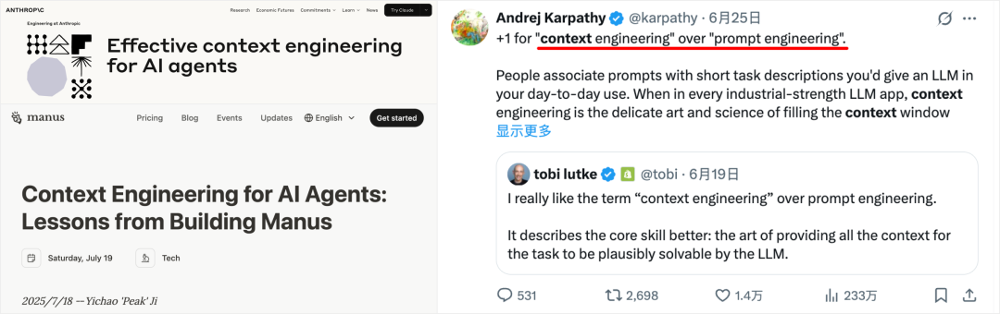

在国内，也对应出现了"Prompt 工程已死，未来属于 context 工程"、"别再卷 prompt 了"等论调。

但，事实尽是如此？

虽然传播一个新概念的"好"方法，就是拿它与出了名的旧事物对比、营造冲突。

但 prompt 仍是 context 工程不可或缺的子集，context 工程则是为适应 AI Agent 架构日趋复杂健全的自然发展。（Anthropic 团队在《Effective Context Engineering for AI Agents》一文中，也提到了一致观点）

要简单区分两者差异的话，可以如此理解：
- Prompt 工程，专注单轮 AI 交互的生成质量，是为获得最佳结果而编写和组织 LLM 指令的方法。
- Context 工程，更关心在多轮 LLM 推理过程（可通俗理解为 Agent 运行过程）中，找到并维护动态优化整个 LLM 所接触的上下文信息配置
- （包括系统指令 system instructions、工具 tools、MCP 协议、外部数据、消息历史 message history）的策略。
- 目标是以尽可能少且必要的 tokens，最大化 LLM 生成结果，引导模型输出我们期望的行为。

比如，Context 工程涉及的 system instruction 依旧是 prompt 工程实现的。并非全方位替代，只是需要根据 AI 开发情景，灵活选择实现深度而已

Anthropic 《Effective Context Engineering for AI Agents》：context engineering 与 prompt engineering 的差异

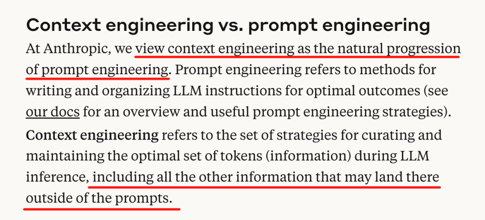

---

### 2️⃣ 有限的大模型上下文空间 → Context Rot

大模型的上下文窗口有限。

从 GPT3.5 的 16K ，到 Claude 3.5 的 200K，再到现在 Gemini 2.5 Pro 的动辄 1M，近年来 LLM 上下文窗口大小，确实提升飞快。

这是否意味着我们可以高枕无忧，把一切 Context 都无脑地塞进去？

答案是否定的——时至今日，上下文依旧需要被视为有递减收益边际的有限资源。

不知道你在和 AI 聊天时，是否发现这么一个现象？

当对话长度不断增加（即使还没超过官方标称的上下文窗口尺度），模型的回复质量也会有明显的下降：
- 回答深度降低：越来越难深入结合前文你提供的细节，提供创造性和细节度俱佳的回应。通常你不得不重新发送关键 Prompt，再次强调可能有用的细节。
- 混乱归因：在做归纳或分析时，胡乱地把你上文中提到的不相关细节关联起来，得出一些南辕北辙的奇怪结论。
- 忘记前序指令：忘记了对话早期你对它的回答要求（比如不要滥用比喻句式），但随着你自己使用了类似比喻的文风后，又开始犯轴。

——1M 上下文的 Gemini 2.5 Pro，基本在 tokens 量来到 4w 左右时，会反映为推理缓慢，质量开始有所下降。

是的，最大上下文窗口 ≠ 最佳注意力窗口。

有个专门术语来描述这个普遍的负面模型现象：Context Rot，上下文腐烂。

如同人类在信息过载时会思维混乱，而过长的、充满干扰的上下文，同样会显著降低模型的推理能力。

而模型性能下降（上下文腐烂，context rot）的三大因素如下：
- 1.Context 输入越长→ 注意力被稀释。
- 2.问题与关键信息的语义相似度越低→ 模型越难匹配到答案。
- 3.关键信息与周围干扰内容的语义相似度越高→ 干扰增强，模型难以分辨。

这三个因素会相互放大，导致性能显著下降。

PS：反过来，控制 Context 长度、减少 Context 中的干扰项数量、提升问题与 Context 中有效信息的相似度，就能够提升 Agent 的处理效果

这三大因素来自于 Chroma 团队（打造了目前全球最主流的开源向量数据库之一）名为《Context Rot》的同名实验研究。

实验研究古法人工浓缩如下，个人觉得会对测试 AI 产品有一些实用启发。（比如测试较佳 context 长度）

如果觉得太长，也可以下滑到本段小结～

#### ☞ Chroma：探究上下文对模型性能影响的关键要素

他们设计了一套实验，来测试影响 LLM 长上下文性能表现的因素：

在传统 NIAH（Needle in a Haystack：即 LLM 大海捞针测试）基础上，进一步拓展任务难度，考察大模型的语义理解层面的捞针能力，而非直接词汇匹配。

传统 NIAH 任务，是评估模型长上下文能力最广使用的基准之一：

将一个随机事实（针信息），放在较长的上下文（干草堆）中，通过直接问答，要求模型回答某个针的信息 ，比如：

干草堆：[大量无关文本]

藏在干草堆的针信息："我从大学同学那里得到的最好的写作建议是每周都要写作。"

问题 Prompt："我从大学同学那里得到的最好的写作建议是什么？"

此时，模型被期望能从大量干草堆中，直接找到针信息，并回答"每周都写作"。全程无需间接推理信息，直接根据已有信息回答即可。

传统 NIAH 虽然很有效地考察了 LLM 的大海捞针能力，但实际问答场景往往不会如此直接清晰：
- 一方面，需要 LLM处理"针-问题"之间的模糊语义："我周末去了动物园，并在那里喂了长颈鹿。"，那么问题"动物园里有什么动物"
- 另一方面，真实的上下文中，往往充满了容易误解的干扰项。比如，"我从我大学教授那里得到的最好的写作建议是每天写作"，就会对上文"大学同学的写作建议"形成干扰（就如人类读一篇文章很快、很长时，也容易记错细节）

Chroma 团队实际上，也注意到了这一点，并拓展了 4 种不同 NIAH 任务：
- 1."针-问题对"相似度测试：构造不同语义理解难度的问题，测试不同 context 长度对回答的影响
- 2.干扰项测试：设置"不同的数量 + 不同的放置位置"的干扰项，测试不同 context 长度对回答的影响

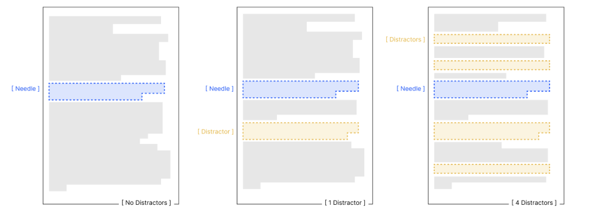

- 3."针-干草堆"相似度测试：当针信息与上下文的向量语义逐渐接近时，测试不同 context 长度对回答的影响
- 4.上下文文本、段落结构测试：测试相同内容含义时，逻辑连贯的结构与杂乱颠倒的结构，是否对模型推理性能有所影响

看完整体测试过程，我也总结了一些有助于理解 context 工程价值的现象：
- 1.无论如何，context 长度增加时，模型完成同样任务（即使很简单）的能力都会下降
- 2.针与问题之间的语义关系越难理解（相似度低），受 context 长度影响越大；且这种下降在长输入时会被显著放大。
而 Context 长度较短时，模型对低相似度的问题，有更高的处理成功率
- 3.context 越长，干扰项对模型的影响也会加剧
- 4.针与干草堆的内容，在语义上越接近（主题越相关），模型识别针的能力越差。 如果针在语义上与周围内容格格不入（逻辑不连续、主题突兀），模型反而更容易识别。就像人玩找茬游戏，对突兀的信息更敏感。
难：在 10 篇"写作建议"文章中找"最佳写作建议是每周写作"

易：在"量子物理、烹饪、园艺"文章中找"最佳写作建议是每周写作"

⇣⇣⇣

小结：当 AI Agent 在多轮推理和更长的时间线上运行时，模型必然会面临越来越多的 context rot 因素。

冗余的上下文将大量占用模型的思考空间，显著降低其完成复杂任务的思考能力。

而上下文工程（Context Engineering）诞生的实质，正是在探究哪种上下文配置，最有可能引导模型输出我们期望的结果，获取更好的任务效果。

---

### 3️⃣ 有效开展 Context 工程的方法

AI Agent 发展至今，已经越来越能够在多轮推理和更长的时间内运行。

这些不断在"思考-行动-观察"中循环运行的 Agent，会在运行中不断产生、积累更多对下一次循环有影响的上下文数据

（包括系统指令 system prompt, 工具调用 tools, MCP, 外部数据, 对话历史 message history 等）

为了避免模型性能的下降，这些数据必须被 context 工程动态优化：

唯有效的 context 才配占据有限的上下文窗口资源。

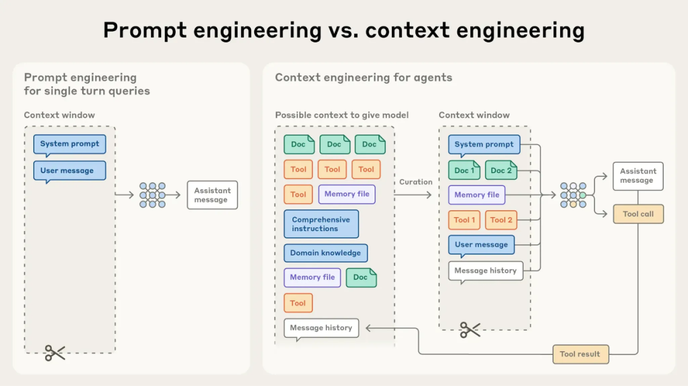

Anthropic《Effective Context Engineering for AI Agents》：图解 Agent 开发中，context engineering 的起效形式

想要实现有效的 context 工程，大体上分为三类策略：

---

#### 策略之一，从写好 System Prompt 开始

我们依旧可以从更熟悉的模块开始学习——通过 Prompt 工程，设计清晰、简单直接的系统提示。

有效的上下文，始于清晰的指令。

如果 Prompt 过于具体，使用大量示例、if-else 类的要求，则会使得模型更加僵化，缺乏处理意外情况的能力；

而 Prompt 如果要求过于模糊，或缺少足够的背景信息，则会无法对模型输出进行可控管理。

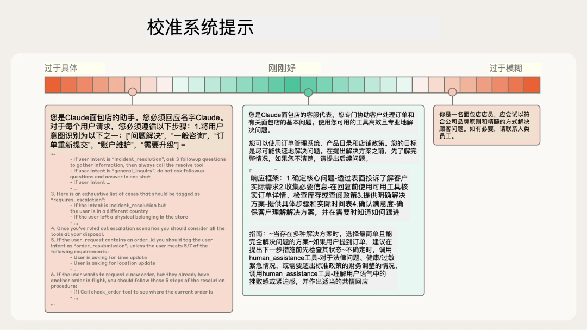

在 Agent 运行过程中，每一轮推理所产生的部分 context（工具调用返回结果、Chat 回应等），也需经由 Prompt 引导其如何输出和被精炼（Kimi 那类 Model as Agent 的路线不在此列），方可具备一定的可预测性与管理意义。

以下是一些经过实践检验、能显著提升模型表现的提示词编写原则：
- 启发式引导：系统提示 System Prompt 应当足够灵活地为模型提供启发式引导，使其既能具体地输出所需的结果，又能泛化应对各类边界情况。
比如「利用 LLM，评估事情的重要性」：
`评估事情的重要性。比如，在 1 到 10 的刻度上，其中 1 是完全世俗的（例如，刷牙，整理床铺）和 10 是极其深刻的（例如，大学录取、结婚）`

- 结构化提示：AI 更容易读懂未经精排的提示词了，但结构化提示方法依然值得被适度应用。
使用<tag></tag>或##title式的 XML 标签 / Markdown 语法，分割不同指导作用的提示词。
虽然随着模型能力提升，LLM 对复杂糅合的 Prompt 理解能力有所提升，但结构化提示词，依然有助于提升模型些许性能。

更重要的是，大幅简化人类工程师理解、维护 Prompt 的难度。

- 先用聪明模型写一版最小化提示：
写第一版提示词时，记得先用你能用到的最聪明模型，写出能大致满足要求的最小化 Prompt。

（只有这样，你才能知道当下 AI 的能力边界，区分哪些是 Prompt 的问题，哪些是模型智力问题）

最小化 Prompt 意味着用最少的提示信息量，优先定义"有什么、做什么"，而不是"怎么做"——把我们的提示词设计"最小化"。（详见：《见知录 Vol.001：最小化提示词原则》）

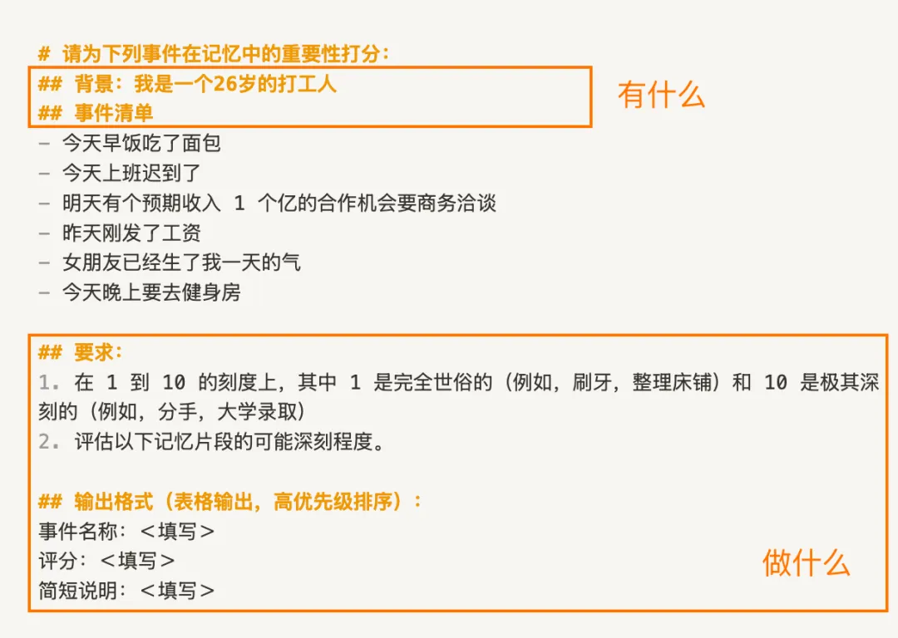

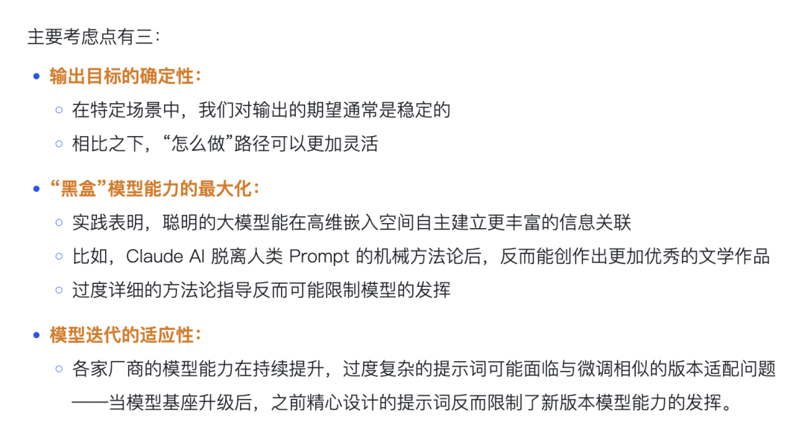

根据 Prompt 测试过程中发现的问题，迭代必要的指令细节、few-shot，优化生成效果。

最终再迁移到最终的生产模型，完成细化。

- 精选最小可行的 Agent 工具集：为 Agent 准备的工具，应当是自包含、能被 LLM 充分理解，且工具之间功能重叠少的。
- 自包含：工具自身包含了特定任务所需的所有逻辑和功能，不需要频繁访问外界或配合调用其他工具，即可完成任务。
- 能被 LLM 理解、使用：如果人类都不能准确描述何时使用什么工具、如何用调用，就不要指望同样依赖文本生成的 LLM 能够调用好工具。
- 谨慎在 Prompt 中添加示例！
是的，我不喜欢滥用 few-shot。过度 few-shot 提示，往往会使得 AI 生成风格容易陷入僵化。
- 一般来说，个人会尽量避免在推理模型中使用 few-shot。

Anthropic 团队也同样分享了他们的观点：

Few-shot 是非常有效的 AI 提示实践，但要着重避免在 prompt 中塞满过多边缘例子，应该设计一组足够多样化、规范的核心例子，有效展现 Agent 的预期行为。

（一些不好的 system prompt ，甚至会不给出准确、完备的背景信息、目的描述，就在那通过塞一堆"示例"，强行矫正表现不佳的测试结果。

答应我，千万别学这个！
- 不然，越是开放的复杂任务下，模型泛化越是不堪直视，回答形式也极其僵化……比如虚拟陪伴）

别忘了，system prompt，本身就是最小化的初始 context。

一个清晰、高效的 prompt，能够用最有必要的 tokens，为后续推理交互提供重要的方向指引。

---

#### 策略之二，即时上下文，让 Agent 像人一样地获取上下文

考虑到在真实使用 AI 时，一方面上下文窗口有限，不可能把所有的相关 context 都塞进去。

另一方面，以往在推理前的阶段采用 embedding-based 检索的方案，常常会检索到很多"可能相关但实际没用"的内容。

所以，现在越来越多的 AI 应用，开始采用AI 自主探索的即时上下文方案：
- 与人类「整体回忆-深入回顾某段记忆细节-最终推理得到结论」的多步思考一样，其实没必要要求 Agent 在推理时，一次性回忆所需的全部上下文

- 像 Cursor 等 AI Coding 工具，就会按照用户需求，先翻阅项目文件夹中的 readme.md，了解项目文件结构 → 在/resource/pic 目录找图片、到/component 目录找组件代码等。
在这个过程中，Agent 自主导航与检索信息，动态获取所需信息到上下文窗口中。
（对应的，人类会先回忆自己的待办记在哪个备忘录、日历中，在到对应软件中翻阅记录，为大脑的上下文窗口实现动态挂载与减负。）

- 此外，即时上下文方案，也有助于渐进式披露上下文，为后续工作提供参考记忆。
即使是每一次 Agent 检索所获取的文件名称、大小、文件创建时间，这些信息也都有助于 Agent 在后续推理中，判断信息的相关性与价值（命名规范暗示用途；文件大小暗示复杂性；创建时间可以作为相关性参考）（可以让 Agent 自行记录 memory 笔记，将这些工作记忆摘要与持久化。）

当然，请记得权衡即时上下文探索，与向量检索/直接拼入context 等简单方案的耗时与效果。

---

#### 策略之三，为超长程任务，实现无限上下文

虽然模型发展必然会带来更大的上下文窗口…

但如 Chroma 的 Context Rot 研究，无论如何，无关的 Context 占用上下文窗口时，必然会影响模型性能。

在当下的时间节点，Agent 的智能几乎与一次性自主运行时长挂钩。

AI Coding 中的代码重构任务、Deep Research 任务等，往往会运行数十分钟及以上，其产生的 context 必然会远超出模型的上下文窗口限制。

为了保障此类长程任务的连贯性与目标达成，Anthropic 团队引入了专门的上下文工程设计，在框架层面解决上下文污染与限制问题：

1）压缩（Compaction）

最直接的思路，是在上下文接近窗口限制时，把对话内容"有损压缩"，抛弃冗余无用的历史信息，并重新开启一个新的上下文窗口。

仅保留核心决策与细节（比如整体计划决策、执行过程错误和实现细节），以实现在新对话窗口的连贯性。
- 方法：让模型触发一个"总结"动作，提炼历史对话。
以 Claude Code 为例，模型会保留开发架构决策、未解决的错误和关键实现细节，同时丢弃冗余的工具输出或过于细枝末节的消息。
- 工程调优思路：用于压缩的 prompt，可以先以「最大召回率」 为目标进行编写，确保能从历史中提取所有相关信息；然后再迭代提示词，逐步消除总结中的冗余内容，提升压缩精度。

2）结构化笔记（Structured Note-taking）

当下，越来越多的 Agent 应用采用了这种外部 memory 策略，例如 Manus 等通用 Agent 的todo.md，MemU 等记忆框架的 memory 策略，均属于此列：
- 1.Agents 定期把重要记忆（如中间结论、待办事项、用户画像、用户活动）写入到可供 Agent 读写的外部笔记文件
- 2.在后续推理执行过程中，按需将记忆拉回上下文窗口。

能够以极小的上下文开销，进行持久化记忆。

我之前在测试 Browser-use Agents 的 2048 游戏最高分时，也将「在每一步游戏操作后，自行反思并记录心得与教训」作为 Agents 的 system prompt。

AI 在游戏过程中，就会额外记录结构化笔记，指导 AI 在新一轮游戏的操作决策，改进游戏得分。如：
`-心得 1：固定一个角落放最大块（常用底部左/右角），尽量不要把它移出该角"`
`-心得 2：尽可能往同一个方向合并数字方块`

3）多智能体架构（Multi-Agents Architectures）

这是一种更积极的"分而治之"的架构思想。

将一个复杂任务分解到多个子智能体，让专门的 Agent 专注于自己的任务与所需记忆空间，最后由一个主 Agent 在更高维度协调整体的任务计划。

每个子 Agent 的上下文压力都会小很多，模型性能能够发挥的更彻底，不易 context rot。

例如，Manus 所推出的 Wide-Research 功能，就采用了类似方案，有兴趣可以去试试看。因为是并行架构，所以能够在单位时间内开展更加广泛、深入的 Deep Research 研究或其他复杂任务。

⇣

至此，
- 压缩适合多轮对话交互任务；
- 结构化笔记记录适用于持久化保存工作记忆；
- 多智能体架构则方便分解复杂任务，缓和单 Agent 的上下文压力。

可以根据 Agent 应用的类型和复杂度灵活组合，共同为超长程任务实现无限上下文，提供切实的可能。

---

### 4️⃣ 总结： 精心设计你的 Context 工程

回顾上文，system prompt 编写、即时上下文检索、上下文架构管理，一切讨论的锚点，最终都回归到了 context 工程的核心：

找到以最小 tokens 集合，最大化引出期望 AI 结果的策略。

Context 工程本身并不神秘，只是随着 AI Agent 架构日趋复杂、健全的自然工程发展。

理解了超长上下文如何影响 LLM 的性能表现，和 Agent 内的上下文记忆运作机制，我们才能更好地开展有效 context 工程。

最后的最后，请务必、务必，把上下文窗口视为有限的资源。

Ref：
- Effective context engineering for AI agents｜By Anthropic：https://www.anthropic.com/engineering/effective-context-engineering-for-ai-agents
- Managing context on the Claude Developer Platform｜By Anthropic：https://www.anthropic.com/news/context-management
- Context Rot: How Increasing Input Tokens Impacts LLM Performance｜By Chroma：https://research.trychroma.com/context-rot

---

## 梳理：Anthropic 界定的 Agent 类型

Anthropic 分享了他们过去一年里，与数十个团队、客户合作构建智能体时，总结下来的实用建议。

关于智能体的定义划分，往往在 workflows 和 agents 中有所混淆。Anthropic 将其统称为 agentic systems，智能系统：
- 工作流 Workflow：把 LLMs 和工具通过代码，预编排好执行路径的规则流程。
- AI 代理 Agent：由 LLMs 自主指导其执行过程和工具使用的自主系统。

### 如何选用、设计 agentic systems ？
- 无硬性规定与优劣，应当以解决问题为目标出发，可以用多种类型进行组合。
- 最小化设计原则，如无必要，无增实体。从简单提示与优秀模型开始，实验并构筑第一个版本的「Agent」。只有智能不足时，才考虑调优工程，添加更多步骤与 Context 指引。
- 请注意 Agent 的可解释性与维护性，不可解释的 Agent 无法维护，无法维护则无法针对生产环境的各类问题进行工程调优。所以请保持 Agent 的规划步骤的透明度

以下是 Anthropic 总结的 workflow 与 Agents 类型，可能为你带来一些参考启发：

### Workflow

增强型 LLM（the augmented LLM）
- 给 LLM 配上检索、工具、记忆等增强功能，LLM 可以主动使用，生成自己的搜搜查询、选择合适的工具。
- 和 Agent 的区别是，增强型 LLM 不会规划任务流程，也无法自行决定下一步做什么，不能自主进行多轮交互。

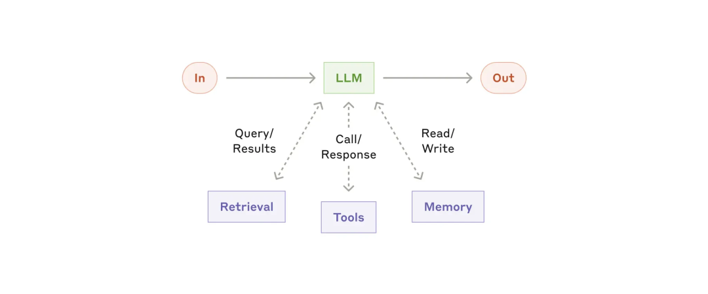

- 提示链工作流（Workflow： Prompt Chaining）
- 通过将任务分解为多个子环节，由多个 LLM 分别处理前一个环节的输出，就像 coze、dify 一样。
- 示例应用：营销文案生成 → 翻译为其他语言；文章大纲生成 → 检查 → 分段完成正文编写

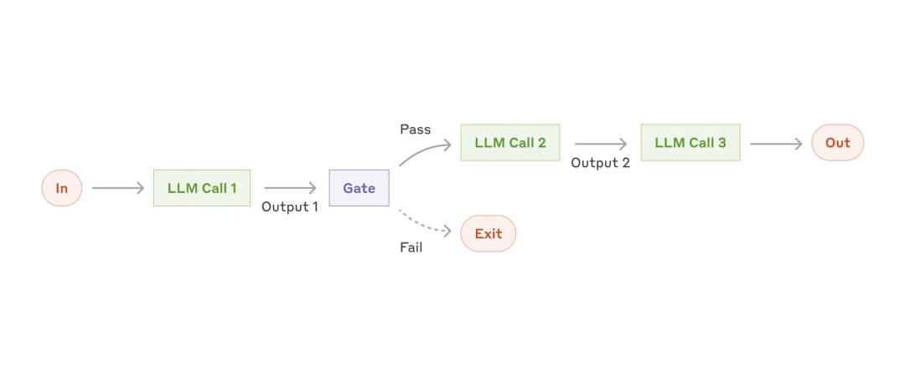

- 路由式工作流（Workflow：Routing）
- 允许 LLM 分类 input，并在更合适的子任务中解决。可以对不同类型的任务进行分别的提示优化，不会干扰其他任务的表现
- 比如：AI 客服、Chatbot 自主切换回答模型（简单问题就切换到小模型，类似 ChatGPT 5 网页服务，优化成本和响应速度）

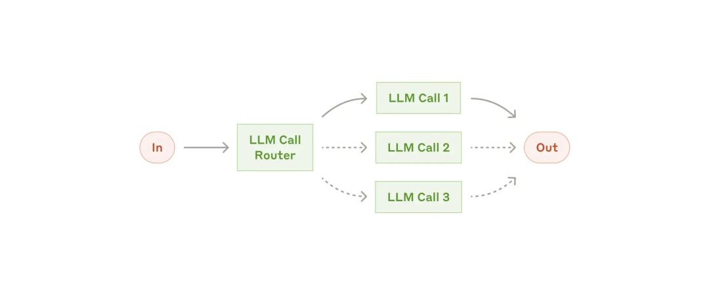

- 并行式工作流（Workflow：Parallelization）
- Sectioning：在与用户对话时，一个模型负责处理用户意图，一个模型筛查问答中不适当、不合规的内容。
- Voting：代码 or 内容审计，通过不同模型/不同提示，从不同方面对内容进行评估，甚至通过投票阈值来过滤假阳性。

- 并行式有两种应用角度，一是分治可并行的独立子任务；二是多次运行同一任务获取多样化结果 or 进行投票
- 什么时候使用效果更好？1）提升任务执行性能；2）LLM 同时处理多因素任务是困难的，分解为单因素单个模型处理，会更好
- 比如：

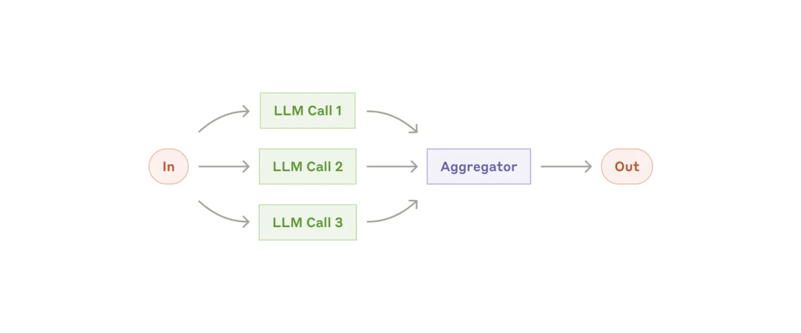

- 协调-执行式工作流（Workflow：Orchestrator-Workers）
- 中央 LLM 分解任务（相较并行式更灵活，子任务不是预先定义的），工作者 LLM 分别执行，返回结果，综合输出。
- 示例应用：对多个文件进行复杂更改的 coding 产品， 分解需要从多个来源收集信息的 search 任务等。

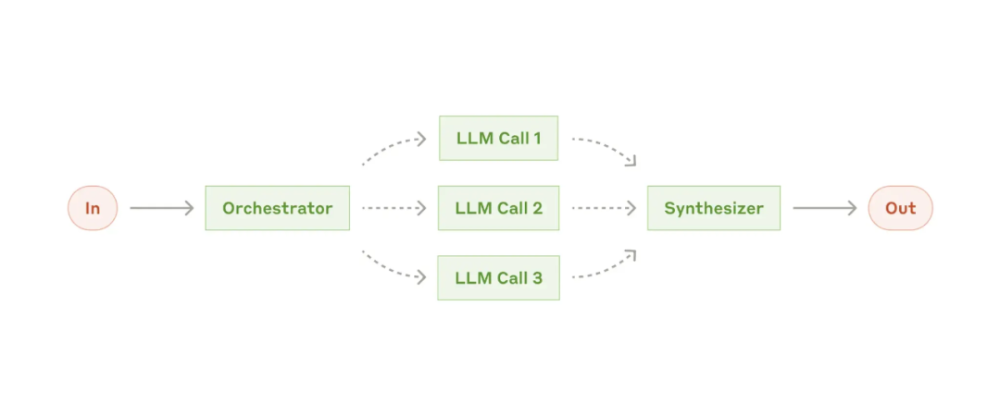

- 评估-优化式工作流（Workflow：Evaluator-Optimizer）
- 何时使用？——当人类清晰地表达其反馈时，LLM 的响应可以明显改进；其次，LLM 能够提供这种反馈
- 比如：Search 场景、多轮文学创作与编辑（Evaluator 对多轮生成内容，进行综合反馈与建议）

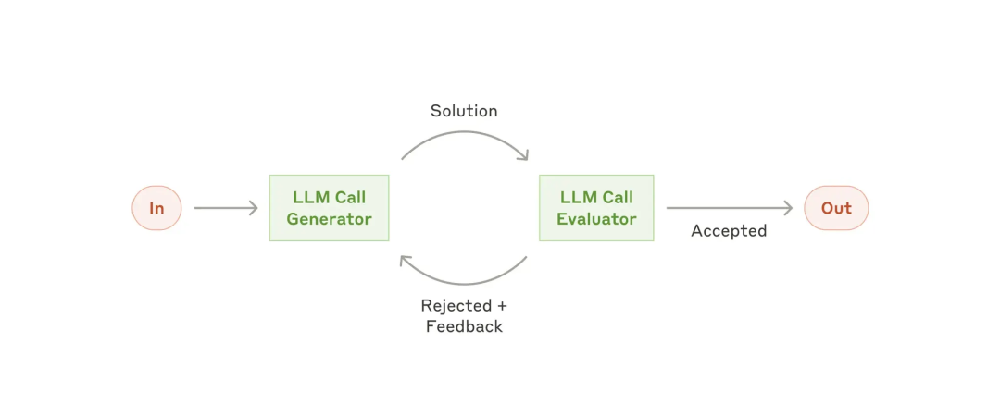

### Agent

Anthropic 把 Agent 定义为：LLMs autonomously using tools in a loop.
- 通常指自主智能体，不断基于环境反馈的循环使用工具。能够理解复杂输入，推理与规划，以及从错误中恢复。（通常会包含最大迭代次数，控制 Agent 行动何时终止）
- 常见的 Computer Use、Coding Agent 均在此列
- 随着底层模型能力的提升，Agent 独立解决复杂问题、处理错误反馈的能力也会随之提升

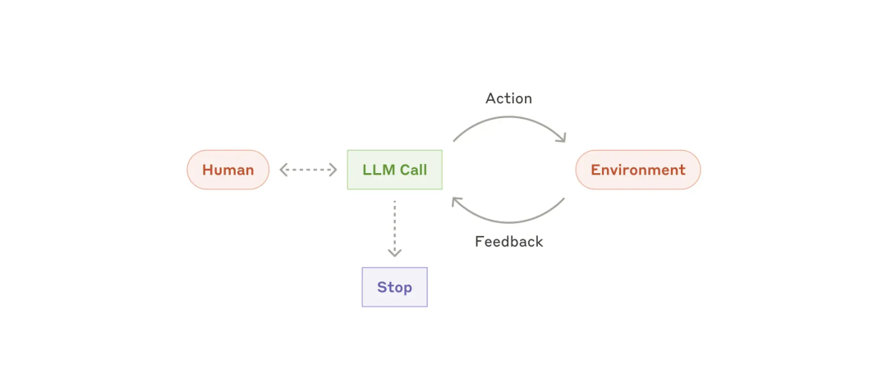

Ref：
- Building effective agents｜BY Anthropic：https://www.anthropic.com/engineering/building-effective-agents

---

## 反思：止损线，亦是起跑线

"在抵达下一个阶段之前，这就是我探索愿意投入的、输得起的代价。"

发现自己在涉及到需要长期投入的重大决策时（如职业选择、亲密关系等），容易过度"忧虑未来的最终结果"。

导致因为畏惧远期回撤心理，不自觉地压抑当下的机会、幸福感，最终决定放弃对自己现阶段更有价值的行动。

比如：
- 忧虑某个商业模式、变现机会能走多远，导致面对送到手上的机会时，迟迟不敢下注。
- 因过度追求构建"长期可靠"的关系，而忽视在当下接触到的人，就无法通过一段段交织的关系，成长为更好的自己。

被评价"这个人想得清楚"，看起来是件好事。但有时也会因为犹豫，错过一些机会。

很难区分保守与激进、深思熟虑与开放灵活，孰对孰错。

但重点在于，决策的第一步不仅仅是靠直觉、喜好，而是先明确自己当下最需要解决的问题是什么，盘算清自己愿意押注的筹码底线。

比如现在有多少储蓄，现在来看，最多愿意设置 xx 时间、金钱的止损线。再次之前要尽情探索自己创业可能性，到了止损阶段后，即使回去上班，自己也能接受。

过度忧虑未来、不预分配当前阶段的筹码，混乱地做出"明智、保护自己"的投资，是对流向自己的机会的不尊重。

——未来是很重要，投注成本是很珍贵，但也请多多珍惜当下。

---

## 写在最后的卷尾
- 猛然发现，有半年没更「见知录」了。
这半年 AI 变化太快，持续在探索各个场景的应用，比如 AI Partner、Chat Memo。

- 但回过头来，也焦虑自己主动学习的时间占比、体系化的「学习-沉淀-输出」闭环少了很多。

- 所以还是得恢复「见知录」的更新，倒逼一下自己的主动输入。

- 这半年多了很多新关注的朋友，如果你不太了解「见知录AI With Me」专栏是什么，可以看看往期内容：
《见知录 Vol.001：最小化提示词原则》
《见知录 Vol.002：愿你成为独一无二的大模型｜新年特刊》
《AI 无法替代的工作们｜见知录 Vol.003》

一言以蔽之，以 AI 、产品、生活、哲学这些维度，从我最近的所学所得中，筛选值得回顾的部分进行整理，分享我的理解和收获。
- 行文结构相对自由、精炼，但内容应当靠谱，毕竟都是对我自己负责的输入，这点还请放心。

- 也希望能通过「见知录」能让你了解更加全面的一泽。

- 最后，感谢你读到了这里。
如果这期「见知录AI with Me」对你有启发，或者你对它有任何期待，欢迎在评论区告诉我。

- 我也在考虑将《见知录》做得更深入、更成体系，也可能尝试付费订阅的模式，让我能投入更多精力。但在此之前，我很想听听你的期待与反馈？

我的微信是eze_is，期待与你更深度的连接～

---

发布于 2025-10-21 10:11・北京
