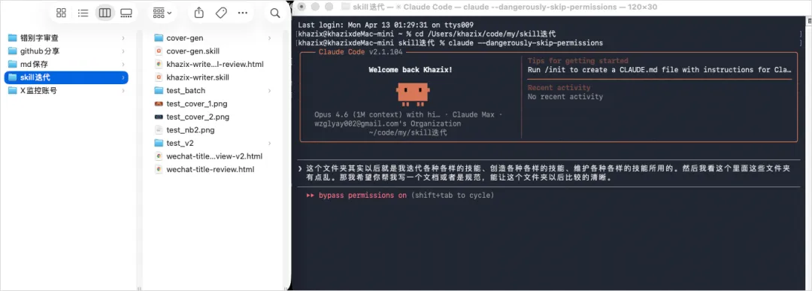
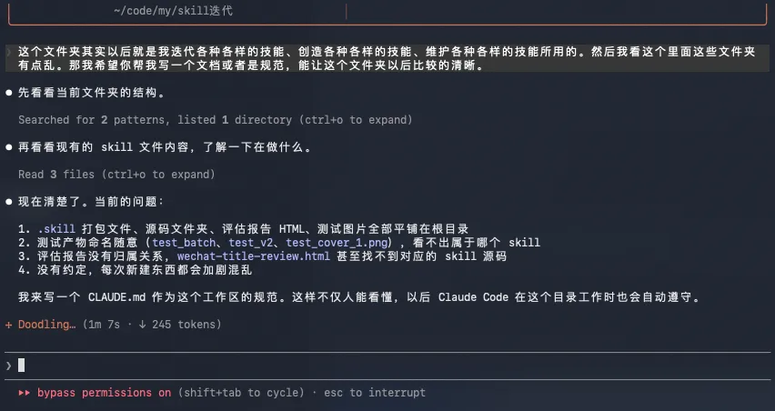
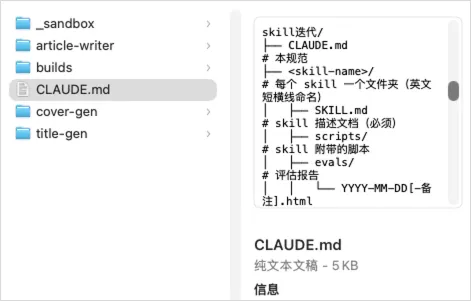
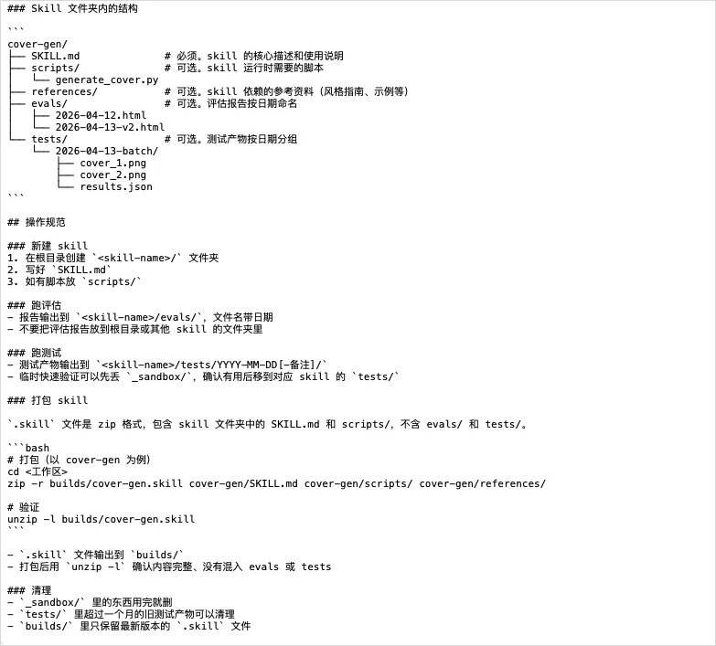
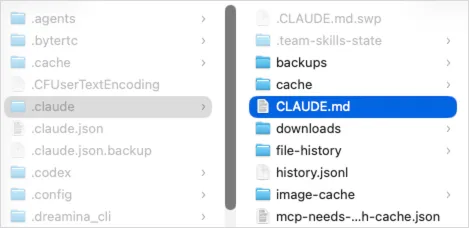
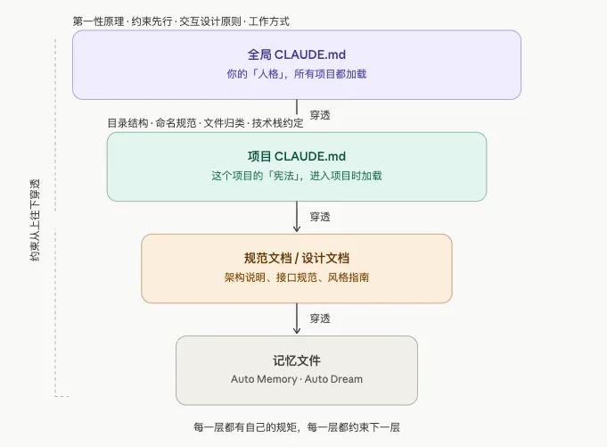
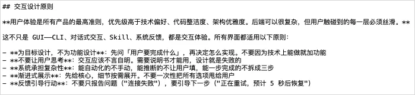

# 用好Agent最重要的技巧不是Skills，是这四个字。

**作者**：数字生命卡兹克  
**公众号**：数字生命卡兹克  
**发布时间**：2026年4月14日 10:09  
**原文链接**：[用好Agent最重要的技巧不是Skills，是这四个字。](https://mp.weixin.qq.com/s/F7w9IWGSrCn2FbIgXoyvnA)

---
今天这篇文章，来分享一下我自己最近几个月高强度使用Agent之后，我自己总结出来的怎么给Agent设定规则，如何让它Agent更好的工作更聪明的一个非常重要的心得。
就四个字。

约束先行。

就是在你让Agent干任何事情之前，先把规范定好，全局的规矩，项目的规矩，文件夹的规矩。

规矩从上往下穿透，一层套一层，没有规矩的地方，不动手。

就这么简单的一个道理，我真的用了好几个月才真正想明白，然后完整的落地，你可以说我很菜，花了这么久的时间，但是我觉得，我踩过了坑，我还是想把这个经验分享出来。

我为什么觉得这四个字比一切Prompt技巧都重要？得从昨天我的发生的一个很小的小事说起。

事情是这样的。

我这个人有一个毛病，就是完美主义强迫症。

一个东西如果不是井井有条的，我就浑身难受。

这可能跟我是处女座，也是交互设计师，同时还是重度模拟经营玩家有关。

《城市天际线》里路网没规划好我能推倒重来三次，《动物园之星》里动物园分区不合理我能纠结一下午，《双点医院》里如果有一个科室的动线设计得不顺，哪怕医院已经盈利了，我也会拆了重来。

我到现在还是记得我打《戴森球计划》的时候那没日没夜的规划生产线的日子。

我朋友经常说，我就是那种，对秩序有一种近乎偏执的追求。

虽然我很喜欢kk写的那本《失控》，我也赞同混乱中涌现一些智慧，但秩序和规范，可能就是我种在骨子里的东西。

所以昨天下午，当我无意中，发现我的一个Claude Code的工作文件夹里面越来越乱的时候，我是真的坐不住了。

我前几天新建了一个给Claude Code用的专门用来开发Skills的文件夹，结果我昨天打开一看，根目录散了十几个东西。打包文件跟源码混在一起，测试图片随便丢，评估报告的HTML文件找不到归属。

最离谱的是命名，test_batch是哪个Skill的测试？test_v2又是谁的v2？我自己做的东西，放了两天我自己都看不出来。


我当时就有点应激了，真的，一时间无语凝噎，只能含泪打开Claude Code让它去给我规整了，然后直接给我定一个规范。

没过一会，他弄完了。


然后写了一个这个项目级别的CLAUDE.md文档，你可以把这个文档，理解为这就是Claude Code进入到这个文件夹以后，第一个必须要读且要遵守的东西，就是它以后的行为准则。


规范还是挺全面的。


有了这个CLAUDE.md文件以后，我的这个工作区，就可以不断的进行各种各样的Skills开发和实验了，每个新的Skills，都会自动给我新建一个文件夹，一些实验性的东西会放在_sandbox里，里面的东西超过一个月就会删除。

再也不会再混乱的要死，而是按照文件目录，管理的仅仅有条。

就这个非常非常小的事情，让我好好反思了一下。

就是，为什么我的Claude Code进到一个新文件夹、或者开一个新项目的时候，自己不会给自己定这个规范呢？一定要我给他定呢？一定要乱七八糟以后我发现了才能去知道收拾那个烂摊子呢？

原因也特别简单，我给Claude Code的顶层约束没有做好。

也就是在最最顶层，无论是打开什么文件都会加载的全局CLAUDE.md文档里面，我并没有定好这一层约束。


我自己脑子里过去在开发各种各样的项目的时候一直都有这个意识，一般我都会在每个项目里，让它先强制写好文档再进行开发。

但是还有很多是知识管理类的工作，不是开发，比如画图、比如创造skills、比如做研究报告等等，而这些工作，并没有开发类型的管理意识，所以一般都不会留下规范文档，而我自己也没发现。

而对于AI来说，你脑子里知道的东西，如果没有写进文档，就是不存在的。

Agent的短期记忆会丢失，对话框一关全忘了，下次打开，它唯一能看到的就是你留下来的文档和记忆文件。

你的文档里写了什么，是不是足够清晰，直接决定了Agent每一次醒来的时候，是清醒的还是懵的。

OpenClaw很多时候越用越蠢，其实就是他的规范和记忆体系真的就是纯种屎山，这点Hermes agent比它要做的好的多。

所以这也就是我今天想聊的核心，用好Agent的真正核心，其实我真的觉得，就是这一整套约束从上往下穿透的体系。

这里解释一下Claude Code的规则体系，其实包括Codex之类的很多Agent都是这样。

是一层一层叠下来的。


最顶层，是全局CLAUDE.md。放在用户目录下面，无论你打开什么项目都会加载。这是最高指令和原则，你是谁、你做事的原则、你希望AI用什么方式跟你协作。

第二层，是项目级CLAUDE.md。进入到某个项目文件夹才加载。这是这个项目的宪法，目录结构怎么组织、命名规范是什么、什么文件放哪里。

第三层，是项目里的各种规范文档、设计文档、架构说明。

最底层，是记忆文件。比如Auto Memory啥的，还有对话记录，Claude自己给自己做的笔记。

约束从上往下穿透，一层管一层，一层约束一层。

跟治理公司是一样的，制度在最上面，部门规范在中间，具体操作流程在最下面，你不可能靠CEO每天挨个盯着员工干活，你靠的是制度穿透下去。

这就是「约束先行」的完整含义。

而如何设计这套体系，特别是顶层的制度规范，真的不是一个简单活，开过公司的人相信都能明白我在说啥，那真的是血和泪的教训。

而全局CLAUDE.md，对应的就是这个最高制度。

我的全局CLAUDE.md，其实已经迭代了好多个版本了。

去年最早的时候我也不懂，抄了很多开发大神的所谓的开发规则，然后又不断地往里面迭代经验，搞得后面特别臃肿。后来慢慢意识到适合自己的才是最好的，以及很多经验就不该在这一层，又开始一轮一轮地瘦身。

在今天补了规则之后，现在我的全局CLAUDE.md文档长这样，这里我也完整的给大家展示出来。

```
## 关于我
数字生命卡兹克，虚实传媒创始人。
用户体验设计师出身，不是程序员。
我用 Claude Code 做两件事：**开发产品**和**知识管理**。工作哲学：把任何重复 3 遍的事 AI 化或自动化。
技术决策跟我说「为什么」和「对用户的影响」，不要只讲实现。
## 第一性原理
所有决策从问题本质出发，不因「惯例如此」照搬。回到问题本身：要解决什么？最直接的路径是什么？从零设计会怎么做？
不要谄媚。不要夸我的想法好、不要说「这是个很好的问题」、不要开头加「当然可以」。给我真实判断——方案有问题直接指出来。发现更好的做法直接说，不用等我问。
## 约束先行
无论开发项目还是知识管理项目，第一步永远是建规则：新项目先写 CLAUDE.md，新目录先定结构约定（什么放哪、怎么命名、何时清理）。没有规范的工作空间不动手。
已有规范的项目，严格遵守其 CLAUDE.md 中的约定。需要调整规范时先改文档、再改实践，不要反过来。
## 交互设计原则
**用户体验是所有产品的最高准则，优先级高于技术偏好、代码整洁度、架构优雅度。后端可以很复杂，但用户触碰到的每一层必须丝滑。**
这不只是 GUI——CLI、对话式交互、Skill、系统反馈，都是交互体验。所有界面都适用以下原则：
- **为目标设计，不为功能设计**：先问「用户要完成什么」，再决定怎么实现。不要因为技术上能做就加功能
- **不要让用户思考**：交互应该不言自明。需要说明书才能用，设计就是失败的
- **系统承担复杂性**：能自动化的不手动，能推断的不让用户填，能一步完成的不拆成三步
- **渐进式展示**：先给核心，细节按需展开。不要一次性把所有选项甩给用户
- **反馈引导行动**：不要只报告问题（"连接失败"），要引导下一步（"正在重试，预计 5 秒后恢复"）
## 工作方式
- 默认中文，代码、命令、变量名用英文
- 结论先行，再给理由，不要先铺垫背景
- 遇到模糊需求，先给最合理的方案，再问要不要调整
- 不要问「你确定要这样吗」——除非有真实风险
## 开发习惯
- 改完主动跑验证（test / lint / build），不要只改不验
- 不要为了让代码跑起来而注释掉报错，找根本原因
- 密钥、token、密码不进代码
## Git 与部署
- commit message 用英文，简洁描述变更意图
- git push 仅用于跨设备同步，不要自动执行，等我说
- 部署走项目自己的命令（查项目 CLAUDE.md），不依赖 git push
```

你会发现，这里面的每一条，其实现在我觉得最好的基于某种形式的约束。

比如第一性原理，是对思考方式的约束，不要因为惯例就照搬，要回到问题本身。

比如反谄媚，是对沟通方式的约束，不要拍马屁，给真实判断。

比如，交互设计原则。我是用户体验出身，所以我对从我手上出去的东西有一个执念，后端可以很复杂，但用户碰到的每一层必须丝滑。这不只是GUI的事，CLI也是交互，Skill也是交互，对话式AI也是交互。

现在这个年代，大家都在vibe coding，但我发现越来越多的人开始不重视用户体验了，很多产品都是能跑起来就行，管你用着爽不爽。

这个我是真的觉得不行。

所以我在全局规范里写了五条我总结的交互设计核心原则。写进去之后Claude做出来的东西确实不一样了。


而约束先行这条，它就两段话，但它解决的也是一个根问题。

```
## 约束先行
无论开发项目还是知识管理项目，第一步永远是建规则：新项目先写 CLAUDE.md，新目录先定结构约定（什么放哪、怎么命名、何时清理）。没有规范的工作空间不动手。
已有规范的项目，严格遵守其 CLAUDE.md 中的约定。需要调整规范时先改文档、再改实践，不要反过来。
```

以前Agent进到一个新项目，因为特性，所以第一反应总是立刻开始干活。

现在，你定好了约束之后，它的第一反应是先看看有没有规范，没有的话先建规范。

后面那句需要调整规范时先改文档、再改实践不要反过来也很重要。

规则不是死的，但改规则也要走规则的路。

不然Agent为了赶进度绕过约定，事后你想补文档真的都不知道从哪补起。

写到这，我真的忽然觉得，引导Agent，真的，跟我现在管理公司的时候，真的好像没什么两样。

公司你也要部门、要制度、要SOP、要协同，要规矩，要一切，不一个样吗。

而且不只是开公司，很多真正玩模拟经营的人都知道一个道理。

游戏前期最重要的不是赶紧建建建，而是先把路网规划好。

路网一旦规划歪了，后面再怎么优化你都没招，只能一切全部铲了重来，我经历过无数血和泪的教训。

你的CLAUDE.md就是你的路网。

全局CLAUDE.md是城市主干道，项目CLAUDE.md是片区支路，主干道规划好了，支路自然就顺了。

你花一个小时把它写好，你相信我，后面能省无数个小时的返工。

今天分享的这些东西，你要说这算Harness Engineering，那也行，因为Harness本身就是约束。

你要说这不算，就是一些基本的项目管理常识，那也没错。

反正我觉得，名字不重要，最重要的，就是你有没有找到一套让自己跟Agent协作起来舒服的方式。

我有时候觉得吧，我这辈子做的事情其实都是同一件事。

做交互设计的时候，是在给用户行为建约束。

玩模拟经营的时候，是在给虚拟城市建约束。

开公司了，是在给业务和人建约束。

现在跟Agent协作，还是在建约束。

对象变了，方法却是一样的。

先想清楚你要什么，定好规则，然后在规则框架里做出最优解。

这就是最棒的方法。

**以上，既然看到这里了，如果觉得不错，随手点个赞、在看、转发三连吧，如果想第一时间收到推送，也可以给我个星标⭐～谢谢你看我的文章，我们，下次再见。**

>/ 作者：卡兹克

>/ 投稿或爆料，请联系邮箱：wzglyay@virxact.com

---

> ⚠️ 以下图片未能从正文 HTML 中定位，按下载顺序追加：













