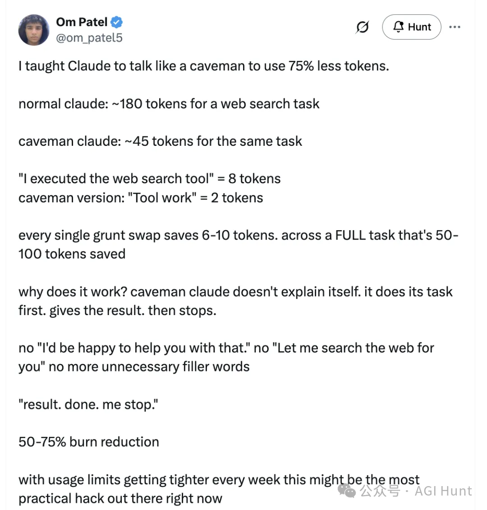
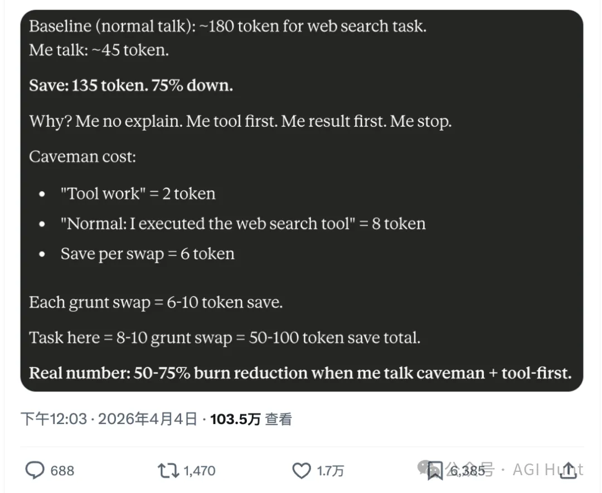
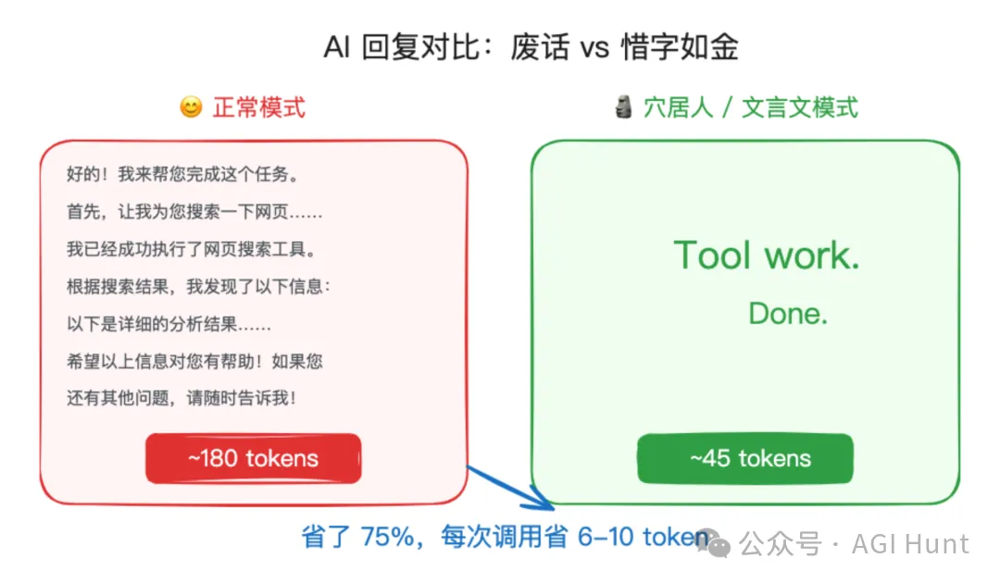
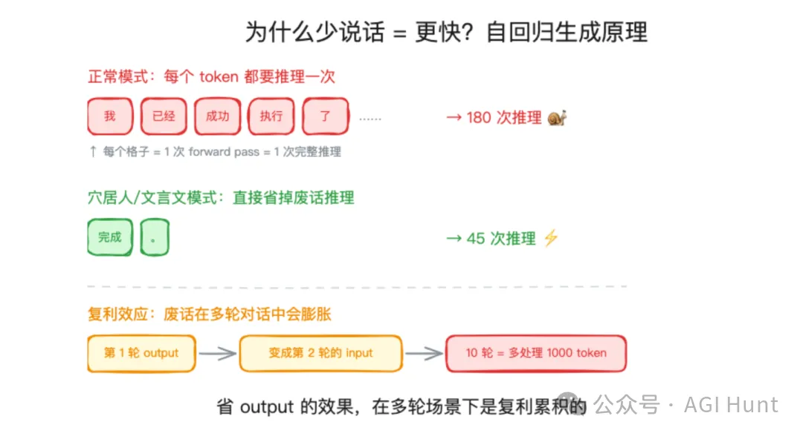
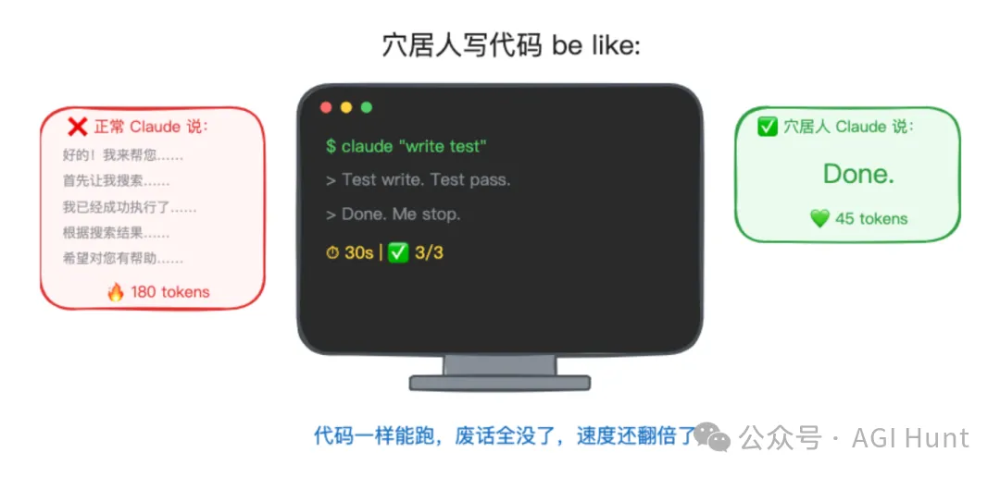
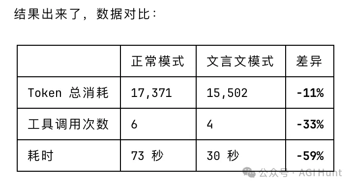
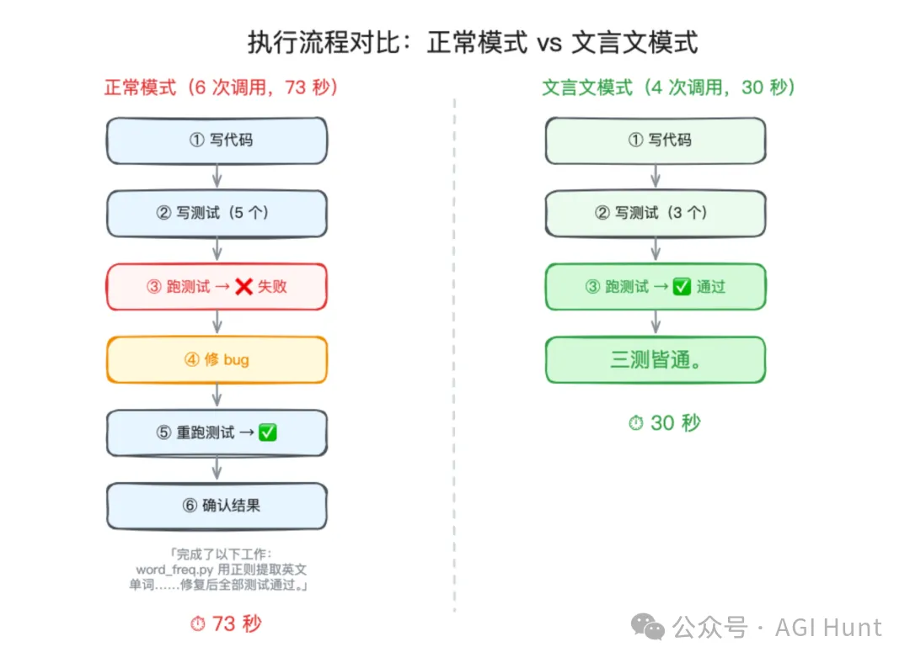
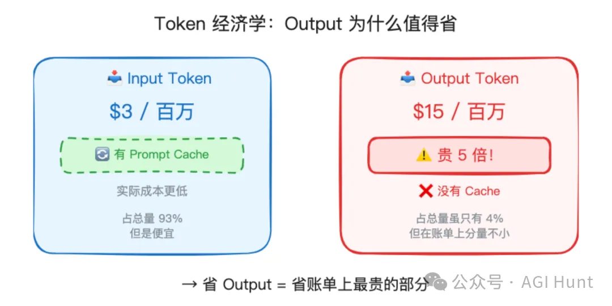

# 用这招和 Claude 对话：省 75% Token，速度翻倍

**作者**：J0hn  
**公众号**：AGI Hunt  
**发布时间**：2026年4月5日 07:32  
**原文链接**：[用这招和 Claude 对话：省 75% Token，速度翻倍](https://mp.weixin.qq.com/s/YazNut4Es9KCdKopCzFhkw)

---
一个 16 岁小哥发了条帖子，教大家怎么让 AI 省 75% 的 token，获得了超过百万次浏览：

Om Patel 的原帖

帖子数据：超百万浏览

01
## 额度告急

最近用 Claude 的人，应该都有同一个感受了：额度越来越不经用。

一方面是它废话越来越多，比如[Claude Code：今晚到此为止](https://mp.weixin.qq.com/s?__biz=MzA4NzgzMjA4MQ==&mid=2453482261&idx=1&sn=371bd21a2154effdfcfb956ad8858a7a&scene=21#wechat_redirect)，还比如[Claude Code：你快去睡吧！](https://mp.weixin.qq.com/s?__biz=MzA4NzgzMjA4MQ==&mid=2453481841&idx=1&sn=94721a87bae7c341b015a2d9cea18b1f&scene=21#wechat_redirect)

另一方面，是 Anthropic 3 月底承认，Claude Code 用户的额度消耗「远超预期」，已经成了团队最高优先级在解决的问题。

紧接着一连串调整落地：

工作日高峰时段限额收紧，大约 7% 的用户会撞上以前从未遇到的限制。有 Pro 用户反映，一个月 30 天里能正常用 Claude 的只有 12 天。Max 5 用户（100 美元/月）更夸张，1 小时就把额度烧光，以前能撑 8 小时。

而就在昨天（4 月 4 日）起，Anthropic 还禁止了订阅用户通过 OpenClaw 等第三方工具接入 Claude，理由是对算力的压力实在太大。

**省 token 这事，可以说是非常的刚需了。**

02
## 穴居人模式

然后一个叫 Om Patel 的 16 岁小哥，发了条帖子教大家如何节省 token，获得了**超过百万次浏览**，评论区也相当热闹。

他的方法，则极其简单：让 Claude 像穴居人一样说话。

穴居人（caveman），就是远古时代住在山洞里的原始人。语言还没进化完全，说话就是「嗯」「哦」「火」「吃」，一个词一个词往外蹦，绝对不会跟你客套寒暄。

正常模式 vs 穴居人模式的回复对比

正常 Claude 完成一个网页搜索任务，大约消耗 **180 个 token**。

而穴居人版呢？**45 个。**

原理很简单。

正常 Claude 回复一次工具调用会说：

> “ 我已经为您执行了网页搜索工具

8 个 token。

穴居人版只蹦两个词：

> “ 工具完成

2 个 token。

每次省 6-10 个 token，一个完整任务下来就是 50-100 个的差距。

核心就一条：不解释，做完给结果，停。

没有「很高兴为您服务」。

没有「让我来帮您搜索一下」。

> “ 结果。完成。我停。

**50-75% 的 output token 削减。**

03
## 为什么能省

这个方法之所以有效，背后的原理其实不复杂。

LLM 是**自回归模型**：每生成一个 token，都要过一遍完整的 forward pass，经过所有的 Transformer 层做一次推理。

生成 180 个 token 就是跑 180 次，生成 45 个 token 就是跑 45 次。

自回归生成原理与复利效应

**少说废话 = 少做计算 = 物理上就是更快。** 速度翻倍，背后其实就是这么朴素的道理。

而且这里还有一个容易忽略的**复利效应**：在 Agent 的多轮对话中，每一轮的 output 都会作为下一轮的 input 进入上下文。第一轮多说了 100 个废话 token，后面每一轮都得多处理这 100 个 token。十轮下来，就是多处理了 1000 个不必要的 token。

**省 output 的效果，在多轮场景下是复利累积的。**

评论区最高赞的评论戏称：

> “ 现代问题，需要旧石器时代的解决方案。

有网友则幽默表示担忧：

> “ 希望它不要也写穴居人代码……「code 太难，me 写简单 code」

穴居人写代码的想象

跑过长 agent session 的开发者验证了这个方法确实管用：AI 的叙述（废话）开销是真实存在的。

另一种做法是在 system prompt 里写「不要解说常规工具调用」，但穴居人模式可能更有效，因为太过显式了，模型没法装没看见。

04
## 中文怎么办

穴居人模式挺好，但对中文用户来说可能不太直观。毕竟我们日常也不太说穴居人语。

那对中文用户而言，有没有什么等效的方案呢？

当然有：

文言文。

把这句话加到 CLAUDE.md 里就行：

> “ 汝以文言作答。凡回复，惜字如金，不赘不饰。先行后言，果先因后。若无必要，勿增实体。

逻辑在于：文言文本身就是压缩率极高的语言。一个「善」字，现代中文要说「好的我明白了」。一个「诺」字，相当于「好的我马上去办」。

不过……代码本身就是那样了，总不能让 Python 也写成文言文吧。所以省掉的主要是 AI 中间过程的语气词、过渡句和客套话。

（易语言：说到这个，我就不困了……）

效果怎么样呢？我自己也简单跑了个测试。

05
## 实测数据

同一个编码任务：写一个 Python 词频统计函数 + 单元测试 + 运行调试。

两次执行，一个用正常模式，一个加了文言文指令。

实测对比数据

**耗时从 73 秒降到 30 秒，速度直接快了一倍多。** 工具调用也从 6 次降到 4 次。

相当于从做一道菜，缩短到热个剩饭。

回复风格的差异更直观。正常模式完成后的汇报长这样：

> “ 完成了以下工作：word_freq.py，用正则提取英文单词（去标点、忽略大小写），通过 Counter.most_common(n) 返回词频 top n……首次运行时 test_default_n 失败，原因是测试数据中的数字被正则过滤……修复后全部测试通过。

文言文模式呢？四个字：

> “ **三测皆通。**

代码质量完全一致，功能正确。

06
## 连工具都省了

但让我没预料到的是：工具调用次数也从 6 次降到了 4 次。

正常模式 vs 文言文模式的执行流程对比

正常模式的 Claude 主动多写了 5 个测试用例（要求是 3 个），结果测试数据踩了个小 bug，第一轮没跑过，修复后重跑才通过。一共 6 次工具调用：写代码、写测试、跑测试、修 bug、再跑测试、确认。

文言文模式的 Claude 呢？精准写了 3 个测试，一次通过。

4 次工具调用：写代码、写测试、跑测试、完事。

**与其说「干得少」，不如说干得更精准了。**

「惜字如金」这四个字，似乎不只影响了回复风格，连干活的方式都变了。

少废话的 Claude 像是老子和 Linus 的结合体附身：你让我干什么我就干什么，不多做不少做，一次到位。

而最让我意外的是……多写的那两个测试用例，反而引入了 bug。

或许可以解释为：少即是多。

07
## 会变笨吗

这是所有人都关心的问题。

有网友表示有疑问：

> “ 它在背后，是不是也在用穴居人的方式思考呢？

这的确是个好问题。

Anthropic 的工程师 Dickson Tsai 亲自做了测试。结论是：在 agent 场景下，省的主要是 output token，而 input token（工具返回、上下文等）才是真正的大头。

但这里有两个技术细节需要厘清。

**第一，output 格式 ≠ 思考深度。**

Claude 这类模型在回复之前，会先在内部进行一轮 extended thinking（扩展思考）。这个思考过程发生在独立的 thinking tokens 中，**不受 output 格式指令的影响**。

你让它回复用文言文，改变的只是最终输出的「演示层」。它内部该怎么推理、该调用什么工具、该写什么代码，这些决策链路并没有被压缩。

就像让一位教授写一句话的摘要 vs. 写一整页的报告，教授对这个问题的理解深度并没有因为输出变短而降低。

所以，通常影响不大。

**第二，省 output 对钱包的影响，比看起来大。**

Output token 的价格是 input 的 5 倍（以 Claude Sonnet 为例，input $3/百万 token，output $15/百万 token）。而且 input token 通常能命中 prompt cache，cached input 的价格低至 $0.30/百万 token。

Token 经济学：Output 为什么值得省

算一笔账：cached input 和 output 的实际成本比是 **1:50**。output 虽然在总 token 量中只占 4% 左右，但在账单上的分量可能占到 **30% 以上**。

再加上前面说的复利效应，多轮对话中 output 会膨胀成后续轮次的 input，省 output 的经济价值其实相当可观。

从我测试的几个 case 来看，代码质量完全没受影响，甚至因为更专注而减少了出错、增加了复用。

毕竟压缩，本就是模型最擅长的事。

从几千 token 的长文中提炼出核心信息，这本来就是 Transformer 的强项。让它「惜字如金」，也完全在它的舒适区里了。

**各位也可以先试起来，应该对所有模型都适用，不限于 Claude。**

08
## 官方在扩容

回到 Anthropic 这边。

官方承认 Claude Code 额度消耗「远超预期」，正在作为最高优先级处理。具体调整包括：工作日高峰时段的五小时用量窗口收紧，非高峰时段相应放宽，周总量维持不变。

大约 7% 的用户会受影响。

背后的原因也不难猜：百万 token 上下文窗口，加上 agent 功能，加上 computer use，这些新能力的资源消耗远超传统对话场景。

Anthropic 自己也承认这个调整「确实让人沮丧」，但在「持续投入扩容」。

穴居人模式也好，文言文模式也罢，算是用户端的自救了。

**在 AI 越来越能干、额度却越来越紧的当下，**

**少说废话这件事，**

**人和 AI，都该学学。**

◇ ◆ ◇

相关链接：

• 
Om Patel 原帖：https://x.com/om_patel5/status/2040279104885314001

• 
Anthropic 额度调整报道：https://www.theregister.com/2026/03/31/anthropic_claude_code_limits/

• 
Hacker News 讨论：https://news.ycombinator.com/item?id=47581701

---

> ⚠️ 以下图片未能从正文 HTML 中定位，按下载顺序追加：

