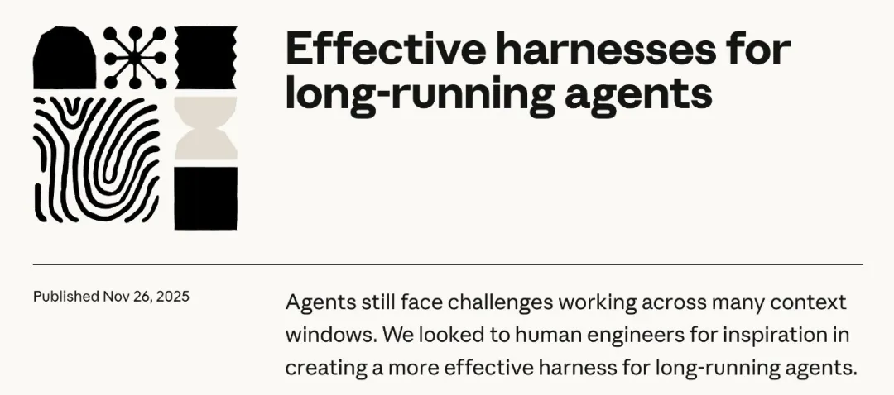
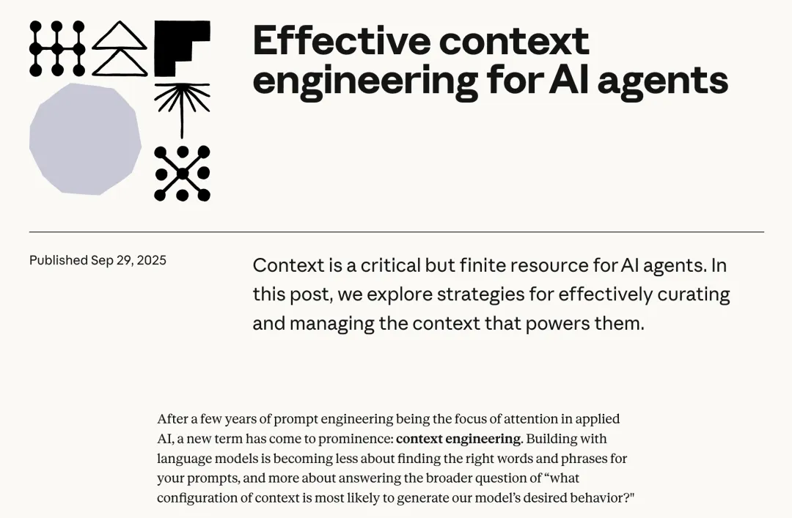
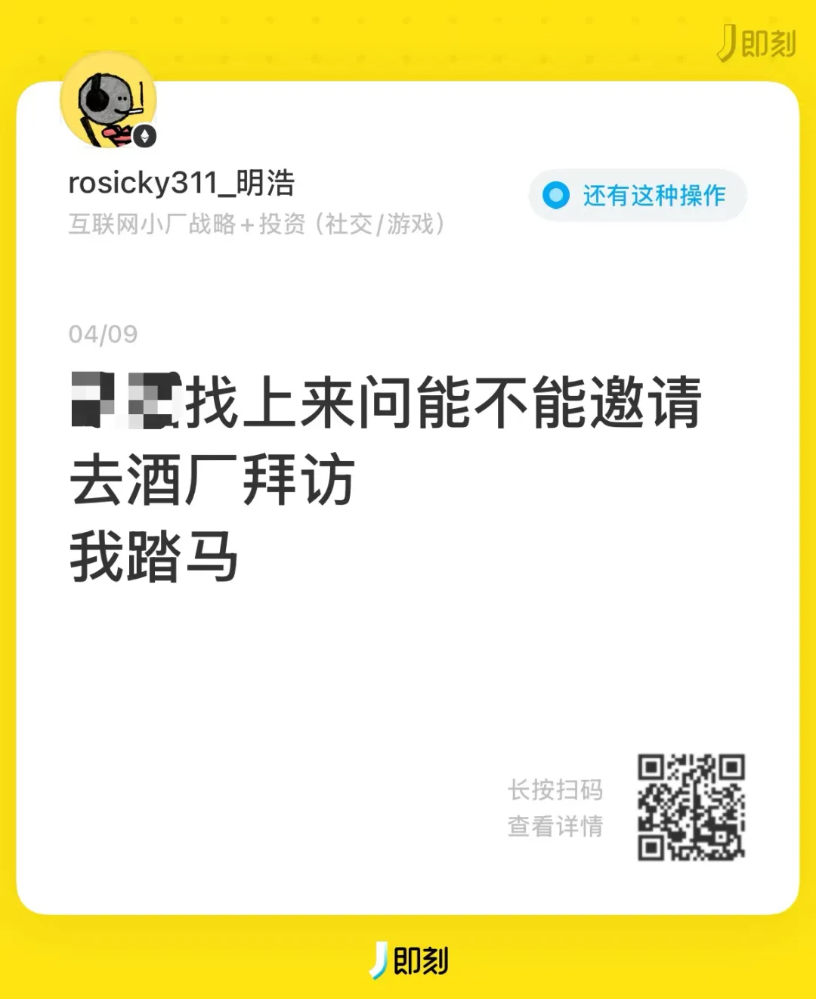

# 踏马的 Agent

**作者**：金色传说大聪明  
**公众号**：赛博禅心  
**发布时间**：2026年4月13日 16:53  
**原文链接**：[踏马的 Agent](https://mp.weixin.qq.com/s/2d8aeSNAZlnQZYr5_sjy7w)

---
🐎🐎🐎

先解释一下标题。Harness 这个词最近在 AI 圈很火，本意是马具，套在马身上让它好好干活

**Agent with harness，也是很踏马的**

踏马的Agent

这篇文章想聊的事情很简单。过去三年，AI 圈先后流行了三个带「Engineering」的词：**Prompt Engineering**、**Context Engineering**、**Harness Engineering**。每一个新词出来的时候，上一个词就显得不够用了

这三次变化背后有一条线，顺着捋一遍，会发现一些有意思的东西

## 先学说话
2023 年 **ChatGPT** 刚火的时候，大家遇到的问题特别朴素：我们其实不太会跟 AI 说话

你随便问它一个问题，它给你一个回答，质量忽高忽低。后来有人发现，你在提示词末尾加一句 `let's think step by step`，模型的推理能力就能明显提升。给几个示例（few-shot），输出格式就能稳定下来。再后来有人总结了一整套方法论，按场景分类，每种场景配一套模板

那个阶段的隐含假设很简单：**模型够聪明，你不会问而已**

在简单任务上，这个假设完全成立。你问一个问题，模型答一个问题，一轮结束。Prompt 写得好就好，写得差就差

但你让模型写一个完整的项目，这套逻辑就开始松了。模型需要知道项目结构、依赖关系、技术栈偏好、现有代码长什么样。这些东西塞不进一句提示词里

会说话是第一课。但光会说话，确实走不太远

## 然后学选信息
2025 年 9 月，Anthropic 发了一篇工程博客，标题叫「Effective context engineering for AI agents」。开头有一句话说得挺直接：构建 AI 应用，越来越不在于找到正确的措辞，越来越在于回答一个更大的问题：**什么样的上下文配置，最可能让模型产生你想要的行为**

这就是从 **Prompt** 到 **Context** 的换挡

Prompt Engineering 关注的是怎么写指令。Context Engineering 关注的是怎么管理模型在推理时能看到的全部信息：系统指令、工具定义、外部数据、对话历史、MCP 接入的各种服务

模型能力在涨。上下文窗口从 4K 到 128K 再到百万 token。RAG 来了，工具调用来了，MCP 来了。模型能接收的信息量大了好几个数量级。相应的，你能塞给它的东西也多了好几个数量级

你会说话了，但给多了它消化不动，给少了它缺信息，给错了更糟糕

**给错了是最要命的**。模型会非常认真地基于错误的上下文，产出一个看起来很对、实际上离谱的结果。它不会告诉你「你给我的信息有问题」，它只会老老实实地用错误的前提推出一个自洽的结论

Anthropic 在那篇博客里说，context 是一种**有限资源**，每一个 token 都有成本。Context Engineering 就是在这个有限窗口里，塞进信号最强的那部分，同时把噪音挡在外面

这个阶段的瓶颈很明确：**人不知道该给什么信息**

Anthropic 的 Context Engineering 博客，2025 年 9 月

## 再然后，发现人才是问题
2025 年 11 月，还是 Anthropic，又发了一篇博客，叫「Effective harnesses for long-running agents」。这篇文章记录了一个有点扎心的发现：即使用他们最好的模型 **Opus 4.5**，配上了上下文管理能力（compaction），让 Agent 在多个上下文窗口里跑长任务，结果还是会出问题。模型要么试图**一次性做完所有事**，要么跑到一半就觉得「差不多了」提前收工

**信息给对了，还是不行**

2026 年 2 月，OpenAI 发了一组博客讲 **Harness Engineering**。他们在内部做了个实验：一个小团队完全不手写代码，靠 Codex Agent 交付了一个大约**一百万行代码**的产品。工程师干的活从写代码变成了别的东西

一开始他们用一个超长的 `AGENTS.md` 文件，把所有规则都写进去告诉 Agent。很快就发现不行。上下文窗口有限，一个大文件把任务本身的空间都挤没了。当所有规则都「重要」的时候，Agent 对哪条规则都不上心

文件很快过时，没人维护，Agent 开始被一堆不再成立的规则误导

后来改了。`AGENTS.md` 缩到 100 行，只当一个目录。架构文档、设计决策、技术规范，全部拆成独立文件，Agent 需要什么就加载什么

但最有意思的变化是**思路上的**

OpenAI 给 Agent 的代码库设了极其严格的**分层依赖规则**。业务代码只能单向调用，越界就被系统切断，合并都合并不进去。Anthropic 在 Harness 里设了**三个角色**：规划师拆需求，生成器写代码，评估器做验收。评估器直接打开产品去点击测试，发现不对直接打回

这些约束有一个共同的特点：**人没有告诉 Agent 应该怎么做，人只告诉它哪里不能做**

想想看，这个转变其实挺微妙的。从「你应该这样写代码」到「你随便写，但这条线不能碰」。从**主动指导**变成**被动约束**。原因说白了就是，人也不知道 Agent 具体每一步应该怎么做，人只知道边界在哪

## 一直都是人的问题
回头看这三个阶段，会发现一个有点尴尬的规律

Prompt Engineering 阶段，人不会跟模型说话。Context Engineering 阶段，人不知道该给模型什么信息。Harness Engineering 阶段，人不知道怎么指挥 Agent 做对，只能划一条线说「这里不许过」

瓶颈从来都在人身上。只是每个阶段的表现形式不一样

模型一代比一代强。从 GPT-3.5 到 GPT-5.4，以及各家的最新版本，能力一直在涨。但更强的模型并没有让问题消失，反而让问题换了个样子出现

Anthropic 升级模型之后发现，之前为了对抗「上下文焦虑」设计的重置机制可以去掉了，新模型自己能处理。但同时冒出来的新能力又需要一套全新的 Harness 来配合

**模型越强，人需要做的事情反而越多。做的事不一样了而已**

从写提示词，到选信息，到设计约束和环境。人的角色在**持续后退**，从前线退到中台，从中台退到后台。但人一直都在，只不过越来越像个吉祥物

## 踏马
回到开头的话题。马具的核心功能就俩：约束和引导。让马的力量朝正确的方向走，同时保护马自己不受伤害

Agent 跑长任务的时候，你冲它吆喝一嗓子（Prompt），它可能跑了，但方向不一定对。你把草料备好、路况摸清、装备配齐（Context），它跑得确实好了一些，但跑远了还是会偏。你给它套上挽具和缰绳（Harness），力量就被物理性地约束在正确的通道里了

最潮的仔，都是踏马的

Minghao 踏马去酒厂

有一家公司做了 **189 年** 的 Harness，叫**爱马仕**。1837 年在巴黎开的马具工坊。他们家创始人有一条产品哲学：「我们的第一个客户是马」。从被约束者的体验出发来设计约束，这条经验放到 Agent 身上一个字不用改

[爱马仕：一家做了 189 年 Harness 的公司](https://mp.weixin.qq.com/s?__biz=MzkzNDQxOTU2MQ==&mid=2247514691&idx=1&sn=4406cd4820293b6328f89794129ce746&scene=21#wechat_redirect)

巧的是，最近 AI 圈还真火了一个叫 **Hermes** 的 Agent。开源的，跑在你自己的服务器上，slogan 写的是「an agent that grows with you」

Agent with harness，也是很踏马的

说不准半年之后又会冒出一个新的带 Engineering 的词，到时候再来是哪种新马具

---

> ⚠️ 以下图片未能从正文 HTML 中定位，按下载顺序追加：

